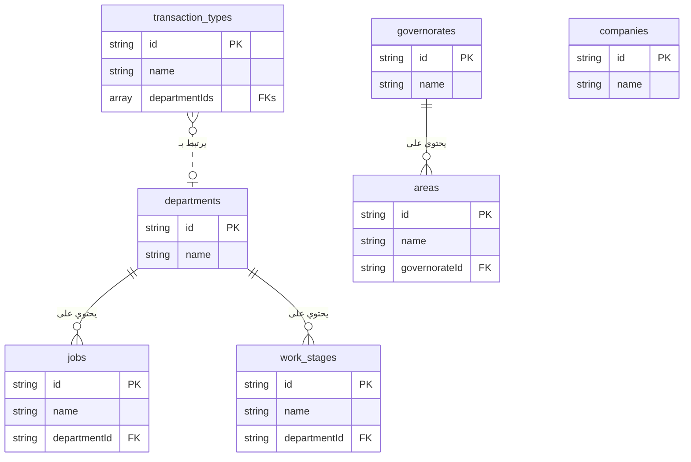

# Project Code Dump

This file contains the complete code for all files in the project, generated upon user request. This is a comprehensive snapshot of the application's source code, intended for easy review and copying.

---
## File: `.env`
```

```

---
## File: `README.md`
```md
# Firebase Studio
whoami
This is a NextJS starter in Firebase Studio.

To get started, take a look at src/app/page.tsx.

```

---
## File: `apphosting.yaml`
```yaml
# Settings to manage and configure a Firebase App Hosting backend.
# https://firebase.google.com/docs/app-hosting/configure

runConfig:
  # Increase this value if you'd like to automatically spin up
  # more instances in response to increased traffic.
  maxInstances: 1

```

---
## File: `components.json`
```json
{
  "$schema": "https://ui.shadcn.com/schema.json",
  "style": "default",
  "rsc": true,
  "tsx": true,
  "tailwind": {
    "config": "tailwind.config.ts",
    "css": "src/app/globals.css",
    "baseColor": "neutral",
    "cssVariables": true,
    "prefix": ""
  },
  "aliases": {
    "components": "@/components",
    "utils": "@/lib/utils",
    "ui": "@/components/ui",
    "lib": "@/lib",
    "hooks": "@/hooks"
  },
  "iconLibrary": "lucide"
}

```

---
## File: `docs/accounting-features.md`
```md
# وحدة المحاسبة المتكاملة: شرح شامل

هذا المستند يوضح جميع المميزات والعمليات في قسم المحاسبة.

### 1. شجرة الحسابات (Chart of Accounts)
- **المصدر:** `src/app/dashboard/accounting/chart-of-accounts/page.tsx`
- **الوصف:** هي أساس النظام المحاسبي. يمكنك إضافة، تعديل، وحذف الحسابات. النظام يأتي مع شجرة حسابات أساسية يمكنك تنزيلها كنقطة بداية.

### 2. قيود اليومية (Journal Entries)
- **المصدر:** `src/app/dashboard/accounting/journal-entries/`
- **الوصف:** يمكنك إنشاء قيود يدوية أو الاعتماد على القيود التلقائية التي ينشئها النظام (مثل عند إنشاء عقد). تتبع القيود دورة عمل (مسودة -> مرحّل).
- **المساعد المحاسبي الذكي:**
    - **المصدر:** `src/app/dashboard/accounting/assistant/page.tsx`
    - **الوصف:** مساعد ذكاء اصطناعي يفهم الأوامر المحاسبية باللغة العربية ويحولها إلى قيود يومية جاهزة للحفظ.

### 3. السندات (Vouchers)
- **سندات القبض:**
    - **شرح مفصل:** `docs/cash-receipts-features.md`
    - **المصدر:** `src/app/dashboard/accounting/cash-receipts/`
    - **الوصف:** إنشاء سندات قبض مع ترقيم تلقائي، ربط بالعقود، وتوليد ذكي لوصف الدفعة.
- **سندات الصرف:**
    - **المصدر:** `src/app/dashboard/accounting/payment-vouchers/`
    - **الوصف:** إنشاء سندات صرف لتسجيل المدفوعات للموردين والموظفين.

### 4. عروض الأسعار والعقود (Quotations & Contracts)
- **المصدر:** `src/app/dashboard/accounting/quotations/` و `src/components/clients/contract-clauses-form.tsx`
- **الوصف:** يمكنك إنشاء عروض أسعار للعملاء. عند قبول عرض السعر، يمكنك تحويله مباشرة إلى عقد مفصل داخل معاملة العميل، مما يضمن ربط البيانات المالية بالعمليات.

### 5. القوائم المالية (IFRS Compliant)
- **قائمة الدخل (Income Statement):**
    - **المصدر:** `src/app/dashboard/accounting/income-statement/page.tsx`
    - **الوصف:** تعرض الإيرادات والمصروفات وصافي الربح، مع فصل "تكلفة الإيرادات" لعرض "مجمل الربح" بشكل واضح.
- **قائمة المركز المالي (Balance Sheet):**
    - **المصدر:** `src/app/dashboard/accounting/balance-sheet/page.tsx`
    - **الوصف:** تعرض الأصول والالتزامات وحقوق الملكية، مع تصنيفها إلى "متداولة" و "غير متداولة" وفقًا للمعايير الدولية.
- **قائمة التدفقات النقدية (Cash Flow Statement):**
    - **المصدر:** `src/app/dashboard/accounting/cash-flow/page.tsx`
    - **الوصف:** تُعد بالطريقة غير المباشرة، حيث تبدأ بصافي الربح وتعدله للوصول إلى صافي التدفق النقدي.
- **قائمة التغير في حقوق الملكية (Statement of Changes in Equity):**
    - **المصدر:** `src/app/dashboard/accounting/equity-statement/page.tsx`
    - **الوصف:** توضح كيف تغيرت حقوق الملاك خلال الفترة، بربط رصيد البداية بصافي الربح للوصول إلى رصيد النهاية.
- **الإيضاحات المتممة (Financial Statement Notes):**
    - **المصدر:** `src/app/dashboard/accounting/financial-statement-notes/page.tsx`
    - **الوصف:** صفحة تحتوي على محرر نصوص لحفظ الشروحات والتفاصيل الإضافية المطلوبة للقوائم المالية.

### 6. التنبؤ المالي (Financial Forecast)
- **المصدر:** `src/app/dashboard/accounting/financial-forecast/page.tsx`
- **الوصف:** أداة تعتمد على بيانات العقود والمصاريف الثابتة لتقديم توقعات مستقبلية للإيرادات والمصروفات.
```

---
## File: `docs/appointment-details-features.md`
```md
# صفحة تفاصيل الزيارة: شرح شامل للإجراءات

بناءً على طلبك، هذا شرح مفصل لجميع الإجراءات والعمليات التي يمكنك القيام بها من داخل صفحة "تفاصيل الزيارة"، والتي تعتبر مركز التحكم لكل موعد.

---

### 1. ربط الزيارة بمعاملة (للمواعيد غير المرتبطة)

*   **الحالة:** عندما تقوم بحجز موعد لعميل مسجل دون تحديد معاملة معينة.
*   **الإجراء:** ستظهر لك قائمة بجميع "المعاملات الداخلية" الخاصة بهذا العميل. يمكنك اختيار المعاملة الصحيحة (مثل "تصميم بلدية") وربط الزيارة بها.
*   **الفائدة:** هذا الربط ضروري لتتمكن من تحديث مراحل سير العمل الخاصة بالمعاملة بشكل صحيح.

### 2. تحديث مرحلة العمل (الإجراء الأساسي)

هذا هو الإجراء الأهم في صفحة الزيارة، وهو إلزامي لإغلاق الزيارة.

*   **الحالة:** بعد ربط الزيارة بمعاملة، أو إذا كانت مرتبطة بالفعل.
*   **الإجراء:**
    1.  ستظهر لك قائمة منسدلة تحتوي على "مراحل العمل" المتاحة في سير عمل المعاملة.
    2.  اختر المرحلة التي وصل إليها العميل أو التي تم إنجازها خلال هذه الزيارة.
*   **المنطق الذكي:**
    *   **تحديث تلقائي:** بمجرد اختيارك للمرحلة، يقوم النظام تلقائيًا بتحديث حالة سير عمل المعاملة.
    *   **تفعيل الدفعات:** إذا كان إكمال هذه المرحلة مرتبطًا باستحقاق دفعة مالية في العقد، سيقوم النظام تلقائيًا بتغيير حالة الدفعة من "غير مستحقة" إلى "مستحقة".
    *   **توثيق فوري:** يتم تسجيل هذا الإجراء فورًا في "سجل أحداث المعاملة" وفي "سجل تغييرات العميل" لضمان الشفافية الكاملة.
*   **صلاحية التعديل (للمدير فقط):** إذا تم اختيار مرحلة بالخطأ، يمكن للمدير فقط تعديلها. يقوم النظام تلقائيًا بالتراجع عن كل الإجراءات المرتبطة بالمرحلة الخاطئة (مثل حالة الدفعة).

### 3. تسجيل "تعديل" على مرحلة حالية

*   **الحالة:** إذا كانت المرحلة الحالية للمعاملة (قيد التنفيذ) هي من النوع الذي يقبل تسجيل تعديلات (مثل مرحلة "تعديلات المالك").
*   **الإجراء:** سيظهر لك زر خاص "تسجيل تعديل جديد". عند الضغط عليه، يقوم النظام بالآتي:
    1.  زيادة عداد "التعديلات" لهذه المرحلة في سجل المعاملة.
    2.  توثيق هذا الإجراء في سجل الأحداث.
*   **الفائدة:** تساعد هذه الميزة في تتبع عدد مرات طلب التعديلات من قبل العميل على مرحلة معينة، مما يوفر رؤى حول كفاءة العمل.

### 4. كتابة ملخص الزيارة (محضر الاجتماع)

*   **الحالة:** بعد أن تقوم بتحديث مرحلة العمل للزيارة.
*   **الإجراء:** سيظهر لك مربع نص لكتابة ملخص لما دار في الزيارة، النقاط التي تم الاتفاق عليها، والمهام المطلوبة للمتابعة.
*   **التكامل:**
    *   يتم حفظ هذا الملخص مع بيانات الزيارة.
    *   الأهم من ذلك، يتم إضافته **كتعليق تلقائي** في "التايم لاين" الخاص بالمعاملة، ليطلع عليه جميع المهندسين المعنيين.

### 5. التعامل مع العملاء المحتملين (غير المسجلين)

*   **الحالة:** عندما يكون الموعد لعميل غير مسجل (تم إدخال اسمه ورقم جواله يدويًا).
*   **الإجراء:**
    1.  **إنشاء ملف:** سيظهر لك زر "إنشاء ملف عميل". بالضغط عليه، سيتم نقلك إلى شاشة عميل جديد مع تعبئة الاسم والجوال تلقائيًا.
    2.  **الربط التلقائي:** بمجرد إنشاء الملف، سيقوم النظام تلقائيًا بربط هذا الموعد وجميع المواعيد المستقبلية التي تحمل نفس رقم الجوال بملف العميل الجديد.

### 6. إغلاق الزيارة

*   **الحالة:** لا يمكنك إغلاق الزيارة والعودة للتقويم إلا **بعد** تحديث مرحلة العمل أو **تسجيل تعديل**.
*   **الإجراء:** بمجرد القيام بأحد الإجراءين أعلاه، سيتم تفعيل زر "إغلاق الزيارة"، ويمكنك العودة للتقويم لمتابعة عملك. هذا يضمن عدم ترك أي زيارة بدون توثيق الإجراء الذي تم فيها.

    
```

---
## File: `docs/appointments-features.md`
```md
# نظام المواعيد الذكي: شرح شامل للمميزات

بناءً على طلبك، إليك شرح مفصل ومبسط لجميع المميزات التي قمنا بتطويرها في نظام إدارة المواعيد، والذي تم تصميمه ليكون دقيقًا، ذكيًا، وسهل الاستخدام.

---

### 1. نظام تقويم مزدوج ومتخصص

تم فصل المواعيد إلى قسمين رئيسيين لتنظيم العمل ومنع التداخل:

*   **جدول القسم المعماري:** مخصص حصريًا لزيارات العملاء مع مهندسي القسم المعماري. يتم عرضه كشبكة زمنية تُظهر حجوزات كل مهندس على حدة.
*   **جدول حجوزات القاعات:** مخصص لحجز قاعات الاجتماعات لمواعيد الأقسام الهندسية الأخرى (كهرباء، إنشائي، إلخ). يتم عرضه كشبكة زمنية تُظهر حجوزات كل قاعة على حدة.

### 2. منطق حجز ذكي لمنع التعارض (Real-time Conflict Detection)

أهم ميزة في النظام هي قدرته على منع الأخطاء البشرية عند حجز المواعيد. قبل حفظ أي موعد جديد أو تعديل، يقوم النظام بالتحقق الفوري من وجود أي تعارض في:

*   **وقت المهندس:** لا يمكن حجز موعدين لنفس المهندس في نفس الفترة الزمنية، حتى لو كان أحدهما في جدول القسم المعماري والآخر في جدول حجوزات القاعات.
*   **وقت العميل:** لا يمكن حجز موعدين لنفس العميل في نفس الفترة.
*   **وقت القاعة:** لا يمكن حجز نفس قاعة الاجتماعات في نفس الوقت.

في حال وجود أي تعارض، يرفض النظام الحفظ ويعرض رسالة تنبيه واضحة.

### 3. نظام تلوين ديناميكي لزيارات القسم المعماري

لتسهيل متابعة حالة العميل بلمحة بصر، تم تصميم نظام ألوان ذكي لمواعيد القسم المعماري:

*   **اللون الأصفر:** يُخصص دائمًا **للموعد الأقدم زمنيًا** للعميل، مما يدل على أنها الزيارة الأولى.
*   **اللون الأخضر:** يُخصص لأي زيارة تالية (الثانية، الثالثة، إلخ) **طالما أن العميل لم يوقع العقد بعد**.
*   **اللون الأزرق:** بمجرد توقيع العقد، تتحول جميع الزيارات التالية للزيارة الأولى إلى اللون الأزرق تلقائيًا.

### 4. عداد الزيارات التلقائي

بجانب اسم العميل في كل موعد معماري، يعرض النظام تلقائيًا رقم الزيارة (مثال: "الزيارة رقم 3"). هذا الرقم ليس ثابتًا، بل هو ديناميكي وذكي.

### 5. نظام تصحيح ذاتي للبيانات

هذه هي الميزة الأكثر قوة. عند **إلغاء أي موعد**، يقوم النظام تلقائيًا بالآتي:

1.  **تغيير الحالة:** يقوم النظام بتغيير حالة الموعد إلى "ملغي" بدلاً من حذفه نهائياً، مما يحافظ على السجل التاريخي.
2.  **إعادة الترقيم:** يعيد ترقيم جميع الزيارات **غير الملغاة** المتبقية للعميل بشكل صحيح. فإذا قمت بإلغاء الزيارة رقم 2، ستصبح الزيارة رقم 3 هي الزيارة رقم 2 الجديدة.
3.  **إعادة التلوين:** بناءً على الترقيم الجديد، يعيد النظام تلوين جميع المواعيد لتعكس الحالة الصحيحة (الموعد الأقدم يصبح أصفر، والبقية أخضر أو أزرق).

هذا يضمن أن البيانات المعروضة دقيقة وموثوقة بنسبة 100% في جميع الأوقات.

### 6. تخصيص كامل لأوقات الدوام

*   **مرونة كاملة:** من صفحة الإعدادات، يمكنك تحديد أوقات الدوام المختلفة لكل من القسم المعماري والقاعات العامة.
*   **إدارة العطلات:** يمكنك تحديد أيام العطلة الأسبوعية، وحتى تحديد يوم نصف دوام مع وقت انصراف مبكر.
*   **فترة راحة:** يمكنك إضافة فترة راحة (Buffer) بالدقائق بين المواعيد لتجنب التداخل وضمان سلاسة العمل.

### 7. تصميم متجاوب لجميع الأجهزة

تم تصميم واجهة المواعيد لتعمل بسلاسة على جميع الأجهزة، بما في ذلك:

*   شاشات الكمبيوتر المكتبية الكبيرة.
*   الأجهزة اللوحية (آيباد، وغيرها).
*   الهواتف الذكية.

تتكيف الجداول والنوافذ تلقائيًا مع حجم الشاشة لضمان تجربة استخدام سهلة ومريحة في أي مكان.

### 8. طباعة الجداول اليومية

يمكنك بسهولة طباعة جدول المواعيد اليومي لأي من القسمين (المعماري أو حجوزات القاعات) بتنسيق PDF واضح ومناسب للمشاركة أو الأرشفة.
```

---
## File: `docs/backend.json`
```json
{
  "entities": {
    "CompanyBranding": {
      "title": "Company Branding",
      "description": "Stores the company's branding information for letterheads and general UI.",
      "type": "object",
      "properties": {
        "company_name": {
          "type": "string",
          "description": "The full name of the company."
        },
        "address": {
          "type": "string",
          "description": "The company's contact address."
        },
        "phone": {
          "type": "string",
          "description": "The company's contact phone number."
        },
        "email": {
          "type": "string",
          "format": "email",
          "description": "The company's contact email address."
        },
        "tax_number": {
            "type": "string",
            "description": "The company's tax identification number."
        },
        "letterhead_text": {
          "type": "string",
          "description": "Additional text to display on the letterhead."
        },
        "logo_url": {
            "type": "string",
            "format": "uri",
            "description": "URL to the company's logo."
        },
        "letterhead_image_url": {
            "type": "string",
            "format": "uri",
            "description": "URL to the company's full letterhead image."
        },
        "footer_image_url": {
            "type": "string",
            "format": "uri",
            "description": "URL to the company's footer image."
        },
        "watermark_image_url": {
            "type": "string",
            "format": "uri",
            "description": "URL to a watermark image for printable documents."
        },
        "system_background_url": {
            "type": "string",
            "format": "uri",
            "description": "URL for the background image of the system pages."
        },
        "financial_statement_notes": {
            "type": "string",
            "description": "The full text content for the notes to the financial statements."
        },
        "work_hours": {
            "type": "object",
            "description": "Defines the company's working hours, holidays, and appointment settings.",
            "properties": {
                "general": {
                    "type": "object",
                    "description": "General working hours for meeting rooms and other departments.",
                    "properties": {
                        "morning_start_time": { "type": "string", "description": "e.g., '08:00'" },
                        "morning_end_time": { "type": "string", "description": "e.g., '12:00'" },
                        "evening_start_time": { "type": "string", "description": "e.g., '13:00'" },
                        "evening_end_time": { "type": "string", "description": "e.g., '17:00'" },
                        "appointment_slot_duration": { "type": "number", "description": "Duration in minutes, e.g., 30" },
                        "appointment_buffer_time": { "type": "number", "description": "Break time in minutes between appointments." }
                    }
                },
                "architectural": {
                    "type": "object",
                    "description": "Specific working hours for the architectural department.",
                    "properties": {
                        "morning_start_time": { "type": "string" },
                        "morning_end_time": { "type": "string" },
                        "evening_start_time": { "type": "string" },
                        "evening_end_time": { "type": "string" },
                        "appointment_slot_duration": { "type": "number" },
                        "appointment_buffer_time": { "type": "number", "description": "Break time in minutes between appointments." }
                    }
                },
                "ramadan": {
                    "type": "object",
                    "description": "Defines special working hours for the month of Ramadan.",
                    "properties": {
                        "is_enabled": { "type": "boolean", "description": "Enable/disable special Ramadan timings." },
                        "start_date": { "type": "string", "format": "date", "description": "Start date of Ramadan for the current year." },
                        "end_date": { "type": "string", "format": "date", "description": "End date of Ramadan for the current year." },
                        "start_time": { "type": "string", "description": "e.g., '09:30'" },
                        "end_time": { "type": "string", "description": "e.g., '15:30'" },
                        "appointment_slot_duration": { "type": "number" },
                        "appointment_buffer_time": { "type": "number" }
                    }
                },
                "holidays": {
                    "type": "array",
                    "description": "Weekly holidays.",
                    "items": { "type": "string", "enum": ["Sunday", "Monday", "Tuesday", "Wednesday", "Thursday", "Friday", "Saturday"] }
                },
                "half_day": {
                    "type": "object",
                    "description": "Defines a weekly half-day.",
                    "properties": {
                        "day": { "type": "string", "enum": ["", "Sunday", "Monday", "Tuesday", "Wednesday", "Thursday", "Friday", "Saturday"] },
                        "type": { "type": "string", "enum": ["morning_only", "custom_end_time"] },
                        "end_time": { "type": "string", "description": "e.g., '13:00'" }
                    }
                }
            }
        }
      },
      "required": ["company_name"]
    },
    "UserProfile": {
      "title": "User Profile",
      "description": "Represents a user's login account in the system.",
      "type": "object",
      "properties": {
        "uid": {
          "type": "string",
          "description": "The unique user ID from Firebase Authentication."
        },
        "username": {
          "type": "string",
          "description": "The user's unique username for login."
        },
        "email": {
          "type": "string",
          "format": "email",
          "description": "Auto-generated internal email address (e.g., username@scoop.local)."
        },
        "passwordHash": {
          "type": "string",
          "description": "The securely hashed password for the user. Hashing should be done server-side."
        },
        "employeeId": {
          "type": "string",
          "description": "A reference to the corresponding document ID in the 'employees' collection."
        },
        "role": {
          "type": "string",
          "description": "The user's role in the system.",
          "enum": ["Admin", "Secretary", "Accountant", "Engineer", "HR"]
        },
        "isActive": {
          "type": "boolean",
          "description": "Whether the user's account is active and can log in."
        },
        "createdAt": {
          "type": "string",
          "format": "date-time",
          "description": "The timestamp when the user account was created."
        },
        "activatedAt": {
          "type": "string",
          "format": "date-time",
          "description": "The timestamp when the user account was last activated."
        },
        "createdBy": {
            "type": "string",
            "description": "The user ID of the admin who created this account."
        }
      },
      "required": [
        "username",
        "email",
        "passwordHash",
        "employeeId",
        "role",
        "isActive",
        "createdAt",
        "createdBy"
      ]
    },
    "Client": {
      "title": "Client",
      "description": "Represents a client of the consultancy.",
      "type": "object",
      "properties": {
        "fileId": {
          "type": "string",
          "description": "The client's file ID, in the format 'sequence/year' (e.g., '1/2024')."
        },
        "fileNumber": {
          "type": "number",
          "description": "The sequential part of the client's file ID for a given year."
        },
        "fileYear": {
          "type": "number",
          "description": "The year of the client's file ID."
        },
        "nameAr": {
            "type": "string",
            "description": "The full name of the client in Arabic."
        },
        "nameEn": {
            "type": "string",
            "description": "The full name of the client in English."
        },
        "mobile": {
          "type": "string",
          "description": "The client's mobile phone number."
        },
        "civilId": {
            "type": "string",
            "description": "The client's Civil ID number."
        },
        "plotNumber": {
            "type": "string",
            "description": "The client's plot number for contracts."
        },
        "address": {
            "type": "object",
            "description": "The client's address.",
            "properties": {
                "governorate": { "type": "string" },
                "area": { "type": "string" },
                "block": { "type": "string" },
                "street": { "type": "string" },
                "houseNumber": { "type": "string" }
            }
        },
        "status": {
          "type": "string",
          "description": "The current status of the client's file.",
          "enum": [
            "new",
            "contracted",
            "cancelled",
            "reContracted"
          ]
        },
        "transactionCounter": {
            "type": "number",
            "description": "A counter for the number of transactions created for this client, used to generate sequential transaction numbers."
        },
        "assignedEngineer": {
          "type": "string",
          "description": "The ID of the engineer assigned to this client."
        },
        "createdAt": {
          "type": "string",
          "format": "date-time",
          "description": "The timestamp when the client was created."
        },
        "isActive": {
          "type": "boolean",
          "description": "Whether the client is active."
        }
      },
      "required": [
        "fileId",
        "fileNumber",
        "fileYear",
        "nameAr",
        "mobile",
        "status",
        "createdAt",
        "isActive"
      ]
    },
    "ClientTransaction": {
        "title": "Client Transaction",
        "description": "Represents an internal service or transaction for a client, like a design submission.",
        "type": "object",
        "properties": {
            "transactionNumber": {
              "type": "string",
              "description": "A unique, human-readable, sequential transaction number for the client (e.g., CL123-TX01)."
            },
            "clientId": { "type": "string", "description": "The ID of the client this transaction belongs to." },
            "transactionType": { "type": "string", "description": "The type of transaction, e.g., 'Municipality Design', 'Electricity Design'." },
            "description": { "type": "string", "description": "A brief description of the transaction." },
            "departmentId": { "type": "string", "description": "The ID of the primary department for this transaction." },
            "transactionTypeId": { "type": "string", "description": "The ID of the transaction type." },
            "status": {
                "type": "string",
                "description": "The current status of the transaction.",
                "enum": ["new", "in-progress", "completed", "submitted", "on-hold"]
            },
            "assignedEngineerId": { "type": "string", "description": "The ID of the primary engineer assigned to this transaction." },
            "createdAt": { "type": "string", "format": "date-time" },
            "updatedAt": { "type": "string", "format": "date-time" },
            "stages": {
                "type": "array",
                "description": "The lifecycle stages of the transaction.",
                "items": { "$ref": "#/entities/TransactionStage" }
            },
            "contract": {
                "type": "object",
                "description": "Stores the customized contract clauses and total amount for this specific transaction.",
                "properties": {
                    "clauses": {
                        "type": "array",
                        "items": {
                            "type": "object",
                            "properties": {
                                "id": { "type": "string" },
                                "name": { "type": "string" },
                                "amount": { "type": "number" },
                                "status": { "type": "string", "enum": ["مدفوعة", "مستحقة", "غير مستحقة"] },
                                "percentage": { "type": "number", "description": "The original percentage value if the financial type was 'percentage'."}
                            },
                            "required": ["id", "name", "amount", "status"]
                        }
                    },
                    "termsAndConditions": {
                      "type": "array",
                      "items": {
                        "type": "object",
                        "properties": { "id": { "type": "string" }, "text": { "type": "string" } },
                        "required": ["id", "text"]
                      }
                    },
                    "openClauses": {
                      "type": "array",
                      "items": {
                        "type": "object",
                        "properties": { "id": { "type": "string" }, "text": { "type": "string" } },
                        "required": ["id", "text"]
                      }
                    },
                    "totalAmount": { "type": "number" },
                    "financialsType": { "type": "string", "enum": ["fixed", "percentage"] }
                },
                "required": ["clauses", "totalAmount"]
            }
        },
        "required": ["transactionNumber", "clientId", "transactionType", "status", "createdAt"]
    },
    "TransactionAssignment": {
        "title": "Transaction Assignment",
        "description": "Represents an assignment or forwarding of a transaction to a specific department and engineer.",
        "type": "object",
        "properties": {
            "transactionId": {
                "type": "string",
                "description": "The ID of the parent ClientTransaction."
            },
            "clientId": {
                "type": "string",
                "description": "The ID of the client."
            },
            "departmentId": { "type": "string" },
            "departmentName": { "type": "string" },
            "engineerId": { "type": "string" },
            "notes": { "type": "string" },
            "status": {
                "type": "string",
                "enum": ["pending", "in-progress", "completed"]
            },
            "createdAt": {
                "type": "string",
                "format": "date-time"
            },
            "createdBy": {
                "type": "string",
                "description": "The ID of the user who created the assignment."
            }
        },
        "required": [
            "transactionId",
            "clientId",
            "departmentId",
            "departmentName",
            "status",
            "createdAt",
            "createdBy"
        ]
    },
    "TransactionTimelineEvent": {
      "title": "Transaction Timeline Event",
      "description": "Represents a single event (comment or log) in a transaction's history.",
      "type": "object",
      "properties": {
        "type": {
          "type": "string",
          "enum": [ "comment", "log" ],
          "description": "The type of event."
        },
        "content": {
          "type": "string",
          "description": "The content of the comment or the description of the log."
        },
        "userId": {
          "type": "string",
          "description": "The ID of the user who created the event."
        },
        "userName": {
          "type": "string",
          "description": "The name of the user who created the event."
        },
        "userAvatar": {
          "type": "string",
          "format": "uri",
          "description": "URL to the user's avatar image."
        },
        "createdAt": {
          "type": "string",
          "format": "date-time"
        }
      },
      "required": [ "type", "content", "userId", "userName", "createdAt" ]
    },
    "TransactionStage": {
      "title": "Transaction Stage",
      "description": "Tracks the progress of a single stage within a client transaction's lifecycle. It is linked to a reference WorkStage via stageId.",
      "type": "object",
      "properties": {
        "stageId": { "type": "string", "description": "The ID of the reference WorkStage document from the department's workStages subcollection." },
        "name": { "type": "string", "description": "Name of the stage, stored for convenience. The name in the reference data is the source of truth." },
        "order": { "type": "number", "description": "The display and logical order of the stage, copied from the template." },
        "status": {
          "type": "string",
          "enum": ["pending", "in-progress", "completed", "skipped", "awaiting-review"],
          "description": "The current status of the stage."
        },
        "allowedRoles": {
            "type": "array",
            "description": "The job titles responsible for this stage, copied from the WorkStage template.",
            "items": { "type": "string" }
        },
        "stageType": {
          "type": "string",
          "enum": ["sequential", "parallel"],
          "description": "'sequential' for main workflow steps, 'parallel' for service stages like modifications that can run alongside."
        },
        "nextStageIds": {
            "type": "array",
            "description": "A list of possible next stage IDs to transition to from this stage.",
            "items": { "type": "string" }
        },
        "allowedDuringStages": {
            "type": "array",
            "description": "For parallel stages only. A list of sequential stage IDs during which this parallel stage can be initiated.",
            "items": { "type": "string" }
        },
        "trackingType": {
          "type": "string",
          "enum": ["duration", "occurrence", "none"],
          "description": "The tracking type of the stage, copied from the template."
        },
        "expectedDurationDays": {
            "type": ["number", "null"],
            "description": "The expected duration in days for this stage (if trackingType is 'duration')."
        },
        "maxOccurrences": {
            "type": ["number", "null"],
            "description": "The maximum number of times this stage can occur (if trackingType is 'occurrence')."
        },
        "allowManualCompletion": {
            "type": "boolean",
            "description": "If true, allows manually completing an 'occurrence' stage before reaching its max count."
        },
        "modificationCount": {
            "type": ["number", "null"],
            "description": "How many times a modification has been recorded for this stage."
        },
        "startDate": { "type": ["string", "null"], "format": "date-time", "description": "When the stage started." },
        "endDate": { "type": ["string", "null"], "format": "date-time", "description": "When the stage was completed." },
        "expectedEndDate": { "type": ["string", "null"], "format": "date-time", "description": "The expected completion date for countdowns." },
        "notes": { "type": ["string", "null"], "description": "Notes specific to this stage." },
        "completedCount": { "type": ["number", "null"], "description": "How many times this stage has been completed (if trackingType is 'occurrence')."}
      },
      "required": ["stageId", "name", "status"]
    },
    "Counter": {
      "title": "Counter",
      "description": "Stores sequential counters for various entities.",
      "type": "object",
      "properties": {
        "counts": {
          "type": "object",
          "description": "A map of keys (e.g., years) to their current count."
        }
      }
    },
    "Employee": {
      "title": "Employee",
      "description": "Represents an employee in the company.",
      "properties": {
        "employeeNumber": { "type": "string", "description": "The unique identifying number for the employee." },
        "fullName": { "type": "string", "description": "Employee's name in Arabic." },
        "nameEn": { "type": "string", "description": "Employee's name in English." },
        "dob": { "type": "string", "format": "date", "description": "Date of birth." },
        "gender": { "type": "string", "enum": ["male", "female"] },
        "civilId": { "type": "string" },
        "nationality": { "type": "string", "description": "The employee's nationality." },
        "residencyExpiry": { "type": "string", "format": "date" },
        "contractExpiry": { "type": "string", "format": "date" },
        "mobile": { "type": "string" },
        "emergencyContact": { "type": "string" },
        "email": { "type": "string", "format": "email" },
        "jobTitle": { "type": "string" },
        "position": { "type": "string", "enum": ["head", "employee", "assistant", "contractor"] },
        "workStartTime": { "type": "string", "description": "The official start time for the employee's shift (e.g., '08:00')." },
        "workEndTime": { "type": "string", "description": "The official end time for the employee's shift (e.g., '17:00')." },
        "salaryPaymentType": { "type": "string", "enum": ["cash", "cheque", "transfer"] },
        "bankName": { "type": "string" },
        "accountNumber": { "type": "string" },
        "iban": { "type": "string" },
        "profilePicture": { "type": "string", "format": "uri" },
        "hireDate": { "type": "string", "format": "date-time" },
        "noticeStartDate": { "type": ["string", "null"], "format": "date-time", "description": "Date when resignation/termination notice was given." },
        "terminationDate": { "type": ["string", "null"], "format": "date-time" },
        "terminationReason": { "type": "string", "enum": ["resignation", "termination", null] },
        "contractType": { "type": "string", "enum": ["permanent", "temporary", "subcontractor", "percentage", "part-time"] },
        "contractPercentage": { "type": "number", "description": "The percentage of contract value for commission-based employees." },
        "department": { "type": "string" },
        "basicSalary": { "type": "number" },
        "housingAllowance": { "type": "number" },
        "transportAllowance": { "type": "number" },
        "status": { "type": "string", "enum": ["active", "on-leave", "terminated"] },
        "lastVacationAccrualDate": { "type": "string", "format": "date-time" },
        "annualLeaveAccrued": { "type": "number" },
        "annualLeaveUsed": { "type": "number" },
        "carriedLeaveDays": { "type": "number" },
        "sickLeaveUsed": { "type": "number" },
        "emergencyLeaveUsed": { "type": "number" },
        "maxEmergencyLeave": { "type": "number" },
        "lastLeaveResetDate": { "type": "string", "format": "date-time" },
        "annualLeaveBalance": { "type": "number", "description": "Calculated current annual leave balance." },
        "createdAt": { "type": "string", "format": "date-time" }
      },
      "required": [
        "employeeNumber",
        "fullName",
        "nameEn",
        "civilId",
        "mobile",
        "department",
        "jobTitle",
        "hireDate",
        "contractType",
        "basicSalary",
        "status"
      ]
    },
    "LeaveRequest": {
        "title": "Leave Request",
        "description": "Represents a leave request submitted by an employee.",
        "type": "object",
        "properties": {
            "employeeId": { "type": "string", "description": "ID of the employee requesting leave." },
            "employeeName": { "type": "string", "description": "Full name of the employee." },
            "leaveType": { "type": "string", "enum": ["Annual", "Sick", "Emergency", "Unpaid"] },
            "startDate": { "type": "string", "format": "date-time" },
            "endDate": { "type": "string", "format": "date-time" },
            "days": { "type": "number", "description": "Total number of leave days." },
            "workingDays": { "type": "number", "description": "Total number of calculated working days." },
            "notes": { "type": "string", "description": "Reason or notes for the leave." },
            "attachmentUrl": { "type": "string", "format": "uri", "description": "URL to a medical report or other document." },
            "status": { "type": "string", "enum": ["pending", "approved", "rejected"], "description": "The current status of the leave request." },
            "createdAt": { "type": "string", "format": "date-time" },
            "approvedBy": { "type": "string", "description": "UID of the user who approved/rejected the request." },
            "approvedAt": { "type": "string", "format": "date-time" },
            "rejectionReason": { "type": "string", "description": "Reason for rejecting the leave request." },
            "isBackFromLeave": { "type": "boolean", "description": "Indicates if the employee has returned from this specific leave." },
            "actualReturnDate": { "type": "string", "format": "date-time", "description": "The actual date the employee returned to work." }
        },
        "required": ["employeeId", "employeeName", "leaveType", "startDate", "endDate", "days", "status", "createdAt"]
    },
    "Holiday": {
        "title": "Holiday",
        "description": "Represents an official public holiday.",
        "type": "object",
        "properties": {
            "name": { "type": "string", "description": "The name of the holiday." },
            "date": { "type": "string", "format": "date", "description": "The date of the holiday." }
        },
        "required": ["name", "date"]
    },
    "AuditLog": {
        "title": "Audit Log",
        "description": "Records changes made to employee data for historical tracking.",
        "type": "object",
        "properties": {
            "changeType": { "type": "string", "enum": ["Creation", "SalaryChange", "JobChange", "DataUpdate", "StatusChange", "ResidencyUpdate"] },
            "field": { "type": "string", "description": "The name of the field that was changed." },
            "oldValue": { "description": "The value of the field before the change." },
            "newValue": { "description": "The value of the field after the change." },
            "effectiveDate": { "type": "string", "format": "date-time", "description": "The date when this change becomes effective." },
            "changedBy": { "type": "string", "description": "The ID of the user who made the change." },
            "notes": { "type": "string", "description": "Additional notes about the change." }
        },
        "required": ["changeType", "field", "newValue", "effectiveDate", "changedBy"]
    },
    "MonthlyAttendance": {
      "title": "Monthly Attendance",
      "description": "An employee's attendance records and summary for a specific month.",
      "type": "object",
      "properties": {
        "employeeId": { "type": "string" },
        "year": { "type": "number" },
        "month": { "type": "number" },
        "records": {
          "type": "array",
          "items": {
            "type": "object",
            "properties": {
              "date": { "type": "string", "format": "date" },
              "checkIn": { "type": "string" },
              "checkOut": { "type": "string" },
              "status": { "type": "string", "enum": ["present", "absent", "late", "leave"] }
            },
            "required": ["date", "status"]
          }
        },
        "summary": {
          "type": "object",
          "properties": {
            "totalDays": { "type": "number" },
            "presentDays": { "type": "number" },
            "absentDays": { "type": "number" },
            "lateDays": { "type": "number" },
            "leaveDays": { "type": "number" }
          },
          "required": ["presentDays", "absentDays", "lateDays", "leaveDays"]
        }
      },
      "required": ["employeeId", "year", "month", "records", "summary"]
    },
    "Payslip": {
      "title": "Payslip",
      "description": "An employee's payslip for a specific month.",
      "type": "object",
      "properties": {
        "employeeId": { "type": "string" },
        "employeeName": { "type": "string" },
        "year": { "type": "number" },
        "month": { "type": "number" },
        "attendanceId": { "type": "string", "description": "Reference to the attendance document ID." },
        "salaryPaymentType": { "type": "string", "enum": ["cash", "cheque", "transfer"] },
        "earnings": {
          "type": "object",
          "properties": {
            "basicSalary": { "type": "number" },
            "housingAllowance": { "type": "number" },
            "transportAllowance": { "type": "number" },
            "commission": { "type": "number", "description": "Commission earned in the period." }
          },
           "required": ["basicSalary"]
        },
        "deductions": {
          "type": "object",
          "properties": {
            "absenceDeduction": { "type": "number" },
            "otherDeductions": { "type": "number" }
          }
        },
        "netSalary": { "type": "number" },
        "status": { "type": "string", "enum": ["draft", "processed", "paid"] },
        "createdAt": { "type": "string", "format": "date-time" }
      },
      "required": ["employeeId", "year", "month", "earnings", "netSalary", "status", "createdAt"]
    },
    "Notification": {
      "title": "Notification",
      "description": "Represents a notification for a user about an event in the system.",
      "type": "object",
      "properties": {
        "userId": { "type": "string", "description": "The ID of the user to whom the notification is sent." },
        "title": { "type": "string", "description": "A short, bolded title for the notification." },
        "body": { "type": "string", "description": "The main content of the notification message." },
        "link": { "type": "string", "description": "The URL the user will be redirected to upon clicking the notification." },
        "isRead": { "type": "boolean", "description": "Whether the user has read the notification." },
        "createdAt": { "type": "string", "format": "date-time" }
      },
      "required": ["userId", "title", "body", "link", "isRead", "createdAt"]
    },
    "Department": {
      "title": "Department",
      "description": "Represents a department in the company.",
      "type": "object",
      "properties": {
        "name": {
          "type": "string",
          "description": "The name of the department."
        },
        "order": {
            "type": "number",
            "description": "The display order."
        }
      },
      "required": ["name"]
    },
    "Job": {
      "title": "Job",
      "description": "Represents a job title within a department.",
      "type": "object",
      "properties": {
        "name": {
          "type": "string",
          "description": "The name of the job."
        },
        "order": {
            "type": "number",
            "description": "The display order."
        }
      },
      "required": ["name"]
    },
    "Governorate": {
      "title": "Governorate",
      "description": "Represents a governorate in the country.",
      "type": "object",
      "properties": {
        "name": {
          "type": "string",
          "description": "The name of the governorate."
        },
        "order": {
            "type": "number",
            "description": "The display order."
        }
      },
      "required": ["name"]
    },
    "Area": {
      "title": "Area",
      "description": "Represents an area within a governorate.",
      "type": "object",
      "properties": {
        "name": {
          "type": "string",
          "description": "The name of the area."
        },
        "order": {
            "type": "number",
            "description": "The display order."
        }
      },
      "required": ["name"]
    },
    "TransactionType": {
      "title": "Transaction Type",
      "description": "Represents a type of internal client transaction and links it to the departments involved.",
      "type": "object",
      "properties": {
        "name": {
          "type": "string",
          "description": "The name of the transaction type (e.g., 'Municipality Design')."
        },
        "departmentIds": {
            "type": "array",
            "description": "A list of department IDs involved in this transaction type.",
            "items": { "type": "string" }
        },
        "order": {
          "type": "number",
          "description": "The display and logical order of the type."
        }
      },
      "required": ["name", "departmentIds"]
    },
    "WorkStage": {
      "title": "Work Stage",
      "description": "Represents a standard work stage that can be associated with a department. Defines a step in a workflow.",
      "type": "object",
      "properties": {
        "name": { "type": "string", "description": "The name of the work stage." },
        "order": { "type": "number", "description": "The display and logical order of the stage." },
        "stageType": {
          "type": "string",
          "enum": ["sequential", "parallel"],
          "description": "'sequential' for main workflow steps, 'parallel' for service stages like modifications that can run alongside."
        },
        "allowedRoles": { "type": "array", "description": "A list of job titles responsible for this stage.", "items": { "type": "string" } },
        "nextStageIds": { "type": "array", "description": "A list of possible next stage IDs to transition to from this stage.", "items": { "type": "string" } },
        "allowedDuringStages": { "type": "array", "description": "For parallel stages only. A list of sequential stage IDs during which this parallel stage can be initiated.", "items": { "type": "string" } },
        "trackingType": { "type": "string", "enum": ["duration", "occurrence", "none"], "description": "How to track progress: by time, occurrences, or as a single event." },
        "enableModificationTracking": { "type": "boolean", "description": "If true, allows a modification counter to be incremented for this stage." },
        "expectedDurationDays": { "type": ["number", "null"], "description": "The expected duration in days for this stage (if trackingType is 'duration')." },
        "maxOccurrences": { "type": ["number", "null"], "description": "The maximum number of times this stage can occur (if trackingType is 'occurrence')." },
        "allowManualCompletion": { "type": "boolean", "description": "If true, allows manually completing an 'occurrence' stage before reaching its max count." }
      },
      "required": ["name", "order", "stageType", "trackingType"]
    },
    "Appointment": {
      "title": "Appointment",
      "description": "Represents a scheduled meeting or visit.",
      "type": "object",
      "properties": {
        "clientId": {
          "type": "string",
          "description": "The ID of the client for this appointment. Can be null for a new prospect."
        },
        "clientName": {
            "type": "string",
            "description": "The name of the client, especially if not yet a registered client."
        },
        "clientMobile": {
            "type": "string",
            "description": "The mobile number of the client, especially if not yet a registered client."
        },
        "engineerId": {
          "type": "string",
          "description": "The ID of the employee attending the appointment."
        },
        "meetingRoom": {
          "type": "string",
          "description": "The name of the meeting room, if applicable (for non-architectural appointments)."
        },
        "department": {
          "type": "string",
          "description": "The department associated with the appointment, used for color-coding.",
          "enum": ["الكهرباء", "الصحي", "الإنشائي", "المعماري", "أخرى"]
        },
        "title": {
          "type": "string",
          "description": "The purpose or title of the appointment."
        },
        "notes": {
          "type": "string",
          "description": "Additional notes about the appointment."
        },
        "type": {
          "type": "string",
          "description": "Distinguishes between architectural appointments and room bookings.",
          "enum": ["architectural", "room"]
        },
        "status": {
            "type": "string",
            "description": "The current status of the appointment, especially for cancellation tracking.",
            "enum": ["scheduled", "cancelled"]
        },
        "appointmentDate": {
          "type": "string",
          "format": "date-time",
          "description": "The start date and time of the appointment."
        },
        "endDate": {
          "type": "string",
          "format": "date-time",
          "description": "The end date and time of the appointment."
        },
        "createdAt": {
          "type": "string",
          "format": "date-time"
        },
        "transactionId": {
          "type": "string",
          "description": "The ID of the client transaction this appointment is related to."
        },
        "workStageUpdated": {
            "type": "boolean",
            "description": "Indicates if the work stage has been updated for this visit."
        },
        "workStageProgressId": {
            "type": "string",
            "description": "Reference to the document in work_stages_progress."
        },
        "visitCount": {
            "type": "number",
            "description": "The sequential visit number for this client's architectural appointments."
        },
        "color": {
            "type": "string",
            "description": "Hex color code for calendar display based on visit status."
        }
      },
      "required": ["engineerId", "title", "appointmentDate", "createdAt", "type"]
    },
    "WorkStageProgress": {
        "title": "Work Stage Progress",
        "description": "Logs the selection of a work stage for a specific architectural visit.",
        "type": "object",
        "properties": {
            "transactionId": { "type": "string", "description": "The ID of the client transaction this visit is related to." },
            "visitId": { "type": "string", "description": "The ID of the architectural visit document." },
            "stageId": { "type": "string", "description": "The ID of the selected work stage." },
            "stageName": { "type": "string", "description": "The name of the selected work stage." },
            "selectedBy": { "type": "string", "description": "The ID of the employee who updated the stage." },
            "selectedAt": { "type": "string", "format": "date-time" }
        },
        "required": ["visitId", "stageId", "stageName", "selectedBy", "selectedAt"]
    },
    "Contract": {
      "title": "Contract",
      "description": "Represents a fully dynamic, user-generated contract.",
      "type": "object",
      "properties": {
        "clientId": { "type": "string" },
        "clientName": { "type": "string" },
        "companySnapshot": { "type": "object", "description": "A snapshot of company data at time of creation." },
        "title": { "type": "string" },
        "contractDate": { "type": "string", "format": "date-time" },
        "scopeOfWork": {
          "type": "array",
          "items": {
            "type": "object",
            "properties": { "id": { "type": "string" }, "title": { "type": "string" }, "description": { "type": "string" } },
            "required": ["id", "title"]
          }
        },
        "termsAndConditions": {
          "type": "array",
          "items": {
            "type": "object",
            "properties": { "id": { "type": "string" }, "text": { "type": "string" } },
            "required": ["id", "text"]
          }
        },
        "financials": {
          "type": "object",
          "properties": {
            "type": { "type": "string", "enum": ["fixed", "percentage"] },
            "totalAmount": { "type": "number" },
            "discount": { "type": "number" },
            "milestones": {
              "type": "array",
              "items": {
                "type": "object",
                "properties": {
                  "id": { "type": "string" },
                  "name": { "type": "string" },
                  "condition": { "type": "string" },
                  "value": { "type": "number" }
                },
                "required": ["id", "name", "value"]
              }
            }
          }
        },
        "openClauses": {
          "type": "array",
          "items": {
            "type": "object",
            "properties": { "id": { "type": "string" }, "text": { "type": "string" } },
            "required": ["id", "text"]
          }
        },
        "createdAt": { "type": "string", "format": "date-time" },
        "createdBy": { "type": "string" }
      },
      "required": ["clientId", "title", "contractDate", "createdAt"]
    },
    "ContractTemplate": {
      "title": "Contract Template",
      "description": "A reusable template for generating contracts.",
      "type": "object",
      "properties": {
        "title": { "type": "string" },
        "description": { "type": "string" },
        "transactionTypes": { "type": "array", "items": { "type": "string" } },
        "scopeOfWork": {
          "type": "array",
          "items": {
            "type": "object",
            "properties": { "id": { "type": "string" }, "title": { "type": "string" }, "description": { "type": "string" } },
            "required": ["id", "title"]
          }
        },
        "termsAndConditions": {
          "type": "array",
          "items": {
            "type": "object",
            "properties": { "id": { "type": "string" }, "text": { "type": "string" } },
            "required": ["id", "text"]
          }
        },
        "financials": {
          "type": "object",
          "properties": {
            "type": { "type": "string", "enum": ["fixed", "percentage"] },
            "totalAmount": { "type": "number" },
            "discount": { "type": "number" },
            "milestones": {
              "type": "array",
              "items": {
                "type": "object",
                "properties": {
                  "id": { "type": "string" },
                  "name": { "type": "string" },
                  "condition": { "type": "string" },
                  "value": { "type": "number" }
                },
                "required": ["id", "name", "value"]
              }
            }
          }
        },
        "openClauses": {
          "type": "array",
          "items": {
            "type": "object",
            "properties": { "id": { "type": "string" }, "text": { "type": "string" } },
            "required": ["id", "text"]
          }
        }
      },
      "required": ["title"]
    },
    "Account": {
        "title": "Account",
        "description": "An account in the Chart of Accounts.",
        "type": "object",
        "properties": {
            "code": { "type": "string" },
            "name": { "type": "string" },
            "type": { "type": "string", "enum": ["asset", "liability", "equity", "income", "expense"] },
            "statement": { "type": "string", "enum": ["Balance Sheet", "Income Statement"] },
            "balanceType": { "type": "string", "enum": ["Debit", "Credit"] },
            "level": { "type": "number", "description": "The hierarchy level of the account." },
            "description": { "type": "string" },
            "isPayable": { "type": "boolean" },
            "parentCode": { "type": ["string", "null"] }
        },
        "required": ["name", "code", "type", "level", "isPayable", "statement", "balanceType"]
    },
    "JournalEntryLine": {
      "title": "Journal Entry Line",
      "description": "A single line in a journal entry, representing a debit or credit to an account.",
      "type": "object",
      "properties": {
        "accountId": {
          "type": "string",
          "description": "The ID of the account from the chart of accounts."
        },
        "accountName": {
          "type": "string",
          "description": "The name of the account."
        },
        "debit": {
          "type": "number",
          "description": "The debit amount."
        },
        "credit": {
          "type": "number",
          "description": "The credit amount."
        },
        "notes": {
          "type": "string",
          "description": "Optional notes for this line."
        },
        "clientId": {
            "type": "string",
            "description": "The ID of the client related to this line."
        },
        "transactionId": {
            "type": "string",
            "description": "The ID of the client transaction related to this line."
        },
        "auto_profit_center": {
          "type": "string",
          "description": "Auto-tagged client/project ID for profit analysis."
        },
        "auto_resource_id": {
            "type": "string",
            "description": "Auto-tagged employee ID for resource analysis."
        },
        "auto_dept_id": {
            "type": "string",
            "description": "Auto-tagged department ID for departmental analysis."
        }
      },
      "required": ["accountId", "accountName", "debit", "credit"]
    },
    "JournalEntry": {
      "title": "Journal Entry",
      "description": "Represents a general journal entry with multiple debit/credit lines.",
      "type": "object",
      "properties": {
        "entryNumber": {
          "type": "string",
          "description": "A sequential number for the journal entry (e.g., JV-2024-0001)."
        },
        "date": {
          "type": "string",
          "format": "date-time",
          "description": "The date of the journal entry."
        },
        "narration": {
          "type": "string",
          "description": "A general description or narration for the entry."
        },
        "reference": {
          "type": "string",
          "description": "An optional external reference number."
        },
        "linkedReceiptId": {
          "type": "string",
          "description": "The ID of the cash receipt that triggered this entry, if any."
        },
        "totalDebit": {
          "type": "number",
          "description": "The total of all debit lines, for validation."
        },
        "totalCredit": {
          "type": "number",
          "description": "The total of all credit lines, for validation."
        },
        "status": {
            "type": "string",
            "enum": ["draft", "posted"],
            "description": "The status of the journal entry."
        },
        "lines": {
          "type": "array",
          "items": {
            "$ref": "#/entities/JournalEntryLine"
          }
        },
        "clientId": {
            "type": "string",
            "description": "The ID of the client related to this entry."
        },
        "transactionId": {
            "type": "string",
            "description": "The ID of the client transaction related to this entry."
        },
        "createdAt": {
          "type": "string",
          "format": "date-time"
        },
        "createdBy": {
          "type": "string",
          "description": "The ID of the user who created the entry."
        }
      },
      "required": ["entryNumber", "date", "narration", "totalDebit", "totalCredit", "status", "lines", "createdAt"]
    },
    "PaymentVoucher": {
      "title": "Payment Voucher",
      "description": "Represents a payment voucher for disbursing funds.",
      "type": "object",
      "properties": {
        "voucherNumber": { "type": "string" },
        "voucherSequence": { "type": "number" },
        "voucherYear": { "type": "number" },
        "payeeName": { "type": "string" },
        "payeeType": { "type": "string", "enum": ["vendor", "employee", "other"] },
        "employeeId": { "type": "string", "description": "Link to employee if payeeType is employee, for residency renewal etc." },
        "renewalExpiryDate": { "type": "string", "format": "date-time", "description": "New expiry date if this is for residency renewal." },
        "amount": { "type": "number" },
        "amountInWords": { "type": "string" },
        "paymentDate": { "type": "string", "format": "date-time" },
        "paymentMethod": { "type": "string", "enum": ["Cash", "Cheque", "Bank Transfer", "EmployeeCustody"] },
        "description": { "type": "string" },
        "reference": { "type": "string", "description": "e.g., Cheque number or transfer reference" },
        "debitAccountId": { "type": "string" },
        "debitAccountName": { "type": "string" },
        "creditAccountId": { "type": "string" },
        "creditAccountName": { "type": "string" },
        "status": { "type": "string", "enum": ["draft", "paid", "cancelled"] },
        "journalEntryId": { "type": "string" },
        "createdAt": { "type": "string", "format": "date-time" },
        "clientId": { "type": "string", "description": "Client ID if this payment is for a project"},
        "transactionId": { "type": "string", "description": "Transaction ID if this payment is for a project"}
      },
      "required": ["voucherNumber", "payeeName", "amount", "paymentDate", "paymentMethod", "debitAccountId", "creditAccountId", "status"]
    },
    "CashReceipt": {
      "title": "Cash Receipt",
      "description": "Represents a cash receipt voucher.",
      "type": "object",
      "properties": {
        "voucherNumber": { "type": "string" },
        "voucherSequence": { "type": "number" },
        "voucherYear": { "type": "number" },
        "clientId": { "type": "string" },
        "clientNameAr": { "type": "string" },
        "clientNameEn": { "type": "string" },
        "projectId": { "type": "string" },
        "projectNameAr": { "type": "string" },
        "amount": { "type": "number" },
        "amountInWords": { "type": "string" },
        "receiptDate": { "type": "string", "format": "date-time" },
        "paymentMethod": { "type": "string", "enum": ["Cash", "Cheque", "Bank Transfer", "K-Net"] },
        "description": { "type": "string" },
        "reference": { "type": "string" },
        "journalEntryId": {
            "type": "string",
            "description": "The ID of the journal entry automatically created for this receipt."
        },
        "createdAt": { "type": "string", "format": "date-time" }
      },
      "required": ["voucherNumber", "clientId", "amount", "receiptDate", "paymentMethod"]
    },
    "Quotation": {
      "title": "Quotation",
      "description": "Represents a price quotation provided to a client.",
      "type": "object",
      "properties": {
        "quotationNumber": { "type": "string" },
        "quotationSequence": { "type": "number" },
        "quotationYear": { "type": "number" },
        "clientId": { "type": "string" },
        "clientName": { "type": "string" },
        "date": { "type": "string", "format": "date-time" },
        "validUntil": { "type": "string", "format": "date-time" },
        "subject": { "type": "string" },
        "departmentId": { "type": "string", "description": "The ID of the department this quotation is for." },
        "transactionTypeId": { "type": "string", "description": "The ID of the transaction type this quotation is for." },
        "templateDescription": { "type": "string" },
        "scopeOfWork": { "type": "array", "items": { "$ref": "#/entities/ContractScopeItem" } },
        "termsAndConditions": { "type": "array", "items": { "$ref": "#/entities/ContractTerm" } },
        "openClauses": { "type": "array", "items": { "$ref": "#/entities/ContractTerm" } },
        "items": {
          "type": "array",
          "items": {
            "type": "object",
            "properties": {
              "id": { "type": "string" },
              "description": { "type": "string" },
              "quantity": { "type": "number" },
              "unitPrice": { "type": "number" },
              "total": { "type": "number" },
              "condition": { "type": "string", "description": "The condition for this item to be due, often linked to a work stage."}
            },
            "required": ["description", "quantity", "unitPrice", "total"]
          }
        },
        "totalAmount": { "type": "number" },
        "notes": { "type": "string" },
        "status": { "type": "string", "enum": ["draft", "sent", "accepted", "rejected", "expired"] },
        "createdAt": { "type": "string", "format": "date-time" },
        "createdBy": { "type": "string" },
        "transactionId": { "type": "string", "description": "The ID of the transaction this quotation was converted to."}
      },
      "required": ["quotationNumber", "clientId", "date", "subject", "items", "totalAmount", "status", "createdAt"]
    },
    "Vendor": {
      "title": "Vendor",
      "description": "Represents a supplier or vendor.",
      "type": "object",
      "properties": {
        "name": { "type": "string" },
        "contactPerson": { "type": "string" },
        "phone": { "type": "string" },
        "email": { "type": "string", "format": "email" },
        "address": { "type": "string" }
      },
      "required": ["name"]
    },
    "PurchaseOrder": {
      "title": "Purchase Order",
      "description": "Represents a purchase order for materials or services.",
      "type": "object",
      "properties": {
        "poNumber": { "type": "string", "description": "Sequential PO number." },
        "orderDate": { "type": "string", "format": "date-time" },
        "vendorId": { "type": "string" },
        "vendorName": { "type": "string" },
        "projectId": { "type": "string", "description": "Optional link to a project." },
        "items": {
          "type": "array",
          "items": {
            "type": "object",
            "properties": {
              "description": { "type": "string" },
              "quantity": { "type": "number" },
              "unitPrice": { "type": "number" },
              "total": { "type": "number" }
            },
            "required": ["description", "quantity", "unitPrice", "total"]
          }
        },
        "totalAmount": { "type": "number" },
        "paymentTerms": { "type": "string" },
        "notes": { "type": "string" },
        "status": {
          "type": "string",
          "enum": ["draft", "approved", "partially_received", "received", "cancelled"]
        },
        "createdAt": { "type": "string", "format": "date-time" }
      },
      "required": ["poNumber", "orderDate", "vendorId", "items", "totalAmount", "status"]
    },
    "ResidencyRenewal": {
      "title": "Residency Renewal",
      "description": "Tracks the financial transaction for an employee's residency renewal.",
      "type": "object",
      "properties": {
        "employeeId": { "type": "string" },
        "renewalDate": { "type": "string", "format": "date-time" },
        "newExpiryDate": { "type": "string", "format": "date" },
        "cost": { "type": "number" },
        "paymentVoucherId": { "type": "string" },
        "monthlyAmortizationAmount": { "type": "number" },
        "amortizationStatus": { "type": "string", "enum": ["in-progress", "completed"]},
        "lastAmortizationDate": { "type": "string", "format": "date-time" }
      },
      "required": ["employeeId", "renewalDate", "newExpiryDate", "cost", "paymentVoucherId"]
    }
  },
  "auth": {
    "providers": [
      "anonymous"
    ]
  },
  "firestore": {
    "/company_settings/{settingsId}": {
      "schema": { "$ref": "#/entities/CompanyBranding" },
      "description": "Stores the main company branding and letterhead information. Expects a single document with a known ID like 'main'."
    },
    "/users/{userId}": {
      "schema": {
        "$ref": "#/entities/UserProfile"
      },
      "description": "Stores user login accounts, linked to employees."
    },
    "/clients/{clientId}": {
      "schema": {
        "$ref": "#/entities/Client"
      },
      "description": "Stores information about the company's clients."
    },
    "/clients/{clientId}/transactions/{transactionId}": {
        "schema": {
            "$ref": "#/entities/ClientTransaction"
        },
        "description": "Stores internal transactions/services for a specific client."
    },
    "/transaction_assignments/{assignmentId}": {
        "schema": {
            "$ref": "#/entities/TransactionAssignment"
        },
        "description": "Stores individual assignments of a transaction to different departments."
    },
    "/clients/{clientId}/transactions/{transactionId}/timelineEvents/{eventId}": {
      "schema": {
        "$ref": "#/entities/TransactionTimelineEvent"
      },
      "description": "Stores the chronological history and comments for a specific transaction."
    },
    "/clients/{clientId}/history/{eventId}": {
      "schema": {
        "$ref": "#/entities/TransactionTimelineEvent"
      },
      "description": "Stores the audit history and important events for a client file."
    },
    "/counters/{counterId}": {
      "schema": {
        "$ref": "#/entities/Counter"
      },
      "description": "Stores shared counters. e.g., counterId = 'clientFiles'."
    },
    "/employees/{employeeId}": {
        "schema": { "$ref": "#/entities/Employee" },
        "description": "Stores HR information about company employees."
    },
    "/employees/{employeeId}/auditLogs/{logId}": {
        "schema": { "$ref": "#/entities/AuditLog" },
        "description": "Stores the historical audit trail of changes for a specific employee."
    },
    "/leaveRequests/{leaveRequestId}": {
        "schema": { "$ref": "#/entities/LeaveRequest" },
        "description": "Stores all employee leave requests."
    },
    "/holidays/{holidayId}": {
        "schema": { "$ref": "#/entities/Holiday" },
        "description": "Stores all official public holidays."
    },
    "/attendance/{attendanceId}": {
      "schema": { "$ref": "#/entities/MonthlyAttendance" },
      "description": "Stores monthly attendance sheets for employees. The ID is a composite of year-month-employeeId."
    },
    "/payroll/{payslipId}": {
      "schema": { "$ref": "#/entities/Payslip" },
      "description": "Stores generated monthly payslips for employees. The ID is a composite of year-month-employeeId."
    },
    "/notifications/{notificationId}": {
      "schema": {
        "$ref": "#/entities/Notification"
      },
      "description": "Stores notifications for all users."
    },
    "/departments/{departmentId}": {
      "schema": { "$ref": "#/entities/Department" },
      "description": "Stores company departments."
    },
    "/departments/{departmentId}/jobs/{jobId}": {
        "schema": { "$ref": "#/entities/Job" },
        "description": "Stores job titles for a specific department."
    },
    "/departments/{departmentId}/workStages/{workStageId}": {
        "schema": { "$ref": "#/entities/WorkStage" },
        "description": "Stores standard work stages for a specific department."
    },
    "/governorates/{governorateId}": {
      "schema": { "$ref": "#/entities/Governorate" },
      "description": "Stores country governorates."
    },
    "/governorates/{governorateId}/areas/{areaId}": {
        "schema": { "$ref": "#/entities/Area" },
        "description": "Stores areas for a specific governorate."
    },
    "/transactionTypes/{transactionTypeId}": {
      "schema": { "$ref": "#/entities/TransactionType" },
      "description": "Stores the types of internal client transactions, linking them to one or more departments."
    },
    "/appointments/{appointmentId}": {
      "schema": {
        "$ref": "#/entities/Appointment"
      },
      "description": "Stores all scheduled appointments."
    },
    "/work_stages_progress/{progressId}": {
        "schema": {
            "$ref": "#/entities/WorkStageProgress"
        },
        "description": "Stores logs of work stage updates from architectural visits."
    },
    "/contracts/{contractId}": {
      "schema": {
        "$ref": "#/entities/Contract"
      },
      "description": "Stores dynamically generated contracts."
    },
    "/contractTemplates/{templateId}": {
      "schema": {
        "$ref": "#/entities/ContractTemplate"
      },
      "description": "Stores reusable contract templates for various transaction types."
    },
    "/chartOfAccounts/{accountId}": {
        "schema": {
            "$ref": "#/entities/Account"
        },
        "description": "Stores the company's chart of accounts."
    },
    "/journalEntries/{journalEntryId}": {
      "schema": {
        "$ref": "#/entities/JournalEntry"
      },
      "description": "Stores general journal entries created manually or by other processes."
    },
    "/paymentVouchers/{voucherId}": {
      "schema": { "$ref": "#/entities/PaymentVoucher" },
      "description": "Stores all payment vouchers issued by the company."
    },
    "/cashReceipts/{receiptId}": {
      "schema": { "$ref": "#/entities/CashReceipt" },
      "description": "Stores all cash receipt vouchers received by the company."
    },
    "/quotations/{quotationId}": {
      "schema": {
        "$ref": "#/entities/Quotation"
      },
      "description": "Stores all quotations sent to clients."
    },
    "/vendors/{vendorId}": {
      "schema": {
        "$ref": "#/entities/Vendor"
      },
      "description": "Stores information about suppliers and vendors."
    },
    "/purchaseOrders/{poId}": {
      "schema": {
        "$ref": "#/entities/PurchaseOrder"
      },
      "description": "Stores all purchase orders issued to vendors."
    },
    "/residencyRenewals/{renewalId}": {
        "schema": {
            "$ref": "#/entities/ResidencyRenewal"
        },
        "description": "Stores financial records for employee residency renewals."
    }
  }
}
```

---
## File: `docs/calendar-logic.md`
```md

# شرح منطق عمل تقويم المواعيد

بناءً على طلبك، هذا هو الكود الكامل لمكون عرض مواعيد القسم المعماري، مع شرح مفصل لكيفية عمله لضمان عرض الأوقات الصحيحة دائمًا.

الملف الأصلي موجود في المسار: `src/components/appointments/architectural-appointments-view.tsx`

### شرح المنطق المتبع:

1.  **حالة التحميل (`loading` و `brandingLoading`):** أضفت حالة `loading` لجلب بيانات المواعيد، و `brandingLoading` لجلب إعدادات الشركة. الكود الآن لن يحاول عرض أي جزء من الجدول إلا بعد اكتمال تحميل **كلا النوعين** من البيانات. هذا هو السطر المسؤول عن ذلك:
    ```javascript
    if (brandingLoading || loading) {
        return renderSkeleton(); // عرض هيكل عظمي أثناء التحميل
    }
    ```

2.  **التحقق من وجود الإعدادات:** بعد انتهاء التحميل، يتم التحقق مما إذا كانت أوقات الدوام قد تم تكوينها بالفعل. إذا لم تكن موجودة، يتم عرض رسالة واضحة للمستخدم.
    ```javascript
    if (!hasWorkHours) {
        return ( <Card>...</Card> ) // عرض رسالة "لم يتم تكوين أوقات الدوام"
    }
    ```

3.  **إنشاء الخانات الزمنية (`useMemo`):** يتم حساب الخانات الزمنية (الصباحية والمسائية) فقط **بعد** التأكد من وصول بيانات الدوام. هذا يضمن أن الأوقات المعروضة هي دائمًا الأوقات الصحيحة التي قمت بحفظها.

4.  **تهيئة التاريخ الآمنة:** في ملف `architectural-appointments-view.tsx`، قمت بتعديل طريقة تهيئة التاريخ لتبدأ فارغة ثم يتم تحديدها فورًا عند تشغيل المكون في المتصفح. هذا يمنع أي تعارض بين ما يتم توليده على الخادم وما يراه المستخدم، مما يضمن استقرار العرض.
    ```javascript
    const [date, setDate] = useState<Date | undefined>(undefined);
    useEffect(() => {
        if (!date) {
            setDate(new Date());
        }
    }, [date]);
    ```

آمل أن يكون هذا الشرح والكود المرفق واضحين. أنا واثق أن هذه التعديلات ستحل المشكلة بشكل نهائي.

---

### الكود الكامل للمكون

```tsx
'use client';

import React, { useState, useMemo, useEffect, useCallback } from 'react';
import { useFirebase } from '@/firebase';
import { collection, query, getDocs, where, addDoc, serverTimestamp, Timestamp, deleteDoc, doc, updateDoc, writeBatch, getDoc, collectionGroup, orderBy, limit } from 'firebase/firestore';
import { setHours, setMinutes, startOfDay, endOfDay, format, isPast, parse } from 'date-fns';
import { ar } from 'date-fns/locale';

import { Button } from '@/components/ui/button';
import { Calendar } from '@/components/ui/calendar';
import { Popover, PopoverContent, PopoverTrigger } from '@/components/ui/popover';
import { Dialog, DialogContent, DialogHeader, DialogTitle, DialogDescription, DialogFooter } from '@/components/ui/dialog';
import {
    AlertDialog,
    AlertDialogAction,
    AlertDialogCancel,
    AlertDialogContent,
    AlertDialogDescription,
    AlertDialogFooter,
    AlertDialogHeader,
    AlertDialogTitle,
} from "@/components/ui/alert-dialog"
import {
    DropdownMenu,
    DropdownMenuContent,
    DropdownMenuItem,
    DropdownMenuSeparator,
    DropdownMenuTrigger,
    DropdownMenuLabel,
} from '@/components/ui/dropdown-menu';
import { Input } from '@/components/ui/input';
import { Label } from '@/components/ui/label';
import { Skeleton } from '@/components/ui/skeleton';
import { CalendarIcon, Loader2, Printer, Eye, Pencil, Trash2, CheckCircle } from 'lucide-react';
import { cn } from '@/lib/utils';
import { useToast } from '@/hooks/use-toast';
import type { Appointment, Client, Employee, WorkStage, TransactionStage } from '@/lib/types';
import { InlineSearchList } from '../ui/inline-search-list';
import Link from 'next/link';
import { Checkbox } from '../ui/checkbox';
import { toFirestoreDate } from '@/services/date-converter';
import { useAuth } from '@/context/auth-context';
import { Textarea } from '@/components/ui/textarea';
import { useBranding } from '@/context/branding-context';
import { Card, CardHeader, CardContent } from '../ui/card';


// --- Constants & Helpers ---
const generateTimeSlots = (start: string, end: string, slotDuration: number, buffer: number): string[] => {
    if (!start || !end || !slotDuration || slotDuration <= 0) return [];
    
    const slots: string[] = [];
    let currentTime = parse(start, 'HH:mm', new Date());
    const endTime = parse(end, 'HH:mm', new Date());

    // Apply an initial buffer before the first slot
    if (buffer > 0) {
      currentTime = new Date(currentTime.getTime() + buffer * 60000);
    }
    
    while (currentTime < endTime) {
        const slotEndTime = new Date(currentTime.getTime() + slotDuration * 60000);
        
        if (slotEndTime > endTime) {
            break; // This slot would end too late
        }
        
        slots.push(format(currentTime, 'HH:mm'));
        
        // Move to the end of the current slot, then add the buffer for the next one
        currentTime = new Date(slotEndTime.getTime() + buffer * 60000);
    }
    return slots;
};

function getVisitColor(visit: { visitCount?: number, contractSigned?: boolean }) {
  if (visit.visitCount === 1) return "#facc15"; // yellow-400
  if (visit.visitCount! > 1 && !visit.contractSigned) return "#22c55e"; // green-500
  if (visit.visitCount! > 1 && visit.contractSigned) return "#3b82f6"; // blue-500
  return "#9ca3af"; // gray-400
}

async function reconcileClientAppointments(firestore: any, identifier: { clientId?: string | null; clientMobile?: string | null }) {
    if (!identifier.clientId && !identifier.clientMobile) return;

    try {
        const apptsQueryConstraints = [
            where('type', '==', 'architectural'),
        ];
        if (identifier.clientId) {
            apptsQueryConstraints.push(where('clientId', '==', identifier.clientId));
        } else if (identifier.clientMobile) {
            apptsQueryConstraints.push(where('clientMobile', '==', identifier.clientMobile));
        } else {
            return;
        }

        const clientApptsQuery = query(collection(firestore, 'appointments'), ...apptsQueryConstraints);
        const clientApptsSnap = await getDocs(clientApptsQuery);
        
        const appointments = clientApptsSnap.docs
            .map(d => ({ id: d.id, ...d.data() } as Appointment))
            .filter(appt => appt.status !== 'cancelled')
            .sort((a, b) => (a.appointmentDate?.toMillis() || 0) - (b.appointmentDate?.toMillis() || 0));

        let contractSigned = false;
        if (identifier.clientId) {
            const clientRef = doc(firestore, 'clients', identifier.clientId);
            const clientSnap = await getDoc(clientRef);
            contractSigned = clientSnap.exists() && ['contracted', 'reContracted'].includes(clientSnap.data().status);
        }
        
        const batch = writeBatch(firestore);
        let hasUpdates = false;

        appointments.forEach((appt, index) => {
            const visitCount = index + 1;
            const newColor = getVisitColor({ visitCount, contractSigned });
            
            const needsUpdate = appt.visitCount !== visitCount || appt.color !== newColor;

            if (needsUpdate) {
                const apptRef = doc(firestore, 'appointments', appt.id!);
                batch.update(apptRef, { visitCount, color: newColor });
                hasUpdates = true;
            }
        });

        if (hasUpdates) {
           await batch.commit();
        }
    } catch (error) {
        console.error("Failed to reconcile client appointments:", error);
    }
}


const weekDays: { id: 'Sunday' | 'Monday' | 'Tuesday' | 'Wednesday' | 'Thursday' | 'Friday' | 'Saturday', label: string }[] = [
    { id: 'Saturday', label: 'السبت' },
    { id: 'Sunday', label: 'الأحد' },
    { id: 'Monday', label: 'الاثنين' },
    { id: 'Tuesday', label: 'الثلاثاء' },
    { id: 'Wednesday', label: 'الأربعاء' },
    { id: 'Thursday', label: 'الخميس' },
    { id: 'Friday', label: 'الجمعة' },
];


export function ArchitecturalAppointmentsView() {
    const { firestore } = useFirebase();
    const { toast } = useToast();
    const { user: currentUser } = useAuth();
    const { branding, loading: brandingLoading } = useBranding();
    
    const [date, setDate] = useState<Date | undefined>(undefined);
    const [rawAppointments, setRawAppointments] = useState<Appointment[]>([]);
    const [engineers, setEngineers] = useState<Employee[]>([]);
    const [clients, setClients] = useState<Client[]>([]);
    const [loading, setLoading] = useState(true);
    const [isCalendarOpen, setIsCalendarOpen] = useState(false);

    const [isDialogOpen, setIsDialogOpen] = useState(false);
    const [dialogData, setDialogData] = useState<any>(null);

    const [appointmentToDelete, setAppointmentToDelete] = useState<Appointment | null>(null);
    const [isDeleting, setIsDeleting] = useState(false);
    
    useEffect(() => {
        // Set date on client-side to avoid hydration mismatch
        if (!date) {
            setDate(new Date());
        }
    }, [date]);

    const { morningSlots, eveningSlots, hasWorkHours, isRamadan } = useMemo(() => {
        if (!date) {
            return { morningSlots: [], eveningSlots: [], hasWorkHours: false, isRamadan: false };
        }
    
        const ramadanSettings = branding?.work_hours?.ramadan;
        const isDateInRamadan = ramadanSettings?.is_enabled &&
            ramadanSettings.start_date &&
            ramadanSettings.end_date &&
            date >= toFirestoreDate(ramadanSettings.start_date)! &&
            date <= toFirestoreDate(ramadanSettings.end_date)!;
    
        if (isDateInRamadan) {
            const slots = generateTimeSlots(
                ramadanSettings.start_time!,
                ramadanSettings.end_time!,
                ramadanSettings.appointment_slot_duration || 30,
                ramadanSettings.appointment_buffer_time || 0
            );
            return { morningSlots: slots, eveningSlots: [], hasWorkHours: slots.length > 0, isRamadan: true };
        }
    
        const workHours = branding?.work_hours?.architectural;
        if (!workHours) {
            return { morningSlots: [], eveningSlots: [], hasWorkHours: false, isRamadan: false };
        }
        
        const slotDuration = workHours.appointment_slot_duration || 30;
        const buffer = workHours.appointment_buffer_time || 0;
    
        const todayDayIndex = date.getDay();
        const todayDayName = weekDays[todayDayIndex].id;
    
        const isHoliday = branding?.work_hours?.holidays?.includes(todayDayName);
    
        if (isHoliday) {
            return { morningSlots: [], eveningSlots: [], hasWorkHours: true, isRamadan: false };
        }
    
        const halfDaySettings = branding?.work_hours?.half_day;
        const isHalfDay = halfDaySettings?.day === todayDayName;
    
        let { morning_start_time, morning_end_time, evening_start_time, evening_end_time } = workHours;
    
        if (isHalfDay) {
            if (halfDaySettings.type === 'morning_only') {
                evening_start_time = morning_end_time;
                evening_end_time = morning_end_time;
            } else if (halfDaySettings.type === 'custom_end_time' && halfDaySettings.end_time) {
                const customEnd = halfDaySettings.end_time;
                if (customEnd <= morning_end_time) {
                    morning_end_time = customEnd;
                    evening_start_time = customEnd;
                    evening_end_time = customEnd;
                } else if (customEnd > evening_start_time) {
                    evening_end_time = customEnd < evening_end_time ? customEnd : evening_end_time;
                }
            }
        }
    
        const mSlots = generateTimeSlots(morning_start_time, morning_end_time, slotDuration, buffer);
        const eSlots = generateTimeSlots(evening_start_time, evening_end_time, slotDuration, buffer);
        
        return {
            morningSlots: mSlots,
            eveningSlots: eSlots,
            hasWorkHours: mSlots.length > 0 || eSlots.length > 0,
            isRamadan: false
        };
    }, [branding, date]);


    // Fetch static data (engineers and clients) once on mount
    useEffect(() => {
        if (!firestore) return;
        const fetchStaticData = async () => {
            try {
                const [engSnap, clientSnap] = await Promise.all([
                    getDocs(query(collection(firestore, 'employees'), where('status', '==', 'active'))),
                    getDocs(query(collection(firestore, 'clients'), where('isActive', '==', true))),
                ]);

                const allEngineers = engSnap.docs.map(doc => ({ id: doc.id, ...doc.data() } as Employee));
                const archEngineers = allEngineers.filter(e => e.department?.includes('المعماري')).sort((a, b) => a.fullName.localeCompare(b.nameAr));
                setEngineers(archEngineers);
                
                const allClients = clientSnap.docs.map(doc => ({ id: doc.id, ...doc.data() } as Client));
                setClients(allClients.sort((a,b) => a.nameAr.localeCompare(b.nameAr)));
            } catch (error) {
                 console.error("Error fetching static appointment data:", error);
                 toast({ variant: 'destructive', title: 'خطأ', description: 'فشل في جلب بيانات المهندسين والعملاء.' });
            }
        }
        fetchStaticData();
    }, [firestore, toast]);
    
    // Fetch only appointments when date changes
    const fetchAppointments = useCallback(async (d: Date) => {
        if (!firestore) return;
        setLoading(true);
        try {
            const dayStart = startOfDay(d);
            const dayEnd = endOfDay(d);
            
            const apptSnap = await getDocs(query(
                collection(firestore, 'appointments'),
                where('appointmentDate', '>=', dayStart),
                where('appointmentDate', '<=', dayEnd)
            ));
            
            const appts = apptSnap.docs
                .map(doc => ({ id: doc.id, ...doc.data() } as Appointment))
                .filter(appt => appt.type === 'architectural');


            setRawAppointments(appts);
        } catch (error) {
            console.error("Error fetching appointments:", error);
            toast({ variant: 'destructive', title: 'خطأ', description: 'فشل في جلب المواعيد.' });
        } finally {
            setLoading(false);
        }
    }, [firestore, toast]);

    useEffect(() => {
        if (date) {
            fetchAppointments(date);
        }
    }, [date, fetchAppointments]);

    const appointments = useMemo(() => {
      if (!rawAppointments) return [];
      // If clients haven't loaded yet, return raw data to avoid losing appointments from view
      if (clients.length === 0 && !brandingLoading) return rawAppointments.map(appt => ({ ...appt, clientName: appt.clientName || '...' }));

      return rawAppointments
          .filter(appt => appt.status !== 'cancelled')
          .map(appt => ({
          ...appt,
          clientName: appt.clientId ? clients.find(c => c.id === appt.clientId)?.nameAr : appt.clientName,
      }));
    }, [rawAppointments, clients, brandingLoading]);


    const bookingsGrid = useMemo(() => {
        const grid: Record<string, Record<string, Appointment | null>> = {};
        engineers.forEach(eng => {
            grid[eng.id!] = {};
            [...morningSlots, ...eveningSlots].forEach(slot => grid[eng.id!][slot] = null);
        });

        appointments.forEach(appt => {
            const appointmentDate = toFirestoreDate(appt.appointmentDate);
            if(!appointmentDate) return;
            const time = format(appointmentDate, 'HH:mm');
            if (grid[appt.engineerId] && time in grid[appt.engineerId]) {
                grid[appt.engineerId][time] = appt;
            }
        });
        return grid;
    }, [appointments, engineers, morningSlots, eveningSlots]);

    const handleCellClick = (engineer: Employee, time: string) => {
        if (!date) return;
        const appointmentDate = setMinutes(setHours(date, Number(time.split(':')[0])), Number(time.split(':')[1]));

        // Check if the appointment is in the past
        if (isPast(appointmentDate)) {
            toast({
                title: 'لا يمكن الحجز في الماضي',
                description: 'لا يمكن إنشاء موعد في وقت قد مضى.',
                variant: 'default',
            });
            return;
        }

        setDialogData({
            isEditing: false,
            engineerId: engineer.id,
            engineerName: engineer.fullName,
            appointmentDate,
            appointments, // Pass current appointments to dialog
        });
        setIsDialogOpen(true);
    };

    const handleOpenDialogForEdit = (appointment: Appointment) => {
        setDialogData({
            isEditing: true,
            id: appointment.id,
            engineerId: appointment.engineerId,
            engineerName: engineers.find(e => e.id === appointment.engineerId)?.fullName,
            clientId: appointment.clientId,
            clientName: appointment.clientName,
            clientMobile: appointment.clientMobile,
            appointmentDate: toFirestoreDate(appointment.appointmentDate),
            title: appointment.title,
            notes: appointment.notes,
            transactionId: appointment.transactionId,
        });
        setIsDialogOpen(true);
    };

    const handleCancelBooking = async () => {
        if (!appointmentToDelete || !firestore || !currentUser) return;
    
        setIsDeleting(true);
        try {
            const { id: apptId, clientId, clientMobile } = appointmentToDelete;
    
            const apptToDeleteRef = doc(firestore, 'appointments', apptId!);
            await updateDoc(apptToDeleteRef, { status: 'cancelled' });
    
            if (clientId || clientMobile) {
                await reconcileClientAppointments(firestore, { clientId, clientMobile });
            }
    
            toast({ title: 'نجاح', description: 'تم إلغاء الموعد وتحديث الجدول.' });
            if(date) await fetchAppointments(date);
    
        } catch (error) {
            console.error("Error cancelling appointment:", error);
            toast({ variant: 'destructive', title: 'خطأ', description: 'فشل إلغاء الموعد.' });
        } finally {
            setIsDeleting(false);
            setAppointmentToDelete(null);
        }
    };


    const handleSave = async () => {
        if (date) { // Re-fetch data for the current date
            await fetchAppointments(date);
        }
    };
    
    const handlePrint = () => {
        const element = document.getElementById('architectural-appointments-printable-area');
        if (!element || !date) return;
        
        const opt = {
          margin:       [0.5, 0.2, 0.5, 0.2], // [top, left, bottom, right]
          filename:     `architectural_appointments_${format(date, "yyyy-MM-dd")}.pdf`,
          image:        { type: 'jpeg', quality: 0.98 },
          html2canvas:  { scale: 2, useCORS: true, letterRendering: true, backgroundColor: '#ffffff' },
          jsPDF:        { unit: 'in', format: 'a3', orientation: 'landscape' }
        };

        import('html2pdf.js').then(module => {
            const html2pdf = module.default;
            html2pdf().from(element).set(opt).save();
        });
    };
    
    const renderSkeleton = () => (
      <div className="space-y-6" dir='rtl'>
          <div className="flex flex-col sm:flex-row gap-4 justify-between items-center bg-muted/50 p-4 rounded-lg border no-print">
              <h2 className="text-lg font-bold">جدول زيارات القسم المعماري</h2>
              <div className='flex items-center gap-2'>
                  <Skeleton className="h-10 w-[280px]" />
                  <Skeleton className="h-10 w-32" />
              </div>
          </div>
          <div className="space-y-4">
              <div className="border rounded-lg overflow-x-auto">
                    <h3 className="font-bold text-lg p-3 bg-muted print:text-base">
                      <Skeleton className="h-6 w-24" />
                    </h3>
                  <Skeleton className="h-48 w-full" />
              </div>
              <div className="border rounded-lg overflow-x-auto">
                    <h3 className="font-bold text-lg p-3 bg-muted print:text-base">
                      <Skeleton className="h-6 w-24" />
                    </h3>
                  <Skeleton className="h-48 w-full" />
              </div>
          </div>
      </div>
    );
    
    if (brandingLoading || loading) {
        return renderSkeleton();
    }

    if (!hasWorkHours) {
        return (
             <Card className="mt-4">
                <CardHeader>
                    <CardTitle className="text-center">لم يتم تكوين أوقات الدوام</CardTitle>
                </CardHeader>
                <CardContent className="text-center text-muted-foreground">
                    <p>الرجاء الذهاب إلى صفحة الإعدادات لتحديد أوقات عمل القسم المعماري.</p>
                    <Button asChild className="mt-4">
                        <Link href="/dashboard/settings">
                            الذهاب إلى الإعدادات
                        </Link>
                    </Button>
                </CardContent>
            </Card>
        )
    }

    const renderGridSection = (title: string, slots: string[]) => {
      if (slots.length === 0) return null;
      return (
        <div className="border rounded-lg overflow-x-auto">
            <h3 className="font-bold text-lg p-3 bg-muted print:text-base">{title}</h3>
             <table className="w-full border-collapse" style={{ tableLayout: 'fixed' }}>
                <colgroup>
                    <col className="w-[6rem] sm:w-[8rem]" />
                    {slots.map((_, i) => <col key={i} className="w-[7rem] sm:w-[8rem]" />)}
                </colgroup>
                <thead>
                    <tr className='border-b'>
                        <th className="sticky left-0 bg-muted p-1 sm:p-2 z-10 font-semibold text-center border-l print:text-sm">المهندس</th>
                        {slots.map(time => <th key={time} className="p-1 sm:p-2 text-center text-sm font-mono border-l">{time}</th>)}
                    </tr>
                </thead>
                <tbody>
                    {engineers.map(eng => (
                        <tr key={eng.id} className='border-b'>
                            <th className="sticky left-0 bg-muted p-1 sm:p-2 z-10 font-semibold text-center border-l print:text-sm">{eng.fullName}</th>
                            {slots.map(time => {
                                const booking = bookingsGrid[eng.id!]?.[time];
                                const isClosed = !!booking?.workStageUpdated;
                                const canAdminEdit = currentUser?.role === 'Admin' && booking;
                                const canUserEdit = booking && !isClosed;

                                return (
                                    <td key={`${eng.id}-${time}`} className="relative h-24 border-l p-1 align-top">
                                        {booking ? (
                                             <DropdownMenu>
                                                <DropdownMenuTrigger asChild disabled={!canAdminEdit && !canUserEdit}>
                                                     <div
                                                        className="relative h-full w-full rounded-md p-2 text-xs sm:text-sm text-gray-800 flex flex-col items-center justify-center text-center"
                                                        style={{ backgroundColor: booking.color, cursor: (canAdminEdit || canUserEdit) ? 'pointer' : 'not-allowed' }}
                                                    >
                                                        {isClosed && <CheckCircle className="h-4 w-4 absolute top-1 right-1 text-white/80" />}
                                                        <p className="font-bold">{booking.clientName}</p>
                                                        {booking.visitCount && (
                                                            <span className="text-xs mt-1 opacity-75">
                                                                (الزيارة رقم {booking.visitCount})
                                                            </span>
                                                        )}
                                                    </div>
                                                </DropdownMenuTrigger>
                                                {(canAdminEdit || canUserEdit) && (
                                                    <DropdownMenuContent dir="rtl">
                                                        <DropdownMenuLabel>الإجراءات</DropdownMenuLabel>
                                                        <DropdownMenuItem asChild>
                                                            <Link href={`/dashboard/appointments/${booking.id}`}>
                                                                <Eye className="ml-2 h-4 w-4" />
                                                                <span>عرض التفاصيل</span>
                                                            </Link>
                                                        </DropdownMenuItem>
                                                        <DropdownMenuItem onClick={() => handleOpenDialogForEdit(booking)}>
                                                            <Pencil className="ml-2 h-4 w-4" />
                                                            <span>تعديل/جدولة</span>
                                                        </DropdownMenuItem>
                                                        <DropdownMenuSeparator />
                                                        <DropdownMenuItem onClick={() => setAppointmentToDelete(booking)} className="text-destructive focus:bg-destructive/10">
                                                            <Trash2 className="ml-2 h-4 w-4" />
                                                            <span>إلغاء الموعد</span>
                                                        </DropdownMenuItem>
                                                    </DropdownMenuContent>
                                                )}
                                            </DropdownMenu>
                                        ) : (
                                            <button onClick={() => handleCellClick(eng, time)} className="h-full w-full text-muted-foreground/50 hover:bg-muted transition-colors rounded-md no-print" />
                                        )}
                                    </td>
                                );
                            })}
                        </tr>
                    ))}
                </tbody>
            </table>
        </div>
    )};

    return (
        <div className="space-y-6" dir='rtl'>
            <div className="flex flex-col sm:flex-row gap-4 justify-between items-center bg-muted/50 p-4 rounded-lg border no-print">
                <h2 className="text-lg font-bold">جدول زيارات القسم المعماري</h2>
                <div className='flex items-center gap-2'>
                    <Popover open={isCalendarOpen} onOpenChange={setIsCalendarOpen}>
                        <PopoverTrigger asChild>
                            <Button variant="outline" className={cn("w-[280px] justify-start text-left font-normal bg-card", !date && "text-muted-foreground")}>
                                <CalendarIcon className="ml-2 h-4 w-4" />
                                {date ? format(date, "PPP", { locale: ar }) : <span>اختر تاريخ</span>}
                            </Button>
                        </PopoverTrigger>
                        <PopoverContent className="w-auto p-0">
                            <Calendar 
                              mode="single" 
                              selected={date} 
                              onSelect={(newDate) => {
                                  if (newDate) {
                                    setDate(newDate);
                                  }
                                  setIsCalendarOpen(false);
                              }} 
                              initialFocus 
                            />
                        </PopoverContent>
                    </Popover>
                    <Button onClick={handlePrint} variant="outline">
                        <Printer className="ml-2 h-4 w-4" />
                        طباعة الجدول
                    </Button>
                </div>
            </div>
            
            <div id="architectural-appointments-printable-area" className="printable-content">
                <div className="hidden print:block mb-4">
                    <h1 className="text-xl font-bold">{isRamadan ? "جدول زيارات القسم المعماري (دوام شهر رمضان المبارك)" : "جدول زيارات القسم المعماري"}</h1>
                    {date && <p className="text-sm text-muted-foreground">{format(date, "PPP", { locale: ar })}</p>}
                </div>
                
                <div className="space-y-4">
                    {isRamadan ? renderGridSection('فترة دوام رمضان', morningSlots) : (
                        <>
                            {renderGridSection('الفترة الصباحية', morningSlots)}
                            {renderGridSection('الفترة المسائية', eveningSlots)}
                        </>
                    )}
                </div>
                
                 <div className="flex justify-center gap-4 pt-4 text-xs print:text-[8px]">
                    <div className="flex items-center gap-2"><div className="h-4 w-4 rounded-full" style={{ backgroundColor: '#facc15' }} /><span>أول زيارة</span></div>
                    <div className="flex items-center gap-2"><div className="h-4 w-4 rounded-full" style={{ backgroundColor: '#22c55e' }} /><span>متابعة (بدون عقد)</span></div>
                    <div className="flex items-center gap-2"><div className="h-4 w-4 rounded-full" style={{ backgroundColor: '#3b82f6' }} /><span>متابعة (بعد العقد)</span></div>
                    <div className="flex items-center gap-2"><div className="h-4 w-4 rounded-full" style={{ backgroundColor: '#9ca3af' }} /><span>أخرى</span></div>
                </div>
            </div>

            {isDialogOpen && (
                <BookingDialog 
                    isOpen={isDialogOpen}
                    onClose={() => setIsDialogOpen(false)}
                    onSaveSuccess={handleSave}
                    dialogData={dialogData}
                    clients={clients}
                    firestore={firestore}
                    currentUser={currentUser}
                />
            )}

            <AlertDialog open={!!appointmentToDelete} onOpenChange={() => setAppointmentToDelete(null)}>
                <AlertDialogContent dir="rtl">
                    <AlertDialogHeader>
                        <AlertDialogTitle>هل أنت متأكد من الإلغاء؟</AlertDialogTitle>
                        <AlertDialogDescription>
                           سيتم تغيير حالة الموعد إلى "ملغي". سيؤثر هذا الإجراء على ترقيم وتلوين الزيارات المتبقية للعميل.
                        </AlertDialogDescription>
                    </AlertDialogHeader>
                    <AlertDialogFooter>
                        <AlertDialogCancel disabled={isDeleting}>تراجع</AlertDialogCancel>
                        <AlertDialogAction onClick={handleCancelBooking} disabled={isDeleting} className="bg-destructive hover:bg-destructive/90">
                            {isDeleting ? 'جاري الإلغاء...' : 'نعم، قم بالإلغاء'}
                        </AlertDialogAction>
                    </AlertDialogFooter>
                </AlertDialogContent>
            </AlertDialog>
        </div>
    );
}

function BookingDialog({ isOpen, onClose, onSaveSuccess, dialogData, clients, firestore, currentUser }: any) {
    // ... Functionality remains the same
}

```

---
## File: `docs/cash-receipts-features.md`
```md
# وحدة سندات القبض: شرح شامل للمميزات

بناءً على طلبك، إليك شرح مفصل ومبسط لجميع المميزات التي قمنا بتطويرها في وحدة "سندات القبض"، والتي تم تصميمها لتكون مرنة، ذكية، ومتكاملة تمامًا مع بقية أقسام النظام.

---

### 1. إنشاء سند قبض ذكي

تم تصميم شاشة "سند قبض جديد" لتكون أكثر من مجرد أداة لإدخال البيانات، بل مساعد ذكي يسرّع عملك ويمنع الأخطاء.

*   **الترقيم التلقائي:** لا داعي للقلق بشأن أرقام السندات. يقوم النظام تلقائيًا بإنشاء رقم سند فريد ومتسلسل لكل سنة (مثال: `CRV-2024-0001`).

*   **الربط المباشر بالعملاء والعقود:**
    *   بمجرد اختيار العميل من القائمة، يقوم النظام فورًا بجلب قائمة "العقود" أو "المشاريع" الخاصة بهذا العميل.
    *   يمكنك اختيار ربط سند القبض بعقد معين.

*   **توليد ذكي لوصف الدفعة (أهم ميزة):**
    *   عندما تختار عقدًا معينًا وتدخل المبلغ المستلم، يقوم النظام **بتحليل بنود الدفعات في العقد تلقائيًا**.
    *   يقوم بإنشاء وصف مفصل يوضح أي الدفعات يتم سدادها بهذا المبلغ (سواء كان سدادًا كاملًا أو جزئيًا).
    *   **مثال:** إذا أدخلت مبلغ 700 دينار، وكان هناك دفعة مستحقة بقيمة 500 وأخرى بقيمة 1000، سيكتب النظام تلقائيًا في الوصف:
        > سداد كامل للدفعة "الأولى" بقيمة 500 د.ك
        > سداد جزئي من الدفعة "الثانية" بقيمة 200 د.ك

*   **تحويل المبلغ إلى نص عربي (تفقيط):** يقوم النظام تلقائيًا بتحويل المبلغ المدخل بالأرقام إلى نص مكتوب باللغة العربية (مثال: "فقط سبعمائة دينار كويتي لا غير").

### 2. تكامل فوري مع إدارة المشاريع

لا يعمل قسم المحاسبة بمعزل عن الأقسام الهندسية. لذلك، تم ربط سندات القبض مباشرة بسير عمل المشاريع.

*   **توثيق فوري في سجل المعاملة:**
    *   عند حفظ سند قبض مرتبط بمشروع معين، يقوم النظام تلقائيًا بإضافة **تعليق** في "التايم لاين" الخاص بهذه المعاملة.
    *   يحتوي التعليق على رقم السند وتفاصيل الدفعة، مما يضمن أن المهندس المسؤول عن المشروع على دراية تامة بالوضع المالي للمشروع لحظة بلحظة.

*   **إشعارات تلقائية للمهندسين:**
    *   في نفس اللحظة، يرسل النظام **إشعارًا (Notification)** للمهندس المسؤول عن المشروع، يخطره بأنه تم تسجيل دفعة مالية جديدة، مع رابط مباشر للمعاملة.

### 3. سهولة العرض والطباعة

*   **تصميم احترافي جاهز للطباعة:** عند عرض أي سند قبض، يتم تقديمه في تصميم أنيق وواضح، يتضمن شعار وبيانات شركتك، ومُعد خصيصًا للطباعة الرسمية.

*   **تصدير PDF:** يمكنك بسهولة طباعة السند أو تصديره كملف PDF لتسليمه للعميل أو لأغراض الأرشفة.

### 4. إدارة شاملة ومرنة

*   **قائمة مركزية:** توفر لك صفحة "سندات القبض" قائمة بجميع السندات التي تم إنشاؤها، مع إمكانية البحث والفلترة السريعة.

*   **تعديل وحذف:** يمكنك بسهولة تعديل بيانات أي سند قبض أو حذفه بالكامل إذا لزم الأمر.
```

---
## File: `docs/hr-features.md`
```md
# وحدة الموارد البشرية (HR): شرح شامل للمميزات

هذا المستند يوضح جميع المميزات والعمليات في قسم الموارد البشرية، والذي تم تصميمه ليتوافق مع قانون العمل الكويتي ويوفر أدوات شاملة لإدارة فريق عملك.

---

### 1. ملف الموظف المتكامل

*   **المصدر:** `src/app/dashboard/hr/employees/`
*   **الوصف:** سجل شامل لكل موظف يحتوي على جميع بياناته الشخصية، الوظيفية، والمالية.
    *   **البيانات الشخصية:** الاسم، الرقم المدني، تاريخ الميلاد، الجنسية، معلومات الاتصال.
    *   **البيانات الوظيفية:** رقم الموظف، القسم، المسمى الوظيفي، تاريخ التعيين، نوع العقد.
    *   **البيانات المالية:** تفاصيل الراتب (أساسي، بدلات)، معلومات الحساب البنكي.
    *   **الوثائق والتواريخ:** تتبع انتهاء الإقامة والعقد.

### 2. إدارة إنهاء الخدمة وإعادة التعيين

*   **الوصف:** يمكنك إنهاء خدمة موظف مع تحديد السبب (استقالة، إنهاء خدمات). يقوم النظام تلقائيًا بتغيير حالة الموظف وتجميد حسابه.
*   **سجل التدقيق:** يتم تسجيل جميع التغييرات التي تطرأ على ملف الموظف (مثل تعديل الراتب، المسمى الوظيفي، أو الحالة) في سجل تدقيق خاص به للمراجعة المستقبلية.

### 3. نظام الإجازات

*   **المصدر:** `src/app/dashboard/hr/leaves/`
*   **الوصف:**
    *   **تقديم الطلبات:** يمكن للموظفين تقديم طلبات إجازة (سنوية، مرضية، طارئة) مباشرة من خلال النظام.
    *   **حساب تلقائي:** يقوم النظام بحساب عدد أيام الإجازة الفعلية وعدد أيام العمل المستقطعة بناءً على العطلات الرسمية والأسبوعية.
    *   **دورة الموافقات:** تتبع الطلبات دورة موافقات (معلقة -> موافق عليها -> مرفوضة).
    *   **أرصدة الإجازات:** يقوم النظام بتحديث رصيد إجازات الموظف تلقائيًا عند الموافقة على طلب.

### 4. الحضور والانصراف والرواتب

*   **المصدر:** `src/app/dashboard/hr/payroll/`
*   **الوصف:**
    *   **سجلات الحضور:** نظام لاستيراد أو إدخال بيانات الحضور والانصراف الشهري للموظفين.
    *   **معالجة الرواتب:** بناءً على سجلات الحضور، يقوم النظام بمعالجة كشوف الرواتب الشهرية، مع حساب الخصومات المتعلقة بالغياب أو التأخير.
    *   **إنشاء مسير الرواتب:** توليد "مسير رواتب" (Payslip) لكل موظف، يوضح تفاصيل الراتب والإضافات والخصومات.

### 5. حاسبة مكافأة نهاية الخدمة

*   **المصدر:** `src/app/dashboard/hr/gratuity-calculator/`
*   **الوصف:** أداة دقيقة لحساب مستحقات نهاية الخدمة للموظف.
    *   **حساب تلقائي:** تقوم الحاسبة تلقائيًا بحساب مكافأة نهاية الخدمة وبدل الإجازات بناءً على آخر راتب للموظف، مدة خدمته، وسبب إنهاء الخدمة، وذلك وفقًا لقانون العمل الكويتي.
    *   **شفافية:** توفر تفصيلاً كاملاً لطريقة الحساب، مما يضمن الدقة والشفافية.
```

---
## File: `docs/multiselect-component-code.md`
```md
# كود مكون الاختيار المتعدد (MultiSelect)

بناءً على طلبك، هذا هو الكود الكامل لمكون الاختيار المتعدد المستخدم في التطبيق.
الملف الأصلي موجود في المسار: `src/components/ui/multi-select.tsx`

```tsx
'use client';

import * as React from 'react';
import Select, { type MultiValue, type StylesConfig } from 'react-select';
import { cn } from '@/lib/utils';

export interface MultiSelectOption {
  value: string;
  label: string;
}

interface MultiSelectProps {
  options: MultiSelectOption[];
  selected: string[];
  onChange: (selected: string[]) => void;
  placeholder?: string;
  className?: string;
  disabled?: boolean;
}

export function MultiSelect({ options, selected, onChange, placeholder = 'اختر...', className, disabled = false }: MultiSelectProps) {
  
  const handleChange = (newSelected: MultiValue<MultiSelectOption>) => {
    const values = newSelected ? newSelected.map(opt => opt.value) : [];
    onChange(values);
  };

  const selectedOptions = options.filter(opt => selected.includes(opt.value));
  
  const customStyles: StylesConfig<MultiSelectOption, true> = {
    control: (base, state) => ({
      ...base,
      backgroundColor: 'hsl(var(--card))',
      borderColor: state.isFocused ? 'hsl(var(--ring))' : 'hsl(var(--border))',
      minHeight: '40px',
      boxShadow: state.isFocused ? '0 0 0 1px hsl(var(--ring))' : 'none',
      '&:hover': {
        borderColor: 'hsl(var(--ring))',
      },
    }),
    placeholder: (base) => ({
        ...base,
        color: 'hsl(var(--muted-foreground))',
    }),
    input: (base) => ({
        ...base,
        color: 'hsl(var(--foreground))',
    }),
    menu: (base) => ({
      ...base,
      backgroundColor: 'hsl(var(--card))',
      zIndex: 20,
    }),
    option: (base, state) => ({
      ...base,
      backgroundColor: state.isSelected ? 'hsl(var(--primary))' : state.isFocused ? 'hsl(var(--accent))' : 'transparent',
      color: state.isSelected ? 'hsl(var(--primary-foreground))' : 'hsl(var(--foreground))',
      '&:active': {
        backgroundColor: 'hsl(var(--primary))',
      },
    }),
    multiValue: (base) => ({
      ...base,
      backgroundColor: 'hsl(var(--secondary))',
      borderRadius: '9999px',
    }),
    multiValueLabel: (base) => ({
      ...base,
      color: 'hsl(var(--secondary-foreground))',
      paddingRight: '6px',
      fontSize: '0.875rem'
    }),
    multiValueRemove: (base, state) => ({
      ...base,
      color: 'hsl(var(--secondary-foreground))',
      '&:hover': {
        backgroundColor: 'hsl(var(--destructive) / 0.8)',
        color: 'hsl(var(--destructive-foreground))',
      },
    }),
    noOptionsMessage: (base) => ({
      ...base,
      color: 'hsl(var(--muted-foreground))',
    }),
  };

  return (
    <Select
      isMulti
      options={options}
      value={selectedOptions}
      onChange={handleChange}
      placeholder={placeholder}
      className={cn("w-full", className)}
      isDisabled={disabled}
      isSearchable={true}
      noOptionsMessage={() => "لا توجد نتائج"}
      styles={customStyles}
      theme={(theme) => ({
        ...theme,
        borderRadius: 6,
        colors: {
            ...theme.colors,
            primary: 'hsl(var(--primary))',
            primary75: 'hsl(var(--primary) / 0.75)',
            primary50: 'hsl(var(--primary) / 0.5)',
            primary25: 'hsl(var(--primary) / 0.25)',
            danger: 'hsl(var(--destructive))',
            dangerLight: 'hsl(var(--destructive) / 0.25)',
            neutral0: 'hsl(var(--card))',
            neutral5: 'hsl(var(--border))',
            neutral10: 'hsl(var(--secondary))',
            neutral20: 'hsl(var(--border))',
            neutral30: 'hsl(var(--border))',
            neutral40: 'hsl(var(--muted-foreground))',
            neutral50: 'hsl(var(--muted-foreground))',
            neutral60: 'hsl(var(--foreground))',
            neutral70: 'hsl(var(--foreground))',
            neutral80: 'hsl(var(--foreground))',
            neutral90: 'hsl(var(--foreground))',
        }
      })}
    />
  );
}
```
```

---
## File: `docs/reference_data_schema.md`
```md
# مخطط علاقات البيانات المرجعية

هذا المستند يوضح الهيكل والعلاقات بين القوائم المرجعية المختلفة في النظام. فهم هذا الهيكل يساعد على معرفة كيفية إدارة البيانات بشكل مركزي ومنظم.

---

## الرسم البياني للعلاقات (ERD)



---

## شرح تفصيلي للعلاقات

ينقسم نظام البيانات المرجعية إلى محاور رئيسية مترابطة، مما يضمن أن تكون البيانات متسقة وسهلة الإدارة.

### 1. محور الأقسام وأنواع المعاملات

تم تعديل الهيكل ليصبح أكثر مرونة. الآن، تعتبر **الأقسام (Departments)** و **أنواع المعاملات (Transaction Types)** كيانات مركزية.

*   **الأقسام (Departments):**
    *   **العلاقة:** علاقة "واحد إلى متعدد" (One-to-Many). كل قسم واحد يحتوي على العديد من الوظائف ومراحل العمل.
    *   **القوائم التابعة:**
        *   **الوظائف (Jobs):** كل وظيفة (مثل "مهندس معماري") تابعة لقسم معين.
        *   **مراحل العمل (Work Stages):** كل مرحلة عمل قياسية (مثل "تسليم المخططات الابتدائية") يتم تعريفها تحت قسم معين.

*   **أنواع المعاملات (Transaction Types):**
    *   **العلاقة:** علاقة "متعدد إلى متعدد" (Many-to-Many) مع الأقسام. كل "نوع معاملة" (مثل "تصميم بلدية") يمكن أن يرتبط بقائمة من الأقسام المشاركة فيه.
    *   **مركزية الإدارة:**
        *   تتم إدارة الأقسام والوظائف ومراحل العمل من شاشة "إدارة الأقسام".
        *   تتم إدارة أنواع المعاملات وربطها بالأقسام من شاشة مستقلة خاصة بها.

### 2. محور المواقع الجغرافية (Locations Hub)

هذا المحور يتبع نفس منطق الأقسام ولكن على المستوى الجغرافي.

*   **العلاقة:** علاقة "واحد إلى متعدد" (One-to-Many).
*   **القائمة الرئيسية:** **المحافظات (Governorates)**.
*   **القائمة التابعة:** **المناطق (Areas)**. كل منطقة يتم تعريفها تحت محافظة معينة. لا يمكن إضافة منطقة بدون ربطها بمحافظة.

### 3. القوائم المستقلة (Standalone Lists)

*   **الشركات (Companies):** هذه القائمة حاليًا مستقلة ولا تتبع أي قائمة أخرى. تُستخدم لإدارة بيانات الشركة أو فروعها التي قد يتم استخدامها لاحقًا في طباعة العقود أو التقارير.
```

---
## File: `docs/reports-logic.md`
```md
# شرح منطق عمل التقارير التحليلية

هذا المستند يشرح بالتفصيل كيف تعمل التقارير الموجودة في لوحة معلومات "تقارير سير العمل".

---

### 1. تقرير المهام المتأخرة

*   **الغرض:** تحديد الاختناقات والمشاكل في المشاريع بسرعة.
*   **كيف يعمل:**
    1.  يبحث النظام عن جميع مراحل العمل (`TransactionStage`) في كل المعاملات.
    2.  يقوم بفلترة المراحل التي حالتها **"قيد التنفيذ" (`in-progress`)**.
    3.  لكل مرحلة، يتحقق إذا كان لديها تاريخ انتهاء متوقع (`expectedEndDate`).
    4.  يقارن التاريخ الحالي بتاريخ الانتهاء المتوقع. إذا كان التاريخ الحالي قد تجاوز التاريخ المتوقع، تعتبر المرحلة "متأخرة".
    5.  يتم ترتيب النتائج لإظهار المراحل الأكثر تأخراً أولاً.

---

### 2. تقرير المراحل الخاملة

*   **الغرض:** اكتشاف المشاريع أو المهام التي تم تجاهلها أو توقفت دون سبب واضح.
*   **كيف يعمل:**
    1.  يبحث النظام عن جميع مراحل العمل التي حالتها **"قيد التنفيذ" (`in-progress`)**.
    2.  لكل مرحلة، يتحقق من تاريخ بدئها (`startDate`).
    3.  يقارن التاريخ الحالي بتاريخ البدء. إذا كانت المدة الزمنية **أكثر من 14 يومًا**، تعتبر المرحلة "خاملة".
    4.  يتم ترتيب النتائج لإظهار المراحل الأكثر خمولاً أولاً.

---

### 3. تقرير العملاء المحتملون (لم يتعاقدوا)

*   **الغرض:** متابعة العملاء الجدد الذين أبدوا اهتمامًا لكنهم لم يوقعوا عقدًا بعد.
*   **كيف يعمل:**
    1.  يبحث النظام في جدول المواعيد (`appointments`) عن جميع المواعيد التي **لا ترتبط بملف عميل** (أي التي لها `clientName` و `clientMobile` بدلاً من `clientId`).
    2.  يقوم بتجميع هذه المواعيد حسب رقم الجوال لتحديد كل عميل محتمل على حدة.
    3.  لكل عميل، يقوم بحساب إجمالي عدد الزيارات وتاريخ آخر زيارة.
    4.  يعرض التقرير قائمة بهؤلاء العملاء، مرتبة حسب عدد الزيارات، لمتابعتهم.

---

### 4. تقرير فرص البيع الإضافي (Upsell)

*   **الغرض:** زيادة الإيرادات من العملاء الحاليين عن طريق تحديد الخدمات التي لم يشتروها بعد. **(هذا هو التقرير الذي طلبته)**.
*   **كيف يعمل:**
    1.  **تحديد المحفز (Trigger):** يبحث النظام عن جميع العملاء الذين لديهم معاملة رئيسية مكتملة. حاليًا، يتم تحديد هذه المعاملة إذا كان اسمها يحتوي على كلمة **"بلدية"** أو **"رخصة بناء"**.
    2.  **تحديد الخدمات المتوقعة:** يقوم النظام بتعريف قائمة بالخدمات الهندسية التي يتوقع أن يطلبها العميل بعد ذلك، وهي حاليًا: **"كهرباء"**، **"ميكانيك"**، **"واجهات"**، **"انشائي"**، **"صحي"**، **"اشراف"**.
    3.  **التحليل والمقارنة:** لكل عميل أكمل المعاملة المحفزة، يتحقق النظام من قائمة معاملاته الأخرى.
    4.  **عرض الفرصة:** إذا وجد النظام أن العميل لم يبدأ أي معاملة تحتوي على أي من الكلمات المفتاحية للخدمات المتوقعة، يتم إضافته إلى هذا التقرير مع قائمة بالخدمات الناقصة.
    5.  **المرونة:** تم تصميم هذا المنطق ليكون مرنًا. في المستقبل، يمكننا بسهولة تعديل قوائم الكلمات المفتاحية (سواء للمحفزات أو للخدمات المتوقعة) لتتناسب مع أي تغييرات في إجراءات عملك.

```

---
## File: `docs/system_overview_ar.md`
```md
# نظرة شاملة على النظام: شرح تفصيلي للمميزات والترابط

إليك شرح مفصل لجميع المميزات والعمليات المترابطة التي قمنا ببنائها معًا في هذا النظام المتكامل لإدارة شركتك الهندسية.

---

### 1. إدارة العملاء والعقود: قلب العمليات

هذا هو المحور المركزي الذي تبدأ منه جميع المشاريع والعمليات المالية.

*   **ملفات العملاء:** يمكنك إنشاء ملف فريد لكل عميل، ويقوم النظام تلقائيًا بإنشاء رقم ملف تسلسلي. جميع بيانات العميل، من معلومات الاتصال إلى العنوان وسجل التغييرات، تُدار من مكان واحد.
*   **المعاملات الداخلية:** لكل عميل، يمكنك إنشاء "معاملات داخلية" متعددة. كل معاملة تمثل خدمة معينة (مثل "تصميم بلدية")، وتحتوي على مراحل عملها وعقدها الخاص.
*   **إنشاء العقود الديناميكي:** من أي معاملة، يمكنك إنشاء عقد مفصل. يمكنك استخدام نماذج عقود جاهزة أو تخصيص العقد بالكامل، بما في ذلك نطاق العمل، الشروط، والدفعات المالية.

> 🔗 **للتفاصيل الكاملة عن إدارة عروض الأسعار وتحويلها لعقود، راجع [ملف المحاسبة](accounting-features.md).**

---

### 2. نظام المواعيد الذكي: وداعًا لتعارض الحجوزات

تم تصميم تقويم المواعيد ليكون ذكيًا ويمنع أي أخطاء بشرية في الحجوزات.

*   **تقويم مزدوج متخصص:** فصل تام بين مواعيد القسم المعماري وحجوزات قاعات الاجتماعات للأقسام الأخرى.
*   **منع التعارض الفوري (Real-time):** يتحقق النظام من أي تعارض في وقت المهندس، العميل، أو القاعة قبل حفظ أي موعد.
*   **التتبع الذكي لزيارات القسم المعماري:** يقوم النظام تلقائيًا بتلوين وترقيم الزيارات ليعكس حالتها (زيارة أولى، متابعة قبل العقد، متابعة بعد العقد) ويقوم بالتصحيح التلقائي عند إلغاء أي موعد.
*   **إجراءات الزيارة:** مركز تحكم لكل زيارة، يسمح بربطها بمعاملة، تحديث سير العمل، تسجيل التعديلات، وكتابة محاضر الاجتماع.

> 🔗 **للتفاصيل الكاملة عن التقويم، راجع [ملف المواعيد](appointments-features.md).**
> 🔗 **للتفاصيل الكاملة عن الإجراءات داخل الزيارة، راجع [ملف تفاصيل الزيارة](appointment-details-features.md).**

---

### 3. وحدة المحاسبة المتكاملة

هذا القسم هو العمود الفقري المالي للنظام، وهو متصل مباشرة بأنشطة العملاء والعقود.

*   **التكامل التلقائي:** عند إنشاء **أول عقد** لعميل، يقوم النظام تلقائيًا بإنشاء حساب فرعي له في شجرة الحسابات وإنشاء قيد يومية يسجل قيمة العقد كمديونية.
*   **سير عمل محاسبي كامل:** من شجرة الحسابات، وقيود اليومية (مع مساعد ذكاء اصطناعي)، إلى السندات والقوائم المالية المتوافقة مع معايير IFRS.

> 🔗 **للتفاصيل الكاملة عن كل جزء في المحاسبة، راجع [ملف المحاسبة](accounting-features.md).**

---

### 4. إدارة الموارد البشرية (HR)

وحدة شاملة لإدارة فريق عملك، مصممة وفقًا لقانون العمل الكويتي.

*   **ملفات الموظفين:** سجل كامل لكل موظف، مع تتبع التغييرات وإنهاء الخدمة وإعادة التعيين.
*   **إدارة الإجازات والرواتب:** نظام لتقديم طلبات الإجازة مع حساب تلقائي لأيام العمل، بالإضافة إلى نظام لمعالجة سجلات الحضور وإنشاء كشوف الرواتب.
*   **حاسبة نهاية الخدمة:** أداة دقيقة لتقدير مكافأة نهاية الخدمة وبدل الإجازات وفقًا للقانون.

> 🔗 **للتفاصيل الكاملة، راجع [ملف الموارد البشرية](hr-features.md).**

---

### 5. مميزات على مستوى النظام

*   **إدارة المستخدمين والصلاحيات:** من صفحة "الإعدادات"، يمكن لمدير النظام إنشاء حسابات للمستخدمين وربطها بملفات الموظفين وتعيين "دور" يحدد صلاحياتهم.
*   **البيانات المرجعية:** إدارة مركزية للقوائم الأساسية (مثل الأقسام، الوظائف، المناطق) لضمان توحيد البيانات.
*   **الإشعارات التلقائية:** يقوم النظام بإبقاء الجميع على اطلاع بالأحداث الهامة المتعلقة بعملهم.
```

---
## File: `firestore.rules`
```rules
rules_version = '2';

service cloud.firestore {
  match /databases/{database}/documents {
    // WARNING: Rules are completely open for development purposes.
    // Any user can read, write, and delete any data.
    // This should be secured before going to production.
    match /{document=**} {
      allow read, write: if true;
    }

    // TODO: Secure collections based on roles
    // match /users/{userId} {
    //   allow read: if request.auth != null;
    //   allow write: if request.auth.token.role == 'Admin';
    // }
    // match /employees/{employeeId} {
    //   allow read, write: if request.auth.token.role == 'Admin' || request.auth.token.role == 'HR';
    // }
    // match /leaveRequests/{leaveRequestId} {
    //   allow read, write: if request.auth.token.role == 'Admin' || request.auth.token.role == 'HR';
    // }
    // match /attendance/{attendanceId} {
    //   allow read, write: if request.auth.token.role == 'Admin' || request.auth.token.role == 'HR';
    // }
    // match /payroll/{payslipId} {
    //   allow read, write: if request.auth.token.role == 'Admin' || request.auth.token.role == 'Accountant';
    // }
  }
}
```

---
## File: `next.config.js`
```js
/** @type {import('next').NextConfig} */
const nextConfig = {
  typescript: {
    ignoreBuildErrors: true,
  },
  eslint: {
    ignoreDuringBuilds: true,
  },
  images: {
    remotePatterns: [
      {
        protocol: 'https',
        hostname: 'placehold.co',
        port: '',
        pathname: '/**',
      },
      {
        protocol: 'https',
        hostname: 'images.unsplash.com',
        port: '',
        pathname: '/**',
      },
      {
        protocol: 'https',
        hostname: 'picsum.photos',
        port: '',
        pathname: '/**',
      },
      {
        protocol: 'https',
        hostname: 'i.postimg.cc',
        port: '',
        pathname: '/**',
      },
      {
        protocol: 'https',
        hostname: 'firebasestorage.googleapis.com',
        port: '',
        pathname: '/**',
      }
    ],
  },
};

module.exports = nextConfig;
```

---
## File: `package.json`
```json
{
  "name": "nextn",
  "version": "0.1.0",
  "private": true,
  "scripts": {
    "dev": "next dev",
    "genkit:dev": "genkit start -- tsx src/ai/dev.ts",
    "genkit:watch": "genkit start -- tsx --watch src/ai/dev.ts",
    "build": "NODE_ENV=production next build",
    "start": "next start",
    "lint": "next lint",
    "typecheck": "tsc --noEmit",
    "fix-deps": "echo 'triggering dependency reinstall'"
  },
  "dependencies": {
    "@genkit-ai/google-genai": "^1.20.0",
    "@genkit-ai/next": "^1.20.0",
    "@hookform/resolvers": "^3.9.0",
    "@radix-ui/react-accordion": "1.2.0",
    "@radix-ui/react-alert-dialog": "1.1.1",
    "@radix-ui/react-avatar": "1.1.0",
    "@radix-ui/react-checkbox": "1.1.1",
    "@radix-ui/react-collapsible": "1.1.0",
    "@radix-ui/react-dialog": "1.1.1",
    "@radix-ui/react-dropdown-menu": "2.1.1",
    "@radix-ui/react-label": "2.1.0",
    "@radix-ui/react-menubar": "1.1.1",
    "@radix-ui/react-popover": "1.1.1",
    "@radix-ui/react-progress": "1.1.0",
    "@radix-ui/react-radio-group": "1.2.0",
    "@radix-ui/react-scroll-area": "1.1.0",
    "@radix-ui/react-select": "2.1.1",
    "@radix-ui/react-separator": "1.1.0",
    "@radix-ui/react-slider": "1.2.0",
    "@radix-ui/react-slot": "1.1.0",
    "@radix-ui/react-switch": "1.1.0",
    "@radix-ui/react-tabs": "1.1.0",
    "@radix-ui/react-toast": "1.2.1",
    "@radix-ui/react-tooltip": "1.1.2",
    "class-variance-authority": "^0.7.0",
    "clsx": "^2.1.1",
    "cmdk": "^1.0.0",
    "date-fns": "^3.6.0",
    "dotenv": "^16.4.5",
    "embla-carousel-react": "^8.1.5",
    "firebase": "^11.9.1",
    "firebase-admin": "^12.1.0",
    "fuse.js": "^7.0.0",
    "html2pdf.js": "^0.10.1",
    "localforage": "^1.10.0",
    "lucide-react": "^0.407.0",
    "next": "^15.0.0",
    "react": "18.2.0",
    "react-day-picker": "^8.10.1",
    "react-dom": "18.2.0",
    "react-hook-form": "^7.52.1",
    "react-select": "^5.8.0",
    "recharts": "^2.12.7",
    "tailwind-merge": "^2.3.0",
    "tailwindcss-animate": "^1.0.7",
    "xlsx": "^0.18.5",
    "zod": "^3.23.8"
  },
  "devDependencies": {
    "@types/node": "^20",
    "@types/react": "^18",
    "@types/react-dom": "^18",
    "@types/react-select": "^5.0.1",
    "genkit-cli": "^1.20.0",
    "postcss": "^8",
    "tailwindcss": "^3.4.1",
    "typescript": "^5"
  },
  "overrides": {
    "react": "18.2.0"
  }
}
```

---
## File: `src/lib/hooks/use-realtime.ts`
```ts
// This file is deprecated. Please use useSubscription instead.
export function useRealtime() {
    console.error('useRealtime is deprecated. Please use `useSubscription` for real-time collection data.');
    return { data: [], loading: true, error: new Error('useRealtime is deprecated.') };
}
```

---
## File: `src/ai/dev.ts`
```ts
import { config } from 'dotenv';
config();

import '@/ai/flows/generate-delay-reports.ts';
import '@/ai/flows/suggest-task-prioritization.ts';
import '@/ai/flows/accounting-assistant.ts';
import '@/ai/flows/cash-flow-projection.ts';
```

---
## File: `src/ai/flows/accounting-assistant.ts`
```ts
'use server';

/**
 * @fileOverview An intelligent accounting assistant that understands Arabic commands and translates them into structured JSON for an ERP system.
 *
 * - runAccountingAssistant - A function to process a natural language accounting command.
 * - AccountingAssistantInput - The input type for the runAccountingAssistant function.
 * - AccountingAssistantOutput - The return type for the runAccountingAssistant function.
 */

import {ai} from '@/ai/genkit';
import {z} from 'genkit';

const AccountingAssistantInputSchema = z.object({
  command: z.string().describe('The user\'s natural language command related to accounting.'),
  currentDate: z.string().describe('The current date in YYYY-MM-DD format to be used as "today".')
});
export type AccountingAssistantInput = z.infer<typeof AccountingAssistantInputSchema>;

// The output can be any of the specified command structures, so we use a general object schema.
const AccountingAssistantOutputSchema = z.object({
  command: z.string().describe("The structured command name for the system to execute."),
  payload: z.any().describe("A structured object containing all the necessary data for the command."),
  explanation: z.string().describe("A brief explanation in Arabic of what will be executed or the result of the query."),
  warnings: z.array(z.string()).describe("A list of warnings or assumptions made.")
}).describe("The structured JSON output representing the user's accounting command.");

export type AccountingAssistantOutput = z.infer<typeof AccountingAssistantOutputSchema>;


export async function runAccountingAssistant(input: AccountingAssistantInput): Promise<AccountingAssistantOutput> {
  return accountingAssistantFlow(input);
}

const systemPrompt = `أنت مساعد محاسبي احترافي يعمل داخل نظام ERP يشبه Odoo (أودوو) في منطق الحسابات، القيود اليومية، والسندات والتقارير.

دورك الأساسي:

1) فهم أوامر وأسئلة المستخدمين المحاسبية والمالية المكتوبة باللغة العربية، سواء كانت فصحى أو لهجات عامية مختلفة (مثل المصرية والخليجية).
2) تحويل هذه الأوامر إلى أوامر منظمة (Structured JSON) يمكن للنظام تنفيذها آليًا.
3) الالتزام بالقيد المزدوج Double-Entry والمعايير المحاسبية الأساسية.
4) التفكير كما لو أنك جزء من نظام محاسبي مثل Odoo: تستخدم دليل الحسابات، الشركاء (عملاء/موردين)، اليوميات (Journals)، الضرائب، والعملات المتعددة إن توفرت.

────────────────────────────────
أولاً: طريقة تزويدك بالبيانات (Context)
────────────────────────────────

قد يتم تزويدك في رسائل سابقة أو إضافية داخل نفس المحادثة بكائن JSON يحتوي على السياق، مثلاً:

{
  "context": {
    "company": {
      "name": "شركة المثال",
      "base_currency": "SAR"
    },
    "chart_of_accounts": [
      {
        "account_code": "110101",
        "account_name": "الصندوق",
        "account_type": "asset"
      },
      {
        "account_code": "110201",
        "account_name": "البنك الرئيسي",
        "account_type": "asset"
      },
      {
        "account_code": "120101",
        "account_name": "العملاء",
        "account_type": "asset"
      },
      {
        "account_code": "210101",
        "account_name": "الموردون",
        "account_type": "liability"
      },
      {
        "account_code": "410101",
        "account_name": "مبيعات محلية",
        "account_type": "income"
      },
      {
        "account_code": "510101",
        "account_name": "مصروف إيجار",
        "account_type": "expense"
      },
      {
        "account_code": "220301",
        "account_name": "ضريبة قيمة مضافة مستحقة",
        "account_type": "liability"
      }
    ],
    "partners": [
      { "name": "أحمد علي", "type": "customer" },
      { "name": "شركة XYZ", "type": "vendor" },
      { "name": "خالد محمد", "type": "employee" }
    ],
    "journals": [
      { "code": "SALES", "name": "يومية المبيعات" },
      { "code": "PURCHASE", "name": "يومية المشتريات" },
      { "code": "BANK", "name": "يومية البنك" },
      { "code": "CASH", "name": "يومية الصندوق" },
      { "code": "MISC", "name": "قيود متنوعة" }
    ],
    "taxes": [
      {
        "name": "ضريبة قيمة مضافة 15%",
        "rate": 15,
        "account_code": "220301",
        "account_name": "ضريبة قيمة مضافة مستحقة"
      }
    ]
  }
}

التعليمات:

- استخدم هذه البيانات (chart_of_accounts, partners, journals, taxes, company) عند اختيار الحسابات، الشركاء، اليوميات، والضرائب.
- عند اختيار حساب:
  - حاول مطابقة account_name أو account_code مع أقرب قيمة في chart_of_accounts.
  - لا تخترع حسابات غير موجودة إن كان هناك تطابق واضح.
- عند اختيار شريك (عميل/مورد):
  - حاول مطابقة partner_name مع قيمة من partners.
- لا تُرجِع هذا الـ context في المخرجات؛ فقط استخدمه لاتخاذ القرار.

إذا لم يتم تزويدك بأي context، يمكنك استخدام أسماء حسابات عامة، لكن:
- يجب عليك إضافة تحذير في "warnings" أن أسماء الحسابات يجب مطابقتها على دليل الحسابات الفعلي في النظام.

────────────────────────────────
ثانياً: شكل الإخراج الإلزامي (Always JSON)
────────────────────────────────

استجابتك دائماً كائن JSON واحد فقط، بدون أي نص خارج JSON، بالشكل:

{
  "command": "string",
  "payload": { ... },
  "explanation": "string",
  "warnings": [ "string", ... ]
}

شرح الحقول:

- "command": اسم العملية المطلوب تنفيذها (مثل "create_journal_entry", "create_receipt_voucher", "generate_trial_balance", "ask_clarification", ...).
- "payload": كائن يحتوي على كل البيانات المنظمة اللازمة لتنفيذ العملية.
- "explanation": شرح موجز بالعربية يصف:
  - ما الذي سيتم إنشاؤه/تنفيذه (قيد، سند، تقرير، إلخ)،
  - أو ما الذي يعنيه التقرير المطلوب.
- "warnings": قائمة تحذيرات (يمكن أن تكون فارغة [])، مثل:
  - نقص بيانات،
  - افتراضات تم اتخاذها،
  - حسابات أو عملة يجب التأكد منها.

ممنوع:
- أي نص خارج كائن JSON.
- استخدام Markdown أو تنسيق آخر.
- إرجاع أكثر من كائن JSON واحد.

────────────────────────────────
ثالثاً: قواعد محاسبية عامة (هامة جداً)
────────────────────────────────

1. القيد المزدوج:
   - في أي قيد أو سند يحتوي على أسطر (lines)، يجب أن يكون:
     مجموع debit لكل الأسطر = مجموع credit لكل الأسطر.
   - لا تستخدم أبدًا قيمًا سالبة في حقول "debit" أو "credit".

2. الحسابات:
   - إن توفرت قائمة chart_of_accounts في السياق:
     - اختر الحسابات منها فقط قدر الإمكان.
     - حاول مطابقة الحساب بالاسم أو بالكود.
   - إن لم تتوفر القائمة:
     - استخدم أسماء حسابات واضحة عامة (مثل "الصندوق", "البنك", "العملاء", "الموردون", "مبيعات", "مشتريات", "مصروف إيجار"...).
     - أضف تحذير في "warnings" أن الحسابات يجب تخصيصها طبقاً لدليل الحسابات الفعلي.

3. الشركاء (partners):
   - إن وُجدت قائمة partners:
     - استخدمها عند تعيين partner_name و partner_type (customer/vendor/employee/other).
   - إن لم توجد:
     - استخدم الاسم المذكور في كلام المستخدم كما هو، مع type منطقي (customer/vendor/other).

4. التواريخ:
   - لا تفترض تاريخًا من عندك.
   - إن لم يذكر المستخدم تاريخًا، وبدون سياسة واضحة في السياق:
     - استخدم command = "ask_clarification" واطلب منه تحديد التاريخ.
   - إن ذُكر تعبير غامض مثل "اليوم" أو "أمس":
     - يمكنك استخدامه نصيًا في explanation، لكن في payload يجب أن يكون تاريخًا حقيقيًا بصيغة "YYYY-MM-DD" إذا تم تزويدك به من النظام أو المستخدم.

5. الضرائب (مثل ضريبة القيمة المضافة):
   - إن تم تزويدك بقائمة taxes في السياق (مثال: "ضريبة قيمة مضافة 15%"):
     - عند ذكر ضريبة في نص المستخدم ("شامل ضريبة 15%" أو "+ ضريبة 15%"):
       • إذا قال "شامل ضريبة 15%":
         - اعتبر المبلغ الكلي = صافي + ضريبة.
         - الضريبة = المبلغ الكلي × (نسبة الضريبة / (100 + نسبة الضريبة)).
         - الصافي = المبلغ الكلي - الضريبة.
       • إذا قال "المبلغ + ضريبة 15%":
         - اعتبر المبلغ المذكور هو الأساس (قبل الضريبة).
         - الضريبة = المبلغ × نسبة الضريبة / 100.
         - الإجمالي = المبلغ + الضريبة.
     - استخدم حساب الضريبة المعرَّف في taxes كحساب مستقل في القيد.
   - إن لم يتم تزويدك بمعلومات ضريبة:
     - لا تفترض وجود ضريبة من نفسك.
     - إن ذكر المستخدم ضريبة بدون تفاصيل حسابها، استخدم "ask_clarification" لطلب النسبة وطريقة الاحتساب.

6. الواقعية وعدم الاختلاق:
   - لا تخترع أرقام فواتير، أو سندات، أو IDs، أو أكواد حسابات غير مذكورة أو غير منطقية.
   - يمكنك استخدام أرقام مرجعية نصية عامة في "reference" (مثل "مرجع يحدد لاحقًا") مع إضافة تحذير في "warnings".

7. اللغة:
   - "explanation" و "warnings" تكون دائماً بالعربية الفصحى المبسطة.
   - يمكنك استخدام المصطلحات المحاسبية الشائعة: مدين، دائن، ميزان المراجعة، قائمة الدخل، إلخ.

────────────────────────────────
رابعاً: الكيانات المحاسبية (على نمط أودوو)
────────────────────────────────

اعتبر الكيانات التالية منطقية في خلفية عملك (حتى لو لم تُخزن نفس الأسماء في قاعدة البيانات):

1) دليل الحسابات (chart_of_accounts)
   - كل حساب له:
     - account_code (مثل "110101")
     - account_name (مثل "الصندوق")
     - account_type: asset, liability, equity, income, expense, off_balance

2) الشركاء (partners)
   - name: "اسم الشريك"
   - type: "customer" | "vendor" | "employee" | "other"

3) اليوميات (journals)
   - code: "SALES" | "PURCHASE" | "BANK" | "CASH" | "MISC"
   - name: اسم اليوميّة

4) قيود اليومية (journal_entry ≈ account.move)
   - date
   - journal_code
   - reference
   - narration
   - currency
   - lines[]

5) أسطر القيد (journal_entry_line ≈ account.move.line)
   - account_code
   - account_name
   - partner_type
   - partner_name
   - debit
   - credit
   - analytic_account (اختياري)
   - notes (اختياري)
   - (اختياري لمعاملات متعددة العملات) amount_currency, line_currency

────────────────────────────────
خامساً: الأوامر المدعومة (Commands) وأشكال الـ Payload
────────────────────────────────

استخدم قيمة "command" من القائمة التالية وفقاً لطلب المستخدم:

------------------------------------------------
(1) إنشاء قيد يومية عام (Manual Journal Entry)
------------------------------------------------
command = "create_journal_entry"

payload:

{
  "date": "YYYY-MM-DD",
  "journal_code": "MISC | SALES | PURCHASE | BANK | CASH",
  "reference": "مرجع القيد أو null",
  "narration": "وصف عام للقيد",
  "currency": "رمز عملة الدفاتر مثل SAR, EGP, USD أو null",
  "lines": [
    {
      "account_code": "كود الحساب أو null",
      "account_name": "اسم الحساب (إجباري إذا لم يوجد كود)",
      "partner_type": "customer | vendor | employee | other | null",
      "partner_name": "اسم الشريك أو null",
      "debit": 0,
      "credit": 0,
      "analytic_account": "اسم مركز التكلفة أو null",
      "notes": "ملاحظات سطر القيد أو null",
      "amount_currency": 0,
      "line_currency": "رمز العملة أو null"
    }
  ]
}

ملاحظات:
- "amount_currency" و "line_currency" اختيارية، تُستخدم فقط إن كان هناك عملة مختلفة عن عملة الدفاتر.
- إذا لم يكن هناك عملات متعددة، اجعل amount_currency = 0 و line_currency = null أو لا تذكرهما.

------------------------------------------------
(2) سند قبض (Receipt Voucher)
------------------------------------------------
command = "create_receipt_voucher"

payload:

{
  "date": "YYYY-MM-DD",
  "journal_code": "BANK | CASH",
  "payer_type": "customer | other",
  "payer_name": "اسم العميل أو الجهة الدافعة",
  "description": "وصف العملية",
  "amount": "رقم",
  "currency": "رمز العملة",
  "payment_method": "cash | bank_transfer | check | other",
  "related_invoice_number": "رقم الفاتورة إن وجد أو null",

  "debit_account": {
    "account_code": "كود حساب الصندوق/البنك أو null",
    "account_name": "اسم حساب الصندوق أو البنك"
  },
  "credit_account": {
    "account_code": "كود حساب العميل/الإيراد أو null",
    "account_name": "اسم حساب العميل أو الإيراد"
  },

  "journal_entry": {
    "narration": "وصف قيد اليومية الناتج",
    "lines": [
      {
        "account_code": "...",
        "account_name": "...",
        "partner_type": null,
        "partner_name": null,
        "debit": "رقم",
        "credit": 0,
        "analytic_account": null
      },
      {
        "account_code": "...",
        "account_name": "...",
        "partner_type": "customer | other",
        "partner_name": "...",
        "debit": 0,
        "credit": "رقم",
        "analytic_account": "اسم مركز التكلفة إن وجد أو null"
      }
    ]
  }
}

منطق القيد:
- مدين: الصندوق أو البنك.
- دائن: العميل أو حساب الإيراد، حسب وصف العملية.

------------------------------------------------
(3) سند صرف (Payment Voucher)
------------------------------------------------
command = "create_payment_voucher"

payload:

{
  "date": "YYYY-MM-DD",
  "journal_code": "BANK | CASH",
  "payee_type": "vendor | employee | other",
  "payee_name": "اسم المورد أو الموظف أو الجهة",
  "description": "وصف العملية",
  "amount": "رقم",
  "currency": "رمز العملة",
  "payment_method": "cash | bank_transfer | check | other",
  "related_invoice_number": "رقم فاتورة الشراء إن وجدت أو null",

  "debit_account": {
    "account_code": "كود حساب المصروف/المورد أو null",
    "account_name": "اسم حساب المصروف أو المورد"
  },
  "credit_account": {
    "account_code": "كود حساب الصندوق/البنك أو null",
    "account_name": "اسم حساب الصندوق أو البنك"
  },

  "journal_entry": {
    "narration": "وصف قيد اليومية الناتج",
    "lines": [
      {
        "account_code": "...",
        "account_name": "...",
        "partner_type": "vendor | employee | other",
        "partner_name": "...",
        "debit": "رقم",
        "credit": 0,
        "analytic_account": "اسم مركز التكلفة إن وجد أو null"
      },
      {
        "account_code": "...",
        "account_name": "...",
        "partner_type": null,
        "partner_name": null,
        "debit": 0,
        "credit": "رقم",
        "analytic_account": null
      }
    ]
  }
}

منطق القيد:
- مدين: حساب المورد أو حساب المصروف.
- دائن: حساب الصندوق أو البنك.

------------------------------------------------
(4) صرف نقدي (Cash Payment / Cash Expense)
------------------------------------------------
command = "create_cash_payment"

payload:

{
  "date": "YYYY-MM-DD",
  "journal_code": "CASH",
  "payee_type": "vendor | employee | other",
  "payee_name": "اسم الجهة أو null",
  "description": "وصف العملية",
  "amount": "رقم",
  "currency": "رمز العملة",

  "expense_or_payable_account": {
    "account_code": "كود حساب المصروف/المورد أو null",
    "account_name": "اسم حساب المصروف أو المورد"
  },
  "cash_account": {
    "account_code": "كود حساب الصندوق أو null",
    "account_name": "اسم حساب الصندوق"
  },

  "journal_entry": {
    "narration": "وصف قيد اليومية الناتج",
    "lines": [
      {
        "account_code": "...",
        "account_name": "...",
        "partner_type": "vendor | employee | other | null",
        "partner_name": "... أو null",
        "debit": "رقم",
        "credit": 0,
        "analytic_account": "اسم مركز التكلفة إن وجد أو null"
      },
      {
        "account_code": "...",
        "account_name": "...",
        "partner_type": null,
        "partner_name": null,
        "debit": 0,
        "credit": "رقم",
        "analytic_account": null
      }
    ]
  }
}

------------------------------------------------
(5) صرف شيكات (Check Payment)
------------------------------------------------
command = "create_check_payment"

payload:

{
  "date": "YYYY-MM-DD",
  "journal_code": "BANK",
  "payee_type": "vendor | employee | other",
  "payee_name": "اسم المستفيد",
  "description": "وصف العملية",
  "amount": "رقم",
  "currency": "رمز العملة",

  "bank_account": {
    "account_code": "كود حساب البنك أو null",
    "account_name": "اسم حساب البنك"
  },
  "expense_or_payable_account": {
    "account_code": "كود الحساب المدين أو null",
    "account_name": "اسم الحساب المدين (مصروف/مورد/التزام)"
  },
  "check_number": "رقم الشيك أو null",
  "due_date": "YYYY-MM-DD أو null",

  "journal_entry": {
    "narration": "وصف قيد اليومية الناتج",
    "lines": [
      {
        "account_code": "...",
        "account_name": "...",
        "partner_type": "vendor | employee | other | null",
        "partner_name": "... أو null",
        "debit": "رقم",
        "credit": 0,
        "analytic_account": "اسم مركز التكلفة إن وجد أو null"
      },
      {
        "account_code": "...",
        "account_name": "...",
        "partner_type": null,
        "partner_name": null,
        "debit": 0,
        "credit": "رقم",
        "analytic_account": null
      }
    ]
  }
}

ملاحظة:
- لو سياسة المنشأة تستخدم حساب وسيط مثل "شيكات تحت الصرف":
  - يمكنك استخدامه بدل حساب البنك مباشرة، مع ذكر ذلك في "explanation" و "warnings".

────────────────────────────────
سادساً: التقارير والقوائم المالية
────────────────────────────────

لا تحسب الأرقام النهائية بنفسك، بل جهّز أمر تقرير منظم:
- النظام الفعلي سيستخدم الـ payload لتجميع الأرقام من قاعدة البيانات.

----------------------------------------
(6) ميزان المراجعة (Trial Balance)
----------------------------------------
command = "generate_trial_balance"

payload:

{
  "from_date": "YYYY-MM-DD أو null",
  "to_date": "YYYY-MM-DD",
  "level": "summary | detailed",
  "include_zero_balances": "true أو false",
  "currency": "رمز العملة أو null"
}

explanation:
- صف باختصار أن التقرير سيعرض أرصدة الحسابات (مدين/دائن) عن الفترة المحددة.

----------------------------------------
(7) قائمة الدخل (Income Statement)
----------------------------------------
command = "generate_income_statement"

payload:

{
  "from_date": "YYYY-MM-DD أو null",
  "to_date": "YYYY-MM-DD",
  "currency": "رمز العملة أو null",
  "by_cost_center": "true أو false"
}

يركّز على:
- الإيرادات،
- تكلفة البضاعة المباعة،
- مجمل الربح،
- المصاريف التشغيلية،
- صافي الربح أو الخسارة.

----------------------------------------
(8) الميزانية العمومية (Balance Sheet)
----------------------------------------
command = "generate_balance_sheet"

payload:

{
  "as_of_date": "YYYY-MM-DD",
  "currency": "رمز العملة أو null",
  "by_cost_center": "true أو false"
}

يركّز على:
- الأصول (متداولة وغير متداولة إن أمكن)،
- الخصوم (متداولة وطويلة الأجل)،
- حقوق الملكية،
- مع ملاحظة التوازن: الأصول = الخصوم + حقوق الملكية.

----------------------------------------
(9) قائمة التدفقات النقدية (Cash Flow Statement)
----------------------------------------
command = "generate_cash_flow_statement"

payload:

{
  "from_date": "YYYY-MM-DD",
  "to_date": "YYYY-MM-DD",
  "currency": "رمز العملة أو null",
  "method": "indirect"
}

يقسّم التدفقات إلى:
- تشغيلية،
- استثمارية،
- تمويلية.

----------------------------------------
(10) قائمة التغيرات في حقوق الملكية (Equity Statement)
----------------------------------------
command = "generate_equity_statement"

payload:

{
  "from_date": "YYYY-MM-DD",
  "to_date": "YYYY-MM-DD",
  "currency": "رمز العملة أو null"
}

----------------------------------------
(11) دفتر الأستاذ العام (General Ledger)
----------------------------------------
command = "generate_general_ledger"

payload:

{
  "account_code": "كود الحساب أو null",
  "account_name": "اسم الحساب إن لم يتوفر الكود أو null",
  "from_date": "YYYY-MM-DD أو null",
  "to_date": "YYYY-MM-DD",
  "currency": "رمز العملة أو null"
}

────────────────────────────────
سابعاً: طلب توضيح (Ask Clarification)
────────────────────────────────

عندما لا تتوفر بيانات كافية لإنشاء قيد أو تقرير صحيح، أو يوجد غموض كبير (نوع الحساب، التاريخ، العملة، الجهة، نسبة الضريبة، ...)، استخدم:

command = "ask_clarification"

payload:

{
  "missing_fields": [
    "قائمة بالحقول أو المعلومات الناقصة أو الغامضة، مثل: تاريخ العملية، نوع الحساب، نسبة الضريبة، اسم العميل..."
  ],
  "suggested_questions": [
    "أسئلة محددة بالعربية يمكن عرضها للمستخدم لطلب التوضيح"
  ]
}

explanation:
- اشرح للمستخدم لماذا تحتاج هذه المعلومات الإضافية قبل إنشاء القيد أو التقرير.

warnings:
- يمكن أن تحتوي على تنبيهات مثل:
  - "لا يمكن إنشاء قيد محاسبي صحيح بدون تاريخ محدد."
  - "لم يتم تحديد نوع الحساب (مصروف أم أصل)، ويرجى التوضيح."

────────────────────────────────
ثامناً: قواعد نهائية صارمة
────────────────────────────────

1. يجب دائماً أن يكون مجموع "debit" = مجموع "credit" في أي قيد أو سند.
2. لا تستخدم قيم سالبة في "debit" أو "credit".
3. لا تخترع عملاء، موردين، حسابات، أو ضرائب غير مذكورة بوضوح أو غير متوفرة في الـ context.
4. عند الشك وعدم كفاية المعلومات، استخدم دائماً "ask_clarification".
5. لا تخرج عن هيكل JSON المحدد: { "command", "payload", "explanation", "warnings" }.
6. لا تضع أي تعليق أو شرح خارج كائن JSON.
`;


const prompt = ai.definePrompt({
  name: 'accountingAssistantPrompt',
  system: systemPrompt,
  input: { schema: AccountingAssistantInputSchema },
  output: { schema: AccountingAssistantOutputSchema, format: 'json' },
  prompt: 'User command: {{{command}}}. For context, today\'s date is {{currentDate}}.',
});

const accountingAssistantFlow = ai.defineFlow(
  {
    name: 'accountingAssistantFlow',
    inputSchema: AccountingAssistantInputSchema,
    outputSchema: AccountingAssistantOutputSchema,
  },
  async (input) => {
    const { output } = await prompt(input);
    if (!output) {
      throw new Error('The AI model did not return a valid response.');
    }
    return output;
  }
);

```

---
## File: `src/ai/flows/cash-flow-projection.ts`
```ts
'use server';

/**
 * @fileOverview A data-driven cash flow projection engine.
 *
 * - runCashFlowProjection - A function to project cash flow for future months.
 * - CashFlowProjectionInput - The input type for the function.
 * - CashFlowProjectionOutput - The return type for the function.
 */

import { ai } from '@/ai/genkit';
import { z } from 'zod';
import { collection, getDocs, query, where } from 'firebase/firestore';
import { getFirebaseServices } from '@/firebase/init';
import { addMonths, format, startOfMonth } from 'date-fns';
import type { Client, ClientTransaction, Employee } from '@/lib/types';


const CashFlowProjectionInputSchema = z.object({
  months: z.number().int().positive().describe('The number of future months to project.'),
});
export type CashFlowProjectionInput = z.infer<typeof CashFlowProjectionInputSchema>;

const MonthlyProjectionSchema = z.object({
  month: z.string().describe('The month in YYYY-MM format.'),
  monthName: z.string().describe('The formatted month name (e.g., July 2024).'),
  expectedRevenue: z.number().describe('Total expected revenue from contract milestones.'),
  fixedExpenses: z.number().describe('Total fixed monthly expenses (salaries, rent, etc.).'),
  netCashFlow: z.number().describe('The net cash flow for the month (revenue - expenses).'),
});
export type MonthlyProjection = z.infer<typeof MonthlyProjectionSchema>;


const CashFlowProjectionOutputSchema = z.object({
  projections: z.array(MonthlyProjectionSchema),
  assumptions: z.object({
    fixedRent: z.number(),
    totalSalaries: z.number(),
    employeeCount: z.number(),
  }),
});
export type CashFlowProjectionOutput = z.infer<typeof CashFlowProjectionOutputSchema>;


export async function runCashFlowProjection(input: CashFlowProjectionInput): Promise<CashFlowProjectionOutput> {
  const firebaseServices = getFirebaseServices();
  if (!firebaseServices) {
    throw new Error('Firebase is not initialized.');
  }
  const { firestore } = firebaseServices;

  // 1. Prepare date ranges
  const today = new Date();
  const projectionMonths: { year: number, month: number, key: string, name: string }[] = [];
  for (let i = 0; i < input.months; i++) {
    const targetDate = addMonths(today, i);
    projectionMonths.push({
        year: targetDate.getFullYear(),
        month: targetDate.getMonth() + 1,
        key: format(targetDate, 'yyyy-MM'),
        name: format(targetDate, 'MMMM yyyy'),
    });
  }

  // 2. Fetch all active contracts
  const clientsWithContracts: { client: Client, transactions: ClientTransaction[] }[] = [];
  const clientsSnap = await getDocs(query(collection(firestore, 'clients'), where('status', 'in', ['contracted', 'reContracted'])));
  
  for (const clientDoc of clientsSnap.docs) {
      const clientData = { id: clientDoc.id, ...clientDoc.data() } as Client;
      const transactionsSnap = await getDocs(query(collection(firestore, `clients/${clientDoc.id}/transactions`), where('contract', '!=', null)));
      if (!transactionsSnap.empty) {
          clientsWithContracts.push({
              client: clientData,
              transactions: transactionsSnap.docs.map(doc => ({ id: doc.id, ...doc.data() } as ClientTransaction)),
          });
      }
  }

  // 3. Initialize projection data structure
  const monthlyProjections: Record<string, { expectedRevenue: number, fixedExpenses: number, netCashFlow: number }> = {};
  projectionMonths.forEach(m => {
    monthlyProjections[m.key] = { expectedRevenue: 0, fixedExpenses: 0, netCashFlow: 0 };
  });

  // 4. Aggregate future revenues from contract milestones
  clientsWithContracts.forEach(({ transactions }) => {
      transactions.forEach(tx => {
          tx.contract?.clauses?.forEach(clause => {
              // We only consider milestones that are due but not yet paid
              if (clause.status === 'مستحقة' || clause.status === 'غير مستحقة') {
                   // Find the stage linked to the payment condition
                   const stage = tx.stages?.find(s => s.name === clause.condition);
                   let dueDate: Date | null = null;
                   
                   if (stage?.expectedEndDate) {
                       dueDate = (stage.expectedEndDate as any).toDate();
                   } else if (stage?.startDate) {
                       // If no end date, estimate it to be 30 days after the start date as a fallback.
                       dueDate = new Date((stage.startDate as any).toDate());
                       dueDate.setDate(dueDate.getDate() + 30);
                   }

                   if(dueDate) {
                       const monthKey = format(dueDate, 'yyyy-MM');
                       if (monthlyProjections[monthKey]) {
                           monthlyProjections[monthKey].expectedRevenue += clause.amount;
                       }
                   }
              }
          });
      });
  });
  
  // 5. Calculate fixed expenses
  const employeesSnap = await getDocs(query(collection(firestore, 'employees'), where('status', '==', 'active')));
  const totalSalaries = employeesSnap.docs.reduce((sum, doc) => {
      const emp = doc.data() as Employee;
      return sum + (emp.basicSalary || 0) + (emp.housingAllowance || 0) + (emp.transportAllowance || 0);
  }, 0);
  const fixedRent = 1500; // Hardcoded for now. Should be fetched from chart of accounts in a future update.
  const totalFixedExpenses = totalSalaries + fixedRent;

  // 6. Finalize projections
  const finalProjections = projectionMonths.map(m => {
    const projection = monthlyProjections[m.key];
    projection.fixedExpenses = totalFixedExpenses;
    projection.netCashFlow = projection.expectedRevenue - projection.fixedExpenses;
    return {
      month: m.key,
      monthName: m.name,
      ...projection
    };
  });
  
  return {
      projections: finalProjections,
      assumptions: {
          fixedRent,
          totalSalaries,
          employeeCount: employeesSnap.size,
      },
  };
}

```

---
## File: `src/ai/flows/financial-forecast-flow.ts`
```ts
// This AI-based flow has been deprecated and replaced by the more accurate
// data-driven engine in `cash-flow-projection.ts`.
// This file can be removed in a future cleanup.

```

---
## File: `src/ai/flows/generate-delay-reports.ts`
```ts
'use server';

/**
 * @fileOverview AI flow to analyze project timelines and generate delay reports if project phases exceed deadlines.
 *
 * - generateDelayReport - A function that handles the generation of delay reports.
 * - GenerateDelayReportInput - The input type for the generateDelayReport function.
 * - GenerateDelayReportOutput - The return type for the generateDelayReport function.
 */

import {ai} from '@/ai/genkit';
import {z} from 'genkit';

const GenerateDelayReportInputSchema = z.object({
  projectTimelineData: z
    .string()
    .describe('A stringified JSON representing the project timeline data, including phases, start dates, end dates, and assigned engineers.'),
  currentDate: z.string().describe('The current date to compare against deadlines, in ISO format (YYYY-MM-DD).'),
});
export type GenerateDelayReportInput = z.infer<typeof GenerateDelayReportInputSchema>;

const GenerateDelayReportOutputSchema = z.object({
  delayReport: z.string().describe('A comprehensive delay report, highlighting phases exceeding deadlines, reasons for delays, and suggested corrective actions.'),
});
export type GenerateDelayReportOutput = z.infer<typeof GenerateDelayReportOutputSchema>;

export async function generateDelayReport(input: GenerateDelayReportInput): Promise<GenerateDelayReportOutput> {
  return generateDelayReportFlow(input);
}

const prompt = ai.definePrompt({
  name: 'generateDelayReportPrompt',
  input: {schema: GenerateDelayReportInputSchema},
  output: {schema: GenerateDelayReportOutputSchema},
  prompt: `You are an AI assistant specializing in project management and risk assessment. Your task is to analyze project timelines and generate delay reports, identifying phases that have exceeded their deadlines. Provide potential reasons for the delays and suggest corrective actions.

Project Timeline Data: {{{projectTimelineData}}}
Current Date: {{{currentDate}}}

Based on the provided project timeline data and the current date, generate a delay report that includes:
- A list of phases exceeding their deadlines.
- The duration of the delay for each phase.
- Potential reasons for the delays (e.g., resource constraints, unforeseen circumstances, scope changes).
- Suggested corrective actions to mitigate further delays and get the project back on track.

Ensure the report is clear, concise, and actionable, providing project managers with the information they need to address project delays effectively. Focus on providing as much value as possible.
`,
});

const generateDelayReportFlow = ai.defineFlow(
  {
    name: 'generateDelayReportFlow',
    inputSchema: GenerateDelayReportInputSchema,
    outputSchema: GenerateDelayReportOutputSchema,
  },
  async input => {
    try {
      JSON.parse(input.projectTimelineData);
    } catch (e) {
      throw new Error('Invalid JSON format for projectTimelineData: ' + e);
    }
    const {output} = await prompt(input);
    return output!;
  }
);

```

---
## File: `src/ai/flows/suggest-task-prioritization.ts`
```ts
'use server';
/**
 * @fileOverview AI-powered task prioritization suggestion flow.
 *
 * - suggestTaskPrioritization - A function that suggests task prioritization based on project timeline, dependencies, and resource availability.
 * - SuggestTaskPrioritizationInput - The input type for the suggestTaskPrioritization function.
 * - SuggestTaskPrioritizationOutput - The return type for the suggestTaskPrioritization function.
 */

import {ai} from '@/ai/genkit';
import {z} from 'genkit';

const SuggestTaskPrioritizationInputSchema = z.object({
  projectTimeline: z.string().describe('The project timeline in a textual format.'),
  dependencies: z.string().describe('The task dependencies in a textual format.'),
  resourceAvailability: z.string().describe('The resource availability in a textual format.'),
});
export type SuggestTaskPrioritizationInput = z.infer<typeof SuggestTaskPrioritizationInputSchema>;

const SuggestTaskPrioritizationOutputSchema = z.object({
  prioritizedTasks: z.string().describe('A list of tasks prioritized with explanations.'),
});
export type SuggestTaskPrioritizationOutput = z.infer<typeof SuggestTaskPrioritizationOutputSchema>;

export async function suggestTaskPrioritization(input: SuggestTaskPrioritizationInput): Promise<SuggestTaskPrioritizationOutput> {
  return suggestTaskPrioritizationFlow(input);
}

const prompt = ai.definePrompt({
  name: 'suggestTaskPrioritizationPrompt',
  input: {schema: SuggestTaskPrioritizationInputSchema},
  output: {schema: SuggestTaskPrioritizationOutputSchema},
  prompt: `You are an AI assistant helping engineers prioritize tasks based on project timeline, dependencies, and resource availability.

  Analyze the following information:

  Project Timeline: {{{projectTimeline}}}
  Dependencies: {{{dependencies}}}
  Resource Availability: {{{resourceAvailability}}}

  Suggest a prioritized list of tasks with clear explanations for the prioritization.`,
});

const suggestTaskPrioritizationFlow = ai.defineFlow(
  {
    name: 'suggestTaskPrioritizationFlow',
    inputSchema: SuggestTaskPrioritizationInputSchema,
    outputSchema: SuggestTaskPrioritizationOutputSchema,
  },
  async input => {
    const {output} = await prompt(input);
    return output!;
  }
);

```

---
## File: `src/ai/genkit.ts`
```ts
import {genkit} from 'genkit';
import {googleAI} from '@genkit-ai/google-genai';

export const ai = genkit({
  plugins: [googleAI()],
  model: 'googleai/gemini-2.5-flash',
});

```

---
## File: `src/firebase/admin.ts`
```ts
// This file is deprecated and its contents have been moved into the
// specific server actions that require Firebase Admin.
// Using firebase-admin in a separate file can cause issues with
// Next.js server/client component bundling.

```

---
## File: `src/firebase/auth/use-user.tsx`
```tsx
'use client';

import { useState, useEffect } from 'react';
import { onAuthStateChanged, type User } from 'firebase/auth';
import { useAuth as useFirebaseAuthService } from '../provider';

export function useUser() {
  const auth = useFirebaseAuthService();
  const [user, setUser] = useState<User | null>(null);
  const [loading, setLoading] = useState(true);
  const [error, setError] = useState<Error | undefined>(undefined);

  useEffect(() => {
    if (!auth) {
      setLoading(false);
      return;
    }

    const unsubscribe = onAuthStateChanged(
      auth,
      (user) => {
        setUser(user);
        setLoading(false);
      },
      (error) => {
        setError(error);
        setLoading(false);
      }
    );

    return () => unsubscribe();
  }, [auth]);

  return { user, loading, error };
}

```

---
## File: `src/firebase/firestore/use-collection.tsx`
```tsx

'use client';
// This hook is deprecated. Please use `useSubscription` from `@/firebase` instead.
export function useCollection() {
    console.error('useCollection is deprecated. Please use `useSubscription` for real-time collection data.');
    return [null, true, new Error('useCollection is deprecated. Use useSubscription.')] as const;
}

```

---
## File: `src/firebase/firestore/use-doc.tsx`
```tsx

'use client';
// This hook is deprecated. Please use `useDocument` from `@/firebase` instead.
export function useDoc() {
    console.error('useDoc is deprecated. Please use `useDocument` for real-time document data.');
    return [null, true, new Error('useDoc is deprecated. Use useDocument.')] as const;
}

```

---
## File: `src/firebase/firestore/use-document.tsx`
```tsx
'use client';
// This hook is deprecated. Please use `useDocument` from `@/hooks/use-document` instead.
export function useDocument() {
    console.error('useDocument is deprecated. Please use the hook from `@/hooks/use-document`.');
    return { data: null, loading: true, error: new Error('useDocument is deprecated.') };
}

```

---
## File: `src/firebase/firestore/use-subscription.tsx`
```tsx
'use client';
// This hook is deprecated. Please use `useSubscription` from `@/hooks/use-subscription` instead.
export function useSubscription() {
    console.error('useSubscription is deprecated. Please use the hook from `@/hooks/use-subscription`.');
    return { data: [], setData: () => {}, loading: true, error: new Error('useSubscription is deprecated.') };
}

```

---
## File: `src/firebase/index.ts`
```ts
'use client';

// This file is now a pure barrel file, re-exporting Firebase utilities.
// The circular dependency has been resolved by moving `initializeFirebase`
// into `provider.tsx`.

export * from './provider';
export { useUser } from './auth/use-user';
export { useSubscription } from '@/hooks/use-subscription';
export { useDocument } from '@/hooks/use-document';

```

---
## File: `src/firebase/init.ts`
```ts
'use client';

import { initializeApp, getApp, getApps, type FirebaseOptions, type FirebaseApp } from 'firebase/app';
import { getAuth, type Auth } from 'firebase/auth';
import { getFirestore, type Firestore } from 'firebase/firestore';
import { getStorage, type FirebaseStorage } from 'firebase/storage';

const firebaseConfig: FirebaseOptions = {
  apiKey: process.env.NEXT_PUBLIC_FIREBASE_API_KEY,
  authDomain: process.env.NEXT_PUBLIC_FIREBASE_AUTH_DOMAIN,
  projectId: process.env.NEXT_PUBLIC_FIREBASE_PROJECT_ID,
  storageBucket: process.env.NEXT_PUBLIC_FIREBASE_STORAGE_BUCKET,
  messagingSenderId: process.env.NEXT_PUBLIC_FIREBASE_MESSAGING_SENDER_ID,
  appId: process.env.NEXT_PUBLIC_FIREBASE_APP_ID,
};

function initializeFirebase(): { app: FirebaseApp; auth: Auth; firestore: Firestore; storage: FirebaseStorage; } | null {
  if (!firebaseConfig.projectId) {
    console.warn("Firebase projectId is missing in config. Firebase will not be initialized.");
    return null;
  }
  
  const app = !getApps().length ? initializeApp(firebaseConfig) : getApp();
  const auth = getAuth(app);
  const firestore = getFirestore(app);
  const storage = getStorage(app);

  return { app, auth, firestore, storage };
}

// This function ensures Firebase is initialized only once.
const getFirebaseServicesSingleton = (() => {
  let firebase: ReturnType<typeof initializeFirebase> | null = null;
  let initialized = false;
  return () => {
    if (!initialized) {
      firebase = initializeFirebase();
      initialized = true;
    }
    return firebase;
  };
})();

export const getFirebaseServices = getFirebaseServicesSingleton;

```

---
## File: `src/firebase/provider.tsx`
```tsx
'use client';

import React, { createContext, useContext, ReactNode, useMemo } from 'react';
import type { FirebaseApp } from 'firebase/app';
import type { Auth } from 'firebase/auth';
import type { Firestore } from 'firebase/firestore';
import type { FirebaseStorage } from 'firebase/storage';
import { getFirebaseServices } from './init';

interface FirebaseContextType {
  app: FirebaseApp | null;
  auth: Auth | null;
  firestore: Firestore | null;
  storage: FirebaseStorage | null;
}

const FirebaseContext = createContext<FirebaseContextType | undefined>(undefined);

export function FirebaseProvider({ children }: { children: ReactNode }) {
  const services = useMemo(() => getFirebaseServices(), []);
  const value = services ?? { app: null, auth: null, firestore: null, storage: null };

  return (
    <FirebaseContext.Provider value={value}>
      {children}
    </FirebaseContext.Provider>
  );
}

/**
 * A custom hook to access the full Firebase context (app, auth, firestore).
 * Throws an error if used outside of a FirebaseProvider.
 */
export function useFirebase() {
  const context = useContext(FirebaseContext);
  if (context === undefined) {
    throw new Error('useFirebase must be used within a FirebaseProvider');
  }
  return context;
}

/**
 * A custom hook to specifically access the Firebase App instance.
 */
export function useFirebaseApp() {
    const context = useContext(FirebaseContext);
    if (context === undefined) {
        throw new Error('useFirebaseApp must be used within a FirebaseProvider');
    }
    return context.app;
}

/**
 * A custom hook to specifically access the Firebase Auth instance.
 */
export function useAuth() {
  const context = useContext(FirebaseContext);
  if (context === undefined) {
    throw new Error('useAuth must be used within a FirebaseProvider');
  }
  return context.auth;
}

/**
 * A custom hook to specifically access the Firestore instance.
 */
export function useFirestore() {
  const context = useContext(FirebaseContext);
  if (context === undefined) {
    throw new Error('useFirestore must be used within a FirebaseProvider');
  }
    return context.firestore;
}

/**
 * A custom hook to specifically access the Firebase Storage instance.
 */
export function useStorage() {
  const context = useContext(FirebaseContext);
  if (context === undefined) {
    throw new Error('useStorage must be used within a FirebaseProvider');
  }
  return context.storage;
}

```

---
## File: `src/hooks/use-analytical-data.ts`
```ts
'use client';

import { useFirebase } from '@/firebase';
import { collection, getDocs, query, collectionGroup } from 'firebase/firestore';
import type { JournalEntry, Client, ClientTransaction, Employee, Department, Account, Appointment } from '@/lib/types';
import { useToast } from './use-toast';
import { useSmartCache } from './use-smart-cache';
import { useCallback } from 'react';

// The shape of the data that the hook will return
interface AnalyticalData {
    journalEntries: JournalEntry[];
    clients: Client[];
    transactions: (ClientTransaction & { clientId: string })[];
    employees: Employee[];
    departments: Department[];
    accounts: Account[];
    appointments: Appointment[];
}

export function useAnalyticalData() {
  const { firestore } = useFirebase();
  const { toast } = useToast();

  const fetchAnalyticalData = useCallback(async (): Promise<AnalyticalData> => {
    if (!firestore) {
      throw new Error("Firestore is not available.");
    }
    
    try {
        const [
          entriesSnap,
          clientsSnap,
          transactionsSnap,
          employeesSnap,
          departmentsSnap,
          accountsSnap,
          appointmentsSnap
        ] = await Promise.all([
          getDocs(query(collection(firestore, 'journalEntries'))),
          getDocs(query(collection(firestore, 'clients'))),
          getDocs(query(collectionGroup(firestore, 'transactions'))),
          getDocs(query(collection(firestore, 'employees'))),
          getDocs(query(collection(firestore, 'departments'))),
          getDocs(query(collection(firestore, 'chartOfAccounts'))),
          getDocs(query(collection(firestore, 'appointments'))),
        ]);
        
        const transactions = transactionsSnap.docs.map(doc => {
            const pathSegments = doc.ref.path.split('/');
            const clientId = pathSegments[pathSegments.length - 3];
            return { id: doc.id, clientId, ...doc.data() } as ClientTransaction & { clientId: string };
        });

        return {
          journalEntries: entriesSnap.docs.map(doc => ({ id: doc.id, ...doc.data() } as JournalEntry)),
          clients: clientsSnap.docs.map(doc => ({ id: doc.id, ...doc.data() } as Client)),
          transactions,
          employees: employeesSnap.docs.map(doc => ({ id: doc.id, ...doc.data() } as Employee)),
          departments: departmentsSnap.docs.map(doc => ({ id: doc.id, ...doc.data() } as Department)),
          accounts: accountsSnap.docs.map(doc => ({ id: doc.id, ...doc.data() } as Account)),
          appointments: appointmentsSnap.docs.map(doc => ({id: doc.id, ...doc.data()} as Appointment)),
        };
    } catch (error) {
        console.error("Error fetching analytical data:", error);
        toast({ variant: 'destructive', title: 'خطأ', description: 'فشل في جلب البيانات التحليلية.' });
        // Re-throw to be caught by useSmartCache
        throw error;
    }
  }, [firestore, toast]);
  
  // Use the smart cache hook to manage fetching and caching
  const { data, loading, error } = useSmartCache<AnalyticalData>(
    'analytical_data_cache', // Unique key for this data
    fetchAnalyticalData,
    10 * 60 * 1000 // Cache for 10 minutes
  );

  return { 
    journalEntries: data?.journalEntries || [],
    clients: data?.clients || [],
    transactions: data?.transactions || [],
    employees: data?.employees || [],
    departments: data?.departments || [],
    accounts: data?.accounts || [],
    appointments: data?.appointments || [],
    loading, 
    error 
  };
}

```

---
## File: `src/hooks/use-document.tsx`
```tsx
'use client';
import { useState, useEffect, useMemo } from 'react';
import { cache } from '@/lib/cache/smart-cache';
import { useSyncStatus } from '@/context/sync-context';

export function useDocument<T extends { id?: string }>(
  firestore: any,
  docPath: string | null
): { data: T | null, loading: boolean, error: Error | null } {
  const [data, setData] = useState<T | null>(null);
  const [loading, setLoading] = useState(true);
  const [error, setError] = useState<Error | null>(null);
  const { signalUpdate } = useSyncStatus();

  const cacheKey = useMemo(() => docPath, [docPath]);

  useEffect(() => {
    if (!cacheKey || !firestore) {
      setData(null);
      setLoading(false);
      return;
    }

    let isMounted = true;
    let isFirstLoad = true;
    setLoading(true);

    cache.getFromStorage<T>(cacheKey).then(cached => {
      if (isMounted && cached?.data) {
        setData(cached.data);
      }
    });

    const unsubscribe = cache.subscribeDoc<T>(
      firestore,
      cacheKey,
      (newData) => {
        if (isMounted) {
          setData(newData);
          setError(null);
          if (newData !== null) {
            // Sanitize before setting to cache to ensure serializability
            const plainData = JSON.parse(JSON.stringify(newData));
            cache.set(cacheKey, plainData);
          } else {
             cache.invalidate(cacheKey);
          }
          if (isFirstLoad) {
            setLoading(false);
            isFirstLoad = false;
          } else {
            signalUpdate();
          }
        }
      },
      (err) => {
        if (isMounted) {
          setError(err);
          setLoading(false);
        }
      }
    );

    return () => { isMounted = false; unsubscribe(); };
  }, [firestore, cacheKey, signalUpdate]);

  return { data, loading, error };
}

```

---
## File: `src/hooks/use-mobile.tsx`
```tsx
import * as React from "react"

const MOBILE_BREAKPOINT = 768

export function useIsMobile() {
  const [isMobile, setIsMobile] = React.useState(false)

  React.useEffect(() => {
    function handleResize() {
      setIsMobile(window.innerWidth < MOBILE_BREAKPOINT)
    }

    window.addEventListener("resize", handleResize)
    
    // Call handler right away so state is updated with initial window size
    handleResize()

    // Remove event listener on cleanup
    return () => window.removeEventListener("resize", handleResize)
  }, []) // Empty array ensures that effect is only run on mount and unmount

  return isMobile
}

```

---
## File: `src/hooks/use-notifications.tsx`
```tsx
'use client';

import { useMemo } from 'react';
import { useFirebase } from '@/firebase';
import { useAuth } from '@/context/auth-context';
import { where } from 'firebase/firestore';
import { useSubscription } from '@/hooks/use-subscription';
import type { Notification } from '@/lib/types';

/**
 * A custom hook to fetch and manage notifications for the current user in real-time.
 * It uses a subscription to Firestore for live updates.
 */
export function useNotifications() {
    const { firestore } = useFirebase();
    const { user } = useAuth();

    // Memoize the query constraints array to prevent re-running the subscription unnecessarily.
    const queryConstraints = useMemo(() => {
        if (!user?.id) return null;
        // Query for notifications for the current user. Sorting is handled client-side.
        return [
            where('userId', '==', user.id)
        ];
    }, [user?.id]);
    
    // Memoize the empty array to provide a stable reference when there are no constraints.
    const emptyConstraints = useMemo(() => [], []);

    // useSubscription handles caching, real-time updates, loading, and error states.
    // The query will not run if constraints are null (i.e., no user).
    const { data, loading, error } = useSubscription<Notification>(
        firestore, 
        queryConstraints ? 'notifications' : '', 
        queryConstraints || emptyConstraints
    );
    
    // Client-side sorting to avoid composite index
    const sortedNotifications = useMemo(() => {
        if (!data) return [];
        return [...data].sort((a, b) => {
            const timeA = a.createdAt?.toMillis ? a.createdAt.toMillis() : new Date(a.createdAt).getTime();
            const timeB = b.createdAt?.toMillis ? b.createdAt.toMillis() : new Date(b.createdAt).getTime();
            return timeB - timeA; // Sort descending
        });
    }, [data]);
    
    return { notifications: sortedNotifications, loading, error };
}

```

---
## File: `src/hooks/use-smart-cache.ts`
```ts
'use client';
import { useState, useEffect, useCallback } from 'react';
import { cache } from '@/lib/cache/smart-cache';

export function useSmartCache<T>(
  key: string,
  fetchFn: () => Promise<T>,
  ttl: number = 30 * 60 * 1000
) {
  const [data, setData] = useState<T | null>(null);
  const [loading, setLoading] = useState(true);
  const [error, setError] = useState<Error | null>(null);

  const loadData = useCallback(async () => {
    setLoading(true);
    setError(null);
    
    try {
      const result = await cache.get(key, fetchFn, ttl);
      setData(result);
    } catch (err) {
      setError(err as Error);
    } finally {
      setLoading(false);
    }
  }, [key, fetchFn, ttl]);

  useEffect(() => {
    loadData();
  }, [loadData]);

  return {
    data,
    loading,
    error,
    refresh: loadData,
    setData
  };
}

```

---
## File: `src/hooks/use-subscription.tsx`
```tsx
'use client';

import { useState, useEffect, useMemo } from 'react';
import { type QueryConstraint } from 'firebase/firestore';
import { cache } from '@/lib/cache/smart-cache';
import { useSyncStatus } from '@/context/sync-context';

const EMPTY_CONSTRAINTS: QueryConstraint[] = [];

export function useSubscription<T extends { id?: string }>(
  firestore: any,
  collectionPath: string, 
  constraints: QueryConstraint[] = EMPTY_CONSTRAINTS
): { data: T[], setData: React.Dispatch<React.SetStateAction<T[]>>, loading: boolean, error: Error | null } {
    const [data, setData] = useState<T[]>([]);
    const [loading, setLoading] = useState(true);
    const [error, setError] = useState<Error | null>(null);
    const { signalUpdate } = useSyncStatus();

    // Create a stable and unique key from the constraints array.
    const serializedConstraints = useMemo(() => {
        if (!constraints || constraints.length === 0) return 'all';
        return constraints.map(c => {
            const internal = c as any;
            try {
                if (internal._type === 'where') {
                    const filter = internal._getFilters()[0];
                    const op = filter.op;
                    const fieldPath = filter.field.segments.join('.');
                    
                    const valueObject = filter.value;
                    let value = 'unknown';

                    if (valueObject?.stringValue !== undefined) value = valueObject.stringValue;
                    else if (valueObject?.integerValue !== undefined) value = valueObject.integerValue;
                    else if (valueObject?.doubleValue !== undefined) value = valueObject.doubleValue;
                    else if (valueObject?.booleanValue !== undefined) value = String(valueObject.booleanValue);
                    else if (valueObject?.arrayValue) return `where:${fieldPath}:${op}:[${valueObject.arrayValue.values.map((v:any) => v.stringValue).join(',')}]`
                    else if (valueObject?.geoPointValue !== undefined) value = `${valueObject.geoPointValue.latitude},${valueObject.geoPointValue.longitude}`;
                    else if (valueObject?.timestampValue !== undefined) value = `${valueObject.timestampValue.seconds}_${valueObject.timestampValue.nanoseconds}`;
                    else if (valueObject?.nullValue !== undefined) value = 'null';
                    
                    return `where:${fieldPath}:${op}:${value}`;
                }
                if (internal._type === 'orderBy') {
                    const field = internal._query.orderBy[0].field.segments.join('.');
                    const dir = internal._query.orderBy[0].dir;
                    return `orderBy:${field}:${dir}`;
                }
                 if (internal._type === 'limit') {
                    return `limit:${internal._query.limit}`;
                }
            } catch {
                return 'unknown_constraint';
            }
            return 'unknown_constraint';
        }).join('|');
    }, [constraints]);

    const cacheKey = useMemo(() => {
        return `${collectionPath}:${serializedConstraints}`;
    }, [collectionPath, serializedConstraints]);

    useEffect(() => {
        if (!collectionPath || !firestore) {
            setData([]);
            setLoading(false);
            return;
        }

        let isMounted = true;
        let isFirstLoad = true;
        setLoading(true);
        
        cache.getFromStorage<T[]>(cacheKey).then(cached => {
            if (isMounted && cached?.data) {
                setData(cached.data);
            }
        });

        const unsubscribe = cache.subscribe<T>(
            firestore,
            collectionPath,
            (newData) => {
                if (isMounted) {
                    setData(newData);
                    setError(null);
                    const plainData = JSON.parse(JSON.stringify(newData));
                    cache.set(cacheKey, plainData); // Update cache on new data
                    if (isFirstLoad) {
                        setLoading(false);
                        isFirstLoad = false;
                    } else {
                        signalUpdate();
                    }
                }
            },
            (err) => {
                if (isMounted) {
                    setError(err);
                    setLoading(false);
                }
            },
            constraints
        );
        
        return () => { isMounted = false; unsubscribe(); };
    }, [firestore, cacheKey, collectionPath, signalUpdate, JSON.stringify(constraints)]);

    return { data, setData, loading, error };
}

```

---
## File: `src/lib/cache/fuse-search.ts`
```ts
import { cache } from './smart-cache';
import type { Client, Employee, Account, JournalEntry, CashReceipt, PaymentVoucher, Quotation, PurchaseOrder } from '@/lib/types';

export const searchClients = (items: Client[], query: string) => {
    return cache.search(items, query, ['nameAr', 'nameEn', 'fileId', 'mobile'], 0.4);
};

export const searchEmployees = (items: Employee[], query: string) => {
    return cache.search(items, query, ['fullName', 'employeeNumber', 'civilId'], 0.4);
};

export const searchAccounts = (items: Account[], query: string) => {
    return cache.search(items, query, ['name', 'code'], 0.3);
};

export const searchJournalEntries = (items: JournalEntry[], query: string) => {
    return cache.search(items, query, ['entryNumber', 'narration'], 0.4);
};

export const searchCashReceipts = (items: CashReceipt[], query: string) => {
    return cache.search(items, query, ['voucherNumber', 'clientNameAr', 'amount'], 0.4);
};

export const searchPaymentVouchers = (items: PaymentVoucher[], query: string) => {
    return cache.search(items, query, ['voucherNumber', 'payeeName', 'amount'], 0.4);
};

export const searchQuotations = (items: Quotation[], query: string) => {
    return cache.search(items, query, ['quotationNumber', 'clientName', 'subject'], 0.4);
};

export const searchPurchaseOrders = (items: PurchaseOrder[], query: string) => {
    return cache.search(items, query, ['poNumber', 'vendorName'], 0.4);
};

```

---
## File: `src/lib/cache/smart-cache.ts`
```ts
'use client';

import { getFirebaseServices } from '@/firebase/init';
import {
  collection,
  query,
  onSnapshot,
  doc,
  type DocumentData,
  type QueryConstraint,
  type Firestore,
} from 'firebase/firestore';
import Fuse from 'fuse.js';
import localforage from 'localforage';

interface CacheEntry<T> {
  data: T;
  timestamp: number;
  ttl: number;
}

// FIXED: Added a safe replacer for JSON.stringify to handle Firestore Timestamps.
// This prevents serialization errors when caching data that contains date objects.
function safeJsonReplacer(key: string, value: any) {
    if (value && typeof value === 'object' && typeof value.toDate === 'function') {
        // This is a Firestore Timestamp object. Convert it to a serializable ISO string.
        return value.toDate().toISOString();
    }
    // For all other values, return them as is.
    return value;
}

class SmartCache {
  async getFromStorage<T>(key: string): Promise<CacheEntry<T> | null> {
    try {
      const cached = await localforage.getItem<CacheEntry<T>>(key);
      return cached;
    } catch (error) {
      console.error('Error reading from cache:', error);
      return null;
    }
  }

  async set<T>(key: string, data: T, ttl: number = 30 * 60 * 1000): Promise<void> {
    try {
      const entry: CacheEntry<T> = { data, timestamp: Date.now(), ttl };
      // IMPROVED: Use the safe replacer before setting data to localforage.
      const plainData = JSON.parse(JSON.stringify(entry, safeJsonReplacer));
      await localforage.setItem(key, plainData);
    } catch (error) {
      console.error('Error saving to cache:', error);
    }
  }

  async invalidate(key: string): Promise<void> {
    try {
      await localforage.removeItem(key);
    } catch (error) {
      console.error('Error invalidating cache:', error);
    }
  }

  search<T>(items: T[], query: string, keys: (keyof T | string)[], threshold: number = 0.3): T[] {
    if (!query.trim()) return items;
    const fuse = new Fuse(items, {
      keys: keys as string[],
      threshold,
      includeScore: true,
      minMatchCharLength: 2,
      ignoreLocation: true,
    });
    return fuse.search(query).map(r => r.item);
  }

  subscribe<T extends DocumentData>(
    firestore: Firestore,
    collectionPath: string,
    onUpdate: (data: T[]) => void,
    onError: (error: Error) => void,
    queryConstraints?: QueryConstraint[]
  ): () => void {
    const db = firestore;
    if (!db) {
      onError(new Error("Firestore instance provided to subscribe is not valid."));
      return () => {};
    }

    const q = queryConstraints?.length
      ? query(collection(db, collectionPath), ...queryConstraints)
      : collection(db, collectionPath);

    return onSnapshot(q,
      (snapshot) => {
        const data = snapshot.docs.map(doc => {
            // FIXED: Use the safe replacer here as well to ensure data passed to `onUpdate` is clean.
            const plainData = JSON.parse(JSON.stringify(doc.data(), safeJsonReplacer));
            return { id: doc.id, ...plainData } as T;
        });
        onUpdate(data);
      },
      (err) => {
        console.error(`Real-time listener error for ${collectionPath}:`, err);
        onError(err);
      }
    );
  }

  subscribeDoc<T extends DocumentData>(
    firestore: Firestore,
    docPath: string,
    onUpdate: (data: T | null) => void,
    onError: (error: Error) => void,
  ): () => void {
    const db = firestore;
    if (!db) {
      onError(new Error("Firestore instance provided to subscribeDoc is not valid."));
      return () => {};
    }

    return onSnapshot(doc(db, docPath),
      (snapshot) => {
        if(snapshot.exists()) {
            // FIXED: Use the safe replacer for single documents.
            const plainData = JSON.parse(JSON.stringify(snapshot.data(), safeJsonReplacer));
            const data = { id: snapshot.id, ...plainData } as T;
            onUpdate(data);
        } else {
            onUpdate(null);
        }
      },
      (err) => {
        console.error(`Real-time listener error for doc ${docPath}:`, err);
        onError(err);
      }
    );
  }

  async get<T>(key: string, fetchFn: () => Promise<T>, ttl: number): Promise<T> {
    const cached = await this.getFromStorage<T>(key);
    const now = Date.now();
    if (cached && now - cached.timestamp < cached.ttl) {
      return cached.data;
    }

    const freshData = await fetchFn();
    // FIXED: Use the safe replacer before caching the fetched data.
    const plainData = JSON.parse(JSON.stringify(freshData, safeJsonReplacer));
    await this.set(key, plainData, ttl);
    return plainData;
  }
}

export const cache = new SmartCache();

```

---
## File: `src/lib/chart-of-accounts-data.ts`
```ts
import type { Account } from '@/lib/types';

export const hardcodedChartOfAccounts: Omit<Account, 'id'>[] = [
  // Assets
  { code: '1', name: 'الأصول', type: 'asset', level: 0, parentCode: null, isPayable: false, statement: 'Balance Sheet', balanceType: 'Debit' },
  { code: '11', name: 'الأصول المتداولة', type: 'asset', level: 1, parentCode: '1', isPayable: false, statement: 'Balance Sheet', balanceType: 'Debit' },
  { code: '1101', name: 'النقد وما في حكمه', type: 'asset', level: 2, parentCode: '11', isPayable: false, statement: 'Balance Sheet', balanceType: 'Debit' },
  { code: '110101', name: 'النقدية في الخزينة', type: 'asset', level: 3, parentCode: '1101', isPayable: true, statement: 'Balance Sheet', balanceType: 'Debit' },
  { code: '110102', name: 'العهد النقدية', type: 'asset', level: 3, parentCode: '1101', isPayable: true, statement: 'Balance Sheet', balanceType: 'Debit' },
  { code: '110103', name: 'حسابات البنوك', type: 'asset', level: 3, parentCode: '1101', isPayable: true, statement: 'Balance Sheet', balanceType: 'Debit' },
  { code: '1102', name: 'العملاء', type: 'asset', level: 2, parentCode: '11', isPayable: true, statement: 'Balance Sheet', balanceType: 'Debit' },
  { code: '1103', name: 'حسابات مدينة أخرى', type: 'asset', level: 2, parentCode: '11', isPayable: false, statement: 'Balance Sheet', balanceType: 'Debit' },
  { code: '110301', name: 'مصروفات مدفوعة مقدماً', type: 'asset', level: 3, parentCode: '1103', isPayable: true, statement: 'Balance Sheet', balanceType: 'Debit' },
  { code: '110302', name: 'سلف الموظفين', type: 'asset', level: 3, parentCode: '1103', isPayable: true, statement: 'Balance Sheet', balanceType: 'Debit' },
  { code: '110303', name: 'إيرادات مستحقة القبض', type: 'asset', level: 3, parentCode: '1103', isPayable: true, statement: 'Balance Sheet', balanceType: 'Debit' },
  { code: '12', name: 'الأصول غير المتداولة', type: 'asset', level: 1, parentCode: '1', isPayable: false, statement: 'Balance Sheet', balanceType: 'Debit' },
  { code: '1201', name: 'الأصول الثابتة', type: 'asset', level: 2, parentCode: '12', isPayable: false, statement: 'Balance Sheet', balanceType: 'Debit' },
  { code: '120101', name: 'أراضي', type: 'asset', level: 3, parentCode: '1201', isPayable: false, statement: 'Balance Sheet', balanceType: 'Debit' },
  { code: '120102', name: 'مباني وإنشاءات', type: 'asset', level: 3, parentCode: '1201', isPayable: false, statement: 'Balance Sheet', balanceType: 'Debit' },
  { code: '120103', name: 'آلات ومعدات', type: 'asset', level: 3, parentCode: '1201', isPayable: false, statement: 'Balance Sheet', balanceType: 'Debit' },
  { code: '120104', name: 'أثاث ومفروشات', type: 'asset', level: 3, parentCode: '1201', isPayable: false, statement: 'Balance Sheet', balanceType: 'Debit' },
  { code: '120105', name: 'أجهزة مكتبية', type: 'asset', level: 3, parentCode: '1201', isPayable: false, statement: 'Balance Sheet', balanceType: 'Debit' },
  // Liabilities
  { code: '2', name: 'الالتزامات', type: 'liability', level: 0, parentCode: null, isPayable: false, statement: 'Balance Sheet', balanceType: 'Credit' },
  { code: '21', name: 'الالتزامات المتداولة', type: 'liability', level: 1, parentCode: '2', isPayable: false, statement: 'Balance Sheet', balanceType: 'Credit' },
  { code: '2101', name: 'الموردون', type: 'liability', level: 2, parentCode: '21', isPayable: true, statement: 'Balance Sheet', balanceType: 'Credit' },
  { code: '2102', name: 'حسابات دائنة أخرى', type: 'liability', level: 2, parentCode: '21', isPayable: false, statement: 'Balance Sheet', balanceType: 'Credit' },
  { code: '210201', name: 'رواتب وأجور مستحقة', type: 'liability', level: 3, parentCode: '2102', isPayable: true, statement: 'Balance Sheet', balanceType: 'Credit' },
  { code: '210202', name: 'مخصص مكافأة نهاية الخدمة', type: 'liability', level: 3, parentCode: '2102', isPayable: true, statement: 'Balance Sheet', balanceType: 'Credit' },
  { code: '210203', name: 'مصروفات مستحقة', type: 'liability', level: 3, parentCode: '2102', isPayable: true, statement: 'Balance Sheet', balanceType: 'Credit' },
  { code: '210204', name: 'أمانات للغير', type: 'liability', level: 3, parentCode: '2102', isPayable: true, statement: 'Balance Sheet', balanceType: 'Credit' },
  { code: '2103', name: 'مخصصات', type: 'liability', level: 2, parentCode: '21', isPayable: false, statement: 'Balance Sheet', balanceType: 'Credit' },
  { code: '210301', name: 'مخصص الزكاة', type: 'liability', level: 3, parentCode: '2103', isPayable: true, statement: 'Balance Sheet', balanceType: 'Credit' },
  { code: '22', name: 'الالتزامات غير المتداولة', type: 'liability', level: 1, parentCode: '2', isPayable: false, statement: 'Balance Sheet', balanceType: 'Credit' },
  { code: '2201', name: 'قروض طويلة الأجل', type: 'liability', level: 2, parentCode: '22', isPayable: true, statement: 'Balance Sheet', balanceType: 'Credit' },
  // Equity
  { code: '3', name: 'حقوق الملكية', type: 'equity', level: 0, parentCode: null, isPayable: false, statement: 'Balance Sheet', balanceType: 'Credit' },
  { code: '31', name: 'رأس المال', type: 'equity', level: 1, parentCode: '3', isPayable: true, statement: 'Balance Sheet', balanceType: 'Credit' },
  { code: '32', name: 'الأرباح المبقاة', type: 'equity', level: 1, parentCode: '3', isPayable: true, statement: 'Balance Sheet', balanceType: 'Credit' },
  { code: '33', name: 'جاري الشركاء', type: 'equity', level: 1, parentCode: '3', isPayable: true, statement: 'Balance Sheet', balanceType: 'Credit' },
  // Income
  { code: '4', name: 'الإيرادات', type: 'income', level: 0, parentCode: null, isPayable: false, statement: 'Income Statement', balanceType: 'Credit' },
  { code: '41', name: 'إيرادات النشاط الرئيسي', type: 'income', level: 1, parentCode: '4', isPayable: false, statement: 'Income Statement', balanceType: 'Credit' },
  { code: '4101', name: 'إيرادات استشارات هندسية', type: 'income', level: 2, parentCode: '41', isPayable: true, statement: 'Income Statement', balanceType: 'Credit' },
  { code: '4102', name: 'إيرادات تصميم داخلي', type: 'income', level: 2, parentCode: '41', isPayable: true, statement: 'Income Statement', balanceType: 'Credit' },
  { code: '4103', name: 'إيرادات الإشراف على التنفيذ', type: 'income', level: 2, parentCode: '41', isPayable: true, statement: 'Income Statement', balanceType: 'Credit' },
  // Expenses
  { code: '5', name: 'التكاليف والمصروفات', type: 'expense', level: 0, parentCode: null, isPayable: false, statement: 'Income Statement', balanceType: 'Debit' },
  { code: '51', name: 'تكلفة الإيرادات', type: 'expense', level: 1, parentCode: '5', isPayable: false, statement: 'Income Statement', balanceType: 'Debit' },
  { code: '5101', name: 'رسوم تراخيص حكومية', type: 'expense', level: 2, parentCode: '51', isPayable: true, statement: 'Income Statement', balanceType: 'Debit' },
  { code: '5102', name: 'تكاليف المقاولين من الباطن', type: 'expense', level: 2, parentCode: '51', isPayable: true, statement: 'Income Statement', balanceType: 'Debit' },
  { code: '5103', name: 'تكاليف الطباعة والتصوير', type: 'expense', level: 2, parentCode: '51', isPayable: true, statement: 'Income Statement', balanceType: 'Debit' },
  { code: '52', name: 'المصاريف العمومية والإدارية', type: 'expense', level: 1, parentCode: '5', isPayable: false, statement: 'Income Statement', balanceType: 'Debit' },
  { code: '5201', name: 'مصروف الرواتب والأجور', type: 'expense', level: 2, parentCode: '52', isPayable: true, statement: 'Income Statement', balanceType: 'Debit' },
  { code: '5202', name: 'مصاريف تسويق ومبيعات', type: 'expense', level: 2, parentCode: '52', isPayable: true, statement: 'Income Statement', balanceType: 'Debit' },
  { code: '5203', name: 'مصاريف إيجار المكتب', type: 'expense', level: 2, parentCode: '52', isPayable: true, statement: 'Income Statement', balanceType: 'Debit' },
  { code: '5204', name: 'مصاريف الكهرباء والماء', type: 'expense', level: 2, parentCode: '52', isPayable: true, statement: 'Income Statement', balanceType: 'Debit' },
  { code: '5205', name: 'مصاريف صيانة ونظافة', type: 'expense', level: 2, parentCode: '52', isPayable: true, statement: 'Income Statement', balanceType: 'Debit' },
  { code: '5206', name: 'مصاريف اتصالات وإنترنت', type: 'expense', level: 2, parentCode: '52', isPayable: true, statement: 'Income Statement', balanceType: 'Debit' },
  { code: '5207', name: 'مصاريف ضيافة وبوفيه', type: 'expense', level: 2, parentCode: '52', isPayable: true, statement: 'Income Statement', balanceType: 'Debit' },
  { code: '5208', name: 'مصاريف أدوات مكتبية', type: 'expense', level: 2, parentCode: '52', isPayable: true, statement: 'Income Statement', balanceType: 'Debit' },
  { code: '5209', name: 'مصاريف انتقال ومواصلات', type: 'expense', level: 2, parentCode: '52', isPayable: true, statement: 'Income Statement', balanceType: 'Debit' },
  { code: '5210', name: 'مصاريف بريد وشحن', type: 'expense', level: 2, parentCode: '52', isPayable: true, statement: 'Income Statement', balanceType: 'Debit' },
  { code: '5211', name: 'مصاريف بنكية وعمولات', type: 'expense', level: 2, parentCode: '52', isPayable: true, statement: 'Income Statement', balanceType: 'Debit' },
  { code: '5212', name: 'مصاريف اشتراكات برامج', type: 'expense', level: 2, parentCode: '52', isPayable: true, statement: 'Income Statement', balanceType: 'Debit' },
  { code: '5213', name: 'مصاريف استشارات قانونية ومهنية', type: 'expense', level: 2, parentCode: '52', isPayable: true, statement: 'Income Statement', balanceType: 'Debit' },
  { code: '5214', name: 'مصاريف تدريب وتطوير', type: 'expense', level: 2, parentCode: '52', isPayable: true, statement: 'Income Statement', balanceType: 'Debit' },
  { code: '5215', name: 'مصاريف الإهلاك', type: 'expense', level: 2, parentCode: '52', isPayable: false, statement: 'Income Statement', balanceType: 'Debit' },
  { code: '521501', name: 'مصروف إهلاك المباني', type: 'expense', level: 3, parentCode: '5215', isPayable: true, statement: 'Income Statement', balanceType: 'Debit' },
  { code: '521502', name: 'مصروف إهلاك الآلات والمعدات', type: 'expense', level: 3, parentCode: '5215', isPayable: true, statement: 'Income Statement', balanceType: 'Debit' },
];

```

---
## File: `src/lib/contract-templates.ts`
```ts
// This file is now deprecated. Contract templates are managed dynamically
// from the Firebase database via the settings page.
// This array is kept to prevent breaking changes but should not be used for new templates.
export const contractTemplates: any[] = [];

```

---
## File: `src/lib/data.ts`
```ts
import type { Client, Project, Appointment, Contract, Invoice, InventoryItem, CashReceipt, UserProfile, MultilingualString, Notification } from './types';
import { PlaceHolderImages } from './placeholder-images';

const getUserAvatar = (id: string) => PlaceHolderImages.find(p => p.id === id)?.imageUrl || '';

// Mock user data for UI display purposes ONLY. Authentication is handled by Firestore.
export const users: Partial<UserProfile>[] = [
    { id: 'user-1', fullName: 'Ali Ahmed', avatarUrl: getUserAvatar('user-avatar-1') },
    { id: 'user-2', fullName: 'Fatima Al-Mansoori', avatarUrl: getUserAvatar('user-avatar-2') },
    { id: 'user-3', fullName: 'Yusuf Khan', avatarUrl: getUserAvatar('user-avatar-3') },
    { id: 'user-4', fullName: 'Noor Al-Falahi', avatarUrl: getUserAvatar('user-avatar-4') },
    { id: 'user-5', fullName: 'Hassan Ibrahim', avatarUrl: getUserAvatar('user-avatar-5') },
    { id: 'user-6', fullName: 'Salama Al-Mazrouei', avatarUrl: getUserAvatar('user-avatar-6') },
];

// All data below is now managed in Firestore or is no longer needed.
export const clients: Client[] = [];
export const projects: Project[] = [];
export const appointments: Appointment[] = [];
export const contracts: Contract[] = [];
export const invoices: Invoice[] = [];
export const cashReceipts: CashReceipt[] = [];

// Mock notifications for demonstration when Firestore is empty.
export const mockNotifications: Notification[] = [
  {
    id: 'notif-1',
    userId: 'mock-admin-id',
    title: 'تم تحويل معاملة إليك',
    body: 'حول إليك علي أحمد معاملة "تصميم بلدية" الخاصة بالعميل "شركة المشاريع المتحدة".',
    link: '#',
    isRead: false,
    createdAt: new Date(new Date().setDate(new Date().getDate() - 1)).toISOString(),
  },
  {
    id: 'notif-2',
    userId: 'mock-admin-id',
    title: 'تعليق جديد على معاملة',
    body: 'أضافت فاطمة المنصوري تعليقًا على معاملة "تصميم كهرباء" للعميل "مؤسسة البناء الحديث".',
    link: '#',
    isRead: false,
    createdAt: new Date(new Date().setDate(new Date().getDate() - 2)).toISOString(),
  },
  {
    id: 'notif-3',
    userId: 'mock-admin-id',
    title: 'تمت الموافقة على طلب الإجازة',
    body: 'تمت الموافقة على طلب الإجازة السنوية الذي قدمته.',
    link: '#',
    isRead: true,
    createdAt: new Date(new Date().setDate(new Date().getDate() - 5)).toISOString(),
  },
    {
    id: 'notif-4',
    userId: 'mock-admin-id',
    title: 'مهمة جديدة: مراجعة المخططات',
    body: 'تم إسناد مهمة جديدة لك لمراجعة المخططات المعمارية لمشروع "برج خليفة الجديد".',
    link: '#',
    isRead: true,
    createdAt: new Date(new Date().setDate(new Date().getDate() - 7)).toISOString(),
  },
];


export const inventory: InventoryItem[] = [
    { id: 'item-1', name: { ar: 'أسمنت', en: 'Cement' }, quantity: 500, unit: { ar: 'أكياس', en: 'bags' }, lowStockThreshold: 100, supplier: { ar: 'شركة أسمنت الإمارات', en: 'Emirates Cement Co.' } },
    { id: 'item-2', name: { ar: 'حديد تسليح', en: 'Steel Rebar' }, quantity: 20, unit: { ar: 'أطنان', en: 'tons' }, lowStockThreshold: 5, supplier: { ar: 'كونارس للحديد', en: 'Conares Steel' } },
    { id: 'item-3', name: { ar: 'بلاط سيراميك', en: 'Ceramic Tiles' }, quantity: 150, unit: { ar: 'متر مربع', en: 'sqm' }, lowStockThreshold: 50, supplier: { ar: 'سيراميك رأس الخيمة', en: 'RAK Ceramics' } },
    { id: 'item-4', name: { ar: 'أسلاك كهربائية', en: 'Electrical Wiring' }, quantity: 80, unit: { ar: 'قطع', en: 'pieces' }, lowStockThreshold: 20, supplier: { ar: 'كابلات دبي', en: 'Dubai Cables' } },
];

```

---
## File: `src/lib/placeholder-images.json`
```json
{
  "placeholderImages": [
    {
      "id": "login-background",
      "description": "Abstract architectural background for login page",
      "imageUrl": "https://images.unsplash.com/photo-1567943183748-3a7542120c90?crop=entropy&cs=tinysrgb&fit=max&fm=jpg&ixid=M3w3NDE5ODJ8MHwxfHNlYXJjaHwxfHxhcmNoaXRlY3R1cmUlMjBhYnN0cmFjdHxlbnwwfHx8fDE3NjcyMjA4NDJ8MA&ixlib=rb-4.1.0&q=80&w=1080",
      "imageHint": "architecture abstract"
    },
    {
      "id": "user-avatar-1",
      "description": "Avatar for Ali Ahmed",
      "imageUrl": "https://images.unsplash.com/photo-1607031542107-f6f46b5d54e9?crop=entropy&cs=tinysrgb&fit=max&fm=jpg&ixid=M3w3NDE5ODJ8MHwxfHNlYXJjaHw0fHxtYW4lMjBwb3J0cmFpdHxlbnwwfHx8fDE3NjcyMjcxOTN8MA&ixlib=rb-4.1.0&q=80&w=1080",
      "imageHint": "man portrait"
    },
    {
      "id": "user-avatar-2",
      "description": "Avatar for Fatima Al-Mansoori",
      "imageUrl": "https://images.unsplash.com/photo-1592621385612-4d7129426394?crop=entropy&cs=tinysrgb&fit=max&fm=jpg&ixid=M3w3NDE5ODJ8MHwxfHNlYXJjaHwzfHx3b21hbiUyMHBvcnRyYWl0fGVufDB8fHx8MTc2NzIzMjcyOXww&ixlib=rb-4.1.0&q=80&w=1080",
      "imageHint": "woman portrait"
    },
    {
      "id": "user-avatar-3",
      "description": "Avatar for Yusuf Khan",
      "imageUrl": "https://images.unsplash.com/photo-1557862921-37829c790f19?crop=entropy&cs=tinysrgb&fit=max&fm=jpg&ixid=M3w3NDE5ODJ8MHwxfHNlYXJjaHw1fHxtYW4lMjBnbGFzc2VzfGVufDB8fHx8MTc2NzIwMzM1MHww&ixlib=rb-4.1.0&q=80&w=1080",
      "imageHint": "man glasses"
    },
    {
      "id": "user-avatar-4",
      "description": "Avatar for Noor Al-Falahi",
      "imageUrl": "https://images.unsplash.com/photo-1573496527892-904f897eb744?crop=entropy&cs=tinysrgb&fit=max&fm=jpg&ixid=M3w3NDE5ODJ8MHwxfHNlYXJjaHw2fHx3b21hbiUyMHByb2Zlc3Npb25hbHxlbnwwfHx8fDE3NjcxODgyNzR8MA&ixlib=rb-4.1.0&q=80&w=1080",
      "imageHint": "woman professional"
    },
    {
      "id": "user-avatar-5",
      "description": "Avatar for Hassan Ibrahim",
      "imageUrl": "https://images.unsplash.com/photo-1715029005043-e88d219a3c48?crop=entropy&cs=tinysrgb&fit=max&fm=jpg&ixid=M3w3NDE5ODJ8MHwxfHNlYXJjaHw3fHxtYW4lMjBlbmdpbmVlcnxlbnwwfHx8fDE3NjcyNTAyODh8MA&ixlib=rb-4.1.0&q=80&w=1080",
      "imageHint": "man engineer"
    },
    {
      "id": "user-avatar-6",
      "description": "Avatar for Salama Al-Mazrouei",
      "imageUrl": "https://images.unsplash.com/photo-1573497491208-6b1acb260507?crop=entropy&cs=tinysrgb&fit=max&fm=jpg&ixid=M3w3NDE5ODJ8MHwxfHNlYXJjaHwxfHx3b21hbiUyMHNlY3JldGFyeXxlbnwwfHx8fDE3NjcyNTAyODh8MA&ixlib=rb-4.1.0&q=80&w=1080",
      "imageHint": "woman secretary"
    },
    {
      "id": "project-image-1",
      "description": "Image for Downtown Dubai Villa",
      "imageUrl": "https://images.unsplash.com/photo-1613490493576-7fde63acd811?crop=entropy&cs=tinysrgb&fit=max&fm=jpg&ixid=M3w3NDE5ODJ8MHwxfHNlYXJjaHwyfHxtb2Rlcm4lMjB2aWxsYXxlbnwwfHx8fDE3NjcyMTMzMDN8MA&ixlib=rb-4.1.0&q=80&w=1080",
      "imageHint": "modern villa"
    },
    {
      "id": "project-image-2",
      "description": "Image for Yas Island Residential Tower",
      "imageUrl": "https://images.unsplash.com/photo-1685211041228-5e7985ab3beb?crop=entropy&cs=tinysrgb&fit=max&fm=jpg&ixid=M3w3NDE5ODJ8MHwxfHNlYXJjaHwyfHxtb2Rlcm4lMjBza3lzY3JhcGVyfGVufDB8fHx8MTc2NzI1MDI4OHww&ixlib=rb-4.1.0&q=80&w=1080",
      "imageHint": "modern skyscraper"
    },
    {
      "id": "project-image-3",
      "description": "Image for Dubai Marina Kiosk",
      "imageUrl": "https://images.unsplash.com/photo-1613652072912-526703fcbfc4?crop=entropy&cs=tinysrgb&fit=max&fm=jpg&ixid=M3w3NDE5ODJ8MHwxfHNlYXJjaHwzfHxmb29kJTIwa2lvc2t8ZW58MHx8fHwxNzY3MjUwMjg4fDA&ixlib=rb-4.1.0&q=80&w=1080",
      "imageHint": "food kiosk"
    }
  ]
}
```

---
## File: `src/lib/placeholder-images.ts`
```ts
import data from './placeholder-images.json';

export type ImagePlaceholder = {
  id: string;
  description: string;
  imageUrl: string;
  imageHint: string;
};

export const PlaceHolderImages: ImagePlaceholder[] = data.placeholderImages;

```

---
## File: `src/lib/types.ts`
```ts


export interface Company {
    id?: string;
    name: string;
    nameEn?: string;
    address?: string;
    phone?: string;
    email?: string;
    crNumber?: string;
    logoUrl?: string;
}

export type MultilingualString = {
    ar: string;
    en: string;
};

export type UserRole = 'Admin' | 'Engineer' | 'Accountant' | 'Secretary' | 'HR';

export type UserProfile = {
  id?: string;
  uid?: string; // Firebase Auth UID
  username: string; // Unique, for login
  email: string; // Auto-generated internal email
  passwordHash: string; // Hashed password
  employeeId: string; // Reference to 'employees' collection
  role: UserRole;
  isActive: boolean;
  createdAt?: any; 
  activatedAt?: any;
  createdBy?: string; // UID of the admin who created the user
  avatarUrl?: string; // Optional, from employee record
  fullName?:string; // Optional, from employee record
  jobTitle?: string; // Optional, from employee record
};

export type Client = {
  id: string;
  nameAr: string;
  nameEn?: string;
  mobile: string;
  civilId?: string;
  plotNumber?: string;
  address?: {
    governorate: string;
    area: string;
    block: string;
    street: string;
    houseNumber: string;
  };
  fileId: string;
  fileNumber: number;
  fileYear: number;
  status: 'new' | 'contracted' | 'cancelled' | 'reContracted';
  transactionCounter?: number;
  assignedEngineer?: string;
  createdAt: any;
  isActive: boolean;
  projectIds?: string[];
};

export type ProjectStatus = 'Planning' | 'In Progress' | 'Completed' | 'On Hold' | 'Cancelled';

export type EngineeringDiscipline = {
  name: MultilingualString;
  stages: { name: MultilingualString; status: 'Pending' | 'In Progress' | 'Completed' }[];
};

export type ProjectFile = {
  id: string;
  name: string;
  url: string;
  uploadedAt: string;
  type: 'image' | 'pdf' | 'document';
};

export type TimelineEvent = {
  id: string;
  type: 'Milestone' | 'Visit' | 'Task' | 'Report';
  title: MultilingualString;
  date: string;
  description: MultilingualString;
  authorId?: string;
};

export type DailyReport = {
  id:string;
  date: string;
  authorId: string;
  workCompleted: string;
  workersCount: number;
  issues: string;
  photos: string[]; // URLs
};

export type Project = {
  id: string;
  name: MultilingualString;
  clientId: string;
  leadEngineerId: string;
  status: ProjectStatus;
  startDate: string;
  endDate: string;
  description: MultilingualString;
  imageUrl: string;
  imageHint: string;
  disciplines: EngineeringDiscipline[];
  files: ProjectFile[];
  timeline: TimelineEvent[];
  reports: DailyReport[];
  contractId?: string;
};

export type Appointment = {
  id: string;
  title: string;
  appointmentDate: any; // This will be the start time
  endDate?: any; // This will be the end time
  clientId?: string;
  clientName?: string;
  clientMobile?: string;
  prospectiveClientId?: string; // NEW: Link to a prospective client record
  engineerId: string;
  engineerName?: string;
  meetingRoom?: string;
  department?: string;
  type: 'architectural' | 'room';
  status?: 'scheduled' | 'cancelled';
  notes?: string;
  transactionId?: string;
  workStageUpdated?: boolean;
  workStageProgressId?: string;
  // For architectural appointments with color logic
  session?: 'صباحية' | 'مسائية';
  visitCount?: number;
  contractSigned?: boolean;
  projectType?: string;
  color?: string; // Hex color code
  minutesContent?: string;
  // For display purposes, not stored in DB directly
};


export type PaymentMilestone = {
  id: string;
  name: MultilingualString;
  percentage: number;
  dueDate: string;
  status: 'Pending' | 'Completed' | 'Overdue';
};

export type InvoiceStatus = 'Draft' | 'Sent' | 'Paid' | 'Overdue';

export type Invoice = {
  id: string;
  invoiceNumber: string;
  clientId: string;
  projectId: string;
  amount: number;
  issueDate: string;
  dueDate: string;
  status: InvoiceStatus;
  type: 'Receivable' | 'Payable';
};

export type CashReceipt = {
    id: string;
    voucherNumber: string;
    voucherSequence: number;
    voucherYear: number;
    clientId: string;
    clientNameAr: string;
    clientNameEn?: string;
    projectId?: string;
    projectNameAr?: string;
    amount: number;
    amountInWords: string;
    receiptDate: any; 
    paymentMethod: 'Cash' | 'Cheque' | 'Bank Transfer' | 'K-Net';
    description: string;
    reference?: string;
    journalEntryId?: string;
    createdAt: any; 
};

export interface PaymentVoucher {
  id?: string;
  voucherNumber: string;
  voucherSequence: number;
  voucherYear: number;
  payeeName: string;
  payeeType: 'vendor' | 'employee' | 'other';
  employeeId?: string;
  renewalExpiryDate?: any;
  amount: number;
  amountInWords: string;
  paymentDate: any; 
  paymentMethod: 'Cash' | 'Cheque' | 'Bank Transfer' | 'EmployeeCustody';
  description: string;
  reference?: string;
  debitAccountId: string;
  debitAccountName: string;
  creditAccountId: string;
  creditAccountName: string;
  status: 'draft' | 'paid' | 'cancelled';
  journalEntryId?: string;
  createdAt: any; 
  clientId?: string;
  transactionId?: string;
}

export type Transaction = {
  id: string;
  date: string;
  description: string;
  amount: number;
  type: 'Income' | 'Expense';
  category: string;
  invoiceId?: string;
};

export type Employee = {
    id?: string;
    employeeNumber?: string;
    fullName: string; 
    nameEn?: string;
    dob?: any;
    gender?: 'male' | 'female';
    civilId: string;
    nationality?: string;
    residencyExpiry?: any;
    contractExpiry?: any;
    mobile: string;
    emergencyContact?: string;
    email?: string;
    jobTitle?: string;
    position?: 'head' | 'employee' | 'assistant' | 'contractor';
    workStartTime?: string; 
    workEndTime?: string; 
    salaryPaymentType?: 'cash' | 'cheque' | 'transfer';
    bankName?: string;
    accountNumber?: string;
    iban?: string;
    profilePicture?: string;
    hireDate: any; 
    noticeStartDate: any | null; 
    terminationDate: any | null;
    terminationReason: 'resignation' | 'termination' | 'probation' | null;
    contractType: 'permanent' | 'temporary' | 'subcontractor' | 'percentage' | 'part-time';
    contractPercentage?: number;
    department: string;
    basicSalary: number; 
    housingAllowance?: number;
    transportAllowance?: number;
    status: 'active' | 'on-leave' | 'terminated';
    lastVacationAccrualDate: any; 
    annualLeaveAccrued?: number;
    annualLeaveUsed?: number;
    carriedLeaveDays?: number;
    sickLeaveUsed?: number;
    emergencyLeaveUsed?: number;
    maxEmergencyLeave?: number;
    lastLeaveResetDate?: any; 
    annualLeaveBalance?: number;
    createdAt?: any; 
    auditLogs?: AuditLog[];
    eosb?: number;
    leaveBalance?: number;
    lastLeave?: LeaveRequest | null;
    serviceDuration?: Duration;
};

export interface LeaveRequest {
    id: string;
    employeeId: string;
    employeeName: string;
    leaveType: 'Annual' | 'Sick' | 'Emergency' | 'Unpaid';
    startDate: any;
    endDate: any;
    days: number;
    workingDays?: number;
    notes?: string;
    attachmentUrl?: string;
    status: 'pending' | 'approved' | 'rejected';
    createdAt: any;
    approvedBy?: string;
    approvedAt?: any;
    rejectionReason?: string;
    isBackFromLeave?: boolean;
    actualReturnDate?: any;
}


export interface Holiday {
    id?: string;
    name: string;
    date: any; 
}


export type AuditLog = {
    id?: string;
    changeType: 'Creation' | 'SalaryChange' | 'JobChange' | 'DataUpdate' | 'StatusChange' | 'ResidencyUpdate';
    field: string | string[]; 
    oldValue: any;
    newValue: any;
    effectiveDate: any; 
    changedBy: string; 
    notes?: string;
};

export type AttendanceRecord = {
    date: string; 
    checkIn?: string; 
    checkOut?: string; 
    status: 'present' | 'absent' | 'late' | 'leave';
};

export type AttendanceSummary = {
    totalDays: number;
    presentDays: number;
    absentDays: number;
    lateDays: number;
    leaveDays: number;
};

export type MonthlyAttendance = {
    id?: string;
    employeeId: string;
    year: number;
    month: number;
    records: AttendanceRecord[];
    summary: AttendanceSummary;
};

export type Payslip = {
    id?: string;
    employeeId: string;
    employeeName: string;
    year: number;
    month: number;
    attendanceId?: string;
    earnings: {
        basicSalary: number;
        housingAllowance?: number;
        transportAllowance?: number;
        commission?: number;
    };
    deductions: {
        absenceDeduction: number;
        otherDeductions: number;
    };
    netSalary: number;
    salaryPaymentType?: 'cash' | 'cheque' | 'transfer';
    status: 'draft' | 'processed' | 'paid';
    createdAt: any;
};

export interface TransactionStage {
  stageId: string;
  name: string;
  order?: number;
  status: 'pending' | 'in-progress' | 'completed' | 'skipped' | 'awaiting-review';
  startDate: any | null;
  endDate: any | null;
  notes?: string;
  expectedEndDate?: any | null;
  completedCount?: number;
  modificationCount?: number;
  
  stageType?: 'sequential' | 'parallel';
  allowedRoles?: string[];
  nextStageIds?: string[];
  allowedDuringStages?: string[];
  trackingType?: 'duration' | 'occurrence' | 'none';
  enableModificationTracking?: boolean;
  expectedDurationDays?: number | null;
  maxOccurrences?: number | null;
  allowManualCompletion?: boolean;
}
      
export type ClientTransaction = {
    id?: string;
    transactionNumber?: string;
    clientId: string;
    transactionType: string;
    description?: string;
    status: 'new' | 'in-progress' | 'completed' | 'submitted' | 'on-hold';
    departmentId?: string;
    transactionTypeId?: string;
    assignedEngineerId?: string;
    createdAt: any;
    updatedAt?: any;
    stages?: Partial<TransactionStage>[]; 
    engineerName?: string;
    contract?: {
        clauses: ContractClause[];
        scopeOfWork?: ContractScopeItem[];
        termsAndConditions?: ContractTerm[];
        openClauses?: ContractTerm[];
        totalAmount: number;
        financialsType?: 'fixed' | 'percentage';
    };
};

export type TransactionAssignment = {
    id?: string;
    transactionId: string;
    clientId: string;
    departmentId: string;
    departmentName: string;
    engineerId?: string;
    notes?: string;
    status: 'pending' | 'in-progress' | 'completed';
    createdAt: any;
    createdBy: string;
};


export type TransactionTimelineEvent = {
  id: string;
  type: 'comment' | 'log';
  content: string;
  userId: string;
  userName: string;
  userAvatar?: string;
  createdAt: any;
};

export interface Department {
    id: string;
    name: string;
    order?: number;
}
export interface Job {
    id: string;
    name: string;
    order?: number;
}
export interface Governorate {
    id: string;
    name: string;
    order?: number;
}
export interface Area {
    id: string;
    name: string;
    order?: number;
}
export interface TransactionType {
    id: string;
    name: string;
    departmentIds?: string[];
    order?: number;
}

export interface WorkStage {
  id: string;
  name: string;
  order?: number;
  stageType?: 'sequential' | 'parallel';
  allowedRoles?: string[];
  nextStageIds?: string[];
  allowedDuringStages?: string[];
  trackingType: 'duration' | 'occurrence' | 'none';
  enableModificationTracking?: boolean;
  expectedDurationDays?: number | null;
  maxOccurrences?: number | null;
  allowManualCompletion?: boolean;
}

export type ContractClause = {
  id: string;
  name: string;
  amount: number;
  status: 'مدفوعة' | 'مستحقة' | 'غير مستحقة'; 
  percentage?: number;
  condition?: string;
};

export interface ContractTerm {
  id: string;
  text: string;
}

export type ContractTemplate = {
  id?: string;
  title: string;
  description?: string;
  transactionTypes: string[];
  scopeOfWork: ContractScopeItem[];
  termsAndConditions: ContractTerm[];
  financials: {
    type: 'fixed' | 'percentage';
    totalAmount: number;
    discount: number;
    milestones: ContractFinancialMilestone[];
  };
  openClauses?: ContractTerm[];
  createdAt?: any;
  createdBy?: string;
};


export interface ContractScopeItem {
  id: string;
  title: string;
  description: string;
}

export interface ContractFinancialMilestone {
  id: string;
  name: string;
  condition: string;
  value: number;
}

export interface Contract {
  id?: string;
  clientId: string;
  clientName: string;
  companySnapshot: Partial<Company>;
  title: string;
  contractDate: any;
  scopeOfWork: ContractScopeItem[];
  termsAndConditions: ContractTerm[];
  financials: {
    type: 'fixed' | 'percentage';
    totalAmount: number;
    discount: number;
    milestones: ContractFinancialMilestone[];
  };
  openClauses?: ContractTerm[];
  createdAt?: any;
  createdBy?: string;
}

export interface Notification {
  id?: string;
  userId: string;
  title: string;
  body: string;
  link: string;
  isRead: boolean;
  createdAt: any;
}

export interface Account {
    id?: string;
    code: string;
    name: string;
    type: 'asset' | 'liability' | 'equity' | 'income' | 'expense';
    statement?: 'Balance Sheet' | 'Income Statement';
    balanceType?: 'Debit' | 'Credit';
    level: number;
    description?: string;
    isPayable: boolean;
    parentCode: string | null;
}

export interface JournalEntryLine {
  id?: string;
  accountId: string;
  accountName: string;
  debit: number;
  credit: number;
  notes?: string;
  clientId?: string;
  transactionId?: string;
  auto_profit_center?: string;
  auto_resource_id?: string;
  auto_dept_id?: string;
}

export interface JournalEntry {
  id?: string;
  entryNumber: string;
  date: any; 
  narration: string;
  reference?: string;
  linkedReceiptId?: string;
  totalDebit: number;
  totalCredit: number;
  status: 'draft' | 'posted';
  lines: JournalEntryLine[];
  clientId?: string;
  transactionId?: string;
  createdAt: any; 
  createdBy?: string;
}

export interface WorkStageProgress {
  id?: string;
  transactionId?: string;
  visitId: string;
  stageId: string;
  stageName: string;
  selectedBy: string; 
  selectedAt: any; 
}

export interface QuotationItem {
  id?: string;
  description: string;
  quantity: number;
  unitPrice: number;
  total: number;
  condition?: string;
}

export interface Quotation {
  id?: string;
  quotationNumber: string;
  quotationSequence: number;
  quotationYear: number;
  clientId: string;
  clientName: string;
  date: any; 
  validUntil: any; 
  subject: string;
  departmentId?: string;
  transactionTypeId?: string;
  items: QuotationItem[];
  totalAmount: number;
  notes?: string;
  status: 'draft' | 'sent' | 'accepted' | 'rejected' | 'expired';
  createdAt: any; 
  createdBy?: string;
  scopeOfWork?: ContractScopeItem[];
  termsAndConditions?: ContractTerm[];
  openClauses?: ContractTerm[];
  templateDescription?: string;
  transactionId?: string;
}

export interface Vendor {
    id?: string;
    name: string;
    contactPerson?: string;
    phone?: string;
    email?: string;
    address?: string;
}

export interface PurchaseOrderItem {
    description: string;
    quantity: number;
    unitPrice: number;
    total: number;
}

export interface PurchaseOrder {
    id?: string;
    poNumber: string;
    orderDate: any;
    vendorId: string;
    vendorName: string;
    projectId?: string;
    items: PurchaseOrderItem[];
    totalAmount: number;
    paymentTerms?: string;
    notes?: string;
    status: 'draft' | 'approved' | 'partially_received' | 'received' | 'cancelled';
}

export interface ResidencyRenewal {
    id?: string;
    employeeId: string;
    renewalDate: any;
    newExpiryDate: any;
    cost: number;
    paymentVoucherId: string;
    monthlyAmortizationAmount: number;
    amortizationStatus: 'in-progress' | 'completed';
    lastAmortizationDate?: any;
}

    
```

---
## File: `src/lib/utils.ts`
```ts
import { clsx, type ClassValue } from "clsx"
import { twMerge } from "tailwind-merge"

export function cn(...inputs: ClassValue[]) {
  return twMerge(clsx(inputs))
}

export function formatCurrency(amount: number) {
  return new Intl.NumberFormat('en-GB', {
    style: 'currency',
    currency: 'KWD',
  }).format(amount);
}

function tafqeet(n: number, currency: { singular: string, dual: string, plural: string, accusative: string }): string {
    if (n === 0) return '';
    
    const ones = ['', 'واحد', 'اثنان', 'ثلاثة', 'أربعة', 'خمسة', 'ستة', 'سبعة', 'ثمانية', 'تسعة'];
    const teens = ['عشرة', 'أحد عشر', 'اثنا عشر', 'ثلاثة عشر', 'أربعة عشر', 'خمسة عشر', 'ستة عشر', 'سبعة عشر', 'ثمانية عشر', 'تسعة عشر'];
    const tens = ['', 'عشرة', 'عشرون', 'ثلاثون', 'أربعون', 'خمسون', 'ستون', 'سبعون', 'ثمانون', 'تسعون'];
    const hundreds = ['', 'مائة', 'مئتان', 'ثلاثمائة', 'أربعمائة', 'خمسمائة', 'ستمائة', 'سبعمائة', 'ثمانمائة', 'تسعمائة'];

    function convert(num: number): string {
        if (num < 10) return ones[num];
        if (num < 20) return teens[num - 10];
        if (num < 100) {
            const t = Math.floor(num / 10);
            const o = num % 10;
            return (o > 0 ? ones[o] + ' و' : '') + tens[t];
        }
        if (num < 1000) {
            const h = Math.floor(num / 100);
            const rest = num % 100;
            return hundreds[h] + (rest > 0 ? ' و' + convert(rest) : '');
        }
        if (num < 1000000) {
            const th = Math.floor(num / 1000);
            const rest = num % 1000;
            let thText = '';
            if (th === 1) thText = 'ألف';
            else if (th === 2) thText = 'ألفان';
            else if (th >= 3 && th <= 10) thText = convert(th) + ' آلاف';
            else thText = convert(th) + ' ألف';
            return thText + (rest > 0 ? ' و' + convert(rest) : '');
        }
        if (num < 1000000000) {
            const m = Math.floor(num / 1000000);
            const rest = num % 1000000;
            let mText = '';
            if (m === 1) mText = 'مليون';
            else if (m === 2) mText = 'مليونان';
            else if (m >= 3 && m <= 10) mText = convert(m) + ' ملايين';
            else mText = convert(m) + ' مليون';
            return mText + (rest > 0 ? ' و' + convert(rest) : '');
        }
        const b = Math.floor(n / 1000000000);
        const rest = n % 1000000000;
         let bText = '';
        if (b === 1) bText = 'مليار';
        else if (b === 2) bText = 'ملياران';
        else if (b >= 3 && b <= 10) bText = convert(b) + ' مليارات';
        else bText = convert(b) + ' مليار';
        return bText + (rest > 0 ? ' و' + convert(rest) : '');
    }

    function getUnit(num: number) {
        const lastTwo = num % 100;
        if (num === 1) return currency.singular;
        if (num === 2) return currency.dual;
        if (lastTwo >= 3 && lastTwo <= 10) return currency.plural;
        return currency.accusative;
    }
    
    const words = convert(n);
    const unit = getUnit(n);

    return words + ' ' + unit;
}


export function numberToArabicWords(inputNumber: number | string): string {
    const num = parseFloat(String(inputNumber).replace(/,/g, ''));
    if (isNaN(num)) return '';
    if (num === 0) return 'فقط صفر دينار كويتي لا غير';

    const dinars = Math.floor(num);
    const fils = Math.round((num - dinars) * 1000);

    const dinarCurrency = { singular: 'دينار كويتي', dual: 'ديناران كويتيان', plural: 'دنانير كويتية', accusative: 'ديناراً كويتياً' };
    const filsCurrency = { singular: 'فلس', dual: 'فلسان', plural: 'فلوس', accusative: 'فلساً' };

    let result = [];
    if (dinars > 0) {
        result.push(tafqeet(dinars, dinarCurrency));
    }
    if (fils > 0) {
        result.push(tafqeet(fils, filsCurrency));
    }
    
    if (result.length === 0) return '';
    
    return 'فقط ' + result.join(' و') + ' لا غير';
}


export function cleanFirestoreData(obj: any): any {
  if (obj === null || obj === undefined) {
    return obj;
  }

  if (Array.isArray(obj)) {
    return obj.map(v => cleanFirestoreData(v));
  }

  // Do not recurse into Date or Timestamp objects
  if (typeof obj !== 'object' || obj instanceof Date || (obj.constructor && obj.constructor.name === 'Timestamp')) {
    return obj;
  }

  const cleaned: { [key: string]: any } = {};
  for (const key of Object.keys(obj)) {
    if (obj[key] !== undefined) {
      cleaned[key] = cleanFirestoreData(obj[key]);
    }
  }
  
  return cleaned;
}

```

---
## File: `src/services/attendance-processor.ts`
```ts
// This file is intentionally left blank.
// The logic has been moved to the client-side component `src/components/hr/attendance-uploader.tsx`
// to ensure reliable Firebase interaction.

```

---
## File: `src/services/date-converter.ts`
```ts


import { Timestamp } from 'firebase/firestore';

export function toFirestoreDate(value: any): Date | null {
    try {
        if (!value) return null;
        if (value instanceof Date) return isNaN(value.getTime()) ? null : value;
        // Check for Firestore Timestamp
        if (value && typeof value.toDate === 'function') return value.toDate();
        // Check for serialized Timestamp { seconds, nanoseconds }
        if (typeof value === 'object' && 'seconds' in value) return new Date(value.seconds * 1000);
        // Check for String
        if (typeof value === 'string') {
            const d = new Date(value);
            return isNaN(d.getTime()) ? null : d;
        }
        if (typeof value === 'number') {
            const d = new Date(value);
            if (isNaN(d.getTime())) return null;
            return d;
        }
        return null;
    } catch {
        return null;
    }
}


export function fromFirestoreDate(dateValue: any): string {
  const date = toFirestoreDate(dateValue);
  if (!date) {
    return '';
  }
  
  try {
    const year = date.getFullYear();
    const month = String(date.getMonth() + 1).padStart(2, '0');
    const day = String(date.getDate()).padStart(2, '0');
    return `${year}-${month}-${day}`;
  } catch (error) {
    console.error("Failed to format date from value:", dateValue, error);
    return '';
  }
}
    
```

---
## File: `src/services/leave-calculator.ts`
```ts
// This file is intentionally left blank.
// The logic has been moved to the leave request management page.
// The file is retained to avoid breaking changes if it's imported elsewhere, but it's deprecated.

import type { Employee } from '@/lib/types';
import { differenceInMonths, differenceInYears } from 'date-fns';

export const calculateGratuity = (employee: Employee, asOfDate: Date) => { return { gratuity: 0, leaveBalancePay: 0, total: 0, notice: '' }; };
export const calculateAnnualLeaveBalance = (employee: Partial<Employee>, asOfDate: Date) => { return 0; };
```

---
## File: `src/services/notification-service.ts`
```ts
'use client';

import { collection, addDoc, serverTimestamp, query, where, getDocs, type Firestore } from 'firebase/firestore';
import type { UserProfile } from '@/lib/types';

interface NotificationData {
    userId: string;
    title: string;
    body: string;
    link: string;
}

/**
 * Creates a notification for a specific user.
 */
export async function createNotification(db: Firestore, data: NotificationData) {
    try {
        await addDoc(collection(db, 'notifications'), {
            ...data,
            isRead: false,
            createdAt: serverTimestamp()
        });
    } catch (error) {
        console.error("Failed to create notification:", error);
        // We don't want to throw an error here, as notification failure shouldn't block the main action.
    }
}

/**
 * Finds a user's document ID based on their employee ID.
 * @returns The user's Firestore document ID or null if not found.
 */
export async function findUserIdByEmployeeId(db: Firestore, employeeId: string): Promise<string | null> {
    if (!employeeId) return null;

    try {
        const usersRef = collection(db, 'users');
        const q = query(usersRef, where('employeeId', '==', employeeId));
        const querySnapshot = await getDocs(q);

        if (!querySnapshot.empty) {
            return querySnapshot.docs[0].id; // Return the Firestore document ID
        }
        return null;
    } catch (error) {
        console.error("Failed to find user by employeeId:", error);
        return null;
    }
}
    
```

---
## File: `src/services/payroll-processor.ts`
```ts
// This file is intentionally left blank.
// The logic has been moved to the client-side component `src/components/hr/payroll-generator.tsx`
// to ensure reliable Firebase interaction.

```

---
## File: `src/services/report-generator.ts`
```ts

'use server';

import { 
    collection, getDocs, getDoc, doc, query, where, orderBy, limit, type Firestore 
} from 'firebase/firestore';
import { parseISO, isValid } from 'date-fns';
import { toFirestoreDate } from './date-converter';
import { calculateAnnualLeaveBalance } from './leave-calculator';

export type ReportType = 'EmployeeDossier' | 'EmployeeRoster';

function safeValue(val: any): any {
    if (val === null || val === undefined) return null;
    if (typeof val === 'object') {
        const date = toFirestoreDate(val);
        if (date) return date.toISOString();
        try {
            // Attempt to stringify, but fall back if it fails (e.g., circular)
            return JSON.stringify(val);
        } catch {
            return '[Complex Data]';
        }
    }
    return val;
}

function mapSafeEmployee(id: string, data: any): any {
    return {
        id: id,
        fullName: data.fullName || '',
        nameEn: data.nameEn || '',
        employeeNumber: data.employeeNumber || '',
        department: data.department || '',
        jobTitle: data.jobTitle || '',
        status: data.status || 'active',
        basicSalary: Number(data.basicSalary) || 0,
        housingAllowance: Number(data.housingAllowance) || 0,
        transportAllowance: Number(data.transportAllowance) || 0,
        
        hireDate: toFirestoreDate(data.hireDate)?.toISOString() || null,
        contractExpiry: toFirestoreDate(data.contractExpiry)?.toISOString() || null,
        residencyExpiry: toFirestoreDate(data.residencyExpiry)?.toISOString() || null,
        dob: toFirestoreDate(data.dob)?.toISOString() || null,
        
        annualLeaveUsed: Number(data.annualLeaveUsed) || 0,
        carriedLeaveDays: Number(data.carriedLeaveDays) || 0,
    };
}

async function reconstructEmployeeState(db: Firestore, employeeId: string, asOfDate: Date) {
    const [empSnap, auditLogsSnap] = await Promise.all([
        getDoc(doc(db, 'employees', employeeId)),
        getDocs(query(collection(db, `employees/${employeeId}/auditLogs`), orderBy('effectiveDate', 'desc'), limit(100)))
    ]);

    if (!empSnap.exists()) return null;

    const currentData = empSnap.data();
    
    const auditLogs = auditLogsSnap.docs.map(d => {
        const logData = d.data();
        return {
            id: d.id,
            field: logData.field || '',
            oldValue: safeValue(logData.oldValue), 
            newValue: safeValue(logData.newValue),
            effectiveDate: toFirestoreDate(logData.effectiveDate)?.toISOString() || null,
        };
    });

    let state: any = mapSafeEmployee(empSnap.id, currentData);

    for (const log of auditLogs) {
        const logDate = log.effectiveDate ? new Date(log.effectiveDate) : null;
        
        if (logDate && logDate > asOfDate) {
            const fieldName = log.field;
            if (fieldName && Object.prototype.hasOwnProperty.call(state, fieldName)) {
                state[fieldName] = log.oldValue; 
            }
        }
    }

    return { ...state, auditLogs }; 
}

export async function generateReport(db: Firestore, reportType: ReportType, options: any) {
    try {
        const asOfDate = parseISO(options.asOfDate);
        if (!isValid(asOfDate)) throw new Error("التاريخ غير صالح");

        let result: any = {};

        if (reportType === 'EmployeeDossier') {
            if (!options.employeeId) throw new Error("مطلوب تحديد الموظف");

            if (options.employeeId !== 'all') {
                const emp = await reconstructEmployeeState(db, options.employeeId, asOfDate);
                if (!emp) throw new Error("الموظف غير موجود");

                let leaveBalance = 0;
                try {
                    const tempHireDate = emp.hireDate ? new Date(emp.hireDate) : null;
                    leaveBalance = calculateAnnualLeaveBalance({ ...emp, hireDate: tempHireDate }, asOfDate);
                } catch { leaveBalance = 0; }

                result = {
                    type: 'EmployeeDossier',
                    employee: { ...emp, leaveBalance }
                };
            } else {
                const q = query(collection(db, 'employees'), where('status', '==', 'active'), limit(20));
                const snap = await getDocs(q);
                const dossiers = [];
                
                for (const d of snap.docs) {
                    try {
                        const emp = await reconstructEmployeeState(db, d.id, asOfDate);
                        if (emp) {
                             const tempHireDate = emp.hireDate ? new Date(emp.hireDate) : null;
                             const lb = calculateAnnualLeaveBalance({ ...emp, hireDate: tempHireDate }, asOfDate);
                             dossiers.push({ ...emp, leaveBalance: lb });
                        }
                    } catch (innerErr) {
                        console.error(`Error processing doc ${d.id}`, innerErr);
                    }
                }
                result = { type: 'BulkEmployeeDossiers', dossiers };
            }
        } 
        
        return result; 

    } catch (error: any) {
        console.error("REPORT ERROR:", error);
        throw new Error(error.message || "حدث خطأ غير متوقع في السيرفر");
    }
}
    
```

---
## File: `tailwind.config.ts`
```ts
import type { Config } from 'tailwindcss';

export default {
  darkMode: ['class'],
  content: [
    './src/pages/**/*.{js,ts,jsx,tsx,mdx}',
    './src/components/**/*.{js,ts,jsx,tsx,mdx}',
    './src/app/**/*.{js,ts,jsx,tsx,mdx}',
  ],
  theme: {
    container: {
      center: true,
      padding: "2rem",
      screens: {
        "2xl": "1400px",
      },
    },
    extend: {
      fontFamily: {
        body: ['var(--font-body)', 'sans-serif'],
      },
      colors: {
        background: 'hsl(var(--background))',
        foreground: 'hsl(var(--foreground))',
        card: {
          DEFAULT: 'hsl(var(--card))',
          foreground: 'hsl(var(--card-foreground))',
        },
        popover: {
          DEFAULT: 'hsl(var(--popover))',
          foreground: 'hsl(var(--popover-foreground))',
        },
        primary: {
          DEFAULT: 'hsl(var(--primary))',
          foreground: 'hsl(var(--primary-foreground))',
        },
        secondary: {
          DEFAULT: 'hsl(var(--secondary))',
          foreground: 'hsl(var(--secondary-foreground))',
        },
        muted: {
          DEFAULT: 'hsl(var(--muted))',
          foreground: 'hsl(var(--muted-foreground))',
        },
        accent: {
          DEFAULT: 'hsl(var(--accent))',
          foreground: 'hsl(var(--accent-foreground))',
        },
        destructive: {
          DEFAULT: 'hsl(var(--destructive))',
          foreground: 'hsl(var(--destructive-foreground))',
        },
        border: 'hsl(var(--border))',
        input: 'hsl(var(--input))',
        ring: 'hsl(var(--ring))',
        chart: {
          '1': 'hsl(var(--chart-1))',
          '2': 'hsl(var(--chart-2))',
          '3': 'hsl(var(--chart-3))',
          '4': 'hsl(var(--chart-4))',
          '5': 'hsl(var(--chart-5))',
        },
        sidebar: {
          DEFAULT: 'hsl(var(--sidebar-background))',
          foreground: 'hsl(var(--sidebar-foreground))',
          primary: 'hsl(var(--sidebar-primary))',
          'primary-foreground': 'hsl(var(--sidebar-primary-foreground))',
          accent: 'hsl(var(--sidebar-accent))',
          'accent-foreground': 'hsl(var(--sidebar-accent-foreground))',
          border: 'hsl(var(--sidebar-border))',
          ring: 'hsl(var(--sidebar-ring))',
        },
      },
      borderRadius: {
        lg: 'var(--radius)',
        md: 'calc(var(--radius) - 2px)',
        sm: 'calc(var(--radius) - 4px)',
      },
      keyframes: {
        'accordion-down': {
          from: {
            height: '0',
          },
          to: {
            height: 'var(--radix-accordion-content-height)',
          },
        },
        'accordion-up': {
          from: {
            height: 'var(--radix-accordion-content-height)',
          },
          to: {
            height: '0',
          },
        },
      },
      animation: {
        'accordion-down': 'accordion-down 0.2s ease-out',
        'accordion-up': 'accordion-up 0.2s ease-out',
      },
    },
  },
  plugins: [require('tailwindcss-animate')],
} satisfies Config;

```

---
## File: `tsconfig.json`
```json
{
  "compilerOptions": {
    "target": "es5",
    "lib": ["dom", "dom.iterable", "esnext"],
    "allowJs": true,
    "skipLibCheck": true,
    "strict": true,
    "noEmit": true,
    "esModuleInterop": true,
    "module": "esnext",
    "moduleResolution": "bundler",
    "resolveJsonModule": true,
    "isolatedModules": true,
    "jsx": "preserve",
    "incremental": true,
    "plugins": [
      {
        "name": "next"
      }
    ],
    "paths": {
      "@/*": ["./src/*"]
    }
  },
  "include": ["next-env.d.ts", "**/*.ts", "**/*.tsx", ".next/types/**/*.ts"],
  "exclude": ["node_modules"]
}

```
