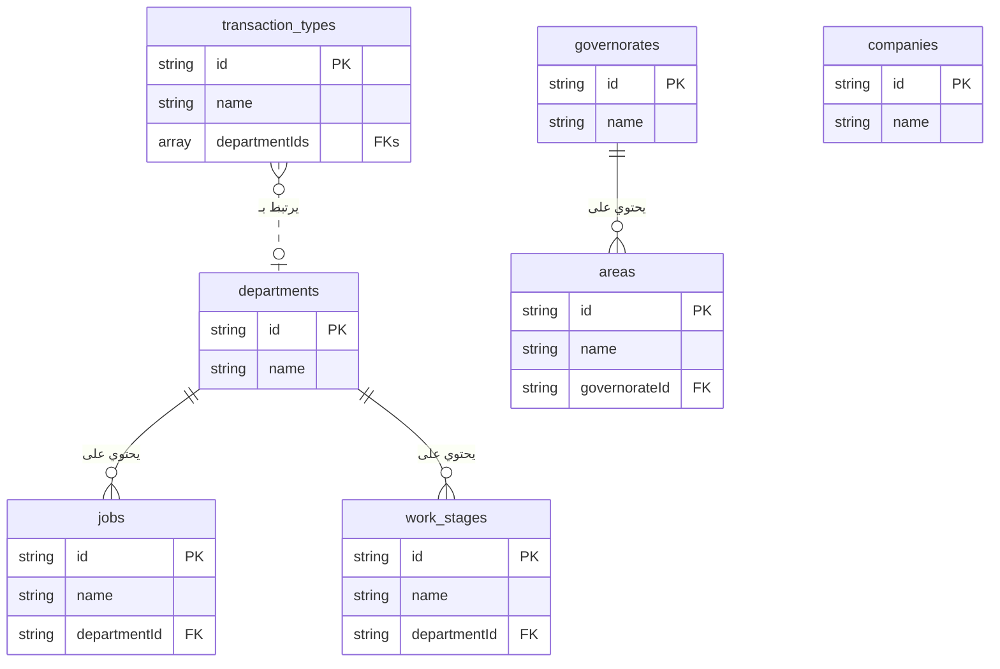

# نظرة شاملة على أكواد النظام

هذا المستند يحتوي على الكود الكامل لجميع الملفات في المشروع، بالإضافة إلى ملفات الشرح والتوثيق. تم تجميعه لتوفير مرجع شامل يمكنك استخدامه لمراجعة الأكواد أو فهم العلاقات بين أجزاء النظام المختلفة.

## هيكل النظام

يعتمد النظام على مجموعة من التقنيات الحديثة لبناء واجهات المستخدم والتعامل مع العمليات الخلفية والذكاء الاصطناعي:

*   **Next.js & React:** لبناء واجهة المستخدم وتوفير تجربة سريعة وسلسة.
*   **Firebase:** كقاعدة بيانات (Firestore) ولإدارة المستخدمين (Authentication).
*   **Genkit (AI):** لإضافة القدرات الذكية مثل "المساعد المحاسبي" و "المساعد الذكي للنظام".
*   **ShadCN UI & TailwindCSS:** لتوفير مكونات واجهة مستخدم جميلة ومتجاوبة.
*   **TypeScript:** لضمان جودة الكود وتقليل الأخطاء.

## شرح العلاقات بين الأجزاء

1.  **العملاء والمعاملات:** العميل هو المحور الرئيسي. كل خدمة (مثل "تصميم بلدية") تعتبر "معاملة" تابعة للعميل. كل معاملة لها عقدها ومراحل عملها الخاصة.
2.  **المحاسبة والعقود:** عند إنشاء عقد، يتم تسجيل قيد محاسبي تلقائي لإثبات المديونية. وعند تسجيل سندات القبض، يتم تحديث سجلات المشروع والعميل تلقائيًا.
3.  **المواعيد وسير العمل:** عند تحديث مرحلة عمل في تفاصيل الزيارة، يتم تحديث حالة المعاملة المرتبطة بها، وقد يؤدي ذلك إلى تفعيل دفعة مالية مستحقة في العقد.
4.  **الموارد البشرية والرواتب:** يتم إنشاء مسيرات الرواتب بناءً على بيانات الحضور والغياب، وعند تأكيد الدفع، يتم إنشاء قيد محاسبي تلقائي لإثبات المصروف.
5.  **الذكاء الاصطناعي:**
    *   **المساعد المحاسبي:** يفهم الأوامر باللغة العربية ويحولها إلى قيود يومية منظمة.
    *   **المساعد الذكي للنظام:** يجيب على أسئلتك حول كيفية استخدام النظام، ويمكنه البحث عن بيانات حية (مثل مديونية عميل) أو توجيهك إلى الصفحات الصحيحة.

---
## File: `.env`
```

```

---
## File: `README.md`
```md
# Firebase Studio
whoami
This is a NextJS starter in Firebase Studio.

To get started, take a look at src/app/page.tsx.

```

---
## File: `apphosting.yaml`
```yaml
# Settings to manage and configure a Firebase App Hosting backend.
# https://firebase.google.com/docs/app-hosting/configure

runConfig:
  # Increase this value if you'd like to automatically spin up
  # more instances in response to increased traffic.
  maxInstances: 1

```

---
## File: `components.json`
```json
{
  "$schema": "https://ui.shadcn.com/schema.json",
  "style": "default",
  "rsc": true,
  "tsx": true,
  "tailwind": {
    "config": "tailwind.config.ts",
    "css": "src/app/globals.css",
    "baseColor": "neutral",
    "cssVariables": true,
    "prefix": ""
  },
  "aliases": {
    "components": "@/components",
    "utils": "@/lib/utils",
    "ui": "@/components/ui",
    "lib": "@/lib",
    "hooks": "@/hooks"
  },
  "iconLibrary": "lucide"
}

```

---
## File: `docs/accounting-features.md`
```md
# وحدة المحاسبة المتكاملة: شرح شامل

هذا المستند يوضح جميع المميزات والعمليات في قسم المحاسبة.

### 1. شجرة الحسابات (Chart of Accounts)
- **المصدر:** `src/app/dashboard/accounting/chart-of-accounts/page.tsx`
- **الوصف:** هي أساس النظام المحاسبي. يمكنك إضافة، تعديل، وحذف الحسابات. النظام يأتي مع شجرة حسابات أساسية يمكنك تنزيلها كنقطة بداية.

### 2. قيود اليومية (Journal Entries)
- **المصدر:** `src/app/dashboard/accounting/journal-entries/`
- **الوصف:** يمكنك إنشاء قيود يدوية أو الاعتماد على القيود التلقائية التي ينشئها النظام (مثل عند إنشاء عقد). تتبع القيود دورة عمل (مسودة -> مرحّل).
- **المساعد المحاسبي الذكي:**
    - **المصدر:** `src/app/dashboard/accounting/assistant/page.tsx`
    - **الوصف:** مساعد ذكاء اصطناعي يفهم الأوامر المحاسبية باللغة العربية (الفصحى واللهجات العامية المختلفة) ويحولها إلى قيود يومية جاهزة للحفظ.

### 3. السندات (Vouchers)
- **سندات القبض:**
    - **شرح مفصل:** `docs/cash-receipts-features.md`
    - **المصدر:** `src/app/dashboard/accounting/cash-receipts/`
    - **الوصف:** إنشاء سندات قبض مع ترقيم تلقائي، ربط بالعقود، وتوليد ذكي لوصف الدفعة.
- **سندات الصرف:**
    - **المصدر:** `src/app/dashboard/accounting/payment-vouchers/`
    - **الوصف:** إنشاء سندات صرف لتسجيل المدفوعات للموردين والموظفين.

### 4. عروض الأسعار والعقود (Quotations & Contracts)
- **المصدر:** `src/app/dashboard/accounting/quotations/` و `src/components/clients/contract-clauses-form.tsx`
- **الوصف:** يمكنك إنشاء عروض أسعار للعملاء. عند قبول عرض السعر، يمكنك تحويله مباشرة إلى عقد مفصل داخل معاملة العميل، مما يضمن ربط البيانات المالية بالعمليات.

### 5. القوائم المالية (IFRS Compliant)
- **قائمة الدخل (Income Statement):**
    - **المصدر:** `src/app/dashboard/accounting/income-statement/page.tsx`
    - **الوصف:** تعرض الإيرادات والمصروفات وصافي الربح، مع فصل "تكلفة الإيرادات" لعرض "مجمل الربح" بشكل واضح.
- **قائمة المركز المالي (Balance Sheet):**
    - **المصدر:** `src/app/dashboard/accounting/balance-sheet/page.tsx`
    - **الوصف:** تعرض الأصول والالتزامات وحقوق الملكية، مع تصنيفها إلى "متداولة" و "غير متداولة" وفقًا للمعايير الدولية.
- **قائمة التدفقات النقدية (Cash Flow Statement):**
    - **المصدر:** `src/app/dashboard/accounting/cash-flow/page.tsx`
    - **الوصف:** تُعد بالطريقة غير المباشرة، حيث تبدأ بصافي الربح وتعدله للوصول إلى صافي التدفق النقدي.
- **قائمة التغير في حقوق الملكية (Statement of Changes in Equity):**
    - **المصدر:** `src/app/dashboard/accounting/equity-statement/page.tsx`
    - **الوصف:** توضح كيف تغيرت حقوق الملاك خلال الفترة، بربط رصيد البداية بصافي الربح للوصول إلى رصيد النهاية.
- **الإيضاحات المتممة (Financial Statement Notes):**
    - **المصدر:** `src/app/dashboard/accounting/financial-statement-notes/page.tsx`
    - **الوصف:** صفحة تحتوي على محرر نصوص لحفظ الشروحات والتفاصيل الإضافية المطلوبة للقوائم المالية.

### 6. التنبؤ المالي (Financial Forecast)
- **المصدر:** `src/app/dashboard/accounting/financial-forecast/page.tsx`
- **الوصف:** أداة تعتمد على بيانات العقود والمصاريف الثابتة لتقديم توقعات مستقبلية للإيرادات والمصروفات.
```

---
## File: `docs/appointment-details-features.md`
```md
# صفحة تفاصيل الزيارة: شرح شامل للإجراءات

بناءً على طلبك، هذا شرح مفصل لجميع الإجراءات والعمليات التي يمكنك القيام بها من داخل صفحة "تفاصيل الزيارة"، والتي تعتبر مركز التحكم لكل موعد.

---

### 1. ربط الزيارة بمعاملة (للمواعيد غير المرتبطة)

*   **الحالة:** عندما تقوم بحجز موعد لعميل مسجل دون تحديد معاملة معينة.
*   **الإجراء:** ستظهر لك قائمة بجميع "المعاملات الداخلية" الخاصة بهذا العميل. يمكنك اختيار المعاملة الصحيحة (مثل "تصميم بلدية") وربط الزيارة بها.
*   **الفائدة:** هذا الربط ضروري لتتمكن من تحديث مراحل سير العمل الخاصة بالمعاملة بشكل صحيح.

### 2. تحديث مرحلة العمل (الإجراء الأساسي)

هذا هو الإجراء الأهم في صفحة الزيارة، وهو إلزامي لإغلاق الزيارة.

*   **الحالة:** بعد ربط الزيارة بمعاملة، أو إذا كانت مرتبطة بالفعل.
*   **الإجراء:**
    1.  ستظهر لك قائمة منسدلة تحتوي على "مراحل العمل" المتاحة في سير عمل المعاملة.
    2.  اختر المرحلة التي وصل إليها العميل أو التي تم إنجازها خلال هذه الزيارة.
*   **المنطق الذكي:**
    *   **تحديث تلقائي:** بمجرد اختيارك للمرحلة، يقوم النظام تلقائيًا بتحديث حالة سير عمل المعاملة.
    *   **تفعيل الدفعات:** إذا كان إكمال هذه المرحلة مرتبطًا باستحقاق دفعة مالية في العقد، سيقوم النظام تلقائيًا بتغيير حالة الدفعة من "غير مستحقة" إلى "مستحقة".
    *   **توثيق فوري:** يتم تسجيل هذا الإجراء فورًا في "سجل أحداث المعاملة" وفي "سجل تغييرات العميل" لضمان الشفافية الكاملة.
*   **صلاحية التعديل (للمدير فقط):** إذا تم اختيار مرحلة بالخطأ، يمكن للمدير فقط تعديلها. يقوم النظام تلقائيًا بالتراجع عن كل الإجراءات المرتبطة بالمرحلة الخاطئة (مثل حالة الدفعة).

### 3. تسجيل "تعديل" على مرحلة حالية

*   **الحالة:** إذا كانت المرحلة الحالية للمعاملة (قيد التنفيذ) هي من النوع الذي يقبل تسجيل تعديلات (مثل مرحلة "تعديلات المالك").
*   **الإجراء:** سيظهر لك زر خاص "تسجيل تعديل جديد". عند الضغط عليه، يقوم النظام بالآتي:
    1.  زيادة عداد "التعديلات" لهذه المرحلة في سجل المعاملة.
    2.  توثيق هذا الإجراء في سجل الأحداث.
*   **الفائدة:** تساعد هذه الميزة في تتبع عدد مرات طلب التعديلات من قبل العميل على مرحلة معينة، مما يوفر رؤى حول كفاءة العمل.

### 4. كتابة ملخص الزيارة (محضر الاجتماع)

*   **الحالة:** بعد أن تقوم بتحديث مرحلة العمل للزيارة.
*   **الإجراء:** سيظهر لك مربع نص لكتابة ملخص لما دار في الزيارة، النقاط التي تم الاتفاق عليها، والمهام المطلوبة للمتابعة.
*   **التكامل:**
    *   يتم حفظ هذا الملخص مع بيانات الزيارة.
    *   الأهم من ذلك، يتم إضافته **كتعليق تلقائي** في "التايم لاين" الخاص بالمعاملة، ليطلع عليه جميع المهندسين المعنيين.

### 5. التعامل مع العملاء المحتملين (غير المسجلين)

*   **الحالة:** عندما يكون الموعد لعميل غير مسجل (تم إدخال اسمه ورقم جواله يدويًا).
*   **الإجراء:**
    1.  **إنشاء ملف:** سيظهر لك زر "إنشاء ملف عميل". بالضغط عليه، سيتم نقلك إلى شاشة عميل جديد مع تعبئة الاسم والجوال تلقائيًا.
    2.  **الربط التلقائي:** بمجرد إنشاء الملف، سيقوم النظام تلقائيًا بربط هذا الموعد وجميع المواعيد المستقبلية التي تحمل نفس رقم الجوال بملف العميل الجديد.

### 6. إغلاق الزيارة

*   **الحالة:** لا يمكنك إغلاق الزيارة والعودة للتقويم إلا **بعد** تحديث مرحلة العمل أو **تسجيل تعديل**.
*   **الإجراء:** بمجرد القيام بأحد الإجراءين أعلاه، سيتم تفعيل زر "إغلاق الزيارة"، ويمكنك العودة للتقويم لمتابعة عملك. هذا يضمن عدم ترك أي زيارة بدون توثيق الإجراء الذي تم فيها.

    
```

---
## File: `docs/appointments-features.md`
```md
# نظام المواعيد الذكي: شرح شامل للمميزات

بناءً على طلبك، إليك شرح مفصل ومبسط لجميع المميزات التي قمنا بتطويرها في نظام إدارة المواعيد، والذي تم تصميمه ليكون دقيقًا، ذكيًا، وسهل الاستخدام.

---

### 1. نظام تقويم مزدوج ومتخصص

تم فصل المواعيد إلى قسمين رئيسيين لتنظيم العمل ومنع التداخل:

*   **جدول القسم المعماري:** مخصص حصريًا لزيارات العملاء مع مهندسي القسم المعماري. يتم عرضه كشبكة زمنية تُظهر حجوزات كل مهندس على حدة.
*   **جدول حجوزات القاعات:** مخصص لحجز قاعات الاجتماعات لمواعيد الأقسام الهندسية الأخرى (كهرباء، إنشائي، إلخ). يتم عرضه كشبكة زمنية تُظهر حجوزات كل قاعة على حدة.

### 2. منطق حجز ذكي لمنع التعارض (Real-time Conflict Detection)

أهم ميزة في النظام هي قدرته على منع الأخطاء البشرية عند حجز المواعيد. قبل حفظ أي موعد جديد أو تعديل، يقوم النظام بالتحقق الفوري من وجود أي تعارض في:

*   **وقت المهندس:** لا يمكن حجز موعدين لنفس المهندس في نفس الفترة الزمنية، حتى لو كان أحدهما في جدول القسم المعماري والآخر في جدول حجوزات القاعات.
*   **وقت العميل:** لا يمكن حجز موعدين لنفس العميل في نفس الفترة.
*   **وقت القاعة:** لا يمكن حجز نفس قاعة الاجتماعات في نفس الوقت.

في حال وجود أي تعارض، يرفض النظام الحفظ ويعرض رسالة تنبيه واضحة.

### 3. نظام تلوين ديناميكي لزيارات القسم المعماري

لتسهيل متابعة حالة العميل بلمحة بصر، تم تصميم نظام ألوان ذكي لمواعيد القسم المعماري:

*   **اللون الأصفر:** يُخصص دائمًا **للموعد الأقدم زمنيًا** للعميل، مما يدل على أنها الزيارة الأولى.
*   **اللون الأخضر:** يُخصص لأي زيارة تالية (الثانية، الثالثة، إلخ) **طالما أن العميل لم يوقع العقد بعد**.
*   **اللون الأزرق:** بمجرد توقيع العقد، تتحول جميع الزيارات التالية للزيارة الأولى إلى اللون الأزرق تلقائيًا.

### 4. عداد الزيارات التلقائي

بجانب اسم العميل في كل موعد معماري، يعرض النظام تلقائيًا رقم الزيارة (مثال: "الزيارة رقم 3"). هذا الرقم ليس ثابتًا، بل هو ديناميكي وذكي.

### 5. نظام تصحيح ذاتي للبيانات

هذه هي الميزة الأكثر قوة. عند **إلغاء أي موعد**، يقوم النظام تلقائيًا بالآتي:

1.  **تغيير الحالة:** يقوم النظام بتغيير حالة الموعد إلى "ملغي" بدلاً من حذفه نهائياً، مما يحافظ على السجل التاريخي.
2.  **إعادة الترقيم:** يعيد ترقيم جميع الزيارات **غير الملغاة** المتبقية للعميل بشكل صحيح. فإذا قمت بإلغاء الزيارة رقم 2، ستصبح الزيارة رقم 3 هي الزيارة رقم 2 الجديدة.
3.  **إعادة التلوين:** بناءً على الترقيم الجديد، يعيد النظام تلوين جميع المواعيد لتعكس الحالة الصحيحة (الموعد الأقدم يصبح أصفر، والبقية أخضر أو أزرق).

هذا يضمن أن البيانات المعروضة دقيقة وموثوقة بنسبة 100% في جميع الأوقات.

### 6. تخصيص كامل لأوقات الدوام

*   **مرونة كاملة:** من صفحة الإعدادات، يمكنك تحديد أوقات الدوام المختلفة لكل من القسم المعماري والقاعات العامة.
*   **إدارة العطلات:** يمكنك تحديد أيام العطلة الأسبوعية، وحتى تحديد يوم نصف دوام مع وقت انصراف مبكر.
*   **فترة راحة:** يمكنك إضافة فترة راحة (Buffer) بالدقائق بين المواعيد لتجنب التداخل وضمان سلاسة العمل.

### 7. تصميم متجاوب لجميع الأجهزة

تم تصميم واجهة المواعيد لتعمل بسلاسة على جميع الأجهزة، بما في ذلك:

*   شاشات الكمبيوتر المكتبية الكبيرة.
*   الأجهزة اللوحية (آيباد، وغيرها).
*   الهواتف الذكية.

تتكيف الجداول والنوافذ تلقائيًا مع حجم الشاشة لضمان تجربة استخدام سهلة ومريحة في أي مكان.

### 8. طباعة الجداول اليومية

يمكنك بسهولة طباعة جدول المواعيد اليومي لأي من القسمين (المعماري أو حجوزات القاعات) بتنسيق PDF واضح ومناسب للمشاركة أو الأرشفة.
```

---
## File: `docs/backend.json`
```json
{
  "entities": {
    "CompanyBranding": {
      "title": "Company Branding",
      "description": "Stores the company's branding information for letterheads and general UI.",
      "type": "object",
      "properties": {
        "company_name": {
          "type": "string",
          "description": "The full name of the company."
        },
        "address": {
          "type": "string",
          "description": "The company's contact address."
        },
        "phone": {
          "type": "string",
          "description": "The company's contact phone number."
        },
        "email": {
          "type": "string",
          "format": "email",
          "description": "The company's contact email address."
        },
        "tax_number": {
            "type": "string",
            "description": "The company's tax identification number."
        },
        "letterhead_text": {
          "type": "string",
          "description": "Additional text to display on the letterhead."
        },
        "logo_url": {
            "type": "string",
            "format": "uri",
            "description": "URL to the company's logo."
        },
        "letterhead_image_url": {
            "type": "string",
            "format": "uri",
            "description": "URL to the company's full letterhead image."
        },
        "footer_image_url": {
            "type": "string",
            "format": "uri",
            "description": "URL to the company's footer image."
        },
        "watermark_image_url": {
            "type": "string",
            "format": "uri",
            "description": "URL to a watermark image for printable documents."
        },
        "system_background_url": {
            "type": "string",
            "format": "uri",
            "description": "URL for the background image of the system pages."
        },
        "financial_statement_notes": {
            "type": "string",
            "description": "The full text content for the notes to the financial statements."
        },
        "work_hours": {
            "type": "object",
            "description": "Defines the company's working hours, holidays, and appointment settings.",
            "properties": {
                "general": {
                    "type": "object",
                    "description": "General working hours for meeting rooms and other departments.",
                    "properties": {
                        "morning_start_time": { "type": "string", "description": "e.g., '08:00'" },
                        "morning_end_time": { "type": "string", "description": "e.g., '12:00'" },
                        "evening_start_time": { "type": "string", "description": "e.g., '13:00'" },
                        "evening_end_time": { "type": "string", "description": "e.g., '17:00'" },
                        "appointment_slot_duration": { "type": "number", "description": "Duration in minutes, e.g., 30" },
                        "appointment_buffer_time": { "type": "number", "description": "Break time in minutes between appointments." }
                    }
                },
                "architectural": {
                    "type": "object",
                    "description": "Specific working hours for the architectural department.",
                    "properties": {
                        "morning_start_time": { "type": "string" },
                        "morning_end_time": { "type": "string" },
                        "evening_start_time": { "type": "string" },
                        "evening_end_time": { "type": "string" },
                        "appointment_slot_duration": { "type": "number" },
                        "appointment_buffer_time": { "type": "number", "description": "Break time in minutes between appointments." }
                    }
                },
                "ramadan": {
                    "type": "object",
                    "description": "Defines special working hours for the month of Ramadan.",
                    "properties": {
                        "is_enabled": { "type": "boolean", "description": "Enable/disable special Ramadan timings." },
                        "start_date": { "type": "string", "format": "date", "description": "Start date of Ramadan for the current year." },
                        "end_date": { "type": "string", "format": "date", "description": "End date of Ramadan for the current year." },
                        "start_time": { "type": "string", "description": "e.g., '09:30'" },
                        "end_time": { "type": "string", "description": "e.g., '15:30'" },
                        "appointment_slot_duration": { "type": "number" },
                        "appointment_buffer_time": { "type": "number" }
                    }
                },
                "holidays": {
                    "type": "array",
                    "description": "Weekly holidays.",
                    "items": { "type": "string", "enum": ["Sunday", "Monday", "Tuesday", "Wednesday", "Thursday", "Friday", "Saturday"] }
                },
                "half_day": {
                    "type": "object",
                    "description": "Defines a weekly half-day.",
                    "properties": {
                        "day": { "type": "string", "enum": ["", "Sunday", "Monday", "Tuesday", "Wednesday", "Thursday", "Friday", "Saturday"] },
                        "type": { "type": "string", "enum": ["morning_only", "custom_end_time"] },
                        "end_time": { "type": "string", "description": "e.g., '13:00'" }
                    }
                }
            }
        },
        "payment_methods": {
            "type": "array",
            "description": "Configurable payment methods and their associated fees.",
            "items": {
                "type": "object",
                "properties": {
                    "id": { "type": "string" },
                    "name": { "type": "string" },
                    "type": { "type": "string", "enum": ["percentage", "fixed"] },
                    "value": { "type": "number" },
                    "expenseAccountId": { "type": "string" },
                    "expenseAccountName": { "type": "string" }
                },
                "required": ["id", "name", "type", "value", "expenseAccountId"]
            }
        }
      },
      "required": ["company_name"]
    },
    "UserProfile": {
      "title": "User Profile",
      "description": "Represents a user's login account in the system.",
      "type": "object",
      "properties": {
        "uid": {
          "type": "string",
          "description": "The unique user ID from Firebase Authentication."
        },
        "username": {
          "type": "string",
          "description": "The user's unique username for login."
        },
        "email": {
          "type": "string",
          "format": "email",
          "description": "Auto-generated internal email address (e.g., username@scoop.local)."
        },
        "passwordHash": {
          "type": "string",
          "description": "The securely hashed password for the user. Hashing should be done server-side."
        },
        "employeeId": {
          "type": "string",
          "description": "A reference to the corresponding document ID in the 'employees' collection."
        },
        "role": {
          "type": "string",
          "description": "The user's role in the system.",
          "enum": ["Admin", "Secretary", "Accountant", "Engineer", "HR"]
        },
        "isActive": {
          "type": "boolean",
          "description": "Whether the user's account is active and can log in."
        },
        "createdAt": {
          "type": "string",
          "format": "date-time",
          "description": "The timestamp when the user account was created."
        },
        "activatedAt": {
          "type": "string",
          "format": "date-time",
          "description": "The timestamp when the user account was last activated."
        },
        "createdBy": {
            "type": "string",
            "description": "The user ID of the admin who created this account."
        }
      },
      "required": [
        "username",
        "email",
        "passwordHash",
        "employeeId",
        "role",
        "isActive",
        "createdAt",
        "createdBy"
      ]
    },
    "Client": {
      "title": "Client",
      "description": "Represents a client of the consultancy.",
      "type": "object",
      "properties": {
        "fileId": {
          "type": "string",
          "description": "The client's file ID, in the format 'sequence/year' (e.g., '1/2024')."
        },
        "fileNumber": {
          "type": "number",
          "description": "The sequential part of the client's file ID for a given year."
        },
        "fileYear": {
          "type": "number",
          "description": "The year of the client's file ID."
        },
        "nameAr": {
            "type": "string",
            "description": "The full name of the client in Arabic."
        },
        "nameEn": {
            "type": "string",
            "description": "The full name of the client in English."
        },
        "mobile": {
          "type": "string",
          "description": "The client's mobile phone number."
        },
        "civilId": {
            "type": "string",
            "description": "The client's Civil ID number."
        },
        "plotNumber": {
            "type": "string",
            "description": "The client's plot number for contracts."
        },
        "address": {
            "type": "object",
            "description": "The client's address.",
            "properties": {
                "governorate": { "type": "string" },
                "area": { "type": "string" },
                "block": { "type": "string" },
                "street": { "type": "string" },
                "houseNumber": { "type": "string" }
            }
        },
        "status": {
          "type": "string",
          "description": "The current status of the client's file.",
          "enum": [
            "new",
            "contracted",
            "cancelled",
            "reContracted"
          ]
        },
        "transactionCounter": {
            "type": "number",
            "description": "A counter for the number of transactions created for this client, used to generate sequential transaction numbers."
        },
        "assignedEngineer": {
          "type": "string",
          "description": "The ID of the engineer assigned to this client."
        },
        "createdAt": {
          "type": "string",
          "format": "date-time",
          "description": "The timestamp when the client was created."
        },
        "isActive": {
          "type": "boolean",
          "description": "Whether the client is active."
        }
      },
      "required": [
        "fileId",
        "fileNumber",
        "fileYear",
        "nameAr",
        "mobile",
        "status",
        "createdAt",
        "isActive"
      ]
    },
    "ClientTransaction": {
        "title": "Client Transaction",
        "description": "Represents an internal service or transaction for a client, like a design submission.",
        "type": "object",
        "properties": {
            "transactionNumber": {
              "type": "string",
              "description": "A unique, human-readable, sequential transaction number for the client (e.g., CL123-TX01)."
            },
            "clientId": { "type": "string", "description": "The ID of the client this transaction belongs to." },
            "transactionType": { "type": "string", "description": "The type of transaction, e.g., 'Municipality Design', 'Electricity Design'." },
            "description": { "type": "string", "description": "A brief description of the transaction." },
            "departmentId": { "type": "string", "description": "The ID of the primary department for this transaction." },
            "transactionTypeId": { "type": "string", "description": "The ID of the transaction type." },
            "status": {
                "type": "string",
                "description": "The current status of the transaction.",
                "enum": ["new", "in-progress", "completed", "submitted", "on-hold"]
            },
            "assignedEngineerId": { "type": "string", "description": "The ID of the primary engineer assigned to this transaction." },
            "createdAt": { "type": "string", "format": "date-time" },
            "updatedAt": { "type": "string", "format": "date-time" },
            "stages": {
                "type": "array",
                "description": "The lifecycle stages of the transaction.",
                "items": { "$ref": "#/entities/TransactionStage" }
            },
            "contract": {
                "type": "object",
                "description": "Stores the customized contract clauses and total amount for this specific transaction.",
                "properties": {
                    "clauses": {
                        "type": "array",
                        "items": {
                            "type": "object",
                            "properties": {
                                "id": { "type": "string" },
                                "name": { "type": "string" },
                                "amount": { "type": "number" },
                                "status": { "type": "string", "enum": ["مدفوعة", "مستحقة", "غير مستحقة"] },
                                "percentage": { "type": "number", "description": "The original percentage value if the financial type was 'percentage'."}
                            },
                            "required": ["id", "name", "amount", "status"]
                        }
                    },
                    "termsAndConditions": {
                      "type": "array",
                      "items": {
                        "type": "object",
                        "properties": { "id": { "type": "string" }, "text": { "type": "string" } },
                        "required": ["id", "text"]
                      }
                    },
                    "openClauses": {
                      "type": "array",
                      "items": {
                        "type": "object",
                        "properties": { "id": { "type": "string" }, "text": { "type": "string" } },
                        "required": ["id", "text"]
                      }
                    },
                    "totalAmount": { "type": "number" },
                    "financialsType": { "type": "string", "enum": ["fixed", "percentage"] }
                },
                "required": ["clauses", "totalAmount"]
            }
        },
        "required": ["transactionNumber", "clientId", "transactionType", "status", "createdAt"]
    },
    "TransactionAssignment": {
        "title": "Transaction Assignment",
        "description": "Represents an assignment or forwarding of a transaction to a specific department and engineer.",
        "type": "object",
        "properties": {
            "transactionId": {
                "type": "string",
                "description": "The ID of the parent ClientTransaction."
            },
            "clientId": {
                "type": "string",
                "description": "The ID of the client."
            },
            "departmentId": { "type": "string" },
            "departmentName": { "type": "string" },
            "engineerId": { "type": "string" },
            "notes": { "type": "string" },
            "status": {
                "type": "string",
                "enum": ["pending", "in-progress", "completed"]
            },
            "createdAt": {
                "type": "string",
                "format": "date-time"
            },
            "createdBy": {
                "type": "string",
                "description": "The ID of the user who created the assignment."
            }
        },
        "required": [
            "transactionId",
            "clientId",
            "departmentId",
            "departmentName",
            "status",
            "createdAt",
            "createdBy"
        ]
    },
    "TransactionTimelineEvent": {
      "title": "Transaction Timeline Event",
      "description": "Represents a single event (comment or log) in a transaction's history.",
      "type": "object",
      "properties": {
        "type": {
          "type": "string",
          "enum": [ "comment", "log" ],
          "description": "The type of event."
        },
        "content": {
          "type": "string",
          "description": "The content of the comment or the description of the log."
        },
        "userId": {
          "type": "string",
          "description": "The ID of the user who created the event."
        },
        "userName": {
          "type": "string",
          "description": "The name of the user who created the event."
        },
        "userAvatar": {
          "type": "string",
          "format": "uri",
          "description": "URL to the user's avatar image."
        },
        "createdAt": {
          "type": "string",
          "format": "date-time"
        }
      },
      "required": [ "type", "content", "userId", "userName", "createdAt" ]
    },
    "TransactionStage": {
      "title": "Transaction Stage",
      "description": "Tracks the progress of a single stage within a client transaction's lifecycle. It is linked to a reference WorkStage via stageId.",
      "type": "object",
      "properties": {
        "stageId": { "type": "string", "description": "The ID of the reference WorkStage document from the department's workStages subcollection." },
        "name": { "type": "string", "description": "Name of the stage, stored for convenience. The name in the reference data is the source of truth." },
        "order": { "type": "number", "description": "The display and logical order of the stage, copied from the template." },
        "status": {
          "type": "string",
          "enum": ["pending", "in-progress", "completed", "skipped", "awaiting-review"],
          "description": "The current status of the stage."
        },
        "allowedRoles": {
            "type": "array",
            "description": "The job titles responsible for this stage, copied from the WorkStage template.",
            "items": { "type": "string" }
        },
        "stageType": {
          "type": "string",
          "enum": ["sequential", "parallel"],
          "description": "'sequential' for main workflow steps, 'parallel' for service stages like modifications that can run alongside."
        },
        "nextStageIds": {
            "type": "array",
            "description": "A list of possible next stage IDs to transition to from this stage.",
            "items": { "type": "string" }
        },
        "allowedDuringStages": {
            "type": "array",
            "description": "For parallel stages only. A list of sequential stage IDs during which this parallel stage can be initiated.",
            "items": { "type": "string" }
        },
        "trackingType": {
          "type": "string",
          "enum": ["duration", "occurrence", "none"],
          "description": "The tracking type of the stage, copied from the template."
        },
        "expectedDurationDays": {
            "type": ["number", "null"],
            "description": "The expected duration in days for this stage (if trackingType is 'duration')."
        },
        "maxOccurrences": {
            "type": ["number", "null"],
            "description": "The maximum number of times this stage can occur (if trackingType is 'occurrence')."
        },
        "allowManualCompletion": {
            "type": "boolean",
            "description": "If true, allows manually completing an 'occurrence' stage before reaching its max count."
        },
        "modificationCount": {
            "type": ["number", "null"],
            "description": "How many times a modification has been recorded for this stage."
        },
        "startDate": { "type": ["string", "null"], "format": "date-time", "description": "When the stage started." },
        "endDate": { "type": ["string", "null"], "format": "date-time", "description": "When the stage was completed." },
        "expectedEndDate": { "type": ["string", "null"], "format": "date-time", "description": "The expected completion date for countdowns." },
        "notes": { "type": ["string", "null"], "description": "Notes specific to this stage." },
        "completedCount": { "type": ["number", "null"], "description": "How many times this stage has been completed (if trackingType is 'occurrence')."}
      },
      "required": ["stageId", "name", "status"]
    },
    "Counter": {
      "title": "Counter",
      "description": "Stores sequential counters for various entities.",
      "type": "object",
      "properties": {
        "counts": {
          "type": "object",
          "description": "A map of keys (e.g., years) to their current count."
        }
      }
    },
    "Employee": {
      "title": "Employee",
      "description": "Represents an employee in the company.",
      "properties": {
        "employeeNumber": { "type": "string", "description": "The unique identifying number for the employee." },
        "fullName": { "type": "string", "description": "Employee's name in Arabic." },
        "nameEn": { "type": "string", "description": "Employee's name in English." },
        "dob": { "type": "string", "format": "date", "description": "Date of birth." },
        "gender": { "type": "string", "enum": ["male", "female"] },
        "civilId": { "type": "string" },
        "nationality": { "type": "string", "description": "The employee's nationality." },
        "residencyExpiry": { "type": "string", "format": "date" },
        "contractExpiry": { "type": "string", "format": "date" },
        "mobile": { "type": "string" },
        "emergencyContact": { "type": "string" },
        "email": { "type": "string", "format": "email" },
        "jobTitle": { "type": "string" },
        "position": { "type": "string", "enum": ["head", "employee", "assistant", "contractor"] },
        "workStartTime": { "type": "string", "description": "The official start time for the employee's shift (e.g., '08:00')." },
        "workEndTime": { "type": "string", "description": "The official end time for the employee's shift (e.g., '17:00')." },
        "salaryPaymentType": { "type": "string", "enum": ["cash", "cheque", "transfer"] },
        "bankName": { "type": "string" },
        "accountNumber": { "type": "string" },
        "iban": { "type": "string" },
        "profilePicture": { "type": "string", "format": "uri" },
        "hireDate": { "type": "string", "format": "date-time" },
        "noticeStartDate": { "type": ["string", "null"], "format": "date-time", "description": "Date when resignation/termination notice was given." },
        "terminationDate": { "type": ["string", "null"], "format": "date-time" },
        "terminationReason": { "type": "string", "enum": ["resignation", "termination", "probation", null] },
        "contractType": { "type": "string", "enum": ["permanent", "temporary", "piece-rate", "percentage", "part-time", "special"] },
        "contractPercentage": { "type": "number", "description": "The percentage of contract value for commission-based employees." },
        "pieceRateMode": {
          "type": "string",
          "enum": ["salary_with_target", "per_piece"],
          "description": "For piece-rate contracts, defines if it's a fixed salary with a target, or purely per piece."
        },
        "targetDescription": {
            "type": "number",
            "description": "For salary-with-target contracts, this defines the numerical monthly/weekly target."
        },
        "pieceRate": {
            "type": "number",
            "description": "The price per piece for 'per_piece' contract types."
        },
        "department": { "type": "string" },
        "basicSalary": { "type": "number" },
        "housingAllowance": { "type": "number" },
        "transportAllowance": { "type": "number" },
        "status": { "type": "string", "enum": ["active", "on-leave", "terminated"] },
        "lastVacationAccrualDate": { "type": "string", "format": "date-time" },
        "annualLeaveAccrued": { "type": "number" },
        "annualLeaveUsed": { "type": "number" },
        "carriedLeaveDays": { "type": "number" },
        "sickLeaveUsed": { "type": "number" },
        "emergencyLeaveUsed": { "type": "number" },
        "maxEmergencyLeave": { "type": "number" },
        "lastLeaveResetDate": { "type": "string", "format": "date-time" },
        "annualLeaveBalance": { "type": "number", "description": "Calculated current annual leave balance." },
        "createdAt": { "type": "string", "format": "date-time" }
      },
      "required": [
        "employeeNumber",
        "fullName",
        "nameEn",
        "civilId",
        "mobile",
        "department",
        "jobTitle",
        "hireDate",
        "contractType",
        "basicSalary",
        "status"
      ]
    },
    "LeaveRequest": {
        "title": "Leave Request",
        "description": "Represents a leave request submitted by an employee.",
        "type": "object",
        "properties": {
            "employeeId": { "type": "string", "description": "ID of the employee requesting leave." },
            "employeeName": { "type": "string", "description": "Full name of the employee." },
            "leaveType": { "type": "string", "enum": ["Annual", "Sick", "Emergency", "Unpaid"] },
            "startDate": { "type": "string", "format": "date-time" },
            "endDate": { "type": "string", "format": "date-time" },
            "days": { "type": "number", "description": "Total number of leave days." },
            "workingDays": { "type": "number", "description": "Total number of calculated working days." },
            "notes": { "type": "string", "description": "Reason or notes for the leave." },
            "attachmentUrl": { "type": "string", "format": "uri", "description": "URL to a medical report or other document." },
            "status": { "type": "string", "enum": ["pending", "approved", "rejected"], "description": "The current status of the leave request." },
            "createdAt": { "type": "string", "format": "date-time" },
            "approvedBy": { "type": "string", "description": "UID of the user who approved/rejected the request." },
            "approvedAt": { "type": "string", "format": "date-time" },
            "rejectionReason": { "type": "string", "description": "Reason for rejecting the leave request." },
            "isBackFromLeave": { "type": "boolean", "description": "Indicates if the employee has returned from this specific leave." },
            "actualReturnDate": { "type": "string", "format": "date-time", "description": "The actual date the employee returned to work." },
            "passportReceived": { "type": "boolean", "description": "Indicates if the employee's passport has been received for the leave." },
            "isSalaryPaid": { "type": "boolean", "description": "Indicates if the salary for this leave has been processed." }
        },
        "required": ["employeeId", "employeeName", "leaveType", "startDate", "endDate", "days", "status", "createdAt"]
    },
    "PermissionRequest": {
      "title": "Permission Request",
      "description": "Represents a permission request from an employee for late arrival or early departure.",
      "type": "object",
      "properties": {
        "employeeId": { "type": "string", "description": "ID of the employee requesting permission." },
        "employeeName": { "type": "string", "description": "Full name of the employee." },
        "date": { "type": "string", "format": "date-time", "description": "The date for which the permission is requested." },
        "type": { "type": "string", "enum": ["late_arrival", "early_departure"], "description": "The type of permission request." },
        "reason": { "type": "string", "description": "The reason for the request." },
        "status": { "type": "string", "enum": ["pending", "approved", "rejected"], "description": "The current status of the request." },
        "createdAt": { "type": "string", "format": "date-time" },
        "approvedBy": { "type": "string", "description": "UID of the user who approved/rejected the request." },
        "approvedAt": { "type": "string", "format": "date-time" },
        "rejectionReason": { "type": "string", "description": "Reason for rejecting the request." }
      },
      "required": ["employeeId", "employeeName", "date", "type", "reason", "status", "createdAt"]
    },
    "Holiday": {
        "title": "Holiday",
        "description": "Represents an official public holiday.",
        "type": "object",
        "properties": {
            "name": { "type": "string", "description": "The name of the holiday." },
            "date": { "type": "string", "format": "date", "description": "The date of the holiday." }
        },
        "required": ["name", "date"]
    },
    "AuditLog": {
        "title": "Audit Log",
        "description": "Records changes made to employee data for historical tracking.",
        "type": "object",
        "properties": {
            "changeType": { "type": "string", "enum": ["Creation", "SalaryChange", "JobChange", "DataUpdate", "StatusChange", "ResidencyUpdate"] },
            "field": { "type": "string", "description": "The name of the field that was changed." },
            "oldValue": { "description": "The value of the field before the change." },
            "newValue": { "description": "The value of the field after the change." },
            "effectiveDate": { "type": "string", "format": "date-time", "description": "The date when this change becomes effective." },
            "changedBy": { "type": "string", "description": "The ID of the user who made the change." },
            "notes": { "type": "string", "description": "Additional notes about the change." }
        },
        "required": ["changeType", "field", "newValue", "effectiveDate", "changedBy"]
    },
    "MonthlyAttendance": {
      "title": "Monthly Attendance",
      "description": "An employee's attendance records and summary for a specific month.",
      "type": "object",
      "properties": {
        "employeeId": { "type": "string" },
        "year": { "type": "number" },
        "month": { "type": "number" },
        "records": {
          "type": "array",
          "items": {
            "type": "object",
            "properties": {
              "date": { "type": "string", "format": "date" },
              "checkIn1": { "type": ["string", "null"] },
              "checkOut1": { "type": ["string", "null"] },
              "checkIn2": { "type": ["string", "null"] },
              "checkOut2": { "type": ["string", "null"] },
              "totalHours": { "type": ["number", "null"] },
              "status": { "type": "string", "enum": ["present", "absent", "late", "leave"] }
            },
            "required": ["date", "status"]
          }
        },
        "summary": {
          "type": "object",
          "properties": {
            "totalDays": { "type": "number" },
            "presentDays": { "type": "number" },
            "absentDays": { "type": "number" },
            "lateDays": { "type": "number" },
            "leaveDays": { "type": "number" }
          },
          "required": ["presentDays", "absentDays", "lateDays", "leaveDays"]
        }
      },
      "required": ["employeeId", "year", "month", "records", "summary"]
    },
    "Payslip": {
      "title": "Payslip",
      "description": "An employee's payslip for a specific month.",
      "type": "object",
      "properties": {
        "employeeId": { "type": "string" },
        "employeeName": { "type": "string" },
        "year": { "type": "number" },
        "month": { "type": "number" },
        "attendanceId": { "type": "string", "description": "Reference to the attendance document ID." },
        "type": { "type": "string", "enum": ["Monthly", "Leave"], "description": "The type of payslip, either a regular monthly salary or a leave salary payout." },
        "leaveRequestId": { "type": "string", "description": "If type is 'Leave', this links to the LeaveRequest document." },
        "salaryPaymentType": { "type": "string", "enum": ["cash", "cheque", "transfer"] },
        "earnings": {
          "type": "object",
          "properties": {
            "basicSalary": { "type": "number" },
            "housingAllowance": { "type": "number" },
            "transportAllowance": { "type": "number" },
            "commission": { "type": "number", "description": "Commission earned in the period." }
          },
           "required": ["basicSalary"]
        },
        "deductions": {
          "type": "object",
          "properties": {
            "absenceDeduction": { "type": "number" },
            "otherDeductions": { "type": "number" }
          }
        },
        "netSalary": { "type": "number" },
        "status": { "type": "string", "enum": ["draft", "processed", "paid"] },
        "createdAt": { "type": "string", "format": "date-time" },
        "notes": { "type": "string", "description": "Auto-generated notes, e.g., regarding leave." }
      },
      "required": ["employeeId", "year", "month", "earnings", "netSalary", "status", "createdAt"]
    },
    "Notification": {
      "title": "Notification",
      "description": "Represents a notification for a user about an event in the system.",
      "type": "object",
      "properties": {
        "userId": { "type": "string", "description": "The ID of the user to whom the notification is sent." },
        "title": { "type": "string", "description": "A short, bolded title for the notification." },
        "body": { "type": "string", "description": "The main content of the notification message." },
        "link": { "type": "string", "description": "The URL the user will be redirected to upon clicking the notification." },
        "isRead": { "type": "boolean", "description": "Whether the user has read the notification." },
        "createdAt": { "type": "string", "format": "date-time" }
      },
      "required": ["userId", "title", "body", "link", "isRead", "createdAt"]
    },
    "Department": {
      "title": "Department",
      "description": "Represents a department in the company.",
      "type": "object",
      "properties": {
        "name": {
          "type": "string",
          "description": "The name of the department."
        },
        "order": {
            "type": "number",
            "description": "The display order."
        }
      },
      "required": ["name"]
    },
    "Job": {
      "title": "Job",
      "description": "Represents a job title within a department.",
      "type": "object",
      "properties": {
        "name": {
          "type": "string",
          "description": "The name of the job."
        },
        "order": {
            "type": "number",
            "description": "The display order."
        }
      },
      "required": ["name"]
    },
    "Governorate": {
      "title": "Governorate",
      "description": "Represents a governorate in the country.",
      "type": "object",
      "properties": {
        "name": {
          "type": "string",
          "description": "The name of the governorate."
        },
        "order": {
            "type": "number",
            "description": "The display order."
        }
      },
      "required": ["name"]
    },
    "Area": {
      "title": "Area",
      "description": "Represents an area within a governorate.",
      "type": "object",
      "properties": {
        "name": {
          "type": "string",
          "description": "The name of the area."
        },
        "order": {
            "type": "number",
            "description": "The display order."
        }
      },
      "required": ["name"]
    },
    "TransactionType": {
      "title": "Transaction Type",
      "description": "Represents a type of internal client transaction and links it to the departments involved.",
      "type": "object",
      "properties": {
        "name": {
          "type": "string",
          "description": "The name of the transaction type (e.g., 'Municipality Design')."
        },
        "departmentIds": {
            "type": "array",
            "description": "A list of department IDs involved in this transaction type.",
            "items": { "type": "string" }
        },
        "order": {
          "type": "number",
          "description": "The display and logical order of the type."
        }
      },
      "required": ["name", "departmentIds"]
    },
    "WorkStage": {
      "title": "Work Stage",
      "description": "Represents a standard work stage that can be associated with a department. Defines a step in a workflow.",
      "type": "object",
      "properties": {
        "name": { "type": "string", "description": "The name of the work stage." },
        "order": { "type": "number", "description": "The display and logical order of the stage." },
        "stageType": {
          "type": "string",
          "enum": ["sequential", "parallel"],
          "description": "'sequential' for main workflow steps, 'parallel' for service stages like modifications that can run alongside."
        },
        "allowedRoles": { "type": "array", "description": "A list of job titles responsible for this stage.", "items": { "type": "string" } },
        "nextStageIds": { "type": "array", "description": "A list of possible next stage IDs to transition to from this stage.", "items": { "type": "string" } },
        "allowedDuringStages": { "type": "array", "description": "For parallel stages only. A list of sequential stage IDs during which this parallel stage can be initiated.", "items": { "type": "string" } },
        "trackingType": { "type": "string", "enum": ["duration", "occurrence", "none"], "description": "How to track progress: by time, occurrences, or as a single event." },
        "enableModificationTracking": { "type": "boolean", "description": "If true, allows a modification counter to be incremented for this stage." },
        "expectedDurationDays": { "type": ["number", "null"], "description": "The expected duration in days for this stage (if trackingType is 'duration')." },
        "maxOccurrences": { "type": ["number", "null"], "description": "The maximum number of times this stage can occur (if trackingType is 'occurrence')." },
        "allowManualCompletion": { "type": "boolean", "description": "If true, allows manually completing an 'occurrence' stage before reaching its max count." }
      },
      "required": ["name", "order", "stageType", "trackingType"]
    },
    "Appointment": {
      "title": "Appointment",
      "description": "Represents a scheduled meeting or visit.",
      "type": "object",
      "properties": {
        "clientId": {
          "type": "string",
          "description": "The ID of the client for this appointment. Can be null for a new prospect."
        },
        "clientName": {
            "type": "string",
            "description": "The name of the client, especially if not yet a registered client."
        },
        "clientMobile": {
            "type": "string",
            "description": "The mobile number of the client, especially if not yet a registered client."
        },
        "engineerId": {
          "type": "string",
          "description": "The ID of the employee attending the appointment."
        },
        "meetingRoom": {
          "type": "string",
          "description": "The name of the meeting room, if applicable (for non-architectural appointments)."
        },
        "department": {
          "type": "string",
          "description": "The department associated with the appointment, used for color-coding.",
          "enum": ["الكهرباء", "الصحي", "الإنشائي", "المعماري", "أخرى"]
        },
        "title": {
          "type": "string",
          "description": "The purpose or title of the appointment."
        },
        "notes": {
          "type": "string",
          "description": "Additional notes about the appointment."
        },
        "type": {
          "type": "string",
          "description": "Distinguishes between architectural appointments and room bookings.",
          "enum": ["architectural", "room"]
        },
        "status": {
            "type": "string",
            "description": "The current status of the appointment, especially for cancellation tracking.",
            "enum": ["scheduled", "cancelled"]
        },
        "appointmentDate": {
          "type": "string",
          "format": "date-time",
          "description": "The start date and time of the appointment."
        },
        "endDate": {
          "type": "string",
          "format": "date-time",
          "description": "The end date and time of the appointment."
        },
        "createdAt": {
          "type": "string",
          "format": "date-time"
        },
        "transactionId": {
          "type": "string",
          "description": "The ID of the client transaction this appointment is related to."
        },
        "workStageUpdated": {
            "type": "boolean",
            "description": "Indicates if the work stage has been updated for this visit."
        },
        "workStageProgressId": {
            "type": "string",
            "description": "Reference to the document in work_stages_progress."
        },
        "visitCount": {
            "type": "number",
            "description": "The sequential visit number for this client's architectural appointments."
        },
        "color": {
            "type": "string",
            "description": "Hex color code for calendar display based on visit status."
        }
      },
      "required": ["engineerId", "title", "appointmentDate", "createdAt", "type"]
    },
    "WorkStageProgress": {
        "title": "Work Stage Progress",
        "description": "Logs the selection of a work stage for a specific architectural visit.",
        "type": "object",
        "properties": {
            "transactionId": { "type": "string", "description": "The ID of the client transaction this visit is related to." },
            "visitId": { "type": "string", "description": "The ID of the architectural visit document." },
            "stageId": { "type": "string", "description": "The ID of the selected work stage." },
            "stageName": { "type": "string", "description": "The name of the selected work stage." },
            "selectedBy": { "type": "string", "description": "The ID of the employee who updated the stage." },
            "selectedAt": { "type": "string", "format": "date-time" }
        },
        "required": ["visitId", "stageId", "stageName", "selectedBy", "selectedAt"]
    },
    "Contract": {
      "title": "Contract",
      "description": "Represents a fully dynamic, user-generated contract.",
      "type": "object",
      "properties": {
        "clientId": { "type": "string" },
        "clientName": { "type": "string" },
        "companySnapshot": { "type": "object", "description": "A snapshot of company data at time of creation." },
        "title": { "type": "string" },
        "contractDate": { "type": "string", "format": "date-time" },
        "scopeOfWork": {
          "type": "array",
          "items": {
            "type": "object",
            "properties": { "id": { "type": "string" }, "title": { "type": "string" }, "description": { "type": "string" } },
            "required": ["id", "title"]
          }
        },
        "termsAndConditions": {
          "type": "array",
          "items": {
            "type": "object",
            "properties": { "id": { "type": "string" }, "text": { "type": "string" } },
            "required": ["id", "text"]
          }
        },
        "financials": {
          "type": "object",
          "properties": {
            "type": { "type": "string", "enum": ["fixed", "percentage"] },
            "totalAmount": { "type": "number" },
            "discount": { "type": "number" },
            "milestones": {
              "type": "array",
              "items": {
                "type": "object",
                "properties": {
                  "id": { "type": "string" },
                  "name": { "type": "string" },
                  "condition": { "type": "string" },
                  "value": { "type": "number" }
                },
                "required": ["id", "name", "value"]
              }
            }
          }
        },
        "openClauses": {
          "type": "array",
          "items": {
            "type": "object",
            "properties": { "id": { "type": "string" }, "text": { "type": "string" } },
            "required": ["id", "text"]
          }
        },
        "createdAt": { "type": "string", "format": "date-time" },
        "createdBy": { "type": "string" }
      },
      "required": ["clientId", "title", "contractDate", "createdAt"]
    },
    "ContractTemplate": {
      "title": "Contract Template",
      "description": "A reusable template for generating contracts.",
      "type": "object",
      "properties": {
        "title": { "type": "string" },
        "description": { "type": "string" },
        "transactionTypes": { "type": "array", "items": { "type": "string" } },
        "scopeOfWork": {
          "type": "array",
          "items": {
            "type": "object",
            "properties": { "id": { "type": "string" }, "title": { "type": "string" }, "description": { "type": "string" } },
            "required": ["id", "title"]
          }
        },
        "termsAndConditions": {
          "type": "array",
          "items": {
            "type": "object",
            "properties": { "id": { "type": "string" }, "text": { "type": "string" } },
            "required": ["id", "text"]
          }
        },
        "financials": {
          "type": "object",
          "properties": {
            "type": { "type": "string", "enum": ["fixed", "percentage"] },
            "totalAmount": { "type": "number" },
            "discount": { "type": "number" },
            "milestones": {
              "type": "array",
              "items": {
                "type": "object",
                "properties": {
                  "id": { "type": "string" },
                  "name": { "type": "string" },
                  "condition": { "type": "string" },
                  "value": { "type": "number" }
                },
                "required": ["id", "name", "value"]
              }
            }
          }
        },
        "openClauses": {
          "type": "array",
          "items": {
            "type": "object",
            "properties": { "id": { "type": "string" }, "text": { "type": "string" } },
            "required": ["id", "text"]
          }
        }
      },
      "required": ["title"]
    },
    "Account": {
        "title": "Account",
        "description": "An account in the Chart of Accounts.",
        "type": "object",
        "properties": {
            "code": { "type": "string" },
            "name": { "type": "string" },
            "type": { "type": "string", "enum": ["asset", "liability", "equity", "income", "expense"] },
            "statement": { "type": "string", "enum": ["Balance Sheet", "Income Statement"] },
            "balanceType": { "type": "string", "enum": ["Debit", "Credit"] },
            "level": { "type": "number", "description": "The hierarchy level of the account." },
            "description": { "type": "string" },
            "isPayable": { "type": "boolean" },
            "parentCode": { "type": ["string", "null"] }
        },
        "required": ["name", "code", "type", "level", "isPayable", "statement", "balanceType"]
    },
    "JournalEntryLine": {
      "title": "Journal Entry Line",
      "description": "A single line in a journal entry, representing a debit or credit to an account.",
      "type": "object",
      "properties": {
        "accountId": {
          "type": "string",
          "description": "The ID of the account from the chart of accounts."
        },
        "accountName": {
          "type": "string",
          "description": "The name of the account."
        },
        "debit": {
          "type": "number",
          "description": "The debit amount."
        },
        "credit": {
          "type": "number",
          "description": "The credit amount."
        },
        "notes": {
          "type": "string",
          "description": "Optional notes for this line."
        },
        "clientId": {
            "type": "string",
            "description": "The ID of the client related to this line."
        },
        "transactionId": {
            "type": "string",
            "description": "The ID of the client transaction related to this line."
        },
        "auto_profit_center": {
          "type": "string",
          "description": "Auto-tagged client/project ID for profit analysis."
        },
        "auto_resource_id": {
            "type": "string",
            "description": "Auto-tagged employee ID for resource analysis."
        },
        "auto_dept_id": {
            "type": "string",
            "description": "Auto-tagged department ID for departmental analysis."
        }
      },
      "required": ["accountId", "accountName", "debit", "credit"]
    },
    "JournalEntry": {
      "title": "Journal Entry",
      "description": "Represents a general journal entry with multiple debit/credit lines.",
      "type": "object",
      "properties": {
        "entryNumber": {
          "type": "string",
          "description": "A sequential number for the journal entry (e.g., JV-2024-0001)."
        },
        "date": {
          "type": "string",
          "format": "date-time",
          "description": "The date of the journal entry."
        },
        "narration": {
          "type": "string",
          "description": "A general description or narration for the entry."
        },
        "reference": {
          "type": "string",
          "description": "An optional external reference number."
        },
        "linkedReceiptId": {
          "type": "string",
          "description": "The ID of the cash receipt that triggered this entry, if any."
        },
        "totalDebit": {
          "type": "number",
          "description": "The total of all debit lines, for validation."
        },
        "totalCredit": {
          "type": "number",
          "description": "The total of all credit lines, for validation."
        },
        "status": {
            "type": "string",
            "enum": ["draft", "posted"],
            "description": "The status of the journal entry."
        },
        "reconciliationStatus": {
            "type": "string",
            "enum": ["unreconciled", "reconciled", "pending"],
            "description": "The bank reconciliation status of the entry."
        },
        "reconciliationInfo": {
            "type": "object",
            "description": "Details about the reconciliation.",
            "properties": {
                "reconciledAt": { "type": "string", "format": "date-time" },
                "reconciledBy": { "type": "string" },
                "bankTransactionId": { "type": "string" },
                "reconciliationEntryId": { "type": "string" }
            }
        },
        "lines": {
          "type": "array",
          "items": {
            "$ref": "#/entities/JournalEntryLine"
          }
        },
        "clientId": {
            "type": "string",
            "description": "The ID of the client related to this entry."
        },
        "transactionId": {
            "type": "string",
            "description": "The ID of the client transaction related to this entry."
        },
        "createdAt": {
          "type": "string",
          "format": "date-time"
        },
        "createdBy": {
          "type": "string",
          "description": "The ID of the user who created the entry."
        }
      },
      "required": ["entryNumber", "date", "narration", "totalDebit", "totalCredit", "status", "lines", "createdAt"]
    },
    "PaymentVoucher": {
      "title": "Payment Voucher",
      "description": "Represents a payment voucher for disbursing funds.",
      "type": "object",
      "properties": {
        "voucherNumber": { "type": "string" },
        "voucherSequence": { "type": "number" },
        "voucherYear": { "type": "number" },
        "payeeName": { "type": "string" },
        "payeeType": { "type": "string", "enum": ["vendor", "employee", "other"] },
        "employeeId": { "type": "string", "description": "Link to employee if payeeType is employee, for residency renewal etc." },
        "renewalExpiryDate": { "type": "string", "format": "date-time", "description": "New expiry date if this is for residency renewal." },
        "amount": { "type": "number" },
        "amountInWords": { "type": "string" },
        "paymentDate": { "type": "string", "format": "date-time" },
        "paymentMethod": { "type": "string", "enum": ["Cash", "Cheque", "Bank Transfer", "EmployeeCustody"] },
        "description": { "type": "string" },
        "reference": { "type": "string", "description": "e.g., Cheque number or transfer reference" },
        "debitAccountId": { "type": "string" },
        "debitAccountName": { "type": "string" },
        "creditAccountId": { "type": "string" },
        "creditAccountName": { "type": "string" },
        "status": { "type": "string", "enum": ["draft", "paid", "cancelled"] },
        "journalEntryId": { "type": "string" },
        "createdAt": { "type": "string", "format": "date-time" },
        "clientId": { "type": "string", "description": "Client ID if this payment is for a project"},
        "transactionId": { "type": "string", "description": "Transaction ID if this payment is for a project"}
      },
      "required": ["voucherNumber", "payeeName", "amount", "paymentDate", "paymentMethod", "debitAccountId", "creditAccountId", "status"]
    },
    "CashReceipt": {
      "title": "Cash Receipt",
      "description": "Represents a cash receipt voucher.",
      "type": "object",
      "properties": {
        "voucherNumber": { "type": "string" },
        "voucherSequence": { "type": "number" },
        "voucherYear": { "type": "number" },
        "clientId": { "type": "string" },
        "clientNameAr": { "type": "string" },
        "clientNameEn": { "type": "string" },
        "projectId": { "type": "string" },
        "projectNameAr": { "type": "string" },
        "amount": { "type": "number" },
        "amountInWords": { "type": "string" },
        "receiptDate": { "type": "string", "format": "date-time" },
        "paymentMethod": { "type": "string", "description": "The name of the payment method used, from settings." },
        "bankFeeAmount": { "type": "number", "description": "The calculated bank fee for this transaction, if any." },
        "netAmount": { "type": "number", "description": "The net amount received after deducting bank fees (amount - bankFeeAmount)." },
        "description": { "type": "string" },
        "reference": { "type": "string" },
        "journalEntryId": {
            "type": "string",
            "description": "The ID of the journal entry automatically created for this receipt."
        },
        "createdAt": { "type": "string", "format": "date-time" }
      },
      "required": ["voucherNumber", "clientId", "amount", "receiptDate", "paymentMethod"]
    },
    "Quotation": {
      "title": "Quotation",
      "description": "Represents a price quotation provided to a client.",
      "type": "object",
      "properties": {
        "quotationNumber": { "type": "string" },
        "quotationSequence": { "type": "number" },
        "quotationYear": { "type": "number" },
        "clientId": { "type": "string" },
        "clientName": { "type": "string" },
        "date": { "type": "string", "format": "date-time" },
        "validUntil": { "type": "string", "format": "date-time" },
        "subject": { "type": "string" },
        "departmentId": { "type": "string", "description": "The ID of the department this quotation is for." },
        "transactionTypeId": { "type": "string", "description": "The ID of the transaction type this quotation is for." },
        "templateDescription": { "type": "string" },
        "scopeOfWork": { "type": "array", "items": { "$ref": "#/entities/ContractScopeItem" } },
        "termsAndConditions": { "type": "array", "items": { "$ref": "#/entities/ContractTerm" } },
        "openClauses": { "type": "array", "items": { "$ref": "#/entities/ContractTerm" } },
        "items": {
          "type": "array",
          "items": {
            "type": "object",
            "properties": {
              "id": { "type": "string" },
              "description": { "type": "string" },
              "quantity": { "type": "number" },
              "unitPrice": { "type": "number" },
              "total": { "type": "number" },
              "condition": { "type": "string", "description": "The condition for this item to be due, often linked to a work stage."}
            },
            "required": ["description", "quantity", "unitPrice", "total"]
          }
        },
        "totalAmount": { "type": "number" },
        "notes": { "type": "string" },
        "status": { "type": "string", "enum": ["draft", "sent", "accepted", "rejected", "expired"] },
        "createdAt": { "type": "string", "format": "date-time" },
        "createdBy": { "type": "string" },
        "transactionId": { "type": "string", "description": "The ID of the transaction this quotation was converted to."}
      },
      "required": ["quotationNumber", "clientId", "date", "subject", "items", "totalAmount", "status", "createdAt"]
    },
    "Vendor": {
      "title": "Vendor",
      "description": "Represents a supplier or vendor.",
      "type": "object",
      "properties": {
        "name": { "type": "string" },
        "contactPerson": { "type": "string" },
        "phone": { "type": "string" },
        "email": { "type": "string", "format": "email" },
        "address": { "type": "string" }
      },
      "required": ["name"]
    },
    "PurchaseOrder": {
      "title": "Purchase Order",
      "description": "Represents a purchase order for materials or services.",
      "type": "object",
      "properties": {
        "poNumber": { "type": "string", "description": "Sequential PO number." },
        "orderDate": { "type": "string", "format": "date-time" },
        "vendorId": { "type": "string" },
        "vendorName": { "type": "string" },
        "supplierQuotationId": { "type": "string" },
        "items": {
          "type": "array",
          "items": {
            "type": "object",
            "properties": {
              "internalItemId": { "type": "string" },
              "itemName": { "type": "string" },
              "quantity": { "type": "number" },
              "unitPrice": { "type": "number" },
              "total": { "type": "number" }
            },
            "required": ["internalItemId", "itemName", "quantity", "unitPrice", "total"]
          }
        },
        "totalAmount": { "type": "number" },
        "paymentTerms": { "type": "string" },
        "notes": { "type": "string" },
        "status": {
          "type": "string",
          "enum": ["draft", "approved", "partially_received", "received", "cancelled"]
        }
      },
      "required": ["poNumber", "orderDate", "vendorId", "items", "totalAmount", "status"]
    },
    "ResidencyRenewal": {
      "title": "Residency Renewal",
      "description": "Tracks the financial transaction for an employee's residency renewal.",
      "type": "object",
      "properties": {
        "employeeId": { "type": "string" },
        "renewalDate": { "type": "string", "format": "date-time" },
        "newExpiryDate": { "type": "string", "format": "date" },
        "cost": { "type": "number" },
        "paymentVoucherId": { "type": "string" },
        "monthlyAmortizationAmount": { "type": "number" },
        "amortizationStatus": { "type": "string", "enum": ["in-progress", "completed"]},
        "lastAmortizationDate": { "type": "string", "format": "date-time" }
      },
      "required": ["employeeId", "renewalDate", "newExpiryDate", "cost", "paymentVoucherId"]
    },
    "Warehouse": {
      "title": "Warehouse",
      "description": "Represents a storage location for inventory.",
      "type": "object",
      "properties": {
        "name": { "type": "string" },
        "location": { "type": "string" },
        "isDefault": { "type": "boolean" }
      },
      "required": ["name"]
    },
    "ItemCategory": {
      "title": "Item Category",
      "description": "A category for inventory items.",
      "type": "object",
      "properties": {
        "name": { "type": "string" },
        "parentCategoryId": { "type": "string", "description": "The ID of the parent category, null for root categories." },
        "order": { "type": "number", "description": "The display order." }
      },
      "required": ["name"]
    },
    "Item": {
      "title": "Inventory Item",
      "description": "An item in the inventory.",
      "type": "object",
      "properties": {
        "name": { "type": "string" },
        "description": { "type": "string" },
        "sku": { "type": "string" },
        "categoryId": { "type": "string" },
        "itemType": { 
          "type": "string", 
          "enum": ["product", "service"], 
          "description": "'product' for physical goods (storable or consumable), 'service' for non-physical items." 
        },
        "inventoryTracked": {
            "type": "boolean",
            "description": "If true, the quantity of this product will be tracked (storable). If false, it's a consumable."
        },
        "unitOfMeasure": { "type": "string" },
        "costPrice": { "type": "number" },
        "sellingPrice": { "type": "number" },
        "reorderLevel": { "type": "number" },
        "expiryTracked": { "type": "boolean", "description": "If true, this item requires expiry date tracking." },
        "createdAt": { "type": "string", "format": "date-time" }
      },
      "required": ["name", "sku", "categoryId", "itemType", "unitOfMeasure"]
    },
    "SupplierItem": {
        "title": "Supplier Item",
        "description": "Maps a supplier's specific item code and name to an internal inventory item.",
        "type": "object",
        "properties": {
            "supplierId": { "type": "string" },
            "internalItemId": { "type": "string" },
            "supplierSku": { "type": "string", "description": "The SKU or item code used by the supplier." },
            "supplierItemName": { "type": "string", "description": "The name of the item as it appears on the supplier's documents." }
        },
        "required": ["supplierId", "internalItemId", "supplierSku"]
    },
    "RequestForQuotation": {
        "title": "Request for Quotation",
        "description": "A request sent to vendors for pricing on specific items.",
        "type": "object",
        "properties": {
            "rfqNumber": { "type": "string" },
            "date": { "type": "string", "format": "date-time" },
            "status": { "type": "string", "enum": ["draft", "sent", "closed", "cancelled"] },
            "vendorIds": { "type": "array", "items": { "type": "string" } },
            "items": {
                "type": "array",
                "items": {
                    "type": "object",
                    "properties": {
                        "id": { "type": "string" },
                        "internalItemId": { "type": "string" },
                        "itemName": { "type": "string" },
                        "quantity": { "type": "number" }
                    },
                    "required": ["internalItemId", "itemName", "quantity"]
                }
            },
            "createdAt": { "type": "string", "format": "date-time" }
        },
        "required": ["rfqNumber", "date", "status", "items"]
    },
    "SupplierQuotation": {
        "title": "Supplier Quotation",
        "description": "A quotation received from a supplier in response to an RFQ.",
        "type": "object",
        "properties": {
            "rfqId": { "type": "string" },
            "vendorId": { "type": "string" },
            "quotationReference": { "type": "string" },
            "date": { "type": "string", "format": "date-time" },
            "deliveryTimeDays": { "type": "number" },
            "paymentTerms": { "type": "string" },
            "items": {
                "type": "array",
                "items": {
                    "type": "object",
                    "properties": {
                        "rfqItemId": { "type": "string" },
                        "unitPrice": { "type": "number" }
                    },
                    "required": ["rfqItemId", "unitPrice"]
                }
            },
             "createdAt": { "type": "string", "format": "date-time" }
        },
        "required": ["rfqId", "vendorId", "date"]
    },
    "GoodsReceiptNote": {
        "title": "Goods Receipt Note",
        "description": "A document to record the receipt of items into a warehouse.",
        "type": "object",
        "properties": {
            "grnNumber": { "type": "string" },
            "purchaseOrderId": { "type": "string" },
            "warehouseId": { "type": "string" },
            "date": { "type": "string", "format": "date-time" },
            "itemsReceived": {
                "type": "array",
                "items": {
                    "type": "object",
                    "properties": {
                        "internalItemId": { "type": "string" },
                        "quantityReceived": { "type": "number" },
                        "batchNumber": { "type": "string" },
                        "expiryDate": { "type": "string", "format": "date" }
                    },
                    "required": ["internalItemId", "quantityReceived"]
                }
            }
        },
        "required": ["grnNumber", "purchaseOrderId", "warehouseId", "date", "itemsReceived"]
    },
    "InventoryAdjustment": {
        "title": "Inventory Adjustment",
        "description": "Represents stock adjustments like opening balances, damages, etc.",
        "type": "object",
        "properties": {
            "adjustmentNumber": { "type": "string" },
            "date": { "type": "string", "format": "date-time" },
            "type": { "type": "string", "enum": ["opening_balance", "damage", "theft", "other"] },
            "notes": { "type": "string" },
            "journalEntryId": { "type": "string" },
            "items": {
                "type": "array",
                "items": {
                    "type": "object",
                    "properties": {
                        "itemId": { "type": "string" },
                        "itemName": { "type": "string" },
                        "quantity": { "type": "number" },
                        "unitCost": { "type": "number" },
                        "totalCost": { "type": "number" },
                        "expiryDate": { "type": "string", "format": "date" }
                    },
                    "required": ["itemId", "itemName", "quantity", "unitCost", "totalCost"]
                }
            }
        },
        "required": ["adjustmentNumber", "date", "type", "items"]
    }
  },
  "auth": {
    "providers": [
      "anonymous"
    ]
  },
  "firestore": {
    "/company_settings/{settingsId}": {
      "schema": { "$ref": "#/entities/CompanyBranding" },
      "description": "Stores the main company branding and letterhead information. Expects a single document with a known ID like 'main'."
    },
    "/users/{userId}": {
      "schema": {
        "$ref": "#/entities/UserProfile"
      },
      "description": "Stores user login accounts, linked to employees."
    },
    "/clients/{clientId}": {
      "schema": {
        "$ref": "#/entities/Client"
      },
      "description": "Stores information about the company's clients."
    },
    "/clients/{clientId}/transactions/{transactionId}": {
        "schema": {
            "$ref": "#/entities/ClientTransaction"
        },
        "description": "Stores internal transactions/services for a specific client."
    },
    "/transaction_assignments/{assignmentId}": {
        "schema": {
            "$ref": "#/entities/TransactionAssignment"
        },
        "description": "Stores individual assignments of a transaction to different departments."
    },
    "/clients/{clientId}/transactions/{transactionId}/timelineEvents/{eventId}": {
      "schema": {
        "$ref": "#/entities/TransactionTimelineEvent"
      },
      "description": "Stores the chronological history and comments for a specific transaction."
    },
    "/clients/{clientId}/history/{eventId}": {
      "schema": {
        "$ref": "#/entities/TransactionTimelineEvent"
      },
      "description": "Stores the audit history and important events for a client file."
    },
    "/counters/{counterId}": {
      "schema": {
        "$ref": "#/entities/Counter"
      },
      "description": "Stores shared counters. e.g., counterId = 'clientFiles'."
    },
    "/employees/{employeeId}": {
        "schema": { "$ref": "#/entities/Employee" },
        "description": "Stores HR information about company employees."
    },
    "/employees/{employeeId}/auditLogs/{logId}": {
        "schema": { "$ref": "#/entities/AuditLog" },
        "description": "Stores the historical audit trail of changes for a specific employee."
    },
    "/leaveRequests/{leaveRequestId}": {
        "schema": { "$ref": "#/entities/LeaveRequest" },
        "description": "Stores all employee leave requests."
    },
    "/permissionRequests/{permissionId}": {
        "schema": { "$ref": "#/entities/PermissionRequest" },
        "description": "Stores all employee permission requests for late arrival or early departure."
    },
    "/holidays/{holidayId}": {
        "schema": { "$ref": "#/entities/Holiday" },
        "description": "Stores all official public holidays."
    },
    "/attendance/{attendanceId}": {
      "schema": { "$ref": "#/entities/MonthlyAttendance" },
      "description": "Stores monthly attendance sheets for employees. The ID is a composite of year-month-employeeId."
    },
    "/payroll/{payslipId}": {
      "schema": { "$ref": "#/entities/Payslip" },
      "description": "Stores generated monthly payslips for employees. The ID is a composite of year-month-employeeId."
    },
    "/notifications/{notificationId}": {
      "schema": {
        "$ref": "#/entities/Notification"
      },
      "description": "Stores notifications for all users."
    },
    "/departments/{departmentId}": {
      "schema": { "$ref": "#/entities/Department" },
      "description": "Stores company departments."
    },
    "/departments/{departmentId}/jobs/{jobId}": {
        "schema": { "$ref": "#/entities/Job" },
        "description": "Stores job titles for a specific department."
    },
    "/departments/{departmentId}/workStages/{workStageId}": {
        "schema": { "$ref": "#/entities/WorkStage" },
        "description": "Stores standard work stages for a specific department."
    },
    "/governorates/{governorateId}": {
      "schema": { "$ref": "#/entities/Governorate" },
      "description": "Stores country governorates."
    },
    "/governorates/{governorateId}/areas/{areaId}": {
        "schema": { "$ref": "#/entities/Area" },
        "description": "Stores areas for a specific governorate."
    },
    "/transactionTypes/{transactionTypeId}": {
      "schema": { "$ref": "#/entities/TransactionType" },
      "description": "Stores the types of internal client transactions, linking them to one or more departments."
    },
    "/appointments/{appointmentId}": {
      "schema": {
        "$ref": "#/entities/Appointment"
      },
      "description": "Stores all scheduled appointments."
    },
    "/work_stages_progress/{progressId}": {
        "schema": {
            "$ref": "#/entities/WorkStageProgress"
        },
        "description": "Stores logs of work stage updates from architectural visits."
    },
    "/contracts/{contractId}": {
      "schema": {
        "$ref": "#/entities/Contract"
      },
      "description": "Stores dynamically generated contracts."
    },
    "/contractTemplates/{templateId}": {
      "schema": {
        "$ref": "#/entities/ContractTemplate"
      },
      "description": "Stores reusable contract templates for various transaction types."
    },
    "/chartOfAccounts/{accountId}": {
        "schema": {
            "$ref": "#/entities/Account"
        },
        "description": "Stores the company's chart of accounts."
    },
    "/journalEntries/{journalEntryId}": {
      "schema": {
        "$ref": "#/entities/JournalEntry"
      },
      "description": "Stores general journal entries created manually or by other processes."
    },
    "/paymentVouchers/{voucherId}": {
      "schema": { "$ref": "#/entities/PaymentVoucher" },
      "description": "Stores all payment vouchers issued by the company."
    },
    "/cashReceipts/{receiptId}": {
      "schema": { "$ref": "#/entities/CashReceipt" },
      "description": "Stores all cash receipt vouchers received by the company."
    },
    "/quotations/{quotationId}": {
      "schema": {
        "$ref": "#/entities/Quotation"
      },
      "description": "Stores all quotations sent to clients."
    },
    "/vendors/{vendorId}": {
      "schema": {
        "$ref": "#/entities/Vendor"
      },
      "description": "Stores information about suppliers and vendors."
    },
    "/purchaseOrders/{poId}": {
      "schema": {
        "$ref": "#/entities/PurchaseOrder"
      },
      "description": "Stores all purchase orders issued to vendors."
    },
    "/residencyRenewals/{renewalId}": {
        "schema": {
            "$ref": "#/entities/ResidencyRenewal"
        },
        "description": "Stores financial records for employee residency renewals."
    },
    "/items/{itemId}": {
        "schema": { "$ref": "#/entities/Item" },
        "description": "Stores all inventory items."
    },
    "/warehouses/{warehouseId}": {
        "schema": { "$ref": "#/entities/Warehouse" },
        "description": "Stores all warehouses and storage locations."
    },
    "/itemCategories/{categoryId}": {
        "schema": { "$ref": "#/entities/ItemCategory" },
        "description": "Stores inventory item categories in a hierarchical structure."
    },
    "/supplierItems/{supplierItemId}": {
        "schema": { "$ref": "#/entities/SupplierItem" },
        "description": "Maps supplier-specific item codes to internal item codes."
    },
    "/rfqs/{rfqId}": {
      "schema": { "$ref": "#/entities/RequestForQuotation" },
      "description": "Stores all Requests for Quotation sent to vendors."
    },
    "/supplierQuotations/{quotationId}": {
        "schema": { "$ref": "#/entities/SupplierQuotation" },
        "description": "Stores quotations received from suppliers."
    },
    "/grns/{grnId}": {
        "schema": { "$ref": "#/entities/GoodsReceiptNote" },
        "description": "Stores all Goods Receipt Notes for incoming inventory."
    },
    "/inventoryAdjustments/{adjustmentId}": {
      "schema": { "$ref": "#/entities/InventoryAdjustment" },
      "description": "Stores stock adjustments like opening balances, damages, etc."
    }
  }
}
```

---
## File: `docs/calendar-logic.md`
```md

# شرح منطق عمل تقويم المواعيد

بناءً على طلبك، هذا هو الكود الكامل لمكون عرض مواعيد القسم المعماري، مع شرح مفصل لكيفية عمله لضمان عرض الأوقات الصحيحة دائمًا.

الملف الأصلي موجود في المسار: `src/components/appointments/architectural-appointments-view.tsx`

### شرح المنطق المتبع:

1.  **حالة التحميل (`loading` و `brandingLoading`):** أضفت حالة `loading` لجلب بيانات المواعيد، و `brandingLoading` لجلب إعدادات الشركة. الكود الآن لن يحاول عرض أي جزء من الجدول إلا بعد اكتمال تحميل **كلا النوعين** من البيانات. هذا هو السطر المسؤول عن ذلك:
    ```javascript
    if (brandingLoading || loading) {
        return renderSkeleton(); // عرض هيكل عظمي أثناء التحميل
    }
    ```

2.  **التحقق من وجود الإعدادات:** بعد انتهاء التحميل، يتم التحقق مما إذا كانت أوقات الدوام قد تم تكوينها بالفعل. إذا لم تكن موجودة، يتم عرض رسالة واضحة للمستخدم.
    ```javascript
    if (!hasWorkHours) {
        return ( <Card>...</Card> ) // عرض رسالة "لم يتم تكوين أوقات الدوام"
    }
    ```

3.  **إنشاء الخانات الزمنية (`useMemo`):** يتم حساب الخانات الزمنية (الصباحية والمسائية) فقط **بعد** التأكد من وصول بيانات الدوام. هذا يضمن أن الأوقات المعروضة هي دائمًا الأوقات الصحيحة التي قمت بحفظها.

4.  **تهيئة التاريخ الآمنة:** في ملف `architectural-appointments-view.tsx`، قمت بتعديل طريقة تهيئة التاريخ لتبدأ فارغة ثم يتم تحديدها فورًا عند تشغيل المكون في المتصفح. هذا يمنع أي تعارض بين ما يتم توليده على الخادم وما يراه المستخدم، مما يضمن استقرار العرض.
    ```javascript
    const [date, setDate] = useState<Date | undefined>(undefined);
    useEffect(() => {
        if (!date) {
            setDate(new Date());
        }
    }, [date]);
    ```

آمل أن يكون هذا الشرح والكود المرفق واضحين. أنا واثق أن هذه التعديلات ستحل المشكلة بشكل نهائي.

---

### الكود الكامل للمكون

```tsx
'use client';

import React, { useState, useMemo, useEffect, useCallback } from 'react';
import { useFirebase } from '@/firebase';
import { collection, query, getDocs, where, addDoc, serverTimestamp, Timestamp, deleteDoc, doc, updateDoc, writeBatch, getDoc, collectionGroup, orderBy, limit } from 'firebase/firestore';
import { setHours, setMinutes, startOfDay, endOfDay, format, isPast, parse } from 'date-fns';
import { ar } from 'date-fns/locale';

import { Button } from '@/components/ui/button';
import { Calendar } from '@/components/ui/calendar';
import { Popover, PopoverContent, PopoverTrigger } from '@/components/ui/popover';
import { Dialog, DialogContent, DialogHeader, DialogTitle, DialogDescription, DialogFooter } from '@/components/ui/dialog';
import {
    AlertDialog,
    AlertDialogAction,
    AlertDialogCancel,
    AlertDialogContent,
    AlertDialogDescription,
    AlertDialogFooter,
    AlertDialogHeader,
    AlertDialogTitle,
} from "@/components/ui/alert-dialog"
import {
    DropdownMenu,
    DropdownMenuContent,
    DropdownMenuItem,
    DropdownMenuSeparator,
    DropdownMenuTrigger,
    DropdownMenuLabel,
} from '@/components/ui/dropdown-menu';
import { Input } from '@/components/ui/input';
import { Label } from '@/components/ui/label';
import { Skeleton } from '@/components/ui/skeleton';
import { CalendarIcon, Loader2, Printer, Eye, Pencil, Trash2, CheckCircle } from 'lucide-react';
import { cn } from '@/lib/utils';
import { useToast } from '@/hooks/use-toast';
import type { Appointment, Client, Employee, WorkStage, TransactionStage } from '@/lib/types';
import { InlineSearchList } from '../ui/inline-search-list';
import Link from 'next/link';
import { Checkbox } from '../ui/checkbox';
import { toFirestoreDate } from '@/services/date-converter';
import { useAuth } from '@/context/auth-context';
import { Textarea } from '@/components/ui/textarea';
import { useBranding } from '@/context/branding-context';
import { Card, CardHeader, CardContent } from '../ui/card';


// --- Constants & Helpers ---
const generateTimeSlots = (start: string, end: string, slotDuration: number, buffer: number): string[] => {
    if (!start || !end || !slotDuration || slotDuration <= 0) return [];
    
    const slots: string[] = [];
    let currentTime = parse(start, 'HH:mm', new Date());
    const endTime = parse(end, 'HH:mm', new Date());

    // Apply an initial buffer before the first slot
    if (buffer > 0) {
      currentTime = new Date(currentTime.getTime() + buffer * 60000);
    }
    
    while (currentTime < endTime) {
        const slotEndTime = new Date(currentTime.getTime() + slotDuration * 60000);
        
        if (slotEndTime > endTime) {
            break; // This slot would end too late
        }
        
        slots.push(format(currentTime, 'HH:mm'));
        
        // Move to the end of the current slot, then add the buffer for the next one
        currentTime = new Date(slotEndTime.getTime() + buffer * 60000);
    }
    return slots;
};

function getVisitColor(visit: { visitCount?: number, contractSigned?: boolean }) {
  if (visit.visitCount === 1) return "#facc15"; // yellow-400
  if (visit.visitCount! > 1 && !visit.contractSigned) return "#22c55e"; // green-500
  if (visit.visitCount! > 1 && visit.contractSigned) return "#3b82f6"; // blue-500
  return "#9ca3af"; // gray-400
}

async function reconcileClientAppointments(firestore: any, identifier: { clientId?: string | null; clientMobile?: string | null }) {
    if (!identifier.clientId && !identifier.clientMobile) return;

    try {
        const apptsQueryConstraints = [
            where('type', '==', 'architectural'),
        ];
        if (identifier.clientId) {
            apptsQueryConstraints.push(where('clientId', '==', identifier.clientId));
        } else if (identifier.clientMobile) {
            apptsQueryConstraints.push(where('clientMobile', '==', identifier.clientMobile));
        } else {
            return;
        }

        const clientApptsQuery = query(collection(firestore, 'appointments'), ...apptsQueryConstraints);
        const clientApptsSnap = await getDocs(clientApptsQuery);
        
        const appointments = clientApptsSnap.docs
            .map(d => ({ id: d.id, ...d.data() } as Appointment))
            .filter(appt => appt.status !== 'cancelled')
            .sort((a, b) => (a.appointmentDate?.toMillis() || 0) - (b.appointmentDate?.toMillis() || 0));

        let contractSigned = false;
        if (identifier.clientId) {
            const clientRef = doc(firestore, 'clients', identifier.clientId);
            const clientSnap = await getDoc(clientRef);
            contractSigned = clientSnap.exists() && ['contracted', 'reContracted'].includes(clientSnap.data().status);
        }
        
        const batch = writeBatch(firestore);
        let hasUpdates = false;

        appointments.forEach((appt, index) => {
            const visitCount = index + 1;
            const newColor = getVisitColor({ visitCount, contractSigned });
            
            const needsUpdate = appt.visitCount !== visitCount || appt.color !== newColor;

            if (needsUpdate) {
                const apptRef = doc(firestore, 'appointments', appt.id!);
                batch.update(apptRef, { visitCount, color: newColor });
                hasUpdates = true;
            }
        });

        if (hasUpdates) {
           await batch.commit();
        }
    } catch (error) {
        console.error("Failed to reconcile client appointments:", error);
    }
}


const weekDays: { id: 'Sunday' | 'Monday' | 'Tuesday' | 'Wednesday' | 'Thursday' | 'Friday' | 'Saturday', label: string }[] = [
    { id: 'Saturday', label: 'السبت' },
    { id: 'Sunday', label: 'الأحد' },
    { id: 'Monday', label: 'الاثنين' },
    { id: 'Tuesday', label: 'الثلاثاء' },
    { id: 'Wednesday', label: 'الأربعاء' },
    { id: 'Thursday', label: 'الخميس' },
    { id: 'Friday', label: 'الجمعة' },
];


export function ArchitecturalAppointmentsView() {
    const { firestore } = useFirebase();
    const { toast } = useToast();
    const { user: currentUser } = useAuth();
    const { branding, loading: brandingLoading } = useBranding();
    
    const [date, setDate] = useState<Date | undefined>(undefined);
    const [rawAppointments, setRawAppointments] = useState<Appointment[]>([]);
    const [engineers, setEngineers] = useState<Employee[]>([]);
    const [clients, setClients] = useState<Client[]>([]);
    const [loading, setLoading] = useState(true);
    const [isCalendarOpen, setIsCalendarOpen] = useState(false);

    const [isDialogOpen, setIsDialogOpen] = useState(false);
    const [dialogData, setDialogData] = useState<any>(null);

    const [appointmentToDelete, setAppointmentToDelete] = useState<Appointment | null>(null);
    const [isDeleting, setIsDeleting] = useState(false);
    
    useEffect(() => {
        // Set date on client-side to avoid hydration mismatch
        if (!date) {
            setDate(new Date());
        }
    }, [date]);

    const { morningSlots, eveningSlots, hasWorkHours, isRamadan } = useMemo(() => {
        if (!date) {
            return { morningSlots: [], eveningSlots: [], hasWorkHours: false, isRamadan: false };
        }
    
        const ramadanSettings = branding?.work_hours?.ramadan;
        const isDateInRamadan = ramadanSettings?.is_enabled &&
            ramadanSettings.start_date &&
            ramadanSettings.end_date &&
            date >= toFirestoreDate(ramadanSettings.start_date)! &&
            date <= toFirestoreDate(ramadanSettings.end_date)!;
    
        if (isDateInRamadan) {
            const slots = generateTimeSlots(
                ramadanSettings.start_time!,
                ramadanSettings.end_time!,
                ramadanSettings.appointment_slot_duration || 30,
                ramadanSettings.appointment_buffer_time || 0
            );
            return { morningSlots: slots, eveningSlots: [], hasWorkHours: slots.length > 0, isRamadan: true };
        }
    
        const workHours = branding?.work_hours?.architectural;
        if (!workHours) {
            return { morningSlots: [], eveningSlots: [], hasWorkHours: false, isRamadan: false };
        }
        
        const slotDuration = workHours.appointment_slot_duration || 30;
        const buffer = workHours.appointment_buffer_time || 0;
    
        const todayDayIndex = date.getDay();
    
        const todayDayName = weekDays[todayDayIndex].id;
    
        const isHoliday = branding?.work_hours?.holidays?.includes(todayDayName);
    
        if (isHoliday) {
            return { morningSlots: [], eveningSlots: [], hasWorkHours: true, isRamadan: false };
        }
    
        const halfDaySettings = branding?.work_hours?.half_day;
        const isHalfDay = halfDaySettings?.day === todayDayName;
    
        let { morning_start_time, morning_end_time, evening_start_time, evening_end_time } = workHours;
    
        if (isHalfDay) {
            if (halfDaySettings.type === 'morning_only') {
                evening_start_time = morning_end_time;
                evening_end_time = morning_end_time;
            } else if (halfDaySettings.type === 'custom_end_time' && halfDaySettings.end_time) {
                const customEnd = halfDaySettings.end_time;
                if (customEnd <= morning_end_time) {
                    morning_end_time = customEnd;
                    evening_start_time = customEnd;
                    evening_end_time = customEnd;
                } else if (customEnd > evening_start_time) {
                    evening_end_time = customEnd < evening_end_time ? customEnd : evening_end_time;
                }
            }
        }
    
        const mSlots = generateTimeSlots(morning_start_time, morning_end_time, slotDuration, buffer);
        const eSlots = generateTimeSlots(evening_start_time, evening_end_time, slotDuration, buffer);
        
        return {
            morningSlots: mSlots,
            eveningSlots: eSlots,
            hasWorkHours: mSlots.length > 0 || eSlots.length > 0,
            isRamadan: false
        };
    }, [branding, date]);


    // Fetch static data (engineers and clients) once on mount
    useEffect(() => {
        if (!firestore) return;
        const fetchStaticData = async () => {
            try {
                const [engSnap, clientSnap] = await Promise.all([
                    getDocs(query(collection(firestore, 'employees'), where('status', '==', 'active'))),
                    getDocs(query(collection(firestore, 'clients'), where('isActive', '==', true))),
                ]);

                const allEngineers = engSnap.docs.map(doc => ({ id: doc.id, ...doc.data() } as Employee));
                const archEngineers = allEngineers.filter(e => e.department?.includes('المعماري')).sort((a, b) => a.fullName.localeCompare(b.fullName, 'ar'));
                setEngineers(archEngineers);
                
                const allClients = clientSnap.docs.map(doc => ({ id: doc.id, ...doc.data() } as Client));
                setClients(allClients.sort((a,b) => a.nameAr.localeCompare(b.nameAr, 'ar')));
            } catch (error) {
                 console.error("Error fetching static appointment data:", error);
                 toast({ variant: 'destructive', title: 'خطأ', description: 'فشل في جلب بيانات المهندسين والعملاء.' });
            }
        }
        fetchStaticData();
    }, [firestore, toast]);
    
    // Fetch only appointments when date changes
    const fetchAppointments = useCallback(async (d: Date) => {
        if (!firestore) return;
        setLoading(true);
        try {
            const dayStart = startOfDay(d);
            const dayEnd = endOfDay(d);
            
            const apptSnap = await getDocs(query(
                collection(firestore, 'appointments'),
                where('appointmentDate', '>=', dayStart),
                where('appointmentDate', '<=', dayEnd)
            ));
            
            const appts = apptSnap.docs
                .map(doc => ({ id: doc.id, ...doc.data() } as Appointment))
                .filter(appt => appt.type === 'architectural');


            setRawAppointments(appts);
        } catch (error) {
            console.error("Error fetching appointments:", error);
            toast({ variant: 'destructive', title: 'خطأ', description: 'فشل في جلب المواعيد.' });
        } finally {
            setLoading(false);
        }
    }, [firestore, toast]);

    useEffect(() => {
        if (date) {
            fetchAppointments(date);
        }
    }, [date, fetchAppointments]);

    const appointments = useMemo(() => {
      if (!rawAppointments) return [];
      // If clients haven't loaded yet, return raw data to avoid losing appointments from view
      if (clients.length === 0 && !brandingLoading) return rawAppointments.map(appt => ({ ...appt, clientName: appt.clientName || '...' }));

      return rawAppointments
          .filter(appt => appt.status !== 'cancelled')
          .map(appt => ({
          ...appt,
          clientName: appt.clientId ? clients.find(c => c.id === appt.clientId)?.nameAr : appt.clientName,
      }));
    }, [rawAppointments, clients, brandingLoading]);


    const bookingsGrid = useMemo(() => {
        const grid: Record<string, Record<string, Appointment | null>> = {};
        engineers.forEach(eng => {
            grid[eng.id!] = {};
            [...morningSlots, ...eveningSlots].forEach(slot => grid[eng.id!][slot] = null);
        });

        appointments.forEach(appt => {
            const appointmentDate = toFirestoreDate(appt.appointmentDate);
            if(!appointmentDate) return;
            const time = format(appointmentDate, 'HH:mm');
            if (grid[appt.engineerId] && time in grid[appt.engineerId]) {
                grid[appt.engineerId][time] = appt;
            }
        });
        return grid;
    }, [appointments, engineers, morningSlots, eveningSlots]);

    const handleCellClick = (engineer: Employee, time: string) => {
        if (!date) return;
        const appointmentDate = setMinutes(setHours(date, Number(time.split(':')[0])), Number(time.split(':')[1]));

        // Check if the appointment is in the past
        if (isPast(appointmentDate)) {
            toast({
                title: 'لا يمكن الحجز في الماضي',
                description: 'لا يمكن إنشاء موعد في وقت قد مضى.',
                variant: 'default',
            });
            return;
        }

        setDialogData({
            isEditing: false,
            engineerId: engineer.id,
            engineerName: engineer.fullName,
            appointmentDate,
            appointments, // Pass current appointments to dialog
        });
        setIsDialogOpen(true);
    };

    const handleOpenDialogForEdit = (appointment: Appointment) => {
        setDialogData({
            isEditing: true,
            id: appointment.id,
            engineerId: appointment.engineerId,
            engineerName: engineers.find(e => e.id === appointment.engineerId)?.fullName,
            clientId: appointment.clientId,
            clientName: appointment.clientName,
            clientMobile: appointment.clientMobile,
            appointmentDate: toFirestoreDate(appointment.appointmentDate),
            title: appointment.title,
            notes: appointment.notes,
            transactionId: appointment.transactionId,
        });
        setIsDialogOpen(true);
    };

    const handleCancelBooking = async () => {
        if (!appointmentToDelete || !firestore || !currentUser) return;
    
        setIsDeleting(true);
        try {
            const { id: apptId, clientId, clientMobile } = appointmentToDelete;
    
            const apptToDeleteRef = doc(firestore, 'appointments', apptId!);
            await updateDoc(apptToDeleteRef, { status: 'cancelled' });
    
            if (clientId || clientMobile) {
                await reconcileClientAppointments(firestore, { clientId, clientMobile });
            }
    
            toast({ title: 'نجاح', description: 'تم إلغاء الموعد وتحديث الجدول.' });
            if(date) await fetchAppointments(date);
    
        } catch (error) {
            console.error("Error cancelling appointment:", error);
            toast({ variant: 'destructive', title: 'خطأ', description: 'فشل إلغاء الموعد.' });
        } finally {
            setIsDeleting(false);
            setAppointmentToDelete(null);
        }
    };


    const handleSave = async () => {
        if (date) { // Re-fetch data for the current date
            await fetchAppointments(date);
        }
    };
    
    const handlePrint = () => {
        const element = document.getElementById('architectural-appointments-printable-area');
        if (!element || !date) return;
        
        const opt = {
          margin:       [0.5, 0.2, 0.5, 0.2], // [top, left, bottom, right]
          filename:     `architectural_appointments_${format(date, "yyyy-MM-dd")}.pdf`,
          image:        { type: 'jpeg', quality: 0.98 },
          html2canvas:  { scale: 2, useCORS: true, letterRendering: true, backgroundColor: '#ffffff' },
          jsPDF:        { unit: 'in', format: 'a3', orientation: 'landscape' }
        };

        import('html2pdf.js').then(module => {
            const html2pdf = module.default;
            html2pdf().from(element).set(opt).save();
        });
    };
    
    const renderSkeleton = () => (
      <div className="space-y-6" dir='rtl'>
          <div className="flex flex-col sm:flex-row gap-4 justify-between items-center bg-muted/50 p-4 rounded-lg border no-print">
              <h2 className="text-lg font-bold">جدول زيارات القسم المعماري</h2>
              <div className='flex items-center gap-2'>
                  <Skeleton className="h-10 w-[280px]" />
                  <Skeleton className="h-10 w-32" />
              </div>
          </div>
          <div className="space-y-4">
              <div className="border rounded-lg overflow-x-auto">
                    <h3 className="font-bold text-lg p-3 bg-muted print:text-base">
                      <Skeleton className="h-6 w-24" />
                    </h3>
                  <Skeleton className="h-48 w-full" />
              </div>
              <div className="border rounded-lg overflow-x-auto">
                    <h3 className="font-bold text-lg p-3 bg-muted print:text-base">
                      <Skeleton className="h-6 w-24" />
                    </h3>
                  <Skeleton className="h-48 w-full" />
              </div>
          </div>
      </div>
    );
    
    if (brandingLoading || loading) {
        return renderSkeleton();
    }

    if (!hasWorkHours) {
        return (
             <Card className="mt-4">
                <CardHeader>
                    <CardTitle className="text-center">لم يتم تكوين أوقات الدوام</CardTitle>
                </CardHeader>
                <CardContent className="text-center text-muted-foreground">
                    <p>الرجاء الذهاب إلى صفحة الإعدادات لتحديد أوقات عمل القسم المعماري.</p>
                    <Button asChild className="mt-4">
                        <Link href="/dashboard/settings">
                            الذهاب إلى الإعدادات
                        </Link>
                    </Button>
                </CardContent>
            </Card>
        )
    }

    const renderGridSection = (title: string, slots: string[]) => {
      if (slots.length === 0) return null;
      return (
        <div className="border rounded-lg overflow-x-auto">
            <h3 className="font-bold text-lg p-3 bg-muted print:text-base">{title}</h3>
             <table className="w-full border-collapse" style={{ tableLayout: 'fixed' }}>
                <colgroup>
                    <col className="w-[6rem] sm:w-[8rem]" />
                    {slots.map((_, i) => <col key={i} className="w-[7rem] sm:w-[8rem]" />)}
                </colgroup>
                <thead>
                    <tr className='border-b'>
                        <th className="sticky left-0 bg-muted p-1 sm:p-2 z-10 font-semibold text-center border-l print:text-sm">المهندس</th>
                        {slots.map(time => <th key={time} className="p-1 sm:p-2 text-center text-sm font-mono border-l">{time}</th>)}
                    </tr>
                </thead>
                <tbody>
                    {engineers.map(eng => (
                        <tr key={eng.id} className='border-b'>
                            <th className="sticky left-0 bg-muted p-1 sm:p-2 z-10 font-semibold text-center border-l print:text-sm">{eng.fullName}</th>
                            {slots.map(time => {
                                const booking = bookingsGrid[eng.id!]?.[time];
                                const isClosed = !!booking?.workStageUpdated;
                                const canAdminEdit = currentUser?.role === 'Admin' && booking;
                                const canUserEdit = booking && !isClosed;

                                return (
                                    <td key={`${eng.id}-${time}`} className="relative h-24 border-l p-1 align-top">
                                        {booking ? (
                                             <DropdownMenu>
                                                <DropdownMenuTrigger asChild disabled={!canAdminEdit && !canUserEdit}>
                                                     <div
                                                        className="relative h-full w-full rounded-md p-2 text-xs sm:text-sm text-gray-800 flex flex-col items-center justify-center text-center"
                                                        style={{ backgroundColor: booking.color, cursor: (canAdminEdit || canUserEdit) ? 'pointer' : 'not-allowed' }}
                                                    >
                                                        {isClosed && <CheckCircle className="h-4 w-4 absolute top-1 right-1 text-white/80" />}
                                                        <p className="font-bold">{booking.clientName}</p>
                                                        {booking.visitCount && (
                                                            <span className="text-xs mt-1 opacity-75">
                                                                (الزيارة رقم {booking.visitCount})
                                                            </span>
                                                        )}
                                                    </div>
                                                </DropdownMenuTrigger>
                                                {(canAdminEdit || canUserEdit) && (
                                                    <DropdownMenuContent dir="rtl">
                                                        <DropdownMenuLabel>الإجراءات</DropdownMenuLabel>
                                                        <DropdownMenuItem asChild>
                                                            <Link href={`/dashboard/appointments/${booking.id}`}>
                                                                <Eye className="ml-2 h-4 w-4" />
                                                                <span>عرض التفاصيل</span>
                                                            </Link>
                                                        </DropdownMenuItem>
                                                        <DropdownMenuItem onClick={() => handleOpenDialogForEdit(booking)}>
                                                            <Pencil className="ml-2 h-4 w-4" />
                                                            <span>تعديل/جدولة</span>
                                                        </DropdownMenuItem>
                                                        <DropdownMenuSeparator />
                                                        <DropdownMenuItem onClick={() => setAppointmentToDelete(booking)} className="text-destructive focus:bg-destructive/10">
                                                            <Trash2 className="ml-2 h-4 w-4" />
                                                            <span>إلغاء الموعد</span>
                                                        </DropdownMenuItem>
                                                    </DropdownMenuContent>
                                                )}
                                            </DropdownMenu>
                                        ) : (
                                            <button onClick={() => handleCellClick(eng, time)} className="h-full w-full text-muted-foreground/50 hover:bg-muted transition-colors rounded-md no-print" />
                                        )}
                                    </td>
                                );
                            })}
                        </tr>
                    ))}
                </tbody>
            </table>
        </div>
    )};

    return (
        <div className="space-y-6" dir='rtl'>
            <div className="flex flex-col sm:flex-row gap-4 justify-between items-center bg-muted/50 p-4 rounded-lg border no-print">
                <h2 className="text-lg font-bold">جدول زيارات القسم المعماري</h2>
                <div className='flex items-center gap-2'>
                    <Popover open={isCalendarOpen} onOpenChange={setIsCalendarOpen}>
                        <PopoverTrigger asChild>
                            <Button variant="outline" className={cn("w-[280px] justify-start text-left font-normal bg-card", !date && "text-muted-foreground")}>
                                <CalendarIcon className="ml-2 h-4 w-4" />
                                {date ? format(date, "PPP", { locale: ar }) : <span>اختر تاريخ</span>}
                            </Button>
                        </PopoverTrigger>
                        <PopoverContent className="w-auto p-0">
                            <Calendar 
                              mode="single" 
                              selected={date} 
                              onSelect={(newDate) => {
                                  if (newDate) {
                                    setDate(newDate);
                                  }
                                  setIsCalendarOpen(false);
                              }} 
                              initialFocus 
                            />
                        </PopoverContent>
                    </Popover>
                    <Button onClick={handlePrint} variant="outline">
                        <Printer className="ml-2 h-4 w-4" />
                        طباعة الجدول
                    </Button>
                </div>
            </div>
            
            <div id="architectural-appointments-printable-area" className="printable-content">
                <div className="hidden print:block mb-4">
                    <h1 className="text-xl font-bold">{isRamadan ? "جدول زيارات القسم المعماري (دوام شهر رمضان المبارك)" : "جدول زيارات القسم المعماري"}</h1>
                    {date && <p className="text-sm text-muted-foreground">{format(date, "PPP", { locale: ar })}</p>}
                </div>
                
                <div className="space-y-4">
                    {isRamadan ? renderGridSection('فترة دوام رمضان', morningSlots) : (
                        <>
                            {renderGridSection('الفترة الصباحية', morningSlots)}
                            {renderGridSection('الفترة المسائية', eveningSlots)}
                        </>
                    )}
                </div>
                
                 <div className="flex justify-center gap-4 pt-4 text-xs print:text-[8px]">
                    <div className="flex items-center gap-2"><div className="h-4 w-4 rounded-full" style={{ backgroundColor: '#facc15' }} /><span>أول زيارة</span></div>
                    <div className="flex items-center gap-2"><div className="h-4 w-4 rounded-full" style={{ backgroundColor: '#22c55e' }} /><span>متابعة (بدون عقد)</span></div>
                    <div className="flex items-center gap-2"><div className="h-4 w-4 rounded-full" style={{ backgroundColor: '#3b82f6' }} /><span>متابعة (بعد العقد)</span></div>
                    <div className="flex items-center gap-2"><div className="h-4 w-4 rounded-full" style={{ backgroundColor: '#9ca3af' }} /><span>أخرى</span></div>
                </div>
            </div>

            {isDialogOpen && (
                <BookingDialog 
                    isOpen={isDialogOpen}
                    onClose={() => setIsDialogOpen(false)}
                    onSaveSuccess={handleSave}
                    dialogData={dialogData}
                    clients={clients}
                    firestore={firestore}
                    currentUser={currentUser}
                />
            )}

            <AlertDialog open={!!appointmentToDelete} onOpenChange={() => setAppointmentToDelete(null)}>
                <AlertDialogContent dir="rtl">
                    <AlertDialogHeader>
                        <AlertDialogTitle>هل أنت متأكد من الإلغاء؟</AlertDialogTitle>
                        <AlertDialogDescription>
                           سيتم تغيير حالة الموعد إلى "ملغي". سيؤثر هذا الإجراء على ترقيم وتلوين الزيارات المتبقية للعميل.
                        </AlertDialogDescription>
                    </AlertDialogHeader>
                    <AlertDialogFooter>
                        <AlertDialogCancel disabled={isDeleting}>تراجع</AlertDialogCancel>
                        <AlertDialogAction onClick={handleCancelBooking} disabled={isDeleting} className="bg-destructive hover:bg-destructive/90">
                            {isDeleting ? 'جاري الإلغاء...' : 'نعم، قم بالإلغاء'}
                        </AlertDialogAction>
                    </AlertDialogFooter>
                </AlertDialogContent>
            </AlertDialog>
        </div>
    );
}

function BookingDialog({ isOpen, onClose, onSaveSuccess, dialogData, clients, firestore, currentUser }: any) {
    const { toast } = useToast();
    const [isSaving, setIsSaving] = useState(false);
    
    // Form state
    const [selectedClientId, setSelectedClientId] = useState('');
    const [title, setTitle] = useState('');
    const [notes, setNotes] = useState('');
    const [clientTransactions, setClientTransactions] = useState<any[]>([]);
    const [loadingTransactions, setLoadingTransactions] = useState(false);
    const [selectedTransactionId, setSelectedTransactionId] = useState('');

    const [newDate, setNewDate] = useState<Date | undefined>();
    const [newTime, setNewTime] = useState('');
    
    const [isNewClient, setIsNewClient] = useState(false);
    const [newClientName, setNewClientName] = useState('');
    const [newClientMobile, setNewClientMobile] = useState('');

    const isEditing = !!dialogData?.id;
    
    const filteredClients = useMemo(() => {
        if (!dialogData?.engineerId) return [];
        return clients.filter((c: Client) => !c.assignedEngineer || c.assignedEngineer === dialogData.engineerId);
    }, [clients, dialogData?.engineerId]);

    useEffect(() => {
        if (isOpen && dialogData) {
             if(isEditing) {
                const apptDate = toFirestoreDate(dialogData.appointmentDate); // This is already a Date object
                setSelectedClientId(dialogData.clientId || '');
                setTitle(dialogData.title || '');
                setNotes(dialogData.notes || '');
                setSelectedTransactionId(dialogData.transactionId || '');
                if (apptDate) {
                  setNewDate(apptDate);
                  setNewTime(format(apptDate, 'HH:mm'));
                }
                setIsNewClient(!dialogData.clientId);
                if (!dialogData.clientId) {
                    setNewClientName(dialogData.clientName || '');
                    setNewClientMobile(dialogData.clientMobile || '');
                }
            } else {
                // Reset for new appointment
                setSelectedClientId('');
                setTitle('');
                setNotes('');
                setSelectedTransactionId('');
                setNewDate(undefined);
                setNewTime('');
                setIsNewClient(false);
                setNewClientName('');
                setNewClientMobile('');
            }
        }
    }, [isOpen, dialogData, isEditing]);

    // Make sure selected client is still in the filtered list
    useEffect(() => {
        if (selectedClientId && !filteredClients.some((c:any) => c.id === selectedClientId)) {
            setSelectedClientId('');
        }
    }, [filteredClients, selectedClientId]);

    // Fetch transactions when client changes
    useEffect(() => {
        if (!firestore || !selectedClientId) {
            setClientTransactions([]);
            setSelectedTransactionId('');
            return;
        }
    
        const fetchTransactions = async () => {
            setLoadingTransactions(true);
            try {
                const transQuery = query(collection(firestore, `clients/${selectedClientId}/transactions`));
                const transSnap = await getDocs(transQuery);
                const transactions = transSnap.docs.map(doc => ({ id: doc.id, ...doc.data() }));
                setClientTransactions(transactions);
                if (isEditing && dialogData.transactionId && !transactions.some(t => t.id === dialogData.transactionId)) {
                    setSelectedTransactionId(''); // Reset if old selection is invalid
                }
            } catch (error) {
                console.error("Error fetching client transactions:", error);
                toast({ variant: 'destructive', title: 'خطأ', description: 'فشل في جلب معاملات العميل.' });
            } finally {
                setLoadingTransactions(false);
            }
        };
    
        fetchTransactions();
    }, [selectedClientId, firestore, toast, isEditing, dialogData]);

    const transactionOptions = useMemo(() => clientTransactions.map((tx: any) => ({
        value: tx.id,
        label: tx.transactionType,
        searchKey: tx.createdAt?.toDate ? format(tx.createdAt.toDate(), 'dd/MM/yyyy') : ''
    })), [clientTransactions]);


    const handleSubmit = async (e: React.FormEvent) => {
        e.preventDefault();
        setIsSaving(true);
        
        let appointmentDateTime = dialogData.appointmentDate;
        if(isEditing && newDate && newTime) {
            const [hours, minutes] = newTime.split(':').map(Number);
            appointmentDateTime = new Date(newDate);
            appointmentDateTime.setHours(hours, minutes, 0, 0);
        }
        
        if (isPast(appointmentDateTime) && !isEditing) {
            toast({ variant: 'destructive', title: 'تاريخ غير صالح', description: 'لا يمكن إنشاء موعد في وقت قد مضى.'});
            setIsSaving(false); return;
        }

        try {
            if (isNewClient) {
                if (!newClientName || !newClientMobile) {
                    throw new Error('الرجاء إدخال اسم وجوال العميل الجديد.');
                }
                 // Check if prospective client already exists
                const prospectiveApptsRef = collection(firestore, 'appointments');
                const prospectiveQuery = query(prospectiveApptsRef, where('clientMobile', '==', newClientMobile), where('status', '!=', 'cancelled'), limit(1));
                const prospectiveSnapshot = await getDocs(prospectiveQuery);
                if (!prospectiveSnapshot.empty && (!isEditing || prospectiveSnapshot.docs[0].id !== dialogData.id)) {
                    toast({
                        variant: 'destructive',
                        title: 'عميل محتمل موجود',
                        description: `هذا العميل المحتمل موجود بالفعل في النظام. يمكنك إعادة متابعته من قائمة "العملاء المحتملون".`,
                    });
                    setIsSaving(false);
                    return;
                }

                const newAppointmentData = {
                    title: title || newClientName, clientName: newClientName, clientMobile: newClientMobile,
                    engineerId: dialogData.engineerId, appointmentDate: Timestamp.fromDate(appointmentDateTime),
                    type: 'architectural' as const, status: 'scheduled' as const, visitCount: 1, color: '#facc15', createdAt: serverTimestamp(),
                };
                if(isEditing) {
                    await updateDoc(doc(firestore, 'appointments', dialogData.id), newAppointmentData);
                } else {
                    await addDoc(collection(firestore, 'appointments'), newAppointmentData);
                }
                toast({ title: 'نجاح', description: 'تم حفظ الموعد للعميل الجديد بنجاح.' });
            } else { // Existing Client
                const client = clients.find((c: Client) => c.id === selectedClientId);
                if (!client) {
                    throw new Error('الرجاء اختيار العميل.');
                }
                
                const batch = writeBatch(firestore);
                if (isEditing) {
                    // When editing, we "cancel" the old one by deleting it and create a new one to re-run reconciliation.
                    // This is simpler than trying to update in place and manage all edge cases of reordering.
                    const oldApptRef = doc(firestore, 'appointments', dialogData.id);
                    batch.delete(oldApptRef);
                }

                const allClientApptsQuery = query(collection(firestore, 'appointments'), where('clientId', '==', selectedClientId), where('type', '==', 'architectural'));
                const allClientApptsSnap = await getDocs(allClientApptsQuery);
                const existingAppointments = allClientApptsSnap.docs.map(d => ({ id: d.id, ...d.data() } as Appointment)).filter(a => isEditing ? a.id !== dialogData.id : true);
                const contractSigned = client.status === 'contracted' || client.status === 'reContracted';
                
                // Create a temporary object for the new appointment to be included in sorting
                const newAppointmentObject = {
                    id: 'new-temp-id', // temporary ID
                    appointmentDate: Timestamp.fromDate(appointmentDateTime),
                    clientId: client.id, title: title || client.nameAr, notes: notes, engineerId: dialogData.engineerId,
                    contractSigned, type: 'architectural' as const, status: 'scheduled' as const, transactionId: selectedTransactionId,
                };
                let processingList: (Appointment | typeof newAppointmentObject)[] = [...existingAppointments, newAppointmentObject];
                processingList = processingList.filter(appt => appt.status !== 'cancelled');
                processingList.sort((a, b) => a.appointmentDate!.toMillis() - b.appointmentDate!.toMillis());

                processingList.forEach((appt, index) => {
                    const visitCount = index + 1;
                    const newColor = getVisitColor({ visitCount, contractSigned });

                    if (appt.id === 'new-temp-id') {
                        const newApptRef = doc(collection(firestore, 'appointments'));
                        const { id, ...dataToSave } = appt;
                        batch.set(newApptRef, { ...dataToSave, color: newColor, visitCount, createdAt: serverTimestamp() });
                        
                        const logContent = `${isEditing ? 'عدل' : 'حجز'} ${currentUser.fullName} موعداً بعنوان "${title || client.nameAr}" بتاريخ ${format(appointmentDateTime, "PPp", { locale: ar })}. (الزيارة رقم ${visitCount})`;
                        const logData = {
                            type: 'log' as const,
                            content: logContent,
                            userId: currentUser.id,
                            userName: currentUser.fullName,
                            userAvatar: currentUser.avatarUrl,
                            createdAt: serverTimestamp(),
                        };
                        const clientHistoryRef = doc(collection(firestore, `clients/${client.id}/history`));
                        batch.set(clientHistoryRef, logData);
                        if (selectedTransactionId) {
                            const txTimelineRef = doc(collection(firestore, `clients/${client.id}/transactions/${selectedTransactionId}/timelineEvents`));
                            batch.set(txTimelineRef, logData);
                        }
                    } else {
                        // Re-evaluate existing appointments
                        const existingData = existingAppointments.find(e => e.id === appt.id);
                        if (existingData && (existingData.visitCount !== visitCount || existingData.color !== newColor)) {
                            const apptRef = doc(firestore, 'appointments', appt.id!);
                            batch.update(apptRef, { visitCount, color: newColor });
                        }
                    }
                });
                await batch.commit();
                toast({ title: 'نجاح', description: `تم ${isEditing ? 'تعديل' : 'حفظ'} الموعد وتحديث الجدول بنجاح.` });
            }
            onClose();
            onSaveSuccess();
        } catch (error) {
             console.error("Error during save:", error);
             const message = error instanceof Error ? error.message : 'حدث خطأ أثناء الحفظ.';
             toast({ variant: 'destructive', title: 'خطأ', description: message });
        } finally {
            setIsSaving(false);
        }
    };
    
    const clientOptions = useMemo(() => filteredClients.map((c: Client) => ({
      value: c.id,
      label: c.nameAr,
      searchKey: c.mobile
    })), [filteredClients]);

    return (
        <Dialog open={isOpen} onOpenChange={onClose}>
             <DialogContent
                dir="rtl"
                className="w-[95vw] max-w-md"
                onInteractOutside={(e) => {
                    const target = e.target as HTMLElement;
                    if (target.closest('[cmdk-root]') || target.closest('[role="listbox"]') || target.closest('[data-radix-popper-content-wrapper]') || target.closest('[data-inline-search-list-options]')) {
                        e.preventDefault();
                    }
                }}
             >
                <form onSubmit={handleSubmit}>
                    <DialogHeader>
                        <DialogTitle>{isEditing ? 'تعديل موعد' : 'حجز موعد جديد'}</DialogTitle>
                        <DialogDescription>
                             {isEditing 
                                ? `تعديل الموعد الخاص بـ: ${dialogData.clientName || dialogData.clientId}`
                                : `للمهندس: ${dialogData.engineerName} في ${format(dialogData.appointmentDate, "PPP 'الساعة' HH:mm", { locale: ar })}`
                            }
                        </DialogDescription>
                    </DialogHeader>
                    <div className="grid gap-4 py-6">
                        {isEditing && (
                            <div className="grid grid-cols-2 gap-4">
                                <div className="grid gap-2">
                                    <Label htmlFor="date">التاريخ الجديد</Label>
                                    <DateInput id="date" value={newDate} onChange={setNewDate} required />
                                </div>
                                <div className="grid gap-2">
                                    <Label htmlFor="time">الوقت الجديد</Label>
                                    <Input id="time" type="time" value={newTime} onChange={(e) => setNewTime(e.target.value)} required step="1800" />
                                </div>
                            </div>
                        )}
                        <div className="grid gap-2">
                            <Label htmlFor="title">الغرض من الزيارة (اختياري)</Label>
                            <Input id="title" value={title} onChange={e => setTitle(e.target.value)} placeholder='سيتم استخدام اسم العميل اذا ترك فارغاً' />
                        </div>
                        <div className="grid gap-2">
                            <Label htmlFor="notes">ملاحظات (اختياري)</Label>
                            <Textarea id="notes" value={notes} onChange={e => setNotes(e.target.value)} rows={2} />
                        </div>
                        <div className="flex items-center space-x-2 rtl:space-x-reverse">
                            <Checkbox id="isNewClient" checked={isNewClient} onCheckedChange={(checked) => setIsNewClient(checked as boolean)} disabled={isEditing} />
                            <Label htmlFor="isNewClient">إضافة عميل جديد غير مسجل</Label>
                        </div>
                        {isNewClient ? (
                            <div className="grid grid-cols-2 gap-4">
                                <div className="grid gap-2">
                                    <Label htmlFor="new-client-name">اسم العميل <span className="text-destructive">*</span></Label>
                                    <Input id="new-client-name" value={newClientName} onChange={e => setNewClientName(e.target.value)} required />
                                </div>
                                <div className="grid gap-2">
                                    <Label htmlFor="new-client-mobile">رقم الجوال <span className="text-destructive">*</span></Label>
                                    <Input id="new-client-mobile" value={newClientMobile} onChange={e => setNewClientMobile(e.target.value)} dir="ltr" required />
                                </div>
                            </div>
                        ) : (
                            <>
                                <div className="grid gap-2">
                                    <Label htmlFor="client-search">العميل <span className="text-destructive">*</span></Label>
                                    <InlineSearchList 
                                        value={selectedClientId}
                                        onSelect={setSelectedClientId}
                                        options={clientOptions}
                                        placeholder={clientOptions.length === 0 && dialogData?.engineerId ? "لا يوجد عملاء متاحون لهذا المهندس" : "ابحث بالاسم أو رقم الجوال..."}
                                        disabled={isEditing && !!dialogData.clientId}
                                    />
                                </div>
                                <div className="grid gap-2">
                                    <Label htmlFor="transaction-search">المعاملة</Label>
                                    <InlineSearchList
                                        value={selectedTransactionId}
                                        onSelect={setSelectedTransactionId}
                                        options={transactionOptions}
                                        placeholder={!selectedClientId ? 'اختر عميلاً أولاً' : loadingTransactions ? 'جاري جلب المعاملات...' : 'اختر المعاملة (اختياري)...'}
                                        disabled={!selectedClientId || loadingTransactions}
                                    />
                                </div>
                            </>
                        )}
                    </div>
                    <DialogFooter>
                        <Button type="button" variant="outline" onClick={onClose} disabled={isSaving}>إلغاء</Button>
                        <Button type="submit" disabled={isSaving || (isNewClient ? (!newClientName || !newClientMobile) : !selectedClientId) }>
                            {isSaving && <Loader2 className="ml-2 h-4 w-4 animate-spin" />}
                            {isEditing ? 'حفظ التعديلات' : 'حفظ الموعد'}
                        </Button>
                    </DialogFooter>
                </form>
            </DialogContent>
        </Dialog>
    );
}

```

---
## File: `docs/hr-audit-log-features.md`
```md
# سجل التدقيق للموظفين: شرح شامل

بناءً على سؤالك، هذا شرح مفصل للبيانات التي يتم تسجيلها تلقائيًا في "سجل التدقيق" الخاص بكل موظف، وهي ميزة مصممة لضمان الشفافية الكاملة وتتبع التغييرات الهامة.

---

### ما هو سجل التدقيق؟

هو سجل تاريخي لا يمكن تعديله، يقوم النظام من خلاله بتوثيق أي تغيير يطرأ على البيانات الحساسة أو الهامة في ملف الموظف. لكل تغيير، يسجل النظام:

*   **الحدث:** ما الذي تغير بالضبط (مثال: "تحديث الراتب الأساسي").
*   **القيمة القديمة:** القيمة التي كانت مسجلة قبل التعديل.
*   **القيمة الجديدة:** القيمة التي تم حفظها بعد التعديل.
*   **المستخدم:** اسم المستخدم الذي قام بإجراء التعديل.
*   **التاريخ:** تاريخ ووقت حدوث التغيير.

### ما هي البيانات التي يتم تتبعها؟

يقوم النظام حاليًا بمراقبة وتسجيل التغييرات التي تتم على الحقول التالية تلقائيًا:

**1. المعلومات الشخصية:**
*   الاسم الكامل (بالعربية)
*   الاسم (بالإنجليزية)
*   الرقم المدني
*   رقم الجوال
*   تاريخ انتهاء الإقامة

**2. المعلومات الوظيفية:**
*   القسم
*   المسمى الوظيفي
*   نوع العقد
*   نسبة العقد (للموظفين بعقود النسبة)

**3. المعلومات المالية:**
*   الراتب الأساسي
*   بدل السكن
*   بدل المواصلات

**4. إجراءات خاصة:**
*   **إنهاء الخدمة:** عند إنهاء خدمة موظف، يتم تسجيل حدث خاص يوضح سبب الإنهاء (استقالة أو إنهاء خدمات).
*   **تجديد الإقامة:** عند دفع رسوم تجديد الإقامة من خلال سند صرف، يتم تسجيل حدث خاص بتحديث تاريخ صلاحية الإقامة.

---

### مثال عملي:

لنفترض أنك قمت بتعديل "الراتب الأساسي" لموظف من 500 إلى 550. سيقوم النظام فورًا بإنشاء سجل تدقيق جديد يقول:

> **الحدث:** تحديث الراتب الأساسي
> **القيمة القديمة:** 500 د.ك
> **القيمة الجديدة:** 550 د.ك
> **المستخدم:** (اسمك)
> **التاريخ:** (التاريخ الحالي)

هذه الميزة تضمن وجود سجل دائم لجميع التعديلات المالية والوظيفية، مما يسهل المراجعات المستقبلية ويزيد من مستوى الرقابة الداخلية.
```

---
## File: `docs/hr-features.md`
```md
# وحدة الموارد البشرية (HR): شرح شامل للمميزات

هذا المستند يوضح جميع المميزات والعمليات في قسم الموارد البشرية، والذي تم تصميمه ليتوافق مع قانون العمل الكويتي ويوفر أدوات شاملة لإدارة فريق عملك.

---

### 1. ملف الموظف المتكامل

*   **المصدر:** `src/app/dashboard/hr/employees/`
*   **الوصف:** سجل شامل لكل موظف يحتوي على جميع بياناته الشخصية، الوظيفية، والمالية.
    *   **البيانات الشخصية:** الاسم، الرقم المدني، تاريخ الميلاد، الجنسية، معلومات الاتصال.
    *   **البيانات الوظيفية:** رقم الموظف، القسم، المسمى الوظيفي، تاريخ التعيين، نوع العقد (دائم، مؤقت، نسبة، بالقطعة، إلخ).
    *   **البيانات المالية:** تفاصيل الراتب (أساسي، بدلات)، معلومات الحساب البنكي.
    *   **الوثائق والتواريخ:** تتبع انتهاء الإقامة والعقد.

### 2. إدارة إنهاء الخدمة وسجل التدقيق

*   **الوصف:** يمكنك إنهاء خدمة موظف مع تحديد السبب (استقالة، إنهاء خدمات). يقوم النظام تلقائيًا بتغيير حالة الموظف وتجميد حسابه.
*   **سجل التدقيق:** يتم تسجيل جميع التغييرات التي تطرأ على ملف الموظف (مثل تعديل الراتب، المسمى الوظيفي، أو الحالة) في سجل تدقيق خاص به للمراجعة المستقبلية.
    > 🔗 **لمعرفة جميع الحقول التي يتم تتبعها بالتفصيل، راجع [ملف شرح سجل التدقيق](hr-audit-log-features.md).**

### 3. نظام الإجازات والاستئذانات

*   **الإجازات:**
    *   **المصدر:** `src/app/dashboard/hr/leaves/`
    *   **الوصف:** نظام متكامل لتقديم ومتابعة طلبات الإجازات (سنوية، مرضية، طارئة) مع دورة موافقات وتحديث تلقائي لأرصدة الموظفين.
*   **الاستئذانات:**
    *   **المصدر:** `src/app/dashboard/hr/permissions/`
    *   **الوصف:** يمكن للموظفين تقديم طلبات استئذان (للتأخير الصباحي أو الخروج المبكر). يمر الطلب بدورة موافقات، وعند الموافقة عليه، يقوم نظام الرواتب **تلقائيًا** بتجاهل أي خصم تأخير لهذا اليوم.

### 4. الحضور والانصراف والرواتب

*   **المصدر:** `src/app/dashboard/hr/payroll/`
*   **الوصف:** وحدة متكاملة لمعالجة رواتب الموظفين من الألف إلى الياء.
    *   **رفع الحضور والانصراف:** يمكنك بسهولة رفع ملف Excel يحتوي على بيانات الحضور والغياب للموظفين عن أي شهر.
    *   **معالجة الرواتب بمرونة:** بضغطة زر، يقوم النظام بمعالجة البيانات وتوليد "مسودة" لكشوف رواتب جميع الموظفين.
        *   **المنطق الذكي:** إذا لم يجد النظام سجل حضور لموظف، سيتحقق من نوع عقده. إذا كان عقده (نسبة، بالقطعة، مقاول باطن)، سيفترض النظام أنه كان حاضرًا ولن يقوم بأي خصم.
        *   **خيار الحضور الكامل:** يمكنك تحديد خيار "تجاهل سجلات الحضور" ليقوم النظام باحتساب حضور كامل لجميع الموظفين، بغض النظر عن ملف الإكسل.
    *   **إدارة ومراجعة الكشوفات:** من تبويب "كشوف الرواتب"، يمكنك عرض جميع الكشوفات التي تم إنشاؤها لشهر معين، مراجعتها، وتغيير حالتها.
    *   **تأكيد الدفع وإنشاء قيد محاسبي:** عند تأكيد دفع الرواتب (تغيير الحالة إلى "مدفوع")، يقوم النظام تلقائيًا بإنشاء قيد محاسبي مُجمّع ومُرحّل لإثبات عملية الصرف في الدفاتر المحاسبية.
    *   **طباعة كشف الراتب (Payslip):** يمكنك طباعة كشف راتب مفصل وواضح لأي موظف، جاهز للتسليم.

### 5. حاسبة مكافأة نهاية الخدمة

*   **المصدر:** `src/app/dashboard/hr/gratuity-calculator/`
*   **الوصف:** أداة دقيقة لحساب مستحقات نهاية الخدمة للموظف.
    *   **حساب تلقائي:** تقوم الحاسبة تلقائيًا بحساب مكافأة نهاية الخدمة وبدل الإجازات بناءً على آخر راتب للموظف، مدة خدمته، وسبب إنهاء الخدمة، وذلك وفقًا لقانون العمل الكويتي.
    *   **شفافية:** توفر تفصيلاً كاملاً لطريقة الحساب، مما يضمن الدقة والشفافية.

### 6. تقارير الموارد البشرية

*   **المصدر:** `src/app/dashboard/hr/reports/`
*   **الوصف:** لوحة معلومات مركزية توفر الوصول إلى مجموعة من التقارير التحليلية الهامة، مثل:
    *   تقرير الموظفين العام
    *   أرصدة الإجازات
    *   ملخص الحضور والغياب
    *   تحليل تكاليف الرواتب
    *   تقرير السلف والاستقطاعات
    *   تقدير مكافآت نهاية الخدمة
    *   تقرير الاستقالات والانفصال
```

---
## File: `docs/hr-module-code.md`
```md
# الكود الكامل لوحدة الموارد البشرية (HR)

هذا المستند يحتوي على الشرح الكامل والأكواد المصدرية لجميع الملفات المتعلقة بوحدة الموارد البشرية في النظام.

---

## 1. نظرة عامة على المميزات

هذا ملخص للمميزات الرئيسية في هذه الوحدة، مأخوذ من ملف الشرح `docs/hr-features.md`.

*   **ملف الموظف المتكامل:** سجل شامل لكل موظف يحتوي على جميع بياناته الشخصية، الوظيفية، والمالية.
*   **إدارة إنهاء الخدمة وسجل التدقيق:** يمكنك إنهاء خدمة موظف مع تحديد السبب، ويقوم النظام بتسجيل جميع التغييرات التي تطرأ على ملف الموظف في سجل تدقيق خاص به.
*   **نظام الإجازات والاستئذانات:** نظام متكامل لتقديم ومتابعة طلبات الإجازات (سنوية، مرضية، طارئة) والاستئذانات (تأخير أو خروج مبكر) مع دورة موافقات وقيود ذكية وتحديث تلقائي لأرصدة الموظفين.
*   **الحضور والانصراف والرواتب:** وحدة متكاملة لمعالجة رواتب الموظفين، بدءًا من رفع ملف الحضور، ومعالجة البيانات بذكاء، وإنشاء كشوف الرواتب، وانتهاءً بإنشاء قيد محاسبي تلقائي عند تأكيد الدفع.
*   **حاسبة مكافأة نهاية الخدمة:** أداة دقيقة لحساب مستحقات نهاية الخدمة للموظف وفقًا لقانون العمل الكويتي.

---

## 2. الأكواد المصدرية

فيما يلي الأكواد الكاملة للملفات بالترتيب.

### ملف الموظفين (`src/app/dashboard/hr/employees/page.tsx`)

هذه هي الصفحة الرئيسية لقائمة الموظفين.

```tsx
'use client';
import { useState, useMemo } from 'react';
import {
  Card,
  CardContent,
  CardDescription,
  CardHeader,
  CardTitle,
} from '@/components/ui/card';
import { Button } from '@/components/ui/button';
import { PlusCircle } from 'lucide-react';
import Link from 'next/link';
import { EmployeesTable } from '@/components/hr/employees-table';
import { Input } from '@/components/ui/input';

export default function EmployeesPage() {
    const [searchQuery, setSearchQuery] = useState('');

    return (
        <Card dir="rtl">
            <CardHeader>
                <div className="flex items-center justify-between">
                    <div>
                        <CardTitle>إدارة الموظفين</CardTitle>
                        <CardDescription>
                            عرض وتحديث ملفات الموظفين وإدارة حساباتهم.
                        </CardDescription>
                    </div>
                     <Button asChild size="sm" className="gap-1">
                        <Link href="/dashboard/hr/employees/new">
                            <PlusCircle className="h-4 w-4" />
                            إضافة موظف جديد
                        </Link>
                    </Button>
                </div>
            </CardHeader>
            <CardContent>
                <div className="flex items-center justify-between mb-4">
                    <Input
                      placeholder="ابحث بالاسم، الرقم الوظيفي، أو الرقم المدني..."
                      value={searchQuery}
                      onChange={(e) => setSearchQuery(e.target.value)}
                      className="max-w-sm"
                    />
                </div>
                <EmployeesTable searchQuery={searchQuery} />
            </CardContent>
        </Card>
    );
}
```

### جدول الموظفين (`src/components/hr/employees-table.tsx`)

هذا المكون يعرض قائمة الموظفين مع إمكانية البحث والإجراءات.

```tsx
'use client';
import { useState, useMemo, useCallback } from 'react';
import Link from 'next/link';
import {
  Table,
  TableBody,
  TableCell,
  TableHead,
  TableHeader,
  TableRow,
} from '@/components/ui/table';
import { Button } from '@/components/ui/button';
import { MoreHorizontal, Trash2, Edit, Loader2, Calendar } from 'lucide-react';
import {
  DropdownMenu,
  DropdownMenuContent,
  DropdownMenuItem,
  DropdownMenuLabel,
  DropdownMenuSeparator,
  DropdownMenuTrigger,
} from '@/components/ui/dropdown-menu';
import {
    AlertDialog,
    AlertDialogAction,
    AlertDialogCancel,
    AlertDialogContent,
    AlertDialogDescription,
    AlertDialogFooter,
    AlertDialogHeader,
    AlertDialogTitle,
} from "@/components/ui/alert-dialog";
import { Badge } from '../ui/badge';
import { useToast } from '@/hooks/use-toast';
import { Skeleton } from '../ui/skeleton';
import { useAuth } from '@/context/auth-context';
import type { Employee } from '@/lib/types';
import { toFirestoreDate } from '@/services/date-converter';
import { format } from 'date-fns';
import { Label } from '@/components/ui/label';
import { useFirebase, useSubscription } from '@/firebase';
import { doc, updateDoc, query, orderBy, collection } from 'firebase/firestore';
import { searchEmployees } from '@/lib/cache/fuse-search';
import { calculateAnnualLeaveBalance } from '@/services/leave-calculator';


type EmployeeStatus = 'active' | 'on-leave' | 'terminated';

const statusTranslations: Record<EmployeeStatus, string> = {
  active: 'نشط',
  'on-leave': 'في إجازة',
  terminated: 'منتهية خدماته',
};

const statusColors: Record<EmployeeStatus, string> = {
  active: 'bg-green-100 text-green-800 border-green-200',
  'on-leave': 'bg-yellow-100 text-yellow-800 border-yellow-200',
  terminated: 'bg-red-100 text-red-800 border-red-200',
};

interface EmployeesTableProps {
    searchQuery: string;
}

export function EmployeesTable({ searchQuery }: EmployeesTableProps) {
    const { toast } = useToast();
    const { firestore } = useFirebase();
    
    const employeesQuery = useMemo(() => {
        if (!firestore) return null;
        return [orderBy('createdAt', 'desc')];
    }, [firestore]);

    const { data: employees, loading, error } = useSubscription<Employee>(firestore, 'employees', employeesQuery || []);

    const [employeeToTerminate, setEmployeeToTerminate] = useState<Employee | null>(null);
    const [isTerminating, setIsTerminating] = useState(false);
    const [terminationReason, setTerminationReason] = useState<'resignation' | 'termination' | null>(null);

    const augmentedEmployees = useMemo(() => {
        if (!employees) return [];
        const today = new Date();
        return employees.map(emp => ({
            ...emp,
            annualLeaveBalance: calculateAnnualLeaveBalance(emp, today)
        }));
    }, [employees]);


    const filteredEmployees = useMemo(() => {
        if (!augmentedEmployees) return [];
        return searchEmployees(augmentedEmployees, searchQuery);
    }, [augmentedEmployees, searchQuery]);

    const formatDate = (dateValue: any) => {
        const date = toFirestoreDate(dateValue);
        if (!date) return '-';
        return format(date, 'dd/MM/yyyy');
    };

    const handleTerminateClick = (employee: Employee) => {
        setEmployeeToTerminate(employee);
    };

    const handleTerminationConfirm = async () => {
        if (!employeeToTerminate || !terminationReason || !firestore) {
             toast({ variant: 'destructive', title: 'خطأ', description: 'الرجاء تحديد سبب إنهاء الخدمة.' });
             return;
        };
        setIsTerminating(true);
        try {
            const employeeRef = doc(firestore, 'employees', employeeToTerminate.id!);
            await updateDoc(employeeRef, {
                status: 'terminated',
                terminationDate: new Date(),
                terminationReason: terminationReason
            });
            toast({ title: 'نجاح', description: 'تم إنهاء خدمة الموظف بنجاح.'});
        } catch (error) {
            console.error("Error terminating employee:", error);
            toast({ variant: 'destructive', title: 'خطأ', description: 'فشل إنهاء خدمة الموظف.' });
        } finally {
            setIsTerminating(false);
            setEmployeeToTerminate(null);
            setTerminationReason(null);
        }
    };

    return (
        <>
            <div className="border rounded-lg">
                <Table>
                    <TableHeader>
                        <TableRow>
                            <TableHead>الاسم الكامل</TableHead>
                            <TableHead>الرقم الوظيفي</TableHead>
                            <TableHead>القسم</TableHead>
                            <TableHead>تاريخ التعيين</TableHead>
                            <TableHead>رصيد الإجازة</TableHead>
                            <TableHead>الحالة</TableHead>
                            <TableHead><span className="sr-only">الإجراءات</span></TableHead>
                        </TableRow>
                    </TableHeader>
                    <TableBody>
                        {loading && Array.from({ length: 5 }).map((_, i) => (
                            <TableRow key={i}><TableCell colSpan={7}><Skeleton className="h-6 w-full" /></TableCell></TableRow>
                        ))}
                        {!loading && filteredEmployees.length === 0 && (
                            <TableRow><TableCell colSpan={7} className="h-24 text-center">
                                {searchQuery ? 'لا توجد نتائج تطابق البحث.' : 'لا يوجد موظفون لعرضهم.'}
                            </TableCell></TableRow>
                        )}
                        {!loading && filteredEmployees.map((employee) => (
                            <TableRow key={employee.id}>
                                <TableCell className="font-medium">
                                    <Link href={\`/dashboard/hr/employees/\${employee.id}\`} className="hover:underline">
                                        {employee.fullName}
                                    </Link>
                                </TableCell>
                                <TableCell className="font-mono">{employee.employeeNumber}</TableCell>
                                <TableCell>{employee.department}</TableCell>
                                <TableCell>{formatDate(employee.hireDate)}</TableCell>
                                <TableCell>{employee.annualLeaveBalance ?? '-'}</TableCell>
                                <TableCell>
                                    <Badge variant="outline" className={statusColors[employee.status]}>
                                        {statusTranslations[employee.status]}
                                    </Badge>
                                </TableCell>
                                <TableCell>
                                    <DropdownMenu>
                                        <DropdownMenuTrigger asChild>
                                            <Button aria-haspopup="true" size="icon" variant="ghost">
                                                <MoreHorizontal className="h-4 w-4" />
                                                <span className="sr-only">Toggle menu</span>
                                            </Button>
                                        </DropdownMenuTrigger>
                                        <DropdownMenuContent align="end" dir="rtl">
                                            <DropdownMenuLabel>الإجراءات</DropdownMenuLabel>
                                            <DropdownMenuItem asChild>
                                                <Link href={\`/dashboard/hr/employees/\${employee.id}/edit\`}>تعديل</Link>
                                            </DropdownMenuItem>
                                            <DropdownMenuSeparator />
                                            {employee.status !== 'terminated' && (
                                                <DropdownMenuItem onClick={() => handleTerminateClick(employee)} className="text-destructive focus:text-destructive">إنهاء الخدمة</DropdownMenuItem>
                                            )}
                                        </DropdownMenuContent>
                                    </DropdownMenu>
                                </TableCell>
                            </TableRow>
                        ))}
                    </TableBody>
                </Table>
            </div>

            <AlertDialog open={!!employeeToTerminate} onOpenChange={() => setEmployeeToTerminate(null)}>
                <AlertDialogContent dir="rtl">
                    <AlertDialogHeader>
                        <AlertDialogTitle>تأكيد إنهاء الخدمة</AlertDialogTitle>
                        <AlertDialogDescription>
                            سيتم تغيير حالة الموظف "{employeeToTerminate?.fullName}" إلى "منتهية خدمته" وتجميد حسابه.
                        </AlertDialogDescription>
                    </AlertDialogHeader>
                    <div className="mt-4 space-y-2">
                         <Label>الرجاء تحديد سبب إنهاء الخدمة:</Label>
                         <div className="flex gap-4">
                            <Button variant={terminationReason === 'resignation' ? 'default' : 'outline'} onClick={() => setTerminationReason('resignation')}>استقالة</Button>
                            <Button variant={terminationReason === 'termination' ? 'default' : 'outline'} onClick={() => setTerminationReason('termination')}>إنهاء خدمات</Button>
                        </div>
                    </div>
                    <AlertDialogFooter className='mt-4'>
                        <AlertDialogCancel disabled={isTerminating}>إلغاء</AlertDialogCancel>
                        <AlertDialogAction onClick={handleTerminationConfirm} disabled={!terminationReason || isTerminating} className="bg-destructive hover:bg-destructive/90">
                            {isTerminating ? <Loader2 className="ml-2 h-4 w-4 animate-spin"/> : 'نعم، قم بالإنهاء'}
                        </AlertDialogAction>
                    </AlertDialogFooter>
                </AlertDialogContent>
            </AlertDialog>
        </>
    );
}
```

### ملف الإجازات (`src/app/dashboard/hr/leaves/page.tsx`)

هذه هي الصفحة الرئيسية لطلبات الإجازات.

```tsx
'use client';
import { Card, CardContent, CardDescription, CardHeader, CardTitle } from '@/components/ui/card';
import { LeaveRequestsList } from '@/components/hr/leave-requests-list';

export default function LeaveRequestsPage() {
    return (
        <Card dir="rtl">
            <CardHeader>
                <CardTitle>إدارة الإجازات</CardTitle>
                <CardDescription>عرض وتقديم وموافقة على طلبات الإجازات للموظفين.</CardDescription>
            </CardHeader>
            <CardContent>
                <LeaveRequestsList />
            </CardContent>
        </Card>
    );
}
```

### ملف الاستئذانات (`src/app/dashboard/hr/permissions/page.tsx`)

هذه هي الصفحة الرئيسية لطلبات الاستئذانات.

```tsx
'use client';
import { Card, CardContent, CardDescription, CardHeader, CardTitle } from '@/components/ui/card';
import { PermissionRequestsList } from '@/components/hr/permission-requests-list';

export default function PermissionRequestsPage() {
    return (
        <Card dir="rtl">
            <CardHeader>
                <CardTitle>إدارة الاستئذانات</CardTitle>
                <CardDescription>عرض وتقديم وموافقة على طلبات الاستئذان (تأخير أو خروج مبكر).</CardDescription>
            </CardHeader>
            <CardContent>
                <PermissionRequestsList />
            </CardContent>
        </Card>
    );
}
```

### ملف الرواتب (`src/app/dashboard/hr/payroll/page.tsx`)

هذه الصفحة تنظم عملية الرواتب في ثلاث خطوات (تابات).

```tsx
'use client';
import { Card, CardContent, CardDescription, CardHeader, CardTitle } from '@/components/ui/card';
import { Tabs, TabsContent, TabsList, TabsTrigger } from '@/components/ui/tabs';
import { AttendanceUploader } from '@/components/hr/attendance-uploader';
import { PayrollGenerator } from '@/components/hr/payroll-generator';
import { Users2, Sheet, FileSpreadsheet } from 'lucide-react';
import { PayslipsList } from '@/components/hr/payslips-list';

export default function PayrollPage() {
    return (
        <Tabs defaultValue="attendance" dir="rtl">
            <TabsList className="grid w-full grid-cols-3">
                <TabsTrigger value="attendance">
                    <Users2 className="ml-2 h-4 w-4" />
                    1. رفع الحضور والانصراف
                </TabsTrigger>
                <TabsTrigger value="payroll">
                    <Sheet className="ml-2 h-4 w-4" />
                    2. معالجة الرواتب
                </TabsTrigger>
                 <TabsTrigger value="payslips">
                    <FileSpreadsheet className="ml-2 h-4 w-4" />
                    3. عرض الكشوفات
                </TabsTrigger>
            </TabsList>
            <TabsContent value="attendance" className="mt-4">
                <AttendanceUploader />
            </TabsContent>
            <TabsContent value="payroll" className="mt-4">
                 <Card>
                    <CardHeader>
                        <CardTitle>معالجة كشوف الرواتب</CardTitle>
                        <CardDescription>
                           توليد كشوف الرواتب الشهرية بناءً على سجلات الحضور والغياب للموظفين.
                        </CardDescription>
                    </CardHeader>
                    <CardContent>
                       <PayrollGenerator />
                    </CardContent>
                </Card>
            </TabsContent>
            <TabsContent value="payslips" className="mt-4">
                 <Card>
                    <CardHeader>
                        <CardTitle>كشوف الرواتب المُنشأة</CardTitle>
                        <CardDescription>
                           مراجعة وتأكيد دفع كشوف الرواتب التي تم إنشاؤها.
                        </CardDescription>
                    </CardHeader>
                    <CardContent>
                       <PayslipsList />
                    </CardContent>
                </Card>
            </TabsContent>
        </Tabs>
    );
}
```

### حاسبة نهاية الخدمة (`src/app/dashboard/hr/gratuity-calculator/page.tsx`)

هذه الصفحة تعرض واجهة حاسبة نهاية الخدمة.

```tsx
'use client';

import { GratuityCalculatorView } from "@/components/hr/gratuity-calculator-view";

export default function GratuityCalculatorPage() {
    return <GratuityCalculatorView />;
}
```

### منطق حساب الإجازات ونهاية الخدمة (`src/services/leave-calculator.ts`)

هذا الملف يحتوي على الدوال الرياضية لحساب أيام العمل، أرصدة الإجازات، ومستحقات نهاية الخدمة وفقاً للقانون.

```ts
import { differenceInDays, eachDayOfInterval, format, differenceInYears, differenceInMonths } from 'date-fns';
import type { Holiday, Employee } from '@/lib/types';
import { toFirestoreDate } from './date-converter';

const dayNameToIndex: Record<string, number> = {
  'Sunday': 0, 'Monday': 1, 'Tuesday': 2, 'Wednesday': 3,
  'Thursday': 4, 'Friday': 5, 'Saturday': 6
};

export function calculateWorkingDays(
  startDate: Date | undefined,
  endDate: Date | undefined,
  weeklyHolidays: string[],
  publicHolidays: Holiday[]
): { totalDays: number, workingDays: number } {
  if (!startDate || !endDate || startDate > endDate) {
    return { totalDays: 0, workingDays: 0 };
  }

  const totalDays = differenceInDays(endDate, startDate) + 1;
  const interval = { start: startDate, end: endDate };
  const allDaysInInterval = eachDayOfInterval(interval);

  const weeklyHolidayIndexes = new Set(weeklyHolidays.map(day => dayNameToIndex[day]));
  const publicHolidayDates = new Set(publicHolidays.map(h => format(toFirestoreDate(h.date)!, 'yyyy-MM-dd')));

  let workingDays = 0;

  for (const day of allDaysInInterval) {
    const dayIndex = day.getDay();
    const dateString = format(day, 'yyyy-MM-dd');
    
    if (!weeklyHolidayIndexes.has(dayIndex) && !publicHolidayDates.has(dateString)) {
      workingDays++;
    }
  }

  return { totalDays, workingDays };
}

export const calculateAnnualLeaveBalance = (employee: Partial<Employee>, asOfDate: Date): number => {
    const hireDate = toFirestoreDate(employee.hireDate);
    if (!hireDate) return 0;

    // Calculate total months of service
    const totalMonthsOfService = differenceInMonths(asOfDate, hireDate);
    
    // Accrual is 30 days per year, which is 2.5 days per month.
    const totalAccrued = (totalMonthsOfService / 12) * 30;
    
    const usedLeave = employee.annualLeaveUsed || 0;
    const carriedOver = employee.carriedLeaveDays || 0;

    const balance = totalAccrued + carriedOver - usedLeave;

    return Math.floor(balance > 0 ? balance : 0);
};


export const calculateGratuity = (employee: Employee, asOfDate: Date) => {
    const hireDate = toFirestoreDate(employee.hireDate);
    if (!hireDate) {
      return { gratuity: 0, leaveBalancePay: 0, total: 0, notice: 'تاريخ التعيين غير صالح.', yearsOfService: 0, lastSalary: 0, leaveBalance: 0, dailyWage: 0 };
    }

    const yearsOfService = differenceInYears(asOfDate, hireDate);
    const lastSalary = (employee.basicSalary || 0) + (employee.housingAllowance || 0) + (employee.transportAllowance || 0);

    if (lastSalary === 0) {
        return { gratuity: 0, leaveBalancePay: 0, total: 0, notice: 'لم يتم تحديد راتب للموظف.', yearsOfService, lastSalary: 0, leaveBalance: 0, dailyWage: 0 };
    }

    let rawGratuity = 0;
    const dailyWage = lastSalary / 26; // As per common practice for Kuwait law

    // Kuwaiti Private Sector Labor Law No. 6 of 2010, Article 51
    if (yearsOfService <= 5) {
        // 15 days' remuneration for each of the first five years
        rawGratuity = yearsOfService * 15 * dailyWage;
    } else {
        // 15 days for first 5 years + one month's remuneration for each year thereafter.
        const firstFiveYearsGratuity = 5 * 15 * dailyWage;
        const subsequentYears = yearsOfService - 5;
        const subsequentYearsGratuity = subsequentYears * lastSalary;
        rawGratuity = firstFiveYearsGratuity + subsequentYearsGratuity;
    }

    // Cap at 1.5 years salary
    const maxGratuity = 1.5 * 12 * lastSalary;
    rawGratuity = Math.min(rawGratuity, maxGratuity);

    let finalGratuity = rawGratuity;
    let notice = `بناءً على ${yearsOfService.toFixed(1)} سنوات من الخدمة.`;

    if (employee.terminationReason === 'resignation') {
        if (yearsOfService < 3) {
            finalGratuity = 0;
            notice += " (لا يستحق مكافأة لخدمة أقل من 3 سنوات عند الاستقالة)";
        } else if (yearsOfService < 5) {
            finalGratuity = rawGratuity * 0.5;
             notice += " (يستحق نصف المكافأة لخدمة بين 3-5 سنوات عند الاستقالة)";
        } else if (yearsOfService < 10) {
            finalGratuity = rawGratuity * (2 / 3);
            notice += " (يستحق ثلثي المكافأة لخدمة بين 5-10 سنوات عند الاستقالة)";
        }
        // If > 10 years, they get the full amount, so no change needed.
    }

    const leaveBalance = calculateAnnualLeaveBalance(employee, asOfDate);
    const leaveBalancePay = leaveBalance * dailyWage;

    return { 
        gratuity: finalGratuity, 
        leaveBalancePay, 
        total: finalGratuity + leaveBalancePay, 
        notice,
        yearsOfService,
        lastSalary,
        leaveBalance,
        dailyWage,
    };
};
```

---
## File: `docs/multiselect-component-code.md`
```md
# كود مكون الاختيار المتعدد (MultiSelect)

بناءً على طلبك، هذا هو الكود الكامل لمكون الاختيار المتعدد المستخدم في التطبيق.
الملف الأصلي موجود في المسار: `src/components/ui/multi-select.tsx`

```tsx
'use client';

import * as React from 'react';
import Select, { type MultiValue, type StylesConfig } from 'react-select';
import { cn } from '@/lib/utils';

export interface MultiSelectOption {
  value: string;
  label: string;
}

interface MultiSelectProps {
  options: MultiSelectOption[];
  selected: string[];
  onChange: (selected: string[]) => void;
  placeholder?: string;
  className?: string;
  disabled?: boolean;
}

export function MultiSelect({ options, selected, onChange, placeholder = 'اختر...', className, disabled = false }: MultiSelectProps) {
  
  const handleChange = (newSelected: MultiValue<MultiSelectOption>) => {
    const values = newSelected ? newSelected.map(opt => opt.value) : [];
    onChange(values);
  };

  const selectedOptions = options.filter(opt => selected.includes(opt.value));
  
  const customStyles: StylesConfig<MultiSelectOption, true> = {
    control: (base, state) => ({
      ...base,
      backgroundColor: 'hsl(var(--card))',
      borderColor: state.isFocused ? 'hsl(var(--ring))' : 'hsl(var(--border))',
      minHeight: '40px',
      boxShadow: state.isFocused ? '0 0 0 1px hsl(var(--ring))' : 'none',
      '&:hover': {
        borderColor: 'hsl(var(--ring))',
      },
    }),
    placeholder: (base) => ({
        ...base,
        color: 'hsl(var(--muted-foreground))',
    }),
    input: (base) => ({
        ...base,
        color: 'hsl(var(--foreground))',
    }),
    menu: (base) => ({
      ...base,
      backgroundColor: 'hsl(var(--card))',
      zIndex: 20,
    }),
    option: (base, state) => ({
      ...base,
      backgroundColor: state.isSelected ? 'hsl(var(--primary))' : state.isFocused ? 'hsl(var(--accent))' : 'transparent',
      color: state.isSelected ? 'hsl(var(--primary-foreground))' : 'hsl(var(--foreground))',
      '&:active': {
        backgroundColor: 'hsl(var(--primary))',
      },
    }),
    multiValue: (base) => ({
      ...base,
      backgroundColor: 'hsl(var(--secondary))',
      borderRadius: '9999px',
    }),
    multiValueLabel: (base) => ({
      ...base,
      color: 'hsl(var(--secondary-foreground))',
      paddingRight: '6px',
      fontSize: '0.875rem'
    }),
    multiValueRemove: (base, state) => ({
      ...base,
      color: 'hsl(var(--secondary-foreground))',
      '&:hover': {
        backgroundColor: 'hsl(var(--destructive) / 0.8)',
        color: 'hsl(var(--destructive-foreground))',
      },
    }),
    noOptionsMessage: (base) => ({
      ...base,
      color: 'hsl(var(--muted-foreground))',
    }),
  };

  return (
    <Select
      isMulti
      options={options}
      value={selectedOptions}
      onChange={handleChange}
      placeholder={placeholder}
      className={cn("w-full", className)}
      isDisabled={disabled}
      isSearchable={true}
      noOptionsMessage={() => "لا توجد نتائج"}
      styles={customStyles}
      theme={(theme) => ({
        ...theme,
        borderRadius: 6,
        colors: {
            ...theme.colors,
            primary: 'hsl(var(--primary))',
            primary75: 'hsl(var(--primary) / 0.75)',
            primary50: 'hsl(var(--primary) / 0.5)',
            primary25: 'hsl(var(--primary) / 0.25)',
            danger: 'hsl(var(--destructive))',
            dangerLight: 'hsl(var(--destructive) / 0.25)',
            neutral0: 'hsl(var(--card))',
            neutral5: 'hsl(var(--border))',
            neutral10: 'hsl(var(--secondary))',
            neutral20: 'hsl(var(--border))',
            neutral30: 'hsl(var(--border))',
            neutral40: 'hsl(var(--muted-foreground))',
            neutral50: 'hsl(var(--muted-foreground))',
            neutral60: 'hsl(var(--foreground))',
            neutral70: 'hsl(var(--foreground))',
            neutral80: 'hsl(var(--foreground))',
            neutral90: 'hsl(var(--foreground))',
        }
      })}
    />
  );
}
```
```

---
## File: `docs/purchasing-inventory-logic.md`
```md
# منطق عمل وحدة المشتريات والمخازن الذكية

هذا المستند يشرح بالتفصيل منطق العمل لدورة المشتريات الذكية، بدءًا من طلب التسعير وانتهاءً بتوليد القيود المحاسبية.

### 1. دورة المشتريات الذكية

1.  **طلب التسعير (Request for Quotation - RFQ):**
    *   تبدأ الدورة عندما يقوم قسم المشتريات بإنشاء "طلب تسعير" جديد.
    *   يتم في هذا الطلب تحديد الأصناف المطلوبة (بأكوادها الداخلية) والكميات.
    *   يتم اختيار قائمة الموردين المراد إرسال الطلب إليهم.
    *   حالة الطلب تكون "مسودة" ثم "مرسل".

2.  **استقبال عروض أسعار الموردين (Supplier Quotations):**
    *   عند استلام عرض سعر من مورد (بأي صيغة كانت، مثل PDF أو إيميل)، يقوم المستخدم بإدخال بياناته في النظام.
    *   يتم إنشاء "عرض سعر مورد" جديد وربطه بطلب التسعير (RFQ) الأصلي.
    *   هنا تحدث أهم خطوة: **الربط (Mapping)**.

### 2. آلية الربط (Mapping) - قلب النظام

*   **المشكلة:** كل مورد يستخدم أكواد وأسماء مختلفة لنفس الصنف. (مثال: صنف "أسمنت بورتلاندي" الداخلي، قد يكون عند مورد "Cem-X" وعند آخر "PC-42").
*   **الحل:** كيان وسيط اسمه `SupplierItem`.
    *   عند إدخال عرض سعر مورد لأول مرة، إذا كان يحتوي على صنف غير معروف، يطلب النظام من المستخدم ربطه بأحد الأصناف الداخلية.
    *   يتم حفظ هذا الربط في جدول `SupplierItem` مرة واحدة فقط. (مثال: ربط كود "Cem-X" من المورد "أ" بالصنف الداخلي "أسمنت بورتلاندي").
    *   في المرات القادمة، عند رفع عرض سعر من نفس المورد يحتوي على نفس الكود، يتعرف عليه النظام تلقائيًا ويقوم بالربط.

### 3. محرك المفاضلة (Comparison Engine)

*   بعد إغلاق طلب التسعير (RFQ) واستلام العروض، يقوم النظام تلقائيًا بإنشاء **جدول مقارنة (Comparison Matrix)**.
*   يعرض هذا الجدول كل صنف مطلوب في صف، وكل مورد في عمود.
*   **معايير المقارنة:**
    1.  **السعر (Price):** السعر المقدم من كل مورد للصنف.
    2.  **سرعة التوريد (Delivery Speed):** عدد أيام التوريد المذكورة في العرض.
    3.  **تقييم المورد (Vendor Rating):** (سيتم بناء هذا النظام لاحقًا) بناءً على التزامه بمواعيد التوريد وجودة الأصناف السابقة.
    4.  **شروط الدفع (Payment Terms):** (آجل 30 يوم، دفعة مقدمة، ...إلخ).
*   **تمييز الأفضل:** يقوم النظام بتلوين الخلية التي تحتوي على **أفضل عرض لكل صنف** بناءً على أقل سعر (يمكن تطويره لاحقًا ليشمل باقي المعايير).
*   **القرار النهائي:** يمكن لمدير المشتريات اختيار المورد الفائز لكل صنف (قد لا يكون الأرخص دائمًا)، أو اختيار مورد واحد لتوريد جميع الأصناف.

### 4. الأتمتة (Automation)

1.  **أمر الشراء (Purchase Order - PO):**
    *   بعد اعتماد العروض الفائزة، يقوم النظام بإنشاء "أمر شراء" تلقائيًا للمورد المختار، يحتوي على الأصناف والكميات والأسعار المتفق عليها.

2.  **إذن الإضافة المخزني (Goods Receipt Note - GRN):**
    *   عند وصول البضاعة من المورد، يقوم أمين المخزن بفتح أمر الشراء المرتبط وإنشاء "إذن إضافة مخزني".
    *   يسجل الكميات المستلمة فعليًا (قد تختلف عن المطلوب).
    *   عند تأكيد إذن الإضافة، يقوم النظام **تلقائيًا** بزيادة رصيد الأصناف المستلمة في المخزن المحدد.

3.  **القيود المحاسبية الآلية:**
    *   عند تأكيد إذن الإضافة المخزني، يقوم النظام بإنشاء **قيد يومية تلقائي** ومُرحّل:
        *   **مدين:** حـ/ المخزون (بقيمة البضاعة المستلمة).
        *   **دائن:** حـ/ المورد (لإثبات المديونية للمورد).
    *   عند دفع مستحقات المورد لاحقًا عبر "سند صرف"، يتم إغلاق حساب المورد مقابل حساب الصندوق أو البنك.

### 5. حلول OCR المقترحة

*   **الخيار الأول (الأكثر قوة ومرونة):** استخدام مكتبات Python مع نماذج تعلم الآلة.
    *   **المكتبات:** `PyMuPDF` لاستخلاص النصوص والصور من PDF، `OpenCV` للمعالجة الأولية للصور، `Pytesseract` (واجهة لـ Tesseract OCR) لتحويل الصور إلى نص.
    *   **المنطق:** يتم بناء Flow في Genkit يستدعي دالة Python عبر API. هذه الدالة تقوم بقراءة الـ PDF، استخلاص جداول البيانات، ثم استخدام نموذج لغة كبير (مثل Gemini) لفهم سياق الجدول (أين عمود الصنف، الكمية، السعر) وتحويله إلى JSON منظم، مع محاولة ربط الأصناف المستخرجة بجدول `SupplierItem` أو `Items`.
*   **الخيار الثاني (الأسرع للتنفيذ الأولي):** استخدام واجهات برمجة تطبيقات (APIs) جاهزة.
    *   **الخدمات:** Google Cloud Vision AI (Document AI) أو خدمات مشابهة من AWS أو Azure.
    *   **المنطق:** يتم إرسال ملف الـ PDF مباشرة إلى الـ API، والتي تقوم بتحليل المستند وإرجاع بيانات مهيكلة جاهزة. هذا الخيار أسرع في التنفيذ ولكنه قد يكون أعلى تكلفة على المدى الطويل.

**الاقتراح:** البدء بالخيار الثاني (API جاهز) لتقديم الميزة بسرعة، مع التخطيط لبناء الحل المخصص (الخيار الأول) في المستقبل لزيادة الدقة وتقليل التكاليف.
```

---
## File: `docs/purchasing-workflow.md`
```md
# دليل المستخدم: دورة عمل المشتريات من الألف إلى الياء

هذا المستند يشرح بالتفصيل خطوات دورة الشراء الكاملة في النظام، بدءًا من طلب الأسعار وحتى اتخاذ قرار الشراء.

---

### الخطوة 1: إنشاء طلب تسعير (Request for Quotation - RFQ)

هذه هي نقطة البداية لعملية الشراء.

1.  اذهب إلى **المشتريات** من القائمة الجانبية، ثم اختر **طلبات التسعير**.
2.  اضغط على زر **"طلب تسعير جديد"**.
3.  املأ النموذج بالبيانات التالية:
    *   **التاريخ:** تاريخ إنشاء الطلب.
    *   **الموردون:** اختر جميع الموردين الذين ترغب في إرسال الطلب إليهم من القائمة.
    *   **الأصناف المطلوبة:** قم بإضافة الأصناف التي تريد الحصول على أسعار لها، وحدد الكمية المطلوبة لكل صنف.
4.  اضغط على **"حفظ كمسودة"**.


---

### الخطوة 2: إدخال عروض أسعار الموردين

بعد أن تستلم عروض الأسعار من الموردين (عبر الإيميل، واتساب، إلخ)، حان وقت إدخالها في النظام.

1.  من قائمة طلبات التسعير، اضغط على رقم الطلب الذي أنشأته. ستنتقل إلى **صفحة تفاصيل طلب التسعير**.
2.  ستجد بطاقة خاصة لكل مورد قمت باختياره. اضغط على زر **"إضافة عرض سعر"** للمورد الذي تريد إدخال عرضه.


3.  ستظهر لك نافذة جديدة. قم بتعبئة البيانات:
    *   **مرجع المورد:** رقم عرض السعر الذي أرسله المورد.
    *   **تاريخ العرض:** تاريخ عرض سعر المورد.
    *   **أسعار الأصناف:** أدخل **سعر الوحدة** لكل صنف كما هو مذكور في عرض المورد.
    *   **(اختياري) رفع الملف:** يمكنك رفع ملف الـ PDF الخاص بعرض السعر للتوثيق. (مستقبلاً، سيقوم النظام بقراءته تلقائيًا).
4.  اضغط على **"حفظ عرض السعر"**. كرر هذه العملية لكل الموردين.


---

### الخطوة 3: إغلاق الطلب وبدء المقارنة

عندما تنتهي من إدخال جميع العروض، يجب إغلاق الطلب لمنع أي تعديلات إضافية.

1.  في صفحة تفاصيل طلب التسعير، اضغط على زر **"إغلاق الطلب وبدء المقارنة"**.
2.  ستتغير حالة الطلب إلى "مغلق"، وسيظهر زر جديد.


---

### الخطوة 4: المفاضلة واتخاذ القرار

هذه هي الشاشة التي تظهر فيها قوة النظام.

1.  اضغط على زر **"عرض جدول المقارنة"**.
2.  سينقلك النظام إلى جدول يعرض جميع الأصناف في صفوف، وجميع الموردين في أعمدة.
3.  **لاحظ الآتي:**
    *   يعرض الجدول **سعر الوحدة** الذي قدمه كل مورد.
    *   **يتم تظليل أقل سعر لكل صنف تلقائيًا باللون الأخضر.**
    *   في الأسفل، يتم حساب **الإجمالي لكل عرض سعر** لمساعدتك على رؤية الصورة الكاملة.
4.  بناءً على هذه المقارنة، يمكنك اتخاذ قرار الشراء الأفضل.


---

### الخطوة التالية (قيد التنفيذ)

بعد اتخاذ قرارك، ستتمكن مستقبلاً من اختيار العروض الفائزة من جدول المقارنة، وبضغطة زر، سيقوم النظام **تلقائيًا بإنشاء أوامر الشراء (POs)** اللازمة.
```

---
## File: `docs/reference_data_schema.md`
```md
# مخطط علاقات البيانات المرجعية

هذا المستند يوضح الهيكل والعلاقات بين القوائم المرجعية المختلفة في النظام. فهم هذا الهيكل يساعد على معرفة كيفية إدارة البيانات بشكل مركزي ومنظم.

---

## الرسم البياني للعلاقات (ERD)



---

## شرح تفصيلي للعلاقات

ينقسم نظام البيانات المرجعية إلى محاور رئيسية مترابطة، مما يضمن أن تكون البيانات متسقة وسهلة الإدارة.

### 1. محور الأقسام وأنواع المعاملات

تم تعديل الهيكل ليصبح أكثر مرونة. الآن، تعتبر **الأقسام (Departments)** و **أنواع المعاملات (Transaction Types)** كيانات مركزية.

*   **الأقسام (Departments):**
    *   **العلاقة:** علاقة "واحد إلى متعدد" (One-to-Many). كل قسم واحد يحتوي على العديد من الوظائف ومراحل العمل.
    *   **القوائم التابعة:**
        *   **الوظائف (Jobs):** كل وظيفة (مثل "مهندس معماري") تابعة لقسم معين.
        *   **مراحل العمل (Work Stages):** كل مرحلة عمل قياسية (مثل "تسليم المخططات الابتدائية") يتم تعريفها تحت قسم معين.

*   **أنواع المعاملات (Transaction Types):**
    *   **العلاقة:** علاقة "متعدد إلى متعدد" (Many-to-Many) مع الأقسام. كل "نوع معاملة" (مثل "تصميم بلدية") يمكن أن يرتبط بقائمة من الأقسام المشاركة فيه.
    *   **مركزية الإدارة:**
        *   تتم إدارة الأقسام والوظائف ومراحل العمل من شاشة "إدارة الأقسام".
        *   تتم إدارة أنواع المعاملات وربطها بالأقسام من شاشة مستقلة خاصة بها.

### 2. محور المواقع الجغرافية (Locations Hub)

هذا المحور يتبع نفس منطق الأقسام ولكن على المستوى الجغرافي.

*   **العلاقة:** علاقة "واحد إلى متعدد" (One-to-Many).
*   **القائمة الرئيسية:** **المحافظات (Governorates)**.
*   **القائمة التابعة:** **المناطق (Areas)**. كل منطقة يتم تعريفها تحت محافظة معينة. لا يمكن إضافة منطقة بدون ربطها بمحافظة.

### 3. القوائم المستقلة (Standalone Lists)

*   **الشركات (Companies):** هذه القائمة حاليًا مستقلة ولا تتبع أي قائمة أخرى. تُستخدم لإدارة بيانات الشركة أو فروعها التي قد يتم استخدامها لاحقًا في طباعة العقود أو التقارير.
```

---
## File: `docs/reports-logic.md`
```md
# شرح منطق عمل التقارير

هذا المستند يشرح بالتفصيل كيف تعمل التقارير الموجودة في لوحة معلومات "تقارير سير العمل".

---

### 1. تقرير المهام المتأخرة

*   **الغرض:** تحديد الاختناقات والمشاكل في المشاريع بسرعة.
*   **كيف يعمل:**
    1.  يبحث النظام عن جميع مراحل العمل (`TransactionStage`) في كل المعاملات.
    2.  يقوم بفلترة المراحل التي حالتها **"قيد التنفيذ" (`in-progress`)**.
    3.  لكل مرحلة، يتحقق إذا كان لديها تاريخ انتهاء متوقع (`expectedEndDate`).
    4.  يقارن التاريخ الحالي بتاريخ الانتهاء المتوقع. إذا كان التاريخ الحالي قد تجاوز التاريخ المتوقع، تعتبر المرحلة "متأخرة".
    5.  يتم ترتيب النتائج لإظهار المراحل الأكثر تأخراً أولاً.

---

### 2. تقرير المراحل الخاملة

*   **الغرض:** اكتشاف المشاريع أو المهام التي تم تجاهلها أو توقفت دون سبب واضح.
*   **كيف يعمل:**
    1.  يبحث النظام عن جميع مراحل العمل التي حالتها **"قيد التنفيذ" (`in-progress`)**.
    2.  لكل مرحلة، يتحقق من تاريخ بدئها (`startDate`).
    3.  يقارن التاريخ الحالي بتاريخ البدء. إذا كانت المدة الزمنية **أكثر من 14 يومًا**، تعتبر المرحلة "خاملة".
    4.  يتم ترتيب النتائج لإظهار المراحل الأكثر خمولاً أولاً.

---

### 3. تقرير العملاء المحتملون

ينقسم هذا التقرير إلى قسمين:

#### أ. لم يحضروا (No-Shows)

*   **الغرض:** متابعة العملاء الذين حجزوا موعدًا ولم يحضروا.
*   **كيف يعمل:**
    1.  يبحث النظام عن جميع المواعيد المعمارية التي مضى تاريخها.
    2.  يُبقي فقط على المواعيد الخاصة بالعملاء غير المسجلين (الذين لديهم اسم ورقم جوال فقط).
    3.  يتحقق مما إذا كان قد تم اتخاذ أي إجراء بخصوص الزيارة (`workStageUpdated` تكون `false`) وأن الموعد لم يتم إلغاؤه (`status` ليس `cancelled`).
    4.  يجمع العملاء حسب رقم الجوال ويعرضهم في قائمة.

#### ب. بحاجة لمتابعة

*   **الغرض:** متابعة العملاء الذين أبدوا اهتمامًا جديًا وتوقفوا قبل توقيع العقد.
*   **كيف يعمل:**
    1.  يبحث النظام عن جميع العملاء الذين حالتهم لا تزال "جديد".
    2.  يتحقق إذا كان لدى العميل أي معاملة اكتملت فيها مرحلة "استفسارات عامة".
    3.  إذا تحقق الشرط، يتم عرض العميل في هذه القائمة كفرصة يجب متابعتها.

---

### 4. تقرير فرص البيع الإضافي (Upsell)

*   **الغرض:** زيادة الإيرادات من العملاء الحاليين عن طريق تحديد الخدمات التي لم يشتروها بعد.
*   **كيف يعمل:**
    1.  **تحديد المحفز (Trigger):** يبحث النظام عن جميع العملاء الذين لديهم معاملة رئيسية مكتملة. حاليًا، يتم تحديد هذه المعاملة إذا كان اسمها يحتوي على كلمة **"بلدية"** أو **"رخصة بناء"**.
    2.  **تحديد الخدمات المتوقعة:** يقوم النظام بتعريف قائمة بالخدمات الهندسية التي يتوقع أن يطلبها العميل بعد ذلك، وهي حاليًا: **"كهرباء"**، **"ميكانيك"**، **"واجهات"**، **"انشائي"**، **"صحي"**، **"اشراف"**.
    3.  **التحليل والمقارنة:** لكل عميل أكمل المعاملة المحفزة، يتحقق النظام من قائمة معاملاته الأخرى.
    4.  **عرض الفرصة:** إذا وجد النظام أن العميل لم يبدأ أي معاملة تحتوي على أي من الكلمات المفتاحية للخدمات المتوقعة، يتم إضافته إلى هذا التقرير مع قائمة بالخدمات الناقصة.
    5.  **المرونة:** تم تصميم هذا المنطق ليكون مرنًا. في المستقبل، يمكننا بسهولة تعديل قوائم الكلمات المفتاحية (سواء للمحفزات أو للخدمات المتوقعة) لتتناسب مع أي تغييرات في إجراءات عملك.

---
### 5. منطق مراكز الربحية والتكلفة (Profit & Cost Centers)

**نعم، النظام مبني بالكامل على مفهوم مراكز الربحية والتكلفة.**

*   **ما هو مركز الربحية؟** في نظامنا، كل **معاملة (مشروع)** تعتبر تلقائيًا **مركز ربحية مستقل**.

*   **كيف يعمل تلقائيًا؟**
    1.  **تتبع الإيرادات:** عند إنشاء أي **سند قبض** مرتبط بمعاملة، يقوم النظام بربط الإيراد مباشرة بمركز الربحية (المشروع).
    2.  **تتبع التكاليف المباشرة:** عند إنشاء **سند صرف** أو **قيد يومية** واختيار حساب من "تكلفة الإيرادات" (مثل أتعاب مقاول باطن، رسوم تراخيص)، وربطه بمعاملة، يقوم النظام بربط المصروف مباشرة بمركز الربحية (المشروع).
    3.  **التحليل على مستوى السطر:** الأهم من ذلك، أن هذا الربط يتم **على مستوى كل سطر محاسبي** داخل القيد. هذا يعني أنه لو كان لديك قيد واحد يحتوي على مصاريف تخص 3 مشاريع مختلفة، سيقوم النظام بتوزيع تكلفة كل سطر على المشروع الصحيح.

*   **أين تظهر النتائج؟**
    *   تظهر نتائج هذا التحليل الدقيق في صفحة **[التقارير التحليلية](/dashboard/accounting/reports)**، حيث يمكنك رؤية:
        *   **ربحية كل مشروع:** الإيرادات مقابل التكاليف المباشرة.
        *   **إنتاجية كل مهندس:** بناءً على المشاريع التي يشرف عليها.
        *   **أداء كل قسم.**
```

---
## File: `docs/system_overview_ar.md`
```md
# نظرة شاملة على النظام: شرح تفصيلي للمميزات والترابط

إليك شرح مفصل لجميع المميزات والعمليات المترابطة التي قمنا ببنائها معًا في هذا النظام المتكامل لإدارة شركتك الهندسية.

---

### 1. إدارة العملاء والعقود: قلب العمليات

هذا هو المحور المركزي الذي تبدأ منه جميع المشاريع والعمليات المالية.

*   **ملفات العملاء:** يمكنك إنشاء ملف فريد لكل عميل، ويقوم النظام تلقائيًا بإنشاء رقم ملف تسلسلي. جميع بيانات العميل، من معلومات الاتصال إلى العنوان وسجل التغييرات، تُدار من مكان واحد.
*   **المعاملات الداخلية:** لكل عميل، يمكنك إنشاء "معاملات داخلية" متعددة. كل معاملة تمثل خدمة معينة (مثل "تصميم بلدية")، وتحتوي على مراحل عملها وعقدها الخاص.
*   **إنشاء العقود الديناميكي:** من أي معاملة، يمكنك إنشاء عقد مفصل. يمكنك استخدام نماذج عقود جاهزة أو تخصيص العقد بالكامل، بما في ذلك نطاق العمل، الشروط، والدفعات المالية.

> 🔗 **للتفاصيل الكاملة عن إدارة عروض الأسعار وتحويلها لعقود، راجع [ملف المحاسبة](accounting-features.md).**

---

### 2. نظام المواعيد الذكي: وداعًا لتعارض الحجوزات

تم تصميم تقويم المواعيد ليكون ذكيًا ويمنع أي أخطاء بشرية في الحجوزات.

*   **تقويم مزدوج متخصص:** فصل تام بين مواعيد القسم المعماري وحجوزات قاعات الاجتماعات للأقسام الأخرى.
*   **منع التعارض الفوري (Real-time):** يتحقق النظام من أي تعارض في وقت المهندس، العميل، أو القاعة قبل حفظ أي موعد.
*   **أوقات دوام مخصصة:** من الإعدادات، يمكنك التحكم الكامل في أوقات العمل الرسمية، العطلات الأسبوعية، أيام نصف الدوام، وفترات الراحة بين المواعيد.
*   **التتبع الذكي لزيارات القسم المعماري:** يقوم النظام تلقائيًا بتلوين وترقيم الزيارات ليعكس حالتها (زيارة أولى، متابعة قبل العقد، متابعة بعد العقد) ويقوم بالتصحيح التلقائي عند إلغاء أي موعد.
*   **إجراءات الزيارة:** مركز تحكم لكل زيارة، يسمح بربطها بمعاملة، تحديث سير العمل، تسجيل التعديلات، وكتابة محاضر الاجتماع.

> 🔗 **للتفاصيل الكاملة عن التقويم، راجع [ملف المواعيد](appointments-features.md).**
> 🔗 **للتفاصيل الكاملة عن الإجراءات داخل الزيارة، راجع [ملف تفاصيل الزيارة](appointment-details-features.md).**

---

### 3. وحدة المحاسبة المتكاملة

هذا القسم هو العمود الفقري المالي للنظام، وهو متصل مباشرة بأنشطة العملاء والعقود.

*   **التكامل التلقائي:** عند إنشاء **أول عقد** لعميل، يقوم النظام تلقائيًا بإنشاء حساب فرعي له في شجرة الحسابات وإنشاء قيد يومية يسجل قيمة العقد كمديونية.
*   **سير عمل محاسبي كامل:** من شجرة الحسابات، وقيود اليومية (مع مساعد ذكاء اصطناعي)، إلى السندات والقوائم المالية المتوافقة مع معايير IFRS.

> 🔗 **للتفاصيل الكاملة عن كل جزء في المحاسبة، راجع [ملف المحاسبة](accounting-features.md).**

---

### 4. إدارة الموارد البشرية (HR)

وحدة شاملة لإدارة فريق عملك، مصممة وفقًا لقانون العمل الكويتي.

*   **ملفات الموظفين:** سجل كامل لكل موظف، مع تتبع التغييرات وإنهاء الخدمة وإعادة التعيين.
*   **إدارة الإجازات والرواتب:** نظام لتقديم طلبات الإجازة مع حساب تلقائي لأيام العمل، بالإضافة إلى نظام لمعالجة سجلات الحضور وإنشاء كشوف الرواتب.
*   **حاسبة نهاية الخدمة:** أداة دقيقة لتقدير مكافأة نهاية الخدمة وبدل الإجازات وفقًا للقانون.

> 🔗 **للتفاصيل الكاملة، راجع [ملف الموارد البشرية](hr-features.md).**

---

### 5. مميزات على مستوى النظام

*   **إدارة المستخدمين والصلاحيات:** من صفحة "الإعدادات"، يمكن لمدير النظام إنشاء حسابات للمستخدمين وربطها بملفات الموظفين وتعيين "دور" يحدد صلاحياتهم.
*   **البيانات المرجعية:** إدارة مركزية للقوائم الأساسية (مثل الأقسام، الوظائف، المناطق) لضمان توحيد البيانات.
*   **الإشعارات التلقائية:** يقوم النظام بإبقاء الجميع على اطلاع بالأحداث الهامة المتعلقة بعملهم.
```

```
- src/services/payroll-processor.ts:
```ts
// This file is intentionally left blank.
// The logic has been moved to the client-side component `src/components/hr/payroll-generator.tsx`
// to ensure reliable Firebase interaction.

```
- src/services/report-generator.ts:
```ts
'use server';

import { 
    collection, getDocs, getDoc, doc, query, where, orderBy, limit, type Firestore 
} from 'firebase/firestore';
import { parseISO, isValid } from 'date-fns';
import { toFirestoreDate } from './date-converter';
import { calculateAnnualLeaveBalance } from './leave-calculator';

export type ReportType = 'EmployeeDossier' | 'EmployeeRoster';

function safeValue(val: any): any {
    if (val === null || val === undefined) return null;
    if (typeof val === 'object') {
        const date = toFirestoreDate(val);
        if (date) return date.toISOString();
        try {
            // Attempt to stringify, but fall back if it fails (e.g., circular)
            return JSON.stringify(val);
        } catch {
            return '[Complex Data]';
        }
    }
    return val;
}

function mapSafeEmployee(id: string, data: any): any {
    return {
        id: id,
        fullName: data.fullName || '',
        nameEn: data.nameEn || '',
        employeeNumber: data.employeeNumber || '',
        department: data.department || '',
        jobTitle: data.jobTitle || '',
        status: data.status || 'active',
        basicSalary: Number(data.basicSalary) || 0,
        housingAllowance: Number(data.housingAllowance) || 0,
        transportAllowance: Number(data.transportAllowance) || 0,
        
        hireDate: toFirestoreDate(data.hireDate)?.toISOString() || null,
        contractExpiry: toFirestoreDate(data.contractExpiry)?.toISOString() || null,
        residencyExpiry: toFirestoreDate(data.residencyExpiry)?.toISOString() || null,
        dob: toFirestoreDate(data.dob)?.toISOString() || null,
        
        annualLeaveUsed: Number(data.annualLeaveUsed) || 0,
        carriedLeaveDays: Number(data.carriedLeaveDays) || 0,
    };
}

async function reconstructEmployeeState(db: Firestore, employeeId: string, asOfDate: Date) {
    const [empSnap, auditLogsSnap] = await Promise.all([
        getDoc(doc(db, 'employees', employeeId)),
        getDocs(query(collection(db, `employees/${employeeId}/auditLogs`), orderBy('effectiveDate', 'desc'), limit(100)))
    ]);

    if (!empSnap.exists()) return null;

    const currentData = empSnap.data();
    
    const auditLogs = auditLogsSnap.docs.map(d => {
        const logData = d.data();
        return {
            id: d.id,
            field: logData.field || '',
            oldValue: safeValue(logData.oldValue), 
            newValue: safeValue(logData.newValue),
            effectiveDate: toFirestoreDate(logData.effectiveDate)?.toISOString() || null,
        };
    });

    let state: any = mapSafeEmployee(empSnap.id, currentData);

    for (const log of auditLogs) {
        const logDate = log.effectiveDate ? new Date(log.effectiveDate) : null;
        
        if (logDate && logDate > asOfDate) {
            const fieldName = log.field;
            if (fieldName && Object.prototype.hasOwnProperty.call(state, fieldName)) {
                state[fieldName] = log.oldValue; 
            }
        }
    }

    return { ...state, auditLogs }; 
}

export async function generateReport(db: Firestore, reportType: ReportType, options: any) {
    try {
        const asOfDate = parseISO(options.asOfDate);
        if (!isValid(asOfDate)) throw new Error("التاريخ غير صالح");

        let result: any = {};

        if (reportType === 'EmployeeDossier') {
            if (!options.employeeId) throw new Error("مطلوب تحديد الموظف");

            if (options.employeeId !== 'all') {
                const emp = await reconstructEmployeeState(db, options.employeeId, asOfDate);
                if (!emp) throw new Error("الموظف غير موجود");

                let leaveBalance = 0;
                try {
                    const tempHireDate = emp.hireDate ? new Date(emp.hireDate) : null;
                    leaveBalance = calculateAnnualLeaveBalance({ ...emp, hireDate: tempHireDate }, asOfDate);
                } catch { leaveBalance = 0; }

                result = {
                    type: 'EmployeeDossier',
                    employee: { ...emp, leaveBalance }
                };
            } else {
                const q = query(collection(db, 'employees'), where('status', '==', 'active'), limit(20));
                const snap = await getDocs(q);
                const dossiers = [];
                
                for (const d of snap.docs) {
                    try {
                        const emp = await reconstructEmployeeState(db, d.id, asOfDate);
                        if (emp) {
                             const tempHireDate = emp.hireDate ? new Date(emp.hireDate) : null;
                             const lb = calculateAnnualLeaveBalance({ ...emp, hireDate: tempHireDate }, asOfDate);
                             dossiers.push({ ...emp, leaveBalance: lb });
                        }
                    } catch (innerErr) {
                        console.error(`Error processing doc ${d.id}`, innerErr);
                    }
                }
                result = { type: 'BulkEmployeeDossiers', dossiers };
            }
        } 
        
        return result; 

    } catch (error: any) {
        console.error("REPORT ERROR:", error);
        throw new Error(error.message || "حدث خطأ غير متوقع في السيرفر");
    }
}
    
```
- tailwind.config.ts:
```ts
import type { Config } from 'tailwindcss';

const config: Config = {
  darkMode: ['class'],
  content: [
    './src/pages/**/*.{js,ts,jsx,tsx,mdx}',
    './src/components/**/*.{js,ts,jsx,tsx,mdx}',
    './src/app/**/*.{js,ts,jsx,tsx,mdx}',
  ],
  theme: {
    container: {
      center: true,
      padding: "2rem",
      screens: {
        "2xl": "1400px",
      },
    },
    extend: {
      fontFamily: {
        body: ['var(--font-body)', 'sans-serif'],
      },
      colors: {
        background: 'hsl(var(--background))',
        foreground: 'hsl(var(--foreground))',
        card: {
          DEFAULT: 'hsl(var(--card))',
          foreground: 'hsl(var(--card-foreground))',
        },
        popover: {
          DEFAULT: 'hsl(var(--popover))',
          foreground: 'hsl(var(--popover-foreground))',
        },
        primary: {
          DEFAULT: 'hsl(var(--primary))',
          foreground: 'hsl(var(--primary-foreground))',
        },
        secondary: {
          DEFAULT: 'hsl(var(--secondary))',
          foreground: 'hsl(var(--secondary-foreground))',
        },
        muted: {
          DEFAULT: 'hsl(var(--muted))',
          foreground: 'hsl(var(--muted-foreground))',
        },
        accent: {
          DEFAULT: 'hsl(var(--accent))',
          foreground: 'hsl(var(--accent-foreground))',
        },
        destructive: {
          DEFAULT: 'hsl(var(--destructive))',
          foreground: 'hsl(var(--destructive-foreground))',
        },
        border: 'hsl(var(--border))',
        input: 'hsl(var(--input))',
        ring: 'hsl(var(--ring))',
        chart: {
          '1': 'hsl(var(--chart-1))',
          '2': 'hsl(var(--chart-2))',
          '3': 'hsl(var(--chart-3))',
          '4': 'hsl(var(--chart-4))',
          '5': 'hsl(var(--chart-5))',
        },
        sidebar: {
          DEFAULT: 'hsl(var(--sidebar-background))',
          foreground: 'hsl(var(--sidebar-foreground))',
          primary: 'hsl(var(--sidebar-primary))',
          'primary-foreground': 'hsl(var(--sidebar-primary-foreground))',
          accent: 'hsl(var(--sidebar-accent))',
          'accent-foreground': 'hsl(var(--sidebar-accent-foreground))',
          border: 'hsl(var(--sidebar-border))',
          ring: 'hsl(var(--sidebar-ring))',
        },
      },
      borderRadius: {
        lg: 'var(--radius)',
        md: 'calc(var(--radius) - 2px)',
        sm: 'calc(var(--radius) - 4px)',
      },
      keyframes: {
        'accordion-down': {
          from: {
            height: '0',
          },
          to: {
            height: 'var(--radix-accordion-content-height)',
          },
        },
        'accordion-up': {
          from: {
            height: 'var(--radix-accordion-content-height)',
          },
          to: {
            height: '0',
          },
        },
      },
      animation: {
        'accordion-down': 'accordion-down 0.2s ease-out',
        'accordion-up': 'accordion-up 0.2s ease-out',
      },
    },
  },
  plugins: [require('tailwindcss-animate')],
};

export default config;

```
- tsconfig.json:
```json
{
  "compilerOptions": {
    "target": "es5",
    "lib": ["dom", "dom.iterable", "esnext"],
    "allowJs": true,
    "skipLibCheck": true,
    "strict": true,
    "noEmit": true,
    "esModuleInterop": true,
    "module": "esnext",
    "moduleResolution": "bundler",
    "resolveJsonModule": true,
    "isolatedModules": true,
    "jsx": "preserve",
    "incremental": true,
    "plugins": [
      {
        "name": "next"
      }
    ],
    "paths": {
      "@/*": ["./src/*"]
    }
  },
  "include": ["next-env.d.ts", "**/*.ts", "**/*.tsx", ".next/types/**/*.ts"],
  "exclude": ["node_modules"]
}

```
```

I will now update your project files.
