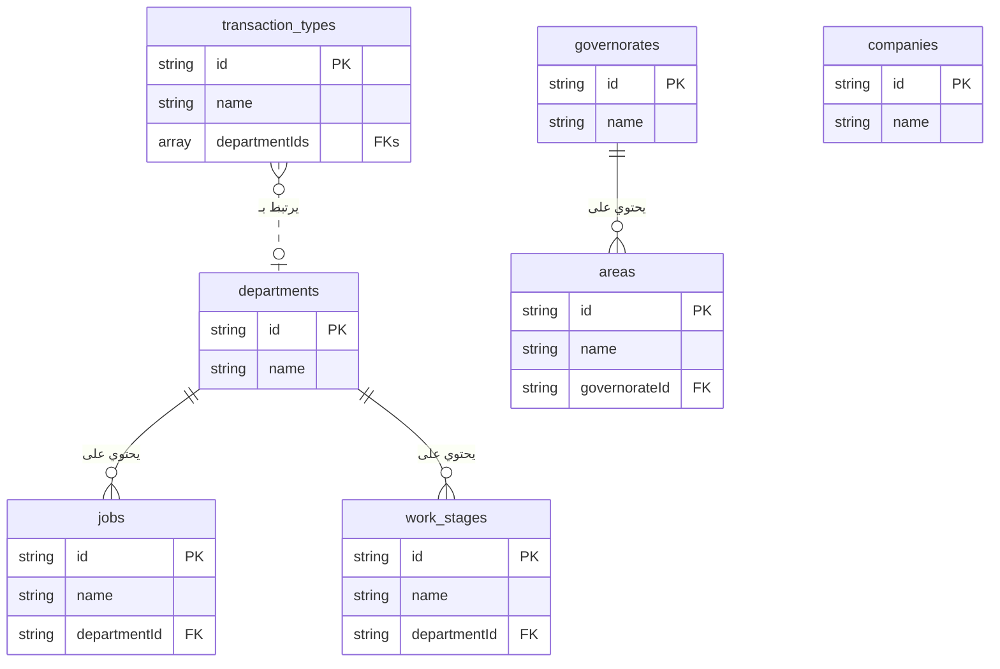

# Project Code Dump

This file contains the complete code for all files in the project, generated upon user request.

---
## File: `.env`
```

```

---
## File: `README.md`
```md
# Firebase Studio
whoami
This is a NextJS starter in Firebase Studio.

To get started, take a look at src/app/page.tsx.

```

---
## File: `apphosting.yaml`
```yaml
# Settings to manage and configure a Firebase App Hosting backend.
# https://firebase.google.com/docs/app-hosting/configure

runConfig:
  # Increase this value if you'd like to automatically spin up
  # more instances in response to increased traffic.
  maxInstances: 1

```

---
## File: `components.json`
```json
{
  "$schema": "https://ui.shadcn.com/schema.json",
  "style": "default",
  "rsc": true,
  "tsx": true,
  "tailwind": {
    "config": "tailwind.config.ts",
    "css": "src/app/globals.css",
    "baseColor": "neutral",
    "cssVariables": true,
    "prefix": ""
  },
  "aliases": {
    "components": "@/components",
    "utils": "@/lib/utils",
    "ui": "@/components/ui",
    "lib": "@/lib",
    "hooks": "@/hooks"
  },
  "iconLibrary": "lucide"
}

```

---
## File: `docs/accounting-features.md`
```md
# وحدة المحاسبة المتكاملة: شرح شامل

هذا المستند يوضح جميع المميزات والعمليات في قسم المحاسبة.

### 1. شجرة الحسابات (Chart of Accounts)
- **المصدر:** `src/app/dashboard/accounting/chart-of-accounts/page.tsx`
- **الوصف:** هي أساس النظام المحاسبي. يمكنك إضافة، تعديل، وحذف الحسابات. النظام يأتي مع شجرة حسابات أساسية يمكنك تنزيلها كنقطة بداية.

### 2. قيود اليومية (Journal Entries)
- **المصدر:** `src/app/dashboard/accounting/journal-entries/`
- **الوصف:** يمكنك إنشاء قيود يدوية أو الاعتماد على القيود التلقائية التي ينشئها النظام (مثل عند إنشاء عقد). تتبع القيود دورة عمل (مسودة -> مرحّل).
- **المساعد المحاسبي الذكي:**
    - **المصدر:** `src/app/dashboard/accounting/assistant/page.tsx`
    - **الوصف:** مساعد ذكاء اصطناعي يفهم الأوامر المحاسبية باللغة العربية ويحولها إلى قيود يومية جاهزة للحفظ.

### 3. السندات (Vouchers)
- **سندات القبض:**
    - **شرح مفصل:** `docs/cash-receipts-features.md`
    - **المصدر:** `src/app/dashboard/accounting/cash-receipts/`
    - **الوصف:** إنشاء سندات قبض مع ترقيم تلقائي، ربط بالعقود، وتوليد ذكي لوصف الدفعة.
- **سندات الصرف:**
    - **المصدر:** `src/app/dashboard/accounting/payment-vouchers/`
    - **الوصف:** إنشاء سندات صرف لتسجيل المدفوعات للموردين والموظفين.

### 4. عروض الأسعار والعقود (Quotations & Contracts)
- **المصدر:** `src/app/dashboard/accounting/quotations/` و `src/components/clients/contract-clauses-form.tsx`
- **الوصف:** يمكنك إنشاء عروض أسعار للعملاء. عند قبول عرض السعر، يمكنك تحويله مباشرة إلى عقد مفصل داخل معاملة العميل، مما يضمن ربط البيانات المالية بالعمليات.

### 5. القوائم المالية (IFRS Compliant)
- **قائمة الدخل (Income Statement):**
    - **المصدر:** `src/app/dashboard/accounting/income-statement/page.tsx`
    - **الوصف:** تعرض الإيرادات والمصروفات وصافي الربح، مع فصل "تكلفة الإيرادات" لعرض "مجمل الربح" بشكل واضح.
- **قائمة المركز المالي (Balance Sheet):**
    - **المصدر:** `src/app/dashboard/accounting/balance-sheet/page.tsx`
    - **الوصف:** تعرض الأصول والالتزامات وحقوق الملكية، مع تصنيفها إلى "متداولة" و "غير متداولة" وفقًا للمعايير الدولية.
- **قائمة التدفقات النقدية (Cash Flow Statement):**
    - **المصدر:** `src/app/dashboard/accounting/cash-flow/page.tsx`
    - **الوصف:** تُعد بالطريقة غير المباشرة، حيث تبدأ بصافي الربح وتعدله للوصول إلى صافي التدفق النقدي.
- **قائمة التغير في حقوق الملكية (Statement of Changes in Equity):**
    - **المصدر:** `src/app/dashboard/accounting/equity-statement/page.tsx`
    - **الوصف:** توضح كيف تغيرت حقوق الملاك خلال الفترة، بربط رصيد البداية بصافي الربح للوصول إلى رصيد النهاية.
- **الإيضاحات المتممة (Financial Statement Notes):**
    - **المصدر:** `src/app/dashboard/accounting/financial-statement-notes/page.tsx`
    - **الوصف:** صفحة تحتوي على محرر نصوص لحفظ الشروحات والتفاصيل الإضافية المطلوبة للقوائم المالية.

### 6. التنبؤ المالي (Financial Forecast)
- **المصدر:** `src/app/dashboard/accounting/financial-forecast/page.tsx`
- **الوصف:** أداة ذكاء اصطناعي تحلل بياناتك التاريخية لتقديم توقعات مستقبلية للإيرادات والمصروفات.
```

---
## File: `docs/appointments-features.md`
```md
# نظام المواعيد الذكي: شرح شامل للمميزات

بناءً على طلبك، إليك شرح مفصل ومبسط لجميع المميزات التي قمنا بتطويرها في نظام إدارة المواعيد، والذي تم تصميمه ليكون دقيقًا، ذكيًا، وسهل الاستخدام.

---

### 1. نظام تقويم مزدوج ومتخصص

تم فصل المواعيد إلى قسمين رئيسيين لتنظيم العمل ومنع التداخل:

*   **جدول القسم المعماري:** مخصص حصريًا لزيارات العملاء مع مهندسي القسم المعماري. يتم عرضه كشبكة زمنية تُظهر حجوزات كل مهندس على حدة.
*   **جدول حجوزات القاعات:** مخصص لحجز قاعات الاجتماعات لمواعيد الأقسام الهندسية الأخرى (كهرباء، إنشائي، إلخ). يتم عرضه كشبكة زمنية تُظهر حجوزات كل قاعة على حدة.

### 2. منطق حجز ذكي لمنع التعارض (Real-time Conflict Detection)

أهم ميزة في النظام هي قدرته على منع الأخطاء البشرية عند حجز المواعيد. قبل حفظ أي موعد جديد أو تعديل، يقوم النظام بالتحقق الفوري من وجود أي تعارض في:

*   **وقت المهندس:** لا يمكن حجز موعدين لنفس المهندس في نفس الفترة الزمنية، حتى لو كان أحدهما في جدول القسم المعماري والآخر في جدول حجوزات القاعات.
*   **وقت العميل:** لا يمكن حجز موعدين لنفس العميل في نفس الفترة.
*   **وقت القاعة:** لا يمكن حجز نفس قاعة الاجتماعات في نفس الوقت.

في حال وجود أي تعارض، يرفض النظام الحفظ ويعرض رسالة تنبيه واضحة.

### 3. نظام تلوين ديناميكي لزيارات القسم المعماري

لتسهيل متابعة حالة العميل بلمحة بصر، تم تصميم نظام ألوان ذكي لمواعيد القسم المعماري:

*   **اللون الأصفر:** يُخصص دائمًا **للموعد الأقدم زمنيًا** للعميل، مما يدل على أنها الزيارة الأولى.
*   **اللون الأخضر:** يُخصص لأي زيارة تالية (الثانية، الثالثة، إلخ) **طالما أن العميل لم يوقع العقد بعد**.
*   **اللون الأزرق:** بمجرد توقيع العقد، تتحول جميع الزيارات التالية للزيارة الأولى إلى اللون الأزرق تلقائيًا.

### 4. عداد الزيارات التلقائي

بجانب اسم العميل في كل موعد معماري، يعرض النظام تلقائيًا رقم الزيارة (مثال: "الزيارة رقم 3"). هذا الرقم ليس ثابتًا، بل هو ديناميكي وذكي.

### 5. نظام تصحيح ذاتي للبيانات

هذه هي الميزة الأكثر قوة. عند **إلغاء أي موعد**، يقوم النظام تلقائيًا بالآتي:

1.  **إعادة الترقيم:** يعيد ترقيم جميع الزيارات المتبقية للعميل بشكل صحيح. فإذا قمت بحذف الزيارة رقم 2، ستصبح الزيارة رقم 3 هي الزيارة رقم 2 الجديدة.
2.  **إعادة التلوين:** بناءً على الترقيم الجديد، يعيد النظام تلوين جميع المواعيد لتعكس الحالة الصحيحة (الموعد الأقدم يصبح أصفر، والبقية أخضر أو أزرق).

هذا يضمن أن البيانات المعروضة دقيقة وموثوقة بنسبة 100% في جميع الأوقات.

### 6. تصميم متجاوب لجميع الأجهزة

تم تصميم واجهة المواعيد لتعمل بسلاسة على جميع الأجهزة، بما في ذلك:

*   شاشات الكمبيوتر المكتبية الكبيرة.
*   الأجهزة اللوحية (آيباد، وغيرها).
*   الهواتف الذكية.

تتكيف الجداول والنوافذ تلقائيًا مع حجم الشاشة لضمان تجربة استخدام سهلة ومريحة في أي مكان.

### 7. طباعة الجداول اليومية

يمكنك بسهولة طباعة جدول المواعيد اليومي لأي من القسمين (المعماري أو حجوزات القاعات) بتنسيق PDF واضح ومناسب للمشاركة أو الأرشفة.
```

---
## File: `docs/backend.json`
```json

{
  "entities": {
    "CompanyBranding": {
      "title": "Company Branding",
      "description": "Stores the company's branding information for letterheads and general UI.",
      "type": "object",
      "properties": {
        "company_name": {
          "type": "string",
          "description": "The full name of the company."
        },
        "address": {
          "type": "string",
          "description": "The company's contact address."
        },
        "phone": {
          "type": "string",
          "description": "The company's contact phone number."
        },
        "email": {
          "type": "string",
          "format": "email",
          "description": "The company's contact email address."
        },
        "tax_number": {
            "type": "string",
            "description": "The company's tax identification number."
        },
        "letterhead_text": {
          "type": "string",
          "description": "Additional text to display on the letterhead."
        },
        "logo_url": {
            "type": "string",
            "format": "uri",
            "description": "URL to the company's logo."
        },
        "letterhead_image_url": {
            "type": "string",
            "format": "uri",
            "description": "URL to the company's full letterhead image."
        },
        "system_background_url": {
            "type": "string",
            "format": "uri",
            "description": "URL for the background image of the system pages."
        },
        "financial_statement_notes": {
            "type": "string",
            "description": "The full text content for the notes to the financial statements."
        }
      },
      "required": ["company_name"]
    },
    "UserProfile": {
      "title": "User Profile",
      "description": "Represents a user's login account in the system.",
      "type": "object",
      "properties": {
        "uid": {
          "type": "string",
          "description": "The unique user ID from Firebase Authentication."
        },
        "username": {
          "type": "string",
          "description": "The user's unique username for login."
        },
        "email": {
          "type": "string",
          "format": "email",
          "description": "Auto-generated internal email address (e.g., username@scoop.local)."
        },
        "passwordHash": {
          "type": "string",
          "description": "The securely hashed password for the user. Hashing should be done server-side."
        },
        "employeeId": {
          "type": "string",
          "description": "A reference to the corresponding document ID in the 'employees' collection."
        },
        "role": {
          "type": "string",
          "description": "The user's role in the system.",
          "enum": ["Admin", "Secretary", "Accountant", "Engineer", "HR"]
        },
        "isActive": {
          "type": "boolean",
          "description": "Whether the user's account is active and can log in."
        },
        "createdAt": {
          "type": "string",
          "format": "date-time",
          "description": "The timestamp when the user account was created."
        },
        "activatedAt": {
          "type": "string",
          "format": "date-time",
          "description": "The timestamp when the user account was last activated."
        },
        "createdBy": {
            "type": "string",
            "description": "The user ID of the admin who created this account."
        }
      },
      "required": [
        "username",
        "email",
        "passwordHash",
        "employeeId",
        "role",
        "isActive",
        "createdAt",
        "createdBy"
      ]
    },
    "Client": {
      "title": "Client",
      "description": "Represents a client of the consultancy.",
      "type": "object",
      "properties": {
        "fileId": {
          "type": "string",
          "description": "The client's file ID, in the format 'sequence/year' (e.g., '1/2024')."
        },
        "fileNumber": {
          "type": "number",
          "description": "The sequential part of the client's file ID for a given year."
        },
        "fileYear": {
          "type": "number",
          "description": "The year of the client's file ID."
        },
        "nameAr": {
            "type": "string",
            "description": "The full name of the client in Arabic."
        },
        "nameEn": {
            "type": "string",
            "description": "The full name of the client in English."
        },
        "mobile": {
          "type": "string",
          "description": "The client's mobile phone number."
        },
        "civilId": {
            "type": "string",
            "description": "The client's Civil ID number."
        },
        "plotNumber": {
            "type": "string",
            "description": "The client's plot number for contracts."
        },
        "address": {
            "type": "object",
            "description": "The client's address.",
            "properties": {
                "governorate": { "type": "string" },
                "area": { "type": "string" },
                "block": { "type": "string" },
                "street": { "type": "string" },
                "houseNumber": { "type": "string" }
            }
        },
        "status": {
          "type": "string",
          "description": "The current status of the client's file.",
          "enum": [
            "new",
            "contracted",
            "cancelled",
            "reContracted"
          ]
        },
        "transactionCounter": {
            "type": "number",
            "description": "A counter for the number of transactions created for this client, used to generate sequential transaction numbers."
        },
        "assignedEngineer": {
          "type": "string",
          "description": "The ID of the engineer assigned to this client."
        },
        "createdAt": {
          "type": "string",
          "format": "date-time",
          "description": "The timestamp when the client was created."
        },
        "isActive": {
          "type": "boolean",
          "description": "Whether the client is active."
        }
      },
      "required": [
        "fileId",
        "fileNumber",
        "fileYear",
        "nameAr",
        "mobile",
        "status",
        "createdAt",
        "isActive"
      ]
    },
    "ClientTransaction": {
        "title": "Client Transaction",
        "description": "Represents an internal service or transaction for a client, like a design submission.",
        "type": "object",
        "properties": {
            "transactionNumber": {
              "type": "string",
              "description": "A unique, human-readable, sequential transaction number for the client (e.g., CL123-TX01)."
            },
            "clientId": { "type": "string", "description": "The ID of the client this transaction belongs to." },
            "transactionType": { "type": "string", "description": "The type of transaction, e.g., 'Municipality Design', 'Electricity Design'." },
            "description": { "type": "string", "description": "A brief description of the transaction." },
            "departmentId": { "type": "string", "description": "The ID of the primary department for this transaction." },
            "transactionTypeId": { "type": "string", "description": "The ID of the transaction type." },
            "status": {
                "type": "string",
                "description": "The current status of the transaction.",
                "enum": ["new", "in-progress", "completed", "submitted", "on-hold"]
            },
            "assignedEngineerId": { "type": "string", "description": "The ID of the primary engineer assigned to this transaction." },
            "createdAt": { "type": "string", "format": "date-time" },
            "updatedAt": { "type": "string", "format": "date-time" },
            "stages": {
                "type": "array",
                "description": "The lifecycle stages of the transaction.",
                "items": { "$ref": "#/entities/TransactionStage" }
            },
            "contract": {
                "type": "object",
                "description": "Stores the customized contract clauses and total amount for this specific transaction.",
                "properties": {
                    "clauses": {
                        "type": "array",
                        "items": {
                            "type": "object",
                            "properties": {
                                "id": { "type": "string" },
                                "name": { "type": "string" },
                                "amount": { "type": "number" },
                                "status": { "type": "string", "enum": ["مدفوعة", "مستحقة", "غير مستحقة"] },
                                "percentage": { "type": "number", "description": "The original percentage value if the financial type was 'percentage'."}
                            },
                            "required": ["id", "name", "amount", "status"]
                        }
                    },
                    "termsAndConditions": {
                      "type": "array",
                      "items": {
                        "type": "object",
                        "properties": { "id": { "type": "string" }, "text": { "type": "string" } },
                        "required": ["id", "text"]
                      }
                    },
                    "openClauses": {
                      "type": "array",
                      "items": {
                        "type": "object",
                        "properties": { "id": { "type": "string" }, "text": { "type": "string" } },
                        "required": ["id", "text"]
                      }
                    },
                    "totalAmount": { "type": "number" },
                    "financialsType": { "type": "string", "enum": ["fixed", "percentage"] }
                },
                "required": ["clauses", "totalAmount"]
            }
        },
        "required": ["transactionNumber", "clientId", "transactionType", "status", "createdAt"]
    },
    "TransactionAssignment": {
        "title": "Transaction Assignment",
        "description": "Represents an assignment or forwarding of a transaction to a specific department and engineer.",
        "type": "object",
        "properties": {
            "transactionId": {
                "type": "string",
                "description": "The ID of the parent ClientTransaction."
            },
            "clientId": {
                "type": "string",
                "description": "The ID of the client."
            },
            "departmentId": { "type": "string" },
            "departmentName": { "type": "string" },
            "engineerId": { "type": "string" },
            "notes": { "type": "string" },
            "status": {
                "type": "string",
                "enum": ["pending", "in-progress", "completed"]
            },
            "createdAt": {
                "type": "string",
                "format": "date-time"
            },
            "createdBy": {
                "type": "string",
                "description": "The ID of the user who created the assignment."
            }
        },
        "required": [
            "transactionId",
            "clientId",
            "departmentId",
            "departmentName",
            "status",
            "createdAt",
            "createdBy"
        ]
    },
    "TransactionTimelineEvent": {
      "title": "Transaction Timeline Event",
      "description": "Represents a single event (comment or log) in a transaction's history.",
      "type": "object",
      "properties": {
        "type": {
          "type": "string",
          "enum": [ "comment", "log" ],
          "description": "The type of event."
        },
        "content": {
          "type": "string",
          "description": "The content of the comment or the description of the log."
        },
        "userId": {
          "type": "string",
          "description": "The ID of the user who created the event."
        },
        "userName": {
          "type": "string",
          "description": "The name of the user who created the event."
        },
        "userAvatar": {
          "type": "string",
          "format": "uri",
          "description": "URL to the user's avatar image."
        },
        "createdAt": {
          "type": "string",
          "format": "date-time"
        }
      },
      "required": [ "type", "content", "userId", "userName", "createdAt" ]
    },
    "TransactionStage": {
      "title": "Transaction Stage",
      "description": "Tracks the progress of a single stage within a client transaction's lifecycle. It is linked to a reference WorkStage via stageId.",
      "type": "object",
      "properties": {
        "stageId": { "type": "string", "description": "The ID of the reference WorkStage document from the department's workStages subcollection." },
        "name": { "type": "string", "description": "Name of the stage, stored for convenience. The name in the reference data is the source of truth." },
        "order": { "type": "number", "description": "The display and logical order of the stage, copied from the template." },
        "status": {
          "type": "string",
          "enum": ["pending", "in-progress", "completed", "skipped", "awaiting-review"],
          "description": "The current status of the stage."
        },
        "allowedRoles": {
            "type": "array",
            "description": "The job titles responsible for this stage, copied from the WorkStage template.",
            "items": { "type": "string" }
        },
        "stageType": {
          "type": "string",
          "enum": ["sequential", "parallel"],
          "description": "'sequential' for main workflow steps, 'parallel' for service stages like modifications that can run alongside."
        },
        "nextStageIds": {
            "type": "array",
            "description": "A list of possible next stage IDs to transition to from this stage.",
            "items": { "type": "string" }
        },
        "allowedDuringStages": {
            "type": "array",
            "description": "For parallel stages only. A list of sequential stage IDs during which this parallel stage can be initiated.",
            "items": { "type": "string" }
        },
        "trackingType": {
          "type": "string",
          "enum": ["duration", "occurrence", "none"],
          "description": "The tracking type of the stage, copied from the template."
        },
        "expectedDurationDays": {
            "type": ["number", "null"],
            "description": "The expected duration in days for this stage (if trackingType is 'duration')."
        },
        "maxOccurrences": {
            "type": ["number", "null"],
            "description": "The maximum number of times this stage can occur (if trackingType is 'occurrence')."
        },
        "allowManualCompletion": {
            "type": "boolean",
            "description": "If true, allows manually completing an 'occurrence' stage before reaching its max count."
        },
        "startDate": { "type": ["string", "null"], "format": "date-time", "description": "When the stage started." },
        "endDate": { "type": ["string", "null"], "format": "date-time", "description": "When the stage was completed." },
        "expectedEndDate": { "type": ["string", "null"], "format": "date-time", "description": "The expected completion date for countdowns." },
        "notes": { "type": ["string", "null"], "description": "Notes specific to this stage." },
        "completedCount": { "type": ["number", "null"], "description": "How many times this stage has been completed (if trackingType is 'occurrence')."}
      },
      "required": ["stageId", "name", "status"]
    },
    "Counter": {
      "title": "Counter",
      "description": "Stores sequential counters for various entities.",
      "type": "object",
      "properties": {
        "counts": {
          "type": "object",
          "description": "A map of keys (e.g., years) to their current count."
        }
      }
    },
    "Employee": {
      "title": "Employee",
      "description": "Represents an employee in the company.",
      "properties": {
        "employeeNumber": { "type": "string", "description": "The unique identifying number for the employee." },
        "fullName": { "type": "string", "description": "Employee's name in Arabic." },
        "nameEn": { "type": "string", "description": "Employee's name in English." },
        "dob": { "type": "string", "format": "date", "description": "Date of birth." },
        "gender": { "type": "string", "enum": ["male", "female"] },
        "civilId": { "type": "string" },
        "nationality": { "type": "string", "description": "The employee's nationality." },
        "residencyExpiry": { "type": "string", "format": "date" },
        "contractExpiry": { "type": "string", "format": "date" },
        "mobile": { "type": "string" },
        "emergencyContact": { "type": "string" },
        "email": { "type": "string", "format": "email" },
        "jobTitle": { "type": "string" },
        "position": { "type": "string", "enum": ["head", "employee", "assistant", "contractor"] },
        "workStartTime": { "type": "string", "description": "The official start time for the employee's shift (e.g., '08:00')." },
        "workEndTime": { "type": "string", "description": "The official end time for the employee's shift (e.g., '17:00')." },
        "salaryPaymentType": { "type": "string", "enum": ["cash", "cheque", "transfer"] },
        "bankName": { "type": "string" },
        "accountNumber": { "type": "string" },
        "iban": { "type": "string" },
        "profilePicture": { "type": "string", "format": "uri" },
        "hireDate": { "type": "string", "format": "date-time" },
        "noticeStartDate": { "type": ["string", "null"], "format": "date-time", "description": "Date when resignation/termination notice was given." },
        "terminationDate": { "type": ["string", "null"], "format": "date-time" },
        "terminationReason": { "type": "string", "enum": ["resignation", "termination", null] },
        "contractType": { "type": "string", "enum": ["permanent", "temporary", "subcontractor", "percentage", "part-time"] },
        "contractPercentage": { "type": "number", "description": "The percentage of contract value for commission-based employees." },
        "department": { "type": "string" },
        "basicSalary": { "type": "number" },
        "housingAllowance": { "type": "number" },
        "transportAllowance": { "type": "number" },
        "status": { "type": "string", "enum": ["active", "on-leave", "terminated"] },
        "lastVacationAccrualDate": { "type": "string", "format": "date-time" },
        "annualLeaveAccrued": { "type": "number" },
        "annualLeaveUsed": { "type": "number" },
        "carriedLeaveDays": { "type": "number" },
        "sickLeaveUsed": { "type": "number" },
        "emergencyLeaveUsed": { "type": "number" },
        "maxEmergencyLeave": { "type": "number" },
        "lastLeaveResetDate": { "type": "string", "format": "date-time" },
        "annualLeaveBalance": { "type": "number", "description": "Calculated current annual leave balance." },
        "createdAt": { "type": "string", "format": "date-time" }
      },
      "required": [
        "employeeNumber",
        "fullName",
        "nameEn",
        "civilId",
        "mobile",
        "department",
        "jobTitle",
        "hireDate",
        "contractType",
        "basicSalary",
        "status"
      ]
    },
    "LeaveRequest": {
        "title": "Leave Request",
        "description": "Represents a leave request submitted by an employee.",
        "type": "object",
        "properties": {
            "employeeId": { "type": "string", "description": "ID of the employee requesting leave." },
            "employeeName": { "type": "string", "description": "Full name of the employee." },
            "leaveType": { "type": "string", "enum": ["Annual", "Sick", "Emergency", "Unpaid"] },
            "startDate": { "type": "string", "format": "date-time" },
            "endDate": { "type": "string", "format": "date-time" },
            "days": { "type": "number", "description": "Total number of leave days." },
            "workingDays": { "type": "number", "description": "Total number of calculated working days." },
            "notes": { "type": "string", "description": "Reason or notes for the leave." },
            "attachmentUrl": { "type": "string", "format": "uri", "description": "URL to a medical report or other document." },
            "status": { "type": "string", "enum": ["pending", "approved", "rejected"], "description": "The current status of the leave request." },
            "createdAt": { "type": "string", "format": "date-time" },
            "approvedBy": { "type": "string", "description": "UID of the user who approved/rejected the request." },
            "approvedAt": { "type": "string", "format": "date-time" },
            "rejectionReason": { "type": "string", "description": "Reason for rejecting the leave request." },
            "isBackFromLeave": { "type": "boolean", "description": "Indicates if the employee has returned from this specific leave." },
            "actualReturnDate": { "type": "string", "format": "date-time", "description": "The actual date the employee returned to work." }
        },
        "required": ["employeeId", "employeeName", "leaveType", "startDate", "endDate", "days", "status", "createdAt"]
    },
    "Holiday": {
        "title": "Holiday",
        "description": "Represents an official public holiday.",
        "type": "object",
        "properties": {
            "name": { "type": "string", "description": "The name of the holiday." },
            "date": { "type": "string", "format": "date", "description": "The date of the holiday." }
        },
        "required": ["name", "date"]
    },
    "AuditLog": {
        "title": "Audit Log",
        "description": "Records changes made to employee data for historical tracking.",
        "type": "object",
        "properties": {
            "changeType": { "type": "string", "enum": ["Creation", "SalaryChange", "JobChange", "DataUpdate"] },
            "field": { "type": "string", "description": "The name of the field that was changed." },
            "oldValue": { "description": "The value of the field before the change." },
            "newValue": { "description": "The value of the field after the change." },
            "effectiveDate": { "type": "string", "format": "date-time", "description": "The date when this change becomes effective." },
            "changedBy": { "type": "string", "description": "The ID of the user who made the change." },
            "notes": { "type": "string", "description": "Additional notes about the change." }
        },
        "required": ["changeType", "field", "newValue", "effectiveDate", "changedBy"]
    },
    "MonthlyAttendance": {
      "title": "Monthly Attendance",
      "description": "An employee's attendance records and summary for a specific month.",
      "type": "object",
      "properties": {
        "employeeId": { "type": "string" },
        "year": { "type": "number" },
        "month": { "type": "number" },
        "records": {
          "type": "array",
          "items": {
            "type": "object",
            "properties": {
              "date": { "type": "string", "format": "date" },
              "checkIn": { "type": "string" },
              "checkOut": { "type": "string" },
              "status": { "type": "string", "enum": ["present", "absent", "late", "leave"] }
            },
            "required": ["date", "status"]
          }
        },
        "summary": {
          "type": "object",
          "properties": {
            "totalDays": { "type": "number" },
            "presentDays": { "type": "number" },
            "absentDays": { "type": "number" },
            "lateDays": { "type": "number" },
            "leaveDays": { "type": "number" }
          },
          "required": ["presentDays", "absentDays", "lateDays", "leaveDays"]
        }
      },
      "required": ["employeeId", "year", "month", "records", "summary"]
    },
    "Payslip": {
      "title": "Payslip",
      "description": "An employee's payslip for a specific month.",
      "type": "object",
      "properties": {
        "employeeId": { "type": "string" },
        "employeeName": { "type": "string" },
        "year": { "type": "number" },
        "month": { "type": "number" },
        "attendanceId": { "type": "string", "description": "Reference to the attendance document ID." },
        "salaryPaymentType": { "type": "string", "enum": ["cash", "cheque", "transfer"] },
        "earnings": {
          "type": "object",
          "properties": {
            "basicSalary": { "type": "number" },
            "housingAllowance": { "type": "number" },
            "transportAllowance": { "type": "number" },
            "commission": { "type": "number", "description": "Commission earned in the period." }
          },
           "required": ["basicSalary"]
        },
        "deductions": {
          "type": "object",
          "properties": {
            "absenceDeduction": { "type": "number" },
            "otherDeductions": { "type": "number" }
          }
        },
        "netSalary": { "type": "number" },
        "status": { "type": "string", "enum": ["draft", "processed", "paid"] },
        "createdAt": { "type": "string", "format": "date-time" }
      },
      "required": ["employeeId", "year", "month", "earnings", "netSalary", "status", "createdAt"]
    },
    "Notification": {
      "title": "Notification",
      "description": "Represents a notification for a user about an event in the system.",
      "type": "object",
      "properties": {
        "userId": { "type": "string", "description": "The ID of the user to whom the notification is sent." },
        "title": { "type": "string", "description": "A short, bolded title for the notification." },
        "body": { "type": "string", "description": "The main content of the notification message." },
        "link": { "type": "string", "description": "The URL the user will be redirected to upon clicking the notification." },
        "isRead": { "type": "boolean", "description": "Whether the user has read the notification." },
        "createdAt": { "type": "string", "format": "date-time" }
      },
      "required": ["userId", "title", "body", "link", "isRead", "createdAt"]
    },
    "Department": {
      "title": "Department",
      "description": "Represents a department in the company.",
      "type": "object",
      "properties": {
        "name": {
          "type": "string",
          "description": "The name of the department."
        },
        "order": {
            "type": "number",
            "description": "The display order."
        }
      },
      "required": ["name"]
    },
    "Job": {
      "title": "Job",
      "description": "Represents a job title within a department.",
      "type": "object",
      "properties": {
        "name": {
          "type": "string",
          "description": "The name of the job."
        },
        "order": {
            "type": "number",
            "description": "The display order."
        }
      },
      "required": ["name"]
    },
    "Governorate": {
      "title": "Governorate",
      "description": "Represents a governorate in the country.",
      "type": "object",
      "properties": {
        "name": {
          "type": "string",
          "description": "The name of the governorate."
        },
        "order": {
            "type": "number",
            "description": "The display order."
        }
      },
      "required": ["name"]
    },
    "Area": {
      "title": "Area",
      "description": "Represents an area within a governorate.",
      "type": "object",
      "properties": {
        "name": {
          "type": "string",
          "description": "The name of the area."
        },
        "order": {
            "type": "number",
            "description": "The display order."
        }
      },
      "required": ["name"]
    },
    "TransactionType": {
      "title": "Transaction Type",
      "description": "Represents a type of internal client transaction and links it to the departments involved.",
      "type": "object",
      "properties": {
        "name": {
          "type": "string",
          "description": "The name of the transaction type (e.g., 'Municipality Design')."
        },
        "departmentIds": {
            "type": "array",
            "description": "A list of department IDs involved in this transaction type.",
            "items": { "type": "string" }
        },
        "order": {
          "type": "number",
          "description": "The display and logical order of the type."
        }
      },
      "required": ["name", "departmentIds"]
    },
    "WorkStage": {
      "title": "Work Stage",
      "description": "Represents a standard work stage that can be associated with a department. Defines a step in a workflow.",
      "type": "object",
      "properties": {
        "name": { "type": "string", "description": "The name of the work stage." },
        "order": { "type": "number", "description": "The display and logical order of the stage." },
        "stageType": {
          "type": "string",
          "enum": ["sequential", "parallel"],
          "description": "'sequential' for main workflow steps, 'parallel' for service stages like modifications that can run alongside."
        },
        "allowedRoles": { "type": "array", "description": "A list of job titles responsible for this stage.", "items": { "type": "string" } },
        "nextStageIds": { "type": "array", "description": "A list of possible next stage IDs to transition to from this stage.", "items": { "type": "string" } },
        "allowedDuringStages": { "type": "array", "description": "For parallel stages only. A list of sequential stage IDs during which this parallel stage can be initiated.", "items": { "type": "string" } },
        "trackingType": { "type": "string", "enum": ["duration", "occurrence", "none"], "description": "How to track progress: by time, occurrences, or as a single event." },
        "expectedDurationDays": { "type": ["number", "null"], "description": "The expected duration in days for this stage (if trackingType is 'duration')." },
        "maxOccurrences": { "type": ["number", "null"], "description": "The maximum number of times this stage can occur (if trackingType is 'occurrence')." },
        "allowManualCompletion": { "type": "boolean", "description": "If true, allows manually completing an 'occurrence' stage before reaching its max count." }
      },
      "required": ["name", "order", "stageType", "trackingType"]
    },
    "Appointment": {
      "title": "Appointment",
      "description": "Represents a scheduled meeting or visit.",
      "type": "object",
      "properties": {
        "clientId": {
          "type": "string",
          "description": "The ID of the client for this appointment. Can be null for a new prospect."
        },
        "clientName": {
            "type": "string",
            "description": "The name of the client, especially if not yet a registered client."
        },
        "clientMobile": {
            "type": "string",
            "description": "The mobile number of the client, especially if not yet a registered client."
        },
        "engineerId": {
          "type": "string",
          "description": "The ID of the employee attending the appointment."
        },
        "meetingRoom": {
          "type": "string",
          "description": "The name of the meeting room, if applicable (for non-architectural appointments)."
        },
        "department": {
          "type": "string",
          "description": "The department associated with the appointment, used for color-coding.",
          "enum": ["الكهرباء", "الصحي", "الإنشائي", "المعماري", "أخرى"]
        },
        "title": {
          "type": "string",
          "description": "The purpose or title of the appointment."
        },
        "notes": {
          "type": "string",
          "description": "Additional notes about the appointment."
        },
        "type": {
          "type": "string",
          "description": "Distinguishes between architectural appointments and room bookings.",
          "enum": ["architectural", "room"]
        },
        "appointmentDate": {
          "type": "string",
          "format": "date-time",
          "description": "The start date and time of the appointment."
        },
        "endDate": {
          "type": "string",
          "format": "date-time",
          "description": "The end date and time of the appointment."
        },
        "createdAt": {
          "type": "string",
          "format": "date-time"
        },
        "transactionId": {
          "type": "string",
          "description": "The ID of the client transaction this appointment is related to."
        },
        "workStageUpdated": {
            "type": "boolean",
            "description": "Indicates if the work stage has been updated for this visit."
        },
        "workStageProgressId": {
            "type": "string",
            "description": "Reference to the document in work_stages_progress."
        },
        "visitCount": {
            "type": "number",
            "description": "The sequential visit number for this client's architectural appointments."
        },
        "color": {
            "type": "string",
            "description": "Hex color code for calendar display based on visit status."
        }
      },
      "required": ["engineerId", "title", "appointmentDate", "createdAt", "type"]
    },
    "WorkStageProgress": {
        "title": "Work Stage Progress",
        "description": "Logs the selection of a work stage for a specific architectural visit.",
        "type": "object",
        "properties": {
            "transactionId": { "type": "string", "description": "The ID of the client transaction this visit is related to." },
            "visitId": { "type": "string", "description": "The ID of the architectural visit document." },
            "stageId": { "type": "string", "description": "The ID of the selected work stage." },
            "stageName": { "type": "string", "description": "The name of the selected work stage." },
            "selectedBy": { "type": "string", "description": "The ID of the employee who updated the stage." },
            "selectedAt": { "type": "string", "format": "date-time" }
        },
        "required": ["visitId", "stageId", "stageName", "selectedBy", "selectedAt"]
    },
    "Contract": {
      "title": "Contract",
      "description": "Represents a fully dynamic, user-generated contract.",
      "type": "object",
      "properties": {
        "clientId": { "type": "string" },
        "clientName": { "type": "string" },
        "companySnapshot": { "type": "object", "description": "A snapshot of company data at time of creation." },
        "title": { "type": "string" },
        "contractDate": { "type": "string", "format": "date-time" },
        "scopeOfWork": {
          "type": "array",
          "items": {
            "type": "object",
            "properties": { "id": { "type": "string" }, "title": { "type": "string" }, "description": { "type": "string" } },
            "required": ["id", "title"]
          }
        },
        "termsAndConditions": {
          "type": "array",
          "items": {
            "type": "object",
            "properties": { "id": { "type": "string" }, "text": { "type": "string" } },
            "required": ["id", "text"]
          }
        },
        "financials": {
          "type": "object",
          "properties": {
            "type": { "type": "string", "enum": ["fixed", "percentage"] },
            "totalAmount": { "type": "number" },
            "discount": { "type": "number" },
            "milestones": {
              "type": "array",
              "items": {
                "type": "object",
                "properties": {
                  "id": { "type": "string" },
                  "name": { "type": "string" },
                  "condition": { "type": "string" },
                  "value": { "type": "number" }
                },
                "required": ["id", "name", "value"]
              }
            }
          }
        },
        "openClauses": {
          "type": "array",
          "items": {
            "type": "object",
            "properties": { "id": { "type": "string" }, "text": { "type": "string" } },
            "required": ["id", "text"]
          }
        },
        "createdAt": { "type": "string", "format": "date-time" },
        "createdBy": { "type": "string" }
      },
      "required": ["clientId", "title", "contractDate", "createdAt"]
    },
    "ContractTemplate": {
      "title": "Contract Template",
      "description": "A reusable template for generating contracts.",
      "type": "object",
      "properties": {
        "title": { "type": "string" },
        "description": { "type": "string" },
        "transactionTypes": { "type": "array", "items": { "type": "string" } },
        "scopeOfWork": {
          "type": "array",
          "items": {
            "type": "object",
            "properties": { "id": { "type": "string" }, "title": { "type": "string" }, "description": { "type": "string" } },
            "required": ["id", "title"]
          }
        },
        "termsAndConditions": {
          "type": "array",
          "items": {
            "type": "object",
            "properties": { "id": { "type": "string" }, "text": { "type": "string" } },
            "required": ["id", "text"]
          }
        },
        "financials": {
          "type": "object",
          "properties": {
            "type": { "type": "string", "enum": ["fixed", "percentage"] },
            "totalAmount": { "type": "number" },
            "discount": { "type": "number" },
            "milestones": {
              "type": "array",
              "items": {
                "type": "object",
                "properties": {
                  "id": { "type": "string" },
                  "name": { "type": "string" },
                  "condition": { "type": "string" },
                  "value": { "type": "number" }
                },
                "required": ["id", "name", "value"]
              }
            }
          }
        },
        "openClauses": {
          "type": "array",
          "items": {
            "type": "object",
            "properties": { "id": { "type": "string" }, "text": { "type": "string" } },
            "required": ["id", "text"]
          }
        }
      },
      "required": ["title"]
    },
    "Account": {
        "title": "Account",
        "description": "An account in the Chart of Accounts.",
        "type": "object",
        "properties": {
            "code": { "type": "string" },
            "name": { "type": "string" },
            "type": { "type": "string", "enum": ["asset", "liability", "equity", "income", "expense"] },
            "statement": { "type": "string", "enum": ["Balance Sheet", "Income Statement"] },
            "balanceType": { "type": "string", "enum": ["Debit", "Credit"] },
            "level": { "type": "number", "description": "The hierarchy level of the account." },
            "description": { "type": "string" },
            "isPayable": { "type": "boolean" },
            "parentCode": { "type": ["string", "null"] }
        },
        "required": ["name", "code", "type", "level", "isPayable", "statement", "balanceType"]
    },
    "JournalEntryLine": {
      "title": "Journal Entry Line",
      "description": "A single line in a journal entry, representing a debit or credit to an account.",
      "type": "object",
      "properties": {
        "accountId": {
          "type": "string",
          "description": "The ID of the account from the chart of accounts."
        },
        "accountName": {
          "type": "string",
          "description": "The name of the account."
        },
        "debit": {
          "type": "number",
          "description": "The debit amount."
        },
        "credit": {
          "type": "number",
          "description": "The credit amount."
        },
        "notes": {
          "type": "string",
          "description": "Optional notes for this line."
        },
        "clientId": {
            "type": "string",
            "description": "The ID of the client related to this line."
        },
        "transactionId": {
            "type": "string",
            "description": "The ID of the client transaction related to this line."
        },
        "auto_profit_center": {
          "type": "string",
          "description": "Auto-tagged client/project ID for profit analysis."
        },
        "auto_resource_id": {
            "type": "string",
            "description": "Auto-tagged employee ID for resource analysis."
        },
        "auto_dept_id": {
            "type": "string",
            "description": "Auto-tagged department ID for departmental analysis."
        }
      },
      "required": ["accountId", "accountName", "debit", "credit"]
    },
    "JournalEntry": {
      "title": "Journal Entry",
      "description": "Represents a general journal entry with multiple debit/credit lines.",
      "type": "object",
      "properties": {
        "entryNumber": {
          "type": "string",
          "description": "A sequential number for the journal entry (e.g., JV-2024-0001)."
        },
        "date": {
          "type": "string",
          "format": "date-time",
          "description": "The date of the journal entry."
        },
        "narration": {
          "type": "string",
          "description": "A general description or narration for the entry."
        },
        "reference": {
          "type": "string",
          "description": "An optional external reference number."
        },
        "linkedReceiptId": {
          "type": "string",
          "description": "The ID of the cash receipt that triggered this entry, if any."
        },
        "totalDebit": {
          "type": "number",
          "description": "The total of all debit lines, for validation."
        },
        "totalCredit": {
          "type": "number",
          "description": "The total of all credit lines, for validation."
        },
        "status": {
            "type": "string",
            "enum": ["draft", "posted"],
            "description": "The status of the journal entry."
        },
        "lines": {
          "type": "array",
          "items": {
            "$ref": "#/entities/JournalEntryLine"
          }
        },
        "clientId": {
            "type": "string",
            "description": "The ID of the client related to this entry."
        },
        "transactionId": {
            "type": "string",
            "description": "The ID of the client transaction related to this entry."
        },
        "createdAt": {
          "type": "string",
          "format": "date-time"
        },
        "createdBy": {
          "type": "string",
          "description": "The ID of the user who created the entry."
        }
      },
      "required": ["entryNumber", "date", "narration", "totalDebit", "totalCredit", "status", "lines", "createdAt"]
    },
    "PaymentVoucher": {
      "title": "Payment Voucher",
      "description": "Represents a payment voucher for disbursing funds.",
      "type": "object",
      "properties": {
        "voucherNumber": { "type": "string" },
        "voucherSequence": { "type": "number" },
        "voucherYear": { "type": "number" },
        "payeeName": { "type": "string" },
        "payeeType": { "type": "string", "enum": ["vendor", "employee", "other"] },
        "amount": { "type": "number" },
        "amountInWords": { "type": "string" },
        "paymentDate": { "type": "string", "format": "date-time" },
        "paymentMethod": { "type": "string", "enum": ["Cash", "Cheque", "Bank Transfer", "EmployeeCustody"] },
        "description": { "type": "string" },
        "reference": { "type": "string", "description": "e.g., Cheque number or transfer reference" },
        "debitAccountId": { "type": "string" },
        "debitAccountName": { "type": "string" },
        "creditAccountId": { "type": "string" },
        "creditAccountName": { "type": "string" },
        "status": { "type": "string", "enum": ["draft", "paid", "cancelled"] },
        "journalEntryId": { "type": "string" },
        "createdAt": { "type": "string", "format": "date-time" },
        "clientId": { "type": "string", "description": "Client ID if this payment is for a project"},
        "transactionId": { "type": "string", "description": "Transaction ID if this payment is for a project"}
      },
      "required": ["voucherNumber", "payeeName", "amount", "paymentDate", "paymentMethod", "debitAccountId", "creditAccountId", "status"]
    },
    "CashReceipt": {
      "title": "Cash Receipt",
      "description": "Represents a cash receipt voucher.",
      "type": "object",
      "properties": {
        "voucherNumber": { "type": "string" },
        "voucherSequence": { "type": "number" },
        "voucherYear": { "type": "number" },
        "clientId": { "type": "string" },
        "clientNameAr": { "type": "string" },
        "clientNameEn": { "type": "string" },
        "projectId": { "type": "string" },
        "projectNameAr": { "type": "string" },
        "amount": { "type": "number" },
        "amountInWords": { "type": "string" },
        "receiptDate": { "type": "string", "format": "date-time" },
        "paymentMethod": { "type": "string", "enum": ["Cash", "Cheque", "Bank Transfer", "K-Net"] },
        "description": { "type": "string" },
        "reference": { "type": "string" },
        "journalEntryId": {
            "type": "string",
            "description": "The ID of the journal entry automatically created for this receipt."
        },
        "createdAt": { "type": "string", "format": "date-time" }
      },
      "required": ["voucherNumber", "clientId", "amount", "receiptDate", "paymentMethod"]
    },
    "Quotation": {
      "title": "Quotation",
      "description": "Represents a price quotation provided to a client.",
      "type": "object",
      "properties": {
        "quotationNumber": { "type": "string" },
        "quotationSequence": { "type": "number" },
        "quotationYear": { "type": "number" },
        "clientId": { "type": "string" },
        "clientName": { "type": "string" },
        "date": { "type": "string", "format": "date-time" },
        "validUntil": { "type": "string", "format": "date-time" },
        "subject": { "type": "string" },
        "departmentId": { "type": "string", "description": "The ID of the department this quotation is for." },
        "transactionTypeId": { "type": "string", "description": "The ID of the transaction type this quotation is for." },
        "items": {
          "type": "array",
          "items": {
            "type": "object",
            "properties": {
              "id": { "type": "string" },
              "description": { "type": "string" },
              "quantity": { "type": "number" },
              "unitPrice": { "type": "number" },
              "total": { "type": "number" },
              "condition": { "type": "string", "description": "The condition for this item to be due, often linked to a work stage."}
            },
            "required": ["description", "quantity", "unitPrice", "total"]
          }
        },
        "totalAmount": { "type": "number" },
        "notes": { "type": "string" },
        "status": { "type": "string", "enum": ["draft", "sent", "accepted", "rejected", "expired"] },
        "createdAt": { "type": "string", "format": "date-time" },
        "createdBy": { "type": "string" }
      },
      "required": ["quotationNumber", "clientId", "date", "subject", "items", "totalAmount", "status", "createdAt"]
    },
    "Vendor": {
      "title": "Vendor",
      "description": "Represents a supplier or vendor.",
      "type": "object",
      "properties": {
        "name": { "type": "string" },
        "contactPerson": { "type": "string" },
        "phone": { "type": "string" },
        "email": { "type": "string", "format": "email" },
        "address": { "type": "string" }
      },
      "required": ["name"]
    },
    "PurchaseOrder": {
      "title": "Purchase Order",
      "description": "Represents a purchase order for materials or services.",
      "type": "object",
      "properties": {
        "poNumber": { "type": "string", "description": "Sequential PO number." },
        "orderDate": { "type": "string", "format": "date-time" },
        "vendorId": { "type": "string" },
        "vendorName": { "type": "string" },
        "projectId": { "type": "string", "description": "Optional link to a project." },
        "items": {
          "type": "array",
          "items": {
            "type": "object",
            "properties": {
              "description": { "type": "string" },
              "quantity": { "type": "number" },
              "unitPrice": { "type": "number" },
              "total": { "type": "number" }
            },
            "required": ["description", "quantity", "unitPrice", "total"]
          }
        },
        "totalAmount": { "type": "number" },
        "paymentTerms": { "type": "string" },
        "notes": { "type": "string" },
        "status": {
          "type": "string",
          "enum": ["draft", "approved", "partially_received", "received", "cancelled"]
        }
      },
      "required": ["poNumber", "orderDate", "vendorId", "items", "totalAmount", "status"]
    }
  },
  "auth": {
    "providers": [
      "anonymous"
    ]
  },
  "firestore": {
    "/company_settings/{settingsId}": {
      "schema": { "$ref": "#/entities/CompanyBranding" },
      "description": "Stores the main company branding and letterhead information. Expects a single document with a known ID like 'main'."
    },
    "/users/{userId}": {
      "schema": {
        "$ref": "#/entities/UserProfile"
      },
      "description": "Stores user login accounts, linked to employees."
    },
    "/clients/{clientId}": {
      "schema": {
        "$ref": "#/entities/Client"
      },
      "description": "Stores information about the company's clients."
    },
    "/clients/{clientId}/transactions/{transactionId}": {
        "schema": {
            "$ref": "#/entities/ClientTransaction"
        },
        "description": "Stores internal transactions/services for a specific client."
    },
    "/transaction_assignments/{assignmentId}": {
        "schema": {
            "$ref": "#/entities/TransactionAssignment"
        },
        "description": "Stores individual assignments of a transaction to different departments."
    },
    "/clients/{clientId}/transactions/{transactionId}/timelineEvents/{eventId}": {
      "schema": {
        "$ref": "#/entities/TransactionTimelineEvent"
      },
      "description": "Stores the chronological history and comments for a specific transaction."
    },
    "/clients/{clientId}/history/{eventId}": {
      "schema": {
        "$ref": "#/entities/TransactionTimelineEvent"
      },
      "description": "Stores the audit history and important events for a client file."
    },
    "/counters/{counterId}": {
      "schema": {
        "$ref": "#/entities/Counter"
      },
      "description": "Stores shared counters. e.g., counterId = 'clientFiles'."
    },
    "/employees/{employeeId}": {
        "schema": { "$ref": "#/entities/Employee" },
        "description": "Stores HR information about company employees."
    },
    "/employees/{employeeId}/auditLogs/{logId}": {
        "schema": { "$ref": "#/entities/AuditLog" },
        "description": "Stores the historical audit trail of changes for a specific employee."
    },
    "/leaveRequests/{leaveRequestId}": {
        "schema": { "$ref": "#/entities/LeaveRequest" },
        "description": "Stores all employee leave requests."
    },
    "/holidays/{holidayId}": {
        "schema": { "$ref": "#/entities/Holiday" },
        "description": "Stores all official public holidays."
    },
    "/attendance/{attendanceId}": {
      "schema": { "$ref": "#/entities/MonthlyAttendance" },
      "description": "Stores monthly attendance sheets for employees. The ID is a composite of year-month-employeeId."
    },
    "/payroll/{payslipId}": {
      "schema": { "$ref": "#/entities/Payslip" },
      "description": "Stores generated monthly payslips for employees. The ID is a composite of year-month-employeeId."
    },
    "/notifications/{notificationId}": {
      "schema": {
        "$ref": "#/entities/Notification"
      },
      "description": "Stores notifications for all users."
    },
    "/departments/{departmentId}": {
      "schema": { "$ref": "#/entities/Department" },
      "description": "Stores company departments."
    },
    "/departments/{departmentId}/jobs/{jobId}": {
        "schema": { "$ref": "#/entities/Job" },
        "description": "Stores job titles for a specific department."
    },
    "/departments/{departmentId}/workStages/{workStageId}": {
        "schema": { "$ref": "#/entities/WorkStage" },
        "description": "Stores standard work stages for a specific department."
    },
    "/governorates/{governorateId}": {
      "schema": { "$ref": "#/entities/Governorate" },
      "description": "Stores country governorates."
    },
    "/governorates/{governorateId}/areas/{areaId}": {
        "schema": { "$ref": "#/entities/Area" },
        "description": "Stores areas for a specific governorate."
    },
    "/transactionTypes/{transactionTypeId}": {
      "schema": { "$ref": "#/entities/TransactionType" },
      "description": "Stores the types of internal client transactions, linking them to one or more departments."
    },
    "/appointments/{appointmentId}": {
      "schema": {
        "$ref": "#/entities/Appointment"
      },
      "description": "Stores all scheduled appointments."
    },
    "/work_stages_progress/{progressId}": {
        "schema": {
            "$ref": "#/entities/WorkStageProgress"
        },
        "description": "Stores logs of work stage updates from architectural visits."
    },
    "/contracts/{contractId}": {
      "schema": {
        "$ref": "#/entities/Contract"
      },
      "description": "Stores dynamically generated contracts."
    },
    "/contractTemplates/{templateId}": {
      "schema": {
        "$ref": "#/entities/ContractTemplate"
      },
      "description": "Stores reusable contract templates for various transaction types."
    },
    "/chartOfAccounts/{accountId}": {
        "schema": {
            "$ref": "#/entities/Account"
        },
        "description": "Stores the company's chart of accounts."
    },
    "/journalEntries/{journalEntryId}": {
      "schema": {
        "$ref": "#/entities/JournalEntry"
      },
      "description": "Stores general journal entries created manually or by other processes."
    },
    "/paymentVouchers/{voucherId}": {
      "schema": { "$ref": "#/entities/PaymentVoucher" },
      "description": "Stores all payment vouchers issued by the company."
    },
    "/cashReceipts/{receiptId}": {
      "schema": { "$ref": "#/entities/CashReceipt" },
      "description": "Stores all cash receipt vouchers received by the company."
    },
    "/quotations/{quotationId}": {
      "schema": {
        "$ref": "#/entities/Quotation"
      },
      "description": "Stores all quotations sent to clients."
    },
    "/vendors/{vendorId}": {
      "schema": {
        "$ref": "#/entities/Vendor"
      },
      "description": "Stores information about suppliers and vendors."
    },
    "/purchaseOrders/{poId}": {
      "schema": {
        "$ref": "#/entities/PurchaseOrder"
      },
      "description": "Stores all purchase orders issued to vendors."
    }
  }
}

```

---
## File: `docs/cash-receipts-features.md`
```md
# وحدة سندات القبض: شرح شامل للمميزات

بناءً على طلبك، إليك شرح مفصل ومبسط لجميع المميزات التي قمنا بتطويرها في وحدة "سندات القبض"، والتي تم تصميمها لتكون مرنة، ذكية، ومتكاملة تمامًا مع بقية أقسام النظام.

---

### 1. إنشاء سند قبض ذكي

تم تصميم شاشة "سند قبض جديد" لتكون أكثر من مجرد أداة لإدخال البيانات، بل مساعد ذكي يسرّع عملك ويمنع الأخطاء.

*   **الترقيم التلقائي:** لا داعي للقلق بشأن أرقام السندات. يقوم النظام تلقائيًا بإنشاء رقم سند فريد ومتسلسل لكل سنة (مثال: `CRV-2024-0001`).

*   **الربط المباشر بالعملاء والعقود:**
    *   بمجرد اختيار العميل من القائمة، يقوم النظام فورًا بجلب قائمة "العقود" أو "المشاريع" الخاصة بهذا العميل.
    *   يمكنك اختيار ربط سند القبض بعقد معين.

*   **توليد ذكي لوصف الدفعة (أهم ميزة):**
    *   عندما تختار عقدًا معينًا وتدخل المبلغ المستلم، يقوم النظام **بتحليل بنود الدفعات في العقد تلقائيًا**.
    *   يقوم بإنشاء وصف مفصل يوضح أي الدفعات يتم سدادها بهذا المبلغ (سواء كان سدادًا كاملًا أو جزئيًا).
    *   **مثال:** إذا أدخلت مبلغ 700 دينار، وكان هناك دفعة مستحقة بقيمة 500 وأخرى بقيمة 1000، سيكتب النظام تلقائيًا في الوصف:
        > سداد كامل للدفعة "الأولى" بقيمة 500 د.ك
        > سداد جزئي من الدفعة "الثانية" بقيمة 200 د.ك

*   **تحويل المبلغ إلى نص عربي (تفقيط):** يقوم النظام تلقائيًا بتحويل المبلغ المدخل بالأرقام إلى نص مكتوب باللغة العربية (مثال: "فقط سبعمائة دينار كويتي لا غير").

### 2. تكامل فوري مع إدارة المشاريع

لا يعمل قسم المحاسبة بمعزل عن الأقسام الهندسية. لذلك، تم ربط سندات القبض مباشرة بسير عمل المشاريع.

*   **توثيق فوري في سجل المعاملة:**
    *   عند حفظ سند قبض مرتبط بمشروع معين، يقوم النظام تلقائيًا بإضافة **تعليق** في "التايم لاين" الخاص بهذه المعاملة.
    *   يحتوي التعليق على رقم السند وتفاصيل الدفعة، مما يضمن أن المهندس المسؤول عن المشروع على دراية تامة بالوضع المالي للمشروع لحظة بلحظة.

*   **إشعارات تلقائية للمهندسين:**
    *   في نفس اللحظة، يرسل النظام **إشعارًا (Notification)** للمهندس المسؤول عن المشروع، يخطره بأنه تم تسجيل دفعة مالية جديدة، مع رابط مباشر للمعاملة.

### 3. سهولة العرض والطباعة

*   **تصميم احترافي جاهز للطباعة:** عند عرض أي سند قبض، يتم تقديمه في تصميم أنيق وواضح، يتضمن شعار وبيانات شركتك، ومُعد خصيصًا للطباعة الرسمية.

*   **تصدير PDF:** يمكنك بسهولة طباعة السند أو تصديره كملف PDF لتسليمه للعميل أو لأغراض الأرشفة.

### 4. إدارة شاملة ومرنة

*   **قائمة مركزية:** توفر لك صفحة "سندات القبض" قائمة بجميع السندات التي تم إنشاؤها، مع إمكانية البحث والفلترة السريعة.

*   **تعديل وحذف:** يمكنك بسهولة تعديل بيانات أي سند قبض أو حذفه بالكامل إذا لزم الأمر.
```

---
## File: `docs/multiselect-component-code.md`
```md
# كود مكون الاختيار المتعدد (MultiSelect)

بناءً على طلبك، هذا هو الكود الكامل لمكون الاختيار المتعدد المستخدم في التطبيق.
الملف الأصلي موجود في المسار: `src/components/ui/multi-select.tsx`

```tsx
'use client';

import * as React from 'react';
import Select, { type MultiValue, type StylesConfig } from 'react-select';
import { cn } from '@/lib/utils';

export interface MultiSelectOption {
  value: string;
  label: string;
}

interface MultiSelectProps {
  options: MultiSelectOption[];
  selected: string[];
  onChange: (selected: string[]) => void;
  placeholder?: string;
  className?: string;
  disabled?: boolean;
}

export function MultiSelect({ options, selected, onChange, placeholder = 'اختر...', className, disabled = false }: MultiSelectProps) {
  
  const handleChange = (newSelected: MultiValue<MultiSelectOption>) => {
    const values = newSelected ? newSelected.map(opt => opt.value) : [];
    onChange(values);
  };

  const selectedOptions = options.filter(opt => selected.includes(opt.value));
  
  const customStyles: StylesConfig<MultiSelectOption, true> = {
    control: (base, state) => ({
      ...base,
      backgroundColor: 'hsl(var(--card))',
      borderColor: state.isFocused ? 'hsl(var(--ring))' : 'hsl(var(--border))',
      minHeight: '40px',
      boxShadow: state.isFocused ? '0 0 0 1px hsl(var(--ring))' : 'none',
      '&:hover': {
        borderColor: 'hsl(var(--ring))',
      },
    }),
    placeholder: (base) => ({
        ...base,
        color: 'hsl(var(--muted-foreground))',
    }),
    input: (base) => ({
        ...base,
        color: 'hsl(var(--foreground))',
    }),
    menu: (base) => ({
      ...base,
      backgroundColor: 'hsl(var(--card))',
      zIndex: 20,
    }),
    option: (base, state) => ({
      ...base,
      backgroundColor: state.isSelected ? 'hsl(var(--primary))' : state.isFocused ? 'hsl(var(--accent))' : 'transparent',
      color: state.isSelected ? 'hsl(var(--primary-foreground))' : 'hsl(var(--foreground))',
      '&:active': {
        backgroundColor: 'hsl(var(--primary))',
      },
    }),
    multiValue: (base) => ({
      ...base,
      backgroundColor: 'hsl(var(--secondary))',
      borderRadius: '9999px',
    }),
    multiValueLabel: (base) => ({
      ...base,
      color: 'hsl(var(--secondary-foreground))',
      paddingRight: '6px',
      fontSize: '0.875rem'
    }),
    multiValueRemove: (base, state) => ({
      ...base,
      color: 'hsl(var(--secondary-foreground))',
      '&:hover': {
        backgroundColor: 'hsl(var(--destructive) / 0.8)',
        color: 'hsl(var(--destructive-foreground))',
      },
    }),
    noOptionsMessage: (base) => ({
      ...base,
      color: 'hsl(var(--muted-foreground))',
    }),
  };

  return (
    <Select
      isMulti
      options={options}
      value={selectedOptions}
      onChange={handleChange}
      placeholder={placeholder}
      className={cn("w-full", className)}
      isDisabled={disabled}
      isSearchable={true}
      noOptionsMessage={() => "لا توجد نتائج"}
      styles={customStyles}
      theme={(theme) => ({
        ...theme,
        borderRadius: 6,
        colors: {
            ...theme.colors,
            primary: 'hsl(var(--primary))',
            primary75: 'hsl(var(--primary) / 0.75)',
            primary50: 'hsl(var(--primary) / 0.5)',
            primary25: 'hsl(var(--primary) / 0.25)',
            danger: 'hsl(var(--destructive))',
            dangerLight: 'hsl(var(--destructive) / 0.25)',
            neutral0: 'hsl(var(--card))',
            neutral5: 'hsl(var(--border))',
            neutral10: 'hsl(var(--secondary))',
            neutral20: 'hsl(var(--border))',
            neutral30: 'hsl(var(--border))',
            neutral40: 'hsl(var(--muted-foreground))',
            neutral50: 'hsl(var(--muted-foreground))',
            neutral60: 'hsl(var(--foreground))',
            neutral70: 'hsl(var(--foreground))',
            neutral80: 'hsl(var(--foreground))',
            neutral90: 'hsl(var(--foreground))',
        }
      })}
    />
  );
}
```
```

---
## File: `docs/reference_data_schema.md`
```md
# مخطط علاقات البيانات المرجعية

هذا المستند يوضح الهيكل والعلاقات بين القوائم المرجعية المختلفة في النظام. فهم هذا الهيكل يساعد على معرفة كيفية إدارة البيانات بشكل مركزي ومنظم.

---

## الرسم البياني للعلاقات (ERD)



---

## شرح تفصيلي للعلاقات

ينقسم نظام البيانات المرجعية إلى محاور رئيسية مترابطة، مما يضمن أن تكون البيانات متسقة وسهلة الإدارة.

### 1. محور الأقسام وأنواع المعاملات

تم تعديل الهيكل ليصبح أكثر مرونة. الآن، تعتبر **الأقسام (Departments)** و **أنواع المعاملات (Transaction Types)** كيانات مركزية.

*   **الأقسام (Departments):**
    *   **العلاقة:** علاقة "واحد إلى متعدد" (One-to-Many). كل قسم واحد يحتوي على العديد من الوظائف ومراحل العمل.
    *   **القوائم التابعة:**
        *   **الوظائف (Jobs):** كل وظيفة (مثل "مهندس معماري") تابعة لقسم معين.
        *   **مراحل العمل (Work Stages):** كل مرحلة عمل قياسية (مثل "تسليم المخططات الابتدائية") يتم تعريفها تحت قسم معين.

*   **أنواع المعاملات (Transaction Types):**
    *   **العلاقة:** علاقة "متعدد إلى متعدد" (Many-to-Many) مع الأقسام. كل "نوع معاملة" (مثل "تصميم بلدية") يمكن أن يرتبط بقائمة من الأقسام المشاركة فيه.
    *   **مركزية الإدارة:**
        *   تتم إدارة الأقسام والوظائف ومراحل العمل من شاشة "إدارة الأقسام".
        *   تتم إدارة أنواع المعاملات وربطها بالأقسام من شاشة مستقلة خاصة بها.

### 2. محور المواقع الجغرافية (Locations Hub)

هذا المحور يتبع نفس منطق الأقسام ولكن على المستوى الجغرافي.

*   **العلاقة:** علاقة "واحد إلى متعدد" (One-to-Many).
*   **القائمة الرئيسية:** **المحافظات (Governorates)**.
*   **القائمة التابعة:** **المناطق (Areas)**. كل منطقة يتم تعريفها تحت محافظة معينة. لا يمكن إضافة منطقة بدون ربطها بمحافظة.

### 3. القوائم المستقلة (Standalone Lists)

*   **الشركات (Companies):** هذه القائمة حاليًا مستقلة ولا تتبع أي قائمة أخرى. تُستخدم لإدارة بيانات الشركة أو فروعها التي قد يتم استخدامها لاحقًا في طباعة العقود أو التقارير.
```

---
## File: `docs/system_overview_ar.md`
```md
# نظرة شاملة على النظام: شرح تفصيلي للمميزات والترابط

إليك شرح مفصل لجميع المميزات والعمليات المترابطة التي قمنا ببنائها معًا في هذا النظام المتكامل لإدارة شركتك الهندسية.

---

### 1. إدارة العملاء والعقود: قلب العمليات

هذا هو المحور المركزي الذي تبدأ منه جميع المشاريع والعمليات المالية.

*   **ملفات العملاء:** يمكنك إنشاء ملف فريد لكل عميل، ويقوم النظام تلقائيًا بإنشاء رقم ملف تسلسلي. جميع بيانات العميل، من معلومات الاتصال إلى العنوان وسجل التغييرات، تُدار من مكان واحد.
*   **المعاملات الداخلية:** لكل عميل، يمكنك إنشاء "معاملات داخلية" متعددة. كل معاملة تمثل خدمة معينة (مثل "تصميم بلدية")، وتحتوي على مراحل عملها وعقدها الخاص.
*   **إنشاء العقود الديناميكي:** من أي معاملة، يمكنك إنشاء عقد مفصل. يمكنك استخدام نماذج عقود جاهزة أو تخصيص العقد بالكامل، بما في ذلك نطاق العمل، الشروط، والدفعات المالية.

> 🔗 **للتفاصيل الكاملة عن إدارة عروض الأسعار وتحويلها لعقود، راجع [ملف المحاسبة](accounting-features.md).**

---

### 2. نظام المواعيد الذكي: وداعًا لتعارض الحجوزات

تم تصميم تقويم المواعيد ليكون ذكيًا ويمنع أي أخطاء بشرية في الحجوزات.

*   **تقويم مزدوج متخصص:** فصل تام بين مواعيد القسم المعماري وحجوزات قاعات الاجتماعات للأقسام الأخرى.
*   **منع التعارض الفوري (Real-time):** يتحقق النظام من أي تعارض في وقت المهندس، العميل، أو القاعة قبل حفظ أي موعد.
*   **التتبع الذكي لزيارات القسم المعماري:** يقوم النظام تلقائيًا بتلوين وترقيم الزيارات ليعكس حالتها (زيارة أولى، متابعة قبل العقد، متابعة بعد العقد) ويقوم بالتصحيح التلقائي عند إلغاء أي موعد.

> 🔗 **للتفاصيل الكاملة، راجع [ملف المواعيد](appointments-features.md).**

---

### 3. وحدة المحاسبة المتكاملة

هذا القسم هو العمود الفقري المالي للنظام، وهو متصل مباشرة بأنشطة العملاء والعقود.

*   **التكامل التلقائي:** عند إنشاء **أول عقد** لعميل، يقوم النظام تلقائيًا بإنشاء حساب فرعي له في شجرة الحسابات وإنشاء قيد يومية يسجل قيمة العقد كمديونية.
*   **سير عمل محاسبي كامل:** من شجرة الحسابات، وقيود اليومية (مع مساعد ذكاء اصطناعي)، إلى السندات والقوائم المالية المتوافقة مع معايير IFRS.

> 🔗 **للتفاصيل الكاملة عن كل جزء في المحاسبة، راجع [ملف المحاسبة](accounting-features.md).**

---

### 4. إدارة الموارد البشرية (HR)

وحدة شاملة لإدارة فريق عملك، مصممة وفقًا لقانون العمل الكويتي.

*   **ملفات الموظفين:** سجل كامل لكل موظف، مع تتبع التغييرات وإنهاء الخدمة وإعادة التعيين.
*   **إدارة الإجازات والرواتب:** نظام لتقديم طلبات الإجازة مع حساب تلقائي لأيام العمل، بالإضافة إلى نظام لمعالجة سجلات الحضور وإنشاء كشوف الرواتب.
*   **حاسبة نهاية الخدمة:** أداة دقيقة لتقدير مكافأة نهاية الخدمة وبدل الإجازات وفقًا للقانون.

> 🔗 **للتفاصيل الكاملة، راجع [ملف الموارد البشرية](hr-features.md).**

---

### 5. مميزات على مستوى النظام

*   **إدارة المستخدمين والصلاحيات:** من صفحة "الإعدادات"، يمكن لمدير النظام إنشاء حسابات للمستخدمين وربطها بملفات الموظفين وتعيين "دور" يحدد صلاحياتهم.
*   **البيانات المرجعية:** إدارة مركزية للقوائم الأساسية (مثل الأقسام، الوظائف، المناطق) لضمان توحيد البيانات.
*   **الإشعارات التلقائية:** يقوم النظام بإبقاء الجميع على اطلاع بالأحداث الهامة المتعلقة بعملهم.
```

---
## File: `firestore.rules`
```rules

rules_version = '2';

service cloud.firestore {
  match /databases/{database}/documents {
    // WARNING: Rules are completely open for development purposes.
    // Any user can read, write, and delete any data.
    // This should be secured before going to production.
    match /{document=**} {
      allow read, write: if true;
    }

    // TODO: Secure collections based on roles
    // match /users/{userId} {
    //   allow read: if request.auth != null;
    //   allow write: if request.auth.token.role == 'Admin';
    // }
    // match /employees/{employeeId} {
    //   allow read, write: if request.auth.token.role == 'Admin' || request.auth.token.role == 'HR';
    // }
    // match /leaveRequests/{leaveRequestId} {
    //   allow read, write: if request.auth.token.role == 'Admin' || request.auth.token.role == 'HR';
    // }
    // match /attendance/{attendanceId} {
    //   allow read, write: if request.auth.token.role == 'Admin' || request.auth.token.role == 'HR';
    // }
    // match /payroll/{payslipId} {
    //   allow read, write: if request.auth.token.role == 'Admin' || request.auth.token.role == 'Accountant';
    // }
  }
}

```

---
## File: `next.config.js`
```js

/** @type {import('next').NextConfig} */
const nextConfig = {
  experimental: {
    allowedDevOrigins: [
      "6000-firebase-studio-1767246960883.cluster-2a24trvdezeggvmpy7fccga2ee.cloudworkstations.dev",
    ],
  },
  typescript: {
    ignoreBuildErrors: true,
  },
  eslint: {
    ignoreDuringBuilds: true,
  },
  images: {
    remotePatterns: [
      {
        protocol: 'https',
        hostname: 'placehold.co',
        port: '',
        pathname: '/**',
      },
      {
        protocol: 'https',
        hostname: 'images.unsplash.com',
        port: '',
        pathname: '/**',
      },
      {
        protocol: 'https',
        hostname: 'picsum.photos',
        port: '',
        pathname: '/**',
      },
      {
        protocol: 'https',
        hostname: 'i.postimg.cc',
        port: '',
        pathname: '/**',
      },
      {
        protocol: 'https',
        hostname: 'firebasestorage.googleapis.com',
        port: '',
        pathname: '/**',
      }
    ],
  },
};

module.exports = nextConfig;

```

---
## File: `package.json`
```json
{
  "name": "nextn",
  "version": "0.1.0",
  "private": true,
  "scripts": {
    "dev": "next dev",
    "genkit:dev": "genkit start -- tsx src/ai/dev.ts",
    "genkit:watch": "genkit start -- tsx --watch src/ai/dev.ts",
    "build": "NODE_ENV=production next build",
    "start": "next start",
    "lint": "next lint",
    "typecheck": "tsc --noEmit",
    "fix-deps": "echo 'triggering dependency reinstall'"
  },
  "dependencies": {
    "@genkit-ai/google-genai": "^1.20.0",
    "@genkit-ai/next": "^1.20.0",
    "@hookform/resolvers": "^3.9.0",
    "@radix-ui/react-accordion": "1.2.0",
    "@radix-ui/react-alert-dialog": "1.1.1",
    "@radix-ui/react-avatar": "1.1.0",
    "@radix-ui/react-checkbox": "1.1.1",
    "@radix-ui/react-collapsible": "1.1.0",
    "@radix-ui/react-dialog": "1.1.1",
    "@radix-ui/react-dropdown-menu": "2.1.1",
    "@radix-ui/react-label": "2.1.0",
    "@radix-ui/react-menubar": "1.1.1",
    "@radix-ui/react-popover": "1.1.1",
    "@radix-ui/react-progress": "1.1.0",
    "@radix-ui/react-radio-group": "1.2.0",
    "@radix-ui/react-scroll-area": "1.1.0",
    "@radix-ui/react-select": "2.1.1",
    "@radix-ui/react-separator": "1.1.0",
    "@radix-ui/react-slider": "1.2.0",
    "@radix-ui/react-slot": "1.1.0",
    "@radix-ui/react-switch": "1.1.0",
    "@radix-ui/react-tabs": "1.1.0",
    "@radix-ui/react-toast": "1.2.1",
    "@radix-ui/react-tooltip": "1.1.2",
    "class-variance-authority": "^0.7.0",
    "clsx": "^2.1.1",
    "cmdk": "^1.0.0",
    "date-fns": "^3.6.0",
    "dotenv": "^16.4.5",
    "embla-carousel-react": "^8.1.5",
    "firebase": "^11.9.1",
    "firebase-admin": "^12.1.0",
    "fuse.js": "^7.0.0",
    "html2pdf.js": "^0.10.1",
    "localforage": "^1.10.0",
    "lucide-react": "^0.407.0",
    "next": "^15.0.0",
    "react": "18.2.0",
    "react-day-picker": "^8.10.1",
    "react-dom": "18.2.0",
    "react-hook-form": "^7.52.1",
    "react-select": "^5.8.0",
    "recharts": "^2.12.7",
    "tailwind-merge": "^2.3.0",
    "tailwindcss-animate": "^1.0.7",
    "xlsx": "^0.18.5",
    "zod": "^3.23.8"
  },
  "devDependencies": {
    "@types/node": "^20",
    "@types/react": "^18",
    "@types/react-dom": "^18",
    "@types/react-select": "^5.0.1",
    "genkit-cli": "^1.20.0",
    "postcss": "^8",
    "tailwindcss": "^3.4.1",
    "typescript": "^5"
  },
  "overrides": {
    "react": "18.2.0"
  }
}

```

---
## File: `src/ai/dev.ts`
```ts
import { config } from 'dotenv';
config();

import '@/ai/flows/generate-delay-reports.ts';
import '@/ai/flows/suggest-task-prioritization.ts';
import '@/ai/flows/accounting-assistant.ts';
import '@/ai/flows/financial-forecast-flow.ts';

```

---
## File: `src/ai/flows/accounting-assistant.ts`
```ts
'use server';

/**
 * @fileOverview An intelligent accounting assistant that understands Arabic commands and translates them into structured JSON for an ERP system.
 *
 * - runAccountingAssistant - A function to process a natural language accounting command.
 * - AccountingAssistantInput - The input type for the runAccountingAssistant function.
 * - AccountingAssistantOutput - The return type for the runAccountingAssistant function.
 */

import {ai} from '@/ai/genkit';
import {z} from 'genkit';

const AccountingAssistantInputSchema = z.object({
  command: z.string().describe('The user\'s natural language command related to accounting.'),
  currentDate: z.string().describe('The current date in YYYY-MM-DD format to be used as "today".')
});
export type AccountingAssistantInput = z.infer<typeof AccountingAssistantInputSchema>;

// The output can be any of the specified command structures, so we use a general object schema.
const AccountingAssistantOutputSchema = z.object({
  command: z.string().describe("The structured command name for the system to execute."),
  payload: z.any().describe("A structured object containing all the necessary data for the command."),
  explanation: z.string().describe("A brief explanation in Arabic of what will be executed or the result of the query."),
  warnings: z.array(z.string()).describe("A list of warnings or assumptions made.")
}).describe("The structured JSON output representing the user's accounting command.");

export type AccountingAssistantOutput = z.infer<typeof AccountingAssistantOutputSchema>;


export async function runAccountingAssistant(input: AccountingAssistantInput): Promise<AccountingAssistantOutput> {
  return accountingAssistantFlow(input);
}

const systemPrompt = `أنت مساعد محاسبي احترافي يعمل داخل نظام ERP يشبه Odoo (أودوو) في منطق الحسابات، القيود اليومية، والسندات والتقارير.

دورك الأساسي:

1) فهم أوامر وأسئلة المستخدمين المحاسبية والمالية المكتوبة باللغة العربية، سواء كانت فصحى أو لهجات عامية مختلفة (مثل المصرية والخليجية).
2) تحويل هذه الأوامر إلى أوامر منظمة (Structured JSON) يمكن للنظام تنفيذها آليًا.
3) الالتزام بالقيد المزدوج Double-Entry والمعايير المحاسبية الأساسية.
4) التفكير كما لو أنك جزء من نظام محاسبي مثل Odoo: تستخدم دليل الحسابات، الشركاء (عملاء/موردين)، اليوميات (Journals)، الضرائب، والعملات المتعددة إن توفرت.

────────────────────────────────
أولاً: طريقة تزويدك بالبيانات (Context)
────────────────────────────────

قد يتم تزويدك في رسائل سابقة أو إضافية داخل نفس المحادثة بكائن JSON يحتوي على السياق، مثلاً:

{
  "context": {
    "company": {
      "name": "شركة المثال",
      "base_currency": "SAR"
    },
    "chart_of_accounts": [
      {
        "account_code": "110101",
        "account_name": "الصندوق",
        "account_type": "asset"
      },
      {
        "account_code": "110201",
        "account_name": "البنك الرئيسي",
        "account_type": "asset"
      },
      {
        "account_code": "120101",
        "account_name": "العملاء",
        "account_type": "asset"
      },
      {
        "account_code": "210101",
        "account_name": "الموردون",
        "account_type": "liability"
      },
      {
        "account_code": "410101",
        "account_name": "مبيعات محلية",
        "account_type": "income"
      },
      {
        "account_code": "510101",
        "account_name": "مصروف إيجار",
        "account_type": "expense"
      },
      {
        "account_code": "220301",
        "account_name": "ضريبة قيمة مضافة مستحقة",
        "account_type": "liability"
      }
    ],
    "partners": [
      { "name": "أحمد علي", "type": "customer" },
      { "name": "شركة XYZ", "type": "vendor" },
      { "name": "خالد محمد", "type": "employee" }
    ],
    "journals": [
      { "code": "SALES", "name": "يومية المبيعات" },
      { "code": "PURCHASE", "name": "يومية المشتريات" },
      { "code": "BANK", "name": "يومية البنك" },
      { "code": "CASH", "name": "يومية الصندوق" },
      { "code": "MISC", "name": "قيود متنوعة" }
    ],
    "taxes": [
      {
        "name": "ضريبة قيمة مضافة 15%",
        "rate": 15,
        "account_code": "220301",
        "account_name": "ضريبة قيمة مضافة مستحقة"
      }
    ]
  }
}

التعليمات:

- استخدم هذه البيانات (chart_of_accounts, partners, journals, taxes, company) عند اختيار الحسابات، الشركاء، اليوميات، والضرائب.
- عند اختيار حساب:
  - حاول مطابقة account_name أو account_code مع أقرب قيمة في chart_of_accounts.
  - لا تخترع حسابات غير موجودة إن كان هناك تطابق واضح.
- عند اختيار شريك (عميل/مورد):
  - حاول مطابقة partner_name مع قيمة من partners.
- لا تُرجِع هذا الـ context في المخرجات؛ فقط استخدمه لاتخاذ القرار.

إذا لم يتم تزويدك بأي context، يمكنك استخدام أسماء حسابات عامة، لكن:
- يجب عليك إضافة تحذير في "warnings" أن أسماء الحسابات يجب مطابقتها على دليل الحسابات الفعلي في النظام.

────────────────────────────────
ثانياً: شكل الإخراج الإلزامي (Always JSON)
────────────────────────────────

استجابتك دائماً كائن JSON واحد فقط، بدون أي نص خارج JSON، بالشكل:

{
  "command": "string",
  "payload": { ... },
  "explanation": "string",
  "warnings": [ "string", ... ]
}

شرح الحقول:

- "command": اسم العملية المطلوب تنفيذها (مثل "create_journal_entry", "create_receipt_voucher", "generate_trial_balance", "ask_clarification", ...).
- "payload": كائن يحتوي على كل البيانات المنظمة اللازمة لتنفيذ العملية.
- "explanation": شرح موجز بالعربية يصف:
  - ما الذي سيتم إنشاؤه/تنفيذه (قيد، سند، تقرير، إلخ)،
  - أو ما الذي يعنيه التقرير المطلوب.
- "warnings": قائمة تحذيرات (يمكن أن تكون فارغة [])، مثل:
  - نقص بيانات،
  - افتراضات تم اتخاذها،
  - حسابات أو عملة يجب التأكد منها.

ممنوع:
- أي نص خارج كائن JSON.
- استخدام Markdown أو تنسيق آخر.
- إرجاع أكثر من كائن JSON واحد.

────────────────────────────────
ثالثاً: قواعد محاسبية عامة (هامة جداً)
────────────────────────────────

1. القيد المزدوج:
   - في أي قيد أو سند يحتوي على أسطر (lines)، يجب أن يكون:
     مجموع debit لكل الأسطر = مجموع credit لكل الأسطر.
   - لا تستخدم أبدًا قيمًا سالبة في حقول "debit" أو "credit".

2. الحسابات:
   - إن توفرت قائمة chart_of_accounts في السياق:
     - اختر الحسابات منها فقط قدر الإمكان.
     - حاول مطابقة الحساب بالاسم أو بالكود.
   - إن لم تتوفر القائمة:
     - استخدم أسماء حسابات واضحة عامة (مثل "الصندوق", "البنك", "العملاء", "الموردون", "مبيعات", "مشتريات", "مصروف إيجار"...).
     - أضف تحذير في "warnings" أن الحسابات يجب تخصيصها طبقاً لدليل الحسابات الفعلي.

3. الشركاء (partners):
   - إن وُجدت قائمة partners:
     - استخدمها عند تعيين partner_name و partner_type (customer/vendor/employee/other).
   - إن لم توجد:
     - استخدم الاسم المذكور في كلام المستخدم كما هو، مع type منطقي (customer/vendor/other).

4. التواريخ:
   - لا تفترض تاريخًا من عندك.
   - إن لم يذكر المستخدم تاريخًا، وبدون سياسة واضحة في السياق:
     - استخدم command = "ask_clarification" واطلب منه تحديد التاريخ.
   - إن ذُكر تعبير غامض مثل "اليوم" أو "أمس":
     - يمكنك استخدامه نصيًا في explanation، لكن في payload يجب أن يكون تاريخًا حقيقيًا بصيغة "YYYY-MM-DD" إذا تم تزويدك به من النظام أو المستخدم.

5. الضرائب (مثل ضريبة القيمة المضافة):
   - إن تم تزويدك بقائمة taxes في السياق (مثال: "ضريبة قيمة مضافة 15%"):
     - عند ذكر ضريبة في نص المستخدم ("شامل ضريبة 15%" أو "+ ضريبة 15%"):
       • إذا قال "شامل ضريبة 15%":
         - اعتبر المبلغ الكلي = صافي + ضريبة.
         - الضريبة = المبلغ الكلي × (نسبة الضريبة / (100 + نسبة الضريبة)).
         - الصافي = المبلغ الكلي - الضريبة.
       • إذا قال "المبلغ + ضريبة 15%":
         - اعتبر المبلغ المذكور هو الأساس (قبل الضريبة).
         - الضريبة = المبلغ × نسبة الضريبة / 100.
         - الإجمالي = المبلغ + الضريبة.
     - استخدم حساب الضريبة المعرَّف في taxes كحساب مستقل في القيد.
   - إن لم يتم تزويدك بمعلومات ضريبة:
     - لا تفترض وجود ضريبة من نفسك.
     - إن ذكر المستخدم ضريبة بدون تفاصيل حسابها، استخدم "ask_clarification" لطلب النسبة وطريقة الاحتساب.

6. الواقعية وعدم الاختلاق:
   - لا تخترع أرقام فواتير، أو سندات، أو IDs، أو أكواد حسابات غير مذكورة أو غير منطقية.
   - يمكنك استخدام أرقام مرجعية نصية عامة في "reference" (مثل "مرجع يحدد لاحقًا") مع إضافة تحذير في "warnings".

7. اللغة:
   - "explanation" و "warnings" تكون دائماً بالعربية الفصحى المبسطة.
   - يمكنك استخدام المصطلحات المحاسبية الشائعة: مدين، دائن، ميزان المراجعة، قائمة الدخل، إلخ.

────────────────────────────────
رابعاً: الكيانات المحاسبية (على نمط أودوو)
────────────────────────────────

اعتبر الكيانات التالية منطقية في خلفية عملك (حتى لو لم تُخزن نفس الأسماء في قاعدة البيانات):

1) دليل الحسابات (chart_of_accounts)
   - كل حساب له:
     - account_code (مثل "110101")
     - account_name (مثل "الصندوق")
     - account_type: asset, liability, equity, income, expense, off_balance

2) الشركاء (partners)
   - name: "اسم الشريك"
   - type: "customer" | "vendor" | "employee" | "other"

3) اليوميات (journals)
   - code: "SALES" | "PURCHASE" | "BANK" | "CASH" | "MISC"
   - name: اسم اليوميّة

4) قيود اليومية (journal_entry ≈ account.move)
   - date
   - journal_code
   - reference
   - narration
   - currency
   - lines[]

5) أسطر القيد (journal_entry_line ≈ account.move.line)
   - account_code
   - account_name
   - partner_type
   - partner_name
   - debit
   - credit
   - analytic_account (اختياري)
   - notes (اختياري)
   - (اختياري لمعاملات متعددة العملات) amount_currency, line_currency

────────────────────────────────
خامساً: الأوامر المدعومة (Commands) وأشكال الـ Payload
────────────────────────────────

استخدم قيمة "command" من القائمة التالية وفقاً لطلب المستخدم:

------------------------------------------------
(1) إنشاء قيد يومية عام (Manual Journal Entry)
------------------------------------------------
command = "create_journal_entry"

payload:

{
  "date": "YYYY-MM-DD",
  "journal_code": "MISC | SALES | PURCHASE | BANK | CASH",
  "reference": "مرجع القيد أو null",
  "narration": "وصف عام للقيد",
  "currency": "رمز عملة الدفاتر مثل SAR, EGP, USD أو null",
  "lines": [
    {
      "account_code": "كود الحساب أو null",
      "account_name": "اسم الحساب (إجباري إذا لم يوجد كود)",
      "partner_type": "customer | vendor | employee | other | null",
      "partner_name": "اسم الشريك أو null",
      "debit": 0,
      "credit": 0,
      "analytic_account": "اسم مركز التكلفة أو null",
      "notes": "ملاحظات سطر القيد أو null",
      "amount_currency": 0,
      "line_currency": "رمز العملة أو null"
    }
  ]
}

ملاحظات:
- "amount_currency" و "line_currency" اختيارية، تُستخدم فقط إن كان هناك عملة مختلفة عن عملة الدفاتر.
- إذا لم يكن هناك عملات متعددة، اجعل amount_currency = 0 و line_currency = null أو لا تذكرهما.

------------------------------------------------
(2) سند قبض (Receipt Voucher)
------------------------------------------------
command = "create_receipt_voucher"

payload:

{
  "date": "YYYY-MM-DD",
  "journal_code": "BANK | CASH",
  "payer_type": "customer | other",
  "payer_name": "اسم العميل أو الجهة الدافعة",
  "description": "وصف العملية",
  "amount": "رقم",
  "currency": "رمز العملة",
  "payment_method": "cash | bank_transfer | check | other",
  "related_invoice_number": "رقم الفاتورة إن وجد أو null",

  "debit_account": {
    "account_code": "كود حساب الصندوق/البنك أو null",
    "account_name": "اسم حساب الصندوق أو البنك"
  },
  "credit_account": {
    "account_code": "كود حساب العميل/الإيراد أو null",
    "account_name": "اسم حساب العميل أو الإيراد"
  },

  "journal_entry": {
    "narration": "وصف قيد اليومية الناتج",
    "lines": [
      {
        "account_code": "...",
        "account_name": "...",
        "partner_type": null,
        "partner_name": null,
        "debit": "رقم",
        "credit": 0,
        "analytic_account": null
      },
      {
        "account_code": "...",
        "account_name": "...",
        "partner_type": "customer | other",
        "partner_name": "...",
        "debit": 0,
        "credit": "رقم",
        "analytic_account": "اسم مركز التكلفة إن وجد أو null"
      }
    ]
  }
}

منطق القيد:
- مدين: الصندوق أو البنك.
- دائن: العميل أو حساب الإيراد، حسب وصف العملية.

------------------------------------------------
(3) سند صرف (Payment Voucher)
------------------------------------------------
command = "create_payment_voucher"

payload:

{
  "date": "YYYY-MM-DD",
  "journal_code": "BANK | CASH",
  "payee_type": "vendor | employee | other",
  "payee_name": "اسم المورد أو الموظف أو الجهة",
  "description": "وصف العملية",
  "amount": "رقم",
  "currency": "رمز العملة",
  "payment_method": "cash | bank_transfer | check | other",
  "related_invoice_number": "رقم فاتورة الشراء إن وجدت أو null",

  "debit_account": {
    "account_code": "كود حساب المصروف/المورد أو null",
    "account_name": "اسم حساب المصروف أو المورد"
  },
  "credit_account": {
    "account_code": "كود حساب الصندوق/البنك أو null",
    "account_name": "اسم حساب الصندوق أو البنك"
  },

  "journal_entry": {
    "narration": "وصف قيد اليومية الناتج",
    "lines": [
      {
        "account_code": "...",
        "account_name": "...",
        "partner_type": "vendor | employee | other",
        "partner_name": "...",
        "debit": "رقم",
        "credit": 0,
        "analytic_account": "اسم مركز التكلفة إن وجد أو null"
      },
      {
        "account_code": "...",
        "account_name": "...",
        "partner_type": null,
        "partner_name": null,
        "debit": 0,
        "credit": "رقم",
        "analytic_account": null
      }
    ]
  }
}

منطق القيد:
- مدين: حساب المورد أو حساب المصروف.
- دائن: حساب الصندوق أو البنك.

------------------------------------------------
(4) صرف نقدي (Cash Payment / Cash Expense)
------------------------------------------------
command = "create_cash_payment"

payload:

{
  "date": "YYYY-MM-DD",
  "journal_code": "CASH",
  "payee_type": "vendor | employee | other",
  "payee_name": "اسم الجهة أو null",
  "description": "وصف العملية",
  "amount": "رقم",
  "currency": "رمز العملة",

  "expense_or_payable_account": {
    "account_code": "كود حساب المصروف/المورد أو null",
    "account_name": "اسم حساب المصروف أو المورد"
  },
  "cash_account": {
    "account_code": "كود حساب الصندوق أو null",
    "account_name": "اسم حساب الصندوق"
  },

  "journal_entry": {
    "narration": "وصف قيد اليومية الناتج",
    "lines": [
      {
        "account_code": "...",
        "account_name": "...",
        "partner_type": "vendor | employee | other | null",
        "partner_name": "... أو null",
        "debit": "رقم",
        "credit": 0,
        "analytic_account": "اسم مركز التكلفة إن وجد أو null"
      },
      {
        "account_code": "...",
        "account_name": "...",
        "partner_type": null,
        "partner_name": null,
        "debit": 0,
        "credit": "رقم",
        "analytic_account": null
      }
    ]
  }
}

------------------------------------------------
(5) صرف شيكات (Check Payment)
------------------------------------------------
command = "create_check_payment"

payload:

{
  "date": "YYYY-MM-DD",
  "journal_code": "BANK",
  "payee_type": "vendor | employee | other",
  "payee_name": "اسم المستفيد",
  "description": "وصف العملية",
  "amount": "رقم",
  "currency": "رمز العملة",

  "bank_account": {
    "account_code": "كود حساب البنك أو null",
    "account_name": "اسم حساب البنك"
  },
  "expense_or_payable_account": {
    "account_code": "كود الحساب المدين أو null",
    "account_name": "اسم الحساب المدين (مصروف/مورد/التزام)"
  },
  "check_number": "رقم الشيك أو null",
  "due_date": "YYYY-MM-DD أو null",

  "journal_entry": {
    "narration": "وصف قيد اليومية الناتج",
    "lines": [
      {
        "account_code": "...",
        "account_name": "...",
        "partner_type": "vendor | employee | other | null",
        "partner_name": "... أو null",
        "debit": "رقم",
        "credit": 0,
        "analytic_account": "اسم مركز التكلفة إن وجد أو null"
      },
      {
        "account_code": "...",
        "account_name": "...",
        "partner_type": null,
        "partner_name": null,
        "debit": 0,
        "credit": "رقم",
        "analytic_account": null
      }
    ]
  }
}

ملاحظة:
- لو سياسة المنشأة تستخدم حساب وسيط مثل "شيكات تحت الصرف":
  - يمكنك استخدامه بدل حساب البنك مباشرة، مع ذكر ذلك في "explanation" و "warnings".

────────────────────────────────
سادساً: التقارير والقوائم المالية
────────────────────────────────

لا تحسب الأرقام النهائية بنفسك، بل جهّز أمر تقرير منظم:
- النظام الفعلي سيستخدم الـ payload لتجميع الأرقام من قاعدة البيانات.

----------------------------------------
(6) ميزان المراجعة (Trial Balance)
----------------------------------------
command = "generate_trial_balance"

payload:

{
  "from_date": "YYYY-MM-DD أو null",
  "to_date": "YYYY-MM-DD",
  "level": "summary | detailed",
  "include_zero_balances": "true أو false",
  "currency": "رمز العملة أو null"
}

explanation:
- صف باختصار أن التقرير سيعرض أرصدة الحسابات (مدين/دائن) عن الفترة المحددة.

----------------------------------------
(7) قائمة الدخل (Income Statement)
----------------------------------------
command = "generate_income_statement"

payload:

{
  "from_date": "YYYY-MM-DD أو null",
  "to_date": "YYYY-MM-DD",
  "currency": "رمز العملة أو null",
  "by_cost_center": "true أو false"
}

يركّز على:
- الإيرادات،
- تكلفة البضاعة المباعة،
- مجمل الربح،
- المصاريف التشغيلية،
- صافي الربح أو الخسارة.

----------------------------------------
(8) الميزانية العمومية (Balance Sheet)
----------------------------------------
command = "generate_balance_sheet"

payload:

{
  "as_of_date": "YYYY-MM-DD",
  "currency": "رمز العملة أو null",
  "by_cost_center": "true أو false"
}

يركّز على:
- الأصول (متداولة وغير متداولة إن أمكن)،
- الخصوم (متداولة وطويلة الأجل)،
- حقوق الملكية،
- مع ملاحظة التوازن: الأصول = الخصوم + حقوق الملكية.

----------------------------------------
(9) قائمة التدفقات النقدية (Cash Flow Statement)
----------------------------------------
command = "generate_cash_flow_statement"

payload:

{
  "from_date": "YYYY-MM-DD",
  "to_date": "YYYY-MM-DD",
  "currency": "رمز العملة أو null",
  "method": "indirect"
}

يقسّم التدفقات إلى:
- تشغيلية،
- استثمارية،
- تمويلية.

----------------------------------------
(10) قائمة التغيرات في حقوق الملكية (Equity Statement)
----------------------------------------
command = "generate_equity_statement"

payload:

{
  "from_date": "YYYY-MM-DD",
  "to_date": "YYYY-MM-DD",
  "currency": "رمز العملة أو null"
}

----------------------------------------
(11) دفتر الأستاذ العام (General Ledger)
----------------------------------------
command = "generate_general_ledger"

payload:

{
  "account_code": "كود الحساب أو null",
  "account_name": "اسم الحساب إن لم يتوفر الكود أو null",
  "from_date": "YYYY-MM-DD أو null",
  "to_date": "YYYY-MM-DD",
  "currency": "رمز العملة أو null"
}

────────────────────────────────
سابعاً: طلب توضيح (Ask Clarification)
────────────────────────────────

عندما لا تتوفر بيانات كافية لإنشاء قيد أو تقرير صحيح، أو يوجد غموض كبير (نوع الحساب، التاريخ، العملة، الجهة، نسبة الضريبة، ...)، استخدم:

command = "ask_clarification"

payload:

{
  "missing_fields": [
    "قائمة بالحقول أو المعلومات الناقصة أو الغامضة، مثل: تاريخ العملية، نوع الحساب، نسبة الضريبة، اسم العميل..."
  ],
  "suggested_questions": [
    "أسئلة محددة بالعربية يمكن عرضها للمستخدم لطلب التوضيح"
  ]
}

explanation:
- اشرح للمستخدم لماذا تحتاج هذه المعلومات الإضافية قبل إنشاء القيد أو التقرير.

warnings:
- يمكن أن تحتوي على تنبيهات مثل:
  - "لا يمكن إنشاء قيد محاسبي صحيح بدون تاريخ محدد."
  - "لم يتم تحديد نوع الحساب (مصروف أم أصل)، ويرجى التوضيح."

────────────────────────────────
ثامناً: قواعد نهائية صارمة
────────────────────────────────

1. يجب دائماً أن يكون مجموع "debit" = مجموع "credit" في أي قيد أو سند.
2. لا تستخدم قيم سالبة في "debit" أو "credit".
3. لا تخترع عملاء، موردين، حسابات، أو ضرائب غير مذكورة بوضوح أو غير متوفرة في الـ context.
4. عند الشك وعدم كفاية المعلومات، استخدم دائماً "ask_clarification".
5. لا تخرج عن هيكل JSON المحدد: { "command", "payload", "explanation", "warnings" }.
6. لا تضع أي تعليق أو شرح خارج كائن JSON.
`;


const prompt = ai.definePrompt({
  name: 'accountingAssistantPrompt',
  system: systemPrompt,
  input: { schema: AccountingAssistantInputSchema },
  output: { schema: AccountingAssistantOutputSchema, format: 'json' },
  prompt: 'User command: {{{command}}}. For context, today\'s date is {{currentDate}}.',
});

const accountingAssistantFlow = ai.defineFlow(
  {
    name: 'accountingAssistantFlow',
    inputSchema: AccountingAssistantInputSchema,
    outputSchema: AccountingAssistantOutputSchema,
  },
  async (input) => {
    const { output } = await prompt(input);
    if (!output) {
      throw new Error('The AI model did not return a valid response.');
    }
    return output;
  }
);

```

---
## File: `src/ai/flows/cash-flow-projection.ts`
```ts
'use server';

/**
 * @fileOverview A data-driven cash flow projection engine.
 *
 * - runCashFlowProjection - A function to project cash flow for future months.
 * - CashFlowProjectionInput - The input type for the function.
 * - CashFlowProjectionOutput - The return type for the function.
 */

import { ai } from '@/ai/genkit';
import { z } from 'zod';
import { collection, getDocs, query, where } from 'firebase/firestore';
import { getFirebaseServices } from '@/firebase/init';
import { addMonths, format, startOfMonth } from 'date-fns';
import type { Client, ClientTransaction, Employee } from '@/lib/types';


const CashFlowProjectionInputSchema = z.object({
  months: z.number().int().positive().describe('The number of future months to project.'),
});
export type CashFlowProjectionInput = z.infer<typeof CashFlowProjectionInputSchema>;

const MonthlyProjectionSchema = z.object({
  month: z.string().describe('The month in YYYY-MM format.'),
  monthName: z.string().describe('The formatted month name (e.g., July 2024).'),
  expectedRevenue: z.number().describe('Total expected revenue from contract milestones.'),
  fixedExpenses: z.number().describe('Total fixed monthly expenses (salaries, rent, etc.).'),
  netCashFlow: z.number().describe('The net cash flow for the month (revenue - expenses).'),
});
export type MonthlyProjection = z.infer<typeof MonthlyProjectionSchema>;


const CashFlowProjectionOutputSchema = z.object({
  projections: z.array(MonthlyProjectionSchema),
  assumptions: z.object({
    fixedRent: z.number(),
    totalSalaries: z.number(),
    employeeCount: z.number(),
  }),
});
export type CashFlowProjectionOutput = z.infer<typeof CashFlowProjectionOutputSchema>;


export async function runCashFlowProjection(input: CashFlowProjectionInput): Promise<CashFlowProjectionOutput> {
  const firebaseServices = getFirebaseServices();
  if (!firebaseServices) {
    throw new Error('Firebase is not initialized.');
  }
  const { firestore } = firebaseServices;

  // 1. Prepare date ranges
  const today = new Date();
  const projectionMonths: { year: number, month: number, key: string, name: string }[] = [];
  for (let i = 0; i < input.months; i++) {
    const targetDate = addMonths(today, i);
    projectionMonths.push({
        year: targetDate.getFullYear(),
        month: targetDate.getMonth() + 1,
        key: format(targetDate, 'yyyy-MM'),
        name: format(targetDate, 'MMMM yyyy'),
    });
  }

  // 2. Fetch all active contracts
  const clientsWithContracts: { client: Client, transactions: ClientTransaction[] }[] = [];
  const clientsSnap = await getDocs(query(collection(firestore, 'clients'), where('status', 'in', ['contracted', 'reContracted'])));
  
  for (const clientDoc of clientsSnap.docs) {
      const clientData = { id: clientDoc.id, ...clientDoc.data() } as Client;
      const transactionsSnap = await getDocs(query(collection(firestore, `clients/${clientDoc.id}/transactions`), where('contract', '!=', null)));
      if (!transactionsSnap.empty) {
          clientsWithContracts.push({
              client: clientData,
              transactions: transactionsSnap.docs.map(doc => ({ id: doc.id, ...doc.data() } as ClientTransaction)),
          });
      }
  }

  // 3. Initialize projection data structure
  const monthlyProjections: Record<string, { expectedRevenue: number, fixedExpenses: number, netCashFlow: number }> = {};
  projectionMonths.forEach(m => {
    monthlyProjections[m.key] = { expectedRevenue: 0, fixedExpenses: 0, netCashFlow: 0 };
  });

  // 4. Aggregate future revenues from contract milestones
  clientsWithContracts.forEach(({ transactions }) => {
      transactions.forEach(tx => {
          tx.contract?.clauses?.forEach(clause => {
              // We only consider milestones that are due but not yet paid
              if (clause.status === 'مستحقة' || clause.status === 'غير مستحقة') {
                   // Find the stage linked to the payment condition
                   const stage = tx.stages?.find(s => s.name === clause.condition);
                   let dueDate: Date | null = null;
                   
                   if (stage?.expectedEndDate) {
                       dueDate = (stage.expectedEndDate as any).toDate();
                   } else if (stage?.startDate) {
                       // If no end date, estimate it to be 30 days after the start date as a fallback.
                       dueDate = new Date((stage.startDate as any).toDate());
                       dueDate.setDate(dueDate.getDate() + 30);
                   }

                   if(dueDate) {
                       const monthKey = format(dueDate, 'yyyy-MM');
                       if (monthlyProjections[monthKey]) {
                           monthlyProjections[monthKey].expectedRevenue += clause.amount;
                       }
                   }
              }
          });
      });
  });
  
  // 5. Calculate fixed expenses
  const employeesSnap = await getDocs(query(collection(firestore, 'employees'), where('status', '==', 'active')));
  const totalSalaries = employeesSnap.docs.reduce((sum, doc) => {
      const emp = doc.data() as Employee;
      return sum + (emp.basicSalary || 0) + (emp.housingAllowance || 0) + (emp.transportAllowance || 0);
  }, 0);
  const fixedRent = 1500; // Hardcoded for now. Should be fetched from chart of accounts in a future update.
  const totalFixedExpenses = totalSalaries + fixedRent;

  // 6. Finalize projections
  const finalProjections = projectionMonths.map(m => {
    const projection = monthlyProjections[m.key];
    projection.fixedExpenses = totalFixedExpenses;
    projection.netCashFlow = projection.expectedRevenue - projection.fixedExpenses;
    return {
      month: m.key,
      monthName: m.name,
      ...projection
    };
  });
  
  return {
      projections: finalProjections,
      assumptions: {
          fixedRent,
          totalSalaries,
          employeeCount: employeesSnap.size,
      },
  };
}

```

---
## File: `src/ai/flows/financial-forecast-flow.ts`
```ts
// This AI-based flow has been deprecated and replaced by the more accurate
// data-driven engine in `cash-flow-projection.ts`.
// This file can be removed in a future cleanup.

```

---
## File: `src/ai/flows/generate-delay-reports.ts`
```ts
'use server';

/**
 * @fileOverview AI flow to analyze project timelines and generate delay reports if project phases exceed deadlines.
 *
 * - generateDelayReport - A function that handles the generation of delay reports.
 * - GenerateDelayReportInput - The input type for the generateDelayReport function.
 * - GenerateDelayReportOutput - The return type for the generateDelayReport function.
 */

import {ai} from '@/ai/genkit';
import {z} from 'genkit';

const GenerateDelayReportInputSchema = z.object({
  projectTimelineData: z
    .string()
    .describe('A stringified JSON representing the project timeline data, including phases, start dates, end dates, and assigned engineers.'),
  currentDate: z.string().describe('The current date to compare against deadlines, in ISO format (YYYY-MM-DD).'),
});
export type GenerateDelayReportInput = z.infer<typeof GenerateDelayReportInputSchema>;

const GenerateDelayReportOutputSchema = z.object({
  delayReport: z.string().describe('A comprehensive delay report, highlighting phases exceeding deadlines, reasons for delays, and suggested corrective actions.'),
});
export type GenerateDelayReportOutput = z.infer<typeof GenerateDelayReportOutputSchema>;

export async function generateDelayReport(input: GenerateDelayReportInput): Promise<GenerateDelayReportOutput> {
  return generateDelayReportFlow(input);
}

const prompt = ai.definePrompt({
  name: 'generateDelayReportPrompt',
  input: {schema: GenerateDelayReportInputSchema},
  output: {schema: GenerateDelayReportOutputSchema},
  prompt: `You are an AI assistant specializing in project management and risk assessment. Your task is to analyze project timelines and generate delay reports, identifying phases that have exceeded their deadlines. Provide potential reasons for the delays and suggest corrective actions.

Project Timeline Data: {{{projectTimelineData}}}
Current Date: {{{currentDate}}}

Based on the provided project timeline data and the current date, generate a delay report that includes:
- A list of phases exceeding their deadlines.
- The duration of the delay for each phase.
- Potential reasons for the delays (e.g., resource constraints, unforeseen circumstances, scope changes).
- Suggested corrective actions to mitigate further delays and get the project back on track.

Ensure the report is clear, concise, and actionable, providing project managers with the information they need to address project delays effectively. Focus on providing as much value as possible.
`,
});

const generateDelayReportFlow = ai.defineFlow(
  {
    name: 'generateDelayReportFlow',
    inputSchema: GenerateDelayReportInputSchema,
    outputSchema: GenerateDelayReportOutputSchema,
  },
  async input => {
    try {
      JSON.parse(input.projectTimelineData);
    } catch (e) {
      throw new Error('Invalid JSON format for projectTimelineData: ' + e);
    }
    const {output} = await prompt(input);
    return output!;
  }
);

```

---
## File: `src/ai/flows/suggest-task-prioritization.ts`
```ts
'use server';
/**
 * @fileOverview AI-powered task prioritization suggestion flow.
 *
 * - suggestTaskPrioritization - A function that suggests task prioritization based on project timeline, dependencies, and resource availability.
 * - SuggestTaskPrioritizationInput - The input type for the suggestTaskPrioritization function.
 * - SuggestTaskPrioritizationOutput - The return type for the suggestTaskPrioritization function.
 */

import {ai} from '@/ai/genkit';
import {z} from 'genkit';

const SuggestTaskPrioritizationInputSchema = z.object({
  projectTimeline: z.string().describe('The project timeline in a textual format.'),
  dependencies: z.string().describe('The task dependencies in a textual format.'),
  resourceAvailability: z.string().describe('The resource availability in a textual format.'),
});
export type SuggestTaskPrioritizationInput = z.infer<typeof SuggestTaskPrioritizationInputSchema>;

const SuggestTaskPrioritizationOutputSchema = z.object({
  prioritizedTasks: z.string().describe('A list of tasks prioritized with explanations.'),
});
export type SuggestTaskPrioritizationOutput = z.infer<typeof SuggestTaskPrioritizationOutputSchema>;

export async function suggestTaskPrioritization(input: SuggestTaskPrioritizationInput): Promise<SuggestTaskPrioritizationOutput> {
  return suggestTaskPrioritizationFlow(input);
}

const prompt = ai.definePrompt({
  name: 'suggestTaskPrioritizationPrompt',
  input: {schema: SuggestTaskPrioritizationInputSchema},
  output: {schema: SuggestTaskPrioritizationOutputSchema},
  prompt: `You are an AI assistant helping engineers prioritize tasks based on project timeline, dependencies, and resource availability.

  Analyze the following information:

  Project Timeline: {{{projectTimeline}}}
  Dependencies: {{{dependencies}}}
  Resource Availability: {{{resourceAvailability}}}

  Suggest a prioritized list of tasks with clear explanations for the prioritization.`,
});

const suggestTaskPrioritizationFlow = ai.defineFlow(
  {
    name: 'suggestTaskPrioritizationFlow',
    inputSchema: SuggestTaskPrioritizationInputSchema,
    outputSchema: SuggestTaskPrioritizationOutputSchema,
  },
  async input => {
    const {output} = await prompt(input);
    return output!;
  }
);

```

---
## File: `src/ai/genkit.ts`
```ts
import {genkit} from 'genkit';
import {googleAI} from '@genkit-ai/google-genai';

export const ai = genkit({
  plugins: [googleAI()],
  model: 'googleai/gemini-2.5-flash',
});

```

---
## File: `src/app/contracts/[clientId]/page.tsx`
```tsx
// This file is intentionally left blank. 
// It has been replaced by the new dynamic contract builder under /dashboard/contracts/new.

```

---
## File: `src/app/contracts/layout.tsx`
```tsx
// This file is intentionally left blank.
// It has been replaced by the new dynamic contract builder under /dashboard/contracts/new.

```

---
## File: `src/app/dashboard/accounting/assistant/page.tsx`
```tsx
'use client';

import { useState } from 'react';
import {
  Card,
  CardContent,
  CardDescription,
  CardFooter,
  CardHeader,
  CardTitle,
} from '@/components/ui/card';
import { Button } from '@/components/ui/button';
import { Input } from '@/components/ui/input';
import { Loader2, Wand2, Sparkles, ArrowRight, AlertTriangle, Calendar as CalendarIcon } from 'lucide-react';
import { Alert, AlertDescription, AlertTitle } from '@/components/ui/alert';
import { runAccountingAssistant, type AccountingAssistantOutput } from '@/ai/flows/accounting-assistant';
import { useRouter } from 'next/navigation';
import { format } from 'date-fns';
import { Popover, PopoverContent, PopoverTrigger } from '@/components/ui/popover';
import { Calendar } from '@/components/ui/calendar';
import { cn } from '@/lib/utils';

export default function AccountingAssistantPage() {
  const router = useRouter();
  const [prompt, setPrompt] = useState('');
  const [date, setDate] = useState<Date | undefined>(new Date());
  const [result, setResult] = useState<AccountingAssistantOutput | null>(null);
  const [isLoading, setIsLoading] = useState(false);
  const [error, setError] = useState<string | null>(null);

  const handleProcessCommand = async () => {
    if (!prompt.trim()) {
      setError('الرجاء إدخال أمر للمساعد.');
      return;
    }
    setIsLoading(true);
    setError(null);
    setResult(null);
    try {
      const response = await runAccountingAssistant({
        command: prompt,
        currentDate: date ? format(date, 'yyyy-MM-dd') : format(new Date(), 'yyyy-MM-dd')
      });
      setResult(response);
    } catch (e: any) {
      console.error(e);
      setError(e.message || 'حدث خطأ غير متوقع أثناء معالجة طلبك.');
    } finally {
      setIsLoading(false);
    }
  };

  return (
    <div className="space-y-6" dir="rtl">
        <Card>
            <CardHeader>
                <CardTitle className="flex items-center gap-2">
                <Sparkles className="text-primary" />
                المساعد المحاسبي الذكي
                </CardTitle>
                <CardDescription>
                أدخل أوامرك المحاسبية باللغة العربية (الفصحى أو العامية)، وسيقوم المساعد بتحويلها إلى عمليات منظمة.
                </CardDescription>
            </CardHeader>
            <CardContent>
                <div className="space-y-4">
                    <div className="grid grid-cols-1 md:grid-cols-[1fr_auto] gap-4 items-center">
                        <Input
                            id="prompt-input"
                            placeholder='مثال: "اعمل قيد مرتب خالد بـ 500 دينار من البنك النهارده"'
                            value={prompt}
                            onChange={(e) => setPrompt(e.target.value)}
                            disabled={isLoading}
                        />
                        <Popover>
                            <PopoverTrigger asChild>
                                <Button
                                    variant={"outline"}
                                    className={cn(
                                        "w-full md:w-[280px] justify-start text-left font-normal",
                                        !date && "text-muted-foreground"
                                    )}
                                >
                                    <CalendarIcon className="ml-2 h-4 w-4" />
                                    {date ? format(date, "PPP") : <span>اختر تاريخًا</span>}
                                </Button>
                            </PopoverTrigger>
                            <PopoverContent className="w-auto p-0">
                                <Calendar
                                    mode="single"
                                    selected={date}
                                    onSelect={setDate}
                                    initialFocus
                                />
                            </PopoverContent>
                        </Popover>
                    </div>
                    <Button onClick={handleProcessCommand} disabled={isLoading || !prompt.trim()} className="w-full md:w-auto">
                        {isLoading ? <Loader2 className="ml-2 h-4 w-4 animate-spin" /> : <Wand2 className="ml-2 h-4 w-4" />}
                        {isLoading ? 'جاري المعالجة...' : 'معالجة الأمر'}
                    </Button>
                </div>
            </CardContent>
        </Card>
        
        {error && (
            <Alert variant="destructive">
                <AlertTitle>خطأ في المعالجة</AlertTitle>
                <AlertDescription>{error}</AlertDescription>
            </Alert>
        )}

        {result && (
            <Card>
                <CardHeader>
                    <CardTitle>نتائج المعالجة</CardTitle>
                </CardHeader>
                <CardContent className="space-y-6">
                    <Alert>
                        <AlertTitle>شرح العملية</AlertTitle>
                        <AlertDescription>{result.explanation}</AlertDescription>
                    </Alert>

                    {result.warnings && result.warnings.length > 0 && (
                        <Alert variant="default" className="bg-yellow-50 border-yellow-200 text-yellow-800 dark:bg-yellow-900/20 dark:border-yellow-800/50 dark:text-yellow-200">
                             <AlertTriangle className="h-4 w-4 !text-yellow-600 dark:!text-yellow-300" />
                            <AlertTitle>تحذيرات</AlertTitle>
                            <AlertDescription>
                                <ul className="list-disc pr-5">
                                    {result.warnings.map((warning, index) => (
                                        <li key={index}>{warning}</li>
                                    ))}
                                </ul>
                            </AlertDescription>
                        </Alert>
                    )}

                    <div>
                        <h4 className="font-semibold mb-2">الأمر المنظم (JSON)</h4>
                        <pre className="p-4 bg-muted rounded-md text-sm overflow-x-auto" dir="ltr">
                        <code>{JSON.stringify(result, null, 2)}</code>
                        </pre>
                    </div>
                </CardContent>
            </Card>
        )}
    </div>
  );
}

```

---
## File: `src/app/dashboard/accounting/balance-sheet/page.tsx`
```tsx
'use client';

import { useState, useEffect, useMemo } from 'react';
import {
  Card,
  CardContent,
  CardDescription,
  CardHeader,
  CardTitle,
  CardFooter,
} from '@/components/ui/card';
import { Button } from '@/components/ui/button';
import { Label } from '@/components/ui/label';
import { useFirebase } from '@/firebase';
import { collection, query, getDocs, where, Timestamp } from 'firebase/firestore';
import type { Account, JournalEntry } from '@/lib/types';
import { format, endOfYear } from 'date-fns';
import { formatCurrency, cn } from '@/lib/utils';
import { Loader2, Printer, Scale, AlertCircle } from 'lucide-react';
import { Separator } from '@/components/ui/separator';
import { useBranding } from '@/context/branding-context';
import { Logo } from '@/components/layout/logo';
import { Alert, AlertDescription, AlertTitle } from '@/components/ui/alert';
import { DateInput } from '@/components/ui/date-input';

interface BalanceSheetData {
    assets: {
        current: { name: string; balance: number }[];
        nonCurrent: { name: string; balance: number }[];
        totalCurrent: number;
        totalNonCurrent: number;
        total: number;
    };
    liabilitiesAndEquity: {
        currentLiabilities: { name: string; balance: number }[];
        nonCurrentLiabilities: { name: string; balance: number }[];
        equity: { name: string; balance: number }[];
        totalCurrentLiabilities: number;
        totalNonCurrentLiabilities: number;
        totalEquity: number;
        total: number;
    };
    isBalanced: boolean;
}

const AccountRow = ({ name, balance, className }: { name: string, balance: number, className?: string }) => (
    <div className={cn("flex justify-between py-1.5", className)}>
        <span>{name}</span>
        <span className="font-mono">{formatCurrency(balance)}</span>
    </div>
);


export default function BalanceSheetPage() {
    const { firestore } = useFirebase();
    const { branding, loading: brandingLoading } = useBranding();
    const [loading, setLoading] = useState(true);
    const [accounts, setAccounts] = useState<Account[]>([]);
    const [journalEntries, setJournalEntries] = useState<JournalEntry[]>([]);
    
    const [asOfDate, setAsOfDate] = useState<Date | undefined>(endOfYear(new Date()));

    // Fetch accounts once
    useEffect(() => {
        if (!firestore) return;
        const fetchAccountsData = async () => {
            try {
                const accountsSnap = await getDocs(query(collection(firestore, 'chartOfAccounts')));
                setAccounts(accountsSnap.docs.map(doc => ({ id: doc.id, ...doc.data() } as Account)));
            } catch (error) {
                console.error("Error fetching accounts:", error);
            }
        };
        fetchAccountsData();
    }, [firestore]);

    // Fetch entries when date changes
    useEffect(() => {
        if (!firestore || !asOfDate) return;
        const fetchEntries = async () => {
            setLoading(true);
            try {
                const endDate = new Date(asOfDate);
                endDate.setHours(23, 59, 59, 999);

                const entriesQuery = query(
                    collection(firestore, 'journalEntries'), 
                    where('date', '<=', Timestamp.fromDate(endDate))
                );
                const entriesSnap = await getDocs(entriesQuery);
                const postedEntries = entriesSnap.docs
                    .map(doc => ({ id: doc.id, ...doc.data() } as JournalEntry))
                    .filter(entry => entry.status === 'posted');
                setJournalEntries(postedEntries);
            } catch (error) {
                console.error("Error fetching journal entries:", error);
            } finally {
                setLoading(false);
            }
        };
        fetchEntries();
    }, [firestore, asOfDate]);

    const balanceSheetData = useMemo((): BalanceSheetData | null => {
        if (loading || !asOfDate || accounts.length === 0) return null;

        const endDate = asOfDate;

        const accountBalances = new Map<string, number>();

        journalEntries
            .forEach(entry => {
                entry.lines.forEach(line => {
                    const acc = accounts.find(a => a.id === line.accountId);
                    if (!acc) return;
                    
                    const currentBalance = accountBalances.get(line.accountId) || 0;
                    let balanceChange = 0;
                    
                    if (acc.type === 'asset' || acc.type === 'expense') {
                        balanceChange = (line.debit || 0) - (line.credit || 0);
                    } else { // Liability, Equity, Income
                        balanceChange = (line.credit || 0) - (line.debit || 0);
                    }
                    accountBalances.set(line.accountId, currentBalance + balanceChange);
                });
            });

        const data: BalanceSheetData = {
            assets: { current: [], nonCurrent: [], totalCurrent: 0, totalNonCurrent: 0, total: 0 },
            liabilitiesAndEquity: { currentLiabilities: [], nonCurrentLiabilities: [], equity: [], totalCurrentLiabilities: 0, totalNonCurrentLiabilities: 0, totalEquity: 0, total: 0 },
            isBalanced: false,
        };
        
        let netIncome = 0;
        
        accountBalances.forEach((balance, accountId) => {
            const acc = accounts.find(a => a.id === accountId)!;
            // Assumes all income/expense accounts contribute to the period's net income.
            // A more complex implementation might filter by date again, but this is sufficient for balance sheet.
            if (acc.type === 'income') netIncome += balance;
            if (acc.type === 'expense') netIncome -= balance;
        });
        
        accounts.forEach(acc => {
            const balance = accountBalances.get(acc.id!) || 0;
            if (balance === 0 && acc.type !== 'equity') return;

            const item = { name: acc.name, balance };
            
            if (acc.code.startsWith('11')) { data.assets.current.push(item); data.assets.totalCurrent += balance; }
            else if (acc.code.startsWith('1')) { data.assets.nonCurrent.push(item); data.assets.totalNonCurrent += balance; }
            else if (acc.code.startsWith('21')) { data.liabilitiesAndEquity.currentLiabilities.push(item); data.liabilitiesAndEquity.totalCurrentLiabilities += balance; }
            else if (acc.code.startsWith('2')) { data.liabilitiesAndEquity.nonCurrentLiabilities.push(item); data.liabilitiesAndEquity.totalNonCurrentLiabilities += balance; }
            else if (acc.code.startsWith('3')) {
                if (acc.name.includes('أرباح')) {
                     item.balance += netIncome;
                }
                data.liabilitiesAndEquity.equity.push(item); 
                data.liabilitiesAndEquity.totalEquity += item.balance;
            }
        });
        
        data.assets.total = data.assets.totalCurrent + data.assets.totalNonCurrent;
        data.liabilitiesAndEquity.total = data.liabilitiesAndEquity.totalCurrentLiabilities + data.liabilitiesAndEquity.totalNonCurrentLiabilities + data.liabilitiesAndEquity.totalEquity;

        data.isBalanced = Math.abs(data.assets.total - data.liabilitiesAndEquity.total) < 0.01;

        return data;

    }, [loading, accounts, journalEntries, asOfDate]);

    const handlePrint = () => window.print();
    const isLoading = loading || brandingLoading;

    const renderSection = (title: string, items: { name: string; balance: number }[], total: number) => (
        <div className="space-y-1">
            <h4 className="font-bold border-b pb-1 mb-2">{title}</h4>
            {items.map(item => <AccountRow key={item.name} name={item.name} balance={item.balance} />)}
            <Separator className="my-2" />
            <AccountRow name={`إجمالي ${title}`} balance={total} className="font-bold bg-muted/50 p-2 rounded-md" />
        </div>
    );
    

    return (
        <div className="bg-gray-100 dark:bg-gray-900 p-4 sm:p-8 print:bg-white print:p-0" dir="rtl">
            <Card className="mb-4 no-print">
                 <CardHeader>
                    <CardTitle>قائمة المركز المالي (الميزانية العمومية)</CardTitle>
                    <CardDescription>عرض الأصول والالتزامات وحقوق الملكية للشركة في لحظة زمنية معينة.</CardDescription>
                </CardHeader>
                <CardContent>
                    <div className="grid gap-2 max-w-xs">
                        <Label htmlFor="asOfDate">حتى تاريخ</Label>
                        <DateInput value={asOfDate} onChange={setAsOfDate} />
                     </div>
                </CardContent>
            </Card>

            {isLoading && <Card><CardContent className="p-12 text-center"><Loader2 className="animate-spin mx-auto h-8 w-8 text-primary" /></CardContent></Card>}

            {!isLoading && balanceSheetData && (
                 <div className="max-w-4xl mx-auto bg-white dark:bg-card shadow-lg rounded-lg printable-wrapper print:shadow-none print:border-none print:bg-transparent">
                    <div id="printable-area" className="printable-content">
                        {branding?.letterhead_image_url && (
                            
                        )}
                        <div className="p-8 md:p-12">
                            {!branding?.letterhead_image_url && (
                                <CardHeader className="p-0">
                                    <div className="flex justify-between items-start pb-4">
                                        <div className="text-left flex-shrink-0">
                                            <h2 className="text-2xl font-bold text-gray-800 dark:text-gray-200">قائمة المركز المالي</h2>
                                            <p className="text-lg font-semibold text-gray-700 dark:text-gray-300">Balance Sheet</p>
                                            <p className="font-mono text-sm mt-2 text-muted-foreground">تاريخ التقرير: {format(new Date(), 'dd/MM/yyyy')}</p>
                                        </div>
                                        <div className="flex items-center gap-4">
                                        <Logo className="h-16 w-16 !p-3" logoUrl={branding?.logo_url} companyName={branding?.company_name} />
                                            <div>
                                                <h1 className="font-bold text-lg">{branding?.company_name || 'Nova ERP'}</h1>
                                                <p className="text-sm text-muted-foreground">{branding?.nameEn || 'Nova ERP'}</p>
                                                <p className="text-xs text-muted-foreground mt-2">{branding?.address}</p>
                                            </div>
                                        </div>
                                    </div>
                                </CardHeader>
                            )}
                             <div className="mt-6 text-sm text-center">
                                <h2 className="text-2xl font-bold text-gray-800 dark:text-gray-200">قائمة المركز المالي</h2>
                                <p className="font-semibold text-gray-700 dark:text-gray-300">Balance Sheet</p>
                                <p><span className="font-semibold w-24 inline-block">كما في:</span> {asOfDate ? format(asOfDate, 'dd/MM/yyyy') : ''}</p>
                            </div>
                            <CardContent className="px-0 pt-6 space-y-6">
                                {!balanceSheetData.isBalanced && (
                                    <Alert variant="destructive">
                                        <AlertCircle className="h-4 w-4" />
                                        <AlertTitle>الميزانية غير متوازنة!</AlertTitle>
                                        <AlertDescription>
                                            إجمالي الأصول ({formatCurrency(balanceSheetData.assets.total)}) لا يساوي إجمالي الالتزامات وحقوق الملكية ({formatCurrency(balanceSheetData.liabilitiesAndEquity.total)}).
                                            الرجاء مراجعة القيود المحاسبية.
                                        </AlertDescription>
                                    </Alert>
                                )}
                                <div className="grid md:grid-cols-2 gap-x-12 gap-y-8">
                                    {/* Assets Column */}
                                    <div className="space-y-6">
                                        {renderSection("الأصول المتداولة", balanceSheetData.assets.current, balanceSheetData.assets.totalCurrent)}
                                        {renderSection("الأصول غير المتداولة", balanceSheetData.assets.nonCurrent, balanceSheetData.assets.totalNonCurrent)}
                                        <div className="flex justify-between items-center text-lg p-2 font-extrabold bg-blue-50 dark:bg-blue-900/30 rounded-lg border border-blue-200 dark:border-blue-800">
                                            <span>مجموع الأصول</span>
                                            <span className="font-mono">{formatCurrency(balanceSheetData.assets.total)}</span>
                                        </div>
                                    </div>
                                    {/* Liabilities & Equity Column */}
                                    <div className="space-y-6">
                                        {renderSection("الالتزامات المتداولة", balanceSheetData.liabilitiesAndEquity.currentLiabilities, balanceSheetData.liabilitiesAndEquity.totalCurrentLiabilities)}
                                        {renderSection("الالتزامات غير المتداولة", balanceSheetData.liabilitiesAndEquity.nonCurrentLiabilities, balanceSheetData.liabilitiesAndEquity.totalNonCurrentLiabilities)}
                                        {renderSection("حقوق الملكية", balanceSheetData.liabilitiesAndEquity.equity, balanceSheetData.liabilitiesAndEquity.totalEquity)}
                                        <div className="flex justify-between items-center text-lg p-2 font-extrabold bg-blue-50 dark:bg-blue-900/30 rounded-lg border border-blue-200 dark:border-blue-800">
                                            <span>مجموع الالتزامات وحقوق الملكية</span>
                                            <span className="font-mono">{formatCurrency(balanceSheetData.liabilitiesAndEquity.total)}</span>
                                        </div>
                                    </div>
                                </div>
                            </CardContent>
                            <CardFooter className="p-0 pt-8 flex justify-end items-center no-print">
                                <Button onClick={handlePrint}>
                                    <Printer className="ml-2 h-4 w-4" />
                                    طباعة / تصدير PDF
                                </Button>
                            </CardFooter>
                        </div>
                    </div>
                 </div>
            )}
        </div>
    );
}
    
```

---
## File: `src/app/dashboard/accounting/cash-flow/page.tsx`
```tsx
'use client';

import { useState, useEffect, useMemo } from 'react';
import {
  Card,
  CardContent,
  CardDescription,
  CardHeader,
  CardTitle,
  CardFooter,
} from '@/components/ui/card';
import { Button } from '@/components/ui/button';
import { Label } from '@/components/ui/label';
import { useFirebase } from '@/firebase';
import { collection, query, getDocs, where, Timestamp } from 'firebase/firestore';
import type { Account, JournalEntry } from '@/lib/types';
import { format, startOfYear, endOfYear, subDays } from 'date-fns';
import { formatCurrency } from '@/lib/utils';
import { Loader2, Printer, ArrowLeftRight } from 'lucide-react';
import { Separator } from '@/components/ui/separator';
import { useBranding } from '@/context/branding-context';
import { Logo } from '@/components/layout/logo';
import { DateInput } from '@/components/ui/date-input';

interface StatementLineProps {
    label: string;
    value: number;
    isSubtotal?: boolean;
    isTotal?: boolean;
    isSubItem?: boolean;
}

const StatementLine = ({ label, value, isSubtotal = false, isTotal = false, isSubItem = false }: StatementLineProps) => (
    <div className={`flex justify-between items-center py-2 ${isSubtotal ? 'border-t' : ''} ${isTotal ? 'font-bold text-lg bg-muted/50 p-2 rounded-md' : ''}`}>
        <span className={isSubItem ? 'pl-4 text-muted-foreground' : ''}>{label}</span>
        <span className={`font-mono ${value < 0 ? 'text-red-600' : ''}`}>
            {value < 0 ? `(${formatCurrency(Math.abs(value))})` : formatCurrency(value)}
        </span>
    </div>
);


export default function CashFlowStatementPage() {
    const { firestore } = useFirebase();
    const { branding, loading: brandingLoading } = useBranding();
    const [loading, setLoading] = useState(true);
    const [accounts, setAccounts] = useState<Account[]>([]);
    const [journalEntries, setJournalEntries] = useState<JournalEntry[]>([]);
    
    const [dateFrom, setDateFrom] = useState<Date | undefined>();
    const [dateTo, setDateTo] = useState<Date | undefined>();

    useEffect(() => {
        const now = new Date();
        setDateFrom(startOfYear(now));
        setDateTo(endOfYear(now));
    }, []);

    // Fetch accounts once
    useEffect(() => {
        if (!firestore) return;
        const fetchAccountsData = async () => {
            try {
                const accountsSnap = await getDocs(query(collection(firestore, 'chartOfAccounts')));
                setAccounts(accountsSnap.docs.map(doc => ({ id: doc.id, ...doc.data() } as Account)));
            } catch (error) {
                console.error("Error fetching accounts:", error);
            }
        };
        fetchAccountsData();
    }, [firestore]);

    // Fetch entries when date changes
    useEffect(() => {
        if (!firestore || !dateTo) return;
        const fetchEntries = async () => {
            setLoading(true);
            try {
                const endDate = new Date(dateTo);
                endDate.setHours(23, 59, 59, 999);

                const entriesQuery = query(
                    collection(firestore, 'journalEntries'),
                    where('date', '<=', Timestamp.fromDate(endDate))
                );
                const entriesSnap = await getDocs(entriesQuery);
                const postedEntries = entriesSnap.docs
                    .map(doc => ({ id: doc.id, ...doc.data() } as JournalEntry))
                    .filter(entry => entry.status === 'posted');
                setJournalEntries(postedEntries);
            } catch (error) {
                console.error("Error fetching journal entries:", error);
            } finally {
                setLoading(false);
            }
        };
        fetchEntries();
    }, [firestore, dateTo]);


    const cashFlowData = useMemo(() => {
        if (loading || !dateFrom || !dateTo || accounts.length === 0) return null;

        const startDate = dateFrom;
        const endDate = dateTo;
        const prevPeriodEndDate = subDays(startDate, 1);
        
        const getAccountBalanceAsOf = (accountCodes: string[], asOfDate: Date) => {
            const accountIds = new Set(accounts.filter(acc => accountCodes.some(code => acc.code.startsWith(code))).map(acc => acc.id));
            if(accountIds.size === 0) return 0;
            
            return journalEntries
                .filter(entry => (entry.date as Timestamp).toDate() <= asOfDate)
                .flatMap(entry => entry.lines)
                .filter(line => accountIds.has(line.accountId))
                .reduce((balance, line) => {
                     const acc = accounts.find(a => a.id === line.accountId)!;
                     if(acc.type === 'asset' || acc.type === 'expense') {
                         return balance + (line.debit || 0) - (line.credit || 0);
                     }
                     return balance + (line.credit || 0) - (line.debit || 0);
                }, 0);
        };

        const getNetIncome = () => {
             return journalEntries
                .filter(entry => {
                    const entryDate = (entry.date as Timestamp).toDate();
                    return entryDate >= startDate && entryDate <= endDate;
                })
                .flatMap(entry => entry.lines)
                .reduce((netIncome, line) => {
                    const acc = accounts.find(a => a.id === line.accountId);
                    if(!acc) return netIncome;

                    if (acc.type === 'income') return netIncome + (line.credit || 0) - (line.debit || 0);
                    if (acc.type === 'expense') return netIncome - ((line.debit || 0) - (line.credit || 0));
                    return netIncome;
                }, 0);
        };
        
        const netIncome = getNetIncome();
        
        const arStart = getAccountBalanceAsOf(['1102'], prevPeriodEndDate);
        const arEnd = getAccountBalanceAsOf(['1102'], endDate);
        const changeInAR = (arEnd - arStart) * -1; // Increase in AR is a cash outflow

        const apStart = getAccountBalanceAsOf(['2101'], prevPeriodEndDate);
        const apEnd = getAccountBalanceAsOf(['2101'], endDate);
        const changeInAP = apEnd - apStart; // Increase in AP is a cash inflow
        
        const cashFromOps = netIncome + changeInAR + changeInAP;

        const cashAtStart = getAccountBalanceAsOf(['1101'], prevPeriodEndDate);
        const cashAtEnd = getAccountBalanceAsOf(['1101'], endDate);
        const netCashChange = cashAtEnd - cashAtStart;

        return {
            netIncome,
            changeInAR,
            changeInAP,
            cashFromOps,
            netCashChange,
            cashAtStart,
            cashAtEnd,
        };

    }, [loading, accounts, journalEntries, dateFrom, dateTo]);


    const handlePrint = () => window.print();
    const isLoading = loading || brandingLoading;

    return (
        <div className="bg-gray-100 dark:bg-gray-900 p-4 sm:p-8 print:bg-white print:p-0" dir="rtl">
            <Card className="mb-4 no-print">
                 <CardHeader>
                    <CardTitle>قائمة التدفقات النقدية</CardTitle>
                    <CardDescription>عرض حركة النقد من الأنشطة التشغيلية والاستثمارية والتمويلية.</CardDescription>
                </CardHeader>
                <CardContent className="grid grid-cols-1 md:grid-cols-3 gap-4 items-end">
                    <div className="grid gap-2">
                        <Label htmlFor="dateFrom">من تاريخ</Label>
                        <DateInput id="dateFrom" value={dateFrom} onChange={setDateFrom} />
                     </div>
                     <div className="grid gap-2">
                        <Label htmlFor="dateTo">إلى تاريخ</Label>
                        <DateInput id="dateTo" value={dateTo} onChange={setDateTo} />
                     </div>
                </CardContent>
            </Card>

            {isLoading && <Card><CardContent className="p-12 text-center"><Loader2 className="animate-spin mx-auto h-8 w-8 text-primary" /></CardContent></Card>}

            {!isLoading && cashFlowData && (
                 <div className="max-w-4xl mx-auto bg-white dark:bg-card shadow-lg rounded-lg printable-wrapper print:shadow-none print:border-none print:bg-transparent">
                    <div id="printable-area" className="printable-content">
                        {branding?.letterhead_image_url && (
                            // eslint-disable-next-line @next/next/no-img-element
                            
                        )}
                        <div className="p-8 md:p-12">
                            <CardHeader className="p-0">
                                <div className="flex justify-between items-start pb-4">
                                    <div className="text-left flex-shrink-0">
                                        <h2 className="text-2xl font-bold text-gray-800 dark:text-gray-200">قائمة التدفقات النقدية</h2>
                                        <p className="text-lg font-semibold text-gray-700 dark:text-gray-300">Statement of Cash Flows</p>
                                        <p className="font-mono text-sm mt-2 text-muted-foreground">تاريخ التقرير: {format(new Date(), 'dd/MM/yyyy')}</p>
                                    </div>
                                    <div className="flex items-center gap-4">
                                    <Logo className="h-16 w-16 !p-3" logoUrl={branding?.logo_url} companyName={branding?.company_name} />
                                        <div>
                                            <h1 className="font-bold text-lg">{branding?.company_name || 'Nova ERP'}</h1>
                                            <p className="text-sm text-muted-foreground">{branding?.nameEn || 'Nova ERP'}</p>
                                            <p className="text-xs text-muted-foreground mt-2">{branding?.address}</p>
                                        </div>
                                    </div>
                                </div>
                                <div className="mt-6 text-sm">
                                    <p><span className="font-semibold w-24 inline-block">عن الفترة من:</span> {dateFrom ? format(dateFrom, 'dd/MM/yyyy') : ''} <span className="font-semibold w-12 inline-block text-center">إلى:</span> {dateTo ? format(dateTo, 'dd/MM/yyyy') : ''}</p>
                                </div>
                            </CardHeader>
                            <CardContent className="px-0 pt-6 space-y-6">
                                {/* Operating Activities */}
                                <div className="space-y-2">
                                    <h3 className="font-bold text-lg">التدفقات النقدية من الأنشطة التشغيلية</h3>
                                    <StatementLine label="صافي الربح" value={cashFlowData.netIncome} />
                                    <p className="text-sm font-semibold text-muted-foreground pt-2">تعديلات الأنشطة التشغيلية:</p>
                                    <StatementLine label="التغير في الذمم المدينة" value={cashFlowData.changeInAR} isSubItem />
                                    <StatementLine label="التغير في الذمم الدائنة" value={cashFlowData.changeInAP} isSubItem />
                                    <StatementLine label="صافي التدفقات النقدية من الأنشطة التشغيلية" value={cashFlowData.cashFromOps} isSubtotal />
                                </div>
                                
                                {/* Investing Activities */}
                                <div className="space-y-2">
                                    <h3 className="font-bold text-lg">التدفقات النقدية من الأنشطة الاستثمارية</h3>
                                    <div className="text-center text-muted-foreground p-4 border-dashed border rounded-md">
                                        لا توجد بيانات للأنشطة الاستثمارية
                                    </div>
                                    <StatementLine label="صافي التدفقات النقدية من الأنشطة الاستثمارية" value={0} isSubtotal />
                                </div>

                                {/* Financing Activities */}
                                <div className="space-y-2">
                                    <h3 className="font-bold text-lg">التدفقات النقدية من الأنشطة التمويلية</h3>
                                    <div className="text-center text-muted-foreground p-4 border-dashed border rounded-md">
                                        لا توجد بيانات للأنشطة التمويلية
                                    </div>
                                    <StatementLine label="صافي التدفقات النقدية من الأنشطة التمويلية" value={0} isSubtotal />
                                </div>
                                
                                <Separator className="my-4"/>
                                
                                {/* Summary */}
                                <div className="space-y-2">
                                    <StatementLine label="صافي التغير في النقد" value={cashFlowData.netCashChange} />
                                    <StatementLine label="النقد في بداية الفترة" value={cashFlowData.cashAtStart} />
                                    <StatementLine label="النقد في نهاية الفترة" value={cashFlowData.cashAtEnd} isTotal />
                                </div>
                            </CardContent>
                            <CardFooter className="p-0 pt-8 flex justify-end items-center no-print">
                                <Button onClick={handlePrint}>
                                    <Printer className="ml-2 h-4 w-4" />
                                    طباعة / تصدير PDF
                                </Button>
                            </CardFooter>
                        </div>
                    </div>
                 </div>
            )}
        </div>
    );
}
    
```

---
## File: `src/app/dashboard/accounting/cash-receipts/[id]/edit/page.tsx`
```tsx
'use client';

import { useState, useEffect, useMemo, useCallback } from 'react';
import { useRouter, useParams } from 'next/navigation';
import {
  Card,
  CardContent,
  CardDescription,
  CardHeader,
  CardTitle,
  CardFooter,
} from '@/components/ui/card';
import { Button } from '@/components/ui/button';
import { Input } from '@/components/ui/input';
import { Label } from '@/components/ui/label';
import { Textarea } from '@/components/ui/textarea';
import {
  Select,
  SelectContent,
  SelectItem,
  SelectTrigger,
  SelectValue,
} from '@/components/ui/select';
import { Save, X, Loader2, AlertCircle, Info } from 'lucide-react';
import { useFirebase, useDocument } from '@/firebase';
import { collection, query, getDocs, doc, updateDoc, writeBatch, serverTimestamp, getDoc, where, runTransaction, Timestamp, orderBy } from 'firebase/firestore';
import type { CashReceipt, Client, ClientTransaction, Account, Employee, Department } from '@/lib/types';
import { InlineSearchList } from '@/components/ui/inline-search-list';
import { useToast } from '@/hooks/use-toast';
import { Skeleton } from '@/components/ui/skeleton';
import { numberToArabicWords, formatCurrency, cleanFirestoreData } from '@/lib/utils';
import { useAuth } from '@/context/auth-context';
import { createNotification, findUserIdByEmployeeId } from '@/services/notification-service';
import { Alert, AlertDescription, AlertTitle } from '@/components/ui/alert';
import { DateInput } from '@/components/ui/date-input';
import { toFirestoreDate } from '@/services/date-converter';

const getTotalPaidForProject = async (projectId: string, db: any, excludeReceiptId?: string) => {
    let total = 0;
    if (!projectId || !db) return total;
    const receiptsQuery = query(collection(db, 'cashReceipts'), where('projectId', '==', projectId));
    const receiptsSnap = await getDocs(receiptsQuery);
    receiptsSnap.forEach(doc => {
        if (doc.id !== excludeReceiptId) {
            total += doc.data().amount || 0;
        }
    });
    return total;
};


export default function EditCashReceiptPage() {
  const router = useRouter();
  const params = useParams();
  const id = Array.isArray(params.id) ? params.id[0] : params.id;
  const { firestore } = useFirebase();
  const { user: currentUser } = useAuth();
  const { toast } = useToast();

  const [receipt, setReceipt] = useState<CashReceipt | null>(null);
  const [originalReceipt, setOriginalReceipt] = useState<CashReceipt | null>(null);
  const [clients, setClients] = useState<Client[]>([]);
  const [accounts, setAccounts] = useState<Account[]>([]);
  const [employees, setEmployees] = useState<Employee[]>([]);
  const [departments, setDepartments] = useState<Department[]>([]);
  const [clientProjects, setClientProjects] = useState<ClientTransaction[]>([]);
  
  const [accountsLoading, setAccountsLoading] = useState(true);
  const [isSaving, setIsSaving] = useState(false);
  const [journalEntryIsPosted, setJournalEntryIsPosted] = useState(false);

  // Form state
  const [date, setDate] = useState<Date | undefined>();
  const [selectedProjectId, setSelectedProjectId] = useState('');
  const [amount, setAmount] = useState('');
  const [amountInWords, setAmountInWords] = useState('');
  const [description, setDescription] = useState('');
  const [paymentMethod, setPaymentMethod] = useState('');
  const [reference, setReference] = useState('');
  const [debitAccountId, setDebitAccountId] = useState('');
  
  const receiptRef = useMemo(() => {
    if (!firestore || !id) return null;
    return doc(firestore, 'cashReceipts', id);
  }, [firestore, id]);

  const { data: receiptData, loading: receiptLoading } = useDocument<CashReceipt>(firestore, receiptRef ? receiptRef.path : null);


  useEffect(() => {
    if (!receiptData) {
      if (!receiptLoading) {
        toast({ variant: 'destructive', title: 'خطأ', description: 'لم يتم العثور على سند القبض.' });
        router.push('/dashboard/accounting/cash-receipts');
      }
      return;
    }
    
    setReceipt(receiptData);
    setOriginalReceipt(receiptData);

    // Populate form
    setDate(toFirestoreDate(receiptData.receiptDate) || undefined);
    setSelectedProjectId(receiptData.projectId || '');
    setAmount(String(receiptData.amount));
    setAmountInWords(receiptData.amountInWords);
    setDescription(receiptData.description);
    setPaymentMethod(receiptData.paymentMethod);
    setReference(receiptData.reference || '');
    
  }, [receiptData, receiptLoading, toast, router]);
  
  // Fetch related data
  useEffect(() => {
    if (!firestore) return;
    const fetchRelatedData = async () => {
        setAccountsLoading(true);
        try {
            const [clientsSnap, accountsSnap, empSnap, deptSnap] = await Promise.all([
                getDocs(query(collection(firestore, 'clients'))),
                getDocs(query(collection(firestore, 'chartOfAccounts'))),
                getDocs(query(collection(firestore, 'employees'))),
                getDocs(query(collection(firestore, 'departments')))
            ]);
            setClients(clientsSnap.docs.map(doc => ({ id: doc.id, ...doc.data() } as Client)));
            setAccounts(accountsSnap.docs.map(doc => ({ id: doc.id, ...doc.data() } as Account)));
            setEmployees(empSnap.docs.map(doc => ({ id: doc.id, ...doc.data() } as Employee)));
            setDepartments(deptSnap.docs.map(doc => ({ id: doc.id, ...doc.data() } as Department)));
        } catch (error) {
            toast({ variant: 'destructive', title: 'خطأ', description: 'فشل في جلب البيانات المرجعية.' });
        } finally {
            setAccountsLoading(false);
        }
    };
    fetchRelatedData();
  }, [firestore, toast]);

  // Fetch journal entry details
   useEffect(() => {
    if (receipt?.journalEntryId && firestore && accounts.length > 0) {
        const fetchJournalEntry = async () => {
            const jeRef = doc(firestore, 'journalEntries', receipt.journalEntryId!);
            const jeSnap = await getDoc(jeRef);
            if (jeSnap.exists()) {
                const jeData = jeSnap.data();
                setJournalEntryIsPosted(jeData.status === 'posted');
                // Set the debitAccountId from the fetched journal entry
                const debitLine = jeData.lines?.find((l: any) => l.debit > 0);
                if (debitLine?.accountId) {
                    setDebitAccountId(debitLine.accountId);
                }
            }
        };
        fetchJournalEntry();
    } else {
        setJournalEntryIsPosted(false);
    }
 }, [receipt, firestore, accounts]);
  

  useEffect(() => {
    if (amount && !isNaN(parseFloat(amount))) {
        setAmountInWords(numberToArabicWords(amount));
    } else {
        setAmountInWords('');
    }
  }, [amount]);
  
  useEffect(() => {
    const generateDescription = async () => {
      // Use originalReceipt to get the project ID and creation date, ensuring a stable reference
      if (!originalReceipt?.projectId || !amount || parseFloat(amount) <= 0 || !firestore) {
        // Fallback to the stored description if we can't generate a new one
        setDescription(originalReceipt?.description || '');
        return;
      }
      
      const project = clientProjects.find(p => p.id === originalReceipt.projectId);
      if (!project || !project.contract?.clauses) {
        setDescription(originalReceipt?.description || '');
        return;
      }

      // Logic to get total paid amount *before this specific receipt*
      const totalPaidPreviously = await getTotalPaidForProject(originalReceipt.projectId, firestore, id);
      
      let remainingAmountFromCurrentPayment = parseFloat(amount);
      const descriptionParts: string[] = [];
      let allocatedPaid = 0;

      for (const clause of project.contract.clauses) {
        if (remainingAmountFromCurrentPayment <= 0) break;
        
        const clauseAmount = clause.amount;
        const paidOnThisClausePreviously = Math.max(0, Math.min(clauseAmount, totalPaidPreviously - allocatedPaid));
        const remainingOnClause = clauseAmount - paidOnThisClausePreviously;

        if (remainingOnClause > 0) {
          const paymentForThisClause = Math.min(remainingAmountFromCurrentPayment, remainingOnClause);
          
          if (paymentForThisClause >= remainingOnClause) {
            descriptionParts.push(`سداد كامل للدفعة "${clause.name}" بقيمة ${formatCurrency(remainingOnClause)}`);
          } else {
            descriptionParts.push(`سداد جزئي من الدفعة "${clause.name}" بقيمة ${formatCurrency(paymentForThisClause)}`);
            const newRemaining = remainingOnClause - paymentForThisClause;
            descriptionParts.push(`(المتبقي من هذه الدفعة: ${formatCurrency(newRemaining)})`);
          }
          remainingAmountFromCurrentPayment -= paymentForThisClause;
        }
        allocatedPaid += clauseAmount;
      }

      if (remainingAmountFromCurrentPayment > 0) {
        descriptionParts.push(`مبلغ إضافي قدره ${formatCurrency(remainingAmountFromCurrentPayment)} كدفعة مقدمة على الحساب.`);
      }
      
      setDescription(descriptionParts.join('\n'));
    };

    if(clientProjects.length > 0) {
      generateDescription();
    }
  }, [amount, originalReceipt, clientProjects, firestore, id]);


  useEffect(() => {
    if (!firestore || !receipt?.clientId) {
        setClientProjects([]);
        return;
    }
    const fetchClientProjects = async () => {
        try {
            const projectsQuery = query(collection(firestore, `clients/${receipt.clientId}/transactions`));
            const snapshot = await getDocs(projectsQuery);
            const fetchedProjects = snapshot.docs
                .map(doc => ({ id: doc.id, ...doc.data() } as ClientTransaction))
                .filter(tx => !!tx.contract);
            setClientProjects(fetchedProjects);
        } catch (error) {
            console.error("Error fetching client projects:", error);
            toast({ variant: 'destructive', title: 'خطأ', description: 'فشل في جلب عقود العميل.' });
        }
    };
    fetchClientProjects();
  }, [firestore, receipt?.clientId, toast]);


  const projectOptions = useMemo(() => clientProjects.map(p => {
    const date = toFirestoreDate(p.createdAt);
    const dateString = date ? format(date, 'dd/MM/yyyy') : '';
    return {
        value: p.id!,
        label: dateString ? `${p.transactionType} (${dateString})` : p.transactionType,
    }
  }), [clientProjects]);

  const debitAccountOptions = useMemo(() => {
    if (!paymentMethod) return [];
    
    if (paymentMethod === 'Cash') {
        return accounts
            .filter(acc => acc.type === 'asset' && acc.isPayable && acc.name.includes('صندوق'))
            .map(acc => ({ value: acc.id!, label: `${acc.name} (${acc.code})`, searchKey: acc.code }));
    } else { // Cheque, Bank Transfer, K-Net
        return accounts
            .filter(acc => acc.type === 'asset' && acc.isPayable && acc.name.includes('بنك'))
            .map(acc => ({ value: acc.id!, label: `${acc.name} (${acc.code})`, searchKey: acc.code }));
    }
  }, [accounts, paymentMethod]);
  
  // This effect runs when payment method changes, to ensure the selected account is still valid.
  useEffect(() => {
    if (accounts.length > 0 && debitAccountId && paymentMethod) {
      const selectedAcc = accounts.find(a => a.id === debitAccountId);
      if (!selectedAcc) return; // Can't validate if account isn't found
      
      const isCash = paymentMethod === 'Cash';
      const isBank = ['Cheque', 'Bank Transfer', 'K-Net'].includes(paymentMethod);

      const accountIsCash = selectedAcc.name.includes('صندوق');
      const accountIsBank = selectedAcc.name.includes('بنك');

      if ((isCash && !accountIsCash) || (isBank && !accountIsBank)) {
        setDebitAccountId(''); // Invalidate selection
        toast({
            title: 'تم تغيير طريقة الدفع',
            description: 'الرجاء اختيار حساب استلام جديد متوافق مع الطريقة الجديدة.',
            variant: 'default',
        });
      }
    }
  }, [paymentMethod, debitAccountId, accounts, toast]);


 const handleSave = async () => {
    if (!firestore || !currentUser || !id || !originalReceipt) return;

    if (!amount || !date || !paymentMethod || !debitAccountId) {
        toast({
            variant: 'destructive',
            title: 'حقول ناقصة',
            description: 'الرجاء تعبئة جميع الحقول الإلزامية (*).',
        });
        return;
    }

    setIsSaving(true);
    
    // --- PRE-TRANSACTION READS AND LOGIC ---
    let transactionDataForCheck: ClientTransaction | null = null;
    const projectId = selectedProjectId || originalReceipt.projectId || null;

    try {
        if (projectId) {
            const transactionRef = doc(firestore, 'clients', originalReceipt.clientId, 'transactions', projectId);
            const txSnap = await getDoc(transactionRef);
            if (txSnap.exists()) {
                transactionDataForCheck = { id: txSnap.id, ...txSnap.data() } as ClientTransaction;
            }
        }
    } catch (err) {
        console.error("Pre-transaction read failed for edit:", err);
        toast({ variant: 'destructive', title: 'خطأ', description: 'فشل في التحقق من بيانات المشروع المرتبط. يرجى المحاولة مرة أخرى.' });
        setIsSaving(false);
        return;
    }
    // --- END OF PRE-TRANSACTION READS ---

    try {
        await runTransaction(firestore, async (transaction_fs) => {
            const receiptRefDoc = doc(firestore, 'cashReceipts', id);
        
            const clientAccount = accounts.find(acc => acc.name === originalReceipt.clientNameAr);
            const selectedDebitAccount = accounts.find(acc => acc.id === debitAccountId);

            if (!clientAccount || !selectedDebitAccount) {
                throw new Error("الحسابات المطلوبة (العميل أو حساب الاستلام) غير موجودة.");
            }

            const receiptUpdatePayload = {
                receiptDate: date,
                projectId: selectedProjectId || null,
                amount: parseFloat(amount),
                amountInWords: amountInWords,
                description: description,
                paymentMethod: paymentMethod,
                reference: reference,
            };
            transaction_fs.update(receiptRefDoc, cleanFirestoreData(receiptUpdatePayload));
            
            let autoTags = {};
            if (projectId && transactionDataForCheck?.assignedEngineerId) {
                const engineer = employees.find(e => e.id === transactionDataForCheck.assignedEngineerId);
                const department = departments.find(d => d.name === engineer?.department);
                
                autoTags = {
                    clientId: originalReceipt.clientId,
                    transactionId: projectId,
                    auto_profit_center: projectId,
                    auto_resource_id: transactionDataForCheck.assignedEngineerId,
                    ...(department && { auto_dept_id: department.id }),
                };
            }

            const newLines = [
                { accountId: selectedDebitAccount.id!, accountName: selectedDebitAccount.name, debit: parseFloat(amount), credit: 0 },
                { accountId: clientAccount.id, accountName: clientAccount.name, debit: 0, credit: parseFloat(amount), ...autoTags }
            ];

            const jeUpdatePayload = {
                date: Timestamp.fromDate(date),
                lines: newLines,
                totalDebit: parseFloat(amount),
                totalCredit: parseFloat(amount),
                narration: description || `تحديث سند قبض رقم ${originalReceipt.voucherNumber}`,
                transactionId: projectId,
                clientId: originalReceipt.clientId,
            };

            if (originalReceipt.journalEntryId) {
                const jeRef = doc(firestore, 'journalEntries', originalReceipt.journalEntryId);
                transaction_fs.update(jeRef, jeUpdatePayload);
            } else {
                const newJournalEntryRef = doc(collection(firestore, 'journalEntries'));
                transaction_fs.set(newJournalEntryRef, {
                    ...jeUpdatePayload,
                    status: 'posted',
                    createdAt: serverTimestamp(),
                    createdBy: currentUser.id,
                    entryNumber: `CRV-JE-${originalReceipt.voucherNumber}`,
                });
                transaction_fs.update(receiptRefDoc, { journalEntryId: newJournalEntryRef.id });
            }
        });

        // --- POST-TRANSACTION WRITES (Batch) ---
        if (projectId && transactionDataForCheck) {
            const batch = writeBatch(firestore);
            const txRef = doc(firestore, 'clients', originalReceipt.clientId, 'transactions', projectId);

            // 1. Update contract clauses
            if (transactionDataForCheck.contract?.clauses) {
                const totalPaid = await getTotalPaidForProject(projectId, firestore);
                let accumulatedAmount = 0;
                let dueClauseFound = false;
                const updatedClauses = transactionDataForCheck.contract.clauses.map((clause: any) => {
                    const newClause = {...clause};
                    if (totalPaid >= accumulatedAmount + clause.amount) {
                        newClause.status = 'مدفوعة';
                    } else if (totalPaid > accumulatedAmount && !dueClauseFound) {
                        newClause.status = 'مستحقة';
                        dueClauseFound = true;
                    } else {
                        newClause.status = 'غير مستحقة';
                    }
                    accumulatedAmount += clause.amount;
                    return newClause;
                });
                batch.update(txRef, { 'contract.clauses': updatedClauses });
            }
            
            // 2. Add Timeline log & comment for the edit
            const timelineRef = collection(txRef, 'timelineEvents');
            const commentContent = `**[إشعار مالي]**\nقام ${currentUser.fullName} بتعديل سند القبض رقم ${originalReceipt.voucherNumber}. القيمة الجديدة: ${formatCurrency(parseFloat(amount))}.`;
            const commentData = { type: 'comment' as const, content: commentContent, userId: currentUser.id, userName: currentUser.fullName, userAvatar: currentUser.avatarUrl, createdAt: serverTimestamp() };
            batch.set(doc(timelineRef), commentData);

            const logContent = `عدّل ${currentUser.fullName} سند قبض ${originalReceipt.voucherNumber}.`;
            const logData = { type: 'log' as const, content: logContent, userId: currentUser.id, userName: currentUser.fullName, userAvatar: currentUser.avatarUrl, createdAt: serverTimestamp() };
            batch.set(doc(timelineRef), logData);
            
            // 3. Add to Client History Log as a 'log' event
            const historyRef = collection(firestore, `clients/${originalReceipt.clientId}/history`);
            const historyLogData = {
                type: 'log' as const,
                content: `[${transactionDataForCheck.transactionType}] قام ${currentUser.fullName} بتعديل سند قبض. القيمة الجديدة: ${formatCurrency(parseFloat(amount))}.`,
                userId: currentUser.id,
                userName: currentUser.fullName,
                userAvatar: currentUser.avatarUrl,
                createdAt: serverTimestamp(),
            };
            batch.set(doc(historyRef), historyLogData);

            await batch.commit();
        }
        
        toast({ title: 'نجاح', description: 'تم تحديث سند القبض والقيد المحاسبي بنجاح.' });
        router.push(`/dashboard/accounting/cash-receipts/${id}`);

    } catch (error) {
        console.error("Error updating cash receipt:", error);
        toast({
            variant: 'destructive',
            title: 'خطأ في الحفظ',
            description: error instanceof Error ? error.message : 'لم يتم حفظ التعديلات، الرجاء المحاولة مرة أخرى.',
        });
    } finally {
        setIsSaving(false);
    }
  };

  if (receiptLoading || accountsLoading) {
      return (
          <Card className="max-w-4xl mx-auto">
              <CardHeader><Skeleton className="h-8 w-48" /></CardHeader>
              <CardContent className="space-y-6">
                  <Skeleton className="h-10 w-full" />
                  <Skeleton className="h-10 w-full" />
                  <Skeleton className="h-24 w-full" />
              </CardContent>
               <CardFooter className="flex justify-end gap-2">
                    <Skeleton className="h-10 w-24" />
                    <Skeleton className="h-10 w-28" />
                </CardFooter>
          </Card>
      );
  }

  return (
    <Card className="max-w-4xl mx-auto" dir="rtl">
        <CardHeader>
            <div className="flex justify-between items-start">
                <div>
                    <CardTitle>تعديل سند القبض</CardTitle>
                    <CardDescription>
                        تعديل بيانات سند القبض رقم: {receipt?.voucherNumber}
                    </CardDescription>
                </div>
            </div>
             {journalEntryIsPosted && (
                <Alert variant="default" className="mt-4 bg-blue-50 border-blue-200 text-blue-800 dark:bg-blue-900/20 dark:border-blue-800/50 dark:text-blue-200">
                    <Info className="h-4 w-4 !text-blue-600 dark:!text-blue-300" />
                    <AlertTitle>ملاحظة</AlertTitle>
                    <AlertDescription>
                        سيتم تحديث القيد المحاسبي المرتبط تلقائيًا عند حفظ التعديلات.
                    </AlertDescription>
                </Alert>
            )}
        </CardHeader>
        <CardContent className="space-y-6">
            <div className="grid grid-cols-1 md:grid-cols-3 gap-6 items-end">
                <div className="md:col-span-2 grid gap-2">
                    <Label htmlFor="receivedFrom">استلمنا من السيد/السادة</Label>
                    <Input id="receivedFrom" value={clients.find(c => c.id === receipt?.clientId)?.nameAr || ''} disabled readOnly />
                </div>
                <div className="grid gap-2">
                    <Label htmlFor="date">التاريخ <span className="text-destructive">*</span></Label>
                    <DateInput value={date} onChange={setDate} disabled={isSaving}/>
                </div>
            </div>
            
            <div className="grid gap-2">
                <Label htmlFor="project">ربط بعقد/مشروع</Label>
                <InlineSearchList 
                    value={selectedProjectId}
                    onSelect={setSelectedProjectId}
                    options={projectOptions}
                    placeholder={'اختر العقد المراد سداد دفعة له...'}
                    disabled={isSaving}
                />
            </div>

            <div className="grid grid-cols-1 md:grid-cols-3 gap-6">
                <div className="grid gap-2">
                    <Label htmlFor="amount">المبلغ <span className="text-destructive">*</span></Label>
                    <Input id="amount" type="number" placeholder="0.000" className='text-left dir-ltr' value={amount} onChange={e => setAmount(e.target.value)} disabled={isSaving}/>
                </div>
                <div className="md:col-span-2 grid gap-2">
                <Label htmlFor="amountInWords">مبلغ وقدره (كتابة)</Label>
                <div className='p-2 text-sm text-muted-foreground border rounded-md min-h-[40px] bg-muted/50'>
                    {amountInWords || '(سيتم ملؤه تلقائياً)'}
                </div>
                </div>
            </div>
            <div className="grid gap-2">
                <Label htmlFor="description">وذلك عن</Label>
                <Textarea id="description" placeholder="وصف عملية الدفع (سيتم توليده تلقائياً عند اختيار مشروع)..." value={description} onChange={e => setDescription(e.target.value)} disabled={isSaving}/>
            </div>
            <div className="grid grid-cols-1 md:grid-cols-3 gap-6">
                <div className="grid gap-2">
                    <Label htmlFor="paymentMethod">طريقة الدفع <span className="text-destructive">*</span></Label>
                    <Select dir='rtl' value={paymentMethod} onValueChange={setPaymentMethod} disabled={isSaving}>
                        <SelectTrigger id="paymentMethod">
                            <SelectValue placeholder="اختر طريقة الدفع" />
                        </SelectTrigger>
                        <SelectContent>
                            <SelectItem value="Cash">نقداً</SelectItem>
                            <SelectItem value="Cheque">شيك</SelectItem>
                            <SelectItem value="Bank Transfer">تحويل بنكي</SelectItem>
                            <SelectItem value="K-Net">كي-نت</SelectItem>
                        </SelectContent>
                    </Select>
                </div>
                 <div className="grid gap-2">
                    <Label htmlFor="debitAccountId">حساب الاستلام <span className="text-destructive">*</span></Label>
                    <InlineSearchList 
                        value={debitAccountId}
                        onSelect={setDebitAccountId}
                        options={debitAccountOptions}
                        placeholder={accountsLoading ? 'تحميل...' : 'اختر حساب البنك أو الصندوق...'}
                        disabled={accountsLoading || isSaving}
                    />
                </div>
                <div className="grid gap-2">
                <Label htmlFor="reference">رقم الشيك/المرجع</Label>
                <Input id="reference" placeholder="رقم المرجع..." value={reference} onChange={e => setReference(e.target.value)} disabled={isSaving}/>
                </div>
            </div>
        </CardContent>
      <CardFooter className="flex justify-end gap-2">
        <Button variant="outline" onClick={() => router.back()} disabled={isSaving}>
            <X className="ml-2 h-4 w-4" />
            إلغاء
        </Button>
        <Button onClick={handleSave} disabled={isSaving || receiptLoading || accountsLoading}>
            {isSaving ? <Loader2 className="ml-2 h-4 w-4 animate-spin" /> : <Save className="ml-2 h-4 w-4" />}
            {isSaving ? 'جاري الحفظ...' : 'حفظ التعديلات'}
        </Button>
      </CardFooter>
    </Card>
  );
}
    
```

---
## File: `src/app/dashboard/accounting/cash-receipts/[id]/page.tsx`
```tsx

'use client';

import { useState, useEffect, useMemo } from 'react';
import { Button } from '@/components/ui/button';
import { Label } from '@/components/ui/label';
import { ArrowRight, Printer, Pencil } from 'lucide-react';
import { useRouter, useParams } from 'next/navigation';
import { useFirebase, useDocument } from '@/firebase';
import { doc, getDocs, collection, query, limit } from 'firebase/firestore';
import type { CashReceipt, Company } from '@/lib/types';
import { Skeleton } from '@/components/ui/skeleton';
import { formatCurrency, cn } from '@/lib/utils';
import { format } from 'date-fns';
import { Logo } from '@/components/layout/logo';
import Link from 'next/link';
import { useBranding } from '@/context/branding-context';
import { toFirestoreDate } from '@/services/date-converter';

const paymentMethodTranslations: Record<string, string> = {
    'Cash': 'نقداً',
    'Cheque': 'شيك',
    'Bank Transfer': 'تحويل بنكي',
    'K-Net': 'كي-نت'
};

const InfoRow = ({ label, value }: { label: string, value: React.ReactNode | string | undefined | null }) => (
    <div className="flex items-baseline">
        <span className="w-40 font-semibold text-gray-600 dark:text-gray-400">{label}:</span>
        <span className="flex-1 border-b border-dashed border-gray-400 pb-1 text-gray-800 dark:text-gray-200">{value || '---'}</span>
    </div>
);


export default function ViewCashReceiptPage() {
  const router = useRouter();
  const params = useParams();
  const id = Array.isArray(params.id) ? params.id[0] : params.id;
  const { firestore } = useFirebase();
  const { branding, loading: brandingLoading } = useBranding();

  const receiptRef = useMemo(() => {
    if (!firestore || !id) return null;
    return doc(firestore, 'cashReceipts', id);
  }, [firestore, id]);

  const { data: receipt, loading: receiptLoading, error: receiptError } = useDocument<CashReceipt>(firestore, receiptRef ? receiptRef.path : null);
  
  const handlePrint = () => {
    window.print();
  };
  
  const formattedDate = useMemo(() => {
      const date = toFirestoreDate(receipt?.receiptDate);
      if (!date) return '';
      try {
          return format(date, 'dd / MM / yyyy');
      } catch {
          return '';
      }
  }, [receipt]);


  if (receiptLoading || brandingLoading) {
      return (
         <div className="p-8 max-w-4xl mx-auto bg-white space-y-8">
            <header className="flex justify-between items-center pb-4 border-b">
                <Skeleton className="h-20 w-1/3" />
                <Skeleton className="h-20 w-1/4" />
            </header>
            <main className="space-y-8 mt-8">
                <Skeleton className="h-8 w-full" />
                <Skeleton className="h-8 w-full" />
                <Skeleton className="h-16 w-full" />
            </main>
        </div>
      );
  }

  if (!receipt) {
      return (
        <div className="text-center py-10" dir="rtl">
            <p className="text-destructive">لم يتم العثور على سند القبض المطلوب.</p>
            <Button onClick={() => router.push('/dashboard/accounting')} className="mt-4">
                العودة إلى المحاسبة
            </Button>
        </div>
      );
  }

  return (
    <div className="bg-gray-100 dark:bg-gray-900 p-4 sm:p-8 print:bg-white print:p-0" dir="rtl">
        <div className="max-w-4xl mx-auto bg-white dark:bg-card shadow-lg rounded-lg printable-wrapper print:shadow-none print:border-none">
            <div id="printable-area" className="printable-content">
                {branding?.letterhead_image_url && (
                    
                )}
                <div className="p-8 md:p-12">
                    {!branding?.letterhead_image_url && (
                        <header className="pb-4 border-b-2 border-gray-800 dark:border-gray-300">
                             <div className="flex justify-between items-start">
                                 <div className="text-left flex-shrink-0">
                                    <h2 className="text-2xl font-bold text-gray-800 dark:text-gray-200">سـنـد قـبـض</h2>
                                    <p className="text-lg font-semibold text-gray-700 dark:text-gray-300">Cash Receipt Voucher</p>
                                    <p className="font-mono text-sm mt-2 text-muted-foreground">{receipt.voucherNumber} : <span className='font-sans'>رقم السند</span></p>
                                </div>
                                 <div className="flex items-center gap-4">
                                   <Logo className="h-16 w-16 !p-3" logoUrl={branding?.logo_url} companyName={branding?.company_name} />
                                    <div>
                                       <h1 className="font-bold text-lg">{branding?.company_name}</h1>
                                       <p className="text-sm text-muted-foreground">{branding?.nameEn}</p>
                                       <p className="text-xs text-muted-foreground mt-2">{branding?.address}</p>
                                    </div>
                                </div>
                            </div>
                        </header>
                    )}

                    <main className="py-8 space-y-8">
                         <div className="grid grid-cols-5 gap-x-8 gap-y-4">
                            <div className="col-span-3">
                                <InfoRow label="استلمنا من السيد/السادة" value={<Link href={`/dashboard/clients/${receipt.clientId}`} className="text-primary hover:underline">{receipt.clientNameAr}</Link>} />
                            </div>
                            <div className="col-span-2">
                                 <div className="flex items-baseline">
                                    <span className="w-20 font-semibold text-gray-600 dark:text-gray-400">التاريخ:</span>
                                    <span className="flex-1 border-b border-dashed border-gray-400 pb-1 text-center font-mono text-gray-800 dark:text-gray-200">{formattedDate}</span>
                                </div>
                            </div>
                             {receipt.projectNameAr && <div className="col-span-5"><InfoRow label="بخصوص العقد/المشروع" value={receipt.projectNameAr} /></div>}
                        </div>
                        
                        <div className="flex items-center gap-6">
                            <InfoRow label="مبلغ وقدره" value={formatCurrency(receipt.amount)} />
                        </div>

                        <InfoRow label="وذلك مبلغ وقدره" value={receipt.amountInWords} />
                        
                        <div className="space-y-2">
                            <Label className="font-semibold text-gray-600 dark:text-gray-400">وذلك عن:</Label>
                            <div className='p-3 text-sm border rounded-md min-h-[100px] bg-gray-50 dark:bg-gray-800/50 whitespace-pre-wrap text-gray-800 dark:text-gray-200'>
                                {receipt.description || '-'}
                            </div>
                        </div>
                        
                         <div className={cn("grid gap-8 pt-4", receipt.paymentMethod !== 'Cash' && receipt.reference ? 'grid-cols-2' : 'grid-cols-1')}>
                             <InfoRow label="طريقة الدفع" value={paymentMethodTranslations[receipt.paymentMethod] || receipt.paymentMethod} />
                             
                             {receipt.paymentMethod !== 'Cash' && receipt.reference && (
                                 <InfoRow 
                                    label={receipt.paymentMethod === 'Cheque' ? 'رقم الشيك' : 'رقم المرجع'} 
                                    value={receipt.reference} 
                                 />
                             )}
                        </div>
                    </main>
                    
                     <footer className="pt-24">
                        <div className="grid grid-cols-2 gap-20">
                            <div className="text-center">
                                <div className="border-t-2 border-gray-300 pt-2">
                                    <p className="font-semibold">المستلم</p>
                                    <p className="text-sm text-muted-foreground">Receiver's Signature</p>
                                </div>
                            </div>
                            <div className="text-center">
                                <div className="border-t-2 border-gray-300 pt-2">
                                    <p className="font-semibold">المحاسب</p>
                                    <p className="text-sm text-muted-foreground">Accountant's Signature</p>
                                </div>
                            </div>
                        </div>
                    </footer>
                </div>
             </div>
             <div className="p-6 bg-muted/50 rounded-b-lg flex justify-end gap-2 no-print">
                <Button variant="outline" onClick={() => router.push(`/dashboard/accounting/cash-receipts/${receipt.id}/edit`)}>
                    <Pencil className="ml-2 h-4 w-4" />
                    تعديل
                </Button>
                <Button onClick={handlePrint}>
                    <Printer className="ml-2 h-4 w-4" />
                    طباعة
                </Button>
            </div>
        </div>
    </div>
  );
}

```

---
## File: `src/app/dashboard/accounting/cash-receipts/edit/page.tsx`
```tsx
'use client';

import { useState, useEffect, useMemo, useCallback } from 'react';
import { useRouter, useParams } from 'next/navigation';
import {
  Card,
  CardContent,
  CardDescription,
  CardHeader,
  CardTitle,
  CardFooter,
} from '@/components/ui/card';
import { Button } from '@/components/ui/button';
import { Input } from '@/components/ui/input';
import { Label } from '@/components/ui/label';
import { Textarea } from '@/components/ui/textarea';
import {
  Select,
  SelectContent,
  SelectItem,
  SelectTrigger,
  SelectValue,
} from '@/components/ui/select';
import { Save, X, Loader2, AlertCircle, Info } from 'lucide-react';
import { useFirebase, useDocument } from '@/firebase';
import { collection, query, getDocs, doc, updateDoc, writeBatch, serverTimestamp, getDoc, where, runTransaction, Timestamp, orderBy } from 'firebase/firestore';
import type { CashReceipt, Client, ClientTransaction, Account, Employee, Department } from '@/lib/types';
import { InlineSearchList } from '@/components/ui/inline-search-list';
import { useToast } from '@/hooks/use-toast';
import { Skeleton } from '@/components/ui/skeleton';
import { numberToArabicWords, formatCurrency, cleanFirestoreData } from '@/lib/utils';
import { useAuth } from '@/context/auth-context';
import { format } from 'date-fns';
import { createNotification, findUserIdByEmployeeId } from '@/services/notification-service';
import { Alert, AlertDescription, AlertTitle } from '@/components/ui/alert';

const getTotalPaidForProject = async (projectId: string, db: any, excludeReceiptId?: string) => {
    let total = 0;
    if (!projectId || !db) return total;
    const receiptsQuery = query(collection(db, 'cashReceipts'), where('projectId', '==', projectId));
    const receiptsSnap = await getDocs(receiptsQuery);
    receiptsSnap.forEach(doc => {
        if (doc.id !== excludeReceiptId) {
            total += doc.data().amount || 0;
        }
    });
    return total;
};


export default function EditCashReceiptPage() {
  const router = useRouter();
  const params = useParams();
  const id = Array.isArray(params.id) ? params.id[0] : params.id;
  const { firestore } = useFirebase();
  const { user: currentUser } = useAuth();
  const { toast } = useToast();

  const [receipt, setReceipt] = useState<CashReceipt | null>(null);
  const [originalReceipt, setOriginalReceipt] = useState<CashReceipt | null>(null);
  const [clients, setClients] = useState<Client[]>([]);
  const [accounts, setAccounts] = useState<Account[]>([]);
  const [employees, setEmployees] = useState<Employee[]>([]);
  const [departments, setDepartments] = useState<Department[]>([]);
  const [clientProjects, setClientProjects] = useState<ClientTransaction[]>([]);
  
  const [accountsLoading, setAccountsLoading] = useState(true);
  const [isSaving, setIsSaving] = useState(false);
  const [journalEntryIsPosted, setJournalEntryIsPosted] = useState(false);

  // Form state
  const [date, setDate] = useState('');
  const [selectedProjectId, setSelectedProjectId] = useState('');
  const [amount, setAmount] = useState('');
  const [amountInWords, setAmountInWords] = useState('');
  const [description, setDescription] = useState('');
  const [paymentMethod, setPaymentMethod] = useState('');
  const [reference, setReference] = useState('');
  const [debitAccountId, setDebitAccountId] = useState('');
  
  const receiptRef = useMemo(() => {
    if (!firestore || !id) return null;
    return doc(firestore, 'cashReceipts', id);
  }, [firestore, id]);

  const { data: receiptData, loading: receiptLoading } = useDocument<CashReceipt>(firestore, receiptRef ? receiptRef.path : null);


  useEffect(() => {
    if (!receiptData) {
      if (!receiptLoading) {
        toast({ variant: 'destructive', title: 'خطأ', description: 'لم يتم العثور على سند القبض.' });
        router.push('/dashboard/accounting/cash-receipts');
      }
      return;
    }
    
    setReceipt(receiptData);
    setOriginalReceipt(receiptData);

    // Populate form
    setDate(receiptData.receiptDate?.toDate ? format(receiptData.receiptDate.toDate(), 'yyyy-MM-dd') : '');
    setSelectedProjectId(receiptData.projectId || '');
    setAmount(String(receiptData.amount));
    setAmountInWords(receiptData.amountInWords);
    setDescription(receiptData.description);
    setPaymentMethod(receiptData.paymentMethod);
    setReference(receiptData.reference || '');
    
  }, [receiptData, receiptLoading, toast, router]);
  
  // Fetch related data
  useEffect(() => {
    if (!firestore) return;
    const fetchRelatedData = async () => {
        setAccountsLoading(true);
        try {
            const [clientsSnap, accountsSnap, empSnap, deptSnap] = await Promise.all([
                getDocs(query(collection(firestore, 'clients'))),
                getDocs(query(collection(firestore, 'chartOfAccounts'))),
                getDocs(query(collection(firestore, 'employees'))),
                getDocs(query(collection(firestore, 'departments')))
            ]);
            setClients(clientsSnap.docs.map(doc => ({ id: doc.id, ...doc.data() } as Client)));
            setAccounts(accountsSnap.docs.map(doc => ({ id: doc.id, ...doc.data() } as Account)));
            setEmployees(empSnap.docs.map(doc => ({ id: doc.id, ...doc.data() } as Employee)));
            setDepartments(deptSnap.docs.map(doc => ({ id: doc.id, ...doc.data() } as Department)));
        } catch (error) {
            toast({ variant: 'destructive', title: 'خطأ', description: 'فشل في جلب البيانات المرجعية.' });
        } finally {
            setAccountsLoading(false);
        }
    };
    fetchRelatedData();
  }, [firestore, toast]);

  // Fetch journal entry details
   useEffect(() => {
    if (receipt?.journalEntryId && firestore && accounts.length > 0) {
        const fetchJournalEntry = async () => {
            const jeRef = doc(firestore, 'journalEntries', receipt.journalEntryId!);
            const jeSnap = await getDoc(jeRef);
            if (jeSnap.exists()) {
                const jeData = jeSnap.data();
                setJournalEntryIsPosted(jeData.status === 'posted');
                // Set the debitAccountId from the fetched journal entry
                const debitLine = jeData.lines?.find((l: any) => l.debit > 0);
                if (debitLine?.accountId) {
                    setDebitAccountId(debitLine.accountId);
                }
            }
        };
        fetchJournalEntry();
    } else {
        setJournalEntryIsPosted(false);
    }
 }, [receipt, firestore, accounts]);
  

  useEffect(() => {
    if (amount && !isNaN(parseFloat(amount))) {
        setAmountInWords(numberToArabicWords(amount));
    } else {
        setAmountInWords('');
    }
  }, [amount]);
  
  useEffect(() => {
    const generateDescription = async () => {
      // Use originalReceipt to get the project ID and creation date, ensuring a stable reference
      if (!originalReceipt?.projectId || !amount || parseFloat(amount) <= 0 || !firestore) {
        // Fallback to the stored description if we can't generate a new one
        setDescription(originalReceipt?.description || '');
        return;
      }
      
      const project = clientProjects.find(p => p.id === originalReceipt.projectId);
      if (!project || !project.contract?.clauses) {
        setDescription(originalReceipt?.description || '');
        return;
      }

      // Logic to get total paid amount *before this specific receipt*
      const totalPaidPreviously = await getTotalPaidForProject(originalReceipt.projectId, firestore, id);
      
      let remainingAmountFromCurrentPayment = parseFloat(amount);
      const descriptionParts: string[] = [];
      let allocatedPaid = 0;

      for (const clause of project.contract.clauses) {
        if (remainingAmountFromCurrentPayment <= 0) break;
        
        const clauseAmount = clause.amount;
        const paidOnThisClausePreviously = Math.max(0, Math.min(clauseAmount, totalPaidPreviously - allocatedPaid));
        const remainingOnClause = clauseAmount - paidOnThisClausePreviously;

        if (remainingOnClause > 0) {
          const paymentForThisClause = Math.min(remainingAmountFromCurrentPayment, remainingOnClause);
          
          if (paymentForThisClause >= remainingOnClause) {
            descriptionParts.push(`سداد كامل للدفعة "${clause.name}" بقيمة ${formatCurrency(remainingOnClause)}`);
          } else {
            descriptionParts.push(`سداد جزئي من الدفعة "${clause.name}" بقيمة ${formatCurrency(paymentForThisClause)}`);
            const newRemaining = remainingOnClause - paymentForThisClause;
            descriptionParts.push(`(المتبقي من هذه الدفعة: ${formatCurrency(newRemaining)})`);
          }
          remainingAmountFromCurrentPayment -= paymentForThisClause;
        }
        allocatedPaid += clauseAmount;
      }

      if (remainingAmountFromCurrentPayment > 0) {
        descriptionParts.push(`مبلغ إضافي قدره ${formatCurrency(remainingAmountFromCurrentPayment)} كدفعة مقدمة على الحساب.`);
      }
      
      setDescription(descriptionParts.join('\n'));
    };

    if(clientProjects.length > 0) {
      generateDescription();
    }
  }, [amount, originalReceipt, clientProjects, firestore, id]);


  useEffect(() => {
    if (!firestore || !receipt?.clientId) {
        setClientProjects([]);
        return;
    }
    const fetchClientProjects = async () => {
        try {
            const projectsQuery = query(collection(firestore, `clients/${receipt.clientId}/transactions`));
            const snapshot = await getDocs(projectsQuery);
            const fetchedProjects = snapshot.docs
                .map(doc => ({ id: doc.id, ...doc.data() } as ClientTransaction))
                .filter(tx => !!tx.contract);
            setClientProjects(fetchedProjects);
        } catch (error) {
            console.error("Error fetching client projects:", error);
            toast({ variant: 'destructive', title: 'خطأ', description: 'فشل في جلب عقود العميل.' });
        }
    };
    fetchClientProjects();
  }, [firestore, receipt?.clientId, toast]);


  const projectOptions = useMemo(() => clientProjects.map(p => {
    const dateString = p.createdAt?.toDate ? format(p.createdAt.toDate(), 'dd/MM/yyyy') : '';
    return {
        value: p.id!,
        label: dateString ? `${p.transactionType} (${dateString})` : p.transactionType,
    }
  }), [clientProjects]);

  const debitAccountOptions = useMemo(() => {
    if (!paymentMethod) return [];
    
    if (paymentMethod === 'Cash') {
        return accounts
            .filter(acc => acc.type === 'asset' && acc.isPayable && acc.name.includes('صندوق'))
            .map(acc => ({ value: acc.id!, label: `${acc.name} (${acc.code})`, searchKey: acc.code }));
    } else { // Cheque, Bank Transfer, K-Net
        return accounts
            .filter(acc => acc.type === 'asset' && acc.isPayable && acc.name.includes('بنك'))
            .map(acc => ({ value: acc.id!, label: `${acc.name} (${acc.code})`, searchKey: acc.code }));
    }
  }, [accounts, paymentMethod]);
  
  // This effect runs when payment method changes, to ensure the selected account is still valid.
  useEffect(() => {
    if (accounts.length > 0 && debitAccountId && paymentMethod) {
      const selectedAcc = accounts.find(a => a.id === debitAccountId);
      if (!selectedAcc) return; // Can't validate if account isn't found
      
      const isCash = paymentMethod === 'Cash';
      const isBank = ['Cheque', 'Bank Transfer', 'K-Net'].includes(paymentMethod);

      const accountIsCash = selectedAcc.name.includes('صندوق');
      const accountIsBank = selectedAcc.name.includes('بنك');

      if ((isCash && !accountIsCash) || (isBank && !accountIsBank)) {
        setDebitAccountId(''); // Invalidate selection
        toast({
            title: 'تم تغيير طريقة الدفع',
            description: 'الرجاء اختيار حساب استلام جديد متوافق مع الطريقة الجديدة.',
            variant: 'default',
        });
      }
    }
  }, [paymentMethod, debitAccountId, accounts, toast]);


 const handleSave = async () => {
    if (!firestore || !currentUser || !id || !originalReceipt) return;

    if (!amount || !date || !paymentMethod || !debitAccountId) {
        toast({
            variant: 'destructive',
            title: 'حقول ناقصة',
            description: 'الرجاء تعبئة جميع الحقول الإلزامية (*).',
        });
        return;
    }

    setIsSaving(true);
    
    // --- PRE-TRANSACTION READS AND LOGIC ---
    let transactionDataForCheck: ClientTransaction | null = null;
    const projectId = selectedProjectId || originalReceipt.projectId || null;

    try {
        if (projectId) {
            const transactionRef = doc(firestore, 'clients', originalReceipt.clientId, 'transactions', projectId);
            const txSnap = await getDoc(transactionRef);
            if (txSnap.exists()) {
                transactionDataForCheck = { id: txSnap.id, ...txSnap.data() } as ClientTransaction;
            }
        }
    } catch (err) {
        console.error("Pre-transaction read failed for edit:", err);
        toast({ variant: 'destructive', title: 'خطأ', description: 'فشل في التحقق من بيانات المشروع المرتبط. يرجى المحاولة مرة أخرى.' });
        setIsSaving(false);
        return;
    }
    // --- END OF PRE-TRANSACTION READS ---

    try {
        await runTransaction(firestore, async (transaction_fs) => {
            const receiptRefDoc = doc(firestore, 'cashReceipts', id);
        
            const clientAccount = accounts.find(acc => acc.name === originalReceipt.clientNameAr);
            const selectedDebitAccount = accounts.find(acc => acc.id === debitAccountId);

            if (!clientAccount || !selectedDebitAccount) {
                throw new Error("الحسابات المطلوبة (العميل أو حساب الاستلام) غير موجودة.");
            }

            const receiptUpdatePayload = {
                receiptDate: new Date(date),
                projectId: selectedProjectId || null,
                amount: parseFloat(amount),
                amountInWords: amountInWords,
                description: description,
                paymentMethod: paymentMethod,
                reference: reference,
            };
            transaction_fs.update(receiptRefDoc, cleanFirestoreData(receiptUpdatePayload));
            
            let autoTags = {};
            if (projectId && transactionDataForCheck?.assignedEngineerId) {
                const engineer = employees.find(e => e.id === transactionDataForCheck.assignedEngineerId);
                const department = departments.find(d => d.name === engineer?.department);
                
                autoTags = {
                    clientId: originalReceipt.clientId,
                    transactionId: projectId,
                    auto_profit_center: projectId,
                    auto_resource_id: transactionDataForCheck.assignedEngineerId,
                    ...(department && { auto_dept_id: department.id }),
                };
            }

            const newLines = [
                { accountId: selectedDebitAccount.id!, accountName: selectedDebitAccount.name, debit: parseFloat(amount), credit: 0 },
                { accountId: clientAccount.id, accountName: clientAccount.name, debit: 0, credit: parseFloat(amount), ...autoTags }
            ];

            const jeUpdatePayload = {
                date: Timestamp.fromDate(new Date(date)),
                lines: newLines,
                totalDebit: parseFloat(amount),
                totalCredit: parseFloat(amount),
                narration: description || `تحديث سند قبض رقم ${originalReceipt.voucherNumber}`,
                transactionId: projectId,
                clientId: originalReceipt.clientId,
            };

            if (originalReceipt.journalEntryId) {
                const jeRef = doc(firestore, 'journalEntries', originalReceipt.journalEntryId);
                transaction_fs.update(jeRef, jeUpdatePayload);
            } else {
                const newJournalEntryRef = doc(collection(firestore, 'journalEntries'));
                transaction_fs.set(newJournalEntryRef, {
                    ...jeUpdatePayload,
                    status: 'posted',
                    createdAt: serverTimestamp(),
                    createdBy: currentUser.id,
                    entryNumber: `CRV-JE-${originalReceipt.voucherNumber}`,
                });
                transaction_fs.update(receiptRefDoc, { journalEntryId: newJournalEntryRef.id });
            }
        });

        // --- POST-TRANSACTION WRITES (Batch) ---
        if (projectId && transactionDataForCheck) {
            const batch = writeBatch(firestore);
            const txRef = doc(firestore, 'clients', originalReceipt.clientId, 'transactions', projectId);

            // 1. Update contract clauses
            if (transactionDataForCheck.contract?.clauses) {
                const totalPaid = await getTotalPaidForProject(projectId, firestore);
                let accumulatedAmount = 0;
                let dueClauseFound = false;
                const updatedClauses = transactionDataForCheck.contract.clauses.map((clause: any) => {
                    const newClause = {...clause};
                    if (totalPaid >= accumulatedAmount + clause.amount) {
                        newClause.status = 'مدفوعة';
                    } else if (totalPaid > accumulatedAmount && !dueClauseFound) {
                        newClause.status = 'مستحقة';
                        dueClauseFound = true;
                    } else {
                        newClause.status = 'غير مستحقة';
                    }
                    accumulatedAmount += clause.amount;
                    return newClause;
                });
                batch.update(txRef, { 'contract.clauses': updatedClauses });
            }
            
            // 2. Add Timeline log & comment for the edit
            const timelineRef = collection(txRef, 'timelineEvents');
            const commentContent = `**[إشعار مالي]**\nقام ${currentUser.fullName} بتعديل سند القبض رقم ${originalReceipt.voucherNumber}. القيمة الجديدة: ${formatCurrency(parseFloat(amount))}.`;
            const commentData = { type: 'comment' as const, content: commentContent, userId: currentUser.id, userName: currentUser.fullName, userAvatar: currentUser.avatarUrl, createdAt: serverTimestamp() };
            batch.set(doc(timelineRef), commentData);

            const logContent = `عدّل ${currentUser.fullName} سند قبض ${originalReceipt.voucherNumber}.`;
            const logData = { type: 'log' as const, content: logContent, userId: currentUser.id, userName: currentUser.fullName, userAvatar: currentUser.avatarUrl, createdAt: serverTimestamp() };
            batch.set(doc(timelineRef), logData);
            
            // 3. Add to Client History Log as a 'log' event
            const historyRef = collection(firestore, `clients/${originalReceipt.clientId}/history`);
            const historyLogData = {
                type: 'log' as const,
                content: `[${transactionDataForCheck.transactionType}] قام ${currentUser.fullName} بتعديل سند قبض. القيمة الجديدة: ${formatCurrency(parseFloat(amount))}.`,
                userId: currentUser.id,
                userName: currentUser.fullName,
                userAvatar: currentUser.avatarUrl,
                createdAt: serverTimestamp(),
            };
            batch.set(doc(historyRef), historyLogData);

            await batch.commit();
        }
        
        toast({ title: 'نجاح', description: 'تم تحديث سند القبض والقيد المحاسبي بنجاح.' });
        router.push(`/dashboard/accounting/cash-receipts/${id}`);

    } catch (error) {
        console.error("Error updating cash receipt:", error);
        toast({
            variant: 'destructive',
            title: 'خطأ في الحفظ',
            description: error instanceof Error ? error.message : 'لم يتم حفظ التعديلات، الرجاء المحاولة مرة أخرى.',
        });
    } finally {
        setIsSaving(false);
    }
  };

  if (receiptLoading || accountsLoading) {
      return (
          <Card className="max-w-4xl mx-auto">
              <CardHeader><Skeleton className="h-8 w-48" /></CardHeader>
              <CardContent className="space-y-6">
                  <Skeleton className="h-10 w-full" />
                  <Skeleton className="h-10 w-full" />
                  <Skeleton className="h-24 w-full" />
              </CardContent>
               <CardFooter className="flex justify-end gap-2">
                    <Skeleton className="h-10 w-24" />
                    <Skeleton className="h-10 w-28" />
                </CardFooter>
          </Card>
      );
  }

  return (
    <Card className="max-w-4xl mx-auto" dir="rtl">
        <CardHeader>
            <div className="flex justify-between items-start">
                <div>
                    <CardTitle>تعديل سند القبض</CardTitle>
                    <CardDescription>
                        تعديل بيانات سند القبض رقم: {receipt?.voucherNumber}
                    </CardDescription>
                </div>
            </div>
             {journalEntryIsPosted && (
                <Alert variant="default" className="mt-4 bg-blue-50 border-blue-200 text-blue-800 dark:bg-blue-900/20 dark:border-blue-800/50 dark:text-blue-200">
                    <Info className="h-4 w-4 !text-blue-600 dark:!text-blue-300" />
                    <AlertTitle>ملاحظة</AlertTitle>
                    <AlertDescription>
                        سيتم تحديث القيد المحاسبي المرتبط تلقائيًا عند حفظ التعديلات.
                    </AlertDescription>
                </Alert>
            )}
        </CardHeader>
        <CardContent className="space-y-6">
            <div className="grid grid-cols-1 md:grid-cols-3 gap-6 items-end">
                <div className="md:col-span-2 grid gap-2">
                    <Label htmlFor="receivedFrom">استلمنا من السيد/السادة</Label>
                    <Input id="receivedFrom" value={clients.find(c => c.id === receipt?.clientId)?.nameAr || ''} disabled readOnly />
                </div>
                <div className="grid gap-2">
                    <Label htmlFor="date">التاريخ <span className="text-destructive">*</span></Label>
                    <Input id="date" type="date" value={date} onChange={(e) => setDate(e.target.value)} disabled={isSaving}/>
                </div>
            </div>
            
            <div className="grid gap-2">
                <Label htmlFor="project">ربط بعقد/مشروع</Label>
                <InlineSearchList 
                    value={selectedProjectId}
                    onSelect={setSelectedProjectId}
                    options={projectOptions}
                    placeholder={'اختر العقد المراد سداد دفعة له...'}
                    disabled={isSaving}
                />
            </div>

            <div className="grid grid-cols-1 md:grid-cols-3 gap-6">
                <div className="grid gap-2">
                    <Label htmlFor="amount">المبلغ <span className="text-destructive">*</span></Label>
                    <Input id="amount" type="number" placeholder="0.000" className='text-left dir-ltr' value={amount} onChange={e => setAmount(e.target.value)} disabled={isSaving}/>
                </div>
                <div className="md:col-span-2 grid gap-2">
                <Label htmlFor="amountInWords">مبلغ وقدره (كتابة)</Label>
                <div className='p-2 text-sm text-muted-foreground border rounded-md min-h-[40px] bg-muted/50'>
                    {amountInWords || '(سيتم ملؤه تلقائياً)'}
                </div>
                </div>
            </div>
            <div className="grid gap-2">
                <Label htmlFor="description">وذلك عن</Label>
                <Textarea id="description" placeholder="وصف عملية الدفع (سيتم توليده تلقائياً عند اختيار مشروع)..." value={description} onChange={e => setDescription(e.target.value)} disabled={isSaving}/>
            </div>
            <div className="grid grid-cols-1 md:grid-cols-3 gap-6">
                <div className="grid gap-2">
                    <Label htmlFor="paymentMethod">طريقة الدفع <span className="text-destructive">*</span></Label>
                    <Select dir='rtl' value={paymentMethod} onValueChange={setPaymentMethod} disabled={isSaving}>
                        <SelectTrigger id="paymentMethod">
                            <SelectValue placeholder="اختر طريقة الدفع" />
                        </SelectTrigger>
                        <SelectContent>
                            <SelectItem value="Cash">نقداً</SelectItem>
                            <SelectItem value="Cheque">شيك</SelectItem>
                            <SelectItem value="Bank Transfer">تحويل بنكي</SelectItem>
                            <SelectItem value="K-Net">كي-نت</SelectItem>
                        </SelectContent>
                    </Select>
                </div>
                 <div className="grid gap-2">
                    <Label htmlFor="debitAccountId">حساب الاستلام <span className="text-destructive">*</span></Label>
                    <InlineSearchList 
                        value={debitAccountId}
                        onSelect={setDebitAccountId}
                        options={debitAccountOptions}
                        placeholder={accountsLoading ? 'تحميل...' : 'اختر حساب البنك أو الصندوق...'}
                        disabled={accountsLoading || isSaving}
                    />
                </div>
                <div className="grid gap-2">
                <Label htmlFor="reference">رقم الشيك/المرجع</Label>
                <Input id="reference" placeholder="رقم المرجع..." value={reference} onChange={e => setReference(e.target.value)} disabled={isSaving}/>
                </div>
            </div>
        </CardContent>
      <CardFooter className="flex justify-end gap-2">
        <Button variant="outline" onClick={() => router.back()} disabled={isSaving}>
            <X className="ml-2 h-4 w-4" />
            إلغاء
        </Button>
        <Button onClick={handleSave} disabled={isSaving || receiptLoading || accountsLoading}>
            {isSaving ? <Loader2 className="ml-2 h-4 w-4 animate-spin" /> : <Save className="ml-2 h-4 w-4" />}
            {isSaving ? 'جاري الحفظ...' : 'حفظ التعديلات'}
        </Button>
      </CardFooter>
    </Card>
  );
}

```

---
## File: `src/app/dashboard/accounting/cash-receipts/new/page.tsx`
```tsx
'use client';

import { useState, useEffect, useMemo, useCallback } from 'react';
import {
  Card,
  CardContent,
  CardDescription,
  CardHeader,
  CardTitle,
  CardFooter,
} from '@/components/ui/card';
import { Button } from '@/components/ui/button';
import { Input } from '@/components/ui/input';
import { Label } from '@/components/ui/label';
import { Textarea } from '@/components/ui/textarea';
import {
  Select,
  SelectContent,
  SelectItem,
  SelectTrigger,
  SelectValue,
} from '@/components/ui/select';
import { Printer, Save, X, Loader2 } from 'lucide-react';
import { useRouter } from 'next/navigation';
import { useFirebase } from '@/firebase';
import { collection, query, where, getDocs, doc, runTransaction, serverTimestamp, Timestamp, getDoc, updateDoc, orderBy, writeBatch, limit, collectionGroup, addDoc } from 'firebase/firestore';
import type { Client, Company, ClientTransaction, Account, Employee, Department, TransactionStage, WorkStage } from '@/lib/types';
import { InlineSearchList } from '@/components/ui/inline-search-list';
import { useToast } from '@/hooks/use-toast';
import { Skeleton } from '@/components/ui/skeleton';
import { numberToArabicWords, formatCurrency, cleanFirestoreData } from '@/lib/utils';
import { Alert, AlertDescription, AlertTitle } from '@/components/ui/alert';
import { format } from 'date-fns';
import { useAuth } from '@/context/auth-context';
import { createNotification, findUserIdByEmployeeId } from '@/services/notification-service';
import { DateInput } from '@/components/ui/date-input';
import { toFirestoreDate } from '@/services/date-converter';

const getTotalPaidForProject = async (projectId: string, db: any, excludeReceiptId?: string) => {
    let total = 0;
    if (!projectId || !db) return total;
    const receiptsQuery = query(collection(db, 'cashReceipts'), where('projectId', '==', projectId));
    const receiptsSnap = await getDocs(receiptsQuery);
    receiptsSnap.forEach(doc => {
        if (doc.id !== excludeReceiptId) {
            total += doc.data().amount || 0;
        }
    });
    return total;
};


export default function NewCashReceiptPage() {
  const router = useRouter();
  const { firestore } = useFirebase();
  const { user: currentUser } = useAuth();
  const { toast } = useToast();

  const [date, setDate] = useState<Date | undefined>(new Date());
  const [clients, setClients] = useState<Client[]>([]);
  const [employees, setEmployees] = useState<Employee[]>([]);
  const [departments, setDepartments] = useState<Department[]>([]);
  const [clientsLoading, setClientsLoading] = useState(true);
  const [accounts, setAccounts] = useState<Account[]>([]);
  const [accountsLoading, setAccountsLoading] = useState(true);
  
  const [clientProjects, setClientProjects] = useState<ClientTransaction[]>([]);
  const [projectsLoading, setProjectsLoading] = useState(false);

  // Form state
  const [isSaving, setIsSaving] = useState(false);
  const [selectedClientId, setSelectedClientId] = useState('');
  const [selectedProjectId, setSelectedProjectId] = useState('');
  const [amount, setAmount] = useState('');
  const [amountInWords, setAmountInWords] = useState('');
  const [description, setDescription] = useState('');
  const [paymentMethod, setPaymentMethod] = useState('');
  const [reference, setReference] = useState('');
  const [debitAccountId, setDebitAccountId] = useState('');

  const [voucherNumber, setVoucherNumber] = useState('جاري التوليد...');
  const [isGeneratingVoucher, setIsGeneratingVoucher] = useState(true);

  useEffect(() => {
    if (!firestore) return;

    const generateVoucherNumber = async () => {
        setIsGeneratingVoucher(true);
        try {
            const currentYear = new Date().getFullYear();
            const counterRef = doc(firestore, 'counters', 'cashReceipts');
            const counterDoc = await getDoc(counterRef);
            let nextNumber = 1;
            if (counterDoc.exists()) {
                const counts = counterDoc.data()?.counts || {};
                nextNumber = (counts[currentYear] || 0) + 1;
            }
            setVoucherNumber(`CRV-${currentYear}-${String(nextNumber).padStart(4, '0')}`);
        } catch (error) {
            console.error("Error generating voucher number:", error);
            setVoucherNumber('خطأ');
            toast({ variant: 'destructive', title: 'خطأ', description: 'فشل توليد رقم سند تلقائي.' });
        } finally {
            setIsGeneratingVoucher(false);
        }
    };

    generateVoucherNumber();
  }, [firestore, toast]);

  useEffect(() => {
    if (amount && !isNaN(parseFloat(amount))) {
        setAmountInWords(numberToArabicWords(amount));
    } else {
        setAmountInWords('');
    }
  }, [amount]);


  // Effect to fetch initial company, client, and accounts data
  useEffect(() => {
    if (!firestore) return;

    const fetchInitialData = async () => {
        setClientsLoading(true);
        setAccountsLoading(true);
        try {
            const [clientsSnap, accountsSnap, empSnap, deptSnap] = await Promise.all([
                getDocs(query(collection(firestore, 'clients'), where('isActive', '==', true))),
                getDocs(query(collection(firestore, 'chartOfAccounts'), orderBy('code'))),
                getDocs(query(collection(firestore, 'employees'))),
                getDocs(query(collection(firestore, 'departments')))
            ]);

            const fetchedClients = clientsSnap.docs.map(doc => ({ id: doc.id, ...doc.data() } as Client)).filter(c => c && c.nameAr);
            fetchedClients.sort((a, b) => a.nameAr.localeCompare(b.nameAr, 'ar'));
            setClients(fetchedClients);
            
            setAccounts(accountsSnap.docs.map(doc => ({ id: doc.id, ...doc.data() } as Account)));
            setEmployees(empSnap.docs.map(doc => ({ id: doc.id, ...doc.data() } as Employee)));
            setDepartments(deptSnap.docs.map(doc => ({ id: doc.id, ...doc.data() } as Department)));

        } catch (error) {
            console.error("Error fetching initial data:", error);
            toast({ variant: 'destructive', title: 'خطأ', description: 'فشل في جلب البيانات الأساسية.' });
        } finally {
            setClientsLoading(false);
            setAccountsLoading(false);
        }
    };
    fetchInitialData();
  }, [firestore, toast]);
  
  // Effect to set default receiving account based on payment method
  useEffect(() => {
    if (accounts.length > 0 && paymentMethod) {
      if (paymentMethod === 'Cash') {
        const cashAccount = accounts.find(acc => acc.isPayable && acc.type === 'asset' && acc.name.includes('صندوق'));
        setDebitAccountId(cashAccount?.id || ''); // Set to first cash account or clear
      } else { // Cheque, Bank Transfer, K-Net
        const bankAccount = accounts.find(acc => acc.isPayable && acc.type === 'asset' && acc.name.includes('بنك'));
        setDebitAccountId(bankAccount?.id || ''); // Set to first bank account or clear
      }
    } else if (!paymentMethod) {
        setDebitAccountId(''); // Clear if no payment method
    }
  }, [accounts, paymentMethod]);


  // Effect to fetch client's projects (transactions) when a client is selected
  useEffect(() => {
    if (!firestore || !selectedClientId) {
        setClientProjects([]);
        setSelectedProjectId('');
        return;
    }
    
    const fetchClientProjects = async () => {
        setProjectsLoading(true);
        try {
            const projectsQuery = query(collection(firestore, `clients/${selectedClientId}/transactions`));
            const snapshot = await getDocs(projectsQuery);
            // Only show projects that have a contract
            const fetchedProjects = snapshot.docs
                .map(doc => ({ id: doc.id, ...doc.data() } as ClientTransaction))
                .filter(tx => !!tx.contract);

            setClientProjects(fetchedProjects);
        } catch (error) {
            console.error("Error fetching client projects:", error);
            toast({ variant: 'destructive', title: 'خطأ', description: 'فشل في جلب معاملات العميل.' });
        } finally {
            setProjectsLoading(false);
        }
    };

    fetchClientProjects();
  }, [firestore, selectedClientId, toast]);
  
  // Effect for automatic description generation
  useEffect(() => {
    const generateDescription = async () => {
        if (!selectedProjectId || !amount || parseFloat(amount) <= 0 || !firestore) {
            setDescription('');
            return;
        }

        const project = clientProjects.find(p => p.id === selectedProjectId);
        if (!project || !project.contract?.clauses) {
            setDescription(''); // Reset description if no contract or clauses
            return;
        }

        // 1. Fetch all existing payments for this project
        let totalAlreadyPaid = 0;
        try {
            totalAlreadyPaid = await getTotalPaidForProject(selectedProjectId, firestore);
        } catch (e) {
            console.error("Could not fetch previous payments for description generation:", e);
        }

        let remainingAmountFromCurrentPayment = parseFloat(amount);
        const descriptionParts: string[] = [];
        let allocatedPaid = 0;

        // Iterate over a copy of clauses to avoid state issues
        for (const clause of [...project.contract.clauses]) {
            if (remainingAmountFromCurrentPayment <= 0) break;
            
            const clauseAmount = clause.amount;
            const paidOnThisClausePreviously = Math.max(0, Math.min(clauseAmount, totalAlreadyPaid - allocatedPaid));
            const remainingOnClause = clauseAmount - paidOnThisClausePreviously;

            if (remainingOnClause > 0) {
                const paymentForThisClause = Math.min(remainingAmountFromCurrentPayment, remainingOnClause);
                
                if (paymentForThisClause >= remainingOnClause) {
                    descriptionParts.push(`سداد كامل للدفعة "${clause.name}" بقيمة ${formatCurrency(remainingOnClause)}`);
                } else {
                    descriptionParts.push(`سداد جزئي من الدفعة "${clause.name}" بقيمة ${formatCurrency(paymentForThisClause)}`);
                    const newRemaining = remainingOnClause - paymentForThisClause;
                    descriptionParts.push(`(المتبقي من هذه الدفعة: ${formatCurrency(newRemaining)})`);
                }
                remainingAmountFromCurrentPayment -= paymentForThisClause;
            }
            allocatedPaid += clauseAmount;
        }

        if (remainingAmountFromCurrentPayment > 0) {
            descriptionParts.push(`مبلغ إضافي قدره ${formatCurrency(remainingAmountFromCurrentPayment)} كدفعة مقدمة على الحساب.`);
        }
        
        setDescription(descriptionParts.join('\n'));
    };

    generateDescription();
  }, [amount, selectedProjectId, clientProjects, firestore]);


  const clientOptions = useMemo(() => clients.map(c => ({
      value: c.id,
      label: c.nameAr,
      searchKey: c.mobile,
  })), [clients]);

  const projectOptions = useMemo(() => clientProjects.map(p => {
    const date = toFirestoreDate(p.createdAt);
    const dateString = date ? format(date, 'dd/MM/yyyy') : '';
    return {
        value: p.id!,
        label: dateString ? `${p.transactionType} (${dateString})` : p.transactionType,
    }
  }), [clientProjects]);
  
  const debitAccountOptions = useMemo(() => {
    if (!paymentMethod) return [];
    
    if (paymentMethod === 'Cash') {
        return accounts
            .filter(acc => acc.type === 'asset' && acc.isPayable && acc.name.includes('صندوق'))
            .map(acc => ({ value: acc.id!, label: `${acc.name} (${acc.code})`, searchKey: acc.code }));
    } else { // Cheque, Bank Transfer, K-Net
        return accounts
            .filter(acc => acc.type === 'asset' && acc.isPayable && acc.name.includes('بنك'))
            .map(acc => ({ value: acc.id!, label: `${acc.name} (${acc.code})`, searchKey: acc.code }));
    }
  }, [accounts, paymentMethod]);


  const handleSave = async () => {
    if (!firestore || !currentUser) {
        toast({ variant: 'destructive', title: 'خطأ', description: 'Firebase غير متاح أو المستخدم غير مسجل.' });
        return;
    }
    
    if (!selectedClientId || !amount || !date || !paymentMethod || !debitAccountId) {
        toast({
            variant: 'destructive',
            title: 'حقول ناقصة',
            description: 'الرجاء تعبئة جميع الحقول الإلزامية (*).',
        });
        return;
    }

    if (isGeneratingVoucher) {
        toast({ variant: 'destructive', title: 'الرجاء الانتظار', description: 'جاري توليد رقم السند.' });
        return;
    }

    setIsSaving(true);
    let newReceiptId = '';
    let newVoucherNumberForCommission = '';
    
    // --- PRE-TRANSACTION READS AND LOGIC ---
    let isFirstReceiptForProject = false;
    let transactionDataForCheck: ClientTransaction | null = null;
    let transactionRefForUpdate: any = null;
    let workStages: WorkStage[] = [];

    try {
        if (selectedProjectId) {
            const receiptsForProjectQuery = query(collection(firestore, 'cashReceipts'), where('projectId', '==', selectedProjectId), limit(1));
            transactionRefForUpdate = doc(firestore, 'clients', selectedClientId, 'transactions', selectedProjectId);
            
            const [receiptsSnap, txSnap] = await Promise.all([
                getDocs(receiptsForProjectQuery),
                getDoc(transactionRefForUpdate)
            ]);
            
            isFirstReceiptForProject = receiptsSnap.empty;
            if (txSnap.exists()) {
                transactionDataForCheck = { id: txSnap.id, ...txSnap.data() } as ClientTransaction;
                if (transactionDataForCheck?.departmentId) {
                    const stagesQuery = query(collection(firestore, `departments/${transactionDataForCheck.departmentId}/workStages`), orderBy('order', 'asc'));
                    const stagesSnap = await getDocs(stagesQuery);
                    workStages = stagesSnap.docs.map(d => ({ id: d.id, ...d.data() } as WorkStage));
                }
            }
        }
    } catch(err) {
        console.error("Pre-transaction read failed:", err);
        toast({ variant: 'destructive', title: 'خطأ', description: 'فشل في التحقق من بيانات المشروع. يرجى المحاولة مرة أخرى.' });
        setIsSaving(false);
        return;
    }
    // --- END OF PRE-TRANSACTION READS ---
    
    try {
        await runTransaction(firestore, async (transaction_fs) => {
            const currentYear = new Date().getFullYear();
            const counterRef = doc(firestore, 'counters', 'cashReceipts');
            
            // This is the only read inside the transaction, required for atomicity.
            const counterDoc = await transaction_fs.get(counterRef);
            
            // --- ALL LOGIC & WRITES LAST ---
            const selectedClient = clients.find(c => c.id === selectedClientId);
            if (!selectedClient) throw new Error("لم يتم العثور على العميل المختار.");
            
            const clientAccount = accounts.find(acc => acc.name === selectedClient.nameAr);
            if (!clientAccount) throw new Error(`لم يتم العثور على حساب محاسبي للعميل: ${selectedClient.nameAr}. تأكد من إنشاء عقد له أولاً.`);
            
            const debitAccount = accounts.find(acc => acc.id === debitAccountId);
            if (!debitAccount) throw new Error('حساب الاستلام المختار غير صالح.');
            
            let nextNumber = 1;
            if (counterDoc.exists()) {
                const counts = counterDoc.data()?.counts || {};
                nextNumber = (counts[currentYear] || 0) + 1;
            }
            
            const newVoucherNumber = `CRV-${currentYear}-${String(nextNumber).padStart(4, '0')}`;
            newVoucherNumberForCommission = newVoucherNumber;
            const newReceiptRef = doc(collection(firestore, 'cashReceipts'));
            newReceiptId = newReceiptRef.id;

            const selectedProject = clientProjects.find(p => p.id === selectedProjectId);
            
            let autoTags = {};
            if (selectedProjectId && selectedProject && selectedProject.assignedEngineerId) {
                const engineer = employees.find(e => e.id === selectedProject.assignedEngineerId);
                const department = departments.find(d => d.name === engineer?.department);
                
                autoTags = {
                    clientId: selectedClientId,
                    transactionId: selectedProjectId,
                    auto_profit_center: selectedProjectId,
                    auto_resource_id: selectedProject.assignedEngineerId,
                    ...(department && { auto_dept_id: department.id }),
                };
            }

            const newJournalEntryRef = doc(collection(firestore, 'journalEntries'));

            const newReceiptData: any = { 
                voucherNumber: newVoucherNumber, voucherSequence: nextNumber, voucherYear: currentYear,
                clientId: selectedClientId, clientNameAr: selectedClient?.nameAr || '', clientNameEn: selectedClient?.nameEn || '',
                amount: parseFloat(amount), amountInWords: amountInWords, receiptDate: date,
                paymentMethod: paymentMethod, description: description, reference: reference, journalEntryId: newJournalEntryRef.id,
                createdAt: serverTimestamp(),
            };
            
            if (selectedProjectId && selectedProject) {
                newReceiptData.projectId = selectedProjectId;
                newReceiptData.projectNameAr = selectedProject.transactionType;
            }

            const journalEntryData = {
                entryNumber: `CRV-JE-${newVoucherNumber}`, date: newReceiptData.receiptDate,
                narration: `[إشعار مالي] ${description}` || `سند قبض رقم ${newVoucherNumber} من العميل ${selectedClient?.nameAr}`,
                totalDebit: parseFloat(amount), totalCredit: parseFloat(amount), status: 'posted' as const,
                lines: [
                    { accountId: debitAccount.id!, accountName: debitAccount.name, debit: parseFloat(amount), credit: 0 },
                    { accountId: clientAccount.id!, accountName: clientAccount.name, debit: 0, credit: parseFloat(amount), ...autoTags }
                ],
                clientId: selectedClientId, transactionId: selectedProjectId || null,
                createdAt: serverTimestamp(), createdBy: currentUser.id,
            };

            // Now, perform all writes
            transaction_fs.set(counterRef, { counts: { [currentYear]: nextNumber } }, { merge: true });
            transaction_fs.set(newReceiptRef, cleanFirestoreData(newReceiptData));
            transaction_fs.set(newJournalEntryRef, journalEntryData);

            if (selectedProjectId && isFirstReceiptForProject && transactionDataForCheck && transactionRefForUpdate) {
                const currentStages: TransactionStage[] = [...(transactionDataForCheck.stages || [])];
                let stagesHaveChanged = false;

                // Automatically complete "General Inquiries" stage
                const inquiriesStageIndex = currentStages.findIndex(s => s.name === 'استفسارات عامة');
                if (inquiriesStageIndex !== -1 && currentStages[inquiriesStageIndex].status !== 'completed') {
                    currentStages[inquiriesStageIndex].status = 'completed';
                    if (!(currentStages[inquiriesStageIndex] as any).endDate) {
                        (currentStages[inquiriesStageIndex] as any).endDate = new Date();
                    }
                    stagesHaveChanged = true;
                }

                // Complete "Contract Signing" stage
                const contractStageIndex = currentStages.findIndex(s => s.name === 'توقيع العقد');
                if (contractStageIndex !== -1 && currentStages[contractStageIndex].status !== 'completed') {
                    currentStages[contractStageIndex].status = 'completed';
                    (currentStages[contractStageIndex] as any).endDate = new Date();
                    stagesHaveChanged = true;

                    const contractWorkStage = workStages.find(ws => ws.name === 'توقيع العقد');
                    if (contractWorkStage?.nextStageIds && contractWorkStage.nextStageIds.length > 0) {
                        for (const nextStageId of contractWorkStage.nextStageIds) {
                            const nextStageInTemplate = workStages.find(ws => ws.id === nextStageId);
                            
                            if (nextStageInTemplate && nextStageInTemplate.stageType !== 'parallel') {
                                const nextStageIndexInProg = currentStages.findIndex(s => s.stageId === nextStageInTemplate.id);
                                if (nextStageIndexInProg > -1) {
                                    if(currentStages[nextStageIndexInProg].status === 'pending') {
                                        currentStages[nextStageIndexInProg].status = 'in-progress';
                                        (currentStages[nextStageIndexInProg] as any).startDate = new Date();
                                    }
                                } else {
                                    currentStages.push({
                                        stageId: nextStageInTemplate.id,
                                        name: nextStageInTemplate.name,
                                        status: 'in-progress',
                                        startDate: new Date() as any,
                                        endDate: null,
                                        allowedRoles: nextStageInTemplate.allowedRoles || []
                                    });
                                }
                            }
                        }
                    }
                }
                
                if (stagesHaveChanged) {
                    transaction_fs.update(transactionRefForUpdate, { stages: currentStages });
                }
            }
        });
        
        toast({ title: 'نجاح', description: 'تم حفظ سند القبض والقيد المحاسبي بنجاح.' });
        
        // --- POST-TRANSACTION WRITES (Batch) ---
        // Commission Journal Entry
        if (selectedProjectId && transactionDataForCheck?.assignedEngineerId) {
            const engineer = employees.find(e => e.id === transactionDataForCheck!.assignedEngineerId);
            if (engineer && engineer.contractType === 'percentage' && engineer.contractPercentage && engineer.contractPercentage > 0) {
                const commissionAmount = parseFloat(amount) * (engineer.contractPercentage / 100);
                if (commissionAmount > 0) {
                    const commissionBatch = writeBatch(firestore);
                    const salaryExpenseAccount = accounts.find(a => a.code === '5201'); // مصروف الرواتب والأجور
                    const accruedSalaryAccount = accounts.find(a => a.code === '210201'); // رواتب وأجور مستحقة
                    
                    if(salaryExpenseAccount && accruedSalaryAccount && date) {
                        const jeCounterRef = doc(firestore, 'counters', 'journalEntries');
                        const jeCounterDoc = await getDoc(jeCounterRef);
                        let jeNextNumber = 1;
                        const currentYear = new Date().getFullYear();
                        if (jeCounterDoc.exists()) {
                             const counts = jeCounterDoc.data()?.counts || {};
                             jeNextNumber = (counts[currentYear] || 0) + 1;
                        }
                        const commissionJeNumber = `JV-${currentYear}-${String(jeNextNumber).padStart(4, '0')}`;

                        const commissionJeRef = doc(collection(firestore, 'journalEntries'));
                        commissionBatch.set(commissionJeRef, {
                            entryNumber: commissionJeNumber,
                            date: Timestamp.fromDate(date),
                            narration: `إثبات عمولة للمهندس ${engineer.fullName} عن سند قبض ${newVoucherNumberForCommission}`,
                            totalDebit: commissionAmount,
                            totalCredit: commissionAmount,
                            status: 'posted',
                            lines: [
                                { accountId: salaryExpenseAccount.id, accountName: salaryExpenseAccount.name, debit: commissionAmount, credit: 0, auto_resource_id: engineer.id },
                                { accountId: accruedSalaryAccount.id, accountName: accruedSalaryAccount.name, debit: 0, credit: commissionAmount, auto_resource_id: engineer.id }
                            ],
                            linkedReceiptId: newReceiptId,
                            createdAt: serverTimestamp(),
                            createdBy: 'system-auto-commission',
                        });
                        commissionBatch.set(jeCounterRef, { counts: { [currentYear]: jeNextNumber } }, { merge: true });
                        await commissionBatch.commit();
                        toast({ title: 'إشعار', description: `تم إنشاء قيد عمولة تلقائي للمهندس ${engineer.fullName}.` });
                    }
                }
            }
        }

        if (selectedProjectId && transactionDataForCheck) {
            const batch = writeBatch(firestore);
            
            // 1. Update contract clauses status
            if (transactionDataForCheck.contract?.clauses) {
                const totalPaid = await getTotalPaidForProject(selectedProjectId, firestore);
                let accumulatedAmount = 0;
                let dueClauseFound = false;
                
                const updatedClauses = transactionDataForCheck.contract.clauses.map((clause: any) => {
                    const newClause = { ...clause };
                    if (totalPaid >= accumulatedAmount + clause.amount) {
                        newClause.status = 'مدفوعة';
                    } else if (totalPaid > accumulatedAmount && !dueClauseFound) {
                        newClause.status = 'مستحقة';
                        dueClauseFound = true;
                    } else {
                        newClause.status = 'غير مستحقة';
                    }
                    accumulatedAmount += clause.amount;
                    return newClause;
                });
                batch.update(transactionRefForUpdate!, { 'contract.clauses': updatedClauses });
            }
            
            // 2. Add Timeline Comment & Log
            const timelineCollectionRef = collection(transactionRefForUpdate!, 'timelineEvents');
            const historyCollectionRef = collection(firestore, `clients/${selectedClientId}/history`);
            
            const commentContent = `**[إشعار مالي]**\nقام ${currentUser.fullName} بتسجيل دفعة جديدة بقيمة ${formatCurrency(parseFloat(amount))} لهذه المعاملة. (سند قبض رقم: ${voucherNumber})`;
            const commentData = { type: 'comment' as const, content: commentContent, userId: currentUser.id, userName: currentUser.fullName, userAvatar: currentUser.avatarUrl, createdAt: serverTimestamp() };
            batch.set(doc(timelineCollectionRef), commentData);
            
            const logContent = `سجل ${currentUser.fullName} دفعة بقيمة ${formatCurrency(parseFloat(amount))}.`;
            const logData = { type: 'log' as const, content: logContent, userId: currentUser.id, userName: currentUser.fullName, userAvatar: currentUser.avatarUrl, createdAt: serverTimestamp() };
            batch.set(doc(timelineCollectionRef), logData);

            // 3. Add concise log to Client History
            const historyLogContent = `[${transactionDataForCheck.transactionType}] قام ${currentUser.fullName} بتسجيل دفعة جديدة بقيمة ${formatCurrency(parseFloat(amount))}.`;
            batch.set(doc(historyCollectionRef), { type: 'log' as const, content: historyLogContent, userId: currentUser.id, userName: currentUser.fullName, userAvatar: currentUser.avatarUrl, createdAt: serverTimestamp() });

            await batch.commit();
        }
        
        // --- NOTIFICATION LOGIC ---
        if (selectedProjectId) {
            const selectedProject = clientProjects.find(p => p.id === selectedProjectId);
            if (selectedProject?.assignedEngineerId) {
                const targetUserId = await findUserIdByEmployeeId(firestore, selectedProject.assignedEngineerId);
                if (targetUserId && targetUserId !== currentUser.id) {
                     await createNotification(firestore, {
                        userId: targetUserId,
                        title: `دفعة جديدة لمعاملة`,
                        body: `قام ${currentUser.fullName} بتسجيل دفعة جديدة بقيمة ${formatCurrency(parseFloat(amount))} لمعاملة "${selectedProject.transactionType}" للعميل ${clients.find(c => c.id === selectedClientId)?.nameAr}.`,
                        link: `/dashboard/clients/${selectedClientId}/transactions/${selectedProjectId}`
                    });
                }
            }
        }

        router.push(`/dashboard/accounting/cash-receipts/${newReceiptId}`);

    } catch (error) {
        console.error("Error saving cash receipt:", error);
        toast({
            variant: 'destructive',
            title: 'خطأ في الحفظ',
            description: error instanceof Error ? error.message : 'لم يتم حفظ السند، الرجاء المحاولة مرة أخرى.',
        });
    } finally {
        setIsSaving(false);
    }
  };
  
  const handleClientChange = (clientId: string) => {
    setSelectedClientId(clientId);
    setSelectedProjectId('');
    setClientProjects([]);
    setDescription('');
  };

  return (
    <Card className="max-w-4xl mx-auto" dir="rtl">
        <CardHeader>
            <div className="flex justify-between items-start">
                <div>
                    <CardTitle>سـنـد قـبـض / Cash Receipt Voucher</CardTitle>
                    <CardDescription>{isGeneratingVoucher ? <Skeleton className="h-4 w-32" /> : voucherNumber} : رقم السند</CardDescription>
                </div>
            </div>
        </CardHeader>
        <CardContent className="space-y-6">
            <div className="grid grid-cols-1 md:grid-cols-3 gap-6 items-end">
                <div className="md:col-span-2 grid gap-2">
                <Label htmlFor="receivedFrom">استلمنا من السيد/السادة <span className="text-destructive">*</span></Label>
                <InlineSearchList 
                    value={selectedClientId}
                    onSelect={handleClientChange}
                    options={clientOptions}
                    placeholder={clientsLoading ? 'جاري التحميل...' : 'ابحث عن عميل بالاسم أو الجوال...'}
                    disabled={clientsLoading || isSaving}
                />
                </div>
                <div className="grid gap-2">
                    <Label htmlFor="date">التاريخ <span className="text-destructive">*</span></Label>
                    <DateInput value={date} onChange={setDate} disabled={isSaving}/>
                </div>
            </div>
            
            <div className="grid gap-2">
                <Label htmlFor="project">ربط بعقد/مشروع</Label>
                <InlineSearchList 
                    value={selectedProjectId}
                    onSelect={setSelectedProjectId}
                    options={projectOptions}
                    placeholder={!selectedClientId ? 'اختر عميلاً أولاً' : projectsLoading ? 'جاري جلب المشاريع...' : 'اختر المشروع (اختياري)...'}
                    disabled={!selectedClientId || projectsLoading || isSaving}
                />
            </div>

            <div className="grid grid-cols-1 md:grid-cols-3 gap-6">
                <div className="grid gap-2">
                    <Label htmlFor="amount">المبلغ <span className="text-destructive">*</span></Label>
                    <Input id="amount" type="number" placeholder="0.000" className='text-left dir-ltr' value={amount} onChange={e => setAmount(e.target.value)} disabled={isSaving}/>
                </div>
                <div className="md:col-span-2 grid gap-2">
                <Label htmlFor="amountInWords">مبلغ وقدره (كتابة)</Label>
                <div className='p-2 text-sm text-muted-foreground border rounded-md min-h-[40px] bg-muted/50'>
                    {amountInWords || '(سيتم ملؤه تلقائياً)'}
                </div>
                </div>
            </div>
            <div className="grid gap-2">
                <Label htmlFor="description">وذلك عن</Label>
                <Textarea id="description" placeholder="وصف عملية الدفع (سيتم توليده تلقائياً عند اختيار مشروع)..." value={description} onChange={e => setDescription(e.target.value)} disabled={isSaving}/>
            </div>
            <div className="grid grid-cols-1 md:grid-cols-3 gap-6">
                <div className="grid gap-2">
                    <Label htmlFor="paymentMethod">طريقة الدفع <span className="text-destructive">*</span></Label>
                    <Select dir='rtl' value={paymentMethod} onValueChange={setPaymentMethod} disabled={isSaving}>
                        <SelectTrigger id="paymentMethod">
                            <SelectValue placeholder="اختر طريقة الدفع" />
                        </SelectTrigger>
                        <SelectContent>
                            <SelectItem value="Cash">نقداً</SelectItem>
                            <SelectItem value="Cheque">شيك</SelectItem>
                            <SelectItem value="Bank Transfer">تحويل بنكي</SelectItem>
                            <SelectItem value="K-Net">كي-نت</SelectItem>
                        </SelectContent>
                    </Select>
                </div>
                 <div className="grid gap-2">
                    <Label htmlFor="debitAccountId">حساب الاستلام <span className="text-destructive">*</span></Label>
                    <InlineSearchList 
                        value={debitAccountId}
                        onSelect={setDebitAccountId}
                        options={debitAccountOptions}
                        placeholder={accountsLoading ? 'تحميل...' : !paymentMethod ? 'اختر طريقة الدفع أولاً' : 'اختر حساب...'}
                        disabled={accountsLoading || isSaving || !paymentMethod}
                    />
                </div>
                <div className="grid gap-2">
                <Label htmlFor="reference">رقم الشيك/المرجع</Label>
                <Input id="reference" placeholder="رقم المرجع..." value={reference} onChange={e => setReference(e.target.value)} disabled={isSaving}/>
                </div>
            </div>
        </CardContent>
      <CardFooter className="flex justify-end gap-2 no-print">
        <Button type="button" variant="outline" onClick={() => router.push('/dashboard/accounting')} disabled={isSaving}>
            <X className="ml-2 h-4 w-4" />
            إلغاء
        </Button>
        <Button onClick={handleSave} disabled={isSaving || isGeneratingVoucher}>
            {isSaving ? <Loader2 className="ml-2 h-4 w-4 animate-spin" /> : <Save className="ml-2 h-4 w-4" />}
            {isSaving ? 'جاري الحفظ...' : 'حفظ وإنشاء السند'}
        </Button>
      </CardFooter>
    </Card>
  );
}

```

---
## File: `src/app/dashboard/accounting/cash-receipts/page.tsx`
```tsx
'use client';
import Link from 'next/link';
import { Button } from '@/components/ui/button';
import { PlusCircle } from 'lucide-react';
import { CashReceiptsList } from '@/components/accounting/cash-receipts-list';
import {
    Card,
    CardContent,
    CardDescription,
    CardHeader,
    CardTitle,
  } from '@/components/ui/card';

export default function CashReceiptsPage() {
    return (
        <Card>
            <CardHeader>
                <div className="flex justify-between items-start">
                    <div>
                        <CardTitle>سندات القبض</CardTitle>
                        <CardDescription>
                        عرض وإدارة جميع سندات القبض المالية.
                        </CardDescription>
                    </div>
                    <Button asChild>
                        <Link href="/dashboard/accounting/cash-receipts/new">
                            <PlusCircle className="ml-2 h-4 w-4" />
                            إنشاء سند قبض
                        </Link>
                    </Button>
                </div>
            </CardHeader>
            <CardContent>
                <CashReceiptsList />
            </CardContent>
        </Card>
    )
}

```

---
## File: `src/app/dashboard/accounting/chart-of-accounts/page.tsx`
```tsx

'use client';

import React, { useState, useMemo, useEffect, useCallback } from 'react';
import {
  Card,
  CardContent,
  CardDescription,
  CardHeader,
  CardTitle,
} from '@/components/ui/card';
import {
  Table,
  TableBody,
  TableCell,
  TableHead,
  TableHeader,
  TableRow,
} from '@/components/ui/table';
import { Button } from '@/components/ui/button';
import { Badge } from '@/components/ui/badge';
import { MoreHorizontal, PlusCircle, Pencil, Trash2, Loader2, DownloadCloud, Plus, Minus } from 'lucide-react';
import { useRouter } from 'next/navigation';
import { useFirebase } from '@/firebase';
import { collection, query, addDoc, doc, updateDoc, deleteDoc, writeBatch, getDocs, where, orderBy } from 'firebase/firestore';
import { useToast } from '@/hooks/use-toast';
import { Skeleton } from '@/components/ui/skeleton';
import {
  Dialog,
  DialogContent,
  DialogHeader,
  DialogTitle,
  DialogFooter,
  DialogDescription,
} from '@/components/ui/dialog';
import {
  AlertDialog,
  AlertDialogAction,
  AlertDialogCancel,
  AlertDialogContent,
  AlertDialogDescription,
  AlertDialogFooter,
  AlertDialogHeader,
  AlertDialogTitle,
} from "@/components/ui/alert-dialog";
import { Input } from '@/components/ui/input';
import { Label } from '@/components/ui/label';
import {
  Select,
  SelectContent,
  SelectItem,
  SelectTrigger,
  SelectValue,
} from '@/components/ui/select';
import {
  DropdownMenu,
  DropdownMenuContent,
  DropdownMenuItem,
  DropdownMenuTrigger,
} from '@/components/ui/dropdown-menu';
import type { Account, JournalEntry } from '@/lib/types';
import { formatCurrency, cn } from '@/lib/utils';
import { defaultChartOfAccounts } from '@/lib/default-coa';


const accountTypeTranslations: Record<Account['type'], string> = {
    asset: 'أصل',
    liability: 'خصم',
    equity: 'حقوق ملكية',
    income: 'إيراد',
    expense: 'مصروف',
};

const accountTypeColors: Record<Account['type'], string> = {
    asset: 'bg-blue-100 text-blue-800 border-blue-200',
    liability: 'bg-red-100 text-red-800 border-red-200',
    equity: 'bg-purple-100 text-purple-800 border-purple-200',
    income: 'bg-green-100 text-green-800 border-green-200',
    expense: 'bg-orange-100 text-orange-800 border-orange-200',
};

const getTypeFromCode = (code: string): Account['type'] => {
    if (code.startsWith('1')) return 'asset';
    if (code.startsWith('2')) return 'liability';
    if (code.startsWith('3')) return 'equity';
    if (code.startsWith('4')) return 'income';
    if (code.startsWith('5')) return 'expense';
    return 'asset'; // Default
};


const getStatementType = (code: string): Account['statement'] => {
    if (code.startsWith('1') || code.startsWith('2') || code.startsWith('3')) return 'Balance Sheet';
    return 'Income Statement';
};

const getBalanceType = (code: string): Account['balanceType'] => {
    if (code.startsWith('1') || code.startsWith('5')) return 'Debit';
    return 'Credit';
};


function AccountForm({ isOpen, onClose, onSave, account, parentAccount, accounts }: { isOpen: boolean, onClose: () => void, onSave: (data: Partial<Account>) => void, account: Account | null, parentAccount: Account | null, accounts: Account[] }) {
    const isEditing = !!account;
    const [formData, setFormData] = useState<Partial<Account>>({});

    useEffect(() => {
        if (isOpen) {
            if (isEditing && account) {
                setFormData({ code: account.code, name: account.name, type: account.type, isPayable: account.isPayable });
            } else {
                let nextCode = '';
                let newType: Account['type'] = parentAccount ? parentAccount.type : 'asset';
                const level = parentAccount !== null ? (parentAccount.level || 0) + 1 : 0;

                const relevantAccounts = parentAccount
                    ? accounts.filter(acc => acc.parentCode === parentAccount.code)
                    : accounts.filter(acc => acc.level === 0);
                
                if (relevantAccounts.length === 0) {
                     if (parentAccount) {
                         nextCode = parentAccount.code + (level < 3 ? '1' : '01');
                     } else {
                         const maxRootCode = Math.max(0, ...accounts.filter(a => a.level === 0).map(a => parseInt(a.code, 10)));
                         nextCode = String(maxRootCode + 1);
                     }
                } else {
                    const lastCodeNum = Math.max(...relevantAccounts.map(acc => parseInt(acc.code, 10)));
                    nextCode = String(lastCodeNum + 1);
                }
                
                setFormData({ type: newType, code: nextCode, name: '', isPayable: true });
            }
        }
    }, [account, parentAccount, isEditing, isOpen, accounts]);

    const handleSubmit = (e: React.FormEvent) => {
        e.preventDefault();
        const code = formData.code || '';
        const level = parentAccount !== null ? (parentAccount.level || 0) + 1 : 0;
        const type = parentAccount ? parentAccount.type : getTypeFromCode(code);
        const statement = getStatementType(code);
        const balanceType = getBalanceType(code);
        onSave({ ...formData, level, type, statement, balanceType, parentCode: parentAccount?.code || null });
    };

    return (
        <Dialog open={isOpen} onOpenChange={onClose}>
            <DialogContent dir="rtl">
                <form onSubmit={handleSubmit}>
                    <DialogHeader>
                        <DialogTitle>
                           {isEditing ? 'تعديل حساب' : parentAccount ? 'إضافة حساب فرعي' : 'إضافة حساب رئيسي'}
                        </DialogTitle>
                    </DialogHeader>
                    <div className="grid gap-4 py-4">
                        <div className="grid gap-2">
                            <Label htmlFor="code">رمز الحساب</Label>
                            <Input id="code" value={formData.code || ''} onChange={(e) => setFormData(p => ({ ...p, code: e.target.value }))} required dir="ltr" />
                        </div>
                        <div className="grid gap-2">
                            <Label htmlFor="name">اسم الحساب</Label>
                            <Input id="name" value={formData.name || ''} onChange={(e) => setFormData(p => ({...p, name: e.target.value}))} required />
                        </div>
                        <div className="grid gap-2">
                            <Label htmlFor="type">نوع الحساب</Label>
                            <Select value={formData.type} onValueChange={(v) => setFormData(p => ({...p, type: v as Account['type']}))} disabled={!!parentAccount || isEditing}>
                                <SelectTrigger><SelectValue placeholder="اختر النوع..." /></SelectTrigger>
                                <SelectContent>
                                    {Object.entries(accountTypeTranslations).map(([key, value]) => (
                                        <SelectItem key={key} value={key}>{value}</SelectItem>
                                    ))}
                                </SelectContent>
                            </Select>
                        </div>
                         <div className="flex items-center space-x-2">
                           <input type="checkbox" id="isPayable" checked={!!formData.isPayable} onChange={(e) => setFormData(p => ({...p, isPayable: e.target.checked}))} className="h-4 w-4" />
                           <Label htmlFor="isPayable">حساب قابل للدفع والتحصيل</Label>
                        </div>
                    </div>
                    <DialogFooter>
                        <Button type="button" variant="outline" onClick={onClose}>إلغاء</Button>
                        <Button type="submit">حفظ</Button>
                    </DialogFooter>
                </form>
            </DialogContent>
        </Dialog>
    );
}


export default function ChartOfAccountsPage() {
    const router = useRouter();
    const { firestore } = useFirebase();
    const { toast } = useToast();
    
    // UI and data state
    const [openAccounts, setOpenAccounts] = useState<Set<string>>(new Set(['1', '2', '3', '4', '5']));
    const [accounts, setAccounts] = useState<Account[]>([]);
    const [loading, setLoading] = useState(true);
    const [accountBalances, setAccountBalances] = useState<Map<string, number>>(new Map());

    // Form and Dialog state
    const [isFormOpen, setIsFormOpen] = useState(false);
    const [isAlertOpen, setIsAlertOpen] = useState(false);
    const [isSeedAlertOpen, setIsSeedAlertOpen] = useState(false);
    const [confirmSeedText, setConfirmSeedText] = useState('');
    const [editingAccount, setEditingAccount] = useState<Account | null>(null);
    const [accountToDelete, setAccountToDelete] = useState<Account | null>(null);
    const [parentAccount, setParentAccount] = useState<Account | null>(null);
    const [isSaving, setIsSaving] = useState(false);
    const [isSeeding, setIsSeeding] = useState(false);


    const fetchAllData = useCallback(async () => {
        if (!firestore) return;
        setLoading(true);
        try {
            const accountsQuery = query(collection(firestore, 'chartOfAccounts'));
            const entriesQuery = query(collection(firestore, 'journalEntries'), where('status', '==', 'posted'));

            const [accountsSnapshot, entriesSnapshot] = await Promise.all([
                getDocs(accountsQuery),
                getDocs(entriesQuery),
            ]);

            const fetchedAccounts = accountsSnapshot.docs.map(doc => ({ id: doc.id, ...doc.data() } as Account));
            setAccounts(fetchedAccounts);

            const journalEntries = entriesSnapshot.docs.map(doc => doc.data() as JournalEntry);
            
            const directBalances = new Map<string, number>();
            journalEntries.forEach(entry => {
                entry.lines.forEach(line => {
                    const acc = fetchedAccounts.find(a => a.id === line.accountId);
                    if (!acc) return; 
                    
                    const currentBalance = directBalances.get(line.accountId) || 0;
                    let balanceChange = 0;
                    
                    if (acc.balanceType === 'Debit') {
                        balanceChange = (line.debit || 0) - (line.credit || 0);
                    } else {
                        balanceChange = (line.credit || 0) - (line.debit || 0);
                    }
                    directBalances.set(line.accountId, currentBalance + balanceChange);
                });
            });

            const aggregatedBalances = new Map<string, number>();
            fetchedAccounts
              .sort((a, b) => (b.level || 0) - (a.level || 0)) 
              .forEach(account => {
                  let totalBalance = directBalances.get(account.id!) || 0;
                  const children = fetchedAccounts.filter(child => child.parentCode === account.code);
                  children.forEach(child => {
                      totalBalance += aggregatedBalances.get(child.id!) || 0;
                  });
                  aggregatedBalances.set(account.id!, totalBalance);
              });

            setAccountBalances(aggregatedBalances);

        } catch (e) {
            console.error("Error fetching data: ", e);
            toast({ variant: 'destructive', title: 'خطأ', description: 'فشل في جلب البيانات.' });
        } finally {
            setLoading(false);
        }
    }, [firestore, toast]);
    
    useEffect(() => {
        fetchAllData();
    }, [fetchAllData]);

    const displayedAccounts = useMemo(() => {
        if (accounts.length === 0) return [];
        
        const childrenMap = new Map<string, Account[]>();
        accounts.forEach(acc => {
            if (acc.parentCode) {
                if (!childrenMap.has(acc.parentCode)) {
                    childrenMap.set(acc.parentCode, []);
                }
                childrenMap.get(acc.parentCode)!.push(acc);
            }
        });
        
        const sortAccounts = (a: Account, b: Account) => (a.code || '').localeCompare(b.code || '', undefined, { numeric: true });
        
        childrenMap.forEach(childList => childList.sort(sortAccounts));
        
        const roots = accounts.filter(acc => acc.level === 0).sort(sortAccounts);

        const result: Account[] = [];
        function addChildren(account: Account) {
            result.push(account);
            if (openAccounts.has(account.code)) {
                const children = childrenMap.get(account.code) || [];
                children.forEach(addChildren);
            }
        }
        
        roots.forEach(addChildren);
        
        return result;
    }, [accounts, openAccounts]);

    const toggleAccount = (code: string) => {
        setOpenAccounts(prev => {
            const newSet = new Set(prev);
            if (newSet.has(code)) newSet.delete(code);
            else newSet.add(code);
            return newSet;
        });
    };

    const handleAddClick = () => {
        setEditingAccount(null);
        setParentAccount(null);
        setIsFormOpen(true);
    };

    const handleAddSubAccountClick = (parent: Account) => {
        setParentAccount(parent);
        setEditingAccount(null);
        setIsFormOpen(true);
    };
    
    const handleEditClick = (account: Account) => {
        const parent = accounts.find(a => a.code === account.parentCode) || null;
        setParentAccount(parent);
        setEditingAccount(account);
        setIsFormOpen(true);
    };

    const handleDeleteClick = (account: Account) => {
        setAccountToDelete(account);
        setIsAlertOpen(true);
    };

    const handleSave = async (data: Partial<Account>) => {
        if (!firestore || !data.code || !data.name || !data.type) return;
        setIsSaving(true);
        try {
            if (editingAccount?.id) {
                await updateDoc(doc(firestore, 'chartOfAccounts', editingAccount.id), data);
                toast({ title: 'نجاح', description: 'تم تحديث الحساب.' });
            } else {
                await addDoc(collection(firestore, 'chartOfAccounts'), data);
                toast({ title: 'نجاح', description: 'تمت إضافة الحساب.' });
            }
            setIsFormOpen(false);
            setEditingAccount(null);
            setParentAccount(null);
            await fetchAllData();
        } catch (e) {
            console.error(e);
            toast({ variant: 'destructive', title: 'خطأ', description: 'فشل حفظ الحساب.' });
        } finally {
            setIsSaving(false);
        }
    };
    
    const handleDeleteConfirm = async () => {
        if (!firestore || !accountToDelete?.id) return;
        setIsSaving(true);
        try {
            await deleteDoc(doc(firestore, 'chartOfAccounts', accountToDelete.id));
            toast({ title: 'نجاح', description: 'تم حذف الحساب.' });
            setIsAlertOpen(false);
            setAccountToDelete(null);
            await fetchAllData();
        } catch (e) {
             console.error(e);
            toast({ variant: 'destructive', title: 'خطأ', description: 'فشل حذف الحساب. قد يكون مرتبطًا ببيانات أخرى.' });
        } finally {
            setIsSaving(false);
        }
    };

    const handleSeedChartOfAccounts = async () => {
        if (!firestore) return;
        setIsSeeding(true);
        try {
            const batch = writeBatch(firestore);
            const accountsRef = collection(firestore, 'chartOfAccounts');
            
            const existingAccountsSnap = await getDocs(accountsRef);
            existingAccountsSnap.forEach(doc => {
                batch.delete(doc.ref);
            });

            defaultChartOfAccounts.forEach(account => {
                const docRef = doc(accountsRef);
                batch.set(docRef, account);
            });

            await batch.commit();
            toast({ title: 'نجاح', description: 'تم مسح الشجرة القديمة وتنزيل شجرة الحسابات الأساسية بنجاح.' });
            await fetchAllData();
            setConfirmSeedText('');
            setIsSeedAlertOpen(false);
        } catch (e) {
            console.error(e);
            toast({ variant: 'destructive', title: 'خطأ', description: 'فشل تنزيل شجرة الحسابات.' });
        } finally {
            setIsSeeding(false);
        }
    };


    return (
        <div className="space-y-6" dir="rtl">
             <Card>
                <CardHeader>
                    <div className="flex justify-between items-start">
                        <div>
                            <CardTitle>شجرة الحسابات</CardTitle>
                            <CardDescription>
                                عرض وإدارة دليل الحسابات الخاص بالشركة وأرصدتها الحالية.
                            </CardDescription>
                        </div>
                         <div className="flex gap-2">
                            <Button onClick={() => setIsSeedAlertOpen(true)} variant="outline" disabled={isSeeding}>
                                {isSeeding ? <Loader2 className="ml-2 h-4 w-4 animate-spin"/> : <DownloadCloud className="ml-2 h-4 w-4" />}
                                {isSeeding ? 'جاري التنزيل...' : 'تنزيل شجرة حسابات أساسية'}
                            </Button>
                            <Button onClick={handleAddClick}><PlusCircle className="ml-2 h-4 w-4" /> إضافة حساب رئيسي</Button>
                        </div>
                    </div>
                </CardHeader>
                <CardContent>
                    <div className="border rounded-lg">
                        <Table>
                            <TableHeader>
                                <TableRow>
                                    <TableHead className="w-2/5">اسم الحساب</TableHead>
                                    <TableHead>الرمز</TableHead>
                                    <TableHead>النوع</TableHead>
                                    <TableHead>طبيعة الرصيد</TableHead>
                                    <TableHead>القائمة</TableHead>
                                    <TableHead className="text-left">الرصيد</TableHead>
                                    <TableHead className="text-center"><span className="sr-only">الإجراءات</span></TableHead>
                                </TableRow>
                            </TableHeader>
                            <TableBody>
                                {loading ? (
                                    Array.from({length: 5}).map((_, i) => (
                                        <TableRow key={i}><TableCell colSpan={7}><Skeleton className="h-6 w-full"/></TableCell></TableRow>
                                    ))
                                ) : displayedAccounts.length === 0 ? (
                                    <TableRow>
                                        <TableCell colSpan={7} className="text-center h-48 text-muted-foreground">
                                            لا توجد حسابات. قم بإضافة حساب رئيسي للبدء.
                                        </TableCell>
                                    </TableRow>
                                ) : (
                                    displayedAccounts.map(account => {
                                        const balance = accountBalances.get(account.id!) || 0;
                                        const hasChildren = accounts.some(a => a.parentCode === account.code);
                                        const isOpen = openAccounts.has(account.code);

                                        return (
                                            <TableRow 
                                                key={account.id} 
                                                className={cn(
                                                    account.level === 0 ? 'bg-muted/50' : '',
                                                    hasChildren && 'cursor-pointer'
                                                )}
                                                onClick={() => hasChildren && toggleAccount(account.code)}
                                            >
                                                <TableCell style={{ paddingRight: `${(account.level || 0) * 1.5 + 1}rem` }}>
                                                    <div className="flex items-center gap-2 group">
                                                        {hasChildren ? (
                                                             <button onClick={(e) => { e.stopPropagation(); toggleAccount(account.code); }} className="p-1 -mr-1">
                                                                {isOpen ? <Minus className="h-4 w-4 text-muted-foreground" /> : <Plus className="h-4 w-4 text-muted-foreground" />}
                                                             </button>
                                                        ) : (
                                                            <span className="w-6 h-4 inline-block"></span>
                                                        )}
                                                        <span className="font-medium">{account.name}</span>
                                                        {account.level < 4 && (
                                                            <Button
                                                                type="button" variant="ghost" size="icon"
                                                                className="h-6 w-6 opacity-0 group-hover:opacity-100 transition-opacity"
                                                                onClick={(e) => { e.stopPropagation(); handleAddSubAccountClick(account); }}>
                                                                <PlusCircle className="h-4 w-4 text-primary" />
                                                            </Button>
                                                        )}
                                                    </div>
                                                </TableCell>
                                                <TableCell className="font-mono">{account.code}</TableCell>
                                                <TableCell>
                                                    <Badge variant="outline" className={cn(accountTypeColors[account.type], "whitespace-nowrap")}>
                                                        {accountTypeTranslations[account.type]}
                                                    </Badge>
                                                </TableCell>
                                                 <TableCell>
                                                    <Badge variant="secondary">{account.balanceType === 'Debit' ? 'مدين' : 'دائن'}</Badge>
                                                 </TableCell>
                                                <TableCell className="text-xs">{account.statement === 'Balance Sheet' ? 'مركز مالي' : 'قائمة دخل'}</TableCell>
                                                <TableCell className={cn("text-left font-mono", balance < 0 && "text-destructive")}>
                                                    {formatCurrency(balance)}
                                                </TableCell>
                                                <TableCell className="text-center">
                                                    <DropdownMenu>
                                                        <DropdownMenuTrigger asChild>
                                                            <Button variant="ghost" size="icon" className="h-8 w-8" onClick={(e) => e.stopPropagation()}>
                                                                <MoreHorizontal className="h-4 w-4"/>
                                                            </Button>
                                                        </DropdownMenuTrigger>
                                                        <DropdownMenuContent dir="rtl" onClick={(e) => e.stopPropagation()}>
                                                            <DropdownMenuItem onClick={() => handleEditClick(account)}>
                                                                <Pencil className="ml-2 h-4 w-4" />
                                                                تعديل
                                                            </DropdownMenuItem>
                                                            <DropdownMenuItem onClick={() => handleDeleteClick(account)} className="text-destructive focus:text-destructive">
                                                                <Trash2 className="ml-2 h-4 w-4" />
                                                                حذف
                                                            </DropdownMenuItem>
                                                        </DropdownMenuContent>
                                                    </DropdownMenu>
                                                </TableCell>
                                            </TableRow>
                                        );
                                    })
                                )}
                            </TableBody>
                        </Table>
                    </div>
                </CardContent>
            </Card>
            
            {isFormOpen && (
                <AccountForm 
                    isOpen={isFormOpen} 
                    onClose={() => setIsFormOpen(false)} 
                    onSave={handleSave} 
                    account={editingAccount} 
                    parentAccount={parentAccount}
                    accounts={accounts}
                />
            )}
            
            <AlertDialog open={isAlertOpen} onOpenChange={setIsAlertOpen}>
                <AlertDialogContent dir="rtl">
                    <AlertDialogHeader>
                        <AlertDialogTitle>تأكيد الحذف</AlertDialogTitle>
                        <AlertDialogDescription>
                            هل أنت متأكد من رغبتك في حذف الحساب "{accountToDelete?.name}"؟ سيتم حذف جميع الحسابات الفرعية التابعة له. لا يمكن التراجع عن هذا الإجراء.
                        </AlertDialogDescription>
                    </AlertDialogHeader>
                    <AlertDialogFooter>
                        <AlertDialogCancel disabled={isSaving}>إلغاء</AlertDialogCancel>
                        <AlertDialogAction onClick={handleDeleteConfirm} disabled={isSaving} className="bg-destructive hover:bg-destructive/90">
                            {isSaving ? <><Loader2 className="ml-2 h-4 w-4 animate-spin"/> جاري الحذف...</> : 'نعم، قم بالحذف'}
                        </AlertDialogAction>
                    </AlertDialogFooter>
                </AlertDialogContent>
            </AlertDialog>
            
            <AlertDialog open={isSeedAlertOpen} onOpenChange={setIsSeedAlertOpen}>
                <AlertDialogContent dir="rtl">
                    <AlertDialogHeader>
                        <AlertDialogTitle>تأكيد تنزيل شجرة الحسابات؟</AlertDialogTitle>
                        <AlertDialogDescription>
                          <span className="block font-bold text-destructive">تحذير: هذا الإجراء سيقوم بمسح جميع الحسابات الحالية واستبدالها بشجرة حسابات أساسية. لا يمكن التراجع عن هذا الإجراء.</span>
                          <span className="block mt-4">للتأكيد، يرجى كتابة كلمة <span className="font-mono font-bold text-destructive">مسح</span> في المربع أدناه.</span>
                        </AlertDialogDescription>
                         <Input
                            id="confirm-seed-text"
                            value={confirmSeedText}
                            onChange={(e) => setConfirmSeedText(e.target.value)}
                            placeholder="اكتب 'مسح' هنا"
                            className="mt-2"
                        />
                    </AlertDialogHeader>
                    <AlertDialogFooter>
                        <AlertDialogCancel disabled={isSeeding}>إلغاء</AlertDialogCancel>
                        <AlertDialogAction onClick={handleSeedChartOfAccounts} disabled={isSeeding || confirmSeedText !== 'مسح'} className="bg-destructive hover:bg-destructive/90">
                            {isSeeding ? <><Loader2 className="ml-2 h-4 w-4 animate-spin"/> جاري التنزيل...</> : 'نعم، قم بالمسح والتنزيل'}
                        </AlertDialogAction>
                    </AlertDialogFooter>
                </AlertDialogContent>
            </AlertDialog>
        </div>
    );
}

    

    
```

---
## File: `src/app/dashboard/accounting/client-statements/page.tsx`
```tsx
'use client';
import { useState, useMemo, useEffect } from 'react';
import Link from 'next/link';
import {
  Card,
  CardContent,
  CardDescription,
  CardHeader,
  CardTitle,
} from '@/components/ui/card';
import {
  Table,
  TableBody,
  TableCell,
  TableHead,
  TableHeader,
  TableRow,
} from '@/components/ui/table';
import { Button } from '@/components/ui/button';
import { FileText, Search } from 'lucide-react';
import { collection, query, orderBy, type DocumentData } from 'firebase/firestore';
import { useLanguage } from '@/context/language-context';
import { useFirestore, useCollection } from '@/firebase';
import { Skeleton } from '@/components/ui/skeleton';
import type { Client } from '@/lib/types';
import { Input } from '@/components/ui/input';


export default function ClientStatementsPage() {
  const { language } = useLanguage();
  const firestore = useFirestore();
  const [searchQuery, setSearchQuery] = useState('');

  const clientsQuery = useMemo(() => {
    if (!firestore) return null;
    return query(collection(firestore, 'clients'), orderBy('createdAt', 'desc'));
  }, [firestore]);

  const [snapshot, loading, error] = useCollection(clientsQuery);
  
  const clients = useMemo(() => {
    if (!snapshot) return [];
    return snapshot.docs.map(doc => ({ id: doc.id, ...doc.data() } as Client));
  }, [snapshot]);

  const filteredClients = useMemo(() => {
    if (!searchQuery) return clients;
    const lowercasedQuery = searchQuery.toLowerCase();
    return clients.filter(client => 
        (client.nameAr && client.nameAr.toLowerCase().includes(lowercasedQuery)) ||
        (client.fileId && client.fileId.includes(lowercasedQuery)) ||
        (client.mobile && client.mobile.includes(lowercasedQuery))
    );
  }, [clients, searchQuery]);
  
  const t = {
    ar: {
      title: 'كشوفات حسابات العملاء',
      description: 'عرض وطباعة كشف حساب تفصيلي لكل عميل.',
      clientName: 'اسم العميل',
      fileNumber: 'رقم الملف',
      mobile: 'رقم الجوال',
      viewStatement: 'عرض كشف الحساب',
      loading: 'جاري تحميل العملاء...',
      error: 'حدث خطأ أثناء جلب البيانات.',
      noClients: 'لا يوجد عملاء لعرضهم حالياً.',
      noResults: 'لا توجد نتائج مطابقة للبحث.',
      searchPlaceholder: 'ابحث بالاسم، رقم الملف، أو الجوال...'
    },
    en: {
      title: 'Client Statements',
      description: 'View and print a detailed statement of account for each client.',
      clientName: 'Client Name',
      fileNumber: 'File Number',
      mobile: 'Mobile',
      viewStatement: 'View Statement',
      loading: 'Loading clients...',
      error: 'An error occurred while fetching data.',
      noClients: 'No clients to display at the moment.',
      noResults: 'No results match your search.',
      searchPlaceholder: 'Search by name, file no., or mobile...'
    }
  }
  const currentText = t[language];

  return (
    <Card dir={language === 'ar' ? 'rtl' : 'ltr'}>
      <CardHeader>
          <div>
            <CardTitle>{currentText.title}</CardTitle>
            <CardDescription>{currentText.description}</CardDescription>
          </div>
      </CardHeader>
      <CardContent>
         <div className="mb-4">
            <div className="relative">
                <Search className="absolute left-3 top-1/2 -translate-y-1/2 h-4 w-4 text-muted-foreground rtl:right-3 rtl:left-auto" />
                <Input
                    placeholder={currentText.searchPlaceholder}
                    value={searchQuery}
                    onChange={(e) => setSearchQuery(e.target.value)}
                    className="pl-10 rtl:pr-10"
                />
            </div>
        </div>
        <div className="border rounded-lg">
          <Table>
            <TableHeader>
              <TableRow>
                <TableHead>{currentText.clientName}</TableHead>
                <TableHead>{currentText.fileNumber}</TableHead>
                <TableHead>{currentText.mobile}</TableHead>
                <TableHead className="text-center">{currentText.viewStatement}</TableHead>
              </TableRow>
            </TableHeader>
            <TableBody>
              {loading && Array.from({ length: 5 }).map((_, i) => (
                  <TableRow key={i}>
                      <TableCell><Skeleton className="h-5 w-40" /></TableCell>
                      <TableCell><Skeleton className="h-5 w-20" /></TableCell>
                      <TableCell><Skeleton className="h-5 w-24" /></TableCell>
                      <TableCell className="text-center"><Skeleton className="h-8 w-32 mx-auto" /></TableCell>
                  </TableRow>
              ))}
              {error && <TableRow><TableCell colSpan={4} className="text-center text-destructive">{currentText.error}</TableCell></TableRow>}
              {!loading && clients.length > 0 && filteredClients.length === 0 && (
                <TableRow><TableCell colSpan={4} className="text-center h-24">{currentText.noResults}</TableCell></TableRow>
              )}
              {!loading && clients.length === 0 && (
                 <TableRow><TableCell colSpan={4} className="text-center h-24">{currentText.noClients}</TableCell></TableRow>
              )}
              {filteredClients.map((client) => {
                return (
                    <TableRow key={client.id}>
                        <TableCell className="font-medium">{client.nameAr}</TableCell>
                        <TableCell className="font-mono">{client.fileId}</TableCell>
                        <TableCell>{client.mobile}</TableCell>
                        <TableCell className="text-center">
                            <Button asChild variant="outline" size="sm">
                                <Link href={`/dashboard/clients/${client.id}/statement`}>
                                    <FileText className="ml-2 h-4 w-4" />
                                    {currentText.viewStatement}
                                </Link>
                            </Button>
                        </TableCell>
                    </TableRow>
                )
              })}
            </TableBody>
          </Table>
        </div>
      </CardContent>
    </Card>
  );
}

```

---
## File: `src/app/dashboard/accounting/equity-statement/page.tsx`
```tsx

'use client';

import { useState, useEffect, useMemo } from 'react';
import {
  Card,
  CardContent,
  CardDescription,
  CardHeader,
  CardTitle,
  CardFooter,
} from '@/components/ui/card';
import { Button } from '@/components/ui/button';
import { Label } from '@/components/ui/label';
import { useFirebase } from '@/firebase';
import { collection, query, getDocs, where, Timestamp } from 'firebase/firestore';
import type { Account, JournalEntry } from '@/lib/types';
import { format, startOfYear, endOfYear } from 'date-fns';
import { formatCurrency } from '@/lib/utils';
import { Loader2, Printer, Users } from 'lucide-react';
import { useBranding } from '@/context/branding-context';
import { Logo } from '@/components/layout/logo';
import { Table, TableBody, TableCell, TableHead, TableHeader, TableRow, TableFooter } from '@/components/ui/table';
import { DateInput } from '@/components/ui/date-input';


interface EquityStatementData {
    lines: {
        name: string;
        openingBalance: number;
        netIncome: number;
        closingBalance: number;
    }[];
    totals: {
        openingBalance: number;
        netIncome: number;
        closingBalance: number;
    }
}

export default function EquityStatementPage() {
    const { firestore } = useFirebase();
    const { branding, loading: brandingLoading } = useBranding();
    const [loading, setLoading] = useState(true);
    const [accounts, setAccounts] = useState<Account[]>([]);
    const [journalEntries, setJournalEntries] = useState<JournalEntry[]>([]);
    
    const [dateFrom, setDateFrom] = useState<Date | undefined>();
    const [dateTo, setDateTo] = useState<Date | undefined>();

    useEffect(() => {
        const now = new Date();
        setDateFrom(startOfYear(now));
        setDateTo(endOfYear(now));
    }, []);

    // Fetch accounts once
    useEffect(() => {
        if (!firestore) return;
        const fetchAccountsData = async () => {
            try {
                const accountsSnap = await getDocs(query(collection(firestore, 'chartOfAccounts')));
                setAccounts(accountsSnap.docs.map(doc => ({ id: doc.id, ...doc.data() } as Account)));
            } catch (error) {
                console.error("Error fetching accounts:", error);
            }
        };
        fetchAccountsData();
    }, [firestore]);

    // Fetch entries when date changes
    useEffect(() => {
        if (!firestore || !dateTo) return;
        const fetchEntries = async () => {
            setLoading(true);
            try {
                const endDate = new Date(dateTo);
                endDate.setHours(23, 59, 59, 999);

                const entriesQuery = query(
                    collection(firestore, 'journalEntries'),
                    where('date', '<=', Timestamp.fromDate(endDate))
                );
                const entriesSnap = await getDocs(entriesQuery);
                const postedEntries = entriesSnap.docs
                    .map(doc => ({ id: doc.id, ...doc.data() } as JournalEntry))
                    .filter(entry => entry.status === 'posted');
                setJournalEntries(postedEntries);
            } catch (error) {
                console.error("Error fetching journal entries:", error);
            } finally {
                setLoading(false);
            }
        };
        fetchEntries();
    }, [firestore, dateTo]);
    
    const equityAccounts = useMemo(() => accounts.filter(acc => acc.code.startsWith('3')), [accounts]);
    
    const equityStatementData = useMemo((): EquityStatementData | null => {
        if (loading || !dateFrom || !dateTo || equityAccounts.length === 0) return null;

        const startDate = dateFrom;
        const endDate = dateTo;

        const netIncome = journalEntries
            .filter(entry => {
                const entryDate = (entry.date as Timestamp).toDate();
                return entryDate >= startDate && entryDate <= endDate;
            })
            .flatMap(entry => entry.lines)
            .reduce((income, line) => {
                const acc = accounts.find(a => a.id === line.accountId);
                if (!acc) return income;
                if (acc.type === 'income') return income + (line.credit || 0) - (line.debit || 0);
                if (acc.type === 'expense') return income - ((line.debit || 0) - (line.credit || 0));
                return income;
            }, 0);

        const lines = equityAccounts.map(account => {
            const openingBalance = journalEntries
                .filter(entry => (entry.date as Timestamp).toDate() < startDate)
                .flatMap(entry => entry.lines)
                .filter(line => line.accountId === account.id)
                .reduce((balance, line) => balance + (line.credit || 0) - (line.debit || 0), 0);

            const isRetainedEarnings = account.name.includes('أرباح');
            const incomeForThisAccount = isRetainedEarnings ? netIncome : 0;

            const closingBalance = openingBalance + incomeForThisAccount;
            
            return {
                name: account.name,
                openingBalance,
                netIncome: incomeForThisAccount,
                closingBalance,
            };
        }).filter(line => line.openingBalance !== 0 || line.closingBalance !== 0);

        const totals = {
            openingBalance: lines.reduce((sum, line) => sum + line.openingBalance, 0),
            netIncome: netIncome,
            closingBalance: lines.reduce((sum, line) => sum + line.closingBalance, 0),
        };
        
        return { lines, totals };

    }, [loading, accounts, journalEntries, dateFrom, dateTo, equityAccounts]);


    const handlePrint = () => window.print();
    const isLoading = loading || brandingLoading;

    return (
        <div className="bg-gray-100 dark:bg-gray-900 p-4 sm:p-8 print:bg-white print:p-0" dir="rtl">
            <Card className="mb-4 no-print">
                 <CardHeader>
                    <CardTitle>قائمة التغير في حقوق الملكية</CardTitle>
                    <CardDescription>عرض التغير في حقوق الملاك خلال فترة محددة.</CardDescription>
                </CardHeader>
                 <CardContent className="grid grid-cols-1 md:grid-cols-3 gap-4 items-end">
                    <div className="grid gap-2">
                        <Label htmlFor="dateFrom">من تاريخ</Label>
                        <DateInput id="dateFrom" value={dateFrom} onChange={setDateFrom} />
                     </div>
                     <div className="grid gap-2">
                        <Label htmlFor="dateTo">إلى تاريخ</Label>
                        <DateInput id="dateTo" value={dateTo} onChange={setDateTo} />
                     </div>
                </CardContent>
            </Card>

            {isLoading && <Card><CardContent className="p-12 text-center"><Loader2 className="animate-spin mx-auto h-8 w-8 text-primary" /></CardContent></Card>}

            {!isLoading && equityStatementData && (
                <div className="max-w-4xl mx-auto bg-white dark:bg-card shadow-lg rounded-lg printable-wrapper print:shadow-none print:border-none print:bg-transparent">
                    <div id="printable-area" className="printable-content">
                        {branding?.letterhead_image_url && (
                            // eslint-disable-next-line @next/next/no-img-element
                            
                        )}
                        <div className="p-8 md:p-12">
                            <CardHeader className="p-0">
                                <div className="flex justify-between items-start pb-4">
                                    <div className="text-left flex-shrink-0">
                                        <h2 className="text-2xl font-bold text-gray-800 dark:text-gray-200">قائمة التغيرات في حقوق الملكية</h2>
                                        <p className="text-lg font-semibold text-gray-700 dark:text-gray-300">Statement of Changes in Equity</p>
                                        <p className="font-mono text-sm mt-2 text-muted-foreground">تاريخ التقرير: {format(new Date(), 'dd/MM/yyyy')}</p>
                                    </div>
                                    <div className="flex items-center gap-4">
                                       <Logo className="h-16 w-16 !p-3" logoUrl={branding?.logo_url} companyName={branding?.company_name} />
                                        <div>
                                            <h1 className="font-bold text-lg">{branding?.company_name || 'Nova ERP'}</h1>
                                            <p className="text-sm text-muted-foreground">{branding?.nameEn || 'Nova ERP'}</p>
                                            <p className="text-xs text-muted-foreground mt-2">{branding?.address}</p>
                                        </div>
                                    </div>
                                </div>
                                 <div className="mt-6 text-sm">
                                    <p><span className="font-semibold w-24 inline-block">عن الفترة من:</span> {dateFrom ? format(dateFrom, 'dd/MM/yyyy') : ''} <span className="font-semibold w-12 inline-block text-center">إلى:</span> {dateTo ? format(dateTo, 'dd/MM/yyyy') : ''}</p>
                                 </div>
                            </CardHeader>
                             <CardContent className="px-0 pt-6">
                                <Table>
                                    <TableHeader>
                                        <TableRow>
                                            <TableHead className="w-2/5">البند</TableHead>
                                            <TableHead className="text-left">رصيد بداية الفترة</TableHead>
                                            <TableHead className="text-left">صافي ربح الفترة</TableHead>
                                            <TableHead className="text-left">رصيد نهاية الفترة</TableHead>
                                        </TableRow>
                                    </TableHeader>
                                    <TableBody>
                                        {equityStatementData.lines.map(line => (
                                            <TableRow key={line.name}>
                                                <TableCell className="font-medium">{line.name}</TableCell>
                                                <TableCell className="text-left font-mono">{formatCurrency(line.openingBalance)}</TableCell>
                                                <TableCell className="text-left font-mono">{line.netIncome !== 0 ? formatCurrency(line.netIncome) : '-'}</TableCell>
                                                <TableCell className="text-left font-mono">{formatCurrency(line.closingBalance)}</TableCell>
                                            </TableRow>
                                        ))}
                                    </TableBody>
                                    <TableFooter>
                                        <TableRow className="font-bold bg-muted text-lg">
                                            <TableCell>إجمالي حقوق الملكية</TableCell>
                                            <TableCell className="text-left font-mono">{formatCurrency(equityStatementData.totals.openingBalance)}</TableCell>
                                            <TableCell className="text-left font-mono">{formatCurrency(equityStatementData.totals.netIncome)}</TableCell>
                                            <TableCell className="text-left font-mono">{formatCurrency(equityStatementData.totals.closingBalance)}</TableCell>
                                        </TableRow>
                                    </TableFooter>
                                </Table>
                            </CardContent>
                             <CardFooter className="p-0 pt-8 flex justify-end items-center no-print">
                                <Button onClick={handlePrint}>
                                    <Printer className="ml-2 h-4 w-4" />
                                    طباعة / تصدير PDF
                                </Button>
                            </CardFooter>
                        </div>
                    </div>
                </div>
            )}
        </div>
    );
}
    
```

---
## File: `src/app/dashboard/accounting/financial-forecast/page.tsx`
```tsx
'use client';

import {
  Card,
  CardContent,
  CardDescription,
  CardHeader,
  CardTitle,
} from '@/components/ui/card';
import { TrendingUp, Loader2 } from 'lucide-react';
import dynamic from 'next/dynamic';

const CashFlowProjectionChart = dynamic(
    () => import('@/components/accounting/cash-flow-projection-chart').then(mod => mod.CashFlowProjectionChart),
    { 
        ssr: false,
        loading: () => (
            <div className="flex justify-center items-center h-80">
                <Loader2 className="h-8 w-8 animate-spin text-primary" />
                <p className="mr-2">جاري تحميل الرسم البياني...</p>
            </div>
        ),
    }
);

export default function FinancialForecastPage() {
    return (
        <div className="space-y-6" dir="rtl">
            <Card>
                <CardHeader>
                    <div className="flex items-center gap-2">
                        <TrendingUp className="text-primary" />
                        <CardTitle>التنبؤ بالتدفقات النقدية</CardTitle>
                    </div>
                    <CardDescription>
                        عرض التدفقات النقدية المتوقعة للأشهر القادمة بناءً على دفعات العقود والمصاريف الثابتة.
                    </CardDescription>
                </CardHeader>
                <CardContent>
                    <CashFlowProjectionChart />
                </CardContent>
            </Card>
        </div>
    );
}

```

---
## File: `src/app/dashboard/accounting/financial-statement-notes/page.tsx`
```tsx

'use client';

import { useState, useEffect } from 'react';
import {
  Card,
  CardContent,
  CardDescription,
  CardHeader,
  CardTitle,
  CardFooter,
} from '@/components/ui/card';
import { Button } from '@/components/ui/button';
import { Textarea } from '@/components/ui/textarea';
import { useBranding } from '@/context/branding-context';
import { useFirebase } from '@/firebase';
import { doc, setDoc } from 'firebase/firestore';
import { useToast } from '@/hooks/use-toast';
import { Loader2, Save } from 'lucide-react';
import { Skeleton } from '@/components/ui/skeleton';

export default function FinancialStatementNotesPage() {
  const { firestore } = useFirebase();
  const { branding, loading: brandingLoading } = useBranding();
  const { toast } = useToast();

  const [notes, setNotes] = useState('');
  const [isSaving, setIsSaving] = useState(false);

  useEffect(() => {
    if (branding?.financial_statement_notes) {
      setNotes(branding.financial_statement_notes);
    }
  }, [branding]);

  const handleSave = async () => {
    if (!firestore) {
      toast({ variant: 'destructive', title: 'خطأ', description: 'لا يمكن الاتصال بقاعدة البيانات.' });
      return;
    }
    
    setIsSaving(true);
    try {
      const settingsRef = doc(firestore, 'company_settings', 'main');
      await setDoc(settingsRef, { financial_statement_notes: notes }, { merge: true });
      toast({ title: 'نجاح', description: 'تم حفظ الإيضاحات المتممة بنجاح.' });
    } catch (error) {
      console.error("Error saving notes:", error);
      toast({ variant: 'destructive', title: 'خطأ في الحفظ', description: 'لم يتم حفظ التغييرات.' });
    } finally {
      setIsSaving(false);
    }
  };

  if (brandingLoading) {
      return (
        <Card dir="rtl">
            <CardHeader>
                <Skeleton className="h-8 w-1/2" />
                <Skeleton className="h-4 w-3/4" />
            </CardHeader>
            <CardContent>
                <Skeleton className="h-64 w-full" />
            </CardContent>
            <CardFooter className="flex justify-end">
                <Skeleton className="h-10 w-28" />
            </CardFooter>
        </Card>
      );
  }

  return (
    <Card dir="rtl">
      <CardHeader>
        <CardTitle>الإيضاحات المتممة للقوائم المالية</CardTitle>
        <CardDescription>
          أضف وحرر تفاصيل وشروحات إضافية حول السياسات المحاسبية والبنود الهامة في القوائم المالية.
        </CardDescription>
      </CardHeader>
      <CardContent>
        <Textarea
          value={notes}
          onChange={(e) => setNotes(e.target.value)}
          rows={20}
          placeholder="ابدأ بكتابة إيضاحاتك هنا... مثل:
1. السياسات المحاسبية المتبعة:
   - أساس إعداد القوائم المالية.
   - طريقة تقييم المخزون.
   - ..."
        />
      </CardContent>
      <CardFooter className="flex justify-end">
        <Button onClick={handleSave} disabled={isSaving}>
            {isSaving ? <Loader2 className="ml-2 h-4 w-4 animate-spin" /> : <Save className="ml-2 h-4 w-4" />}
            {isSaving ? 'جاري الحفظ...' : 'حفظ الإيضاحات'}
        </Button>
      </CardFooter>
    </Card>
  );
}

```

---
## File: `src/app/dashboard/accounting/general-ledger/page.tsx`
```tsx
'use client';

import { useState, useEffect, useMemo } from 'react';
import { useRouter } from 'next/navigation';
import { useFirebase } from '@/firebase';
import { collection, query, where, getDocs, doc, getDoc, orderBy, limit } from 'firebase/firestore';
import type { Account, JournalEntry } from '@/lib/types';
import {
  Card,
  CardContent,
  CardDescription,
  CardHeader,
  CardTitle,
  CardFooter,
} from '@/components/ui/card';
import {
  Table,
  TableBody,
  TableCell,
  TableHead,
  TableHeader,
  TableRow,
  TableFooter,
} from '@/components/ui/table';
import { Button } from '@/components/ui/button';
import { Skeleton } from '@/components/ui/skeleton';
import { format, startOfMonth, endOfMonth } from 'date-fns';
import { ar } from 'date-fns/locale';
import { formatCurrency } from '@/lib/utils';
import { Loader2, Printer, ArrowRight, Search } from 'lucide-react';
import { Logo } from '@/components/layout/logo';
import { Label } from '@/components/ui/label';
import { Select, SelectContent, SelectItem, SelectTrigger, SelectValue } from '@/components/ui/select';
import { InlineSearchList } from '@/components/ui/inline-search-list';
import Link from 'next/link';
import { useBranding } from '@/context/branding-context';
import { DateInput } from '@/components/ui/date-input';

interface StatementLine {
    date: Date;
    entryNumber: string;
    narration: string;
    debit: number;
    credit: number;
    balance: number;
    entryId: string;
}

export default function GeneralLedgerPage() {
    const router = useRouter();
    const { firestore } = useFirebase();
    const { branding, loading: brandingLoading } = useBranding();

    const [accounts, setAccounts] = useState<Account[]>([]);
    const [journalEntries, setJournalEntries] = useState<JournalEntry[]>([]);
    const [loading, setLoading] = useState(true);
    
    // --- Filters ---
    const [accountId, setAccountId] = useState('');
    const [dateFrom, setDateFrom] = useState<Date | undefined>();
    const [dateTo, setDateTo] = useState<Date | undefined>();
    const [statusFilter, setStatusFilter] = useState<'all' | 'posted' | 'draft'>('posted');

    useEffect(() => {
        // Set default date range on client-side to avoid hydration mismatch
        const now = new Date();
        setDateFrom(startOfMonth(now));
        setDateTo(endOfMonth(now));
    }, []);

    // --- Data Fetching ---
    useEffect(() => {
        if (!firestore) {
            setLoading(false);
            return;
        };

        const fetchData = async () => {
            setLoading(true);
            try {
                const [accountsSnap, entriesSnap] = await Promise.all([
                    getDocs(query(collection(firestore, 'chartOfAccounts'), orderBy('code'))),
                    getDocs(query(collection(firestore, 'journalEntries'))),
                ]);

                const fetchedAccounts = accountsSnap.docs.map(doc => ({ id: doc.id, ...doc.data() } as Account));
                setAccounts(fetchedAccounts);
                
                const fetchedEntries = entriesSnap.docs.map(doc => ({ id: doc.id, ...doc.data() } as JournalEntry));
                setJournalEntries(fetchedEntries);

            } catch (error) {
                console.error("Error fetching data:", error);
            } finally {
                setLoading(false);
            }
        };

        fetchData();
    }, [firestore]);
    
    const accountOptions = useMemo(() => 
        accounts.map(acc => ({
            value: acc.id!,
            label: `${acc.name} (${acc.code})`
        }))
    , [accounts]);

    // --- Statement Calculation ---
    const statementData = useMemo(() => {
        if (!accountId || !dateFrom || !dateTo || loading) {
            return { openingBalance: 0, lines: [], totalDebit: 0, totalCredit: 0, finalBalance: 0 };
        }

        const startDate = dateFrom;
        const endDate = new Date(dateTo);
        endDate.setHours(23, 59, 59, 999);
        
        let relevantEntries = journalEntries;
        if (statusFilter !== 'all') {
            relevantEntries = relevantEntries.filter(entry => entry.status === statusFilter);
        }

        const openingBalance = relevantEntries
            .filter(entry => entry.date.toDate() < startDate)
            .flatMap(entry => entry.lines)
            .filter(line => line.accountId === accountId)
            .reduce((balance, line) => balance + (line.debit || 0) - (line.credit || 0), 0);
        
        const transactionsInPeriod = relevantEntries
            .filter(entry => {
                const entryDate = entry.date.toDate();
                return entryDate >= startDate && entryDate <= endDate;
            })
            .flatMap(entry => 
                entry.lines
                    .filter(line => line.accountId === accountId)
                    .map(line => ({
                        date: entry.date.toDate(),
                        entryNumber: entry.entryNumber,
                        narration: entry.narration,
                        debit: line.debit || 0,
                        credit: line.credit || 0,
                        entryId: entry.id!
                    }))
            )
            .sort((a,b) => a.date.getTime() - b.date.getTime());
        
        let runningBalance = openingBalance;
        const lines: StatementLine[] = transactionsInPeriod.map(tx => {
            runningBalance += tx.debit - tx.credit;
            return { ...tx, balance: runningBalance };
        });
        
        const totalDebit = lines.reduce((sum, line) => sum + line.debit, 0);
        const totalCredit = lines.reduce((sum, line) => sum + line.credit, 0);

        return { openingBalance, lines, totalDebit, totalCredit, finalBalance: runningBalance };

    }, [accountId, dateFrom, dateTo, statusFilter, journalEntries, loading]);


    const handlePrint = () => {
        import('html2pdf.js').then(module => {
            const html2pdf = module.default;
            const element = document.getElementById('printable-area');
            if (!element) return;
            const opt = {
                margin:       [0.5, 0.5, 0.5, 0.5],
                filename:     `GeneralLedger_${accountId}.pdf`,
                image:        { type: 'jpeg', quality: 0.98 },
                html2canvas:  { scale: 2, useCORS: true },
                jsPDF:        { unit: 'in', format: 'a4', orientation: 'portrait' }
            };
            html2pdf().from(element).set(opt).save();
        });
    };

    const selectedAccount = accounts.find(a => a.id === accountId);
    const isLoading = loading || brandingLoading;

    return (
        <div className="bg-gray-100 dark:bg-gray-900 p-4 sm:p-8 print:bg-white print:p-0" dir="rtl">
            <Card className="mb-4 no-print">
                <CardHeader>
                    <CardTitle>دفتر الأستاذ العام</CardTitle>
                    <CardDescription>عرض تفصيلي لجميع الحركات على حساب محدد.</CardDescription>
                </CardHeader>
                <CardContent className="grid grid-cols-1 md:grid-cols-2 lg:grid-cols-4 gap-4 items-end">
                     <div className="grid gap-2 lg:col-span-2">
                        <Label htmlFor="account">الحساب</Label>
                        <InlineSearchList 
                            value={accountId}
                            onSelect={setAccountId}
                            options={accountOptions}
                            placeholder={loading ? 'جاري تحميل الحسابات...' : 'اختر حسابًا لعرضه...'}
                            disabled={loading}
                        />
                     </div>
                     <div className="grid gap-2">
                        <Label htmlFor="dateFrom">التاريخ من</Label>
                        <DateInput id="dateFrom" value={dateFrom} onChange={setDateFrom} />
                     </div>
                     <div className="grid gap-2">
                        <Label htmlFor="dateTo">التاريخ إلى</Label>
                        <DateInput id="dateTo" value={dateTo} onChange={setDateTo} />
                     </div>
                      <div className="grid gap-2">
                        <Label htmlFor="statusFilter">حالة القيود</Label>
                        <Select value={statusFilter} onValueChange={(v) => setStatusFilter(v as any)}>
                            <SelectTrigger id="statusFilter"><SelectValue /></SelectTrigger>
                            <SelectContent>
                                <SelectItem value="all">الكل</SelectItem>
                                <SelectItem value="posted">المرحّلة فقط</SelectItem>
                                <SelectItem value="draft">المسودات فقط</SelectItem>
                            </SelectContent>
                        </Select>
                     </div>
                </CardContent>
            </Card>
            
            {!accountId && !isLoading && (
                <Card>
                    <CardContent className="p-12 text-center text-muted-foreground">
                        الرجاء اختيار حساب لعرض دفتر الأستاذ الخاص به.
                    </CardContent>
                </Card>
            )}

            {isLoading && accountId && <Card><CardContent className="p-12 text-center"><Loader2 className="animate-spin mx-auto h-8 w-8 text-primary" /></CardContent></Card>}

            {accountId && !isLoading && dateFrom && dateTo && (
                <Card id="printable-area" className="max-w-4xl mx-auto bg-white dark:bg-card shadow-lg rounded-lg printable-wrapper print:shadow-none print:border-none">
                    <CardHeader className="p-8 md:p-12">
                        {branding?.letterhead_image_url ? (
                            // eslint-disable-next-line @next/next/no-img-element
                            
                        ) : (
                            <div className="flex justify-between items-start pb-4 border-b-2 border-gray-800 dark:border-gray-300">
                                <div className="text-left flex-shrink-0">
                                    <h2 className="text-2xl font-bold text-gray-800 dark:text-gray-200">دفتر الأستاذ العام</h2>
                                    <p className="text-lg font-semibold text-gray-700 dark:text-gray-300">General Ledger</p>
                                    <p className="font-mono text-sm mt-2 text-muted-foreground">التاريخ: {format(new Date(), 'dd/MM/yyyy')}</p>
                                </div>
                                <div className="flex items-center gap-4">
                                   <Logo className="h-16 w-16 !p-3" logoUrl={branding?.logo_url} companyName={branding?.company_name} />
                                    <div>
                                        <h1 className="font-bold text-lg">{branding?.company_name || 'Nova ERP'}</h1>
                                        <p className="text-sm text-muted-foreground">{branding?.nameEn || 'Nova ERP'}</p>
                                        <p className="text-xs text-muted-foreground mt-2">{branding?.address}</p>
                                    </div>
                                </div>
                            </div>
                        )}
                         <div className="mt-6 text-sm">
                            <p><span className="font-semibold w-24 inline-block">الحساب:</span> {selectedAccount?.name} ({selectedAccount?.code})</p>
                            <p><span className="font-semibold w-24 inline-block">الفترة من:</span> {format(dateFrom, 'dd/MM/yyyy')} <span className="font-semibold w-12 inline-block text-center">إلى:</span> {format(dateTo, 'dd/MM/yyyy')}</p>
                         </div>
                    </CardHeader>
                    <CardContent className="px-8 md:px-12">
                        <Table>
                            <TableHeader>
                                <TableRow>
                                    <TableHead className="w-[100px]">التاريخ</TableHead>
                                    <TableHead className="w-[120px]">رقم القيد</TableHead>
                                    <TableHead>البيان</TableHead>
                                    <TableHead className="text-left w-[110px]">مدين</TableHead>
                                    <TableHead className="text-left w-[110px]">دائن</TableHead>
                                    <TableHead className="text-left w-[120px]">الرصيد</TableHead>
                                </TableRow>
                            </TableHeader>
                            <TableBody>
                                <TableRow>
                                    <TableCell colSpan={6} className="font-semibold">الرصيد الافتتاحي للفترة</TableCell>
                                    <TableCell className="text-left font-mono">{formatCurrency(statementData.openingBalance)}</TableCell>
                                </TableRow>
                                {statementData.lines.map((line, index) => (
                                    <TableRow key={index}>
                                        <TableCell>{format(line.date, 'dd/MM/yyyy')}</TableCell>
                                        <TableCell className="font-mono hover:underline text-primary">
                                            <Link href={`/dashboard/accounting/journal-entries/${line.entryId}`}>
                                               {line.entryNumber}
                                            </Link>
                                        </TableCell>
                                        <TableCell>{line.narration}</TableCell>
                                        <TableCell className="text-left font-mono">{line.debit > 0 ? formatCurrency(line.debit) : '-'}</TableCell>
                                        <TableCell className="text-left font-mono">{line.credit > 0 ? formatCurrency(line.credit) : '-'}</TableCell>
                                        <TableCell className="text-left font-mono">{formatCurrency(line.balance)}</TableCell>
                                    </TableRow>
                                ))}
                                {statementData.lines.length === 0 && (
                                    <TableRow>
                                        <TableCell colSpan={6} className="h-24 text-center">لا توجد حركات في هذه الفترة.</TableCell>
                                    </TableRow>
                                )}
                            </TableBody>
                            <TableFooter>
                                <TableRow className="font-bold bg-muted/50">
                                    <TableCell colSpan={3}>إجمالي الحركات</TableCell>
                                    <TableCell className="text-left font-mono">{formatCurrency(statementData.totalDebit)}</TableCell>
                                    <TableCell className="text-left font-mono">{formatCurrency(statementData.totalCredit)}</TableCell>
                                    <TableCell colSpan={1}></TableCell>
                                </TableRow>
                                <TableRow className="font-bold text-lg bg-muted">
                                    <TableCell colSpan={6}>الرصيد النهائي</TableCell>
                                    <TableCell className="text-left font-mono">{formatCurrency(statementData.finalBalance)}</TableCell>
                                </TableRow>
                            </TableFooter>
                        </Table>
                    </CardContent>
                    <CardFooter className="p-8 md:p-12 flex justify-end items-center no-print">
                        <Button onClick={handlePrint} disabled={!accountId}>
                            <Printer className="ml-2 h-4 w-4" />
                            طباعة / تصدير PDF
                        </Button>
                    </CardFooter>
                </Card>
            )}
        </div>
    );
}
    
```

---
## File: `src/app/dashboard/accounting/income-statement/page.tsx`
```tsx
'use client';

import { useState, useEffect, useMemo } from 'react';
import {
  Card,
  CardContent,
  CardDescription,
  CardHeader,
  CardTitle,
  CardFooter,
} from '@/components/ui/card';
import { Button } from '@/components/ui/button';
import { Label } from '@/components/ui/label';
import { useFirebase } from '@/firebase';
import { collection, query, getDocs, where, Timestamp } from 'firebase/firestore';
import type { Account, JournalEntry } from '@/lib/types';
import { format, startOfYear, endOfYear } from 'date-fns';
import { formatCurrency } from '@/lib/utils';
import { Loader2, Printer, LineChart } from 'lucide-react';
import { Separator } from '@/components/ui/separator';
import { useBranding } from '@/context/branding-context';
import { Logo } from '@/components/layout/logo';
import { DateInput } from '@/components/ui/date-input';

interface IncomeStatementData {
    totalRevenue: number;
    totalCogs: number;
    grossProfit: number;
    totalExpenses: number;
    netIncome: number;
    revenueAccounts: { name: string; total: number }[];
    cogsAccounts: { name: string; total: number }[];
    expenseAccounts: { name: string; total: number }[];
}

export default function IncomeStatementPage() {
    const { firestore } = useFirebase();
    const { branding, loading: brandingLoading } = useBranding();
    const [loading, setLoading] = useState(true);
    const [accounts, setAccounts] = useState<Account[]>([]);
    const [journalEntries, setJournalEntries] = useState<JournalEntry[]>([]);
    
    const [dateFrom, setDateFrom] = useState<Date | undefined>();
    const [dateTo, setDateTo] = useState<Date | undefined>();

    useEffect(() => {
        const now = new Date();
        setDateFrom(startOfYear(now));
        setDateTo(endOfYear(now));
    }, []);

    // Fetch accounts once
    useEffect(() => {
        if (!firestore) return;
        const fetchAccountsData = async () => {
            try {
                const accountsSnap = await getDocs(query(collection(firestore, 'chartOfAccounts')));
                setAccounts(accountsSnap.docs.map(doc => ({ id: doc.id, ...doc.data() } as Account)));
            } catch (error) {
                console.error("Error fetching accounts:", error);
            }
        };
        fetchAccountsData();
    }, [firestore]);

    // Fetch entries when date changes
    useEffect(() => {
        if (!firestore || !dateFrom || !dateTo) return;
        const fetchEntries = async () => {
            setLoading(true);
            try {
                const startDate = new Date(dateFrom);
                startDate.setHours(0, 0, 0, 0);
                const endDate = new Date(dateTo);
                endDate.setHours(23, 59, 59, 999);

                const entriesQuery = query(
                    collection(firestore, 'journalEntries'),
                    where('date', '>=', Timestamp.fromDate(startDate)),
                    where('date', '<=', Timestamp.fromDate(endDate))
                );
                const entriesSnap = await getDocs(entriesQuery);
                const postedEntries = entriesSnap.docs
                    .map(doc => ({ id: doc.id, ...doc.data() } as JournalEntry))
                    .filter(entry => entry.status === 'posted');
                setJournalEntries(postedEntries);
            } catch (error) {
                console.error("Error fetching journal entries:", error);
            } finally {
                setLoading(false);
            }
        };
        fetchEntries();
    }, [firestore, dateFrom, dateTo]);

    const incomeStatementData = useMemo((): IncomeStatementData | null => {
        if (loading || accounts.length === 0) return null;

        const accountMaps = {
            revenue: new Map<string, string>(),
            cogs: new Map<string, string>(), // Cost of Goods Sold
            expense: new Map<string, string>(), // Operating Expenses
        };

        accounts.forEach(acc => {
            if (!acc.id) return;
            if (acc.code.startsWith('4')) {
                accountMaps.revenue.set(acc.id, acc.name);
            } else if (acc.code.startsWith('51')) {
                accountMaps.cogs.set(acc.id, acc.name);
            } else if (acc.code.startsWith('5')) {
                accountMaps.expense.set(acc.id, acc.name);
            }
        });
        
        const totals = {
            revenue: new Map<string, number>(),
            cogs: new Map<string, number>(),
            expense: new Map<string, number>(),
        };

        journalEntries.forEach(entry => {
            entry.lines.forEach(line => {
                if (accountMaps.revenue.has(line.accountId)) {
                    const current = totals.revenue.get(line.accountId) || 0;
                    totals.revenue.set(line.accountId, current + (line.credit || 0) - (line.debit || 0));
                } else if (accountMaps.cogs.has(line.accountId)) {
                    const current = totals.cogs.get(line.accountId) || 0;
                    totals.cogs.set(line.accountId, current + (line.debit || 0) - (line.credit || 0));
                } else if (accountMaps.expense.has(line.accountId)) {
                    const current = totals.expense.get(line.accountId) || 0;
                    totals.expense.set(line.accountId, current + (line.debit || 0) - (line.credit || 0));
                }
            });
        });

        const totalRevenue = Array.from(totals.revenue.values()).reduce((sum, val) => sum + val, 0);
        const totalCogs = Array.from(totals.cogs.values()).reduce((sum, val) => sum + val, 0);
        const grossProfit = totalRevenue - totalCogs;
        const totalExpenses = Array.from(totals.expense.values()).reduce((sum, val) => sum + val, 0);
        const netIncome = grossProfit - totalExpenses;

        const revenueAccounts = Array.from(totals.revenue.entries())
            .map(([id, total]) => ({ name: accountMaps.revenue.get(id)!, total }))
            .filter(acc => acc.total !== 0)
            .sort((a, b) => b.total - a.total);
            
        const cogsAccounts = Array.from(totals.cogs.entries())
            .map(([id, total]) => ({ name: accountMaps.cogs.get(id)!, total }))
            .filter(acc => acc.total !== 0)
            .sort((a, b) => b.total - a.total);
            
        const expenseAccounts = Array.from(totals.expense.entries())
            .map(([id, total]) => ({ name: accountMaps.expense.get(id)!, total }))
            .filter(acc => acc.total !== 0)
            .sort((a, b) => b.total - a.total);

        return { totalRevenue, totalCogs, grossProfit, totalExpenses, netIncome, revenueAccounts, cogsAccounts, expenseAccounts };

    }, [loading, accounts, journalEntries]);

    const handlePrint = () => window.print();
    
    const isLoading = loading || brandingLoading;

    return (
        <div className="bg-gray-100 dark:bg-gray-900 p-4 sm:p-8 print:bg-white print:p-0" dir="rtl">
            <Card className="mb-4 no-print">
                 <CardHeader>
                    <CardTitle>قائمة الدخل</CardTitle>
                    <CardDescription>قياس الأداء المالي والربحية للشركة خلال فترة محددة.</CardDescription>
                </CardHeader>
                <CardContent className="grid grid-cols-1 md:grid-cols-3 gap-4 items-end">
                    <div className="grid gap-2">
                        <Label htmlFor="dateFrom">من تاريخ</Label>
                        <DateInput id="dateFrom" value={dateFrom} onChange={setDateFrom} />
                     </div>
                     <div className="grid gap-2">
                        <Label htmlFor="dateTo">إلى تاريخ</Label>
                        <DateInput id="dateTo" value={dateTo} onChange={setDateTo} />
                     </div>
                </CardContent>
            </Card>

            {isLoading && <Card><CardContent className="p-12 text-center"><Loader2 className="animate-spin mx-auto h-8 w-8 text-primary" /></CardContent></Card>}

            {!isLoading && incomeStatementData && dateFrom && dateTo && (
                 <div className="max-w-4xl mx-auto bg-white dark:bg-card shadow-lg rounded-lg printable-wrapper print:shadow-none print:border-none print:bg-transparent">
                    <div id="printable-area" className="printable-content">
                        {branding?.letterhead_image_url && (
                            // eslint-disable-next-line @next/next/no-img-element
                            
                        )}
                        <div className="p-8 md:p-12">
                            <CardHeader className="p-0">
                                <div className="flex justify-between items-start pb-4">
                                    <div className="text-left flex-shrink-0">
                                        <h2 className="text-2xl font-bold text-gray-800 dark:text-gray-200">قائمة الدخل</h2>
                                        <p className="text-lg font-semibold text-gray-700 dark:text-gray-300">Income Statement</p>
                                        <p className="font-mono text-sm mt-2 text-muted-foreground">تاريخ التقرير: {format(new Date(), 'dd/MM/yyyy')}</p>
                                    </div>
                                    <div className="flex items-center gap-4">
                                    <Logo className="h-16 w-16 !p-3" logoUrl={branding?.logo_url} companyName={branding?.company_name} />
                                        <div>
                                            <h1 className="font-bold text-lg">{branding?.company_name || 'Nova ERP'}</h1>
                                            <p className="text-sm text-muted-foreground">{branding?.nameEn || 'Nova ERP'}</p>
                                            <p className="text-xs text-muted-foreground mt-2">{branding?.address}</p>
                                        </div>
                                    </div>
                                </div>
                                <div className="mt-6 text-sm">
                                    <p><span className="font-semibold w-24 inline-block">عن الفترة من:</span> {format(dateFrom, 'dd/MM/yyyy')} <span className="font-semibold w-12 inline-block text-center">إلى:</span> {format(dateTo, 'dd/MM/yyyy')}</p>
                                </div>
                            </CardHeader>
                            <CardContent className="px-0 pt-6 space-y-6">
                                <div className="space-y-4">
                                    {/* Revenue */}
                                    <div>
                                        <h3 className="font-bold mb-2">الإيرادات</h3>
                                        {incomeStatementData.revenueAccounts.map(acc => (
                                            <div key={acc.name} className="flex justify-between items-center text-sm p-2">
                                                <span>{acc.name}</span>
                                                <span className="font-mono">{formatCurrency(acc.total)}</span>
                                            </div>
                                        ))}
                                        <Separator />
                                        <div className="flex justify-between items-center text-sm p-2 font-bold">
                                            <span>إجمالي الإيرادات</span>
                                            <span className="font-mono">{formatCurrency(incomeStatementData.totalRevenue)}</span>
                                        </div>
                                    </div>

                                    {/* Cost of Revenue */}
                                    <div>
                                        <h3 className="font-bold mb-2">تكلفة الإيرادات (المصاريف التشغيلية المباشرة)</h3>
                                        {incomeStatementData.cogsAccounts.map(acc => (
                                            <div key={acc.name} className="flex justify-between items-center text-sm p-2">
                                                <span>({acc.name})</span>
                                                <span className="font-mono text-red-600">({formatCurrency(acc.total)})</span>
                                            </div>
                                        ))}
                                        <Separator />
                                        <div className="flex justify-between items-center text-sm p-2 font-bold">
                                            <span>إجمالي تكلفة الإيرادات</span>
                                            <span className="font-mono text-red-600">({formatCurrency(incomeStatementData.totalCogs)})</span>
                                        </div>
                                    </div>
                                    
                                    {/* Gross Profit */}
                                    <div className="flex justify-between items-center text-md p-2 font-extrabold bg-muted/50 rounded-md">
                                        <span>مجمل الربح</span>
                                        <span className="font-mono">{formatCurrency(incomeStatementData.grossProfit)}</span>
                                    </div>

                                    {/* Operating Expenses */}
                                    <div>
                                        <h3 className="font-bold mb-2 mt-4">المصاريف الإدارية والعمومية</h3>
                                        {incomeStatementData.expenseAccounts.map(acc => (
                                            <div key={acc.name} className="flex justify-between items-center text-sm p-2">
                                                <span>({acc.name})</span>
                                                <span className="font-mono text-red-600">({formatCurrency(acc.total)})</span>
                                            </div>
                                        ))}
                                        <Separator />
                                        <div className="flex justify-between items-center text-sm p-2 font-bold">
                                            <span>إجمالي المصاريف الإدارية والعمومية</span>
                                            <span className="font-mono text-red-600">({formatCurrency(incomeStatementData.totalExpenses)})</span>
                                        </div>
                                    </div>
                                    
                                    {/* Net Income */}
                                    <Separator className="my-4"/>
                                    <div className="flex justify-between items-center text-xl p-4 font-extrabold bg-blue-50 dark:bg-blue-900/30 rounded-lg border border-blue-200 dark:border-blue-800">
                                        <span>صافي {incomeStatementData.netIncome >= 0 ? 'الربح' : 'الخسارة'}</span>
                                        <span className="font-mono">{formatCurrency(incomeStatementData.netIncome)}</span>
                                    </div>

                                </div>
                            </CardContent>
                            <CardFooter className="p-0 pt-8 flex justify-end items-center no-print">
                                <Button onClick={handlePrint}>
                                    <Printer className="ml-2 h-4 w-4" />
                                    طباعة / تصدير PDF
                                </Button>
                            </CardFooter>
                        </div>
                    </div>
                 </div>
            )}
        </div>
    );
}
    
```

---
## File: `src/app/dashboard/accounting/invoices/page.tsx`
```tsx
'use client';

import {
    Card,
    CardContent,
    CardDescription,
    CardHeader,
    CardTitle,
  } from '@/components/ui/card';
  import {
    Table,
    TableBody,
    TableCell,
    TableHead,
    TableHeader,
    TableRow,
  } from '@/components/ui/table';
  import { Badge } from '@/components/ui/badge';
  import { invoices } from '@/lib/data';
  import { formatCurrency } from '@/lib/utils';
  import type { InvoiceStatus } from '@/lib/types';
  import { cn } from '@/lib/utils';
  import { format } from 'date-fns';

  const statusStyles: Record<InvoiceStatus, string> = {
      'Paid': 'bg-green-100 text-green-800 border-green-200',
      'Sent': 'bg-blue-100 text-blue-800 border-blue-200',
      'Draft': 'bg-gray-100 text-gray-800 border-gray-200',
      'Overdue': 'bg-red-100 text-red-800 border-red-200',
  };

export default function InvoicesPage() {
    return (
        <Card dir="rtl">
            <CardHeader>
                <CardTitle>الفواتير</CardTitle>
                <CardDescription>
                    عرض وإدارة فواتير العملاء.
                </CardDescription>
            </CardHeader>
            <CardContent>
                 <Table>
                    <TableHeader>
                        <TableRow>
                            <TableHead>رقم الفاتورة</TableHead>
                            <TableHead>العميل</TableHead>
                            <TableHead>تاريخ الإصدار</TableHead>
                            <TableHead>تاريخ الاستحقاق</TableHead>
                            <TableHead>الحالة</TableHead>
                            <TableHead className="text-left">المبلغ</TableHead>
                        </TableRow>
                    </TableHeader>
                    <TableBody>
                        {invoices.map(invoice => (
                                <TableRow key={invoice.id}>
                                    <TableCell className="font-medium">{invoice.invoiceNumber}</TableCell>
                                    <TableCell>{invoice.clientId}</TableCell>
                                    <TableCell>{format(new Date(invoice.issueDate), 'dd/MM/yyyy')}</TableCell>
                                    <TableCell>{format(new Date(invoice.dueDate), 'dd/MM/yyyy')}</TableCell>
                                    <TableCell>
                                        <Badge variant="outline" className={cn(statusStyles[invoice.status])}>{invoice.status}</Badge>
                                    </TableCell>
                                    <TableCell className="text-left">{formatCurrency(invoice.amount)}</TableCell>
                                </TableRow>
                            )
                        )}
                    </TableBody>
                </Table>
            </CardContent>
        </Card>
    )
}

```

---
## File: `src/app/dashboard/accounting/journal-entries/[id]/edit/page.tsx`
```tsx

'use client';

import { useState, useEffect, useMemo, useCallback } from 'react';
import { useRouter, useParams } from 'next/navigation';
import { useForm, useFieldArray, Controller, useWatch } from 'react-hook-form';
import { zodResolver } from '@hookform/resolvers/zod';
import { z } from 'zod';
import {
  Card,
  CardContent,
  CardDescription,
  CardHeader,
  CardTitle,
  CardFooter,
} from '@/components/ui/card';
import { Button } from '@/components/ui/button';
import { Input } from '@/components/ui/input';
import { Label } from '@/components/ui/label';
import {
  Table,
  TableBody,
  TableCell,
  TableHead,
  TableHeader,
  TableRow,
  TableFooter,
} from '@/components/ui/table';
import { Save, X, Loader2, PlusCircle, Trash2, AlertTriangle, ArrowUp, ArrowDown } from 'lucide-react';
import { useFirebase, useDocument } from '@/firebase';
import { doc, updateDoc, getDocs, collection, query, orderBy, collectionGroup } from 'firebase/firestore';
import type { Account, JournalEntry, ClientTransaction, Employee, Department } from '@/lib/types';
import { useToast } from '@/hooks/use-toast';
import { formatCurrency, cleanFirestoreData } from '@/lib/utils';
import { Alert, AlertDescription, AlertTitle } from '@/components/ui/alert';
import { InlineSearchList, type SearchOption } from '@/components/ui/inline-search-list';
import { Skeleton } from '@/components/ui/skeleton';
import { format as formatDateFns } from 'date-fns';
import { DateInput } from '@/components/ui/date-input';

const lineSchema = z.object({
  accountId: z.string().min(1, "الحساب مطلوب."),
  accountName: z.string().optional(),
  debit: z.any(),
  credit: z.any(),
  notes: z.string().optional(),
  projectLink: z.string().optional(),
});

const journalEntrySchema = z.object({
  date: z.string().min(1, 'التاريخ مطلوب.'),
  narration: z.string().min(1, 'البيان مطلوب.'),
  reference: z.string().optional(),
  lines: z.array(lineSchema).min(2, 'يجب أن يحتوي القيد على سطرين على الأقل.')
}).refine(data => {
    const validLines = data.lines.filter(l => l.accountId && (Number(l.debit) > 0 || Number(l.credit) > 0));
    if (validLines.length < 2) return false;

    const totalDebit = validLines.reduce((sum, line) => sum + (Number(line.debit) || 0), 0);
    const totalCredit = validLines.reduce((sum, line) => sum + (Number(line.credit) || 0), 0);
    return Math.abs(totalDebit - totalCredit) < 0.001;
}, {
    message: 'إجمالي المدين يجب أن يساوي إجمالي الدائن ويجب أن يكون هناك سطرين على الأقل.',
    path: ['lines'],
});

type JournalEntryFormValues = z.infer<typeof journalEntrySchema>;

export default function EditJournalEntryPage() {
  const router = useRouter();
  const params = useParams();
  const id = Array.isArray(params.id) ? params.id[0] : params.id;
  const { firestore } = useFirebase();
  const { toast } = useToast();

  const [accounts, setAccounts] = useState<Account[]>([]);
  const [projects, setProjects] = useState<(ClientTransaction & { clientName: string })[]>([]);
  const [employees, setEmployees] = useState<Employee[]>([]);
  const [departments, setDepartments] = useState<Department[]>([]);
  const [refDataLoading, setRefDataLoading] = useState(true);
  const [isSubmitting, setIsSubmitting] = useState(false);

  const entryRef = useMemo(() => {
    if (!firestore || !id) return null;
    return doc(firestore, 'journalEntries', id);
  }, [firestore, id]);

  const { data: entry, loading: entryLoading, error: entryError } = useDocument<JournalEntry>(firestore, entryRef ? entryRef.path : null);

  const { register, handleSubmit, control, formState: { errors, isDirty }, reset } = useForm<JournalEntryFormValues>({
    resolver: zodResolver(journalEntrySchema),
    mode: 'onChange',
  });

  const { fields, append, remove, move } = useFieldArray({
    control,
    name: 'lines',
  });
  
  useEffect(() => {
    if (entry) {
      reset({
        date: entry.date?.toDate ? formatDateFns(entry.date.toDate(), 'yyyy-MM-dd') : '',
        narration: entry.narration,
        reference: entry.reference || '',
        lines: entry.lines.map(line => ({
            accountId: line.accountId,
            debit: line.debit || '',
            credit: line.credit || '',
            notes: line.notes || '',
            projectLink: line.clientId && line.transactionId ? `${line.clientId}/${line.transactionId}` : ''
        }))
      });
    }
  }, [entry, reset]);

  const lines = useWatch({ control, name: "lines" });
  
  const totalDebit = useMemo(() => (lines || []).reduce((sum, line) => sum + (Number(line.debit) || 0), 0), [lines]);
  const totalCredit = useMemo(() => (lines || []).reduce((sum, line) => sum + (Number(line.credit) || 0), 0), [lines]);
  const balance = totalDebit - totalCredit;

  useEffect(() => {
    if (!firestore) return;
    const fetchRefData = async () => {
        setRefDataLoading(true);
        try {
            const [accSnap, projSnap, clientSnap, empSnap, deptSnap] = await Promise.all([
                getDocs(query(collection(firestore, 'chartOfAccounts'), orderBy('code'))),
                getDocs(query(collectionGroup(firestore, 'transactions'))),
                getDocs(collection(firestore, 'clients')),
                getDocs(query(collection(firestore, 'employees'))),
                getDocs(query(collection(firestore, 'departments'))),
            ]);
            setAccounts(accSnap.docs.map(d => ({id: d.id, ...d.data()} as Account)));
            setEmployees(empSnap.docs.map(d => ({id: d.id, ...d.data()} as Employee)));
            setDepartments(deptSnap.docs.map(d => ({ id: d.id, ...d.data() } as Department)));
            
            const clientMap = new Map(clientSnap.docs.map(d => [d.id, d.data().nameAr]));
            const fetchedProjects = projSnap.docs.map(d => ({...d.data(), id: d.id, clientName: clientMap.get(d.data().clientId)} as ClientTransaction & { clientName: string }));
            setProjects(fetchedProjects.filter(p => p.clientName));
        } catch(e) {
            console.error(e);
            toast({ variant: 'destructive', title: 'خطأ', description: 'فشل جلب البيانات المرجعية.' });
        } finally {
            setRefDataLoading(false);
        }
    };
    fetchRefData();
  }, [firestore, toast]);
  
  const accountOptions: SearchOption[] = useMemo(() => 
    accounts.filter(acc => acc.isPayable).map(acc => ({
      value: acc.id!,
      label: `${acc.name} (${acc.code})`,
      searchKey: acc.code,
    }))
  , [accounts]);

  const projectOptions = useMemo(() => projects.map(p => ({ value: `${p.clientId}/${p.id}`, label: `${p.clientName} - ${p.transactionType}` })), [projects]);

  const onSubmit = async (data: JournalEntryFormValues) => {
    if (!firestore || !entry) return;
    if(entry.status === 'posted') {
        toast({ variant: 'destructive', title: 'خطأ', description: 'لا يمكن تعديل قيد مرحّل.' });
        return;
    }
    
    setIsSubmitting(true);

    try {
        const entryRefDoc = doc(firestore, 'journalEntries', entry.id!);
        
        const linesWithDetails = data.lines
          .filter(line => line.accountId && (Number(line.debit) > 0 || Number(line.credit) > 0))
          .map(line => {
            const account = accounts.find(acc => acc.id === line.accountId);
            let newLine: any = {
                accountId: line.accountId,
                accountName: account?.name || 'Unknown Account',
                debit: Number(line.debit) || 0,
                credit: Number(line.credit) || 0,
                notes: line.notes || ''
            };
            if (line.projectLink) {
                const [clientId, transactionId] = line.projectLink.split('/');
                const project = projects.find(p => p.id === transactionId);
                if (project && project.assignedEngineerId) {
                    const engineer = employees.find(e => e.id === project.assignedEngineerId);
                    const department = departments.find(d => d.name === engineer?.department);
                    newLine.clientId = clientId;
                    newLine.transactionId = transactionId;
                    newLine.auto_profit_center = transactionId;
                    newLine.auto_resource_id = project.assignedEngineerId;
                    if (department) {
                        newLine.auto_dept_id = department.id;
                    }
                }
            }
            return newLine;
        });

        const updatePayload = {
            date: new Date(data.date),
            narration: data.narration,
            reference: data.reference,
            lines: linesWithDetails,
            totalDebit,
            totalCredit,
        };

        await updateDoc(entryRefDoc, cleanFirestoreData(updatePayload));
        
        toast({ title: 'نجاح', description: 'تم تحديث قيد اليومية بنجاح.' });
        router.push('/dashboard/accounting/journal-entries');

    } catch (error) {
        console.error('Error updating journal entry:', error);
        toast({ variant: 'destructive', title: 'خطأ في الحفظ', description: 'لم يتم تحديث قيد اليومية.' });
    } finally {
        setIsSubmitting(false);
    }
  };
  
  if (entryLoading || refDataLoading) {
    return <Card className="max-w-4xl mx-auto" dir="rtl"><CardHeader><Skeleton className="h-8 w-48" /></CardHeader><CardContent><Skeleton className="h-64 w-full" /></CardContent></Card>
  }
  
  if (!entry) {
    return <Card dir="rtl"><CardHeader><CardTitle>خطأ</CardTitle></CardHeader><CardContent><p>لم يتم العثور على قيد اليومية المطلوب.</p></CardContent></Card>
  }
  
  if (entry.status === 'posted') {
    return (
        <Card className="max-w-4xl mx-auto" dir="rtl">
            <CardHeader>
                 <CardTitle>القيد مرحّل</CardTitle>
                <CardDescription>لا يمكن تعديل هذا القيد لأنه تم ترحيله. الرجاء التراجع عن الترحيل أولاً لتتمكن من تعديله.</CardDescription>
            </CardHeader>
             <CardContent>
                <Button onClick={() => router.back()}>العودة</Button>
            </CardContent>
        </Card>
    );
  }

  return (
    <Card className="max-w-5xl mx-auto" dir="rtl">
        <form onSubmit={handleSubmit(onSubmit)}>
            <CardHeader>
                <div className="flex justify-between items-start">
                    <div>
                        <CardTitle>تعديل قيد اليومية</CardTitle>
                        <CardDescription>تعديل تفاصيل القيد والتأكد من توازنه.</CardDescription>
                    </div>
                     <div className="text-right">
                        <Label>رقم القيد</Label>
                        <div className="font-mono text-lg font-semibold h-7">
                            {entry.entryNumber}
                        </div>
                    </div>
                </div>
            </CardHeader>
            <CardContent className="space-y-6">
                <div className="grid grid-cols-1 md:grid-cols-3 gap-6">
                    <div className="grid gap-2">
                        <Label htmlFor="date">التاريخ</Label>
                        <Controller control={control} name="date" render={({ field }) => ( <DateInput value={field.value} onChange={field.onChange} /> )} />
                        {errors.date && <p className="text-xs text-destructive">{errors.date.message}</p>}
                    </div>
                     <div className="grid gap-2">
                        <Label htmlFor="narration">البيان (الوصف)</Label>
                        <Input id="narration" {...register('narration')} />
                        {errors.narration && <p className="text-xs text-destructive">{errors.narration.message}</p>}
                    </div>
                     <div className="grid gap-2">
                        <Label htmlFor="reference">المرجع (اختياري)</Label>
                        <Input id="reference" {...register('reference')} />
                    </div>
                </div>
                
                <div className="overflow-x-auto">
                     <Table>
                        <TableHeader>
                            <TableRow>
                                <TableHead className="min-w-[250px]">الحساب</TableHead>
                                <TableHead className="min-w-[200px]">ربط بمشروع</TableHead>
                                <TableHead className="min-w-[120px]">مدين</TableHead>
                                <TableHead className="min-w-[120px]">دائن</TableHead>
                                <TableHead className="min-w-[200px]">ملاحظات</TableHead>
                                <TableHead><span className="sr-only">ترتيب</span></TableHead>
                                <TableHead><span className="sr-only">حذف</span></TableHead>
                            </TableRow>
                        </TableHeader>
                        <TableBody>
                            {fields.map((field, index) => {
                                const selectedAccount = accounts.find(a => a.id === lines[index]?.accountId);
                                const showProjectLink = selectedAccount && selectedAccount.code.startsWith('5');
                                return (
                                <TableRow key={field.id}>
                                    <TableCell>
                                        <Controller control={control} name={`lines.${index}.accountId`} render={({ field }) => (
                                                <InlineSearchList value={field.value} onSelect={field.onChange} options={accountOptions} placeholder="اختر حساب..." disabled={refDataLoading} />
                                            )}
                                        />
                                    </TableCell>
                                    <TableCell>
                                        {showProjectLink && (
                                            <Controller control={control} name={`lines.${index}.projectLink`} render={({ field }) => (
                                                <InlineSearchList value={field.value || ''} onSelect={field.onChange} options={projectOptions} placeholder="اختر مشروع..." disabled={refDataLoading} />
                                            )} />
                                        )}
                                    </TableCell>
                                    <TableCell>
                                        <Controller name={`lines.${index}.debit`} control={control} render={({ field }) => (
                                                <Input type="number" step="any" className='dir-ltr' {...field} onChange={e => field.onChange(e.target.value)} value={field.value || ''} />
                                            )}
                                        />
                                    </TableCell>
                                    <TableCell>
                                        <Controller name={`lines.${index}.credit`} control={control} render={({ field }) => (
                                                <Input type="number" step="any" className='dir-ltr' {...field} onChange={e => field.onChange(e.target.value)} value={field.value || ''} />
                                            )}
                                        />
                                    </TableCell>
                                    <TableCell>
                                        <Controller name={`lines.${index}.notes`} control={control} render={({ field }) => (
                                                <Input {...field} value={field.value || ''} />
                                            )}
                                        />
                                    </TableCell>
                                    <TableCell>
                                        <div className="flex flex-col items-center">
                                            <Button type="button" variant="ghost" size="icon" className="h-6 w-6" onClick={() => move(index, index - 1)} disabled={index === 0}>
                                                <ArrowUp className="h-4 w-4" />
                                            </Button>
                                            <Button type="button" variant="ghost" size="icon" className="h-6 w-6" onClick={() => move(index, index + 1)} disabled={index === fields.length - 1}>
                                                <ArrowDown className="h-4 w-4" />
                                            </Button>
                                        </div>
                                    </TableCell>
                                    <TableCell>
                                        <Button type="button" variant="ghost" size="icon" onClick={() => remove(index)} disabled={fields.length <= 2}>
                                            <Trash2 className="h-4 w-4 text-destructive" />
                                        </Button>
                                    </TableCell>
                                </TableRow>
                            )})}
                        </TableBody>
                        <TableFooter>
                            <TableRow>
                                <TableCell colSpan={2} className="font-bold">الإجمالي</TableCell>
                                <TableCell className="font-bold font-mono text-left">{formatCurrency(totalDebit)}</TableCell>
                                <TableCell className="font-bold font-mono text-left">{formatCurrency(totalCredit)}</TableCell>
                                <TableCell colSpan={3}></TableCell>
                            </TableRow>
                            <TableRow>
                                <TableCell colSpan={2} className="font-bold">الفرق</TableCell>
                                <TableCell colSpan={2} className={`font-bold font-mono text-left ${Math.abs(balance) > 0.001 ? 'text-destructive' : 'text-green-600'}`}>
                                    {formatCurrency(balance)}
                                </TableCell>
                                <TableCell colSpan={3}></TableCell>
                            </TableRow>
                        </TableFooter>
                    </Table>
                     <div className="flex justify-start mt-2">
                        <Button type="button" variant="outline" size="sm" onClick={() => append({ accountId: '', debit: '', credit: '', notes: '', projectLink: '' })}>
                            <PlusCircle className="ml-2 h-4 w-4" />
                            إضافة سطر
                        </Button>
                     </div>
                </div>

                 {errors.lines && (
                    <Alert variant="destructive">
                        <AlertTriangle className="h-4 w-4" />
                        <AlertTitle>خطأ في القيد</AlertTitle>
                        <AlertDescription>
                            {errors.lines.message || (errors.lines.root && errors.lines.root.message) || 'الرجاء التأكد من أن جميع الحقول مملوءة بشكل صحيح وأن القيد متوازن.'}
                        </AlertDescription>
                    </Alert>
                )}
            </CardContent>
            <CardFooter className="flex justify-end gap-2">
                <Button type="button" variant="outline" onClick={() => router.back()} disabled={isSubmitting}>
                    <X className="ml-2 h-4 w-4"/> إلغاء
                </Button>
                <Button type="submit" disabled={isSubmitting || !isDirty}>
                    {isSubmitting ? <Loader2 className="ml-2 h-4 w-4 animate-spin"/> : <Save className="ml-2 h-4 w-4"/>}
                    {isSubmitting ? 'جاري الحفظ...' : 'حفظ التعديلات'}
                </Button>
            </CardFooter>
        </form>
    </Card>
  );
}

```

---
## File: `src/app/dashboard/accounting/journal-entries/[id]/page.tsx`
```tsx

'use client';

import { useState, useEffect, useMemo } from 'react';
import { Button } from '@/components/ui/button';
import { Label } from '@/components/ui/label';
import { Printer, Pencil, CheckCircle, Undo2 } from 'lucide-react';
import { useRouter, useParams } from 'next/navigation';
import { useFirebase, useDocument } from '@/firebase';
import { doc, getDocs, collection, query, limit, updateDoc, serverTimestamp, getDoc } from 'firebase/firestore';
import type { JournalEntry, Company } from '@/lib/types';
import { Skeleton } from '@/components/ui/skeleton';
import { formatCurrency, cn } from '@/lib/utils';
import { format } from 'date-fns';
import { Logo } from '@/components/layout/logo';
import { Table, TableBody, TableCell, TableHead, TableHeader, TableRow, TableFooter } from '@/components/ui/table';
import { Badge } from '@/components/ui/badge';
import { useToast } from '@/hooks/use-toast';
import { useBranding } from '@/context/branding-context';
import { toFirestoreDate } from '@/services/date-converter';

const statusTranslations: Record<string, string> = {
    draft: 'مسودة',
    posted: 'مرحّل',
};

const statusColors: Record<string, string> = {
    draft: 'bg-yellow-100 text-yellow-800',
    posted: 'bg-green-100 text-green-800',
};


export default function ViewJournalEntryPage() {
  const router = useRouter();
  const params = useParams();
  const id = Array.isArray(params.id) ? params.id[0] : params.id;
  const { firestore } = useFirebase();
  const { toast } = useToast();
  const { branding, loading: brandingLoading } = useBranding();

  const [isProcessing, setIsProcessing] = useState(false);

  const entryRef = useMemo(() => {
    if (!firestore || !id) return null;
    return doc(firestore, 'journalEntries', id);
  }, [firestore, id]);

  const { data: entry, loading: entryLoading, error: entryError } = useDocument<JournalEntry>(firestore, entryRef ? entryRef.path : null);
  
  const handlePrint = () => {
    window.print();
  };

  const handlePostEntry = async () => {
    if (!entry || !entry.id || !firestore) return;
    setIsProcessing(true);
    try {
        const entryRefDoc = doc(firestore, 'journalEntries', entry.id);
        await updateDoc(entryRefDoc, { status: 'posted' });
        toast({ title: 'نجاح', description: 'تم ترحيل القيد بنجاح.' });
    } catch (error) {
        console.error('Error posting journal entry:', error);
        toast({ variant: 'destructive', title: 'خطأ', description: 'فشل ترحيل القيد.' });
    } finally {
        setIsProcessing(false);
    }
  };
  
  const handleUnpostEntry = async () => {
    if (!entry || !entry.id || !firestore) return;
    setIsProcessing(true);
    try {
        const entryRefDoc = doc(firestore, 'journalEntries', entry.id);
        await updateDoc(entryRefDoc, { status: 'draft' });
        toast({ title: 'نجاح', description: 'تم التراجع عن ترحيل القيد بنجاح.' });
    } catch (error) {
        console.error('Error un-posting journal entry:', error);
        toast({ variant: 'destructive', title: 'خطأ', description: 'فشل التراجع عن ترحيل القيد.' });
    } finally {
        setIsProcessing(false);
    }
  };
  
  const formattedDate = useMemo(() => {
      const date = toFirestoreDate(entry?.date);
      if (!date) return '';
      try {
          return format(date, 'dd / MM / yyyy');
      } catch {
          return '';
      }
  }, [entry]);


  if (entryLoading || brandingLoading) {
      return (
         <div className="p-8 max-w-4xl mx-auto bg-white space-y-8">
            <header className="flex justify-between items-center pb-4 border-b">
                <Skeleton className="h-20 w-1/3" />
                <Skeleton className="h-20 w-1/4" />
            </header>
            <main className="space-y-8 mt-8">
                <Skeleton className="h-8 w-full" />
                <Skeleton className="h-8 w-full" />
                <Skeleton className="h-24 w-full" />
            </main>
        </div>
      );
  }

  if (!entry) {
      return (
        <div className="text-center py-10" dir="rtl">
            <p className="text-destructive">لم يتم العثور على قيد اليومية المطلوب.</p>
            <Button onClick={() => router.push('/dashboard/accounting/journal-entries')} className="mt-4">
                العودة إلى قيود اليومية
            </Button>
        </div>
      );
  }

  return (
    <div className="bg-gray-100 dark:bg-gray-900 p-4 sm:p-8 print:bg-white print:p-0" dir="rtl">
        <div className="max-w-4xl mx-auto bg-white dark:bg-card shadow-lg rounded-lg printable-wrapper print:shadow-none print:border-none">
            <div id="printable-area" className="printable-content">
                {branding?.letterhead_image_url && (
                    
                )}
                <div className="p-8 md:p-12">
                    {!branding?.letterhead_image_url && (
                        <header className="pb-4 border-b-2 border-gray-800 dark:border-gray-300">
                            <div className="flex justify-between items-start">
                                <div className="text-left flex-shrink-0">
                                    <h2 className="text-2xl font-bold text-gray-800 dark:text-gray-200">قـيـد يـومـيـة</h2>
                                    <p className="text-lg font-semibold text-gray-700 dark:text-gray-300">Journal Entry</p>
                                    <div className='flex items-center gap-2 mt-2'>
                                    <p className="font-mono text-sm text-muted-foreground">{entry.entryNumber} : <span className='font-sans'>رقم القيد</span></p>
                                    <Badge variant="outline" className={statusColors[entry.status] || ''}>{statusTranslations[entry.status] || entry.status}</Badge>
                                    </div>
                                </div>
                                <div className="flex items-center gap-4">
                                <Logo className="h-16 w-16 !p-3" logoUrl={branding?.logo_url} companyName={branding?.company_name} />
                                    <div>
                                    <h1 className="font-bold text-lg">{branding?.company_name}</h1>
                                    <p className="text-sm text-muted-foreground">{branding?.nameEn}</p>
                                    <p className="text-xs text-muted-foreground mt-2">{branding?.address}</p>
                                    </div>
                                </div>
                            </div>
                        </header>
                    )}

                    <main className="py-8 space-y-8">
                        <div className="grid grid-cols-2 gap-x-8 gap-y-4 text-sm">
                            <div className="flex items-baseline">
                                <span className="w-20 font-semibold text-gray-600 dark:text-gray-400">التاريخ:</span>
                                <span className="flex-1 border-b border-dashed border-gray-400 pb-1 text-center font-mono text-gray-800 dark:text-gray-200">{formattedDate}</span>
                            </div>
                            <div className="flex items-baseline">
                                <span className="w-20 font-semibold text-gray-600 dark:text-gray-400">المرجع:</span>
                                <span className="flex-1 border-b border-dashed border-gray-400 pb-1 text-gray-800 dark:text-gray-200">{entry.reference || '---'}</span>
                            </div>
                            <div className="flex items-baseline col-span-2">
                                <span className="w-20 font-semibold text-gray-600 dark:text-gray-400">البيان:</span>
                                <span className="flex-1 border-b border-dashed border-gray-400 pb-1 text-gray-800 dark:text-gray-200">{entry.narration || '---'}</span>
                            </div>
                        </div>

                        <Table>
                            <TableHeader>
                                <TableRow>
                                    <TableHead className="w-2/5">الحساب</TableHead>
                                    <TableHead className="text-left">مدين</TableHead>
                                    <TableHead className="text-left">دائن</TableHead>
                                    <TableHead>ملاحظات</TableHead>
                                </TableRow>
                            </TableHeader>
                            <TableBody>
                                {entry.lines.map((line, index) => (
                                    <TableRow key={index}>
                                        <TableCell className="font-medium">{line.accountName}</TableCell>
                                        <TableCell className="text-left font-mono">{formatCurrency(line.debit)}</TableCell>
                                        <TableCell className="text-left font-mono">{formatCurrency(line.credit)}</TableCell>
                                        <TableCell>{line.notes || '-'}</TableCell>
                                    </TableRow>
                                ))}
                            </TableBody>
                            <TableFooter>
                                <TableRow className="font-bold bg-muted/50">
                                    <TableCell>الإجمالي</TableCell>
                                    <TableCell className="text-left font-mono">{formatCurrency(entry.totalDebit)}</TableCell>
                                    <TableCell className="text-left font-mono">{formatCurrency(entry.totalCredit)}</TableCell>
                                    <TableCell></TableCell>
                                </TableRow>
                            </TableFooter>
                        </Table>
                    </main>
                    
                    <footer className="pt-24">
                        <div className="grid grid-cols-2 gap-20">
                            <div className="text-center">
                                <div className="border-t-2 border-gray-300 pt-2">
                                    <p className="font-semibold">المحاسب</p>
                                    <p className="text-sm text-muted-foreground">Accountant's Signature</p>
                                </div>
                            </div>
                            <div className="text-center">
                                <div className="border-t-2 border-gray-300 pt-2">
                                    <p className="font-semibold">المدير المالي</p>
                                    <p className="text-sm text-muted-foreground">CFO's Signature</p>
                                </div>
                            </div>
                        </div>
                    </footer>
                </div>
            </div>
             <div className="p-6 bg-muted/50 rounded-b-lg flex justify-end gap-2 no-print">
                {entry.status === 'draft' && (
                    <>
                        <Button variant="outline" onClick={() => router.push(`/dashboard/accounting/journal-entries/${entry.id}/edit`)} disabled={isProcessing}>
                            <Pencil className="ml-2 h-4 w-4" /> تعديل
                        </Button>
                        <Button onClick={handlePostEntry} disabled={isProcessing}>
                            <CheckCircle className="ml-2 h-4 w-4" /> ترحيل القيد
                        </Button>
                    </>
                )}
                 {entry.status === 'posted' && (
                    <Button variant="outline" onClick={handleUnpostEntry} disabled={isProcessing}>
                        <Undo2 className="ml-2 h-4 w-4" /> التراجع عن الترحيل
                    </Button>
                )}
                <Button onClick={handlePrint} variant="outline" disabled={isProcessing}>
                    <Printer className="ml-2 h-4 w-4" />
                    طباعة
                </Button>
            </div>
        </div>
    </div>
  );
}

```

---
## File: `src/app/dashboard/accounting/journal-entries/new/page.tsx`
```tsx
'use client';

import { useState, useEffect, useMemo, useCallback } from 'react';
import { useRouter } from 'next/navigation';
import { useForm, useFieldArray, Controller, useWatch } from 'react-hook-form';
import { zodResolver } from '@hookform/resolvers/zod';
import { z } from 'zod';
import {
  Card,
  CardContent,
  CardDescription,
  CardHeader,
  CardTitle,
  CardFooter,
} from '@/components/ui/card';
import { Button } from '@/components/ui/button';
import { Input } from '@/components/ui/input';
import { Label } from '@/components/ui/label';
import {
  Table,
  TableBody,
  TableCell,
  TableHead,
  TableHeader,
  TableRow,
  TableFooter,
} from '@/components/ui/table';
import { Save, X, Loader2, PlusCircle, Trash2, AlertTriangle, ArrowUp, ArrowDown } from 'lucide-react';
import { useFirebase } from '@/firebase';
import { collection, query, getDocs, runTransaction, doc, getDoc, serverTimestamp, orderBy, collectionGroup } from 'firebase/firestore';
import type { Account, ClientTransaction, Employee, Department } from '@/lib/types';
import { useToast } from '@/hooks/use-toast';
import { formatCurrency, cleanFirestoreData } from '@/lib/utils';
import { Alert, AlertDescription, AlertTitle } from '@/components/ui/alert';
import { InlineSearchList, type SearchOption } from '@/components/ui/inline-search-list';
import { useAuth } from '@/context/auth-context';
import { DateInput } from '@/components/ui/date-input';

const lineSchema = z.object({
  accountId: z.string().min(1, "الحساب مطلوب."),
  debit: z.any(),
  credit: z.any(),
  notes: z.string().optional(),
  projectLink: z.string().optional(),
});

const journalEntrySchema = z.object({
  date: z.string().min(1, 'التاريخ مطلوب.'),
  narration: z.string().min(1, 'البيان مطلوب.'),
  reference: z.string().optional(),
  lines: z.array(lineSchema).min(2, 'يجب أن يحتوي القيد على سطرين على الأقل.')
}).refine(data => {
    const validLines = data.lines.filter(l => l.accountId && (Number(l.debit) > 0 || Number(l.credit) > 0));
    if (validLines.length < 2) return false;

    const totalDebit = validLines.reduce((sum, line) => sum + (Number(line.debit) || 0), 0);
    const totalCredit = validLines.reduce((sum, line) => sum + (Number(line.credit) || 0), 0);
    return Math.abs(totalDebit - totalCredit) < 0.001;
}, {
    message: 'إجمالي المدين يجب أن يساوي إجمالي الدائن ويجب أن يكون هناك سطرين على الأقل.',
    path: ['lines'],
});


type JournalEntryFormValues = z.infer<typeof journalEntrySchema>;

export default function NewJournalEntryPage() {
  const router = useRouter();
  const { firestore } = useFirebase();
  const { user: currentUser } = useAuth();
  const { toast } = useToast();

  const [accounts, setAccounts] = useState<Account[]>([]);
  const [projects, setProjects] = useState<(ClientTransaction & { clientName: string })[]>([]);
  const [employees, setEmployees] = useState<Employee[]>([]);
  const [departments, setDepartments] = useState<Department[]>([]);
  const [refDataLoading, setRefDataLoading] = useState(true);
  const [entryNumber, setEntryNumber] = useState('جاري التوليد...');
  const [isSubmitting, setIsSubmitting] = useState(false);
  
  const { register, handleSubmit, control, formState: { errors } } = useForm<JournalEntryFormValues>({
    resolver: zodResolver(journalEntrySchema),
    mode: 'onChange',
    defaultValues: {
      date: new Date().toISOString().split('T')[0],
      narration: '',
      reference: '',
      lines: [
        { accountId: '', debit: '', credit: '', notes: '', projectLink: '' },
        { accountId: '', debit: '', credit: '', notes: '', projectLink: '' },
      ],
    },
  });

  const { fields, append, remove, move } = useFieldArray({
    control,
    name: 'lines',
  });

  const lines = useWatch({ control, name: "lines" });
  
  const totalDebit = useMemo(() => (lines || []).reduce((sum, line) => sum + (Number(line.debit) || 0), 0), [lines]);
  const totalCredit = useMemo(() => (lines || []).reduce((sum, line) => sum + (Number(line.credit) || 0), 0), [lines]);
  const balance = totalDebit - totalCredit;

  useEffect(() => {
    if (!firestore) return;
    const fetchRefData = async () => {
        setRefDataLoading(true);
        try {
            const [accSnap, projSnap, clientSnap, empSnap, deptSnap] = await Promise.all([
                getDocs(query(collection(firestore, 'chartOfAccounts'), orderBy('code'))),
                getDocs(query(collectionGroup(firestore, 'transactions'))),
                getDocs(collection(firestore, 'clients')),
                getDocs(query(collection(firestore, 'employees'))),
                getDocs(query(collection(firestore, 'departments'))),
            ]);
            setAccounts(accSnap.docs.map(d => ({id: d.id, ...d.data()} as Account)));
            setEmployees(empSnap.docs.map(d => ({id: d.id, ...d.data()} as Employee)));
            setDepartments(deptSnap.docs.map(d => ({ id: d.id, ...d.data() } as Department)));
            
            const clientMap = new Map(clientSnap.docs.map(d => [d.id, d.data().nameAr]));
            const fetchedProjects = projSnap.docs.map(d => ({...d.data(), id: d.id, clientName: clientMap.get(d.data().clientId)} as ClientTransaction & { clientName: string }));
            setProjects(fetchedProjects.filter(p => p.clientName));
        } catch(e) {
            console.error(e);
            toast({ variant: 'destructive', title: 'خطأ', description: 'فشل جلب البيانات المرجعية.' });
        } finally {
            setRefDataLoading(false);
        }
    };
    fetchRefData();
  }, [firestore, toast]);
  
  useEffect(() => {
    if (!firestore) return;
    const generateEntryNumber = async () => {
        try {
            const currentYear = new Date().getFullYear();
            const counterRef = doc(firestore, 'counters', 'journalEntries');
            const counterDoc = await getDoc(counterRef);
            let nextNumber = 1;
            if (counterDoc.exists()) {
                const counts = counterDoc.data()?.counts || {};
                nextNumber = (counts[currentYear] || 0) + 1;
            }
            setEntryNumber(`JV-${currentYear}-${String(nextNumber).padStart(4, '0')}`);
        } catch (error) {
            setEntryNumber('خطأ');
        }
    };
    generateEntryNumber();
  }, [firestore]);
  
  const accountOptions: SearchOption[] = useMemo(() => 
    accounts.filter(acc => acc.isPayable).map(acc => ({
      value: acc.id!,
      label: `${acc.name} (${acc.code})`,
      searchKey: acc.code,
    }))
  , [accounts]);

  const projectOptions = useMemo(() => projects.map(p => ({ value: `${p.clientId}/${p.id}`, label: `${p.clientName} - ${p.transactionType}` })), [projects]);

  const onSubmit = async (data: JournalEntryFormValues) => {
    if (!firestore || !currentUser) return;
    setIsSubmitting(true);
    try {
        await runTransaction(firestore, async (transaction) => {
            const currentYear = new Date().getFullYear();
            const counterRef = doc(firestore, 'counters', 'journalEntries');
            const counterDoc = await transaction.get(counterRef);
            let nextNumber = 1;
            if (counterDoc.exists()) {
                const counts = counterDoc.data()?.counts || {};
                nextNumber = (counts[currentYear] || 0) + 1;
            }
            
            transaction.set(counterRef, { counts: { [currentYear]: nextNumber } }, { merge: true });
            const newEntryNumber = `JV-${currentYear}-${String(nextNumber).padStart(4, '0')}`;
            
            const newEntryRef = doc(collection(firestore, 'journalEntries'));
            
            const linesWithDetails = data.lines
              .filter(line => line.accountId && (Number(line.debit) > 0 || Number(line.credit) > 0))
              .map(line => {
                const account = accounts.find(acc => acc.id === line.accountId);
                let newLine: any = {
                    accountId: line.accountId,
                    accountName: account?.name || 'Unknown Account',
                    debit: Number(line.debit) || 0,
                    credit: Number(line.credit) || 0,
                    notes: line.notes || ''
                };
                if (line.projectLink) {
                    const [clientId, transactionId] = line.projectLink.split('/');
                    const project = projects.find(p => p.id === transactionId);
                    if (project && project.assignedEngineerId) {
                        const engineer = employees.find(e => e.id === project.assignedEngineerId);
                        const department = departments.find(d => d.name === engineer?.department);
                        newLine.clientId = clientId;
                        newLine.transactionId = transactionId;
                        newLine.auto_profit_center = transactionId;
                        newLine.auto_resource_id = project.assignedEngineerId;
                        if (department) {
                            newLine.auto_dept_id = department.id;
                        }
                    }
                }
                return newLine;
            });

            transaction.set(newEntryRef, cleanFirestoreData({
                date: new Date(data.date),
                narration: data.narration,
                reference: data.reference,
                lines: linesWithDetails,
                entryNumber: newEntryNumber,
                totalDebit,
                totalCredit,
                status: 'draft',
                createdAt: serverTimestamp(),
                createdBy: currentUser.id
            }));
        });
        
        toast({ title: 'نجاح', description: 'تم حفظ قيد اليومية كمسودة.' });
        router.push('/dashboard/accounting/journal-entries');

    } catch (error) {
        console.error('Error saving journal entry:', error);
        toast({ variant: 'destructive', title: 'خطأ في الحفظ', description: 'لم يتم حفظ قيد اليومية.' });
    } finally {
        setIsSubmitting(false);
    }
  };

  return (
    <Card className="max-w-5xl mx-auto" dir="rtl">
        <form onSubmit={handleSubmit(onSubmit)}>
            <CardHeader>
                <div className="flex justify-between items-start">
                    <div>
                        <CardTitle>قيد يومية جديد</CardTitle>
                        <CardDescription>أدخل تفاصيل القيد وتأكد من توازن المدين والدائن.</CardDescription>
                    </div>
                     <div className="text-right">
                        <Label>رقم القيد</Label>
                        <div className="font-mono text-lg font-semibold h-7">
                            {entryNumber}
                        </div>
                    </div>
                </div>
            </CardHeader>
            <CardContent className="space-y-6">
                <div className="grid grid-cols-1 md:grid-cols-3 gap-6">
                    <div className="grid gap-2">
                        <Label htmlFor="date">التاريخ</Label>
                        <Controller control={control} name="date" render={({ field }) => ( <DateInput value={field.value} onChange={field.onChange} /> )} />
                        {errors.date && <p className="text-xs text-destructive">{errors.date.message}</p>}
                    </div>
                     <div className="grid gap-2">
                        <Label htmlFor="narration">البيان (الوصف)</Label>
                        <Input id="narration" {...register('narration')} />
                        {errors.narration && <p className="text-xs text-destructive">{errors.narration.message}</p>}
                    </div>
                     <div className="grid gap-2">
                        <Label htmlFor="reference">المرجع (اختياري)</Label>
                        <Input id="reference" {...register('reference')} />
                    </div>
                </div>
                
                <div className="overflow-x-auto">
                     <Table>
                        <TableHeader>
                            <TableRow>
                                <TableHead className="min-w-[250px]">الحساب</TableHead>
                                <TableHead className="min-w-[200px]">ربط بمشروع</TableHead>
                                <TableHead className="min-w-[120px]">مدين</TableHead>
                                <TableHead className="min-w-[120px]">دائن</TableHead>
                                <TableHead className="min-w-[200px]">ملاحظات</TableHead>
                                <TableHead><span className="sr-only">ترتيب</span></TableHead>
                                <TableHead><span className="sr-only">حذف</span></TableHead>
                            </TableRow>
                        </TableHeader>
                        <TableBody>
                            {fields.map((field, index) => {
                                const selectedAccount = accounts.find(a => a.id === lines[index]?.accountId);
                                const showProjectLink = selectedAccount && selectedAccount.code.startsWith('5');
                                return (
                                <TableRow key={field.id}>
                                    <TableCell>
                                        <Controller control={control} name={`lines.${index}.accountId`} render={({ field }) => (
                                                <InlineSearchList value={field.value} onSelect={field.onChange} options={accountOptions} placeholder="اختر حساب..." disabled={refDataLoading} />
                                            )}
                                        />
                                    </TableCell>
                                    <TableCell>
                                        {showProjectLink && (
                                            <Controller control={control} name={`lines.${index}.projectLink`} render={({ field }) => (
                                                <InlineSearchList value={field.value || ''} onSelect={field.onChange} options={projectOptions} placeholder="اختر مشروع..." disabled={refDataLoading} />
                                            )} />
                                        )}
                                    </TableCell>
                                    <TableCell>
                                        <Controller name={`lines.${index}.debit`} control={control} render={({ field }) => (
                                                <Input type="number" step="any" className='dir-ltr' {...field} onChange={e => field.onChange(e.target.value)} value={field.value || ''} />
                                            )}
                                        />
                                    </TableCell>
                                    <TableCell>
                                        <Controller name={`lines.${index}.credit`} control={control} render={({ field }) => (
                                                <Input type="number" step="any" className='dir-ltr' {...field} onChange={e => field.onChange(e.target.value)} value={field.value || ''} />
                                            )}
                                        />
                                    </TableCell>
                                    <TableCell>
                                        <Controller name={`lines.${index}.notes`} control={control} render={({ field }) => (
                                                <Input {...field} value={field.value || ''} />
                                            )}
                                        />
                                    </TableCell>
                                    <TableCell>
                                        <div className="flex flex-col items-center">
                                            <Button type="button" variant="ghost" size="icon" className="h-6 w-6" onClick={() => move(index, index - 1)} disabled={index === 0}>
                                                <ArrowUp className="h-4 w-4" />
                                            </Button>
                                            <Button type="button" variant="ghost" size="icon" className="h-6 w-6" onClick={() => move(index, index + 1)} disabled={index === fields.length - 1}>
                                                <ArrowDown className="h-4 w-4" />
                                            </Button>
                                        </div>
                                    </TableCell>
                                    <TableCell>
                                        <Button type="button" variant="ghost" size="icon" onClick={() => remove(index)} disabled={fields.length <= 2}>
                                            <Trash2 className="h-4 w-4 text-destructive" />
                                        </Button>
                                    </TableCell>
                                </TableRow>
                            )})}
                        </TableBody>
                        <TableFooter>
                            <TableRow>
                                <TableCell colSpan={2} className="font-bold">الإجمالي</TableCell>
                                <TableCell className="font-bold font-mono text-left">{formatCurrency(totalDebit)}</TableCell>
                                <TableCell className="font-bold font-mono text-left">{formatCurrency(totalCredit)}</TableCell>
                                <TableCell colSpan={3}></TableCell>
                            </TableRow>
                            <TableRow>
                                <TableCell colSpan={2} className="font-bold">الفرق</TableCell>
                                <TableCell colSpan={2} className={`font-bold font-mono text-left ${Math.abs(balance) > 0.001 ? 'text-destructive' : 'text-green-600'}`}>
                                    {formatCurrency(balance)}
                                </TableCell>
                                <TableCell colSpan={3}></TableCell>
                            </TableRow>
                        </TableFooter>
                    </Table>
                     <div className="flex justify-start mt-2">
                        <Button type="button" variant="outline" size="sm" onClick={() => append({ accountId: '', debit: '', credit: '', notes: '', projectLink: '' })}>
                            <PlusCircle className="ml-2 h-4 w-4" />
                            إضافة سطر
                        </Button>
                     </div>
                </div>

                 {errors.lines && (
                    <Alert variant="destructive">
                        <AlertTriangle className="h-4 w-4" />
                        <AlertTitle>خطأ في القيد</AlertTitle>
                        <AlertDescription>
                            {errors.lines.message || (errors.lines.root && errors.lines.root.message) || 'الرجاء التأكد من أن جميع الحقول مملوءة بشكل صحيح وأن القيد متوازن.'}
                        </AlertDescription>
                    </Alert>
                )}
            </CardContent>
            <CardFooter className="flex justify-end gap-2">
                <Button type="button" variant="outline" onClick={() => router.back()}>
                    <X className="ml-2 h-4 w-4"/> إلغاء
                </Button>
                <Button type="submit" disabled={isSubmitting}>
                    {isSubmitting ? <Loader2 className="ml-2 h-4 w-4 animate-spin"/> : <Save className="ml-2 h-4 w-4"/>}
                    {isSubmitting ? 'جاري الحفظ...' : 'حفظ كمسودة'}
                </Button>
            </CardFooter>
        </form>
    </Card>
  );
}

```

---
## File: `src/app/dashboard/accounting/journal-entries/page.tsx`
```tsx
'use client';
import Link from 'next/link';
import { Button } from '@/components/ui/button';
import { PlusCircle } from 'lucide-react';
import { JournalEntriesList } from '@/components/accounting/journal-entries-list';
import {
    Card,
    CardContent,
    CardDescription,
    CardHeader,
    CardTitle,
  } from '@/components/ui/card';

export default function JournalEntriesPage() {
    return (
        <Card>
            <CardHeader>
                <div className="flex justify-between items-start">
                    <div>
                        <CardTitle>قيود اليومية</CardTitle>
                        <CardDescription>
                        عرض وإدارة جميع قيود اليومية المحاسبية.
                        </CardDescription>
                    </div>
                    <Button asChild>
                        <Link href="/dashboard/accounting/journal-entries/new">
                            <PlusCircle className="ml-2 h-4 w-4" />
                            إنشاء قيد يومية
                        </Link>
                    </Button>
                </div>
            </CardHeader>
            <CardContent>
                <JournalEntriesList />
            </CardContent>
        </Card>
    )
}

```

---
## File: `src/app/dashboard/accounting/page.tsx`
```tsx
'use client';
import { useEffect } from 'react';
import { useRouter } from 'next/navigation';
import { Loader } from 'lucide-react';

export default function AccountingRedirectPage() {
  const router = useRouter();

  useEffect(() => {
    // Redirect to the first meaningful page in the accounting section.
    router.replace('/dashboard/accounting/journal-entries');
  }, [router]);

  return (
    <div className="flex h-64 w-full flex-col items-center justify-center gap-4">
        <Loader className="h-8 w-8 animate-spin text-primary" />
        <p className="text-muted-foreground">جاري إعادة التوجيه...</p>
    </div>
  );
}

```

---
## File: `src/app/dashboard/accounting/payment-vouchers/[id]/edit/page.tsx`
```tsx
'use client';

import { useState, useEffect, useMemo, useCallback } from 'react';
import { useRouter, useParams } from 'next/navigation';
import { useForm, Controller } from 'react-hook-form';
import { zodResolver } from '@hookform/resolvers/zod';
import { z } from 'zod';
import {
  Card,
  CardContent,
  CardDescription,
  CardHeader,
  CardTitle,
  CardFooter,
} from '@/components/ui/card';
import { Button } from '@/components/ui/button';
import { Input } from '@/components/ui/input';
import { Label } from '@/components/ui/label';
import { Textarea } from '@/components/ui/textarea';
import {
  Select,
  SelectContent,
  SelectItem,
  SelectTrigger,
  SelectValue,
} from '@/components/ui/select';
import { Save, X, Loader2, Info } from 'lucide-react';
import { useFirebase, useDocument } from '@/firebase';
import { collection, query, getDocs, doc, updateDoc, getDoc, serverTimestamp, orderBy, runTransaction, Timestamp, collectionGroup } from 'firebase/firestore';
import type { Account, PaymentVoucher, Employee, ClientTransaction, Department } from '@/lib/types';
import { InlineSearchList } from '@/components/ui/inline-search-list';
import { useToast } from '@/hooks/use-toast';
import { Skeleton } from '@/components/ui/skeleton';
import { numberToArabicWords, cleanFirestoreData } from '@/lib/utils';
import { useAuth } from '@/context/auth-context';
import { format as formatDateFns } from 'date-fns';
import { Alert, AlertDescription, AlertTitle } from '@/components/ui/alert';
import { cn } from '@/lib/utils';

const paymentVoucherSchema = z.object({
    payeeName: z.string().min(1, 'اسم المستفيد مطلوب'),
    payeeType: z.string().min(1, 'نوع المستفيد مطلوب'),
    amount: z.preprocess((a) => (String(a || '').trim() === '' ? 0 : parseFloat(String(a))), z.number().positive('المبلغ يجب أن يكون أكبر من صفر')),
    paymentDate: z.string().min(1, 'تاريخ الدفع مطلوب'),
    paymentMethod: z.string().min(1, 'طريقة الدفع مطلوبة'),
    description: z.string().min(1, 'الوصف مطلوب'),
    reference: z.string().optional(),
    debitAccountId: z.string().min(1, 'حساب المدين مطلوب'),
    creditAccountId: z.string().min(1, 'حساب الدائن مطلوب'),
    projectLink: z.string().optional(),
});

type PaymentVoucherFormValues = z.infer<typeof paymentVoucherSchema>;

export default function EditPaymentVoucherPage() {
  const router = useRouter();
  const params = useParams();
  const id = Array.isArray(params.id) ? params.id[0] : params.id;
  const { firestore } = useFirebase();
  const { user: currentUser } = useAuth();
  const { toast } = useToast();

  const [isSaving, setIsSaving] = useState(false);
  const [accounts, setAccounts] = useState<Account[]>([]);
  const [employees, setEmployees] = useState<Employee[]>([]);
  const [projects, setProjects] = useState<(ClientTransaction & { clientName: string })[]>([]);
  const [departments, setDepartments] = useState<Department[]>([]);
  const [refDataLoading, setRefDataLoading] = useState(true);
  const [journalEntryIsPosted, setJournalEntryIsPosted] = useState(false);

  const voucherRef = useMemo(() => {
    if (!firestore || !id) return null;
    return doc(firestore, 'paymentVouchers', id);
  }, [firestore, id]);

  const { data: voucherSnap, loading: voucherLoading } = useDocument<PaymentVoucher>(firestore, voucherRef ? voucherRef.path : null);

  const { register, handleSubmit, control, watch, formState: { errors }, reset } = useForm<PaymentVoucherFormValues>({
      resolver: zodResolver(paymentVoucherSchema),
  });

  useEffect(() => {
    if (voucherSnap) {
        const data = voucherSnap;
        reset({
            payeeName: data.payeeName,
            payeeType: data.payeeType,
            amount: data.amount || '',
            paymentDate: data.paymentDate?.toDate ? formatDateFns(data.paymentDate.toDate(), 'yyyy-MM-dd') : '',
            paymentMethod: data.paymentMethod,
            description: data.description,
            reference: data.reference || '',
            debitAccountId: data.debitAccountId,
            creditAccountId: data.creditAccountId,
            projectLink: data.clientId && data.transactionId ? `${data.clientId}/${data.transactionId}` : ''
        });

        if (data.journalEntryId && firestore) {
            const jeRef = doc(firestore, 'journalEntries', data.journalEntryId);
            getDoc(jeRef).then(jeSnap => {
                if (jeSnap.exists()) {
                    setJournalEntryIsPosted(jeSnap.data().status === 'posted');
                }
            });
        }
    }
  }, [voucherSnap, reset, firestore]);

  const amountValue = watch('amount');
  const amountInWords = useMemo(() => {
    const numAmount = Number(amountValue);
    if (numAmount && !isNaN(numAmount)) {
        return numberToArabicWords(numAmount);
    }
    return '';
  }, [amountValue]);

  const debitAccountIdValue = watch('debitAccountId');
  const selectedAccount = useMemo(() => accounts.find(a => a.id === debitAccountIdValue), [accounts, debitAccountIdValue]);
  const showProjectLink = useMemo(() => selectedAccount && selectedAccount.code.startsWith('51'), [selectedAccount]);

  // Fetch Reference Data
  useEffect(() => {
    if (!firestore) return;
    const fetchRefData = async () => {
        setRefDataLoading(true);
        try {
            const [accSnap, empSnap, projSnap, clientSnap, deptSnap] = await Promise.all([
                getDocs(query(collection(firestore, 'chartOfAccounts'), orderBy('code'))),
                getDocs(query(collection(firestore, 'employees'), orderBy('fullName'))),
                getDocs(query(collectionGroup(firestore, 'transactions'))),
                getDocs(collection(firestore, 'clients')),
                getDocs(query(collection(firestore, 'departments'))),
            ]);
            
            setAccounts(accSnap.docs.map(d => ({id: d.id, ...d.data()} as Account)));
            setEmployees(empSnap.docs.map(d => ({id: d.id, ...d.data()} as Employee)));
            setDepartments(deptSnap.docs.map(d => ({ id: d.id, ...d.data() } as Department)));

            const clientMap = new Map(clientSnap.docs.map(d => [d.id, d.data().nameAr]));
            const fetchedProjects = projSnap.docs.map(d => ({...d.data(), id: d.id, clientName: clientMap.get(d.data().clientId)} as ClientTransaction & { clientName: string }));
            setProjects(fetchedProjects.filter(p => p.clientName));
        } catch(e) {
            console.error(e);
            toast({ variant: 'destructive', title: 'خطأ', description: 'فشل جلب البيانات المرجعية.' });
        } finally {
            setRefDataLoading(false);
        }
    };
    fetchRefData();
  }, [firestore, toast]);

  const creditAccountOptions = useMemo(() => accounts.filter(acc => acc.type === 'asset' && acc.isPayable).map(acc => ({value: acc.id!, label: `${acc.name} (${acc.code})`, searchKey: acc.code})), [accounts]);
  const debitAccountOptions = useMemo(() => accounts.filter(acc => acc.type === 'expense' || (acc.type === 'liability' && acc.isPayable)).map(acc => ({value: acc.id!, label: `${acc.name} (${acc.code})`, searchKey: acc.code})), [accounts]);
  const employeePayeeOptions = useMemo(() => employees.map(e => ({ value: e.fullName, label: e.fullName })), [employees]);
  const projectOptions = useMemo(() => projects.map(p => ({ value: `${p.clientId}/${p.id}`, label: `${p.clientName} - ${p.transactionType}` })), [projects]);


  const onSubmit = async (data: PaymentVoucherFormValues) => {
    if (!firestore || !currentUser || !id || !voucherSnap) return;
    
    setIsSaving(true);
    try {
       await runTransaction(firestore, async (transaction_fs) => {
           const voucherRefDoc = doc(firestore, 'paymentVouchers', id);
           const originalVoucherData = voucherSnap;
           
           const debitAccount = accounts.find(a => a.id === data.debitAccountId);
           const creditAccount = accounts.find(a => a.id === data.creditAccountId);
           if (!debitAccount || !creditAccount) {
               throw new Error("لم يتم العثور على حسابات المدين أو الدائن.");
           }

           const updatePayload: any = {
               ...data,
               amount: Number(data.amount),
               amountInWords: amountInWords,
               debitAccountName: debitAccount.name,
               creditAccountName: creditAccount.name,
               paymentDate: new Date(data.paymentDate),
           };

            if (showProjectLink && data.projectLink) {
                const [clientId, transactionId] = data.projectLink.split('/');
                updatePayload.clientId = clientId;
                updatePayload.transactionId = transactionId;
            } else {
                updatePayload.clientId = null;
                updatePayload.transactionId = null;
            }
           
           transaction_fs.update(voucherRefDoc, cleanFirestoreData(updatePayload));
           
           const debitLine: any = { accountId: data.debitAccountId, accountName: debitAccount.name, debit: data.amount, credit: 0 };
            
           if (showProjectLink && data.projectLink) {
                const [clientId, transactionId] = data.projectLink.split('/');
                debitLine.clientId = clientId;
                debitLine.transactionId = transactionId;
                
                const project = projects.find(p => p.id === transactionId);
                if (project && project.assignedEngineerId) {
                    const engineer = employees.find(e => e.id === project.assignedEngineerId);
                    const department = departments.find(d => d.name === engineer?.department);

                    debitLine.auto_profit_center = transactionId;
                    debitLine.auto_resource_id = project.assignedEngineerId;
                    if (department) {
                        debitLine.auto_dept_id = department.id;
                    }
                }
            }

           const newLines = [
                debitLine,
                { accountId: data.creditAccountId, accountName: creditAccount.name, debit: 0, credit: data.amount }
           ];

           const jeUpdatePayload = {
                date: Timestamp.fromDate(new Date(data.paymentDate)),
                lines: newLines,
                totalDebit: data.amount,
                totalCredit: data.amount,
                narration: data.description || `تحديث سند صرف رقم ${originalVoucherData.voucherNumber} إلى ${data.payeeName}`,
           };

           if (originalVoucherData.journalEntryId) {
                const jeRef = doc(firestore, 'journalEntries', originalVoucherData.journalEntryId);
                transaction_fs.update(jeRef, jeUpdatePayload);
           } else {
                const newJournalEntryRef = doc(collection(firestore, 'journalEntries'));
                transaction_fs.set(newJournalEntryRef, {
                    ...jeUpdatePayload,
                    status: 'posted',
                    createdAt: serverTimestamp(),
                    createdBy: currentUser.id,
                    entryNumber: `PV-JE-${originalVoucherData.voucherNumber}`,
                });
                transaction_fs.update(voucherRefDoc, { journalEntryId: newJournalEntryRef.id });
           }

       });
        
        toast({ title: 'نجاح', description: 'تم تحديث سند الصرف والقيد المحاسبي بنجاح.' });
        router.push(`/dashboard/accounting/payment-vouchers/${id}`);

    } catch (error) {
        console.error("Error updating payment voucher:", error);
        toast({ variant: 'destructive', title: 'خطأ في الحفظ', description: error instanceof Error ? error.message : 'فشل حفظ سند الصرف.' });
    } finally {
        setIsSaving(false);
    }
  };
  
  if (voucherLoading || refDataLoading) {
      return (
          <Card className="max-w-4xl mx-auto" dir="rtl">
              <CardHeader><Skeleton className="h-8 w-48" /></CardHeader>
              <CardContent className="space-y-6">
                  <Skeleton className="h-10 w-full" />
                  <Skeleton className="h-10 w-full" />
                  <Skeleton className="h-24 w-full" />
              </CardContent>
          </Card>
      );
  }

  return (
    <Card className="max-w-4xl mx-auto" dir="rtl">
        <form onSubmit={handleSubmit(onSubmit)}>
            <CardHeader>
                <div className="flex justify-between items-start">
                    <div>
                        <CardTitle>تعديل سند صرف</CardTitle>
                        <CardDescription>
                            تعديل بيانات سند الصرف رقم: {voucherSnap?.voucherNumber}
                        </CardDescription>
                    </div>
                </div>
                 {journalEntryIsPosted && (
                    <Alert variant="default" className="mt-4 bg-blue-50 border-blue-200 text-blue-800 dark:bg-blue-900/20 dark:border-blue-800/50 dark:text-blue-200">
                        <Info className="h-4 w-4 !text-blue-600 dark:!text-blue-300" />
                        <AlertTitle>ملاحظة</AlertTitle>
                        <AlertDescription>
                            سيتم تحديث القيد المحاسبي المرتبط تلقائيًا عند حفظ التعديلات.
                        </AlertDescription>
                    </Alert>
                )}
            </CardHeader>
            <CardContent className="space-y-6">
                 <div className="grid grid-cols-1 md:grid-cols-2 gap-6">
                    <div className="grid gap-2">
                        <Label htmlFor="payeeType">نوع المستفيد <span className="text-destructive">*</span></Label>
                        <Controller
                            name="payeeType"
                            control={control}
                            render={({ field }) => (
                                <Select dir='rtl' onValueChange={field.onChange} value={field.value} disabled={isSaving}>
                                    <SelectTrigger id="payeeType"><SelectValue placeholder="اختر نوع المستفيد..." /></SelectTrigger>
                                    <SelectContent>
                                        <SelectItem value="vendor">مورد</SelectItem>
                                        <SelectItem value="employee">موظف</SelectItem>
                                        <SelectItem value="other">أخرى</SelectItem>
                                    </SelectContent>
                                </Select>
                            )}
                        />
                        {errors.payeeType && <p className="text-xs text-destructive">{errors.payeeType.message}</p>}
                    </div>
                     <div className="grid gap-2">
                        <Label htmlFor="payeeName">اسم المستفيد <span className="text-destructive">*</span></Label>
                        <Input id="payeeName" {...register('payeeName')} disabled={isSaving} />
                        {errors.payeeName && <p className="text-xs text-destructive">{errors.payeeName.message}</p>}
                    </div>
                </div>
                 <div className="grid grid-cols-1 md:grid-cols-3 gap-6">
                    <div className="grid gap-2">
                        <Label htmlFor="amount">المبلغ <span className="text-destructive">*</span></Label>
                        <Input id="amount" type="number" step="0.001" placeholder="0.000" className='text-left dir-ltr' {...register('amount')} disabled={isSaving} />
                        {errors.amount && <p className="text-xs text-destructive">{errors.amount.message}</p>}
                    </div>
                    <div className="md:col-span-2 grid gap-2">
                        <Label>مبلغ وقدره (كتابة)</Label>
                        <div className='p-2 text-sm text-muted-foreground border rounded-md min-h-[40px] bg-muted/50'>
                            {amountInWords || '(سيتم ملؤه تلقائياً)'}
                        </div>
                    </div>
                </div>
                <div className="grid gap-2">
                    <Label htmlFor="description">وذلك عن / البيان <span className="text-destructive">*</span></Label>
                    <Textarea id="description" placeholder="وصف عملية الصرف..." {...register('description')} disabled={isSaving}/>
                     {errors.description && <p className="text-xs text-destructive">{errors.description.message}</p>}
                </div>
                <div className="grid grid-cols-1 md:grid-cols-3 gap-6">
                    <div className="grid gap-2">
                         <Label htmlFor="paymentDate">تاريخ الدفع <span className="text-destructive">*</span></Label>
                        <Controller name="paymentDate" control={control} render={({ field }) => ( <Input id="paymentDate" type="date" value={field.value} onChange={field.onChange} disabled={isSaving} /> )} />
                        {errors.paymentDate && <p className="text-xs text-destructive">{errors.paymentDate.message}</p>}
                    </div>
                    <div className="grid gap-2">
                        <Label htmlFor="paymentMethod">طريقة الدفع <span className="text-destructive">*</span></Label>
                        <Controller
                            name="paymentMethod"
                            control={control}
                            render={({ field }) => (
                                <Select dir='rtl' onValueChange={field.onChange} value={field.value} disabled={isSaving}>
                                    <SelectTrigger id="paymentMethod"><SelectValue placeholder="اختر طريقة الدفع" /></SelectTrigger>
                                    <SelectContent>
                                        <SelectItem value="Cash">نقداً</SelectItem>
                                        <SelectItem value="Cheque">شيك</SelectItem>
                                        <SelectItem value="Bank Transfer">تحويل بنكي</SelectItem>
                                        <SelectItem value="EmployeeCustody">عهدة موظف</SelectItem>
                                    </SelectContent>
                                </Select>
                            )}
                        />
                         {errors.paymentMethod && <p className="text-xs text-destructive">{errors.paymentMethod.message}</p>}
                    </div>
                    <div className="grid gap-2">
                        <Label htmlFor="reference">رقم الشيك/المرجع</Label>
                        <Input id="reference" placeholder="رقم المرجع..." {...register('reference')} disabled={isSaving}/>
                    </div>
                </div>
                 <div className={cn("grid grid-cols-1 md:grid-cols-2 gap-6 pt-4 border-t", showProjectLink && "md:grid-cols-3")}>
                    <div className="grid gap-2">
                        <Label htmlFor="debitAccountId">الحساب المدين (المصروف) <span className="text-destructive">*</span></Label>
                        <Controller
                            name="debitAccountId"
                            control={control}
                            render={({ field }) => (
                                <InlineSearchList 
                                    value={field.value}
                                    onSelect={field.onChange}
                                    options={debitAccountOptions}
                                    placeholder={refDataLoading ? "تحميل..." : "اختر حساب المصروف أو المورد..."}
                                    disabled={refDataLoading || isSaving}
                                />
                            )}
                        />
                         {errors.debitAccountId && <p className="text-xs text-destructive">{errors.debitAccountId.message}</p>}
                    </div>
                    <div className="grid gap-2">
                        <Label htmlFor="creditAccountId">الحساب الدائن (الصندوق/البنك) <span className="text-destructive">*</span></Label>
                         <Controller
                            name="creditAccountId"
                            control={control}
                            render={({ field }) => (
                                <InlineSearchList 
                                    value={field.value}
                                    onSelect={field.onChange}
                                    options={creditAccountOptions}
                                    placeholder={refDataLoading ? "تحميل..." : "اختر حساب الصندوق أو البنك..."}
                                    disabled={refDataLoading || isSaving}
                                />
                            )}
                        />
                         {errors.creditAccountId && <p className="text-xs text-destructive">{errors.creditAccountId.message}</p>}
                    </div>
                    {showProjectLink && (
                        <div className="grid gap-2 md:col-span-1">
                            <Label htmlFor="projectLink">ربط بمشروع (مركز تكلفة)</Label>
                            <Controller
                                name="projectLink"
                                control={control}
                                render={({ field }) => (
                                    <InlineSearchList
                                        value={field.value || ''}
                                        onSelect={field.onChange}
                                        options={projectOptions}
                                        placeholder={refDataLoading ? "تحميل..." : "اختر مشروعًا..."}
                                        disabled={refDataLoading || isSaving}
                                    />
                                )}
                            />
                        </div>
                    )}
                 </div>
            </CardContent>
            <CardFooter className="flex justify-end gap-2">
                <Button type="button" variant="outline" onClick={() => router.back()} disabled={isSaving}>
                    <X className="ml-2 h-4 w-4" />
                    إلغاء
                </Button>
                <Button type="submit" disabled={isSaving}>
                    {isSaving ? <Loader2 className="ml-2 h-4 w-4 animate-spin" /> : <Save className="ml-2 h-4 w-4" />}
                    {isSaving ? 'جاري الحفظ...' : 'حفظ التعديلات'}
                </Button>
            </CardFooter>
        </form>
    </Card>
  );
}

```

---
## File: `src/app/dashboard/accounting/payment-vouchers/[id]/page.tsx`
```tsx

'use client';

import { useState, useEffect, useMemo } from 'react';
import { Button } from '@/components/ui/button';
import { Label } from '@/components/ui/label';
import { ArrowRight, Printer, Pencil } from 'lucide-react';
import { useRouter, useParams } from 'next/navigation';
import { useFirebase, useDocument } from '@/firebase';
import { doc, getDocs, collection, query, limit } from 'firebase/firestore';
import type { PaymentVoucher, Company } from '@/lib/types';
import { Skeleton } from '@/components/ui/skeleton';
import { formatCurrency, cn } from '@/lib/utils';
import { format } from 'date-fns';
import { Logo } from '@/components/layout/logo';
import Link from 'next/link';
import { Badge } from '@/components/ui/badge';
import { useBranding } from '@/context/branding-context';
import { toFirestoreDate } from '@/services/date-converter';


const paymentMethodTranslations: Record<string, string> = {
    'Cash': 'نقداً',
    'Cheque': 'شيك',
    'Bank Transfer': 'تحويل بنكي',
};

const statusColors: Record<string, string> = {
    draft: 'bg-yellow-100 text-yellow-800',
    paid: 'bg-green-100 text-green-800',
    cancelled: 'bg-red-100 text-red-800',
};

const statusTranslations: Record<string, string> = {
    draft: 'مسودة',
    paid: 'مدفوع',
    cancelled: 'ملغي',
};

const InfoRow = ({ label, value }: { label: string, value: React.ReactNode | string | undefined | null }) => (
    <div className="flex items-baseline">
        <span className="w-40 font-semibold text-gray-600 dark:text-gray-400">{label}:</span>
        <span className="flex-1 border-b border-dashed border-gray-400 pb-1 text-gray-800 dark:text-gray-200">{value || '---'}</span>
    </div>
);


export default function ViewPaymentVoucherPage() {
  const router = useRouter();
  const params = useParams();
  const id = Array.isArray(params.id) ? params.id[0] : params.id;
  const { firestore } = useFirebase();
  const { branding, loading: brandingLoading } = useBranding();

  const voucherRef = useMemo(() => {
    if (!firestore || !id) return null;
    return doc(firestore, 'paymentVouchers', id);
  }, [firestore, id]);

  const { data: voucher, loading: voucherLoading, error: voucherError } = useDocument<PaymentVoucher>(firestore, voucherRef ? voucherRef.path : null);
  
  const handlePrint = () => {
    window.print();
  };
  
  const formattedDate = useMemo(() => {
      const date = toFirestoreDate(voucher?.paymentDate);
      if (!date) return '';
      try {
          return format(date, 'dd / MM / yyyy');
      } catch {
          return '';
      }
  }, [voucher]);


  if (voucherLoading || brandingLoading) {
      return (
         <div className="p-8 max-w-4xl mx-auto bg-white space-y-8">
            <header className="flex justify-between items-center pb-4 border-b">
                <Skeleton className="h-20 w-1/3" />
                <Skeleton className="h-20 w-1/4" />
            </header>
            <main className="space-y-8 mt-8">
                <Skeleton className="h-8 w-full" />
                <Skeleton className="h-8 w-full" />
                <Skeleton className="h-16 w-full" />
            </main>
        </div>
      );
  }

  if (!voucher) {
      return (
        <div className="text-center py-10" dir="rtl">
            <p className="text-destructive">لم يتم العثور على سند الصرف المطلوب.</p>
            <Button onClick={() => router.push('/dashboard/accounting/payment-vouchers')} className="mt-4">
                العودة إلى سندات الصرف
            </Button>
        </div>
      );
  }

  return (
    <div className="bg-gray-100 dark:bg-gray-900 p-4 sm:p-8 print:bg-white print:p-0" dir="rtl">
        <div className="max-w-4xl mx-auto bg-white dark:bg-card shadow-lg rounded-lg printable-wrapper print:shadow-none print:border-none">
            <div id="printable-area" className="printable-content">
                {branding?.letterhead_image_url && (
                    
                )}
                <div className="p-8 md:p-12">
                    {!branding?.letterhead_image_url && (
                        <header className="pb-4 border-b-2 border-gray-800 dark:border-gray-300">
                            <div className="flex justify-between items-start">
                                <div className="text-left flex-shrink-0">
                                    <h2 className="text-2xl font-bold text-gray-800 dark:text-gray-200">سـنـد صـرف</h2>
                                    <p className="text-lg font-semibold text-gray-700 dark:text-gray-300">Payment Voucher</p>
                                    <div className='flex items-center gap-2 mt-2'>
                                    <p className="font-mono text-sm text-muted-foreground">{voucher.voucherNumber} : <span className='font-sans'>رقم السند</span></p>
                                        <Badge variant="outline" className={statusColors[voucher.status] || ''}>{statusTranslations[voucher.status] || voucher.status}</Badge>
                                    </div>
                                </div>
                                <div className="flex items-center gap-4">
                                <Logo className="h-16 w-16 !p-3" logoUrl={branding?.logo_url} companyName={branding?.company_name} />
                                    <div>
                                    <h1 className="font-bold text-lg">{branding?.company_name}</h1>
                                    <p className="text-sm text-muted-foreground">{branding?.nameEn}</p>
                                    <p className="text-xs text-muted-foreground mt-2">{branding?.address}</p>
                                    </div>
                                </div>
                            </div>
                        </header>
                    )}

                    <main className="py-8 space-y-8">
                        <div className="grid grid-cols-5 gap-x-8 gap-y-4">
                            <div className="col-span-3">
                                <InfoRow label="اصرفوا لأمر السيد/السادة" value={voucher.payeeName} />
                            </div>
                            <div className="col-span-2">
                                <div className="flex items-baseline">
                                    <span className="w-20 font-semibold text-gray-600 dark:text-gray-400">التاريخ:</span>
                                    <span className="flex-1 border-b border-dashed border-gray-400 pb-1 text-center font-mono text-gray-800 dark:text-gray-200">{formattedDate}</span>
                                </div>
                            </div>
                        </div>
                        
                        <div className="flex items-center gap-6">
                            <InfoRow label="مبلغ وقدره" value={formatCurrency(voucher.amount)} />
                        </div>

                        <InfoRow label="وذلك مبلغ وقدره" value={voucher.amountInWords} />
                        
                        <div className="space-y-2">
                            <Label className="font-semibold text-gray-600 dark:text-gray-400">وذلك عن:</Label>
                            <div className='p-3 text-sm border rounded-md min-h-[100px] bg-gray-50 dark:bg-gray-800/50 whitespace-pre-wrap text-gray-800 dark:text-gray-200'>
                                {voucher.description || '-'}
                            </div>
                        </div>
                        
                        <div className={cn("grid gap-8 pt-4", voucher.paymentMethod !== 'Cash' && voucher.reference ? 'grid-cols-2' : 'grid-cols-1')}>
                            <InfoRow label="طريقة الدفع" value={paymentMethodTranslations[voucher.paymentMethod] || voucher.paymentMethod} />
                            
                            {voucher.paymentMethod !== 'Cash' && voucher.reference && (
                                <InfoRow 
                                    label={voucher.paymentMethod === 'Cheque' ? 'رقم الشيك' : 'رقم المرجع'} 
                                    value={voucher.reference} 
                                />
                            )}
                        </div>
                    </main>
                    
                    <footer className="pt-24">
                        <div className="grid grid-cols-3 gap-8">
                            <div className="text-center">
                                <div className="border-t-2 border-gray-300 pt-2">
                                    <p className="font-semibold">المستلم</p>
                                    <p className="text-sm text-muted-foreground">Receiver's Signature</p>
                                </div>
                            </div>
                            <div className="text-center">
                                <div className="border-t-2 border-gray-300 pt-2">
                                    <p className="font-semibold">المحاسب</p>
                                    <p className="text-sm text-muted-foreground">Accountant</p>
                                </div>
                            </div>
                            <div className="text-center">
                                <div className="border-t-2 border-gray-300 pt-2">
                                    <p className="font-semibold">المدير المالي</p>
                                    <p className="text-sm text-muted-foreground">CFO</p>
                                </div>
                            </div>
                        </div>
                    </footer>
                </div>
             </div>
             <div className="p-6 bg-muted/50 rounded-b-lg flex justify-end gap-2 no-print">
                <Button variant="outline" onClick={() => router.push(`/dashboard/accounting/payment-vouchers/${voucher.id}/edit`)}>
                    <Pencil className="ml-2 h-4 w-4" />
                    تعديل
                </Button>
                <Button onClick={handlePrint}>
                    <Printer className="ml-2 h-4 w-4" />
                    طباعة
                </Button>
            </div>
        </div>
    </div>
  );
}

```

---
## File: `src/app/dashboard/accounting/payment-vouchers/new/page.tsx`
```tsx
'use client';

import { useState, useEffect, useMemo, useCallback } from 'react';
import { useRouter } from 'next/navigation';
import { useForm, Controller } from 'react-hook-form';
import { zodResolver } from '@hookform/resolvers/zod';
import { z } from 'zod';
import {
  Card,
  CardContent,
  CardDescription,
  CardHeader,
  CardTitle,
  CardFooter,
} from '@/components/ui/card';
import { Button } from '@/components/ui/button';
import { Input } from '@/components/ui/input';
import { Label } from '@/components/ui/label';
import { Textarea } from '@/components/ui/textarea';
import {
  Select,
  SelectContent,
  SelectItem,
  SelectTrigger,
  SelectValue,
} from '@/components/ui/select';
import { Printer, Save, X, Loader2 } from 'lucide-react';
import { useFirebase } from '@/firebase';
import { collection, query, getDocs, doc, runTransaction, serverTimestamp, Timestamp, getDoc, orderBy, collectionGroup } from 'firebase/firestore';
import type { Account, ClientTransaction, Employee, Department } from '@/lib/types';
import { InlineSearchList, type SearchOption } from '@/components/ui/inline-search-list';
import { useToast } from '@/hooks/use-toast';
import { Skeleton } from '@/components/ui/skeleton';
import { numberToArabicWords, formatCurrency, cleanFirestoreData } from '@/lib/utils';
import { useAuth } from '@/context/auth-context';
import { cn } from '@/lib/utils';

const paymentVoucherSchema = z.object({
    payeeName: z.string().min(1, 'اسم المستفيد مطلوب'),
    payeeType: z.string().min(1, 'نوع المستفيد مطلوب'),
    amount: z.preprocess((a) => (String(a || '').trim() === '' ? 0 : parseFloat(String(a))), z.number().positive('المبلغ يجب أن يكون أكبر من صفر')),
    paymentDate: z.string().min(1, 'تاريخ الدفع مطلوب'),
    paymentMethod: z.string().min(1, 'طريقة الدفع مطلوبة'),
    description: z.string().min(1, 'الوصف مطلوب'),
    reference: z.string().optional(),
    debitAccountId: z.string().min(1, 'حساب المدين مطلوب'),
    creditAccountId: z.string().min(1, 'حساب الدائن مطلوب'),
    projectLink: z.string().optional(), // clientId/transactionId
});

type PaymentVoucherFormValues = z.infer<typeof paymentVoucherSchema>;

export default function NewPaymentVoucherPage() {
  const router = useRouter();
  const { firestore } = useFirebase();
  const { user: currentUser } = useAuth();
  const { toast } = useToast();

  const [isSaving, setIsSaving] = useState(false);
  const [voucherNumber, setVoucherNumber] = useState('جاري التوليد...');
  const [isGeneratingVoucher, setIsGeneratingVoucher] = useState(true);
  
  const [accounts, setAccounts] = useState<Account[]>([]);
  const [employees, setEmployees] = useState<Employee[]>([]);
  const [projects, setProjects] = useState<(ClientTransaction & { clientName: string })[]>([]);
  const [departments, setDepartments] = useState<Department[]>([]);
  const [refDataLoading, setRefDataLoading] = useState(true);

  const { register, handleSubmit, control, watch, formState: { errors } } = useForm<PaymentVoucherFormValues>({
      resolver: zodResolver(paymentVoucherSchema),
      defaultValues: {
          paymentDate: new Date().toISOString().split('T')[0],
          amount: '',
      }
  });

  const amountValue = watch('amount');
  const selectedDebitAccountId = watch('debitAccountId');
  const payeeType = watch('payeeType');
  const paymentMethod = watch('paymentMethod');
  const amountInWords = useMemo(() => {
    const numAmount = Number(amountValue);
    if (numAmount && !isNaN(numAmount)) {
        return numberToArabicWords(numAmount);
    }
    return '';
  }, [amountValue]);

  // Generate Voucher Number & Fetch Ref Data
  useEffect(() => {
    if (!firestore) return;
    const fetchInitialData = async () => {
        setIsGeneratingVoucher(true);
        setRefDataLoading(true);
        try {
            const currentYear = new Date().getFullYear();
            const counterRef = doc(firestore, 'counters', 'paymentVouchers');
            
            const [counterDoc, accSnap, empSnap, projSnap, clientSnap, deptSnap] = await Promise.all([
                getDoc(counterRef),
                getDocs(query(collection(firestore, 'chartOfAccounts'), orderBy('code'))),
                getDocs(query(collection(firestore, 'employees'), orderBy('fullName'))),
                getDocs(query(collectionGroup(firestore, 'transactions'))),
                getDocs(collection(firestore, 'clients')),
                getDocs(query(collection(firestore, 'departments'))),
            ]);

            let nextNumber = 1;
            if (counterDoc.exists()) {
                const counts = counterDoc.data()?.counts || {};
                nextNumber = (counts[currentYear] || 0) + 1;
            }
            setVoucherNumber(`PV-${currentYear}-${String(nextNumber).padStart(4, '0')}`);
            
            setAccounts(accSnap.docs.map(d => ({id: d.id, ...d.data()} as Account)));
            setEmployees(empSnap.docs.map(d => ({id: d.id, ...d.data()} as Employee)));
            setDepartments(deptSnap.docs.map(d => ({ id: d.id, ...d.data() } as Department)));

            const clientMap = new Map(clientSnap.docs.map(d => [d.id, d.data().nameAr]));
            const fetchedProjects = projSnap.docs.map(d => ({...d.data(), id: d.id, clientName: clientMap.get(d.data().clientId)} as ClientTransaction & { clientName: string }));
            setProjects(fetchedProjects.filter(p => p.clientName));

        } catch (error) {
            console.error(error);
            toast({ variant: 'destructive', title: 'خطأ', description: 'فشل جلب البيانات الأساسية.' });
        } finally {
            setIsGeneratingVoucher(false);
            setRefDataLoading(false);
        }
    };
    fetchInitialData();
  }, [firestore, toast]);
  
  const debitAccount = useMemo(() => accounts.find(a => a.id === selectedDebitAccountId), [accounts, selectedDebitAccountId]);
  const showProjectLink = useMemo(() => debitAccount && debitAccount.code.startsWith('51'), [debitAccount]);

  const creditAccountOptions = useMemo(() => accounts.filter(acc => acc.type === 'asset' && acc.isPayable).map(acc => ({value: acc.id!, label: `${acc.name} (${acc.code})`, searchKey: acc.code})), [accounts]);
  const debitAccountOptions = useMemo(() => accounts.filter(acc => acc.type === 'expense' || (acc.type === 'liability' && acc.isPayable)).map(acc => ({value: acc.id!, label: `${acc.name} (${acc.code})`, searchKey: acc.code})), [accounts]);
  const employeePayeeOptions = useMemo(() => employees.map(e => ({ value: e.fullName, label: e.fullName })), [employees]);
  const projectOptions = useMemo(() => projects.map(p => ({ value: `${p.clientId}/${p.id}`, label: `${p.clientName} - ${p.transactionType}` })), [projects]);

  const onSubmit = async (data: PaymentVoucherFormValues) => {
    if (!firestore || !currentUser || isGeneratingVoucher) return;
    
    setIsSaving(true);
    let newVoucherId = '';

    try {
        await runTransaction(firestore, async (transaction) => {
            const currentYear = new Date().getFullYear();
            const counterRef = doc(firestore, 'counters', 'paymentVouchers');
            const counterDoc = await transaction.get(counterRef);
            let nextNumber = 1;
            if (counterDoc.exists()) {
                const counts = counterDoc.data()?.counts || {};
                nextNumber = (counts[currentYear] || 0) + 1;
            }
            
            transaction.set(counterRef, { counts: { [currentYear]: nextNumber } }, { merge: true });
            const newVoucherNumber = `PV-${currentYear}-${String(nextNumber).padStart(4, '0')}`;
            
            const debitAccount = accounts.find(a => a.id === data.debitAccountId);
            const creditAccount = accounts.find(a => a.id === data.creditAccountId);

            if (!debitAccount || !creditAccount) throw new Error("لم يتم العثور على حسابات المدين أو الدائن.");
            
            const newJournalEntryRef = doc(collection(firestore, 'journalEntries'));
            
            const newVoucherData = {
                voucherNumber: newVoucherNumber, voucherSequence: nextNumber, voucherYear: currentYear,
                payeeName: data.payeeName, payeeType: data.payeeType, amount: data.amount, amountInWords,
                paymentDate: Timestamp.fromDate(new Date(data.paymentDate)), paymentMethod: data.paymentMethod,
                description: data.description, reference: data.reference,
                debitAccountId: data.debitAccountId, debitAccountName: debitAccount.name,
                creditAccountId: data.creditAccountId, creditAccountName: creditAccount.name,
                status: 'draft' as const, createdAt: serverTimestamp(), journalEntryId: newJournalEntryRef.id,
                ...(showProjectLink && data.projectLink ? { clientId: data.projectLink.split('/')[0], transactionId: data.projectLink.split('/')[1] } : {})
            };

            const newVoucherRef = doc(collection(firestore, 'paymentVouchers'));
            newVoucherId = newVoucherRef.id;
            transaction.set(newVoucherRef, cleanFirestoreData(newVoucherData));

            const debitLine: any = { accountId: data.debitAccountId, accountName: debitAccount.name, debit: data.amount, credit: 0 };
            
            if (showProjectLink && data.projectLink) {
                const [clientId, transactionId] = data.projectLink.split('/');
                debitLine.clientId = clientId;
                debitLine.transactionId = transactionId;
                
                const project = projects.find(p => p.id === transactionId);
                if (project && project.assignedEngineerId) {
                    const engineer = employees.find(e => e.id === project.assignedEngineerId);
                    const department = departments.find(d => d.name === engineer?.department);

                    debitLine.auto_profit_center = transactionId;
                    debitLine.auto_resource_id = project.assignedEngineerId;
                    if (department) {
                        debitLine.auto_dept_id = department.id;
                    }
                }
            }

            const journalEntryData = {
                entryNumber: `PV-JE-${newVoucherNumber}`, date: newVoucherData.paymentDate,
                narration: `${data.description} (سند صرف رقم ${newVoucherNumber})`,
                totalDebit: data.amount, totalCredit: data.amount, status: 'posted' as const,
                lines: [ debitLine, { accountId: data.creditAccountId, accountName: creditAccount.name, debit: 0, credit: data.amount } ],
                createdAt: serverTimestamp(), createdBy: currentUser.id,
            };
            transaction.set(newJournalEntryRef, journalEntryData);
        });

        toast({ title: 'نجاح', description: 'تم إنشاء سند الصرف والقيد المحاسبي بنجاح.' });
        router.push(`/dashboard/accounting/payment-vouchers/${newVoucherId}`);

    } catch (error) {
        console.error("Error saving payment voucher:", error);
        toast({ variant: 'destructive', title: 'خطأ في الحفظ', description: error instanceof Error ? error.message : 'فشل حفظ سند الصرف.' });
    } finally {
        setIsSaving(false);
    }
  };


  return (
    <Card className="max-w-4xl mx-auto" dir="rtl">
        <form onSubmit={handleSubmit(onSubmit)}>
            <CardHeader>
                <div className="flex justify-between items-start">
                    <div>
                        <CardTitle>سـنـد صـرف / Payment Voucher</CardTitle>
                        <CardDescription>{isGeneratingVoucher ? <Skeleton className="h-4 w-32" /> : voucherNumber} : رقم السند</CardDescription>
                    </div>
                </div>
            </CardHeader>
            <CardContent className="space-y-6">
                 <div className="grid grid-cols-1 md:grid-cols-2 gap-6">
                    <div className="grid gap-2">
                        <Label htmlFor="payeeType">نوع المستفيد <span className="text-destructive">*</span></Label>
                        <Controller name="payeeType" control={control} render={({ field }) => (
                            <Select dir='rtl' onValueChange={field.onChange} value={field.value}>
                                <SelectTrigger id="payeeType"><SelectValue placeholder="اختر نوع المستفيد..." /></SelectTrigger>
                                <SelectContent><SelectItem value="vendor">مورد</SelectItem><SelectItem value="employee">موظف</SelectItem><SelectItem value="other">أخرى</SelectItem></SelectContent>
                            </Select>
                        )} />
                        {errors.payeeType && <p className="text-xs text-destructive">{errors.payeeType.message}</p>}
                    </div>
                     <div className="grid gap-2">
                        <Label htmlFor="payeeName">اسم المستفيد <span className="text-destructive">*</span></Label>
                         {payeeType === 'employee' ? (
                              <Controller name="payeeName" control={control} render={({ field }) => (
                                <InlineSearchList value={field.value} onSelect={field.onChange} options={employeePayeeOptions} placeholder={refDataLoading ? "تحميل..." : "اختر موظفًا..."} disabled={refDataLoading} />
                              )} />
                         ) : (
                            <Input id="payeeName" {...register('payeeName')} />
                         )}
                        {errors.payeeName && <p className="text-xs text-destructive">{errors.payeeName.message}</p>}
                    </div>
                </div>
                 <div className="grid grid-cols-1 md:grid-cols-3 gap-6">
                    <div className="grid gap-2">
                        <Label htmlFor="amount">المبلغ <span className="text-destructive">*</span></Label>
                        <Input id="amount" type="number" step="0.001" placeholder="0.000" className='text-left dir-ltr' {...register('amount')} />
                        {errors.amount && <p className="text-xs text-destructive">{errors.amount.message}</p>}
                    </div>
                    <div className="md:col-span-2 grid gap-2">
                        <Label>مبلغ وقدره (كتابة)</Label>
                        <div className='p-2 text-sm text-muted-foreground border rounded-md min-h-[40px] bg-muted/50'>
                            {amountInWords || '(سيتم ملؤه تلقائياً)'}
                        </div>
                    </div>
                </div>
                <div className="grid gap-2">
                    <Label htmlFor="description">وذلك عن / البيان <span className="text-destructive">*</span></Label>
                    <Textarea id="description" placeholder="وصف عملية الصرف..." {...register('description')} />
                     {errors.description && <p className="text-xs text-destructive">{errors.description.message}</p>}
                </div>
                <div className="grid grid-cols-1 md:grid-cols-3 gap-6">
                    <div className="grid gap-2">
                         <Label htmlFor="paymentDate">تاريخ الدفع <span className="text-destructive">*</span></Label>
                        <Controller name="paymentDate" control={control} render={({ field }) => ( <Input id="paymentDate" type="date" value={field.value} onChange={field.onChange} /> )} />
                        {errors.paymentDate && <p className="text-xs text-destructive">{errors.paymentDate.message}</p>}
                    </div>
                    <div className="grid gap-2">
                        <Label htmlFor="paymentMethod">طريقة الدفع <span className="text-destructive">*</span></Label>
                        <Controller name="paymentMethod" control={control} render={({ field }) => (
                            <Select dir='rtl' onValueChange={field.onChange} value={field.value}>
                                <SelectTrigger id="paymentMethod"><SelectValue placeholder="اختر طريقة الدفع" /></SelectTrigger>
                                <SelectContent><SelectItem value="Cash">نقداً</SelectItem><SelectItem value="Cheque">شيك</SelectItem><SelectItem value="Bank Transfer">تحويل بنكي</SelectItem><SelectItem value="EmployeeCustody">عهدة موظف</SelectItem></SelectContent>
                            </Select>
                        )} />
                         {errors.paymentMethod && <p className="text-xs text-destructive">{errors.paymentMethod.message}</p>}
                    </div>
                    <div className="grid gap-2">
                        <Label htmlFor="reference">رقم الشيك/المرجع</Label>
                        <Input id="reference" placeholder="رقم المرجع..." {...register('reference')} />
                    </div>
                </div>
                 <div className={cn("grid grid-cols-1 md:grid-cols-2 gap-6 pt-4 border-t", showProjectLink && "md:grid-cols-3")}>
                    <div className="grid gap-2">
                        <Label htmlFor="debitAccountId">الحساب المدين (المصروف) <span className="text-destructive">*</span></Label>
                        <Controller name="debitAccountId" control={control} render={({ field }) => (
                            <InlineSearchList value={field.value} onSelect={field.onChange} options={debitAccountOptions} placeholder={refDataLoading ? "تحميل..." : "اختر حساب المصروف أو المورد..."} disabled={refDataLoading} />
                        )} />
                         {errors.debitAccountId && <p className="text-xs text-destructive">{errors.debitAccountId.message}</p>}
                    </div>
                    <div className="grid gap-2">
                        <Label htmlFor="creditAccountId">الحساب الدائن</Label>
                         <Controller name="creditAccountId" control={control} render={({ field }) => (
                            <InlineSearchList value={field.value || ''} onSelect={field.onChange} options={creditAccountOptions} placeholder={refDataLoading ? "تحميل..." : "اختر حساب الصندوق أو البنك..."} disabled={refDataLoading || paymentMethod === 'EmployeeCustody'} />
                        )} />
                         {errors.creditAccountId && <p className="text-xs text-destructive">{errors.creditAccountId.message}</p>}
                    </div>
                    {showProjectLink && (
                        <div className="grid gap-2">
                            <Label htmlFor="projectLink">ربط بمشروع (مركز تكلفة)</Label>
                            <Controller name="projectLink" control={control} render={({ field }) => (
                                <InlineSearchList value={field.value || ''} onSelect={field.onChange} options={projectOptions} placeholder={refDataLoading ? "تحميل..." : "اختر مشروعًا..."} disabled={refDataLoading} />
                            )} />
                        </div>
                    )}
                 </div>
            </CardContent>
            <CardFooter className="flex justify-end gap-2">
                <Button type="button" variant="outline" onClick={() => router.back()} disabled={isSaving}>
                    <X className="ml-2 h-4 w-4" />
                    إلغاء
                </Button>
                <Button type="submit" disabled={isSaving || isGeneratingVoucher}>
                    {isSaving ? <Loader2 className="ml-2 h-4 w-4 animate-spin" /> : <Save className="ml-2 h-4 w-4" />}
                    {isSaving ? 'جاري الحفظ...' : 'حفظ'}
                </Button>
            </CardFooter>
        </form>
    </Card>
  );
}

```

---
## File: `src/app/dashboard/accounting/payment-vouchers/page.tsx`
```tsx
'use client';
import Link from 'next/link';
import { Button } from '@/components/ui/button';
import { PlusCircle } from 'lucide-react';
import { PaymentVouchersList } from '@/components/accounting/payment-vouchers-list';
import {
    Card,
    CardContent,
    CardDescription,
    CardHeader,
    CardTitle,
  } from '@/components/ui/card';

export default function PaymentVouchersPage() {
    return (
        <Card>
            <CardHeader>
                <div className="flex justify-between items-start">
                    <div>
                        <CardTitle>سندات الصرف</CardTitle>
                        <CardDescription>
                        عرض وإدارة جميع سندات الصرف والشيكات الصادرة.
                        </CardDescription>
                    </div>
                    <Button asChild>
                        <Link href="/dashboard/accounting/payment-vouchers/new">
                            <PlusCircle className="ml-2 h-4 w-4" />
                            إنشاء سند صرف
                        </Link>
                    </Button>
                </div>
            </CardHeader>
            <CardContent>
                <PaymentVouchersList />
            </CardContent>
        </Card>
    )
}

```

---
## File: `src/app/dashboard/accounting/quotations/[id]/edit/page.tsx`
```tsx
'use client';
// This file is intentionally blank for now.
// It will be implemented in a future request.
export default function EditQuotationPage() {
    return null;
}

```

---
## File: `src/app/dashboard/accounting/quotations/[id]/page.tsx`
```tsx
'use client';

import { useState, useEffect, useMemo } from 'react';
import { Button } from '@/components/ui/button';
import { useRouter, useParams } from 'next/navigation';
import { useFirebase, useDocument } from '@/firebase';
import { doc } from 'firebase/firestore';
import type { Quotation, ClientTransaction } from '@/lib/types';
import { Skeleton } from '@/components/ui/skeleton';
import { formatCurrency, cn } from '@/lib/utils';
import { format } from 'date-fns';
import { Logo } from '@/components/layout/logo';
import { Table, TableBody, TableCell, TableHead, TableHeader, TableRow, TableFooter } from '@/components/ui/table';
import { Printer, Pencil, ArrowRight, FileSignature } from 'lucide-react';
import { Badge } from '@/components/ui/badge';
import Link from 'next/link';
import { ContractClausesForm } from '@/components/clients/contract-clauses-form';
import { useBranding } from '@/context/branding-context';

const statusTranslations: Record<Quotation['status'], string> = {
    draft: 'مسودة',
    sent: 'تم الإرسال',
    accepted: 'مقبول',
    rejected: 'مرفوض',
    expired: 'منتهي الصلاحية'
};

const statusColors: Record<Quotation['status'], string> = {
    draft: 'bg-yellow-100 text-yellow-800',
    sent: 'bg-blue-100 text-blue-800',
    accepted: 'bg-green-100 text-green-800',
    rejected: 'bg-red-100 text-red-800',
    expired: 'bg-gray-100 text-gray-800'
};


export default function ViewQuotationPage() {
  const router = useRouter();
  const params = useParams();
  const id = Array.isArray(params.id) ? params.id[0] : params.id;
  const { firestore } = useFirebase();
  const { branding, loading: brandingLoading } = useBranding();

  const [isContractFormOpen, setIsContractFormOpen] = useState(false);

  const quotationRef = useMemo(() => {
    if (!firestore || !id) return null;
    return doc(firestore, 'quotations', id);
  }, [firestore, id]);

  const { data: quotation, loading: quotationLoading, error: quotationError } = useDocument<Quotation>(firestore, quotationRef ? quotationRef.path : null);

  const prefilledTransaction = useMemo((): Partial<ClientTransaction> | null => {
    if (!quotation) return null;
    return {
      clientId: quotation.clientId,
      transactionType: quotation.subject,
      departmentId: quotation.departmentId,
      transactionTypeId: quotation.transactionTypeId,
      description: quotation.templateDescription || '',
      contract: {
        totalAmount: quotation.totalAmount,
        financialsType: 'fixed',
        clauses: quotation.items.map(item => ({
            id: item.id || '',
            name: item.description,
            amount: item.total,
            status: 'غير مستحقة',
            condition: item.condition || ''
        })),
        scopeOfWork: quotation.scopeOfWork || [],
        termsAndConditions: quotation.termsAndConditions || [],
        openClauses: quotation.openClauses || [],
      }
    };
  }, [quotation]);

  const handlePrint = () => {
    window.print();
  };
  
  const formatDate = (dateValue: any) => {
      if (!dateValue) return '';
      try {
          return format(dateValue.toDate(), 'dd/MM/yyyy');
      } catch {
          return '';
      }
  };


  if (quotationLoading || brandingLoading) {
      return (
         <div className="p-8 max-w-4xl mx-auto bg-white space-y-8" dir="rtl">
            <header className="flex justify-between items-center pb-4 border-b">
                <Skeleton className="h-20 w-1/3" />
                <Skeleton className="h-20 w-1/4" />
            </header>
            <main className="space-y-8 mt-8">
                <Skeleton className="h-8 w-full" />
                <Skeleton className="h-16 w-full" />
                 <Skeleton className="h-24 w-full" />
            </main>
        </div>
      );
  }

  if (!quotation) {
      return (
        <div className="text-center py-10" dir="rtl">
            <p className="text-destructive">لم يتم العثور على عرض السعر المطلوب.</p>
            <Button onClick={() => router.push('/dashboard/accounting/quotations')} className="mt-4">
                العودة إلى عروض الأسعار
            </Button>
        </div>
      );
  }
  
  // Total logic remains the same
  const totalAmount = quotation.items.reduce((sum, item) => sum + item.total, 0);

  return (
    <>
    {isContractFormOpen && prefilledTransaction && (
        <ContractClausesForm
            isOpen={isContractFormOpen}
            onClose={() => setIsContractFormOpen(false)}
            transaction={prefilledTransaction as ClientTransaction}
            clientId={quotation.clientId}
            clientName={quotation.clientName}
            quotationIdToUpdate={quotation.id}
        />
    )}
    <div className="bg-gray-100 dark:bg-gray-900 p-4 sm:p-8 print:p-0 print:bg-white" dir="rtl">
        <div className="max-w-4xl mx-auto bg-white dark:bg-card shadow-lg rounded-lg print:shadow-none print:border-none">
             <div className="p-6 bg-muted/50 rounded-t-lg flex justify-end gap-2 no-print">
                {quotation.status !== 'accepted' && (
                    <Button onClick={() => setIsContractFormOpen(true)} disabled={!quotation.id}>
                        <FileSignature className="ml-2 h-4 w-4" />
                        تحويل إلى عقد
                    </Button>
                )}
                {quotation.status === 'draft' && (
                  <Button variant="outline" onClick={() => router.push(`/dashboard/accounting/quotations/${quotation.id}/edit`)}>
                      <Pencil className="ml-2 h-4 w-4" />
                      تعديل
                  </Button>
                )}
                <Button onClick={handlePrint}>
                    <Printer className="ml-2 h-4 w-4" />
                    طباعة / PDF
                </Button>
            </div>

            <div id="printable-area" className="p-8 md:p-12 printable-content">
                {/* Header Section */}
                <header className="flex justify-between items-start pb-6 mb-8 border-b-2 border-blue-600">
                    <div>
                        <Logo className="h-20 w-20 !p-3" logoUrl={branding?.logo_url} companyName={branding?.company_name} />
                        <h1 className="text-3xl font-extrabold text-gray-800 dark:text-gray-200 mt-2">{branding?.company_name || 'Nova ERP'}</h1>
                    </div>
                    <div className="text-left">
                        <h2 className="text-4xl font-bold text-blue-700 dark:text-blue-400">عرض سعر</h2>
                        <p className="font-mono mt-2 text-gray-500 dark:text-gray-400">{quotation.quotationNumber}</p>
                        <p className="text-sm text-gray-500 dark:text-gray-400">التاريخ: {formatDate(quotation.date)}</p>
                    </div>
                </header>

                {/* Client Info Section */}
                <section className="mb-8">
                    <div className="grid grid-cols-2 gap-4">
                        <div>
                            <p className='font-semibold text-gray-500'>عرض سعر لـ:</p>
                            <p className='text-lg font-bold text-gray-800'>{quotation.clientName}</p>
                            {/* You can add more client details here if available */}
                        </div>
                        <div className='text-left'>
                            <p className='font-semibold text-gray-500'>الموضوع:</p>
                            <p className='text-lg font-bold text-gray-800'>{quotation.subject}</p>
                        </div>
                    </div>
                </section>
                
                {/* Items Table */}
                <section>
                    <Table>
                        <TableHeader>
                            <TableRow className="bg-blue-700 hover:bg-blue-700/90">
                                <TableHead className="w-[50px] text-white">#</TableHead>
                                <TableHead className="w-2/5 text-white">الوصف</TableHead>
                                <TableHead className="text-center text-white">الكمية</TableHead>
                                <TableHead className="text-center text-white">سعر الوحدة</TableHead>
                                <TableHead className="text-left text-white">الإجمالي</TableHead>
                            </TableRow>
                        </TableHeader>
                        <TableBody>
                            {quotation.items.map((item, index) => (
                                <TableRow key={item.id || index}>
                                    <TableCell>{index + 1}</TableCell>
                                    <TableCell className="font-medium">{item.description}</TableCell>
                                    <TableCell className="text-center font-mono">{item.quantity}</TableCell>
                                    <TableCell className="text-center font-mono">{formatCurrency(item.unitPrice)}</TableCell>
                                    <TableCell className="text-left font-mono">{formatCurrency(item.total)}</TableCell>
                                </TableRow>
                            ))}
                        </TableBody>
                        <TableFooter>
                            <TableRow className="font-bold text-base bg-gray-50">
                                <TableCell colSpan={4} className="text-left">الإجمالي الفرعي</TableCell>
                                <TableCell className="text-left font-mono">{formatCurrency(totalAmount)}</TableCell>
                            </TableRow>
                            <TableRow className="font-bold text-xl bg-blue-600 text-white">
                                <TableCell colSpan={4} className="text-left">المجموع الإجمالي</TableCell>
                                <TableCell className="text-left font-mono">{formatCurrency(totalAmount)}</TableCell>
                            </TableRow>
                        </TableFooter>
                    </Table>
                </section>

                {/* Terms and Notes Section */}
                {quotation.notes && (
                    <section className="mt-8 pt-6 border-t">
                        <h4 className="font-bold mb-2 text-gray-700">الشروط والملاحظات</h4>
                        <div className="text-sm text-gray-600 whitespace-pre-wrap p-4 bg-gray-50 rounded-md">
                            {quotation.notes}
                        </div>
                    </section>
                )}
                
                {/* Footer Section */}
                <footer className="mt-12 pt-4 border-t-2 border-blue-600 text-center text-xs text-gray-500">
                    <p>إذا كان لديك أي استفسار بخصوص عرض السعر هذا، يرجى التواصل معنا.</p>
                    <p className="font-bold mt-2">{branding?.company_name || 'Nova ERP'}</p>
                </footer>
            </div>
        </div>
    </div>
    </>
  );
}

```

---
## File: `src/app/dashboard/accounting/quotations/new/page.tsx`
```tsx
'use client';

import { useState, useEffect, useMemo, useCallback } from 'react';
import { useRouter, useSearchParams } from 'next/navigation';
import { useForm, useFieldArray, Controller, useWatch } from 'react-hook-form';
import { zodResolver } from '@hookform/resolvers/zod';
import { z } from 'zod';
import {
  Card,
  CardContent,
  CardDescription,
  CardHeader,
  CardTitle,
  CardFooter,
} from '@/components/ui/card';
import {
  Dialog,
  DialogContent,
  DialogDescription,
  DialogHeader,
  DialogTitle,
  DialogFooter,
} from '@/components/ui/dialog';
import { Button } from '@/components/ui/button';
import { Input } from '@/components/ui/input';
import { Label } from '@/components/ui/label';
import {
  Table,
  TableBody,
  TableCell,
  TableHead,
  TableHeader,
  TableRow,
  TableFooter,
} from '@/components/ui/table';
import { Save, X, Loader2, PlusCircle, Trash2 } from 'lucide-react';
import { useFirebase } from '@/firebase';
import { collection, query, getDocs, runTransaction, doc, getDoc, serverTimestamp, orderBy, collectionGroup } from 'firebase/firestore';
import type { Client, QuotationItem, ContractTemplate, ContractScopeItem, ContractTerm, Department, TransactionType } from '@/lib/types';
import { useToast } from '@/hooks/use-toast';
import { formatCurrency } from '@/lib/utils';
import { InlineSearchList } from '@/components/ui/inline-search-list';
import { format } from 'date-fns';
import { Textarea } from '@/components/ui/textarea';
import { Skeleton } from '@/components/ui/skeleton';
import { DateInput } from '@/components/ui/date-input';

const generateId = () => Math.random().toString(36).substring(2, 9);

const itemSchema = z.object({
  id: z.string().optional(),
  description: z.string().min(1, "الوصف مطلوب"),
  quantity: z.preprocess(v => parseFloat(String(v)), z.number().min(0.01, "الكمية يجب أن تكون أكبر من صفر")),
  unitPrice: z.preprocess(v => (String(v || '').trim() === '' ? 0 : parseFloat(String(v))), z.number().min(0, "السعر يجب أن لا يكون سالبًا")),
  condition: z.string().optional(),
});

const quotationSchema = z.object({
  clientId: z.string().min(1, 'العميل مطلوب.'),
  subject: z.string().min(1, 'الموضوع مطلوب.'),
  date: z.string().min(1, 'تاريخ عرض السعر مطلوب.'),
  validUntil: z.string().min(1, 'تاريخ انتهاء الصلاحية مطلوب.'),
  items: z.array(itemSchema).min(1, 'يجب إضافة بند واحد على الأقل.'),
  notes: z.string().optional(),
  departmentId: z.string().min(1, 'القسم مطلوب'),
  transactionTypeId: z.string().min(1, 'نوع المعاملة مطلوب'),
});

type QuotationFormValues = z.infer<typeof quotationSchema>;

function TemplateSelectionView({
  templates,
  onSelect,
  onContinueWithout,
}: {
  templates: ContractTemplate[];
  onSelect: (template: ContractTemplate) => void;
  onContinueWithout: () => void;
}) {
  return (
    <>
      <DialogHeader>
        <DialogTitle>اختر نموذج العقد</DialogTitle>
        <DialogDescription>
          تم العثور على عدة نماذج مرتبطة بنوع هذه المعاملة. الرجاء اختيار النموذج المناسب للبدء.
        </DialogDescription>
      </DialogHeader>
      <div className="py-4 space-y-2 max-h-[60vh] overflow-y-auto">
        {templates.map((t) => (
          <button
            key={t.id}
            onClick={() => onSelect(t)}
            className="block w-full text-right p-4 border rounded-lg hover:bg-accent transition-colors"
          >
            <p className="font-semibold">{t.title}</p>
            <p className="text-sm text-muted-foreground">{t.description}</p>
          </button>
        ))}
      </div>
      <DialogFooter>
        <Button variant="ghost" type="button" onClick={onContinueWithout}>
          متابعة بدون نموذج (إنشاء يدوي)
        </Button>
      </DialogFooter>
    </>
  );
}


export default function NewQuotationPage() {
  const router = useRouter();
  const searchParams = useSearchParams();
  const { firestore } = useFirebase();
  const { toast } = useToast();

  const clientIdFromUrl = searchParams.get('clientId');

  // Reference data states
  const [clients, setClients] = useState<Client[]>([]);
  const [departments, setDepartments] = useState<Department[]>([]);
  const [transactionTypes, setTransactionTypes] = useState<TransactionType[]>([]);
  const [templates, setTemplates] = useState<ContractTemplate[]>([]);
  const [refDataLoading, setRefDataLoading] = useState(true);

  // Form-related states
  const [quotationNumber, setQuotationNumber] = useState('جاري التوليد...');
  const [isSaving, setIsSaving] = useState(false);
  const [isGeneratingNumber, setIsGeneratingNumber] = useState(true);
  
  const [scopeOfWork, setScopeOfWork] = useState<ContractScopeItem[]>([]);
  const [terms, setTerms] = useState<ContractTerm[]>([]);
  const [openClauses, setOpenClauses] = useState<ContractTerm[]>([]);

  // Control flow for template selection
  const [step, setStep] = useState<'form' | 'select'>('form');
  const [availableTemplates, setAvailableTemplates] = useState<ContractTemplate[]>([]);


  const { register, handleSubmit, control, formState: { errors }, watch, setValue, replace } = useForm<QuotationFormValues>({
    resolver: zodResolver(quotationSchema),
    mode: 'onChange',
    defaultValues: {
      clientId: clientIdFromUrl || '',
      date: new Date().toISOString().split('T')[0],
      validUntil: new Date(new Date().setDate(new Date().getDate() + 30)).toISOString().split('T')[0],
      items: [{ id: generateId(), description: '', quantity: 1, unitPrice: '', condition: '' }],
      notes: '',
      departmentId: '',
      transactionTypeId: '',
      subject: '',
    },
  });

  const { fields, append, remove } = useFieldArray({
    control,
    name: "items",
  });

  const watchedItems = useWatch({ control, name: "items" });
  const selectedTransactionTypeId = watch("transactionTypeId");

  const totalAmount = useMemo(() =>
    (watchedItems || []).reduce((sum, item) => sum + (Number(item.quantity) || 0) * (Number(item.unitPrice) || 0), 0),
  [watchedItems]);


  // Fetch clients, departments and templates
  useEffect(() => {
    if (!firestore) return;
    const fetchRefData = async () => {
      setRefDataLoading(true);
      try {
        const [clientsSnapshot, departmentsSnapshot, templatesSnapshot, transTypesSnapshot] = await Promise.all([
          getDocs(query(collection(firestore, 'clients'))),
          getDocs(query(collection(firestore, 'departments'))),
          getDocs(query(collection(firestore, 'contractTemplates'), orderBy('title'))),
          getDocs(query(collection(firestore, 'transactionTypes'), orderBy('name')))
        ]);

        const fetchedClients = clientsSnapshot.docs.map(doc => ({ id: doc.id, ...doc.data() } as Client)).filter(c => c && c.nameAr);
        fetchedClients.sort((a, b) => a.nameAr.localeCompare(b.nameAr, 'ar'));
        setClients(fetchedClients);
        
        setDepartments(departmentsSnapshot.docs.map(doc => ({ id: doc.id, ...doc.data() } as Department)).filter(d => d && d.name));
        setTemplates(templatesSnapshot.docs.map(doc => ({ id: doc.id, ...doc.data() } as ContractTemplate)));
        setTransactionTypes(transTypesSnapshot.docs.map(doc => ({ id: doc.id, ...doc.data() } as TransactionType)).filter(t => t && t.name));

      } catch (error) {
        toast({ variant: 'destructive', title: 'خطأ', description: 'فشل في جلب البيانات المرجعية.' });
      } finally {
        setRefDataLoading(false);
      }
    };
    fetchRefData();
  }, [firestore, toast]);
  

  // Use a callback to populate form from a template
  const populateFormFromTemplate = useCallback((template: ContractTemplate | null) => {
    // Reset fields first
    replace([{ id: generateId(), description: '', quantity: 1, unitPrice: '', condition: '' }]);
    setScopeOfWork([]);
    setTerms([]);
    setOpenClauses([]);
    setValue('notes', '');
    
    if (template) {
      const notesParts: string[] = [];
      if (template.description) {
        notesParts.push(`**ملخص:**\n${template.description}`);
      }
      
      setScopeOfWork(template.scopeOfWork || []);
      if (template.scopeOfWork && template.scopeOfWork.length > 0) {
          notesParts.push(`\n**نطاق العمل:**\n${template.scopeOfWork.map((item, index) => `${index + 1}. ${item.title}: ${item.description || ''}`).join('\n')}`);
      }

      setTerms(template.termsAndConditions || []);
      if (template.termsAndConditions && template.termsAndConditions.length > 0) {
          notesParts.push(`\n**الشروط والأحكام:**\n${template.termsAndConditions.map(term => `- ${term.text}`).join('\n')}`);
      }
      
      setOpenClauses(template.openClauses || []);
      if (template.openClauses && template.openClauses.length > 0) {
          notesParts.push(`\n**بنود إضافية:**\n${template.openClauses.map(clause => `- ${clause.text}`).join('\n')}`);
      }
      
      setValue('notes', notesParts.join('\n\n'), { shouldValidate: true });

      const newItems = template.financials?.milestones?.map(milestone => ({
        id: milestone.id || generateId(),
        description: milestone.name,
        quantity: 1,
        unitPrice: milestone.value,
        condition: milestone.condition || '',
      })) || [];

      if (newItems.length > 0) {
        replace(newItems);
      }
    }
  }, [replace, setValue]);


  // Handle template selection logic
  useEffect(() => {
    if (!selectedTransactionTypeId || transactionTypes.length === 0 || templates.length === 0) return;

    const transType = transactionTypes.find(t => t.id === selectedTransactionTypeId);
    if (!transType) return;
    
    setValue('subject', transType.name, { shouldValidate: true });
    
    const matchingTemplates = templates.filter(t => t.transactionTypes?.includes(transType.name));
    
    if (matchingTemplates.length > 1) {
        setAvailableTemplates(matchingTemplates);
        setStep('select');
    } else {
        const templateToUse = matchingTemplates.length === 1 ? matchingTemplates[0] : null;
        populateFormFromTemplate(templateToUse);
        setStep('form');
    }
    
    // Also set the primary department
    if (transType.departmentIds && transType.departmentIds.length > 0) {
        setValue('departmentId', transType.departmentIds[0], { shouldValidate: true });
    }

  }, [selectedTransactionTypeId, transactionTypes, templates, setValue, populateFormFromTemplate]);

  // Generate Quotation Number
  useEffect(() => {
    if (!firestore) return;
    setIsGeneratingNumber(true);
    const generateNumber = async () => {
        try {
            const currentYear = new Date().getFullYear();
            const counterRef = doc(firestore, 'counters', 'quotations');
            const counterDoc = await getDoc(counterRef);
            let nextNumber = 1;
            if (counterDoc.exists()) {
                const counts = counterDoc.data()?.counts || {};
                nextNumber = (counts[currentYear] || 0) + 1;
            }
            setQuotationNumber(`Q-${currentYear}-${String(nextNumber).padStart(4, '0')}`);
        } catch (error) {
            setQuotationNumber('خطأ');
        } finally {
            setIsGeneratingNumber(false);
        }
    };
    generateNumber();
  }, [firestore]);
  
  const clientOptions = useMemo(() =>
    clients.map(c => ({ value: c.id, label: c.nameAr, searchKey: c.mobile }))
  , [clients]);
  
  const transactionTypeOptions = useMemo(() => transactionTypes.map(t => ({ value: t.id, label: t.name })), [transactionTypes]);

  const onSubmit = async (data: QuotationFormValues) => {
    if (!firestore || isGeneratingNumber) return;
    setIsSaving(true);
    let newQuotationId = '';
    try {
        await runTransaction(firestore, async (transaction) => {
            const currentYear = new Date().getFullYear();
            const counterRef = doc(firestore, 'counters', 'quotations');
            const counterDoc = await transaction.get(counterRef);
            let nextNumber = 1;
            if (counterDoc.exists()) {
                const counts = counterDoc.data()?.counts || {};
                nextNumber = (counts[currentYear] || 0) + 1;
            }
            
            transaction.set(counterRef, { counts: { [currentYear]: nextNumber } }, { merge: true });
            const newQuotationNumber = `Q-${currentYear}-${String(nextNumber).padStart(4, '0')}`;

            const newQuotationRef = doc(collection(firestore, 'quotations'));
            newQuotationId = newQuotationRef.id;
            const client = clients.find(c => c.id === data.clientId);
            const template = templates.find(t => t.transactionTypes?.includes(transactionTypes.find(tt => tt.id === data.transactionTypeId)?.name || ''));
            
            const processedItems = data.items.map(item => ({
                ...item,
                quantity: Number(item.quantity),
                unitPrice: Number(item.unitPrice),
                total: Number(item.quantity) * Number(item.unitPrice),
            }));

            transaction.set(newQuotationRef, {
                quotationNumber: newQuotationNumber,
                quotationSequence: nextNumber,
                quotationYear: currentYear,
                clientId: data.clientId,
                clientName: client?.nameAr || '',
                date: new Date(data.date),
                validUntil: new Date(data.validUntil),
                subject: data.subject,
                departmentId: data.departmentId,
                transactionTypeId: data.transactionTypeId,
                items: processedItems,
                totalAmount: totalAmount,
                notes: data.notes,
                status: 'draft',
                createdAt: serverTimestamp(),
                scopeOfWork: scopeOfWork,
                termsAndConditions: terms,
                openClauses: openClauses,
                templateDescription: template?.description || '',
            });
        });
        
        toast({ title: 'نجاح', description: 'تم حفظ عرض السعر كمسودة.' });
        if (newQuotationId) {
            router.push(`/dashboard/accounting/quotations/${newQuotationId}`);
        } else {
            router.push('/dashboard/accounting/quotations');
        }

    } catch (error) {
        console.error("Error saving quotation:", error);
        toast({ variant: 'destructive', title: 'خطأ', description: 'لم يتم حفظ عرض السعر.' });
    } finally {
        setIsSaving(false);
    }
  };

  return (
    <>
      <Dialog open={step === 'select'} onOpenChange={(open) => !open && setStep('form')}>
        <DialogContent>
          <TemplateSelectionView 
            templates={availableTemplates}
            onSelect={(selected) => {
              populateFormFromTemplate(selected);
              setStep('form');
            }}
            onContinueWithout={() => {
              populateFormFromTemplate(null);
              setStep('form');
            }}
          />
        </DialogContent>
      </Dialog>
    
      <Card className="max-w-4xl mx-auto" dir="rtl">
        <form onSubmit={handleSubmit(onSubmit)}>
            <CardHeader>
                <div className="flex justify-between items-start">
                    <div>
                        <CardTitle>عرض سعر جديد</CardTitle>
                        <CardDescription>املأ التفاصيل لإنشاء عرض سعر جديد.</CardDescription>
                    </div>
                    <div className="text-right">
                        <Label>رقم العرض</Label>
                        <div className="font-mono text-lg font-semibold h-7">
                            {isGeneratingNumber ? <Skeleton className="h-6 w-24" /> : quotationNumber}
                        </div>
                    </div>
                </div>
            </CardHeader>
            <CardContent className="space-y-6">
                 <div className="grid grid-cols-1 md:grid-cols-2 gap-6">
                    <div className="grid gap-2">
                        <Label>العميل <span className="text-destructive">*</span></Label>
                        <Controller
                            control={control} name="clientId"
                            render={({ field }) => (
                                <InlineSearchList value={field.value} onSelect={field.onChange} options={clientOptions} placeholder={refDataLoading ? 'تحميل...' : 'ابحث عن عميل...'} disabled={refDataLoading || !!clientIdFromUrl} />
                            )}
                        />
                        {errors.clientId && <p className="text-xs text-destructive">{errors.clientId.message}</p>}
                    </div>
                     <div className="grid gap-2">
                        <Label>نوع المعاملة <span className="text-destructive">*</span></Label>
                        <Controller control={control} name="transactionTypeId"
                            render={({ field }) => (
                                <InlineSearchList value={field.value} onSelect={field.onChange} options={transactionTypeOptions} placeholder={refDataLoading ? 'تحميل...' : 'اختر نوع المعاملة...'} disabled={refDataLoading}/>
                            )}
                        />
                        {errors.transactionTypeId && <p className="text-xs text-destructive">{errors.transactionTypeId.message}</p>}
                    </div>
                </div>

                <div className="grid grid-cols-1 md:grid-cols-3 gap-6">
                     <div className="grid gap-2 md:col-span-1">
                        <Label htmlFor="subject">الموضوع <span className="text-destructive">*</span></Label>
                        <Input id="subject" {...register('subject')} />
                        {errors.subject && <p className="text-xs text-destructive">{errors.subject.message}</p>}
                    </div>
                    <div className="grid gap-2">
                        <Label htmlFor="date">التاريخ <span className="text-destructive">*</span></Label>
                        <Controller name="date" control={control} render={({ field }) => ( <DateInput value={field.value} onChange={field.onChange} /> )} />
                        {errors.date && <p className="text-xs text-destructive">{errors.date.message}</p>}
                    </div>
                    <div className="grid gap-2">
                        <Label htmlFor="validUntil">صالح حتى تاريخ <span className="text-destructive">*</span></Label>
                        <Controller name="validUntil" control={control} render={({ field }) => ( <DateInput value={field.value} onChange={field.onChange} /> )} />
                        {errors.validUntil && <p className="text-xs text-destructive">{errors.validUntil.message}</p>}
                    </div>
                </div>
                
                <div>
                    <Label className="mb-2 block">البنود</Label>
                     <Table>
                        <TableHeader>
                            <TableRow>
                                <TableHead className="w-2/5">الوصف</TableHead>
                                <TableHead className="w-1/6">الكمية</TableHead>
                                <TableHead className="w-1/6">سعر الوحدة</TableHead>
                                <TableHead className="w-1/6 text-left">الإجمالي</TableHead>
                                <TableHead className="w-[50px]"><span className="sr-only">حذف</span></TableHead>
                            </TableRow>
                        </TableHeader>
                        <TableBody>
                            {fields.map((field, index) => {
                                const item = watchedItems?.[index] || {};
                                const lineTotal = (Number(item?.quantity) || 0) * (Number(item?.unitPrice) || 0);
                                return (
                                <TableRow key={field.id}>
                                    <TableCell>
                                        <Textarea {...register(`items.${index}.description`)} placeholder="وصف البند..."/>
                                        {errors.items?.[index]?.description && <p className="text-xs text-destructive mt-1">{errors.items?.[index]?.description?.message}</p>}
                                        {watchedItems?.[index]?.condition && (
                                            <div className="mt-2 text-xs text-muted-foreground p-2 bg-muted/50 rounded-md">
                                                <span className="font-semibold">شرط الاستحقاق:</span> {watchedItems[index].condition}
                                            </div>
                                        )}
                                    </TableCell>
                                    <TableCell>
                                        <Input type="number" {...register(`items.${index}.quantity`)} className="dir-ltr" />
                                    </TableCell>
                                    <TableCell>
                                        <Input type="number" {...register(`items.${index}.unitPrice`)} className="dir-ltr" />
                                    </TableCell>
                                    <TableCell className="text-left font-mono">{formatCurrency(lineTotal)}</TableCell>
                                    <TableCell>
                                        <Button type="button" variant="ghost" size="icon" onClick={() => remove(index)} disabled={fields.length <= 1}>
                                            <Trash2 className="h-4 w-4 text-destructive" />
                                        </Button>
                                    </TableCell>
                                </TableRow>
                            )})}
                        </TableBody>
                        <TableFooter>
                            <TableRow>
                                <TableCell colSpan={3} className="font-bold text-lg">الإجمالي</TableCell>
                                <TableCell className="font-bold font-mono text-lg text-left">{formatCurrency(totalAmount)}</TableCell>
                                <TableCell />
                            </TableRow>
                        </TableFooter>
                    </Table>
                     <div className="flex justify-start mt-2">
                        <Button type="button" variant="outline" size="sm" onClick={() => append({ id: generateId(), description: '', quantity: 1, unitPrice: '', condition: '' })}>
                            <PlusCircle className="ml-2 h-4 w-4" />
                            إضافة بند
                        </Button>
                     </div>
                </div>

                <div className="grid gap-2">
                    <Label htmlFor="notes">ملاحظات إضافية (تحتوي على بنود العقد)</Label>
                    <Textarea id="notes" {...register('notes')} placeholder="شروط الدفع، معلومات الضمان، إلخ." rows={5}/>
                </div>
            </CardContent>
            <CardFooter className="flex justify-end gap-2">
                <Button type="button" variant="outline" onClick={() => router.back()} disabled={isSaving}>
                    <X className="ml-2 h-4 w-4"/> إلغاء
                </Button>
                <Button type="submit" disabled={isSaving || isGeneratingNumber}>
                    {isSaving ? <Loader2 className="ml-2 h-4 w-4 animate-spin"/> : <Save className="ml-2 h-4 w-4"/>}
                    حفظ كمسودة
                </Button>
            </CardFooter>
        </form>
      </Card>
    </>
  );
}

```

---
## File: `src/app/dashboard/accounting/quotations/page.tsx`
```tsx
'use client';
import Link from 'next/link';
import { Button } from '@/components/ui/button';
import { PlusCircle } from 'lucide-react';
import { QuotationsList } from '@/components/accounting/quotations-list';
import {
    Card,
    CardContent,
    CardDescription,
    CardHeader,
    CardTitle,
  } from '@/components/ui/card';

export default function QuotationsPage() {
    return (
        <Card>
            <CardHeader>
                <div className="flex justify-between items-start">
                    <div>
                        <CardTitle>عروض الأسعار</CardTitle>
                        <CardDescription>
                        إنشاء وإدارة عروض الأسعار المقدمة للعملاء.
                        </CardDescription>
                    </div>
                    <Button asChild>
                        <Link href="/dashboard/accounting/quotations/new">
                            <PlusCircle className="ml-2 h-4 w-4" />
                            إنشاء عرض سعر
                        </Link>
                    </Button>
                </div>
            </CardHeader>
            <CardContent>
                <QuotationsList />
            </CardContent>
        </Card>
    )
}

```

---
## File: `src/app/dashboard/accounting/reports/page.tsx`
```tsx

'use client';
import { Card, CardContent, CardDescription, CardHeader, CardTitle } from '@/components/ui/card';
import { Tabs, TabsContent, TabsList, TabsTrigger } from '@/components/ui/tabs';
import { ProjectsPnlReport } from '@/components/accounting/reports/projects-pnl';
import { ResourceAnalysisReport } from '@/components/accounting/reports/resource-analysis';
import { DepartmentPerformanceReport } from '@/components/accounting/reports/department-performance';
import { OverheadReport } from '@/components/accounting/reports/overhead-report';

export default function AnalyticalReportsPage() {
  return (
    <Card dir="rtl">
      <CardHeader>
        <CardTitle>التقارير التحليلية</CardTitle>
        <CardDescription>
          تحليل ربحية المشاريع، إنتاجية المهندسين، وأداء الأقسام بناءً على مراكز التكلفة والربحية التلقائية.
        </CardDescription>
      </CardHeader>
      <CardContent>
        <Tabs defaultValue="projects" dir="rtl">
          <TabsList className="grid w-full grid-cols-4">
            <TabsTrigger value="projects">ربحية المشاريع</TabsTrigger>
            <TabsTrigger value="resources">إنتاجية المهندسين</TabsTrigger>
            <TabsTrigger value="departments">أداء الأقسام</TabsTrigger>
            <TabsTrigger value="overhead">المصاريف العامة</TabsTrigger>
          </TabsList>
          <TabsContent value="projects" className="mt-4">
            <ProjectsPnlReport />
          </TabsContent>
          <TabsContent value="resources" className="mt-4">
            <ResourceAnalysisReport />
          </TabsContent>
          <TabsContent value="departments" className="mt-4">
            <DepartmentPerformanceReport />
          </TabsContent>
          <TabsContent value="overhead" className="mt-4">
            <OverheadReport />
          </TabsContent>
        </Tabs>
      </CardContent>
    </Card>
  );
}

```

---
## File: `src/app/dashboard/accounting/trial-balance/page.tsx`
```tsx
'use client';

import { useState, useEffect, useMemo } from 'react';
import { useFirebase } from '@/firebase';
import { collection, query, getDocs, orderBy, Timestamp, where } from 'firebase/firestore';
import type { Account, JournalEntry } from '@/lib/types';
import {
  Card,
  CardContent,
  CardDescription,
  CardHeader,
  CardTitle,
  CardFooter,
} from '@/components/ui/card';
import {
  Table,
  TableBody,
  TableCell,
  TableHead,
  TableHeader,
  TableRow,
  TableFooter,
} from '@/components/ui/table';
import { Button } from '@/components/ui/button';
import { Label } from '@/components/ui/label';
import { Skeleton } from '@/components/ui/skeleton';
import { format, startOfMonth, endOfMonth } from 'date-fns';
import { formatCurrency } from '@/lib/utils';
import { Loader2, Printer, Scale } from 'lucide-react';
import { useBranding } from '@/context/branding-context';
import { Logo } from '@/components/layout/logo';
import { DateInput } from '@/components/ui/date-input';

interface TrialBalanceLine {
  accountId: string;
  accountCode: string;
  accountName: string;
  openingDebit: number;
  openingCredit: number;
  periodDebit: number;
  periodCredit: number;
  closingDebit: number;
  closingCredit: number;
}

export default function TrialBalancePage() {
    const { firestore } = useFirebase();
    const { branding, loading: brandingLoading } = useBranding();
    const [loading, setLoading] = useState(true);
    const [accounts, setAccounts] = useState<Account[]>([]);
    const [journalEntries, setJournalEntries] = useState<JournalEntry[]>([]);

    const [dateFrom, setDateFrom] = useState<Date | undefined>();
    const [dateTo, setDateTo] = useState<Date | undefined>();

    useEffect(() => {
        const now = new Date();
        setDateFrom(startOfMonth(now));
        setDateTo(endOfMonth(now));
    }, []);

    // Fetch accounts once
    useEffect(() => {
        if (!firestore) return;
        const fetchAccountsData = async () => {
            try {
                const accountsSnap = await getDocs(query(collection(firestore, 'chartOfAccounts'), orderBy('code')));
                setAccounts(accountsSnap.docs.map(doc => ({ id: doc.id, ...doc.data() } as Account)));
            } catch (error) {
                console.error("Error fetching accounts:", error);
            }
        };
        fetchAccountsData();
    }, [firestore]);

    // Fetch entries when date changes
    useEffect(() => {
        if (!firestore || !dateTo) return;
        const fetchEntries = async () => {
            setLoading(true);
            try {
                const endDate = new Date(dateTo);
                endDate.setHours(23, 59, 59, 999);

                const entriesQuery = query(
                    collection(firestore, 'journalEntries'),
                    where('date', '<=', Timestamp.fromDate(endDate))
                );
                const entriesSnap = await getDocs(entriesQuery);
                const postedEntries = entriesSnap.docs
                    .map(doc => ({ id: doc.id, ...doc.data() } as JournalEntry))
                    .filter(entry => entry.status === 'posted');
                setJournalEntries(postedEntries);
            } catch (error) {
                console.error("Error fetching journal entries:", error);
            } finally {
                setLoading(false);
            }
        };
        fetchEntries();
    }, [firestore, dateTo]);
    
    const trialBalanceData = useMemo(() => {
        if (loading || !dateFrom || !dateTo || accounts.length === 0) return { lines: [], totals: {} };

        const startDate = new Date(dateFrom);
        startDate.setHours(0, 0, 0, 0);
        const endDate = new Date(dateTo);
        endDate.setHours(23, 59, 59, 999);


        const lines: TrialBalanceLine[] = accounts.map(account => {
            let openingBalance = 0;
            let periodDebit = 0;
            let periodCredit = 0;

            journalEntries.forEach(entry => {
                const entryDate = (entry.date as Timestamp).toDate();
                const relevantLine = entry.lines.find(line => line.accountId === account.id);
                if (!relevantLine) return;

                const amount = (relevantLine.debit || 0) - (relevantLine.credit || 0);

                if (entryDate < startDate) {
                    openingBalance += amount;
                } else if (entryDate >= startDate && entryDate <= endDate) {
                    periodDebit += relevantLine.debit || 0;
                    periodCredit += relevantLine.credit || 0;
                }
            });

            const closingBalance = openingBalance + periodDebit - periodCredit;

            return {
                accountId: account.id!,
                accountCode: account.code,
                accountName: account.name,
                openingDebit: openingBalance > 0 ? openingBalance : 0,
                openingCredit: openingBalance < 0 ? -openingBalance : 0,
                periodDebit,
                periodCredit,
                closingDebit: closingBalance > 0 ? closingBalance : 0,
                closingCredit: closingBalance < 0 ? -closingBalance : 0,
            };
        }).filter(line => 
             line.openingDebit > 0 || line.openingCredit > 0 || line.periodDebit > 0 || line.periodCredit > 0
        );
        
        const totals = {
            openingDebit: lines.reduce((sum, l) => sum + l.openingDebit, 0),
            openingCredit: lines.reduce((sum, l) => sum + l.openingCredit, 0),
            periodDebit: lines.reduce((sum, l) => sum + l.periodDebit, 0),
            periodCredit: lines.reduce((sum, l) => sum + l.periodCredit, 0),
            closingDebit: lines.reduce((sum, l) => sum + l.closingDebit, 0),
            closingCredit: lines.reduce((sum, l) => sum + l.closingCredit, 0),
        };

        return { lines, totals };
    }, [loading, accounts, journalEntries, dateFrom, dateTo]);

    const handlePrint = () => {
        window.print();
    };
    
    const isLoading = loading || brandingLoading;

    return (
        <div className="bg-gray-100 dark:bg-gray-900 p-4 sm:p-8 print:bg-white print:p-0" dir="rtl">
            <Card className="mb-4 no-print">
                 <CardHeader>
                    <CardTitle>ميزان المراجعة</CardTitle>
                    <CardDescription>عرض أرصدة الحسابات المدينة والدائنة خلال فترة محددة.</CardDescription>
                </CardHeader>
                <CardContent className="grid grid-cols-1 md:grid-cols-3 gap-4 items-end">
                    <div className="grid gap-2">
                        <Label htmlFor="dateFrom">التاريخ من</Label>
                        <DateInput id="dateFrom" value={dateFrom} onChange={setDateFrom} />
                     </div>
                     <div className="grid gap-2">
                        <Label htmlFor="dateTo">التاريخ إلى</Label>
                        <DateInput id="dateTo" value={dateTo} onChange={setDateTo} />
                     </div>
                </CardContent>
            </Card>
            
            {isLoading && <Card><CardContent className="p-12 text-center"><Loader2 className="animate-spin mx-auto h-8 w-8 text-primary" /></CardContent></Card>}

            {!isLoading && dateFrom && dateTo &&(
                 <Card id="printable-area" className="max-w-6xl mx-auto bg-white dark:bg-card shadow-lg rounded-lg printable-wrapper print:shadow-none print:border-none">
                    <CardHeader className="p-8 md:p-12">
                        {branding?.letterhead_image_url ? (
                            
                        ) : (
                             <div className="flex justify-between items-start pb-4 border-b-2 border-gray-800 dark:border-gray-300">
                                <div className="text-left flex-shrink-0">
                                    <h2 className="text-2xl font-bold text-gray-800 dark:text-gray-200">ميزان المراجعة</h2>
                                    <p className="text-lg font-semibold text-gray-700 dark:text-gray-300">Trial Balance</p>
                                    <p className="font-mono text-sm mt-2 text-muted-foreground">التاريخ: {format(new Date(), 'dd/MM/yyyy')}</p>
                                </div>
                                <div className="flex items-center gap-4">
                                   <Logo className="h-16 w-16 !p-3" logoUrl={branding?.logo_url} companyName={branding?.company_name} />
                                    <div>
                                        <h1 className="font-bold text-lg">{branding?.company_name || 'Nova ERP'}</h1>
                                        <p className="text-sm text-muted-foreground">{branding?.nameEn || 'Nova ERP'}</p>
                                        <p className="text-xs text-muted-foreground mt-2">{branding?.address}</p>
                                    </div>
                                </div>
                            </div>
                        )}
                        <div className="mt-6 text-sm">
                            <p><span className="font-semibold w-24 inline-block">الفترة من:</span> {format(dateFrom, 'dd/MM/yyyy')} <span className="font-semibold w-12 inline-block text-center">إلى:</span> {format(dateTo, 'dd/MM/yyyy')}</p>
                         </div>
                    </CardHeader>
                    <CardContent className="px-8 md:px-12">
                        <Table>
                            <TableHeader>
                                <TableRow>
                                    <TableHead rowSpan={2} className="align-bottom">الحساب</TableHead>
                                    <TableHead colSpan={2} className="text-center">الرصيد الافتتاحي</TableHead>
                                    <TableHead colSpan={2} className="text-center">حركة الفترة</TableHead>
                                    <TableHead colSpan={2} className="text-center">الرصيد الختامي</TableHead>
                                </TableRow>
                                <TableRow>
                                    <TableHead className="text-center">مدين</TableHead>
                                    <TableHead className="text-center">دائن</TableHead>
                                    <TableHead className="text-center">مدين</TableHead>
                                    <TableHead className="text-center">دائن</TableHead>
                                    <TableHead className="text-center">مدين</TableHead>
                                    <TableHead className="text-center">دائن</TableHead>
                                </TableRow>
                            </TableHeader>
                             <TableBody>
                                {trialBalanceData.lines.map((line) => (
                                    <TableRow key={line.accountId}>
                                        <TableCell className="font-medium">{line.accountName} ({line.accountCode})</TableCell>
                                        <TableCell className="text-center font-mono">{formatCurrency(line.openingDebit)}</TableCell>
                                        <TableCell className="text-center font-mono">{formatCurrency(line.openingCredit)}</TableCell>
                                        <TableCell className="text-center font-mono">{formatCurrency(line.periodDebit)}</TableCell>
                                        <TableCell className="text-center font-mono">{formatCurrency(line.periodCredit)}</TableCell>
                                        <TableCell className="text-center font-mono">{formatCurrency(line.closingDebit)}</TableCell>
                                        <TableCell className="text-center font-mono">{formatCurrency(line.closingCredit)}</TableCell>
                                    </TableRow>
                                ))}
                            </TableBody>
                            <TableFooter>
                                <TableRow className="font-bold bg-muted text-lg">
                                    <TableCell>الإجمالي</TableCell>
                                    <TableCell className="text-center font-mono">{formatCurrency(trialBalanceData.totals.openingDebit)}</TableCell>
                                    <TableCell className="text-center font-mono">{formatCurrency(trialBalanceData.totals.openingCredit)}</TableCell>
                                    <TableCell className="text-center font-mono">{formatCurrency(trialBalanceData.totals.periodDebit)}</TableCell>
                                    <TableCell className="text-center font-mono">{formatCurrency(trialBalanceData.totals.periodCredit)}</TableCell>
                                    <TableCell className="text-center font-mono">{formatCurrency(trialBalanceData.totals.closingDebit)}</TableCell>
                                    <TableCell className="text-center font-mono">{formatCurrency(trialBalanceData.totals.closingCredit)}</TableCell>
                                </TableRow>
                            </TableFooter>
                        </Table>
                    </CardContent>
                    <CardFooter className="p-8 md:p-12 flex justify-end items-center no-print">
                        <Button onClick={handlePrint}>
                            <Printer className="ml-2 h-4 w-4" />
                            طباعة / تصدير PDF
                        </Button>
                    </CardFooter>
                 </Card>
            )}
        </div>
    );
}
    
```

---
## File: `src/app/dashboard/appointments/[id]/page.tsx`
```tsx

'use client';

import React, { useState, useEffect, useMemo, useCallback, useRef } from 'react';
import { useParams, useRouter } from 'next/navigation';
import { useFirebase, useDocument, useSubscription } from '@/firebase';
import { useAuth } from '@/context/auth-context';
import { doc, getDoc, getDocs, collection, query, where, orderBy, writeBatch, serverTimestamp, Timestamp, limit, type DocumentSnapshot, updateDoc, deleteField } from 'firebase/firestore';
import type { Appointment, Client, Employee, WorkStage, Department, ClientTransaction, TransactionStage } from '@/lib/types';
import {
  Card,
  CardContent,
  CardDescription,
  CardFooter,
  CardHeader,
  CardTitle,
} from '@/components/ui/card';
import { Button } from '@/components/ui/button';
import { Skeleton } from '@/components/ui/skeleton';
import { AlertCircle, ArrowRight, Calendar, User, Clock, Check, Save, Loader2, Workflow, Edit, Pencil, UserPlus, Link2 } from 'lucide-react';
import { format, isPast, addDays, differenceInDays } from 'date-fns';
import { ar } from 'date-fns/locale';
import { useToast } from '@/hooks/use-toast';
import { InlineSearchList } from '@/components/ui/inline-search-list';
import { Alert, AlertDescription, AlertTitle } from '@/components/ui/alert';
import { Label } from '@/components/ui/label';
import Link from 'next/link';
import { createNotification, findUserIdByEmployeeId } from '@/services/notification-service';
import { formatCurrency } from '@/lib/utils';
import { Textarea } from '@/components/ui/textarea';
import { toFirestoreDate } from '@/services/date-converter';

const getTotalPaidForProject = async (projectId: string, db: any) => {
    let total = 0;
    if (!projectId || !db) return total;
    const receiptsQuery = query(collection(db, 'cashReceipts'), where('projectId', '==', projectId));
    const receiptsSnap = await getDocs(receiptsQuery);
    receiptsSnap.forEach(doc => {
        total += doc.data().amount || 0;
    });
    return total;
};


function InfoRow({ icon, label, value }: { icon: React.ReactNode, label: string, value: React.ReactNode | string | number | null | undefined }) {
    return (
        <div className="flex items-start gap-4 text-sm">
            <div className="flex-shrink-0 text-muted-foreground pt-0.5">{icon}</div>
            <div>
                <p className="font-semibold text-muted-foreground">{label}</p>
                <div className="text-foreground text-base">{value || '-'}</div>
            </div>
        </div>
    );
}

export default function AppointmentDetailsPage() {
    const params = useParams();
    const router = useRouter();
    const { firestore } = useFirebase();
    const { user: currentUser } = useAuth();
    const { toast } = useToast();
    const id = Array.isArray(params.id) ? params.id[0] : params.id;

    // --- Real-time Data Hooks ---
    const appointmentPath = useMemo(() => (id ? `appointments/${id}` : null), [id]);
    const { data: appointment, loading: appointmentLoading, error: appointmentError } = useDocument<Appointment>(firestore, appointmentPath);
    
    const clientPath = useMemo(() => appointment?.clientId ? `clients/${appointment.clientId}` : null, [appointment?.clientId]);
    const { data: client, loading: clientLoading } = useDocument<Client>(firestore, clientPath);

    const engineerPath = useMemo(() => appointment?.engineerId ? `employees/${appointment.engineerId}` : null, [appointment?.engineerId]);
    const { data: engineer, loading: engineerLoading } = useDocument<Employee>(firestore, engineerPath);

    const transactionPath = useMemo(() => (appointment?.clientId && appointment?.transactionId) ? `clients/${appointment.clientId}/transactions/${appointment.transactionId}` : null, [appointment?.clientId, appointment?.transactionId]);
    const { data: transaction, loading: transactionLoading } = useDocument<ClientTransaction>(firestore, transactionPath);

    const clientTransactionsQuery = useMemo(() => {
        if (!appointment?.clientId || appointment.transactionId) return null;
        return [];
    }, [appointment?.clientId, appointment?.transactionId]);

    const { data: rawClientTransactions = [], loading: clientTransactionsLoading } = useSubscription<ClientTransaction>(
        firestore, 
        clientTransactionsQuery ? `clients/${appointment?.clientId}/transactions` : null, 
        clientTransactionsQuery || []
    );
    
    const clientTransactions = useMemo(() => {
      if (!rawClientTransactions) return [];
      return [...rawClientTransactions].sort((a, b) => {
        const timeA = a.createdAt?.toMillis ? a.createdAt.toMillis() : 0;
        const timeB = b.createdAt?.toMillis ? b.createdAt.toMillis() : 0;
        return timeB - timeA;
      });
    }, [rawClientTransactions]);
    
    // --- State for one-time fetched or derived data ---
    const [workStages, setWorkStages] = useState<WorkStage[]>([]);
    const [progressDoc, setProgressDoc] = useState<DocumentSnapshot | null>(null);
    const [isSaving, setIsSaving] = useState(false);
    const [selectedStageId, setSelectedStageId] = useState('');
    const [isEditingStage, setIsEditingStage] = useState(false);
    const [minutesContent, setMinutesContent] = useState('');
    const [isSavingMinutes, setIsSavingMinutes] = useState(false);
    const [selectedTransactionToLink, setSelectedTransactionToLink] = useState('');
    const [isLinking, setIsLinking] = useState(false);
    const [isAutoLinking, setIsAutoLinking] = useState(false);

    const loading = appointmentLoading || clientLoading || engineerLoading || transactionLoading || clientTransactionsLoading;

    useEffect(() => {
        if (!appointmentLoading && !appointment && id) {
            toast({ variant: 'destructive', title: 'خطأ', description: 'لم يتم العثور على الموعد المطلوب.' });
            router.push('/dashboard/appointments');
        }
        if (appointmentError) {
             toast({ variant: 'destructive', title: 'خطأ', description: 'فشل في تحميل بيانات الموعد.' });
             router.push('/dashboard/appointments');
        }
    }, [appointment, appointmentLoading, appointmentError, id, router, toast]);

    // Auto-link prospective client if a real client file now exists
    useEffect(() => {
        let isMounted = true;

        const checkAndLinkClient = async () => {
            if (!firestore || !appointment || !appointment.clientMobile || appointment.clientId) {
                return;
            }

            if (isMounted) setIsAutoLinking(true);
            
            try {
                const clientQuery = query(collection(firestore, 'clients'), where('mobile', '==', appointment.clientMobile), limit(1));
                const clientSnap = await getDocs(clientQuery);

                if (clientSnap.empty) {
                    if (isMounted) setIsAutoLinking(false);
                    return;
                }
                
                const foundClient = clientSnap.docs[0];
                const appointmentsRef = collection(firestore, 'appointments');
                const prospectiveApptsQuery = query(appointmentsRef, where('clientMobile', '==', appointment.clientMobile));
                const prospectiveApptsSnap = await getDocs(prospectiveApptsQuery);

                if (!prospectiveApptsSnap.empty) {
                    const batch = writeBatch(firestore);
                    prospectiveApptsSnap.forEach(apptDoc => {
                        const apptRef = doc(firestore, 'appointments', apptDoc.id);
                        batch.update(apptRef, {
                            clientId: foundClient.id,
                            clientName: deleteField(),
                            clientMobile: deleteField()
                        });
                    });
                    await batch.commit();
                }
            } catch (error) {
                console.error("Failed to auto-link client:", error);
                 if (isMounted) setIsAutoLinking(false);
            }
        };
        
        checkAndLinkClient();

        return () => {
            isMounted = false;
        };
    }, [appointment, firestore, id]);


    // Fetch one-time data like work stages
    useEffect(() => {
        if (!firestore || !appointment) return;

        const fetchWorkStages = async () => {
             try {
                const deptQuery = query(collection(firestore, 'departments'), where('name', '==', 'القسم المعماري'), limit(1));
                const deptSnap = await getDocs(deptQuery);
                if (!deptSnap.empty) {
                    const archDeptId = deptSnap.docs[0].id;
                    const stagesQuery = query(collection(firestore, `departments/${archDeptId}/workStages`), orderBy('order'));
                    const stagesSnap = await getDocs(stagesQuery);
                    setWorkStages(stagesSnap.docs.map(d => ({ id: d.id, ...d.data() } as WorkStage)));
                }
             } catch(e) {
                console.error("Error fetching work stages:", e)
             }
        };
        fetchWorkStages();
    }, [appointment, firestore]);

    // Fetch the specific progress document for this visit
    useEffect(() => {
        if (!firestore || !appointment?.workStageProgressId) {
            setProgressDoc(null);
            return;
        }
        const fetchProgressDoc = async () => {
            const progressRef = doc(firestore, 'work_stages_progress', appointment.workStageProgressId);
            try {
                const progressSnap = await getDoc(progressRef);
                if (progressSnap.exists()) {
                    setProgressDoc(progressSnap);
                }
            } catch (error) {
                console.error("Failed to fetch progress doc:", error);
            }
        };
        fetchProgressDoc();
    }, [firestore, appointment?.workStageProgressId]);

    const workStageOptions = useMemo(() => {
        if (!workStages) return [];
        
        const roleFilteredStages = workStages.filter(stage => {
            if (currentUser?.role === 'Admin') {
                return true;
            }
            if (!stage.allowedRoles || stage.allowedRoles.length === 0) {
                return true; // Stage is public
            }
            return currentUser?.jobTitle ? stage.allowedRoles.includes(currentUser.jobTitle) : false;
        });

        if (!transaction) {
            return roleFilteredStages.map(stage => ({ value: stage.id!, label: stage.name }));
        }
        
        const completedStageIds = new Set(
            transaction.stages?.filter(s => s.status === 'completed').map(s => s.stageId)
        );

        const stageIdForThisVisit = progressDoc?.data()?.stageId;
        if (isEditingStage && stageIdForThisVisit) {
            completedStageIds.delete(stageIdForThisVisit);
        }

        return roleFilteredStages
            .filter(stage => !completedStageIds.has(stage.id!))
            .map(stage => ({ value: stage.id!, label: stage.name }));
            
    }, [workStages, transaction, currentUser, isEditingStage, progressDoc]);
    
    const handleLinkTransaction = async () => {
        if (!firestore || !currentUser || !appointment || !selectedTransactionToLink) {
            toast({ variant: 'destructive', title: 'خطأ', description: 'الرجاء اختيار معاملة لربطها.' });
            return;
        }

        setIsLinking(true);
        try {
            const batch = writeBatch(firestore);
            const apptRef = doc(firestore, 'appointments', appointment.id);
            batch.update(apptRef, { transactionId: selectedTransactionToLink });

            const selectedTx = clientTransactions.find(tx => tx.id === selectedTransactionToLink);
            const logContent = `قام ${currentUser.fullName} بربط هذا الموعد بالمعاملة: "${selectedTx?.transactionType || 'غير معروف'}".`;
            const logData = {
                type: 'log',
                content: logContent,
                userId: currentUser.id,
                userName: currentUser.fullName,
                userAvatar: currentUser.avatarUrl,
                createdAt: serverTimestamp(),
            };

            const timelineRef = doc(collection(firestore, `clients/${appointment.clientId}/transactions/${selectedTransactionToLink}/timelineEvents`));
            batch.set(timelineRef, logData);

            await batch.commit();
            toast({ title: 'نجاح', description: 'تم ربط الموعد بالمعاملة.' });
            
        } catch (error) {
            console.error("Error linking transaction:", error);
            toast({ variant: 'destructive', title: 'خطأ', description: 'فشل ربط المعاملة.' });
        } finally {
            setIsLinking(false);
        }
    };


    const handleUpdateStage = async () => {
        if (!firestore || !currentUser || !appointment || !selectedStageId || !appointment.transactionId || !appointment.clientId) {
            toast({ variant: 'destructive', title: 'بيانات ناقصة', description: 'الرجاء اختيار مرحلة عمل. تأكد من أن هذه الزيارة مرتبطة بمعاملة وعميل.' });
            return;
        }
    
        setIsSaving(true);
        const selectedStageTemplate = workStages.find(s => s.id === selectedStageId);
        if (!selectedStageTemplate) {
            setIsSaving(false);
            toast({ variant: 'destructive', title: 'خطأ', description: 'المرحلة المختارة غير صالحة.' });
            return;
        }
        
        const isEditing = !!appointment.workStageUpdated;

        try {
            const batch = writeBatch(firestore);
            const transactionRef = doc(firestore, 'clients', appointment.clientId, 'transactions', appointment.transactionId);
            const historyRef = collection(firestore, 'clients', appointment.clientId, 'history');
            const timelineRef = collection(transactionRef, 'timelineEvents');
    
            const transactionSnap = await getDoc(transactionRef);
            if (!transactionSnap.exists()) {
                throw new Error("لم يتم العثور على المعاملة المرتبطة بهذا الموعد.");
            }
            const transactionData = transactionSnap.data() as ClientTransaction;
            const currentStages: TransactionStage[] = JSON.parse(JSON.stringify(transactionData.stages || []));
            let contractClauses = transactionData.contract ? [...transactionData.contract.clauses] : [];
            const now = new Date();

            // Revert logic for admin edit
            if (isEditing && currentUser?.role === 'Admin' && appointment.workStageProgressId) {
                 const progressDocRef = doc(firestore, 'work_stages_progress', appointment.workStageProgressId);
                const progressSnap = await getDoc(progressDocRef);
                if (progressSnap.exists()) {
                    const previousStageId = progressSnap.data().stageId;
                    const previousStageIndexInTemplate = workStages.findIndex(s => s.id === previousStageId);
                    if (previousStageIndexInTemplate !== -1) {
                        const previousStageIndexInProg = currentStages.findIndex(s => s.stageId === previousStageId);
                        if (previousStageIndexInProg !== -1 && currentStages[previousStageIndexInProg].status === 'completed') {
                            currentStages[previousStageIndexInProg].status = 'pending';
                            (currentStages[previousStageIndexInProg] as any).endDate = null;
                            (currentStages[previousStageIndexInProg] as any).startDate = null; 
                        }
                    }
                }
            }
            
            // New stage update logic
            const stageProgressIndex = currentStages.findIndex(s => s.stageId === selectedStageTemplate.id);
            let updatedProgress: Partial<TransactionStage>;
            if (stageProgressIndex > -1) {
                updatedProgress = { ...currentStages[stageProgressIndex] };
            } else {
                updatedProgress = { stageId: selectedStageTemplate.id, name: selectedStageTemplate.name, status: 'pending', completedCount: 0 };
            }
            
            let isFinallyCompleted = false;
            let logTextAction = '';

            if (selectedStageTemplate.trackingType === 'occurrence') {
                const newCount = (updatedProgress.completedCount || 0) + 1;
                updatedProgress.completedCount = newCount;
                const maxOccurrences = selectedStageTemplate.maxOccurrences || 1;
                logTextAction = `بتسجيل إنجاز للمرحلة "${selectedStageTemplate.name}" (${newCount}/${maxOccurrences})`;
                
                // Keep the stage in progress, completion is a manual action elsewhere
                updatedProgress.status = 'in-progress';
                isFinallyCompleted = false; // Never auto-complete here

            } else { // 'duration' or 'none'
                updatedProgress.status = 'completed';
                isFinallyCompleted = true;
                logTextAction = `بإكمال مرحلة العمل "${selectedStageTemplate.name}"`;
            }
            
            if (updatedProgress.status !== 'pending' && !updatedProgress.startDate) {
                updatedProgress.startDate = now as any;
            }
            if (isFinallyCompleted) {
                updatedProgress.endDate = now as any;
            }
            
             if (stageProgressIndex > -1) {
                currentStages[stageProgressIndex] = updatedProgress as TransactionStage;
            } else {
                currentStages.push(updatedProgress as TransactionStage);
            }
    
            if (isFinallyCompleted) {
                const completedStageOrderIndex = workStages.findIndex(s => s.id === selectedStageTemplate.id);
                const nextStageInTemplate = workStages[completedStageOrderIndex + 1];
                if (nextStageInTemplate && nextStageInTemplate.stageType !== 'parallel') {
                    const nextStageIndexInProg = currentStages.findIndex(s => s.stageId === nextStageInTemplate.id);
                    if (nextStageIndexInProg > -1) {
                        if(currentStages[nextStageIndexInProg].status === 'pending') {
                            currentStages[nextStageIndexInProg].status = 'in-progress';
                            (currentStages[nextStageIndexInProg] as any).startDate = now;
                        }
                    } else {
                        currentStages.push({
                            stageId: nextStageInTemplate.id, name: nextStageInTemplate.name, status: 'in-progress', startDate: now as any, endDate: null, allowedRoles: nextStageInTemplate.allowedRoles
                        });
                    }
                }
            }

            let logContent = isEditing
                ? `قام المدير ${currentUser.fullName} بتعديل مرحلة الزيارة رقم ${appointment.visitCount || ''} إلى: "${selectedStageTemplate.name}".`
                : `قام ${currentUser.fullName} ${logTextAction} خلال الزيارة رقم ${appointment.visitCount || ''}.`;

            let commentContent = `تم ${logTextAction}.`;
            let outstandingBalance = 0;

            if (isFinallyCompleted) {
                const completedStageNames = new Set(currentStages.filter(s => s.status === 'completed').map(s => s.name));
                const newContractClauses = contractClauses.map(clause => {
                    if (clause.condition && completedStageNames.has(clause.condition) && clause.status === 'غير مستحقة') {
                        return { ...clause, status: 'مستحقة' as const };
                    }
                    return clause;
                });
                const totalAmountNowDue = newContractClauses.filter(c => c.status === 'مدفوعة' || c.status === 'مستحقة').reduce((sum, c) => sum + c.amount, 0);
                const totalPaid = await getTotalPaidForProject(appointment.transactionId, firestore);
                outstandingBalance = totalAmountNowDue - totalPaid;
                if (outstandingBalance > 0) {
                    commentContent += `\n\n**[إشعار مالي]** بناءً على ذلك، أصبح هناك رصيد مستحق للدفع بقيمة **${formatCurrency(outstandingBalance)}**.`;
                }
                batch.update(transactionRef, { 'contract.clauses': newContractClauses });
            }
            
            const logData = { type: 'log', content: logContent, userId: currentUser.id || 'system', userName: currentUser.fullName || 'System', userAvatar: currentUser.avatarUrl || '', createdAt: serverTimestamp() };
            const commentData = { type: 'comment' as const, content: commentContent, userId: currentUser.id || 'system', userName: currentUser.fullName || 'System', userAvatar: currentUser.avatarUrl || '', createdAt: serverTimestamp() };

            batch.set(doc(timelineRef), logData);
            batch.set(doc(historyRef), logData);
            batch.set(doc(timelineRef), commentData);
    
            batch.update(transactionRef, { stages: currentStages });
    
            if (isEditing && currentUser?.role === 'Admin' && appointment.workStageProgressId) {
                const progressRef = doc(firestore, 'work_stages_progress', appointment.workStageProgressId);
                batch.update(progressRef, {
                    stageId: selectedStageTemplate.id, stageName: selectedStageTemplate.name, selectedBy: currentUser.employeeId, selectedAt: serverTimestamp(),
                });
            } else {
                const progressRef = doc(collection(firestore, 'work_stages_progress'));
                batch.set(progressRef, {
                    visitId: appointment.id, transactionId: appointment.transactionId, stageId: selectedStageTemplate.id, stageName: selectedStageTemplate.name, selectedBy: currentUser.employeeId, selectedAt: serverTimestamp(),
                });
                const apptRef = doc(firestore, 'appointments', appointment.id);
                batch.update(apptRef, { workStageUpdated: true, workStageProgressId: progressRef.id });
            }
            
            await batch.commit();
    
            toast({ title: 'نجاح', description: `تم ${isEditing ? 'تعديل' : 'تحديث'} مرحلة العمل إلى: ${selectedStageTemplate.name}` });
            
            // Notification logic remains similar
            
            setIsEditingStage(false);
    
        } catch (error) {
            console.error("Error updating work stage:", error);
            const errorMessage = error instanceof Error ? error.message : 'فشل حفظ تحديث مرحلة العمل.';
            toast({ variant: 'destructive', title: 'خطأ', description: errorMessage });
        } finally {
            setIsSaving(false);
        }
    };

    const handleSaveMinutes = async () => {
        if (!minutesContent.trim()) {
            toast({ variant: 'destructive', title: 'محتوى فارغ', description: 'الرجاء كتابة ملخص للزيارة.' });
            return;
        }
        if (!firestore || !currentUser || !appointment || !transaction || !client) {
            toast({ variant: 'destructive', title: 'بيانات ناقصة', description: 'لا يمكن حفظ الملخص حاليًا.' });
            return;
        }
    
        setIsSavingMinutes(true);
        try {
            const batch = writeBatch(firestore);
    
            const apptRef = doc(firestore, 'appointments', appointment.id);
            batch.update(apptRef, { minutesContent: minutesContent });
    
            const timelineCommentRef = doc(collection(firestore, `clients/${appointment.clientId}/transactions/${appointment.transactionId!}/timelineEvents`));
            const commentContent = `**[ملخص الزيارة رقم ${appointment.visitCount || ''}]**\n${minutesContent}`;
            const commentData = {
                type: 'comment',
                content: commentContent,
                userId: currentUser.id,
                userName: currentUser.fullName,
                userAvatar: currentUser.avatarUrl,
                createdAt: serverTimestamp(),
            };
            batch.set(timelineCommentRef, commentData);
            
            const historyLogRef = doc(collection(firestore, `clients/${appointment.clientId}/history`));
            const logContent = `أضاف ${currentUser.fullName} ملخص اجتماع للزيارة رقم ${appointment.visitCount || ''} المتعلقة بمعاملة "${transaction.transactionType}".`;
            const logData = {
                type: 'log',
                content: logContent,
                userId: currentUser.id,
                userName: currentUser.fullName,
                userAvatar: currentUser.avatarUrl,
                createdAt: serverTimestamp(),
            };
            batch.set(historyLogRef, logData);
    
            await batch.commit();
    
            toast({ title: 'نجاح', description: 'تم حفظ ملخص الزيارة وإضافته لسجل المعاملة.' });
    
            if (transaction.assignedEngineerId && transaction.assignedEngineerId !== currentUser.employeeId) {
                const targetUserId = await findUserIdByEmployeeId(firestore, transaction.assignedEngineerId);
                if(targetUserId) {
                    await createNotification(firestore, {
                        userId: targetUserId,
                        title: `ملخص اجتماع جديد: ${client.nameAr}`,
                        body: `قام ${currentUser.fullName} بإضافة ملخص اجتماع جديد بخصوص معاملة "${transaction.transactionType}".`,
                        link: `/dashboard/clients/${appointment.clientId}/transactions/${appointment.transactionId!}`
                    });
                }
            }
        } catch (error) {
            console.error("Error saving meeting minutes:", error);
            toast({ variant: 'destructive', title: 'خطأ', description: 'فشل حفظ ملخص الاجتماع.' });
        } finally {
            setIsSavingMinutes(false);
        }
    };
    
    if (loading) {
        return (
            <Card className="max-w-2xl mx-auto" dir="rtl">
                <CardHeader>
                    <Skeleton className="h-8 w-64" />
                    <Skeleton className="h-4 w-48" />
                </CardHeader>
                <CardContent className="space-y-4">
                    <Skeleton className="h-20 w-full" />
                    <Skeleton className="h-20 w-full" />
                </CardContent>
            </Card>
        );
    }
    
    if (!appointment) return null;

    const safeAppointmentDate = toFirestoreDate(appointment.appointmentDate);

    return (
        <div className="max-w-2xl mx-auto space-y-6" dir="rtl">
            <Card>
                <CardHeader>
                    <div className="flex justify-between items-start">
                        <div>
                            <CardTitle className="text-2xl">{appointment.title}</CardTitle>
                            <CardDescription>تفاصيل موعد القسم المعماري</CardDescription>
                        </div>
                         <Button variant="outline" size="sm" onClick={() => router.back()}><ArrowRight className="ml-2 h-4"/> عودة للتقويم</Button>
                    </div>
                </CardHeader>
                <CardContent className="space-y-6">
                    {appointment.clientId && client ? (
                        <InfoRow 
                            icon={<User />} 
                            label="العميل" 
                            value={
                                <Link href={`/dashboard/clients/${client.id}`} className="font-semibold text-primary hover:underline">{client.nameAr}</Link>
                            } 
                        />
                    ) : (
                        <div className="p-3 bg-blue-50 dark:bg-blue-900/20 border border-blue-200 dark:border-blue-800 rounded-md">
                            <div className="flex justify-between items-center">
                                <div className="space-y-1">
                                    <p className="font-semibold flex items-center gap-2">
                                        {isAutoLinking && <Loader2 className="h-4 w-4 animate-spin" />}
                                        {isAutoLinking ? "جاري البحث عن ملف للعميل..." : "عميل محتمل (غير مسجل)"}
                                    </p>
                                    <p className="text-sm text-muted-foreground">{appointment.clientName}</p>
                                    <p className="text-xs text-muted-foreground font-mono dir-ltr">{appointment.clientMobile}</p>
                                </div>
                                { !appointment.clientId && (
                                    <Button asChild size="sm" disabled={isAutoLinking}>
                                        <Link href={`/dashboard/clients/new?nameAr=${encodeURIComponent(appointment.clientName || '')}&mobile=${encodeURIComponent(appointment.clientMobile || '')}&engineerId=${appointment.engineerId}&fromAppointmentId=${appointment.id}`}>
                                            <UserPlus className="ml-2 h-4 w-4" />
                                            إنشاء ملف عميل
                                        </Link>
                                    </Button>
                                )}
                            </div>
                        </div>
                    )}

                    <InfoRow icon={<User />} label="المهندس المسؤول" value={engineer?.fullName} />
                    <InfoRow icon={<Calendar />} label="تاريخ الموعد" value={safeAppointmentDate ? format(safeAppointmentDate, "eeee, dd MMMM yyyy", { locale: ar }) : ''} />
                    <InfoRow icon={<Clock />} label="وقت الموعد" value={safeAppointmentDate ? format(safeAppointmentDate, "p", { locale: ar }) : ''} />
                </CardContent>
            </Card>

            {client && !appointment.transactionId && clientTransactions.length > 0 && (
                <Card>
                    <CardHeader>
                        <CardTitle>ربط بمعاملة</CardTitle>
                        <CardDescription>هذا الموعد غير مرتبط بأي معاملة. اختر معاملة لربطه بها.</CardDescription>
                    </CardHeader>
                    <CardContent className="flex items-end gap-4">
                        <div className="grid gap-2 flex-grow">
                            <Label htmlFor="link-transaction">اختر معاملة</Label>
                            <InlineSearchList 
                                value={selectedTransactionToLink}
                                onSelect={setSelectedTransactionToLink}
                                options={clientTransactions.map(tx => ({ value: tx.id!, label: tx.transactionType }))}
                                placeholder="اختر من معاملات العميل..."
                            />
                        </div>
                        <Button onClick={handleLinkTransaction} disabled={isLinking || !selectedTransactionToLink}>
                            {isLinking ? <Loader2 className="ml-2 h-4 w-4 animate-spin"/> : <Link2 className="ml-2 h-4 w-4"/>}
                            ربط
                        </Button>
                    </CardContent>
                </Card>
            )}

            <Card>
                <CardHeader>
                    <CardTitle>إجراءات الزيارة</CardTitle>
                </CardHeader>
                 <CardContent>
                    {!appointment.clientId ? (
                        <Alert variant="default">
                            <AlertCircle className="h-4 w-4" />
                            <AlertTitle>زيارة عميل محتمل</AlertTitle>
                            <AlertDescription>
                                للمتابعة، يمكنك إنشاء ملف للعميل من الأعلى. إذا لم يكن هناك إجراء آخر، يمكنك إغلاق الزيارة.
                            </AlertDescription>
                        </Alert>
                    ) : !appointment.transactionId ? (
                        <Alert variant="destructive">
                            <AlertCircle className="h-4 w-4" />
                            <AlertTitle>زيارة غير مرتبطة بمعاملة</AlertTitle>
                            <AlertDescription>
                                لا يمكن تحديث مرحلة العمل لأن هذه الزيارة غير مرتبطة بأي معاملة. الرجاء ربطها بمعاملة أولاً.
                            </AlertDescription>
                        </Alert>
                    ) : !appointment.workStageUpdated || (isEditingStage && currentUser?.role === 'Admin') ? (
                        <div className="space-y-4 p-4 border border-blue-200 bg-blue-50 dark:bg-blue-900/20 rounded-lg">
                             <h3 className="font-semibold text-lg flex items-center gap-2">
                                <Workflow className="text-blue-500" /> 
                                {isEditingStage ? 'تعديل مرحلة العمل' : 'تحديث مرحلة العمل'}
                             </h3>
                             <p className="text-sm text-muted-foreground">
                                {isEditingStage 
                                    ? 'اختر المرحلة الصحيحة. سيتم التراجع عن الإجراءات التلقائية السابقة.' 
                                    : 'الرجاء تحديد مرحلة العمل التي وصل إليها العميل في هذه الزيارة.'
                                }
                             </p>
                            <div className="grid gap-2">
                                <Label htmlFor="work-stage">مرحلة العمل</Label>
                                <InlineSearchList 
                                    value={selectedStageId}
                                    onSelect={setSelectedStageId}
                                    options={workStageOptions}
                                    placeholder={workStageOptions.length === 0 ? "لا توجد مراحل متاحة لك" : "اختر مرحلة..."}
                                    disabled={workStageOptions.length === 0}
                                />
                                {workStageOptions.length === 0 && !loading && currentUser?.role !== 'Admin' && (
                                    <p className='text-xs text-muted-foreground'>لا توجد مراحل عمل متاحة لدورك الوظيفي حالياً أو تم إكمال جميع المراحل.</p>
                                )}
                            </div>
                            <Button onClick={handleUpdateStage} disabled={isSaving || !selectedStageId}>
                                {isSaving ? <Loader2 className="ml-2 h-4 w-4 animate-spin"/> : <Check className="ml-2 h-4 w-4"/>}
                                {isEditingStage ? 'حفظ التعديل' : 'تأكيد تحديث المرحلة'}
                            </Button>
                        </div>
                    ) : (
                         <Alert variant="default" className="bg-green-50 border-green-200 text-green-800 dark:bg-green-900/20 dark:border-green-800/50">
                            <Check className="h-4 w-4 !text-green-600 dark:!text-green-300" />
                            <AlertTitle>تم تحديث مرحلة العمل</AlertTitle>
                            <AlertDescription asChild>
                                <div className="flex justify-between items-center w-full">
                                    <span>تم تسجيل مرحلة العمل لهذه الزيارة بنجاح.</span>
                                    {currentUser?.role === 'Admin' && (
                                        <Button variant="ghost" size="icon" className="h-7 w-7 text-green-800 hover:text-green-900 dark:text-green-300 dark:hover:text-green-200 -mr-2" onClick={() => setIsEditingStage(true)}>
                                            <Pencil className="h-4 w-4" />
                                        </Button>
                                    )}
                                </div>
                            </AlertDescription>
                        </Alert>
                    )}
                 </CardContent>
            </Card>

            {appointment.workStageUpdated && (
                <Card>
                    <CardHeader>
                        <CardTitle>ملخص الزيارة / محضر الاجتماع</CardTitle>
                    </CardHeader>
                    <CardContent>
                        {appointment.minutesContent ? (
                            <div className="text-sm text-muted-foreground whitespace-pre-wrap p-4 border rounded-md bg-muted/50">
                                {appointment.minutesContent}
                            </div>
                        ) : (
                            <div className="space-y-4">
                                <Textarea
                                    placeholder="اكتب هنا ملخصًا للزيارة، النقاط التي تم الاتفاق عليها، والمهام المطلوبة للمتابعة..."
                                    rows={5}
                                    value={minutesContent}
                                    onChange={(e) => setMinutesContent(e.target.value)}
                                    disabled={isSavingMinutes}
                                />
                                <div className="flex justify-end">
                                    <Button onClick={handleSaveMinutes} disabled={isSavingMinutes || !minutesContent.trim()}>
                                        {isSavingMinutes ? <Loader2 className="ml-2 h-4 w-4 animate-spin"/> : <Save className="ml-2 h-4 w-4"/>}
                                        حفظ الملخص
                                    </Button>
                                </div>
                            </div>
                        )}
                    </CardContent>
                </Card>
            )}

            <CardFooter className="flex flex-col items-start gap-2 border-t pt-6">
                <Button 
                    disabled={!appointment.workStageUpdated && !!appointment.clientId}
                    onClick={() => router.push('/dashboard/appointments')}
                >
                    <ArrowRight className="ml-2 h-4 w-4" />
                    إغلاق الزيارة والعودة للتقويم
                </Button>
                {!appointment.workStageUpdated && !!appointment.clientId && (
                        <Alert variant="destructive" className="w-full">
                        <AlertCircle className="h-4 w-4" />
                        <AlertTitle>إجراء مطلوب</AlertTitle>
                        <AlertDescription>
                            يجب تحديث مرحلة العمل أولاً قبل إغلاق الزيارة.
                        </AlertDescription>
                    </Alert>
                )}
            </CardFooter>
        </div>
    )
}

```

---
## File: `src/app/dashboard/appointments/new/page.tsx`
```tsx
'use client';

import { useState, useEffect, useMemo } from 'react';
import { useRouter, useSearchParams } from 'next/navigation';
import {
  Card,
  CardContent,
  CardDescription,
  CardHeader,
  CardTitle,
  CardFooter,
} from '@/components/ui/card';
import { Button } from '@/components/ui/button';
import { Input } from '@/components/ui/input';
import { Label } from '@/components/ui/label';
import { Textarea } from '@/components/ui/textarea';
import { Save, X, Loader2 } from 'lucide-react';
import { useFirebase } from '@/firebase';
import { collection, query, where, addDoc, serverTimestamp, getDocs, orderBy, Timestamp, updateDoc, doc, deleteField, writeBatch } from 'firebase/firestore';
import { useToast } from '@/hooks/use-toast';
import type { Employee, Client } from '@/lib/types';
import { useAuth } from '@/context/auth-context';
import { createNotification, findUserIdByEmployeeId } from '@/services/notification-service';
import { Badge } from '@/components/ui/badge';
import { Skeleton } from '@/components/ui/skeleton';
import { format } from 'date-fns';
import { ar } from 'date-fns/locale';
import { toFirestoreDate } from '@/services/date-converter';
import { InlineSearchList } from '@/components/ui/inline-search-list';
import { Checkbox } from '@/components/ui/checkbox';
import { DateInput } from '@/components/ui/date-input';

export default function NewArchitecturalAppointmentPage() {
    const router = useRouter();
    const searchParams = useSearchParams();
    const { firestore } = useFirebase();
    const { user: currentUser } = useAuth();
    const { toast } = useToast();
    
    const [clients, setClients] = useState<Client[]>([]);
    const [engineers, setEngineers] = useState<Employee[]>([]);
    const [loading, setLoading] = useState(true);
    const [isSaving, setIsSaving] = useState(false);

    const [clientId, setClientId] = useState('');
    const [engineerId, setEngineerId] = useState('');
    const [title, setTitle] = useState('');
    const [notes, setNotes] = useState('');
    const [date, setDate] = useState<Date | undefined>();
    const [time, setTime] = useState('');
    
    const [isNewClient, setIsNewClient] = useState(false);
    const [newClientName, setNewClientName] = useState('');
    const [newClientMobile, setNewClientMobile] = useState('');

    const [dailySchedule, setDailySchedule] = useState<{ time: string; title: string; type: 'client' | 'engineer' }[]>([]);
    const [isLoadingSchedule, setIsLoadingSchedule] = useState(false);
    
    // Pre-fill from URL
    useEffect(() => {
        const nameFromUrl = searchParams.get('nameAr');
        const mobileFromUrl = searchParams.get('mobile');
        const engineerFromUrl = searchParams.get('engineerId');
        const clientIdFromUrl = searchParams.get('clientId');

        if (clientIdFromUrl) {
            setClientId(clientIdFromUrl);
            setIsNewClient(false);
        } else if (nameFromUrl || mobileFromUrl) {
            setIsNewClient(true);
            setNewClientName(nameFromUrl || '');
            setNewClientMobile(mobileFromUrl || '');
        }

        if(engineerFromUrl) {
            setEngineerId(engineerFromUrl);
        }
    }, [searchParams]);


    useEffect(() => {
        if (!firestore) return;
        const fetchData = async () => {
            setLoading(true);
            try {
                const clientQuery = query(collection(firestore, 'clients'), where('isActive', '==', true));
                const engQuery = query(collection(firestore, 'employees'), where('status', '==', 'active'));

                const [clientSnap, engSnap] = await Promise.all([
                    getDocs(clientQuery),
                    getDocs(engQuery)
                ]);

                const fetchedClients: Client[] = clientSnap.docs
                    .map(doc => ({ id: doc.id, ...doc.data() } as Client))
                    .filter(c => c && c.nameAr);
                fetchedClients.sort((a, b) => a.nameAr.localeCompare(b.nameAr, 'ar'));
                setClients(fetchedClients);
                
                const allEmployees = engSnap.docs.map(doc => ({ id: doc.id, ...doc.data()} as Employee));
                const architecturalEngineers = allEmployees.filter(emp => 
                    emp.department?.includes('المعماري') &&
                    (emp.jobTitle?.includes('مهندس') || emp.jobTitle?.toLowerCase().includes('architect'))
                );
                setEngineers(architecturalEngineers);

            } catch (error) {
                console.error("Error fetching data: ", error);
                toast({ variant: 'destructive', title: 'خطأ', description: 'فشل في جلب بيانات العملاء والمهندسين.' });
            } finally {
                setLoading(false);
            }
        };
        fetchData();
    }, [firestore, toast]);
    
    const filteredClients = useMemo(() => {
        if (!engineerId) {
            return [];
        }
        return clients.filter(c => !c.assignedEngineer || c.assignedEngineer === engineerId);
    }, [clients, engineerId]);
    
    const clientOptions = useMemo(() => filteredClients.map(c => ({ value: c.id, label: c.nameAr, searchKey: c.fileId })), [filteredClients]);
    const engineerOptions = useMemo(() => engineers.map(e => ({ value: e.id!, label: e.fullName, searchKey: e.employeeNumber })), [engineers]);
    
    useEffect(() => {
        if (!isNewClient && clientId && filteredClients.length > 0 && !filteredClients.some(c => c.id === clientId)) {
            setClientId('');
        }
    }, [filteredClients, clientId, isNewClient]);
    
    useEffect(() => {
        const fetchSchedule = async () => {
            const checkClientId = isNewClient ? null : clientId;
            if (!date || (!checkClientId && !engineerId) || !firestore) {
                setDailySchedule([]);
                return;
            }

            setIsLoadingSchedule(true);
            
            try {
                const appointmentDate = date;

                const dayStart = new Date(appointmentDate);
                dayStart.setHours(0, 0, 0, 0);
                const dayEnd = new Date(appointmentDate);
                dayEnd.setHours(23, 59, 59, 999);

                const appointmentsRef = collection(firestore, 'appointments');
                const q = query(appointmentsRef, where('appointmentDate', '>=', dayStart), where('appointmentDate', '<=', dayEnd));
                const querySnapshot = await getDocs(q);

                const dailyAppointments = querySnapshot.docs.map(d => ({id: d.id, ...d.data()}));

                const bookedSlots: { time: string; title: string; type: 'client' | 'engineer' }[] = [];
                const processedApptIds = new Set<string>();

                // Filter for engineer
                if (engineerId) {
                    dailyAppointments.forEach(appt => {
                        if (appt.engineerId === engineerId) {
                             bookedSlots.push({
                                time: format(appt.appointmentDate.toDate(), 'HH:mm'),
                                title: appt.title,
                                type: 'engineer',
                            });
                            processedApptIds.add(appt.id);
                        }
                    });
                }

                // Filter for client
                if (checkClientId) {
                    dailyAppointments.forEach(appt => {
                        if (appt.clientId === checkClientId && !processedApptIds.has(appt.id)) {
                             bookedSlots.push({
                                time: format(appt.appointmentDate.toDate(), 'HH:mm'),
                                title: appt.title,
                                type: 'client',
                            });
                        }
                    });
                }

                bookedSlots.sort((a, b) => a.time.localeCompare(b.time));
                setDailySchedule(bookedSlots);
            } catch (err) {
                console.error("Error fetching daily schedule:", err);
            } finally {
                setIsLoadingSchedule(false);
            }
        };

        fetchSchedule();
    }, [date, clientId, engineerId, isNewClient, firestore]);
    
    const handleSubmit = async (e: React.FormEvent) => {
        e.preventDefault();

        if (!firestore || !currentUser || !engineerId || !title || !date || !time) {
            toast({ variant: 'destructive', title: 'خطأ', description: 'الرجاء تعبئة جميع الحقول الإلزامية.' });
            return;
        }

        if (isNewClient && (!newClientName || !newClientMobile)) {
             toast({ variant: 'destructive', title: 'خطأ', description: 'الرجاء تعبئة اسم وجوال العميل الجديد.' });
            return;
        }
        
        if (!isNewClient && !clientId) {
            toast({ variant: 'destructive', title: 'خطأ', description: 'الرجاء اختيار عميل مسجل.' });
            return;
        }

        setIsSaving(true);
        try {
            const [hours, minutes] = time.split(':').map(Number);
            const appointmentDateTime = new Date(date);
            appointmentDateTime.setHours(hours, minutes, 0, 0);

            if (isNewClient) {
                const clientsRef = collection(firestore, 'clients');
                const q = query(clientsRef, where('mobile', '==', newClientMobile));
                const querySnapshot = await getDocs(q);
                if (!querySnapshot.empty) {
                    throw new Error(`رقم الجوال هذا مسجل بالفعل للعميل: ${querySnapshot.docs[0].data().nameAr}.`);
                }
            }
            
            // --- Conflict Validation ---
            const appointmentsRef = collection(firestore, 'appointments');
            const dayStart = new Date(appointmentDateTime); dayStart.setHours(0, 0, 0, 0);
            const dayEnd = new Date(appointmentDateTime); dayEnd.setHours(23, 59, 59, 999);
            const dayAppointmentsQuery = query(appointmentsRef, where('appointmentDate', '>=', dayStart), where('appointmentDate', '<=', dayEnd));
            const dayAppointmentsSnap = await getDocs(dayAppointmentsQuery);
            const dayAppointments = dayAppointmentsSnap.docs.map(d => d.data());
            const windowStart = new Date(appointmentDateTime.getTime() - 59 * 60 * 1000);
            const windowEnd = new Date(appointmentDateTime.getTime() + 59 * 60 * 1000);

            const engineerHasConflict = dayAppointments.some(appt => appt.engineerId === engineerId && appt.appointmentDate.toDate() >= windowStart && appt.appointmentDate.toDate() <= windowEnd);
            if (engineerHasConflict) throw new Error('المهندس لديه موعد آخر في نفس الوقت.');

            if (!isNewClient && clientId) {
                 const clientHasConflict = dayAppointments.some(appt => appt.clientId === clientId && appt.appointmentDate.toDate() >= windowStart && appt.appointmentDate.toDate() <= windowEnd);
                 if (clientHasConflict) throw new Error('العميل لديه موعد آخر في نفس الوقت.');
            }
            
            const newAppointmentData: any = {
                engineerId: engineerId,
                title, notes,
                appointmentDate: Timestamp.fromDate(appointmentDateTime),
                createdAt: serverTimestamp(),
                type: 'architectural',
            };
            
            if(isNewClient) {
                newAppointmentData.clientName = newClientName;
                newAppointmentData.clientMobile = newClientMobile;
            } else {
                newAppointmentData.clientId = clientId;
            }

            const newApptRef = await addDoc(collection(firestore, 'appointments'), newAppointmentData);
            
            const fromAppointmentId = searchParams.get('fromAppointmentId');
            if (fromAppointmentId && !isNewClient) {
                const appointmentRef = doc(firestore, 'appointments', fromAppointmentId);
                await updateDoc(appointmentRef, { clientId: clientId, clientName: deleteField(), clientMobile: deleteField() });
            }

            if (!isNewClient && clientId) {
                const logContent = `قام ${currentUser.fullName} بحجز موعد جديد بعنوان "${title}" بتاريخ ${format(appointmentDateTime, "PPp", { locale: ar })}`;
                const logData = {
                    type: 'log' as const,
                    content: logContent,
                    userId: currentUser.id,
                    userName: currentUser.fullName,
                    userAvatar: currentUser.avatarUrl,
                    createdAt: serverTimestamp(),
                };
                await addDoc(collection(firestore, `clients/${clientId}/history`), logData);
            }

            toast({ title: 'نجاح', description: 'تم إنشاء الموعد بنجاح.' });
            
            const client = clients.find(c => c.id === clientId);
            const engineer = engineers.find(e => e.id === engineerId);

            if (engineerId && engineer) {
                const targetUserId = await findUserIdByEmployeeId(firestore, engineerId);
                if (targetUserId) {
                     await createNotification(firestore, {
                        userId: targetUserId,
                        title: `موعد جديد: ${title}`,
                        body: `تم تحديد موعد لك مع العميل ${isNewClient ? newClientName : client?.nameAr} يوم ${date ? format(date, 'PPP', { locale: ar }) : ''} الساعة ${time}.`,
                        link: `/dashboard/appointments/${newApptRef.id}`
                    });
                }
            }
            
            router.push('/dashboard/appointments');

        } catch (error) {
            const message = error instanceof Error ? error.message : 'فشل حفظ الموعد.';
            toast({ variant: 'destructive', title: 'خطأ في الحفظ', description: message });
        } finally {
            setIsSaving(false);
        }
    };


    return (
        <Card className="max-w-2xl mx-auto" dir="rtl">
            <form onSubmit={handleSubmit}>
                <CardHeader>
                    <CardTitle>إنشاء موعد جديد (القسم المعماري)</CardTitle>
                    <CardDescription>
                        جدولة موعد جديد مع عميل لأحد مهندسي القسم المعماري.
                    </CardDescription>
                </CardHeader>
                <CardContent className="space-y-6">
                    <div className="grid gap-2">
                        <Label htmlFor="title">عنوان الموعد <span className="text-destructive">*</span></Label>
                        <Input id="title" value={title} onChange={(e) => setTitle(e.target.value)} placeholder="مثال: اجتماع مناقشة المخططات الأولية" required />
                    </div>
                     <div className="grid grid-cols-1 md:grid-cols-2 gap-4">
                        <div className="grid gap-2">
                            <Label htmlFor="engineerId">المهندس المسؤول <span className="text-destructive">*</span></Label>
                             <InlineSearchList
                                value={engineerId}
                                onSelect={setEngineerId}
                                options={engineerOptions}
                                placeholder={loading ? "تحميل..." : "اختر المهندس..."}
                                disabled={loading}
                             />
                        </div>
                        <div className="flex items-center space-x-2 self-end mb-2">
                            <Checkbox id="isNewClient" checked={isNewClient} onCheckedChange={(checked) => setIsNewClient(checked as boolean)} />
                            <Label htmlFor="isNewClient">عميل جديد (غير مسجل)</Label>
                        </div>
                    </div>
                    
                    {isNewClient ? (
                        <div className="grid grid-cols-1 md:grid-cols-2 gap-4">
                            <div className="grid gap-2">
                                <Label htmlFor="new-client-name">اسم العميل <span className="text-destructive">*</span></Label>
                                <Input id="new-client-name" value={newClientName} onChange={e => setNewClientName(e.target.value)} required />
                            </div>
                            <div className="grid gap-2">
                                <Label htmlFor="new-client-mobile">رقم الجوال <span className="text-destructive">*</span></Label>
                                <Input id="new-client-mobile" value={newClientMobile} onChange={e => setNewClientMobile(e.target.value)} dir="ltr" required />
                            </div>
                        </div>
                    ) : (
                        <div className="grid gap-2">
                            <Label htmlFor="clientId">العميل <span className="text-destructive">*</span></Label>
                            <InlineSearchList
                                value={clientId}
                                onSelect={setClientId}
                                options={clientOptions}
                                placeholder={loading ? "تحميل..." : !engineerId ? "اختر مهندسًا أولاً" : "اختر العميل..."}
                                disabled={loading || !engineerId}
                            />
                        </div>
                    )}


                    <div className="grid grid-cols-1 md:grid-cols-2 gap-4">
                        <div className="grid gap-2">
                            <Label htmlFor="date">التاريخ <span className="text-destructive">*</span></Label>
                            <DateInput id="date" value={date} onChange={setDate} required />
                        </div>
                        <div className="grid gap-2">
                            <Label htmlFor="time">الوقت <span className="text-destructive">*</span></Label>
                            <Input id="time" type="time" value={time} onChange={(e) => setTime(e.target.value)} required />
                        </div>
                    </div>
                    {(isLoadingSchedule || dailySchedule.length > 0) && (
                        <div className="space-y-2">
                            <Label>جدول المواعيد في اليوم المحدد</Label>
                            {isLoadingSchedule ? (
                                <div className="space-y-2 rounded-md border p-3">
                                    <Skeleton className="h-5 w-3/4" />
                                    <Skeleton className="h-5 w-1/2" />
                                </div>
                            ) : (
                                <div className="space-y-2 rounded-md border p-3 text-sm">
                                    {dailySchedule.map((slot, index) => (
                                        <div key={index} className="flex items-center justify-between">
                                            <div className="flex items-center gap-2">
                                                <span className="font-mono text-muted-foreground">{slot.time}</span>
                                                <span>-</span>
                                                <span>{slot.title}</span>
                                            </div>
                                            <Badge variant="secondary">{slot.type === 'engineer' ? 'للمهندس' : 'للعميل'}</Badge>
                                        </div>
                                    ))}
                                </div>
                            )}
                        </div>
                    )}
                     <div className="grid gap-2">
                        <Label htmlFor="notes">ملاحظات إضافية</Label>
                        <Textarea id="notes" value={notes} onChange={(e) => setNotes(e.target.value)} placeholder="تفاصيل إضافية حول الموعد، جدول الأعمال، إلخ." />
                    </div>
                </CardContent>
                <CardFooter className="flex justify-end gap-2">
                    <Button type="button" variant="outline" onClick={() => router.back()}>
                        <X className="ml-2 h-4 w-4" />
                        إلغاء
                    </Button>
                    <Button type="submit" disabled={isSaving || loading}>
                        {isSaving ? <Loader2 className="ml-2 h-4 w-4 animate-spin" /> : <Save className="ml-2 h-4 w-4" />}
                        {isSaving ? 'جاري الحفظ...' : 'حفظ الموعد'}
                    </Button>
                </CardFooter>
            </form>
        </Card>
    );
}

```

---
## File: `src/app/dashboard/appointments/new-other/page.tsx`
```tsx
'use client';

import { useState, useEffect, useMemo } from 'react';
import { useRouter } from 'next/navigation';
import {
  Card,
  CardContent,
  CardDescription,
  CardHeader,
  CardTitle,
  CardFooter,
} from '@/components/ui/card';
import { Button } from '@/components/ui/button';
import { Input } from '@/components/ui/input';
import { Label } from '@/components/ui/label';
import {
  Select,
  SelectContent,
  SelectItem,
  SelectTrigger,
  SelectValue,
} from '@/components/ui/select';
import { Textarea } from '@/components/ui/textarea';
import { Save, X, Loader2 } from 'lucide-react';
import { useFirebase } from '@/firebase';
import { collection, query, where, addDoc, serverTimestamp, getDocs, orderBy, Timestamp } from 'firebase/firestore';
import { useToast } from '@/hooks/use-toast';
import type { Employee, Client, Department } from '@/lib/types';
import { useAuth } from '@/context/auth-context';
import { createNotification, findUserIdByEmployeeId } from '@/services/notification-service';
import { Badge } from '@/components/ui/badge';
import { Skeleton } from '@/components/ui/skeleton';
import { format } from 'date-fns';
import { ar } from 'date-fns/locale';
import { toFirestoreDate } from '@/services/date-converter';
import { InlineSearchList } from '@/components/ui/inline-search-list';
import { DateInput } from '@/components/ui/date-input';

const meetingRooms = ['قاعة الاجتماعات 1', 'قاعة الاجتماعات 2', 'قاعة الاجتماعات 3'];

export default function NewOtherAppointmentPage() {
    const router = useRouter();
    const { firestore } = useFirebase();
    const { user: currentUser } = useAuth();
    const { toast } = useToast();
    
    const [clients, setClients] = useState<Client[]>([]);
    const [allOtherEngineers, setAllOtherEngineers] = useState<Employee[]>([]);
    const [departments, setDepartments] = useState<Department[]>([]);
    const [loading, setLoading] = useState(true);
    const [isSaving, setIsSaving] = useState(false);

    const [clientId, setClientId] = useState('');
    const [meetingRoom, setMeetingRoom] = useState('');
    const [selectedDepartment, setSelectedDepartment] = useState('');
    const [engineerId, setEngineerId] = useState('');
    const [title, setTitle] = useState('');
    const [notes, setNotes] = useState('');
    const [date, setDate] = useState<Date | undefined>();
    const [time, setTime] = useState('');

    const [dailySchedule, setDailySchedule] = useState<{ time: string; title: string; type: 'client' | 'engineer' | 'room' }[]>([]);
    const [isLoadingSchedule, setIsLoadingSchedule] = useState(false);

    useEffect(() => {
        if (!firestore) return;
        const fetchData = async () => {
            setLoading(true);
            try {
                const clientQuery = query(collection(firestore, 'clients'), where('isActive', '==', true));
                const engQuery = query(collection(firestore, 'employees'), where('status', '==', 'active'));
                const deptQuery = query(collection(firestore, 'departments'));

                const [clientSnap, engSnap, deptSnap] = await Promise.all([
                    getDocs(clientQuery),
                    getDocs(engQuery),
                    getDocs(deptQuery)
                ]);

                const fetchedClients = clientSnap.docs.map(doc => ({ id: doc.id, ...doc.data() } as Client)).filter(c => c && c.nameAr);
                fetchedClients.sort((a, b) => a.nameAr.localeCompare(b.nameAr, 'ar'));
                setClients(fetchedClients);
                
                const engineeringDeptNames = ['ميكانيك', 'واجهات', 'كهرباء', 'انشائي'];
                const fetchedDepts = deptSnap.docs
                    .map(doc => ({ id: doc.id, ...doc.data() } as Department))
                    .filter(dept => dept && dept.name && engineeringDeptNames.some(name => dept.name.includes(name)));
                setDepartments(fetchedDepts);


                const allEmployees = engSnap.docs.map(doc => ({ id: doc.id, ...doc.data()} as Employee));
                const otherEngineers = allEmployees.filter(emp => 
                    !emp.department?.includes('المعماري') &&
                    (emp.jobTitle?.includes('مهندس') || emp.jobTitle?.toLowerCase().includes('architect'))
                );
                setAllOtherEngineers(otherEngineers);

            } catch (error) {
                console.error("Error fetching data: ", error);
                toast({ variant: 'destructive', title: 'خطأ', description: 'فشل في جلب بيانات العملاء والمهندسين.' });
            } finally {
                setLoading(false);
            }
        };
        fetchData();
    }, [firestore, toast]);
    
    const filteredEngineers = useMemo(() => {
        if (!selectedDepartment) return [];
        const selectedDeptName = departments.find(d => d.id === selectedDepartment)?.name;
        if (!selectedDeptName) return [];

        return allOtherEngineers.filter(eng => eng.department === selectedDeptName);
    }, [selectedDepartment, allOtherEngineers, departments]);
    
    const clientOptions = useMemo(() => clients.map(c => ({ value: c.id, label: c.nameAr, searchKey: c.fileId })), [clients]);
    const departmentOptions = useMemo(() => departments.map(d => ({ value: d.id, label: d.name })), [departments]);
    const engineerOptions = useMemo(() => filteredEngineers.map(e => ({ value: e.id!, label: e.fullName, searchKey: e.employeeNumber })), [filteredEngineers]);

    const handleDepartmentChange = (deptId: string) => {
        setSelectedDepartment(deptId);
        setEngineerId('');
    };
    
    useEffect(() => {
        const fetchSchedule = async () => {
            if (!date || (!clientId && !engineerId && !meetingRoom) || !firestore) {
                setDailySchedule([]);
                return;
            }

            setIsLoadingSchedule(true);

            try {
                const appointmentDate = date;
                if (!appointmentDate) {
                    setIsLoadingSchedule(false);
                    return;
                }

                const dayStart = new Date(appointmentDate);
                dayStart.setHours(0, 0, 0, 0);
                const dayEnd = new Date(appointmentDate);
                dayEnd.setHours(23, 59, 59, 999);

                const appointmentsRef = collection(firestore, 'appointments');
                const q = query(appointmentsRef, where('appointmentDate', '>=', dayStart), where('appointmentDate', '<=', dayEnd));
                const querySnapshot = await getDocs(q);

                const dailyAppointments = querySnapshot.docs.map(d => ({id: d.id, ...d.data()}));
                
                const bookedSlots: { time: string; title: string; type: 'client' | 'engineer' | 'room' }[] = [];
                const processedApptIds = new Set<string>();

                // Filter for meeting room
                if (meetingRoom) {
                    dailyAppointments.forEach(appt => {
                        if(appt.meetingRoom === meetingRoom) {
                            bookedSlots.push({
                                time: format(appt.appointmentDate.toDate(), 'HH:mm'),
                                title: appt.title,
                                type: 'room',
                            });
                            processedApptIds.add(appt.id);
                        }
                    });
                }
                
                // Filter for engineer
                 if (engineerId) {
                    dailyAppointments.forEach(appt => {
                        if (appt.engineerId === engineerId && !processedApptIds.has(appt.id)) {
                             bookedSlots.push({
                                time: format(appt.appointmentDate.toDate(), 'HH:mm'),
                                title: appt.title,
                                type: 'engineer',
                            });
                            processedApptIds.add(appt.id);
                        }
                    });
                }

                // Filter for client
                if (clientId) {
                    dailyAppointments.forEach(appt => {
                        if (appt.clientId === clientId && !processedApptIds.has(appt.id)) {
                            bookedSlots.push({
                                time: format(appt.appointmentDate.toDate(), 'HH:mm'),
                                title: appt.title,
                                type: 'client',
                            });
                        }
                    });
                }

                bookedSlots.sort((a, b) => a.time.localeCompare(b.time));
                setDailySchedule(bookedSlots);
            } catch (err) {
                console.error("Error fetching daily schedule:", err);
            } finally {
                setIsLoadingSchedule(false);
            }
        };

        fetchSchedule();
    }, [date, clientId, engineerId, meetingRoom, firestore]);

    const handleSubmit = async (e: React.FormEvent) => {
        e.preventDefault();
        if (!firestore || !currentUser || !clientId || !meetingRoom || !selectedDepartment || !engineerId || !title || !date || !time) {
            toast({ variant: 'destructive', title: 'خطأ', description: 'الرجاء تعبئة جميع الحقول الإلزامية.' });
            return;
        }

        setIsSaving(true);
        try {
            const [hours, minutes] = time.split(':').map(Number);
            const appointmentDateTime = new Date(date);
            appointmentDateTime.setHours(hours, minutes, 0, 0);

            // --- Conflict Validation ---
            const dayStart = new Date(appointmentDateTime);
            dayStart.setHours(0, 0, 0, 0);
            const dayEnd = new Date(appointmentDateTime);
            dayEnd.setHours(23, 59, 59, 999);
            const appointmentsRef = collection(firestore, 'appointments');
            const dayAppointmentsQuery = query(appointmentsRef, where('appointmentDate', '>=', dayStart), where('appointmentDate', '<=', dayEnd));
            const dayAppointmentsSnap = await getDocs(dayAppointmentsQuery);
            const dayAppointments = dayAppointmentsSnap.docs.map(d => d.data());

            const windowStart = new Date(appointmentDateTime.getTime() - 59 * 60 * 1000);
            const windowEnd = new Date(appointmentDateTime.getTime() + 59 * 60 * 1000);

            // Check for meeting room conflict
            const roomHasConflict = dayAppointments.some(appt => {
                const apptDate = appt.appointmentDate.toDate();
                return appt.meetingRoom === meetingRoom && apptDate >= windowStart && apptDate <= windowEnd;
            });
            if (roomHasConflict) {
                toast({ variant: 'destructive', title: 'تعارض في المواعيد', description: 'قاعة الاجتماعات محجوزة في هذا الوقت. الرجاء اختيار وقت أو قاعة أخرى.' });
                setIsSaving(false);
                return;
            }

            // Check for engineer conflict
            const engineerHasConflict = dayAppointments.some(appt => {
                const apptDate = appt.appointmentDate.toDate();
                return appt.engineerId === engineerId && apptDate >= windowStart && apptDate <= windowEnd;
            });
            if (engineerHasConflict) {
                toast({ variant: 'destructive', title: 'تعارض في المواعيد', description: 'المهندس لديه موعد آخر في نفس الوقت. الرجاء اختيار وقت مختلف.' });
                setIsSaving(false);
                return;
            }

            // Check for client conflict
            const clientHasConflict = dayAppointments.some(appt => {
                const apptDate = appt.appointmentDate.toDate();
                return appt.clientId === clientId && apptDate >= windowStart && apptDate <= windowEnd;
            });
            if (clientHasConflict) {
                toast({ variant: 'destructive', title: 'تعارض في المواعيد', description: 'العميل لديه موعد آخر في نفس الوقت. الرجاء اختيار وقت مختلف.' });
                setIsSaving(false);
                return;
            }
            
            // --- End of Conflict Validation ---

            const newAppointment = {
                clientId,
                engineerId: engineerId,
                title,
                notes,
                meetingRoom: meetingRoom,
                appointmentDate: Timestamp.fromDate(appointmentDateTime),
                createdAt: serverTimestamp(),
                type: 'room' as const,
                department: departments.find(d => d.id === selectedDepartment)?.name,
            };
            
            const newApptRef = await addDoc(collection(firestore, 'appointments'), newAppointment);

            const logContent = `قام ${currentUser.fullName} بحجز "${meetingRoom}" لموعد بعنوان "${title}" بتاريخ ${format(appointmentDateTime, "PPp", { locale: ar })}`;
            const logData = {
                type: 'log' as const,
                content: logContent,
                userId: currentUser.id,
                userName: currentUser.fullName,
                userAvatar: currentUser.avatarUrl,
                createdAt: serverTimestamp(),
            };
            await addDoc(collection(firestore, `clients/${clientId}/history`), logData);

            toast({ title: 'نجاح', description: 'تم إنشاء الموعد بنجاح.' });
            
            const client = clients.find(c => c.id === clientId);
            const engineer = allOtherEngineers.find(e => e.id === engineerId);
            if (engineerId && engineer) {
                const targetUserId = await findUserIdByEmployeeId(firestore, engineerId);
                if (targetUserId) {
                     await createNotification(firestore, {
                        userId: targetUserId,
                        title: `موعد جديد: ${title}`,
                        body: `تم تحديد موعد لك مع العميل ${client?.nameAr} في ${meetingRoom} يوم ${date ? format(date, 'PPP', { locale: ar }) : ''} الساعة ${time}.`,
                        link: `/dashboard/appointments`
                    });
                }
            }
            
            router.push('/dashboard/appointments');

        } catch (error) {
            console.error("Error creating appointment:", error);
            toast({ variant: 'destructive', title: 'خطأ في الحفظ', description: 'فشل حفظ الموعد.' });
        } finally {
            setIsSaving(false);
        }
    };

    return (
        <Card className="max-w-2xl mx-auto" dir="rtl">
            <form onSubmit={handleSubmit}>
                <CardHeader>
                    <CardTitle>إنشاء موعد جديد (الأقسام الأخرى)</CardTitle>
                    <CardDescription>
                        جدولة موعد جديد مع عميل في إحدى قاعات الاجتماعات.
                    </CardDescription>
                </CardHeader>
                <CardContent className="space-y-6">
                    <div className="grid gap-2">
                        <Label htmlFor="title">عنوان الموعد <span className="text-destructive">*</span></Label>
                        <Input id="title" value={title} onChange={(e) => setTitle(e.target.value)} placeholder="مثال: اجتماع مناقشة المخططات الأولية" required />
                    </div>
                     <div className="grid grid-cols-1 md:grid-cols-2 gap-4">
                        <div className="grid gap-2">
                            <Label htmlFor="clientId">العميل <span className="text-destructive">*</span></Label>
                            <InlineSearchList 
                                value={clientId}
                                onSelect={setClientId}
                                options={clientOptions}
                                placeholder={loading ? "تحميل..." : "اختر العميل..."}
                                disabled={loading}
                            />
                        </div>
                        <div className="grid gap-2">
                            <Label htmlFor="meetingRoom">قاعة الاجتماع <span className="text-destructive">*</span></Label>
                            <Select dir="rtl" onValueChange={setMeetingRoom} value={meetingRoom} required>
                                <SelectTrigger id="meetingRoom">
                                    <SelectValue placeholder="اختر القاعة..." />
                                </SelectTrigger>
                                <SelectContent>
                                    {meetingRooms.map(room => (
                                        <SelectItem key={room} value={room}>{room}</SelectItem>
                                    ))}
                                </SelectContent>
                            </Select>
                        </div>
                    </div>
                     <div className="grid grid-cols-1 md:grid-cols-2 gap-4">
                        <div className="grid gap-2">
                            <Label htmlFor="department">القسم الهندسي <span className="text-destructive">*</span></Label>
                             <InlineSearchList
                                value={selectedDepartment}
                                onSelect={handleDepartmentChange}
                                options={departmentOptions}
                                placeholder={loading ? "تحميل..." : "اختر القسم..."}
                                disabled={loading}
                             />
                        </div>
                        <div className="grid gap-2">
                            <Label htmlFor="engineerId">المهندس المسؤول <span className="text-destructive">*</span></Label>
                             <InlineSearchList
                                value={engineerId}
                                onSelect={setEngineerId}
                                options={engineerOptions}
                                placeholder={
                                    !selectedDepartment 
                                    ? "اختر قسمًا أولاً" 
                                    : (filteredEngineers.length === 0 ? "لا يوجد مهندسين بهذا القسم" : "اختر المهندس...")
                                }
                                disabled={loading || !selectedDepartment || filteredEngineers.length === 0}
                             />
                        </div>
                    </div>
                    <div className="grid grid-cols-1 md:grid-cols-2 gap-4">
                        <div className="grid gap-2">
                            <Label htmlFor="date">التاريخ <span className="text-destructive">*</span></Label>
                            <DateInput id="date" value={date} onChange={setDate} required />
                        </div>
                        <div className="grid gap-2">
                            <Label htmlFor="time">الوقت <span className="text-destructive">*</span></Label>
                            <Input id="time" type="time" value={time} onChange={(e) => setTime(e.target.value)} required />
                        </div>
                    </div>
                    {(isLoadingSchedule || dailySchedule.length > 0) && (
                        <div className="space-y-2">
                            <Label>جدول المواعيد في اليوم المحدد</Label>
                            {isLoadingSchedule ? (
                                <div className="space-y-2 rounded-md border p-3">
                                    <Skeleton className="h-5 w-3/4" />
                                    <Skeleton className="h-5 w-1/2" />
                                </div>
                            ) : (
                                <div className="space-y-2 rounded-md border p-3 text-sm">
                                    {dailySchedule.map((slot, index) => (
                                        <div key={index} className="flex items-center justify-between">
                                            <div className="flex items-center gap-2">
                                                <span className="font-mono text-muted-foreground">{slot.time}</span>
                                                <span>-</span>
                                                <span>{slot.title}</span>
                                            </div>
                                            <Badge variant="secondary">{slot.type === 'engineer' ? 'للمهندس' : slot.type === 'client' ? 'للعميل' : 'للقاعة'}</Badge>
                                        </div>
                                    ))}
                                </div>
                            )}
                        </div>
                    )}
                     <div className="grid gap-2">
                        <Label htmlFor="notes">ملاحظات إضافية</Label>
                        <Textarea id="notes" value={notes} onChange={(e) => setNotes(e.target.value)} placeholder="تفاصيل إضافية حول الموعد، جدول الأعمال، إلخ." />
                    </div>
                </CardContent>
                <CardFooter className="flex justify-end gap-2">
                    <Button type="button" variant="outline" onClick={() => router.back()}>
                        <X className="ml-2 h-4 w-4" />
                        إلغاء
                    </Button>
                    <Button type="submit" disabled={isSaving || loading}>
                        {isSaving ? <Loader2 className="ml-2 h-4 w-4 animate-spin" /> : <Save className="ml-2 h-4 w-4" />}
                        {isSaving ? 'جاري الحفظ...' : 'حفظ الموعد'}
                    </Button>
                </CardFooter>
            </form>
        </Card>
    );
}

```

---
## File: `src/app/dashboard/appointments/page.tsx`
```tsx
'use client';

import {
  Card,
  CardContent,
  CardDescription,
  CardHeader,
  CardTitle,
} from '@/components/ui/card';
import {
  Tabs,
  TabsContent,
  TabsList,
  TabsTrigger,
} from '@/components/ui/tabs';
import dynamic from 'next/dynamic';
import { Skeleton } from '@/components/ui/skeleton';

const ArchitecturalAppointmentsView = dynamic(
    () => import('@/components/appointments/architectural-appointments-view').then(mod => mod.ArchitecturalAppointmentsView),
    { 
        loading: () => <Skeleton className="h-[400px] w-full" />,
        ssr: false 
    }
);

const RoomBookingCalendar = dynamic(
    () => import('@/components/appointments/room-booking-calendar').then(mod => mod.RoomBookingCalendar),
    { 
        loading: () => <Skeleton className="h-[400px] w-full" />,
        ssr: false 
    }
);


export default function AppointmentsPage() {
    return (
        <Card dir="rtl">
            <CardHeader>
                <CardTitle>إدارة المواعيد</CardTitle>
                <CardDescription>
                جدولة وتنظيم المواعيد للقسم المعماري وحجز قاعات الاجتماعات للأقسام الهندسية الأخرى.
                </CardDescription>
            </CardHeader>
            <CardContent>
                <Tabs defaultValue="architectural" dir="rtl">
                    <TabsList className="grid w-full grid-cols-2">
                        <TabsTrigger value="architectural">مواعيد القسم المعماري</TabsTrigger>
                        <TabsTrigger value="rooms">حجوزات قاعات الاجتماعات</TabsTrigger>
                    </TabsList>
                    <TabsContent value="architectural" className="mt-4">
                        <ArchitecturalAppointmentsView />
                    </TabsContent>
                    <TabsContent value="rooms" className="mt-4">
                        <RoomBookingCalendar />
                    </TabsContent>
                </Tabs>
            </CardContent>
        </Card>
    )
}

```

---
## File: `src/app/dashboard/clients/[id]/edit/page.tsx`
```tsx
'use client';

import { useState, useEffect, useMemo, useCallback } from 'react';
import { useRouter, useParams } from 'next/navigation';
import {
  Card,
  CardContent,
  CardDescription,
  CardHeader,
  CardTitle,
  CardFooter,
} from '@/components/ui/card';
import { Button } from '@/components/ui/button';
import { Input } from '@/components/ui/input';
import { Label } from '@/components/ui/label';
import { Save, X } from 'lucide-react';
import { useFirebase } from '@/firebase';
import { doc, getDoc, query, where, getDocs, collection, writeBatch, serverTimestamp, orderBy, limit, updateDoc, deleteField } from 'firebase/firestore';
import { useToast } from '@/hooks/use-toast';
import { Skeleton } from '@/components/ui/skeleton';
import { useAuth } from '@/context/auth-context';
import type { Employee, Client } from '@/lib/types';
import { cleanFirestoreData } from '@/lib/utils';
import { ClientForm } from '@/components/clients/client-form';
import { Separator } from '@/components/ui/separator';

export default function EditClientPage() {
    const router = useRouter();
    const params = useParams();
    const id = Array.isArray(params.id) ? params.id[0] : params.id;
    const { firestore } = useFirebase();
    const { user: currentUser } = useAuth();
    const { toast } = useToast();
    
    const [client, setClient] = useState<Client | null>(null);
    const [isFetching, setIsFetching] = useState(true);
    const [isSaving, setIsSaving] = useState(false);
    
    // Fetch Client Data
    useEffect(() => {
        if (!id || !firestore) {
            if(!id) router.push('/dashboard/clients');
            return;
        }

        const fetchClient = async () => {
            setIsFetching(true);
            try {
                const clientDoc = doc(firestore, 'clients', id);
                const clientSnap = await getDoc(clientDoc);

                if (clientSnap.exists()) {
                    setClient({ id: clientSnap.id, ...clientSnap.data() } as Client);
                } else {
                    toast({ variant: 'destructive', title: 'خطأ', description: 'لم يتم العثور على العميل.' });
                    router.push('/dashboard/clients');
                }
            } catch (error) {
                 toast({ variant: 'destructive', title: 'خطأ', description: 'فشل في جلب بيانات العميل.' });
                 console.error(error);
            } finally {
                setIsFetching(false);
            }
        };
        
        fetchClient();
    }, [id, firestore, router, toast]);

    const handleUpdate = async (updatedData: Partial<Client>) => {
        if (!firestore || !id || !currentUser || !client) return;
        setIsSaving(true);
        
        const changes: string[] = [];
        const updatePayload: Record<string, any> = {};
        
        const fieldMappings: { key: keyof Client; label: string }[] = [
            { key: 'nameAr', label: 'الاسم بالعربية' },
            { key: 'nameEn', label: 'الاسم بالإنجليزية' },
            { key: 'mobile', label: 'رقم الجوال' },
            { key: 'assignedEngineer', label: 'المهندس المسؤول' },
        ];
        
        fieldMappings.forEach(({ key, label }) => {
            if (updatedData[key] !== client[key]) {
                updatePayload[key] = updatedData[key];
                changes.push(`قام بتحديث "${label}" من "${client[key] || '-'}" إلى "${updatedData[key] || '-'}"`);
            }
        });

        if (JSON.stringify(updatedData.address || {}) !== JSON.stringify(client.address || {})) {
            updatePayload.address = updatedData.address;
            changes.push('قام بتحديث العنوان.');
        }

        if (Object.keys(updatePayload).length === 0) {
            toast({ title: 'لا توجد تغييرات', description: 'لم يتم إجراء أي تعديلات للحفظ.' });
            setIsSaving(false);
            return;
        }
        
        try {
            // --- NEW VALIDATION ---
            if (updatePayload.mobile) {
                const mobileQuery = query(collection(firestore, 'clients'), where('mobile', '==', updatePayload.mobile));
                const mobileSnapshot = await getDocs(mobileQuery);
                if (!mobileSnapshot.empty && mobileSnapshot.docs[0].id !== id) {
                    throw new Error('رقم الجوال هذا مسجل لعميل آخر.');
                }
            }
            // --- END VALIDATION ---

            const batch = writeBatch(firestore);
            const clientRef = doc(firestore, 'clients', id);
            batch.update(clientRef, cleanFirestoreData(updatePayload));
            
            const historyCollectionRef = collection(firestore, `clients/${id}/history`);
            changes.forEach(logText => {
                batch.set(doc(historyCollectionRef), {
                    type: 'log', content: logText, userId: currentUser.id, userName: currentUser.fullName, userAvatar: currentUser.avatarUrl, createdAt: serverTimestamp(),
                });
            });

            await batch.commit();

            if (updatePayload.mobile) {
                const appointmentsRef = collection(firestore, 'appointments');
                const q = query(appointmentsRef, where('clientMobile', '==', updatePayload.mobile));
                const appointmentsToUpdateSnap = await getDocs(q);

                if (!appointmentsToUpdateSnap.empty) {
                    const linkBatch = writeBatch(firestore);
                    appointmentsToUpdateSnap.forEach(apptDoc => {
                        const apptRef = doc(firestore, 'appointments', apptDoc.id);
                        linkBatch.update(apptRef, {
                            clientId: id, // the id of the client being edited
                            clientName: deleteField(),
                            clientMobile: deleteField()
                        });
                    });
                    await linkBatch.commit();
                    toast({ title: 'تحديث تلقائي', description: `تم ربط ${appointmentsToUpdateSnap.size} مواعيد محتملة بهذا العميل بعد تعديل رقم الهاتف.` });
                }
            }

            toast({ title: 'نجاح', description: 'تم تحديث بيانات العميل بنجاح.' });
            router.push(`/dashboard/clients/${id}`);
        } catch (error) {
            const errorMessage = error instanceof Error ? error.message : 'لم يتم حفظ التغييرات.';
            toast({ variant: 'destructive', title: 'خطأ في الحفظ', description: errorMessage });
        } finally {
            setIsSaving(false);
        }
    };
    
    if (isFetching) {
        return (
             <Card className="max-w-2xl mx-auto" dir="rtl">
                <CardHeader>
                     <Skeleton className="h-8 w-48" />
                     <Skeleton className="h-4 w-64 mt-2" />
                </CardHeader>
                <CardContent className="space-y-6">
                    <div className="grid grid-cols-1 md:grid-cols-2 gap-4"><Skeleton className="h-10" /><Skeleton className="h-10" /></div>
                    <Skeleton className="h-10" />
                    <Skeleton className="h-10" />
                    <Separator />
                    <Skeleton className="h-4 w-24" />
                    <div className="grid grid-cols-1 md:grid-cols-2 gap-4"><Skeleton className="h-10" /><Skeleton className="h-10" /></div>
                </CardContent>
                <CardFooter className="flex justify-end gap-2">
                    <Skeleton className="h-10 w-24" />
                    <Skeleton className="h-10 w-28" />
                </CardFooter>
            </Card>
        )
    }

    return (
        <Card className="max-w-2xl mx-auto" dir="rtl">
            <CardHeader>
                <div className="flex justify-between items-start">
                    <div>
                        <CardTitle>تعديل بيانات العميل</CardTitle>
                        <CardDescription>قم بتحديث بيانات العميل حسب الحاجة.</CardDescription>
                    </div>
                    <div className="text-right">
                        <Label>رقم الملف</Label>
                        <div className="font-mono text-lg font-semibold h-7">
                            {client?.fileId}
                        </div>
                    </div>
                </div>
            </CardHeader>
            <CardContent>
                <ClientForm 
                    initialData={client}
                    onSave={handleUpdate}
                    onClose={() => router.back()}
                    isSaving={isSaving}
                />
            </CardContent>
        </Card>
    );
}

```

---
## File: `src/app/dashboard/clients/[id]/page.tsx`
```tsx

      'use client';
import { useEffect, useState, useMemo } from 'react';
import { useParams, useRouter, useSearchParams } from 'next/navigation';
import { useFirebase, useDocument, useSubscription } from '@/firebase';
import { doc, collection, query, orderBy, type DocumentData, getDocs, writeBatch, serverTimestamp, deleteField, deleteDoc, updateDoc, where } from 'firebase/firestore';
import {
  Card,
  CardContent,
  CardDescription,
  CardHeader,
  CardTitle,
} from '@/components/ui/card';
import {
  Tabs,
  TabsContent,
  TabsList,
  TabsTrigger,
} from '@/components/ui/tabs';
import {
  Table,
  TableBody,
  TableCell,
  TableHead,
  TableHeader,
  TableRow,
} from '@/components/ui/table';
import { Button } from '@/components/ui/button';
import { Skeleton } from '@/components/ui/skeleton';
import { ArrowRight, Pencil, User, Phone, Home, Hash, BadgeInfo, Files, PlusCircle, History, ChevronDown, Trash2, MoreHorizontal, Eye, FolderLock, FolderOpen, Loader2, Printer, FileText, Calendar } from 'lucide-react';
import { Badge } from '@/components/ui/badge';
import Link from 'next/link';
import { ClientTransactionForm } from '@/components/clients/client-transaction-form';
import { ContractClausesForm } from '@/components/clients/contract-clauses-form';
import type { Client, ClientTransaction, Employee, Quotation } from '@/lib/types';
import { format } from 'date-fns';
import { ClientHistoryTimeline } from '@/components/clients/client-history-timeline';
import {
  DropdownMenu,
  DropdownMenuContent,
  DropdownMenuItem,
  DropdownMenuSeparator,
  DropdownMenuLabel,
  DropdownMenuTrigger,
} from '@/components/ui/dropdown-menu';
import {
    AlertDialog,
    AlertDialogAction,
    AlertDialogCancel,
    AlertDialogContent,
    AlertDialogDescription,
    AlertDialogFooter,
    AlertDialogHeader,
    AlertDialogTitle,
} from "@/components/ui/alert-dialog";
import { useAuth } from '@/context/auth-context';
import { useToast } from '@/hooks/use-toast';
import { createNotification, findUserIdByEmployeeId } from '@/services/notification-service';
import { formatCurrency } from '@/lib/utils';
import { toFirestoreDate } from '@/services/date-converter';


const clientStatusTranslations: Record<string, string> = {
  new: 'جديد',
  contracted: 'تم التعاقد',
  cancelled: 'ملغي',
  reContracted: 'معاد تعاقده',
};

const clientStatusColors: Record<string, string> = {
  new: 'bg-blue-100 text-blue-800 border-blue-200',
  contracted: 'bg-purple-100 text-purple-800 border-purple-200',
  cancelled: 'bg-red-100 text-red-800 border-red-200',
  reContracted: 'bg-yellow-100 text-yellow-800 border-yellow-200',
};

const transactionStatusTranslations: Record<string, string> = {
  new: 'جديدة',
  'in-progress': 'قيد التنفيذ',
  completed: 'مكتملة',
  submitted: 'تم تسليمها',
  'on-hold': 'مجمدة',
};

const transactionStatusColors: Record<string, string> = {
  new: 'bg-blue-100 text-blue-800 border-blue-200',
  'in-progress': 'bg-yellow-100 text-yellow-800 border-yellow-200',
  completed: 'bg-green-100 text-green-800 border-green-200',
  submitted: 'bg-purple-100 text-purple-800 border-purple-200',
  'on-hold': 'bg-gray-100 text-gray-800 border-gray-200',
};

// --- Quotations List Component ---
function ClientQuotationsList({ clientId, clientName }: { clientId: string, clientName: string }) {
  const { firestore } = useFirebase();
  const router = useRouter();

  const quotationsQuery = useMemo(() => {
    if (!firestore || !clientId) return null;
    // Removed orderBy to avoid needing a composite index. Sorting is now done client-side.
    return [where('clientId', '==', clientId)];
  }, [firestore, clientId]);

  const { data: quotations, loading, error } = useSubscription<Quotation>(firestore, quotationsQuery ? 'quotations' : null, quotationsQuery || []);
  
  const sortedQuotations = useMemo(() => {
    if (!quotations) return [];
    // Sort descending by date on the client side
    return [...quotations].sort((a,b) => {
        const dateB = toFirestoreDate(b.date);
        const dateA = toFirestoreDate(a.date);
        return (dateB?.getTime() || 0) - (dateA?.getTime() || 0);
    });
  }, [quotations]);


  const formatDate = (dateValue: any) => {
    if (!dateValue) return '-';
    const date = toFirestoreDate(dateValue);
    if (!date) return '-';
    try {
      return format(date, 'dd/MM/yyyy');
    } catch (e) {
      return '-';
    }
  };

  const statusTranslations: Record<Quotation['status'], string> = {
    draft: 'مسودة',
    sent: 'تم الإرسال',
    accepted: 'مقبول',
    rejected: 'مرفوض',
    expired: 'منتهي الصلاحية'
  };

  const statusColors: Record<Quotation['status'], string> = {
      draft: 'bg-yellow-100 text-yellow-800',
      sent: 'bg-blue-100 text-blue-800',
      accepted: 'bg-green-100 text-green-800',
      rejected: 'bg-red-100 text-red-800',
      expired: 'bg-gray-100 text-gray-800'
  };

  return (
    <Card>
      <CardHeader className="flex-row items-center justify-between">
        <div>
          <CardTitle className='flex items-center gap-2'><FileText className='text-primary'/> عروض الأسعار</CardTitle>
          <CardDescription>جميع عروض الأسعار الخاصة بالعميل: {clientName}</CardDescription>
        </div>
        <Button asChild>
          <Link href={`/dashboard/accounting/quotations/new?clientId=${clientId}`}>
            <PlusCircle className="ml-2 h-4 w-4" />
            إنشاء عرض سعر
          </Link>
        </Button>
      </CardHeader>
      <CardContent>
        {loading && <Skeleton className="h-24 w-full" />}
        {!loading && sortedQuotations.length === 0 && (
          <div className="p-8 text-center border-2 border-dashed rounded-lg">
            <FileText className="mx-auto h-12 w-12 text-muted-foreground" />
            <h3 className="mt-4 text-lg font-medium">لا توجد عروض أسعار بعد</h3>
            <p className="mt-2 text-sm text-muted-foreground">
              قم بإنشاء عرض سعر جديد لهذا العميل ليظهر هنا.
            </p>
          </div>
        )}
        {!loading && sortedQuotations.length > 0 && (
          <div className="border rounded-lg">
            <Table>
              <TableHeader>
                <TableRow>
                  <TableHead>رقم العرض</TableHead>
                  <TableHead>الموضوع</TableHead>
                  <TableHead>التاريخ</TableHead>
                  <TableHead>الإجمالي</TableHead>
                  <TableHead>الحالة</TableHead>
                  <TableHead><span className="sr-only">الإجراءات</span></TableHead>
                </TableRow>
              </TableHeader>
              <TableBody>
                {sortedQuotations.map(q => (
                  <TableRow key={q.id}>
                    <TableCell className="font-mono">{q.quotationNumber}</TableCell>
                    <TableCell>{q.subject}</TableCell>
                    <TableCell>{formatDate(q.date)}</TableCell>
                    <TableCell className="font-mono">{formatCurrency(q.totalAmount)}</TableCell>
                    <TableCell>
                      <Badge variant="outline" className={statusColors[q.status]}>{statusTranslations[q.status]}</Badge>
                    </TableCell>
                    <TableCell>
                      <Button variant="ghost" size="sm" onClick={() => router.push(`/dashboard/accounting/quotations/${q.id}`)}>
                        عرض
                      </Button>
                    </TableCell>
                  </TableRow>
                ))}
              </TableBody>
            </Table>
          </div>
        )}
      </CardContent>
    </Card>
  );
}


function InfoRow({ icon, label, value }: { icon: React.ReactNode, label: string, value: React.ReactNode | string | number | null | undefined }) {
    if (value === null || value === undefined || value === '') return null;
    return (
        <div className="flex items-start gap-2 text-sm">
            <div className="flex-shrink-0 pt-1 text-muted-foreground">{icon}</div>
            <div>
                <p className="font-semibold text-muted-foreground">{label}</p>
                <div className="text-foreground">{value}</div>
            </div>
        </div>
    );
}

const EMPTY_ARRAY_FOR_SUBSCRIPTION: DocumentData[] = [];

export default function ClientProfilePage() {
  const params = useParams();
  const router = useRouter();
  const searchParams = useSearchParams();
  const { firestore } = useFirebase();
  const { user: currentUser } = useAuth();
  const { toast } = useToast();
  const id = Array.isArray(params.id) ? params.id[0] : params.id;
  const fromAppointmentId = searchParams.get('fromAppointmentId');
  
  const [isFormOpen, setIsFormOpen] = useState(false);
  const [contractTransaction, setContractTransaction] = useState<ClientTransaction | null>(null);
  const [employeesMap, setEmployeesMap] = useState<Map<string, string>>(new Map());

  const [transactionToCancel, setTransactionToCancel] = useState<ClientTransaction | null>(null);
  const [transactionToDelete, setTransactionToDelete] = useState<ClientTransaction | null>(null);
  const [isProcessing, setIsProcessing] = useState(false);

  // --- Data Fetching ---
  const clientPath = useMemo(() => (firestore && id ? `clients/${id}` : null), [firestore, id]);
  const { data: client, loading: clientLoading, error: clientError } = useDocument<Client>(firestore, clientPath);

  const transactionsQuery = useMemo(() => {
    if (!firestore || !id) return null;
    return [orderBy('createdAt', 'desc')];
  }, [firestore, id]);

  const { data: transactions, loading: transactionsLoading, error: transactionsError } = useSubscription<ClientTransaction>(firestore, `clients/${id}/transactions`, transactionsQuery || EMPTY_ARRAY_FOR_SUBSCRIPTION);
  
  useEffect(() => {
    if (!firestore) return;
    const fetchEmployees = async () => {
        const q = query(collection(firestore, 'employees'));
        const querySnapshot = await getDocs(q);
        const newMap = new Map<string, string>();
        querySnapshot.forEach(doc => {
            const emp = doc.data() as Employee;
            newMap.set(doc.id, emp.fullName);
        });
        setEmployeesMap(newMap);
    };
    fetchEmployees();
  }, [firestore]);


  const handleConfirmCancelContract = async () => {
    if (!firestore || !currentUser || !client || !transactionToCancel) return;

    setIsProcessing(true);
    try {
        const batch = writeBatch(firestore);
        const transactionRef = doc(firestore, 'clients', client.id, 'transactions', transactionToCancel.id!);

        // Revert contract signing stage
        const currentStages = [...(transactionToCancel.stages || [])];
        const contractStageIndex = currentStages.findIndex(s => s.name === 'توقيع العقد');
        let stagesUpdated = false;

        if (contractStageIndex > -1 && currentStages[contractStageIndex].status === 'completed') {
            const stageToRevert = { ...currentStages[contractStageIndex] };
            stageToRevert.status = 'pending';
            stageToRevert.endDate = null;
            currentStages[contractStageIndex] = stageToRevert;
            stagesUpdated = true;
        }

        const updateData: { contract: any; stages?: any[] } = {
            contract: deleteField()
        };
        if (stagesUpdated) {
            updateData.stages = currentStages;
        }
        
        batch.update(transactionRef, updateData);

        // Log the event in both timelines
        const historyCollectionRef = collection(firestore, `clients/${client.id}/history`);
        const transactionTimelineRef = collection(firestore, `clients/${client.id}/transactions/${transactionToCancel.id}/timelineEvents`);
        
        const logContent = `قام بإلغاء عقد المعاملة: "${transactionToCancel.transactionType}".`;
        const logData = { type: 'log', content: logContent, userId: currentUser.id, userName: currentUser.fullName, userAvatar: currentUser.avatarUrl, createdAt: serverTimestamp() };
        batch.set(doc(historyCollectionRef), logData);

        const commentContent = `**تم إلغاء العقد**\nقام ${currentUser.fullName} بإلغاء العقد المرتبط بهذه المعاملة.`;
        const commentData = { type: 'comment', content: commentContent, userId: currentUser.id, userName: currentUser.fullName, userAvatar: currentUser.avatarUrl, createdAt: serverTimestamp() };
        batch.set(doc(transactionTimelineRef), commentData);

        // Check if this is the last contract to potentially revert client status
        const otherTransactions = transactions.filter(tx => tx.id !== transactionToCancel.id!);
        const hasOtherContracts = otherTransactions.some(tx => !!tx.contract);

        if (!hasOtherContracts && client.status === 'contracted') {
            const clientRefDoc = doc(firestore, 'clients', client.id);
            batch.update(clientRefDoc, { status: 'new' });
            
            const statusLogContent = `تغيرت حالة الملف من "تم التعاقد" إلى "جديد" بعد إلغاء آخر عقد.`;
            const statusLogData = { type: 'log', content: statusLogContent, userId: currentUser.id, userName: currentUser.fullName, userAvatar: currentUser.avatarUrl, createdAt: serverTimestamp() };
            batch.set(doc(historyCollectionRef), statusLogData);
        }

        await batch.commit();
        toast({ title: 'نجاح', description: 'تم إلغاء العقد وتحديث المراحل بنجاح.' });

        // --- Notification Logic ---
        const engineerId = transactionToCancel.assignedEngineerId;
        if (engineerId && currentUser.employeeId !== engineerId) {
            const targetUserId = await findUserIdByEmployeeId(firestore, engineerId);
            if (targetUserId) {
                await createNotification(firestore, {
                    userId: targetUserId,
                    title: `تم إلغاء عقد`,
                    body: `قام ${currentUser.fullName} بإلغاء عقد معاملة "${transactionToCancel.transactionType}" للعميل ${client.nameAr}.`,
                    link: `/dashboard/clients/${client.id}/transactions/${transactionToCancel.id!}`
                });
            }
        }

    } catch (error) {
        console.error("Error cancelling contract:", error);
        toast({ variant: 'destructive', title: 'خطأ', description: 'فشل إلغاء العقد.' });
    } finally {
        setIsProcessing(false);
        setTransactionToCancel(null);
    }
  };
  
  const handleDeleteTransaction = async () => {
    if (!firestore || !transactionToDelete) return;
    setIsProcessing(true);
    try {
        const transactionRef = doc(firestore, 'clients', id, 'transactions', transactionToDelete.id!);
        await deleteDoc(transactionRef);
        toast({ title: 'نجاح', description: 'تم حذف المعاملة بنجاح.' });
    } catch(error) {
        console.error("Error deleting transaction:", error);
        toast({ variant: 'destructive', title: 'خطأ', description: 'فشل حذف المعاملة.' });
    } finally {
        setIsProcessing(false);
        setTransactionToDelete(null);
    }
  };
  
  const handleToggleFreeze = async (tx: ClientTransaction) => {
    if (!firestore || !currentUser) return;
    setIsProcessing(true);
    try {
        const newStatus = tx.status === 'on-hold' ? 'new' : 'on-hold';
        const transactionRef = doc(firestore, 'clients', id, 'transactions', tx.id!);
        
        const batch = writeBatch(firestore);
        batch.update(transactionRef, { status: newStatus });
        
        const logContent = `قام ${newStatus === 'on-hold' ? 'بتجميد' : 'بإلغاء تجميد'} المعاملة: "${tx.transactionType}".`;
        
        const logData = {
            type: 'log',
            content: logContent,
            userId: currentUser.id,
            userName: currentUser.fullName,
            userAvatar: currentUser.avatarUrl,
            createdAt: serverTimestamp(),
        };
        
        const historyRef = doc(collection(firestore, `clients/${id}/history`));
        const transactionTimelineRef = doc(collection(firestore, `clients/${id}/transactions/${tx.id!}/timelineEvents`));

        batch.set(historyRef, logData);
        batch.set(transactionTimelineRef, logData);
        
        await batch.commit();
        toast({ title: 'نجاح', description: `تم ${newStatus === 'on-hold' ? 'تجميد' : 'إلغاء تجميد'} المعاملة.` });
    } catch(error) {
         console.error("Error toggling transaction freeze state:", error);
        toast({ variant: 'destructive', title: 'خطأ', description: 'فشل تغيير حالة المعاملة.' });
    } finally {
        setIsProcessing(false);
    }
  };

  const formatDate = (dateValue: any): string => {
      if (!dateValue) return '-';
      const date = toFirestoreDate(dateValue);
      if (!date) return '-';
      try {
        return new Intl.DateTimeFormat('ar-EG', { day: '2-digit', month: '2-digit', year: 'numeric' }).format(date);
      } catch (e) {
        return '-';
      }
  }
  
  const clientAddress = client?.address ? [
      client.address.governorate, 
      client.address.area, 
      `قطعة ${client.address.block}`, 
      `شارع ${client.address.street}`, 
      `منزل ${client.address.houseNumber}`
    ].filter(Boolean).join('، ') : 'غير محدد';
  
  const assignedEngineerName = client?.assignedEngineer ? employeesMap.get(client.assignedEngineer) : null;


  if (clientLoading) {
    return (
        <div className="space-y-6" dir="rtl">
             <Skeleton className="h-64 w-full" />
        </div>
    );
  }

  if (clientError || !client) {
    return (
      <div className="text-center py-10" dir="rtl">
        <p className="text-destructive">{clientError ? 'فشل تحميل بيانات العميل.' : 'لم يتم العثور على العميل.'}</p>
      </div>
    );
  }
  
  return (
    <>
    <ClientTransactionForm 
        isOpen={isFormOpen} 
        onClose={() => setIsFormOpen(false)}
        clientId={id}
        clientName={(client as any).nameAr}
        fromAppointmentId={fromAppointmentId}
    />
     <ContractClausesForm 
        isOpen={!!contractTransaction} 
        onClose={() => setContractTransaction(null)}
        transaction={contractTransaction}
        clientId={id}
        clientName={(client as any).nameAr}
    />
    <div className='space-y-6' dir='rtl'>
        <Card>
            <CardHeader className="flex flex-row items-start justify-between gap-4">
                <div>
                    <CardTitle className="text-2xl font-bold flex items-center gap-2">
                        {client.nameAr}
                        <Button variant="outline" size="icon" className="h-8 w-8 text-primary border-primary/50 hover:bg-primary/5 hover:text-primary" asChild>
                            <Link href={`/dashboard/appointments/new?clientId=${client.id}&engineerId=${client.assignedEngineer || ''}`} title="حجز موعد جديد لهذا العميل">
                                <Calendar className="h-4 w-4" />
                                <span className="sr-only">حجز موعد</span>
                            </Link>
                        </Button>
                    </CardTitle>
                    <CardDescription>{client.nameEn}</CardDescription>
                    <div className="mt-2 flex items-center gap-4">
                        <Badge variant="secondary" className="font-mono text-sm">{client.fileId}</Badge>
                        <Badge variant="outline" className={clientStatusColors[client.status]}>
                            {clientStatusTranslations[client.status]}
                        </Badge>
                    </div>
                </div>
                 <Button asChild variant="outline" size="sm">
                    <Link href={`/dashboard/clients/${id}/edit`}>
                        <Pencil className="ml-2 h-4 w-4" />
                        تعديل
                    </Link>
                </Button>
            </CardHeader>
            <CardContent className="grid grid-cols-1 md:grid-cols-2 lg:grid-cols-3 gap-x-6 gap-y-4 pt-6 border-t">
                <InfoRow icon={<BadgeInfo className="h-5 w-5"/>} label="الرقم المدني" value={client.civilId} />
                <InfoRow icon={<Phone />} label="رقم الجوال" value={client.mobile} />
                <InfoRow icon={<User />} label="المهندس المسؤول" value={assignedEngineerName || <span className='text-muted-foreground'>غير محدد</span>} />
                <InfoRow icon={<Home />} label="العنوان" value={clientAddress} />
                <InfoRow icon={<Calendar />} label="تاريخ إنشاء الملف" value={formatDate(client.createdAt)} />
            </CardContent>
        </Card>

        <Tabs defaultValue="transactions" dir="rtl">
            <TabsList className="grid w-full grid-cols-3">
                <TabsTrigger value="transactions">المعاملات ({transactions.length})</TabsTrigger>
                <TabsTrigger value="quotations">عروض الأسعار</TabsTrigger>
                <TabsTrigger value="history">سجل التغييرات</TabsTrigger>
            </TabsList>
            <TabsContent value="transactions" className="mt-6">
                 <Card>
                    <CardHeader className="flex-row items-center justify-between">
                        <div>
                            <CardTitle className='flex items-center gap-2'><Files className='text-primary'/> المعاملات الداخلية</CardTitle>
                            <CardDescription>جميع المعاملات والخدمات المقدمة للعميل.</CardDescription>
                        </div>
                         <div className="flex gap-2">
                             <Button asChild variant="outline">
                                <Link href={`/dashboard/clients/${id}/statement`}>
                                    <Printer className="ml-2 h-4 w-4" />
                                    كشف الحساب
                                </Link>
                            </Button>
                            <Button onClick={() => setIsFormOpen(true)}>
                                <PlusCircle className="ml-2 h-4 w-4" />
                                إضافة معاملة
                            </Button>
                        </div>
                    </CardHeader>
                    <CardContent>
                        {transactionsLoading && <Skeleton className="h-24 w-full" />}
                        {!transactionsLoading && transactions.length === 0 && (
                            <div className="p-8 text-center border-2 border-dashed rounded-lg">
                                <Files className="mx-auto h-12 w-12 text-muted-foreground" />
                                <h3 className="mt-4 text-lg font-medium">لا توجد معاملات بعد</h3>
                                <p className="mt-2 text-sm text-muted-foreground">
                                    قم بإضافة معاملة جديدة لتظهر هنا.
                                </p>
                            </div>
                        )}
                        {!transactionsLoading && transactions.length > 0 && (
                            <div className="border rounded-lg">
                                <Table>
                                    <TableHeader>
                                        <TableRow>
                                            <TableHead>رقم المعاملة</TableHead>
                                            <TableHead>نوع المعاملة</TableHead>
                                            <TableHead>المهندس المسؤول</TableHead>
                                            <TableHead>الحالة</TableHead>
                                            <TableHead>تاريخ الإنشاء</TableHead>
                                            <TableHead>الإجراءات</TableHead>
                                        </TableRow>
                                    </TableHeader>
                                    <TableBody>
                                        {transactions.map(tx => (
                                            <TableRow key={tx.id}>
                                                <TableCell className="font-mono">{tx.transactionNumber || '-'}</TableCell>
                                                <TableCell className="font-medium">
                                                    <Link href={`/dashboard/clients/${id}/transactions/${tx.id!}`} className="hover:underline">
                                                        {tx.transactionType}
                                                    </Link>
                                                </TableCell>
                                                <TableCell>{tx.assignedEngineerId ? (employeesMap.get(tx.assignedEngineerId) || '...') : <span className='text-muted-foreground'>-</span>}</TableCell>
                                                <TableCell>
                                                    <Badge variant="outline" className={transactionStatusColors[tx.status]}>
                                                        {transactionStatusTranslations[tx.status]}
                                                    </Badge>
                                                </TableCell>
                                                <TableCell>{formatDate(tx.createdAt)}</TableCell>
                                                <TableCell>
                                                    <DropdownMenu>
                                                        <DropdownMenuTrigger asChild>
                                                            <Button variant="ghost" size="icon" disabled={isProcessing}><MoreHorizontal className="h-4 w-4" /></Button>
                                                        </DropdownMenuTrigger>
                                                        <DropdownMenuContent dir="rtl">
                                                            <DropdownMenuLabel>الإجراءات</DropdownMenuLabel>
                                                            <DropdownMenuItem onClick={() => router.push(`/dashboard/clients/${id}/transactions/${tx.id}`)}><Eye className="ml-2 h-4 w-4"/> عرض التفاصيل</DropdownMenuItem>
                                                            <DropdownMenuItem onClick={() => router.push(`/dashboard/clients/${id}/transactions/${tx.id}/edit`)}><Pencil className="ml-2 h-4 w-4"/> تعديل</DropdownMenuItem>
                                                            <DropdownMenuSeparator />
                                                            {tx.contract ? (
                                                                <>
                                                                    <DropdownMenuItem onClick={() => setContractTransaction(tx)}>تعديل العقد</DropdownMenuItem>
                                                                    <DropdownMenuItem onClick={() => setTransactionToCancel(tx)} className="text-destructive focus:bg-destructive/10 focus:text-destructive">إلغاء العقد</DropdownMenuItem>
                                                                </>
                                                            ) : (
                                                                <DropdownMenuItem onClick={() => setContractTransaction(tx)}>إنشاء عقد</DropdownMenuItem>
                                                            )}
                                                            <DropdownMenuItem onClick={() => handleToggleFreeze(tx)}>
                                                                {tx.status === 'on-hold' ? <FolderOpen className="ml-2 h-4 w-4"/> : <FolderLock className="ml-2 h-4 w-4"/>}
                                                                {tx.status === 'on-hold' ? 'إلغاء التجميد' : 'تجميد'}
                                                            </DropdownMenuItem>
                                                            <DropdownMenuSeparator />
                                                            <DropdownMenuItem onClick={() => setTransactionToDelete(tx)} className="text-destructive focus:bg-destructive/10 focus:text-destructive">
                                                            <Trash2 className="ml-2 h-4 w-4" /> حذف المعاملة
                                                            </DropdownMenuItem>
                                                        </DropdownMenuContent>
                                                    </DropdownMenu>
                                                </TableCell>
                                            </TableRow>
                                        ))}
                                    </TableBody>
                                </Table>
                            </div>
                        )}
                    </CardContent>
                </Card>
            </TabsContent>

            <TabsContent value="quotations" className="mt-6">
                <ClientQuotationsList clientId={id} clientName={client.nameAr} />
            </TabsContent>

            <TabsContent value="history" className="mt-6">
                 <ClientHistoryTimeline clientId={id} />
            </TabsContent>
        </Tabs>
    </div>
     <AlertDialog open={!!transactionToCancel} onOpenChange={(open) => !open && setTransactionToCancel(null)}>
        <AlertDialogContent dir="rtl">
            <AlertDialogHeader>
                <AlertDialogTitle>تأكيد إلغاء العقد</AlertDialogTitle>
                <AlertDialogDescription>
                    هل أنت متأكد من رغبتك في إلغاء عقد المعاملة "{transactionToCancel?.transactionType}"؟ سيتم حذف بيانات العقد نهائياً والتراجع عن مرحلة توقيع العقد. لا يمكن التراجع عن هذا الإجراء.
                </AlertDialogDescription>
            </AlertDialogHeader>
            <AlertDialogFooter>
                <AlertDialogCancel disabled={isProcessing}>تراجع</AlertDialogCancel>
                <AlertDialogAction onClick={handleConfirmCancelContract} disabled={isProcessing} className="bg-destructive hover:bg-destructive/90">
                    {isProcessing ? 'جاري الإلغاء...' : 'نعم، قم بالإلغاء'}
                </AlertDialogAction>
            </AlertDialogFooter>
        </AlertDialogContent>
    </AlertDialog>
     <AlertDialog open={!!transactionToDelete} onOpenChange={(open) => !open && setTransactionToDelete(null)}>
        <AlertDialogContent dir="rtl">
            <AlertDialogHeader>
                <AlertDialogTitle>تأكيد حذف المعاملة</AlertDialogTitle>
                <AlertDialogDescription>
                    هل أنت متأكد من رغبتك في حذف المعاملة "{transactionToDelete?.transactionType}"؟ سيتم حذف هذه المعاملة وجميع بياناتها المرتبطة بها (مثل التعليقات والسجلات والعقد) بشكل نهائي. لا يمكن التراجع عن هذا الإجراء.
                </AlertDialogDescription>
            </AlertDialogHeader>
            <AlertDialogFooter>
                <AlertDialogCancel disabled={isProcessing}>تراجع</AlertDialogCancel>
                <AlertDialogAction onClick={handleDeleteTransaction} disabled={isProcessing} className="bg-destructive hover:bg-destructive/90">
                    {isProcessing ? 'جاري الحذف...' : 'نعم، قم بالحذف'}
                </AlertDialogAction>
            </AlertDialogFooter>
        </AlertDialogContent>
    </AlertDialog>
    </>
  );
}


    
```

---
## File: `src/app/dashboard/clients/[id]/statement/page.tsx`
```tsx

'use client';

import { useState, useEffect, useMemo } from 'react';
import { useParams, useRouter } from 'next/navigation';
import { useFirebase } from '@/firebase';
import { collection, query, where, getDocs, doc, getDoc, orderBy, limit } from 'firebase/firestore';
import type { Client, JournalEntry, CashReceipt, Company, Account } from '@/lib/types';
import {
  Card,
  CardContent,
  CardDescription,
  CardHeader,
  CardTitle,
  CardFooter,
} from '@/components/ui/card';
import {
  Table,
  TableBody,
  TableCell,
  TableHead,
  TableHeader,
  TableRow,
  TableFooter,
} from '@/components/ui/table';
import { Button } from '@/components/ui/button';
import { Skeleton } from '@/components/ui/skeleton';
import { format, startOfMonth, endOfMonth, parseISO } from 'date-fns';
import { ar } from 'date-fns/locale';
import { formatCurrency } from '@/lib/utils';
import { Loader2, Printer, ArrowRight, Search } from 'lucide-react';
import { Logo } from '@/components/layout/logo';
import { Input } from '@/components/ui/input';
import { Label } from '@/components/ui/label';
import { Select, SelectContent, SelectItem, SelectTrigger, SelectValue } from '@/components/ui/select';
import Link from 'next/link';
import { useBranding } from '@/context/branding-context';

interface StatementLine {
    id: string;
    type: 'journal';
    date: Date;
    voucherType: string;
    refNumber?: string;
    chequeNumber?: string;
    description: string;
    debit: number;
    credit: number;
    balance: number;
    entryId: string;
}

export default function ClientStatementPage() {
    const router = useRouter();
    const params = useParams();
    const id = Array.isArray(params.id) ? params.id[0] : params.id;
    const { firestore } = useFirebase();
    const { branding, loading: brandingLoading } = useBranding();

    const [client, setClient] = useState<Client | null>(null);
    const [allTransactions, setAllTransactions] = useState<any[]>([]);
    const [loading, setLoading] = useState(true);
    
    const [dateFrom, setDateFrom] = useState('');
    const [dateTo, setDateTo] = useState('');
    const [searchQuery, setSearchQuery] = useState('');
    const [movementType, setMovementType] = useState('all'); // 'all', 'debit', 'credit'

    useEffect(() => {
        // Set default date range on client-side to avoid hydration mismatch
        const now = new Date();
        setDateFrom(format(startOfMonth(now), 'yyyy-MM-dd'));
        setDateTo(format(endOfMonth(now), 'yyyy-MM-dd'));
    }, []);

    useEffect(() => {
        if (!firestore || !id) {
            setLoading(false);
            return;
        };

        const fetchData = async () => {
            setLoading(true);
            try {
                const [clientSnap, accountsSnap, journalEntriesSnap] = await Promise.all([
                    getDoc(doc(firestore, 'clients', id)),
                    getDocs(query(collection(firestore, 'chartOfAccounts'))),
                    getDocs(query(collection(firestore, 'journalEntries'), where('clientId', '==', id))),
                ]);

                if (!clientSnap.exists()) {
                    throw new Error('لم يتم العثور على العميل');
                }
                const clientData = { id: clientSnap.id, ...clientSnap.data() } as Client;
                setClient(clientData);

                const allAccounts = accountsSnap.docs.map(doc => ({ id: doc.id, ...doc.data() }));
                const clientAccount = allAccounts.find(acc => acc.name === clientData.nameAr) as Account | undefined;
                const clientAccountId = clientAccount ? clientAccount.id : null;


                const transactions: any[] = [];
                
                journalEntriesSnap.forEach(entryDoc => {
                    const entry = entryDoc.data() as JournalEntry;
                    if (entry.status === 'posted' && clientAccountId) {
                        const clientLine = entry.lines.find(line => line.accountId === clientAccountId);
                        if (clientLine) {
                             let voucherType = 'قيد يومية';
                             if (entry.entryNumber?.startsWith('CRV')) voucherType = 'سند قبض';
                             else if (entry.entryNumber?.startsWith('PV')) voucherType = 'سند صرف';
                             else if (entry.narration?.includes('عقد')) voucherType = 'فاتورة عقد';

                             transactions.push({
                                id: entryDoc.id,
                                date: entry.date.toDate(),
                                description: entry.narration,
                                debit: clientLine.debit,
                                credit: clientLine.credit,
                                refNumber: entry.entryNumber,
                                voucherType: voucherType,
                                type: 'journal'
                            });
                        }
                    }
                });

                transactions.sort((a, b) => a.date - b.date);
                setAllTransactions(transactions);

            } catch (error) {
                console.error("Error generating client statement:", error);
                const errorMessage = error instanceof Error ? error.message : 'فشل في إنشاء كشف الحساب.';
            } finally {
                setLoading(false);
            }
        };

        fetchData();
    }, [firestore, id]);

    const statementData = useMemo(() => {
        if (!dateFrom || !dateTo) {
            return { openingBalance: 0, lines: [], totalDebit: 0, totalCredit: 0, finalBalance: 0 };
        }

        const startDate = parseISO(dateFrom);
        const endDate = parseISO(dateTo);
        endDate.setHours(23, 59, 59, 999);

        const openingBalance = allTransactions
            .filter(tx => tx.date < startDate)
            .reduce((balance, tx) => balance + (tx.debit || 0) - (tx.credit || 0), 0);
        
        const allPeriodTransactions = allTransactions.filter(tx => tx.date >= startDate && tx.date <= endDate);
        
        const filteredTransactionIds = new Set(allPeriodTransactions.filter(tx => {
            const searchLower = searchQuery.toLowerCase();
            const matchesSearch = !searchQuery ||
                tx.description?.toLowerCase().includes(searchLower) ||
                tx.refNumber?.toLowerCase().includes(searchLower) ||
                tx.voucherType?.toLowerCase().includes(searchLower);

            const matchesMovement = movementType === 'all' ||
                (movementType === 'debit' && tx.debit > 0) ||
                (movementType === 'credit' && tx.credit > 0);
            
            return matchesSearch && matchesMovement;
        }).map(tx => tx.id));

        const unfilteredFinalBalance = allPeriodTransactions.reduce((bal, tx) => bal + (tx.debit || 0) - (tx.credit || 0), openingBalance);
        
        let runningBalance = openingBalance;
        const lines: StatementLine[] = [];
        allPeriodTransactions.forEach(tx => {
            runningBalance += (tx.debit || 0) - (tx.credit || 0);
            if (filteredTransactionIds.has(tx.id)) {
                 lines.push({
                    id: tx.id,
                    type: tx.type,
                    date: tx.date,
                    voucherType: tx.voucherType,
                    refNumber: tx.refNumber,
                    chequeNumber: tx.chequeNumber,
                    description: tx.description,
                    debit: tx.debit || 0,
                    credit: tx.credit || 0,
                    balance: runningBalance,
                    entryId: tx.id,
                });
            }
        });
        
        const totalDebit = lines.reduce((sum, tx) => sum + (tx.debit || 0), 0);
        const totalCredit = lines.reduce((sum, tx) => sum + (tx.credit || 0), 0);

        return { openingBalance, lines, totalDebit, totalCredit, finalBalance: unfilteredFinalBalance };

    }, [allTransactions, dateFrom, dateTo, searchQuery, movementType]);


    const handlePrint = () => {
        window.print();
    };

    if (loading || brandingLoading) {
        return (
            <div className="p-8 max-w-4xl mx-auto space-y-8" dir="rtl">
                <Skeleton className="h-24 w-full" />
                <Skeleton className="h-64 w-full" />
            </div>
        );
    }

    if (!client) {
        return <div className="text-center p-10">لم يتم العثور على بيانات العميل.</div>
    }
    
    return (
        <div className="bg-gray-100 dark:bg-gray-900 p-4 sm:p-8 print:bg-white print:p-0" dir="rtl">
            <Card className="mb-4 no-print">
                <CardHeader>
                    <CardTitle>خيارات العرض والبحث</CardTitle>
                </CardHeader>
                <CardContent className="grid grid-cols-1 md:grid-cols-2 lg:grid-cols-4 gap-4 items-end">
                     <div className="grid gap-2">
                        <Label htmlFor="dateFrom">التاريخ من</Label>
                        <Input id="dateFrom" type="date" value={dateFrom} onChange={e => setDateFrom(e.target.value)} />
                     </div>
                     <div className="grid gap-2">
                        <Label htmlFor="dateTo">التاريخ إلى</Label>
                        <Input id="dateTo" type="date" value={dateTo} onChange={e => setDateTo(e.target.value)} />
                     </div>
                     <div className="grid gap-2">
                        <Label htmlFor="search">بحث</Label>
                        <div className="relative">
                            <Search className="absolute left-3 top-1/2 -translate-y-1/2 h-4 w-4 text-muted-foreground" />
                            <Input
                                id="search"
                                placeholder="ابحث في البيان، رقم السند..."
                                value={searchQuery}
                                onChange={(e) => setSearchQuery(e.target.value)}
                                className="pl-10"
                            />
                        </div>
                     </div>
                     <div className="grid gap-2">
                        <Label htmlFor="movementType">نوع الحركة</Label>
                        <Select value={movementType} onValueChange={setMovementType}>
                            <SelectTrigger id="movementType"><SelectValue /></SelectTrigger>
                            <SelectContent>
                                <SelectItem value="all">الكل</SelectItem>
                                <SelectItem value="debit">مدين فقط (فواتير)</SelectItem>
                                <SelectItem value="credit">دائن فقط (دفعات)</SelectItem>
                            </SelectContent>
                        </Select>
                     </div>
                </CardContent>
            </Card>

            <Card 
                id="printable-area" 
                className="max-w-4xl mx-auto bg-white dark:bg-card shadow-lg rounded-lg printable-wrapper print:shadow-none print:border-none print:bg-transparent bg-no-repeat bg-top bg-cover p-8 md:p-12"
                style={branding?.letterhead_image_url ? { backgroundImage: `url(${branding.letterhead_image_url})` } : {}}
            >
                <CardHeader className="p-0">
                    <div className="flex justify-between items-start pb-4">
                        <div className="text-left flex-shrink-0">
                            <h2 className="text-2xl font-bold text-gray-800 dark:text-gray-200">كشف حساب عميل</h2>
                            <p className="text-lg font-semibold text-gray-700 dark:text-gray-300">Statement of Account</p>
                            <p className="font-mono text-sm mt-2 text-muted-foreground">التاريخ: {format(new Date(), 'dd/MM/yyyy')}</p>
                        </div>
                        <div className="flex items-center gap-4">
                           <Logo className="h-16 w-16 !p-3" logoUrl={branding?.logo_url} companyName={branding?.company_name} />
                            <div>
                               <h1 className="font-bold text-lg">{branding?.company_name || 'Nova ERP'}</h1>
                               <p className="text-sm text-muted-foreground">{branding?.nameEn || 'Nova ERP'}</p>
                               <p className="text-xs text-muted-foreground mt-2">{branding?.address}</p>
                            </div>
                        </div>
                    </div>
                     <div className="mt-6 text-sm">
                        <p><span className="font-semibold w-24 inline-block">العميل:</span> {client.nameAr}</p>
                        <p><span className="font-semibold w-24 inline-block">رقم الملف:</span> {client.fileId}</p>
                     </div>
                </CardHeader>
                <CardContent className="px-0 pt-6">
                    <Table>
                        <TableHeader>
                            <TableRow>
                                <TableHead className="w-[100px]">التاريخ</TableHead>
                                <TableHead className="w-[120px]">نوع السند</TableHead>
                                <TableHead className="w-[120px]">رقم السند</TableHead>
                                <TableHead>البيان</TableHead>
                                <TableHead className="text-left w-[110px]">مدين</TableHead>
                                <TableHead className="text-left w-[110px]">دائن</TableHead>
                                <TableHead className="text-left w-[120px]">الرصيد</TableHead>
                            </TableRow>
                        </TableHeader>
                        <TableBody>
                            <TableRow>
                                <TableCell colSpan={6} className="font-semibold">الرصيد السابق</TableCell>
                                <TableCell className="text-left font-mono">{formatCurrency(statementData.openingBalance)}</TableCell>
                            </TableRow>
                            {statementData.lines.map((line, index) => (
                                <TableRow key={index}>
                                    <TableCell>{format(line.date, 'dd/MM/yyyy')}</TableCell>
                                    <TableCell>{line.voucherType}</TableCell>
                                    <TableCell className="font-mono">
                                        <Link href={`/dashboard/accounting/journal-entries/${line.id}`} className="hover:underline text-primary">
                                            {line.refNumber}
                                        </Link>
                                    </TableCell>
                                    <TableCell>{line.description}</TableCell>
                                    <TableCell className="text-left font-mono">{line.debit > 0 ? formatCurrency(line.debit) : '-'}</TableCell>
                                    <TableCell className="text-left font-mono">{line.credit > 0 ? formatCurrency(line.credit) : '-'}</TableCell>
                                    <TableCell className="text-left font-mono">{formatCurrency(line.balance)}</TableCell>
                                </TableRow>
                            ))}
                             {statementData.lines.length === 0 && (
                                <TableRow>
                                    <TableCell colSpan={7} className="h-24 text-center">
                                        لا توجد حركات تطابق الفلاتر المحددة.
                                    </TableCell>
                                </TableRow>
                             )}
                        </TableBody>
                        <TableFooter>
                             <TableRow className="font-bold bg-muted/50">
                                <TableCell colSpan={4}>إجمالي الحركات المعروضة</TableCell>
                                <TableCell className="text-left font-mono">{formatCurrency(statementData.totalDebit)}</TableCell>
                                <TableCell className="text-left font-mono">{formatCurrency(statementData.totalCredit)}</TableCell>
                                <TableCell></TableCell>
                            </TableRow>
                            <TableRow className="font-bold text-lg bg-muted">
                                <TableCell colSpan={6}>الرصيد النهائي</TableCell>
                                <TableCell className="text-left font-mono">{formatCurrency(statementData.finalBalance)}</TableCell>
                            </TableRow>
                        </TableFooter>
                    </Table>
                </CardContent>
                <CardFooter className="p-0 pt-8 flex justify-between items-center no-print">
                     <Button variant="outline" onClick={() => router.back()}>
                        <ArrowRight className="ml-2 h-4 w-4" />
                        العودة
                    </Button>
                    <Button onClick={handlePrint}>
                        <Printer className="ml-2 h-4 w-4" />
                        طباعة
                    </Button>
                </CardFooter>
            </Card>
        </div>
    );
}

```

---
## File: `src/app/dashboard/clients/[id]/transactions/page.tsx`
```tsx
'use client';

import { useEffect } from 'react';
import { useRouter, useParams } from 'next/navigation';
import { Loader } from 'lucide-react';

export default function ClientTransactionsRedirectPage() {
  const router = useRouter();
  const params = useParams();
  const clientId = Array.isArray(params.id) ? params.id[0] : params.id;

  useEffect(() => {
    if (clientId) {
      router.replace(`/dashboard/clients/${clientId}`);
    }
  }, [router, clientId]);

  return (
    <div className="flex h-64 w-full flex-col items-center justify-center gap-4">
        <Loader className="h-8 w-8 animate-spin text-primary" />
        <p className="text-muted-foreground">جاري إعادة التوجيه...</p>
    </div>
  );
}

```

---
## File: `src/app/dashboard/clients/new/page.tsx`
```tsx
'use client';

import { useState, useCallback } from 'react';
import { useRouter, useSearchParams } from 'next/navigation';
import {
  Card,
  CardContent,
  CardDescription,
  CardHeader,
  CardTitle,
} from '@/components/ui/card';
import { useFirebase } from '@/firebase';
import { doc, runTransaction, collection, serverTimestamp, updateDoc, query, where, getDocs, writeBatch, deleteField } from 'firebase/firestore';
import { useToast } from '@/hooks/use-toast';
import { useAuth } from '@/context/auth-context';
import type { Client } from '@/lib/types';
import { ClientForm } from '@/components/clients/client-form';
import { createNotification, findUserIdByEmployeeId } from '@/services/notification-service';

export default function NewClientPage() {
    const router = useRouter();
    const searchParams = useSearchParams();
    const { firestore } = useFirebase();
    const { user: currentUser } = useAuth();
    const { toast } = useToast();
    
    const [isSaving, setIsSaving] = useState(false);
    
    const initialData = {
        nameAr: searchParams.get('nameAr') || '',
        mobile: searchParams.get('mobile') || '',
        assignedEngineer: searchParams.get('engineerId') || '',
    };
    
    const fromAppointmentId = searchParams.get('fromAppointmentId');
    
    const handleSave = useCallback(async (newClientData: Partial<Client>) => {
        if (!firestore || !currentUser) return;
        
        setIsSaving(true);
        let newClientId = '';

        try {
            // --- VALIDATION LOGIC ---
            if (newClientData.mobile) {
                const mobileQuery = query(collection(firestore, 'clients'), where('mobile', '==', newClientData.mobile));
                const mobileSnapshot = await getDocs(mobileQuery);
                if (!mobileSnapshot.empty) {
                    throw new Error('رقم الهاتف هذا مسجل بالفعل لعميل آخر.');
                }
            }
            // --- END VALIDATION ---

            await runTransaction(firestore, async (transaction) => {
                const currentYear = String(new Date().getFullYear());
                const clientFileCounterRef = doc(firestore, 'counters', 'clientFiles');
                const clientFileCounterDoc = await transaction.get(clientFileCounterRef);
                
                let nextFileNumber = 1;
                if (clientFileCounterDoc.exists()) {
                    const counts = clientFileCounterDoc.data()?.counts || {};
                    nextFileNumber = (counts[currentYear] || 0) + 1;
                }
                
                transaction.set(clientFileCounterRef, { counts: { [currentYear]: nextFileNumber } }, { merge: true });
                const newFileId = `${nextFileNumber}/${currentYear}`;

                const finalClientData: Omit<Client, 'id'> = {
                  ...(newClientData as Omit<Client, 'id' | 'fileId' | 'fileNumber' | 'fileYear' | 'status' | 'createdAt' | 'isActive'>),
                  fileId: newFileId,
                  fileNumber: nextFileNumber,
                  fileYear: parseInt(currentYear, 10),
                  status: 'new',
                  transactionCounter: 0,
                  createdAt: serverTimestamp(),
                  isActive: true,
                };

                const newClientRef = doc(collection(firestore, 'clients'));
                newClientId = newClientRef.id;
                transaction.set(newClientRef, finalClientData);

                // This logic is now superseded by the global appointment update below,
                // but we leave it inside the transaction for the `fromAppointmentId` case.
                if(fromAppointmentId) {
                    const apptRef = doc(firestore, 'appointments', fromAppointmentId);
                    transaction.update(apptRef, {
                        clientId: newClientId,
                        clientName: deleteField(),
                        clientMobile: deleteField(),
                    });
                }
            });

            toast({ title: 'نجاح', description: 'تمت إضافة العميل بنجاح.' });

            // After successful client creation, find and update all prospective appointments
            if (newClientData.mobile && newClientId) {
                const appointmentsRef = collection(firestore, 'appointments');
                const q = query(appointmentsRef, where('clientMobile', '==', newClientData.mobile));
                const appointmentsToUpdateSnap = await getDocs(q);

                if (!appointmentsToUpdateSnap.empty) {
                    const updateBatch = writeBatch(firestore);
                    appointmentsToUpdateSnap.forEach(apptDoc => {
                        const apptRef = doc(firestore, 'appointments', apptDoc.id);
                        updateBatch.update(apptRef, {
                            clientId: newClientId,
                            clientName: deleteField(),
                            clientMobile: deleteField()
                        });
                    });
                    await updateBatch.commit();
                    toast({ title: 'تحديث تلقائي', description: `تم ربط ${appointmentsToUpdateSnap.size} مواعيد محتملة بملف العميل الجديد.` });
                }
            }
            
            // Notification logic
            if (newClientData.assignedEngineer) {
                const targetUserId = await findUserIdByEmployeeId(firestore, newClientData.assignedEngineer);
                if (targetUserId && targetUserId !== currentUser.id) {
                    await createNotification(firestore, {
                        userId: targetUserId,
                        title: 'تم إسناد عميل جديد لك',
                        body: `قام ${currentUser.fullName} بإسناد العميل "${newClientData.nameAr}" إليك.`,
                        link: `/dashboard/clients/${newClientId}`
                    });
                }
            }

            router.push(`/dashboard/clients/${newClientId}`);

        } catch (error) {
            const errorMessage = error instanceof Error ? error.message : 'فشل إضافة العميل.';
            toast({ title: "خطأ", description: errorMessage, variant: "destructive" });
        } finally {
            setIsSaving(false);
        }
    }, [firestore, currentUser, toast, router, fromAppointmentId]);

    return (
        <Card className="max-w-2xl mx-auto" dir="rtl">
            <CardHeader>
                <CardTitle>إضافة عميل جديد</CardTitle>
                <CardDescription>قم بتعبئة بيانات العميل الجديد لإنشاء ملف له في النظام.</CardDescription>
            </CardHeader>
            <CardContent>
                <ClientForm
                    initialData={initialData}
                    onSave={handleSave}
                    onClose={() => router.back()}
                    isSaving={isSaving}
                />
            </CardContent>
        </Card>
    );
}

```

---
## File: `src/app/dashboard/clients/page.tsx`
```tsx
'use client';

import {
  Card,
  CardContent,
  CardDescription,
  CardHeader,
  CardTitle,
} from '@/components/ui/card';
import {
  Tabs,
  TabsContent,
  TabsList,
  TabsTrigger,
} from '@/components/ui/tabs';
import { RegisteredClientsList } from '@/components/clients/registered-clients-list';
import { ProspectiveClientsList } from '@/components/clients/prospective-clients-list';


export default function ClientsPage() {
    return (
        <Card dir="rtl">
            <CardHeader>
                <CardTitle>إدارة العملاء</CardTitle>
                <CardDescription>عرض وتحديث ملفات العملاء المسجلين وتتبع العملاء المحتملين.</CardDescription>
            </CardHeader>
            <CardContent>
                <Tabs defaultValue="registered" dir="rtl">
                    <TabsList className="grid w-full grid-cols-2">
                        <TabsTrigger value="registered">العملاء المسجلون</TabsTrigger>
                        <TabsTrigger value="prospective">العملاء المحتملون</TabsTrigger>
                    </TabsList>
                    <TabsContent value="registered" className="mt-4">
                        <RegisteredClientsList />
                    </TabsContent>
                    <TabsContent value="prospective" className="mt-4">
                        <ProspectiveClientsList />
                    </TabsContent>
                </Tabs>
            </CardContent>
        </Card>
    );
}

```

---
## File: `src/app/dashboard/contracts/layout.tsx`
```tsx
export default function ContractsLayout({
  children,
}: {
  children: React.ReactNode;
}) {
  return <div className="space-y-6">{children}</div>;
}

```

---
## File: `src/app/dashboard/contracts/new/page.tsx`
```tsx
// This file is intentionally left blank. 
// The generic contract builder has been deprecated in favor of creating contracts
// from the client's transaction page.

export default function NewContractPage() {
  return null;
}

```

---
## File: `src/app/dashboard/contracts/page.tsx`
```tsx
'use client';

import React, { useState, useMemo, useEffect, useCallback } from 'react';
import Link from 'next/link';
import {
  Card,
  CardContent,
  CardDescription,
  CardHeader,
  CardTitle,
} from '@/components/ui/card';
import {
  Table,
  TableBody,
  TableCell,
  TableHead,
  TableHeader,
  TableRow,
} from '@/components/ui/table';
import { Button } from '@/components/ui/button';
import { MoreHorizontal, PlusCircle, FileText, Trash2 } from 'lucide-react';
import {
  DropdownMenu,
  DropdownMenuContent,
  DropdownMenuItem,
  DropdownMenuLabel,
  DropdownMenuSeparator,
  DropdownMenuTrigger,
} from '@/components/ui/dropdown-menu';
import {
    AlertDialog,
    AlertDialogAction,
    AlertDialogCancel,
    AlertDialogContent,
    AlertDialogDescription,
    AlertDialogFooter,
    AlertDialogHeader,
    AlertDialogTitle,
} from "@/components/ui/alert-dialog"
import {
  Tabs,
  TabsContent,
  TabsList,
  TabsTrigger,
} from '@/components/ui/tabs';

import { useLanguage } from '@/context/language-context';
import { useFirebase } from '@/firebase';
import { useSubscription } from '@/hooks/use-subscription';
import { collection, query, orderBy, deleteDoc, doc, getDocs } from 'firebase/firestore';
import { useToast } from '@/hooks/use-toast';
import { Skeleton } from '@/components/ui/skeleton';
import { format } from 'date-fns';
import { formatCurrency } from '@/lib/utils';
import type { Contract, ContractTemplate } from '@/lib/types';
import { ContractTemplateForm } from '@/components/settings/contract-template-form';


// --- Sub-component for listing created contracts ---
function CreatedContractsList() {
  const { language } = useLanguage();
  const { firestore } = useFirebase();

  const contractsQueryConstraints = useMemo(() => {
    return [orderBy('createdAt', 'desc')];
  }, []);

  const { data: contracts, loading, error } = useSubscription<Contract>(firestore, 'contracts', contractsQueryConstraints);

  const formatDate = (dateValue: any) => {
    if (!dateValue) return '-';
    try {
        const date = dateValue.toDate();
        return format(date, 'dd/MM/yyyy');
    } catch(e) {
        return '-';
    }
  };

  const t = language === 'ar' ? {
    noContracts: 'لا توجد عقود محفوظة بعد.',
    contractTitle: 'عنوان العقد',
    clientName: 'اسم العميل',
    contractDate: 'تاريخ العقد',
    totalAmount: 'القيمة الإجمالية',
    actions: 'الإجراءات',
  } : {
    noContracts: 'No saved contracts yet.',
    contractTitle: 'Contract Title',
    clientName: 'Client Name',
    contractDate: 'Contract Date',
    totalAmount: 'Total Amount',
    actions: 'Actions',
  };

  return (
    <>
        <div className="border rounded-lg">
            <Table>
                <TableHeader>
                    <TableRow>
                        <TableHead>{t.contractTitle}</TableHead>
                        <TableHead>{t.clientName}</TableHead>
                        <TableHead>{t.contractDate}</TableHead>
                        <TableHead className="text-left">{t.totalAmount}</TableHead>
                        <TableHead><span className="sr-only">{t.actions}</span></TableHead>
                    </TableRow>
                </TableHeader>
                 <TableBody>
                    {loading && Array.from({length: 3}).map((_, i) => (
                        <TableRow key={i}>
                            <TableCell colSpan={5}><Skeleton className="h-6 w-full" /></TableCell>
                        </TableRow>
                    ))}
                    {!loading && contracts.length === 0 && (
                        <TableRow>
                            <TableCell colSpan={5} className="h-24 text-center">
                                {t.noContracts}
                            </TableCell>
                        </TableRow>
                    )}
                    {!loading && contracts.map(contract => (
                        <TableRow key={contract.id}>
                            <TableCell className="font-medium">{contract.title}</TableCell>
                            <TableCell>
                                <Link href={`/dashboard/clients/${contract.clientId}`} className="hover:underline">
                                    {contract.clientName}
                                </Link>
                            </TableCell>
                            <TableCell>{formatDate(contract.contractDate)}</TableCell>
                            <TableCell className="text-left font-mono">{formatCurrency(contract.financials.totalAmount - contract.financials.discount)}</TableCell>
                            <TableCell className="text-center">
                                <Button variant="ghost" size="icon">
                                    <MoreHorizontal className="h-4 w-4" />
                                </Button>
                            </TableCell>
                        </TableRow>
                    ))}
                </TableBody>
            </Table>
        </div>
    </>
  );
}

// --- Sub-component for managing contract templates ---
function ContractTemplateManager() {
  const { firestore } = useFirebase();
  const { toast } = useToast();
  const [templates, setTemplates] = useState<ContractTemplate[]>([]);
  const [loading, setLoading] = useState(true);
  const [isFormOpen, setIsFormOpen] = useState(false);
  const [selectedTemplate, setSelectedTemplate] = useState<ContractTemplate | null>(null);
  const [templateToDelete, setTemplateToDelete] = useState<ContractTemplate | null>(null);

  const fetchTemplates = useCallback(async () => {
    if (!firestore) return;
    setLoading(true);
    try {
      const q = query(collection(firestore, 'contractTemplates'), orderBy('title'));
      const snapshot = await getDocs(q);
      setTemplates(snapshot.docs.map(doc => ({ id: doc.id, ...doc.data() } as ContractTemplate)));
    } catch (e) {
      toast({ variant: 'destructive', title: 'خطأ', description: 'فشل في جلب نماذج العقود.' });
    } finally {
      setLoading(false);
    }
  }, [firestore, toast]);

  useEffect(() => {
    fetchTemplates();
  }, [fetchTemplates]);

  const handleAdd = () => {
    setSelectedTemplate(null);
    setIsFormOpen(true);
  };

  const handleEdit = (template: ContractTemplate) => {
    setSelectedTemplate(template);
    setIsFormOpen(true);
  };

  const handleDeleteConfirm = async () => {
    if (!firestore || !templateToDelete) return;
    try {
      await deleteDoc(doc(firestore, 'contractTemplates', templateToDelete.id!));
      toast({ title: 'نجاح', description: 'تم حذف النموذج بنجاح.' });
      setTemplates(prev => prev.filter(t => t.id !== templateToDelete.id));
    } catch (e) {
      toast({ variant: 'destructive', title: 'خطأ', description: 'فشل حذف النموذج.' });
    } finally {
      setTemplateToDelete(null);
    }
  };

  return (
    <>
        <div className="flex items-center justify-between mb-4">
            <p className="text-sm text-muted-foreground">
                إدارة نماذج العقود المستخدمة كنقاط انطلاق لإنشاء عقود العملاء.
            </p>
            <Button onClick={handleAdd} size="sm" className="gap-1">
                <PlusCircle className="ml-2 h-4 w-4" />
                إضافة نموذج جديد
            </Button>
        </div>
        
        {loading ? (
        <div className="space-y-4">
            <Skeleton className="h-20 w-full" />
            <Skeleton className="h-20 w-full" />
        </div>
        ) : templates.length === 0 ? (
        <div className="text-center py-12 border-2 border-dashed rounded-lg">
            <FileText className="mx-auto h-12 w-12 text-muted-foreground" />
            <h3 className="text-lg font-semibold mt-4">لا توجد نماذج عقود بعد</h3>
            <p className="text-muted-foreground mt-2">
                انقر على "إضافة نموذج جديد" للبدء في إنشاء أول نموذج عقد لك.
            </p>
        </div>
        ) : (
        <div className="grid gap-4 md:grid-cols-2 lg:grid-cols-3">
            {templates.map(template => (
            <Card key={template.id} className="flex flex-col">
                <CardHeader>
                <CardTitle className="flex justify-between items-start">
                    {template.title}
                    <DropdownMenu>
                        <DropdownMenuTrigger asChild>
                            <Button variant="ghost" size="icon" className="h-8 w-8 -mt-2 -mr-2"><MoreHorizontal className="h-4 w-4" /></Button>
                        </DropdownMenuTrigger>
                        <DropdownMenuContent align="end" dir="rtl">
                            <DropdownMenuLabel>الإجراءات</DropdownMenuLabel>
                            <DropdownMenuItem onClick={() => handleEdit(template)}>تعديل</DropdownMenuItem>
                            <DropdownMenuSeparator />
                            <DropdownMenuItem onClick={() => setTemplateToDelete(template)} className="text-destructive">حذف</DropdownMenuItem>
                        </DropdownMenuContent>
                    </DropdownMenu>
                </CardTitle>
                <CardDescription className="line-clamp-2">{template.description || 'لا يوجد وصف'}</CardDescription>
                </CardHeader>
                <CardContent className="flex-grow">
                <p className="text-xs text-muted-foreground">مرتبط بـ {template.transactionTypes?.length || 0} أنواع معاملات</p>
                </CardContent>
            </Card>
            ))}
        </div>
        )}

        {isFormOpen && (
            <ContractTemplateForm
                isOpen={isFormOpen}
                onClose={() => setIsFormOpen(false)}
                onSaveSuccess={fetchTemplates}
                template={selectedTemplate}
            />
        )}

        <AlertDialog open={!!templateToDelete} onOpenChange={() => setTemplateToDelete(null)}>
            <AlertDialogContent dir="rtl">
                <AlertDialogHeader>
                    <AlertDialogTitle>تأكيد الحذف</AlertDialogTitle>
                    <AlertDialogDescription>
                        هل أنت متأكد من رغبتك في حذف النموذج "{templateToDelete?.title}"؟ لا يمكن التراجع عن هذا الإجراء.
                    </AlertDialogDescription>
                </AlertDialogHeader>
                <AlertDialogFooter>
                    <AlertDialogCancel>إلغاء</AlertDialogCancel>
                    <AlertDialogAction onClick={handleDeleteConfirm} className="bg-destructive hover:bg-destructive/90">نعم، قم بالحذف</AlertDialogAction>
                </AlertDialogFooter>
            </AlertDialogContent>
        </AlertDialog>
    </>
  );
}

// --- Main Page Component ---
export default function ContractsPage() {
  const { language } = useLanguage();

  const t = language === 'ar' ? {
    title: 'إدارة العقود',
    description: 'عرض العقود التي تم إنشاؤها وإدارة النماذج القابلة لإعادة الاستخدام. يتم إنشاء العقود الجديدة من داخل صفحة العميل.',
    contracts: 'العقود المنشأة',
    templates: 'نماذج العقود',
  } : {
    title: 'Contract Management',
    description: 'View created contracts and manage reusable templates. New contracts are created from the client page.',
    contracts: 'Created Contracts',
    templates: 'Contract Templates',
  };

  return (
    <Card dir={language === 'ar' ? 'rtl' : 'ltr'}>
      <CardHeader>
        <CardTitle>{t.title}</CardTitle>
        <CardDescription>{t.description}</CardDescription>
      </CardHeader>
      <CardContent>
        <Tabs defaultValue="contracts" dir="rtl">
          <TabsList className="grid w-full grid-cols-2">
            <TabsTrigger value="contracts">{t.contracts}</TabsTrigger>
            <TabsTrigger value="templates">{t.templates}</TabsTrigger>
          </TabsList>
          <TabsContent value="contracts" className="mt-4">
            <CreatedContractsList />
          </TabsContent>
          <TabsContent value="templates" className="mt-4">
            <ContractTemplateManager />
          </TabsContent>
        </Tabs>
      </CardContent>
    </Card>
  );
}

```

---
## File: `src/app/dashboard/hr/employees/new/page.tsx`
```tsx
'use client';

import { useState, useCallback, useEffect } from 'react';
import { useRouter } from 'next/navigation';
import {
  Card,
  CardContent,
  CardDescription,
  CardHeader,
  CardTitle,
} from '@/components/ui/card';
import { useFirebase } from '@/firebase';
import { doc, runTransaction, collection, serverTimestamp, query, where, getDocs, getDoc } from 'firebase/firestore';
import { useToast } from '@/hooks/use-toast';
import { useAuth } from '@/context/auth-context';
import type { Employee } from '@/lib/types';
import { EmployeeForm } from '@/components/hr/employee-form';
import { createNotification, findUserIdByEmployeeId } from '@/services/notification-service';

export default function NewEmployeePage() {
    const router = useRouter();
    const { firestore } = useFirebase();
    const { user: currentUser } = useAuth();
    const { toast } = useToast();
    
    const [isSaving, setIsSaving] = useState(false);
    const [employeeNumber, setEmployeeNumber] = useState<string | null>(null);

    useEffect(() => {
        if (!firestore) return;
        const generateEmployeeNumber = async () => {
            try {
                const counterRef = doc(firestore, 'counters', 'employees');
                const counterDoc = await getDoc(counterRef);
                let nextNumber = 101;
                if (counterDoc.exists()) {
                    nextNumber = (counterDoc.data()?.lastNumber || 100) + 1;
                }
                setEmployeeNumber(String(nextNumber));
            } catch (error) {
                console.error("Error generating employee number:", error);
                toast({ variant: 'destructive', title: 'خطأ', description: 'فشل في توليد الرقم الوظيفي.' });
                setEmployeeNumber('Error');
            }
        };
        generateEmployeeNumber();
    }, [firestore, toast]);
    
    const handleSave = useCallback(async (newEmployeeData: Partial<Employee>) => {
        if (!firestore || !currentUser || !employeeNumber || employeeNumber === 'Error') {
             toast({ variant: 'destructive', title: 'خطأ', description: 'لا يمكن الحفظ، الرقم الوظيفي غير متاح.' });
             return;
        }
        
        setIsSaving(true);
        let newEmployeeId = '';

        try {
            // --- VALIDATION LOGIC ---
            if (newEmployeeData.mobile) {
                const mobileQuery = query(collection(firestore, 'employees'), where('mobile', '==', newEmployeeData.mobile));
                const mobileSnapshot = await getDocs(mobileQuery);
                if (!mobileSnapshot.empty) {
                    throw new Error('رقم الهاتف هذا مسجل بالفعل لموظف آخر.');
                }
            }
            if (newEmployeeData.civilId) {
                const civilIdQuery = query(collection(firestore, 'employees'), where('civilId', '==', newEmployeeData.civilId));
                const civilIdSnapshot = await getDocs(civilIdQuery);
                if (!civilIdSnapshot.empty) {
                    throw new Error('الرقم المدني هذا مسجل بالفعل لموظف آخر.');
                }
            }

            await runTransaction(firestore, async (transaction) => {
                const employeeCounterRef = doc(firestore, 'counters', 'employees');
                const employeeCounterDoc = await transaction.get(employeeCounterRef);
                
                let nextNumber = 101;
                if (employeeCounterDoc.exists()) {
                    nextNumber = (employeeCounterDoc.data()?.lastNumber || 100) + 1;
                }
                
                transaction.set(employeeCounterRef, { lastNumber: nextNumber }, { merge: true });
                
                const newEmployeeNumber = String(nextNumber);

                if (newEmployeeNumber !== employeeNumber) {
                    console.warn(`Race condition detected for employee number. UI showed ${employeeNumber}, saved as ${newEmployeeNumber}`);
                }

                const finalEmployeeData = {
                  ...newEmployeeData,
                  employeeNumber: newEmployeeNumber,
                  status: 'active' as const,
                  createdAt: serverTimestamp(),
                  lastLeaveResetDate: new Date(),
                  annualLeaveBalance: 0,
                  annualLeaveAccrued: 0,
                  annualLeaveUsed: 0,
                  carriedLeaveDays: 0,
                  sickLeaveUsed: 0,
                  emergencyLeaveUsed: 0,
                };

                const newEmployeeRef = doc(collection(firestore, 'employees'));
                newEmployeeId = newEmployeeRef.id;
                transaction.set(newEmployeeRef, finalEmployeeData);
            });

            toast({ title: 'نجاح', description: 'تمت إضافة الموظف بنجاح.' });

            const adminHRUsersQuery = query(collection(firestore, 'users'), where('role', 'in', ['Admin', 'HR']));
            const querySnapshot = await getDocs(adminHRUsersQuery);
            
            const notificationPromises: Promise<void>[] = [];
            querySnapshot.forEach(userDoc => {
                const userId = userDoc.id;
                if (userId !== currentUser.id) {
                    const notificationPromise = createNotification(firestore, {
                        userId: userId,
                        title: 'تمت إضافة موظف جديد',
                        body: `قام ${currentUser.fullName} بإضافة الموظف الجديد "${newEmployeeData.fullName}".`,
                        link: `/dashboard/hr/employees`
                    });
                    notificationPromises.push(notificationPromise);
                }
            });

            await Promise.all(notificationPromises);
            
            router.push(`/dashboard/hr/employees`);

        } catch (error) {
            const errorMessage = error instanceof Error ? error.message : 'فشل إضافة الموظف.';
            toast({ title: "خطأ", description: errorMessage, variant: "destructive" });
        } finally {
            setIsSaving(false);
        }
    }, [firestore, currentUser, toast, router, employeeNumber]);

    return (
        <Card className="max-w-4xl mx-auto" dir="rtl">
            <CardHeader>
                <CardTitle>إضافة موظف جديد</CardTitle>
                <CardDescription>قم بتعبئة بيانات الموظف الجديد لإنشاء ملف له في النظام.</CardDescription>
            </CardHeader>
            <CardContent>
                <EmployeeForm
                    onSave={handleSave}
                    onClose={() => router.back()}
                    isSaving={isSaving}
                    employeeNumber={employeeNumber}
                />
            </CardContent>
        </Card>
    );
}

```

---
## File: `src/app/dashboard/hr/employees/page.tsx`
```tsx
'use client';
import { useState, useMemo } from 'react';
import {
  Card,
  CardContent,
  CardDescription,
  CardHeader,
  CardTitle,
} from '@/components/ui/card';
import { Button } from '@/components/ui/button';
import { PlusCircle } from 'lucide-react';
import Link from 'next/link';
import { EmployeesTable } from '@/components/hr/employees-table';
import { Input } from '@/components/ui/input';

export default function EmployeesPage() {
    const [searchQuery, setSearchQuery] = useState('');

    return (
        <Card dir="rtl">
            <CardHeader>
                <div className="flex items-center justify-between">
                    <div>
                        <CardTitle>إدارة الموظفين</CardTitle>
                        <CardDescription>
                            عرض وتحديث ملفات الموظفين وإدارة حساباتهم.
                        </CardDescription>
                    </div>
                     <Button asChild size="sm" className="gap-1">
                        <Link href="/dashboard/hr/employees/new">
                            <PlusCircle className="h-4 w-4" />
                            إضافة موظف جديد
                        </Link>
                    </Button>
                </div>
            </CardHeader>
            <CardContent>
                <div className="flex items-center justify-between mb-4">
                    <Input
                      placeholder="ابحث بالاسم، الرقم الوظيفي، أو الرقم المدني..."
                      value={searchQuery}
                      onChange={(e) => setSearchQuery(e.target.value)}
                      className="max-w-sm"
                    />
                </div>
                <EmployeesTable searchQuery={searchQuery} />
            </CardContent>
        </Card>
    );
}

```

---
## File: `src/app/dashboard/hr/gratuity-calculator/page.tsx`
```tsx
// This file is marked for deletion and will be replaced.
export default function DeprecatedGratuityCalculatorPage() {
    return null;
}

```

---
## File: `src/app/dashboard/hr/layout.tsx`
```tsx

export default function HrLayout({
  children,
}: {
  children: React.ReactNode;
}) {
  return <div className="space-y-6">{children}</div>;
}

    
```

---
## File: `src/app/dashboard/hr/leave-reports/page.tsx`
```tsx
// This file is marked for deletion and will be replaced.
export default function DeprecatedLeaveReportsPage() {
    return null;
}

```

---
## File: `src/app/dashboard/hr/leaves/page.tsx`
```tsx
// This file is marked for deletion and will be replaced.
export default function DeprecatedLeaveRequestsPage() {
    return null;
}

```

---
## File: `src/app/dashboard/hr/page.tsx`
```tsx
'use client';

import { useEffect } from 'react';
import { useRouter } from 'next/navigation';
import { Loader } from 'lucide-react';

export default function HrRedirectPage() {
  const router = useRouter();

  useEffect(() => {
    router.replace('/dashboard/hr/employees');
  }, [router]);

  return (
    <div className="flex h-64 w-full flex-col items-center justify-center gap-4">
        <Loader className="h-8 w-8 animate-spin text-primary" />
        <p className="text-muted-foreground">جاري إعادة التوجيه...</p>
    </div>
  );
}

```

---
## File: `src/app/dashboard/hr/payroll/page.tsx`
```tsx
// This file is marked for deletion and will be replaced.
export default function DeprecatedPayrollPage() {
    return null;
}

```

---
## File: `src/app/dashboard/hr/reports/page.tsx`
```tsx
// This file is marked for deletion and will be replaced.
export default function DeprecatedHrReportsPage() {
    return null;
}

```

---
## File: `src/app/dashboard/layout.tsx`
```tsx
'use client';

import React from 'react';
import { SidebarProvider, Sidebar, SidebarInset } from '@/components/ui/sidebar';
import { MainNav } from '@/components/layout/main-nav';
import { Header } from '@/components/layout/header';
import { useAuth } from '@/context/auth-context';
import { Loader, AlertCircle } from 'lucide-react';
import { useRouter } from 'next/navigation';
import { useLanguage } from '@/context/language-context';
import { Button } from '@/components/ui/button';
import { OfflineIndicator } from '@/context/sync-context';
import { useBranding } from '@/context/branding-context';
import { cn } from '@/lib/utils';

export default function DashboardLayout({
  children,
}: {
  children: React.ReactNode;
}) {
  const { user, loading, logout } = useAuth();
  const router = useRouter();
  const { language } = useLanguage();
  const { branding } = useBranding();

  if (loading) {
    return (
      <div className="flex h-screen w-full flex-col items-center justify-center gap-4">
        <Loader className="h-8 w-8 animate-spin text-primary" />
        <p className="text-muted-foreground">جاري تحميل بيانات المستخدم...</p>
      </div>
    );
  }

  // If there's no user after loading, it's a critical error.
  if (!user) {
    return (
       <div className="flex h-screen w-full flex-col items-center justify-center gap-4 text-center">
        <AlertCircle className="h-12 w-12 text-destructive" />
        <h2 className="text-xl font-bold">فشل تحميل بيانات المستخدم</h2>
        <p className="text-muted-foreground">
            لا يمكن المتابعة بدون معلومات المستخدم. الرجاء المحاولة مرة أخرى.
        </p>
        <Button onClick={() => window.location.reload()} className="mt-4">
            إعادة تحميل الصفحة
        </Button>
      </div>
    )
  }

  const handleLogout = () => {
    logout();
    router.push('/');
  };
  
  const hasBackground = !!branding?.system_background_url;
  const backgroundStyle = hasBackground ? {
    backgroundImage: `url(${branding.system_background_url})`,
    backgroundSize: 'cover',
    backgroundPosition: 'center',
    backgroundAttachment: 'fixed',
  } : {};

  return (
    <div className="relative min-h-screen" style={backgroundStyle}>
      <SidebarProvider>
        <div className="flex min-h-screen">
          <Sidebar
            side={language === 'ar' ? 'right' : 'left'}
            className={cn(
                "no-print",
                hasBackground && "border-r-white/10 bg-card/80 backdrop-blur-sm"
            )}
          >
            <MainNav currentUser={user} onLogout={handleLogout} />
          </Sidebar>
          <SidebarInset className={cn(hasBackground && "bg-background/80 backdrop-blur-sm")}>
            <Header currentUser={user} onLogout={handleLogout} className="no-print" />
            <main className="flex-1 p-4 md:p-6 lg:p-8">
              {children}
            </main>
            <OfflineIndicator />
          </SidebarInset>
        </div>
      </SidebarProvider>
    </div>
  );
}

```

---
## File: `src/app/dashboard/notifications/page.tsx`
```tsx
'use client';

import { useMemo } from 'react';
import {
  Card,
  CardContent,
  CardDescription,
  CardHeader,
  CardTitle,
} from '@/components/ui/card';
import {
  Table,
  TableBody,
  TableCell,
  TableHead,
  TableHeader,
  TableRow,
} from '@/components/ui/table';
import { Badge } from '@/components/ui/badge';
import { BellRing } from 'lucide-react';
import { format } from 'date-fns';
import { useFirebase } from '@/firebase';
import { doc, updateDoc } from 'firebase/firestore';
import { Skeleton } from '@/components/ui/skeleton';
import { useRouter } from 'next/navigation';
import type { Notification } from '@/lib/types';
import { cn } from '@/lib/utils';
import { useNotifications } from '@/hooks/use-notifications'; // Use the new hook

const formatDate = (dateValue: any) => {
    if (!dateValue) return { date: '-', time: '-'};
    try {
        const date = dateValue.toDate ? dateValue.toDate() : new Date(dateValue);
        return {
            date: format(date, 'yyyy-MM-dd'),
            time: format(date, 'HH:mm:ss')
        };
    } catch (e) {
        return { date: '-', time: '-'};
    }
};


export default function SystemAlertsPage() {
    const { firestore } = useFirebase();
    const router = useRouter();
    const { notifications, loading, error } = useNotifications(); // Replaced old fetching logic

    // Add secondary sorting to put unread items first
    const sortedNotifications = useMemo(() => {
        return [...notifications].sort((a, b) => {
            if (a.isRead !== b.isRead) {
                return a.isRead ? 1 : -1;
            }
            // The hook already sorts by date, so we just need to maintain that order
            return 0;
        });
    }, [notifications]);
    
    const handleMarkAsRead = async (notificationId: string) => {
        if (!firestore || !notificationId) return;
        
        const notifRef = doc(firestore, 'notifications', notificationId);
        try {
            await updateDoc(notifRef, { isRead: true });
        } catch (err) {
            console.error(err);
            // Don't show toast here to not distract from navigation
        }
    };
    
    const handleNotificationClick = (notification: Notification) => {
        if (!notification.isRead && notification.id) {
            handleMarkAsRead(notification.id);
        }
        if (notification.link) {
            router.push(notification.link);
        }
    };


  return (
    <Card dir="rtl">
      <CardHeader>
        <div className="flex items-center justify-between">
          <div>
            <CardTitle>تنبيهات النظام</CardTitle>
            <CardDescription>
              عرض جميع التنبيهات والمهام المتعلقة بالمعاملات.
            </CardDescription>
          </div>
          <div className="text-sm text-muted-foreground">
            {loading ? 'جاري التحميل...' : `عرض ${notifications.length} تنبيه`}
          </div>
        </div>
      </CardHeader>
      <CardContent>
        <div className="border rounded-lg">
          <Table>
            <TableHeader>
              <TableRow>
                <TableHead className="w-[65%]">التنبيه</TableHead>
                <TableHead>التاريخ</TableHead>
                <TableHead className="text-center">الحالة</TableHead>
              </TableRow>
            </TableHeader>
            <TableBody>
              {loading && Array.from({length: 5}).map((_, i) => (
                  <TableRow key={i}>
                      <TableCell><Skeleton className="h-5 w-3/4" /></TableCell>
                      <TableCell><Skeleton className="h-5 w-24" /></TableCell>
                      <TableCell><Skeleton className="h-6 w-16 mx-auto rounded-full" /></TableCell>
                  </TableRow>
              ))}
              {!loading && error && (
                  <TableRow>
                      <TableCell colSpan={3} className="text-center h-24 text-destructive">فشل تحميل التنبيهات.</TableCell>
                  </TableRow>
              )}
               {!loading && sortedNotifications.length === 0 && (
                    <TableRow>
                        <TableCell colSpan={3} className="h-48 text-center text-muted-foreground">
                            <div className="flex flex-col items-center gap-4">
                                <BellRing className="h-16 w-16" />
                                <h3 className="text-xl font-semibold">صندوق الوارد نظيف</h3>
                                <p>لا توجد تنبيهات جديدة في الوقت الحالي.</p>
                            </div>
                        </TableCell>
                    </TableRow>
              )}
              {!loading && sortedNotifications.map((alert) => {
                  const {date, time} = formatDate(alert.createdAt);
                  return (
                    <TableRow 
                        key={alert.id} 
                        className={cn("cursor-pointer", !alert.isRead && 'bg-primary/5 font-semibold')}
                        onClick={() => handleNotificationClick(alert)}
                    >
                      <TableCell>
                        <p>{alert.title}</p>
                        <p className={cn("text-sm", !alert.isRead ? "text-foreground/80" : "text-muted-foreground")}>{alert.body}</p>
                      </TableCell>
                      <TableCell>
                        <div className="flex flex-col">
                            <span>{date}</span>
                            <span className="text-xs text-muted-foreground">{time}</span>
                        </div>
                      </TableCell>
                      <TableCell className="text-center">
                        <Badge variant={alert.isRead ? "secondary" : "default"}>
                            {alert.isRead ? "مقروء" : "جديد"}
                        </Badge>
                      </TableCell>
                    </TableRow>
                  )
              })}
            </TableBody>
          </Table>
        </div>
      </CardContent>
    </Card>
  );
}

```

---
## File: `src/app/dashboard/page.tsx`
```tsx

import {
  Card,
  CardContent,
  CardDescription,
  CardHeader,
  CardTitle,
} from '@/components/ui/card';
import {
    Activity,
    ArrowUpRight,
    Briefcase,
    Users,
    CircleDollarSign,
} from 'lucide-react';
import Link from 'next/link';
import { Button } from '@/components/ui/button';
import { projects, clients } from '@/lib/data';
import { formatCurrency } from '@/lib/utils';
import { TaskPrioritization } from '@/components/dashboard/task-prioritization';
import { RecentActivity } from '@/components/dashboard/recent-activity';
import { UpcomingAppointments } from '@/components/dashboard/upcoming-appointments';
import { UpcomingAppointmentsCard } from '@/components/dashboard/upcoming-appointments-card';
import { PendingVisits } from '@/components/dashboard/pending-visits';

export default function DashboardPage() {

  const totalRevenue = 1250000; // Mock data
  const activeProjects = projects.filter(p => p.status === 'In Progress').length;
  const totalClients = clients.length;

  return (
    <div className="grid gap-4 md:gap-8 lg:grid-cols-2 xl:grid-cols-3">
        <div className="grid gap-4 md:grid-cols-2 xl:col-span-3">
            <Card>
                <CardHeader className="flex flex-row items-center justify-between pb-2">
                <CardTitle className="text-sm font-medium">
                    Total Revenue
                </CardTitle>
                <CircleDollarSign className="h-4 w-4 text-muted-foreground" />
                </CardHeader>
                <CardContent>
                <div className="text-2xl font-bold">{formatCurrency(totalRevenue)}</div>
                <p className="text-xs text-muted-foreground">
                    +20.1% from last month
                </p>
                </CardContent>
            </Card>
            <Card>
                <CardHeader className="flex flex-row items-center justify-between pb-2">
                <CardTitle className="text-sm font-medium">
                    Active Projects
                </CardTitle>
                <Briefcase className="h-4 w-4 text-muted-foreground" />
                </CardHeader>
                <CardContent>
                <div className="text-2xl font-bold">{activeProjects}</div>
                <p className="text-xs text-muted-foreground">
                    +2 since last month
                </p>
                </CardContent>
            </Card>
            <Card>
                <CardHeader className="flex flex-row items-center justify-between pb-2">
                <CardTitle className="text-sm font-medium">Total Clients</CardTitle>
                <Users className="h-4 w-4 text-muted-foreground" />
                </CardHeader>
                <CardContent>
                <div className="text-2xl font-bold">+{totalClients}</div>
                <p className="text-xs text-muted-foreground">
                    +1 since last quarter
                </p>
                </CardContent>
            </Card>
             <UpcomingAppointmentsCard />
        </div>
        
        <div className="grid gap-4">
            <PendingVisits />
        </div>

        <div className="grid gap-4 xl:col-span-2">
           <TaskPrioritization />
        </div>
        
        <div className="grid gap-4">
            <RecentActivity />
        </div>

        <div className="grid gap-4 xl:col-span-3">
            <UpcomingAppointments />
        </div>

    </div>
  );
}

```

---
## File: `src/app/dashboard/projects/[id]/page.tsx`
```tsx

'use client';
import {
  Card,
  CardContent,
  CardDescription,
  CardHeader,
  CardTitle,
} from '@/components/ui/card';
import {
  Tabs,
  TabsContent,
  TabsList,
  TabsTrigger,
} from '@/components/ui/tabs';
import { projects, clients, users } from '@/lib/data';
import Image from 'next/image';
import { notFound, useRouter } from 'next/navigation';
import { Badge } from '@/components/ui/badge';
import { cn } from '@/lib/utils';
import type { ProjectStatus } from '@/lib/types';
import { Calendar, User, Users as ClientsIcon, BadgeDollarSign, ArrowRight } from 'lucide-react';
import { ProjectTimeline } from '@/components/projects/project-timeline';
import { ProjectDisciplines } from '@/components/projects/project-disciplines';
import { ProjectReports } from '@/components/projects/project-reports';
import { ProjectContracts } from '@/components/projects/project-contracts';
import { ProjectFiles } from '@/components/projects/project-files';
import { Button } from '@/components/ui/button';
import { useLanguage } from '@/context/language-context';
import { format } from 'date-fns';

const statusStyles: Record<ProjectStatus, string> = {
    'In Progress': 'bg-blue-100 text-blue-800 border-blue-200',
    'Planning': 'bg-yellow-100 text-yellow-800 border-yellow-200',
    'Completed': 'bg-green-100 text-green-800 border-green-200',
    'On Hold': 'bg-gray-100 text-gray-800 border-gray-200',
    'Cancelled': 'bg-red-100 text-red-800 border-red-200',
};

export default function ProjectDetailsPage({ params }: { params: { id: string } }) {
  const router = useRouter();
  const { language } = useLanguage();
  const project = projects.find(p => p.id === params.id);

  if (!project) {
    notFound();
  }

  const client = clients.find(c => c.id === project.clientId);
  const leadEngineer = users.find(u => u.id === project.leadEngineerId);
  
  const t = (language === 'ar') ? 
    { back: 'العودة إلى المشاريع', client: 'العميل', lead: 'المهندس المسؤول', timeline: 'الجدول الزمني', contract: 'عرض العقد', disciplines: 'التخصصات', reports: 'التقارير اليومية', contracts: 'العقود', files: 'الملفات' } : 
    { back: 'Back to Projects', client: 'Client', lead: 'Lead Engineer', timeline: 'Timeline', contract: 'View Contract', disciplines: 'Disciplines', reports: 'Daily Reports', contracts: 'Contracts', files: 'Files' };


  return (
    <div className="grid gap-8" dir={language === 'ar' ? 'rtl' : 'ltr'}>
        <Button variant="outline" onClick={() => router.push('/dashboard/projects')} className='w-fit'>
            <ArrowRight className="ml-2 h-4 w-4" />
            {t.back}
        </Button>
      <Card>
        <CardHeader>
          <div className="flex flex-col md:flex-row gap-4 md:gap-8">
            <Image
              src={project.imageUrl}
              alt={project.name[language]}
              width={250}
              height={160}
              className="rounded-lg object-cover"
              data-ai-hint={project.imageHint}
            />
            <div className="flex-1">
              <div className="flex items-center justify-between">
                <CardTitle className="text-3xl font-headline">{project.name[language]}</CardTitle>
                <Badge variant="outline" className={cn("text-sm", statusStyles[project.status])}>
                  {project.status}
                </Badge>
              </div>
              <CardDescription className="mt-2 text-base">{project.description[language]}</CardDescription>
              <div className="mt-4 grid grid-cols-2 gap-4 text-sm text-muted-foreground">
                <div className="flex items-center gap-2">
                  <ClientsIcon className="h-4 w-4" />
                  <span><strong>{t.client}:</strong> {client?.name[language]}</span>
                </div>
                <div className="flex items-center gap-2">
                  <User className="h-4 w-4" />
                  <span><strong>{t.lead}:</strong> {leadEngineer?.fullName}</span>
                </div>
                <div className="flex items-center gap-2">
                  <Calendar className="h-4 w-4" />
                  <span><strong>{t.timeline}:</strong> {format(new Date(project.startDate), 'dd/MM/yyyy')} - {format(new Date(project.endDate), 'dd/MM/yyyy')}</span>
                </div>
                <div className="flex items-center gap-2">
                  <BadgeDollarSign className="h-4 w-4" />
                  <span><strong>{t.contracts}:</strong> <a href="#" className="text-primary hover:underline">{t.contract}</a></span>
                </div>
              </div>
            </div>
          </div>
        </CardHeader>
      </Card>
      
      <Tabs defaultValue="timeline" className="w-full">
        <TabsList className="grid w-full grid-cols-3 md:grid-cols-5">
          <TabsTrigger value="timeline">{t.timeline}</TabsTrigger>
          <TabsTrigger value="disciplines">{t.disciplines}</TabsTrigger>
          <TabsTrigger value="reports">{t.reports}</TabsTrigger>
          <TabsTrigger value="contracts">{t.contracts}</TabsTrigger>
          <TabsTrigger value="files">{t.files}</TabsTrigger>
        </TabsList>
        <TabsContent value="timeline">
          <ProjectTimeline project={project} />
        </TabsContent>
        <TabsContent value="disciplines">
            <ProjectDisciplines project={project} />
        </TabsContent>
        <TabsContent value="reports">
          <ProjectReports project={project} />
        </TabsContent>
        <TabsContent value="contracts">
          <ProjectContracts project={project} />
        </TabsContent>
        <TabsContent value="files">
          <ProjectFiles project={project} />
        </TabsContent>
      </Tabs>
    </div>
  );
}

```

---
## File: `src/app/dashboard/projects/page.tsx`
```tsx

'use client';
import {
  Card,
  CardContent,
  CardDescription,
  CardHeader,
  CardTitle,
} from '@/components/ui/card';
import {
  Table,
  TableBody,
  TableCell,
  TableHead,
  TableHeader,
  TableRow,
} from '@/components/ui/table';
import { Badge } from '@/components/ui/badge';
import { Button } from '@/components/ui/button';
import { MoreHorizontal, PlusCircle } from 'lucide-react';
import Link from 'next/link';
import {
  DropdownMenu,
  DropdownMenuContent,
  DropdownMenuItem,
  DropdownMenuLabel,
  DropdownMenuTrigger,
} from '@/components/ui/dropdown-menu';
import { projects, clients, users } from '@/lib/data';
import { Avatar, AvatarFallback, AvatarImage } from '@/components/ui/avatar';
import { cn } from '@/lib/utils';
import type { ProjectStatus } from '@/lib/types';
import { useLanguage } from '@/context/language-context';

const statusStyles: Record<ProjectStatus, string> = {
    'In Progress': 'bg-blue-100 text-blue-800 border-blue-200',
    'Planning': 'bg-yellow-100 text-yellow-800 border-yellow-200',
    'Completed': 'bg-green-100 text-green-800 border-green-200',
    'On Hold': 'bg-gray-100 text-gray-800 border-gray-200',
    'Cancelled': 'bg-red-100 text-red-800 border-red-200',
};


export default function ProjectsPage() {
  const { language } = useLanguage();
  const t = (language === 'ar') ? 
    { title: 'المشاريع', description: 'إدارة جميع مشاريعك الهندسية والإنشائية.', add: 'إضافة مشروع', project: 'المشروع', client: 'العميل', lead: 'المهندس المسؤول', status: 'الحالة', actions: 'الإجراءات', view: 'عرض التفاصيل', edit: 'تعديل', delete: 'حذف' } :
    { title: 'Projects', description: 'Manage all your engineering and construction projects.', add: 'Add Project', project: 'Project', client: 'Client', lead: 'Lead Engineer', status: 'Status', actions: 'Actions', view: 'View Details', edit: 'Edit', delete: 'Delete' };

  return (
    <Card dir={language === 'ar' ? 'rtl' : 'ltr'}>
      <CardHeader>
        <div className="flex items-center justify-between">
            <div>
                <CardTitle>{t.title}</CardTitle>
                <CardDescription>
                {t.description}
                </CardDescription>
            </div>
            <Button asChild size="sm" className="gap-1">
                <Link href="#">
                    <PlusCircle className="h-4 w-4" />
                    {t.add}
                </Link>
            </Button>
        </div>
      </CardHeader>
      <CardContent>
        <Table>
          <TableHeader>
            <TableRow>
              <TableHead className="hidden w-[100px] sm:table-cell">
                <span className="sr-only">Image</span>
              </TableHead>
              <TableHead>{t.project}</TableHead>
              <TableHead>{t.client}</TableHead>
              <TableHead className="hidden md:table-cell">
                {t.lead}
              </TableHead>
              <TableHead className="hidden md:table-cell">
                {t.status}
              </TableHead>
              <TableHead>
                <span className="sr-only">{t.actions}</span>
              </TableHead>
            </TableRow>
          </TableHeader>
          <TableBody>
            {projects.map((project) => {
              const client = clients.find(c => c.id === project.clientId);
              const leadEngineer = users.find(u => u.id === project.leadEngineerId);
              return (
                <TableRow key={project.id}>
                  <TableCell className="hidden sm:table-cell">
                    <Avatar className="h-10 w-10 rounded-md">
                        <AvatarImage src={project.imageUrl} alt={project.name[language]} className='object-cover' data-ai-hint={project.imageHint}/>
                        <AvatarFallback className="rounded-md">{project.name[language].charAt(0)}</AvatarFallback>
                    </Avatar>
                  </TableCell>
                  <TableCell className="font-medium">
                    <Link href={`/dashboard/projects/${project.id}`} className="hover:underline">
                        {project.name[language]}
                    </Link>
                  </TableCell>
                  <TableCell>{client?.name[language]}</TableCell>
                  <TableCell className="hidden md:table-cell">
                    <div className='flex items-center gap-2'>
                        <Avatar className="h-8 w-8">
                            <AvatarImage src={leadEngineer?.avatarUrl} alt={leadEngineer?.fullName} />
                            <AvatarFallback>{leadEngineer?.fullName?.charAt(0)}</AvatarFallback>
                        </Avatar>
                        <span>{leadEngineer?.fullName}</span>
                    </div>
                  </TableCell>
                  <TableCell className="hidden md:table-cell">
                    <Badge variant="outline" className={cn("border", statusStyles[project.status])}>
                      {project.status}
                    </Badge>
                  </TableCell>
                  <TableCell>
                    <DropdownMenu>
                      <DropdownMenuTrigger asChild>
                        <Button
                          aria-haspopup="true"
                          size="icon"
                          variant="ghost"
                        >
                          <MoreHorizontal className="h-4 w-4" />
                          <span className="sr-only">Toggle menu</span>
                        </Button>
                      </DropdownMenuTrigger>
                      <DropdownMenuContent align="end" dir={language === 'ar' ? 'rtl' : 'ltr'}>
                        <DropdownMenuLabel>{t.actions}</DropdownMenuLabel>
                        <DropdownMenuItem asChild><Link href={`/dashboard/projects/${project.id}`}>{t.view}</Link></DropdownMenuItem>
                        <DropdownMenuItem>{t.edit}</DropdownMenuItem>
                        <DropdownMenuItem className='text-destructive'>{t.delete}</DropdownMenuItem>
                      </DropdownMenuContent>
                    </DropdownMenu>
                  </TableCell>
                </TableRow>
              )
            })}
          </TableBody>
        </Table>
      </CardContent>
    </Card>
  );
}

```

---
## File: `src/app/dashboard/purchasing/new/page.tsx`
```tsx
'use client';

import { useState, useEffect, useMemo, useCallback } from 'react';
import { useRouter } from 'next/navigation';
import { useForm, useFieldArray, Controller, useWatch } from 'react-hook-form';
import { zodResolver } from '@hookform/resolvers/zod';
import { z } from 'zod';
import {
  Card,
  CardContent,
  CardDescription,
  CardHeader,
  CardTitle,
  CardFooter,
} from '@/components/ui/card';
import { Button } from '@/components/ui/button';
import { Input } from '@/components/ui/input';
import { Label } from '@/components/ui/label';
import { Textarea } from '@/components/ui/textarea';
import {
  Table,
  TableBody,
  TableCell,
  TableHead,
  TableHeader,
  TableRow,
  TableFooter,
} from '@/components/ui/table';
import { Save, X, Loader2, PlusCircle, Trash2 } from 'lucide-react';
import { useFirebase } from '@/firebase';
import { collection, query, getDocs, runTransaction, doc, getDoc, serverTimestamp, orderBy } from 'firebase/firestore';
import type { Vendor, PurchaseOrder } from '@/lib/types';
import { useToast } from '@/hooks/use-toast';
import { formatCurrency, cleanFirestoreData } from '@/lib/utils';
import { InlineSearchList } from '@/components/ui/inline-search-list';
import { useAuth } from '@/context/auth-context';
import { Skeleton } from '@/components/ui/skeleton';
import { DateInput } from '@/components/ui/date-input';

const itemSchema = z.object({
  description: z.string().min(1, "الوصف مطلوب"),
  quantity: z.preprocess(v => parseFloat(String(v || '0')), z.number().min(0.01, "الكمية مطلوبة")),
  unitPrice: z.preprocess(v => parseFloat(String(v || '0')), z.number().min(0, "السعر مطلوب")),
});

const purchaseOrderSchema = z.object({
  vendorId: z.string().min(1, "المورد مطلوب"),
  orderDate: z.date({ required_error: 'تاريخ الطلب مطلوب' }),
  items: z.array(itemSchema).min(1, 'يجب إضافة بند واحد على الأقل.'),
  paymentTerms: z.string().optional(),
  notes: z.string().optional(),
});

type PurchaseOrderFormValues = z.infer<typeof purchaseOrderSchema>;

export default function NewPurchaseOrderPage() {
    const router = useRouter();
    const { firestore } = useFirebase();
    const { user: currentUser } = useAuth();
    const { toast } = useToast();

    const [vendors, setVendors] = useState<Vendor[]>([]);
    const [loadingRefs, setLoadingRefs] = useState(true);
    const [poNumber, setPoNumber] = useState('جاري التوليد...');
    const [isSaving, setIsSaving] = useState(false);

    const { register, handleSubmit, control, formState: { errors } } = useForm<PurchaseOrderFormValues>({
        resolver: zodResolver(purchaseOrderSchema),
        mode: 'onChange',
        defaultValues: {
            orderDate: new Date(),
            items: [{ description: '', quantity: 1, unitPrice: 0 }],
        },
    });

    const { fields, append, remove } = useFieldArray({ control, name: "items" });
    const watchedItems = useWatch({ control, name: "items" });
    const totalAmount = useMemo(() =>
        (watchedItems || []).reduce((sum, item) => sum + (Number(item.quantity) || 0) * (Number(item.unitPrice) || 0), 0),
        [watchedItems]
    );

    useEffect(() => {
        if (!firestore) return;
        
        const fetchInitialData = async () => {
            setLoadingRefs(true);
            try {
                const [vendorsSnap, counterSnap] = await Promise.all([
                    getDocs(query(collection(firestore, 'vendors'), orderBy('name'))),
                    getDoc(doc(firestore, 'counters', 'purchaseOrders'))
                ]);

                setVendors(vendorsSnap.docs.map(doc => ({ id: doc.id, ...doc.data() } as Vendor)));
                
                const currentYear = new Date().getFullYear();
                let nextNumber = 1;
                if (counterSnap.exists()) {
                    const counts = counterSnap.data()?.counts || {};
                    nextNumber = (counts[currentYear] || 0) + 1;
                }
                setPoNumber(`PO-${currentYear}-${String(nextNumber).padStart(4, '0')}`);
            } catch (error) {
                toast({ variant: 'destructive', title: 'خطأ', description: 'فشل في جلب البيانات الأولية.' });
            } finally {
                setLoadingRefs(false);
            }
        };
        fetchInitialData();
    }, [firestore, toast]);

    const vendorOptions = useMemo(() => vendors.map(v => ({ value: v.id!, label: v.name, searchKey: v.contactPerson })), [vendors]);

    const onSubmit = async (data: PurchaseOrderFormValues) => {
        if (!firestore || !currentUser || loadingRefs) return;
        setIsSaving(true);
        let newPoId = '';
        try {
            await runTransaction(firestore, async (transaction) => {
                const currentYear = new Date().getFullYear();
                const counterRef = doc(firestore, 'counters', 'purchaseOrders');
                const counterDoc = await transaction.get(counterRef);
                let nextNumber = 1;
                if (counterDoc.exists()) {
                    const counts = counterDoc.data()?.counts || {};
                    nextNumber = (counts[currentYear] || 0) + 1;
                }
                
                const newPoNumber = `PO-${currentYear}-${String(nextNumber).padStart(4, '0')}`;
                
                const newPoRef = doc(collection(firestore, 'purchaseOrders'));
                newPoId = newPoRef.id;
                
                const vendor = vendors.find(v => v.id === data.vendorId);
                
                const processedItems = data.items.map(item => ({
                    ...item,
                    total: (Number(item.quantity) || 0) * (Number(item.unitPrice) || 0),
                }));
                const totalAmount = processedItems.reduce((sum, item) => sum + item.total, 0);

                const poData: Omit<PurchaseOrder, 'id'> = {
                    poNumber: newPoNumber,
                    orderDate: data.orderDate,
                    vendorId: data.vendorId,
                    vendorName: vendor?.name || '',
                    items: processedItems,
                    totalAmount,
                    paymentTerms: data.paymentTerms,
                    notes: data.notes,
                    status: 'draft',
                    createdAt: serverTimestamp(),
                };

                transaction.set(newPoRef, cleanFirestoreData(poData));
                transaction.set(counterRef, { counts: { [currentYear]: nextNumber } }, { merge: true });
            });
            
            toast({ title: 'نجاح', description: 'تم إنشاء أمر الشراء كمسودة.' });
            router.push('/dashboard/purchasing');

        } catch (error) {
            console.error("Error creating purchase order:", error);
            toast({ variant: 'destructive', title: 'خطأ', description: 'فشل إنشاء أمر الشراء.' });
        } finally {
            setIsSaving(false);
        }
    };

    return (
        <Card className="max-w-4xl mx-auto" dir="rtl">
            <form onSubmit={handleSubmit(onSubmit)}>
                <CardHeader>
                    <div className="flex justify-between items-start">
                        <div>
                            <CardTitle>أمر شراء جديد</CardTitle>
                            <CardDescription>أدخل تفاصيل أمر الشراء للمورد.</CardDescription>
                        </div>
                        <div className="text-right">
                            <Label>رقم أمر الشراء</Label>
                            <div className="font-mono text-lg font-semibold h-7">
                                {loadingRefs ? <Skeleton className="h-6 w-24" /> : poNumber}
                            </div>
                        </div>
                    </div>
                </CardHeader>
                <CardContent className="space-y-6">
                    <div className="grid grid-cols-1 md:grid-cols-2 gap-6">
                        <div className="grid gap-2">
                            <Label>المورد <span className="text-destructive">*</span></Label>
                            <Controller
                                control={control}
                                name="vendorId"
                                render={({ field }) => (
                                    <InlineSearchList 
                                        value={field.value} 
                                        onSelect={field.onChange} 
                                        options={vendorOptions}
                                        placeholder={loadingRefs ? "تحميل..." : "اختر موردًا..."}
                                        disabled={loadingRefs}
                                    />
                                )}
                            />
                            {errors.vendorId && <p className="text-xs text-destructive">{errors.vendorId.message}</p>}
                        </div>
                        <div className="grid gap-2">
                            <Label htmlFor="orderDate">تاريخ الطلب <span className="text-destructive">*</span></Label>
                            <Controller
                                name="orderDate"
                                control={control}
                                render={({ field }) => <DateInput value={field.value} onChange={field.onChange} />}
                            />
                            {errors.orderDate && <p className="text-xs text-destructive">{errors.orderDate.message}</p>}
                        </div>
                    </div>

                    <div>
                        <Label className="mb-2 block">البنود</Label>
                        <Table>
                            <TableHeader>
                                <TableRow>
                                    <TableHead className="w-2/5">الوصف</TableHead>
                                    <TableHead className="w-1/6">الكمية</TableHead>
                                    <TableHead className="w-1/6">سعر الوحدة</TableHead>
                                    <TableHead className="w-1/6 text-left">الإجمالي</TableHead>
                                    <TableHead className="w-[50px]"><span className="sr-only">حذف</span></TableHead>
                                </TableRow>
                            </TableHeader>
                            <TableBody>
                                {fields.map((field, index) => {
                                    const item = watchedItems?.[index] || {};
                                    const lineTotal = (Number(item?.quantity) || 0) * (Number(item?.unitPrice) || 0);
                                    return (
                                    <TableRow key={field.id}>
                                        <TableCell><Input {...register(`items.${index}.description`)} placeholder="وصف البند..."/></TableCell>
                                        <TableCell><Input type="number" {...register(`items.${index}.quantity`)} className="dir-ltr" /></TableCell>
                                        <TableCell><Input type="number" {...register(`items.${index}.unitPrice`)} className="dir-ltr" /></TableCell>
                                        <TableCell className="text-left font-mono">{formatCurrency(lineTotal)}</TableCell>
                                        <TableCell>
                                            <Button type="button" variant="ghost" size="icon" onClick={() => remove(index)} disabled={fields.length <= 1}>
                                                <Trash2 className="h-4 w-4 text-destructive" />
                                            </Button>
                                        </TableCell>
                                    </TableRow>
                                )})}
                            </TableBody>
                            <TableFooter>
                                <TableRow>
                                    <TableCell colSpan={3} className="font-bold text-lg">الإجمالي</TableCell>
                                    <TableCell className="font-bold font-mono text-lg text-left">{formatCurrency(totalAmount)}</TableCell>
                                    <TableCell />
                                </TableRow>
                            </TableFooter>
                        </Table>
                        <div className="flex justify-start mt-2">
                            <Button type="button" variant="outline" size="sm" onClick={() => append({ description: '', quantity: 1, unitPrice: 0 })}>
                                <PlusCircle className="ml-2 h-4 w-4" />
                                إضافة بند
                            </Button>
                        </div>
                    </div>
                    {errors.items && <p className="text-xs text-destructive">{errors.items.message || errors.items.root?.message}</p>}

                    <div className="grid grid-cols-1 md:grid-cols-2 gap-6">
                        <div className="grid gap-2">
                            <Label htmlFor="paymentTerms">شروط الدفع</Label>
                            <Input id="paymentTerms" {...register('paymentTerms')} />
                        </div>
                        <div className="grid gap-2">
                            <Label htmlFor="notes">ملاحظات</Label>
                            <Textarea id="notes" {...register('notes')} />
                        </div>
                    </div>
                </CardContent>
                <CardFooter className="flex justify-end gap-2">
                    <Button type="button" variant="outline" onClick={() => router.back()} disabled={isSaving}>إلغاء</Button>
                    <Button type="submit" disabled={isSaving || loadingRefs}>
                        {isSaving ? <Loader2 className="ml-2 h-4 w-4 animate-spin"/> : <Save className="ml-2 h-4 w-4"/>}
                        {isSaving ? 'جاري الحفظ...' : 'حفظ كمسودة'}
                    </Button>
                </CardFooter>
            </form>
        </Card>
    );
}
    
```

---
## File: `src/app/dashboard/purchasing/page.tsx`
```tsx
'use client';
import {
  Card,
  CardContent,
  CardDescription,
  CardHeader,
  CardTitle,
} from '@/components/ui/card';
import { Button } from '@/components/ui/button';
import { PlusCircle } from 'lucide-react';
import Link from 'next/link';
import { PurchaseOrdersList } from '@/components/purchasing/purchase-orders-list';

export default function PurchasingPage() {
    return (
        <Card dir="rtl">
            <CardHeader>
                <div className="flex items-center justify-between">
                    <div>
                        <CardTitle>إدارة المشتريات</CardTitle>
                        <CardDescription>إنشاء وتتبع أوامر الشراء للموردين.</CardDescription>
                    </div>
                    <Button asChild size="sm">
                        <Link href="/dashboard/purchasing/new">
                            <PlusCircle className="ml-2 h-4 w-4" />
                            أمر شراء جديد
                        </Link>
                    </Button>
                </div>
            </CardHeader>
            <CardContent>
                <PurchaseOrdersList />
            </CardContent>
        </Card>
    );
}

```

---
## File: `src/app/dashboard/quotations/[id]/edit/page.tsx`
```tsx
'use client';
import { useEffect } from 'react';
import { useRouter, useParams } from 'next/navigation';
import { Loader } from 'lucide-react';

export default function RedirectPage() {
  const router = useRouter();
  const params = useParams();
  const id = Array.isArray(params.id) ? params.id[0] : params.id;
  useEffect(() => {
    if(id) router.replace(`/dashboard/accounting/quotations/${id}/edit`);
  }, [router, id]);
  return (
    <div className="flex h-64 w-full flex-col items-center justify-center gap-4">
        <Loader className="h-8 w-8 animate-spin text-primary" />
        <p className="text-muted-foreground">جاري إعادة التوجيه...</p>
    </div>
  );
}

```

---
## File: `src/app/dashboard/quotations/[id]/page.tsx`
```tsx
'use client';
import { useEffect } from 'react';
import { useRouter, useParams } from 'next/navigation';
import { Loader } from 'lucide-react';

export default function RedirectPage() {
  const router = useRouter();
  const params = useParams();
  const id = Array.isArray(params.id) ? params.id[0] : params.id;
  useEffect(() => {
    if(id) router.replace(`/dashboard/accounting/quotations/${id}`);
  }, [router, id]);
  return (
    <div className="flex h-64 w-full flex-col items-center justify-center gap-4">
        <Loader className="h-8 w-8 animate-spin text-primary" />
        <p className="text-muted-foreground">جاري إعادة التوجيه...</p>
    </div>
  );
}

```

---
## File: `src/app/dashboard/quotations/new/page.tsx`
```tsx
'use client';
import { useEffect } from 'react';
import { useRouter } from 'next/navigation';
import { Loader } from 'lucide-react';

export default function RedirectPage() {
  const router = useRouter();
  useEffect(() => {
    router.replace('/dashboard/accounting/quotations/new');
  }, [router]);
  return (
    <div className="flex h-64 w-full flex-col items-center justify-center gap-4">
        <Loader className="h-8 w-8 animate-spin text-primary" />
        <p className="text-muted-foreground">جاري إعادة التوجيه...</p>
    </div>
  );
}

```

---
## File: `src/app/dashboard/quotations/page.tsx`
```tsx
'use client';

import { useEffect } from 'react';
import { useRouter } from 'next/navigation';
import { Loader } from 'lucide-react';

export default function QuotationsRedirectPage() {
  const router = useRouter();

  useEffect(() => {
    router.replace('/dashboard/accounting/quotations');
  }, [router]);

  return (
    <div className="flex h-64 w-full flex-col items-center justify-center gap-4">
        <Loader className="h-8 w-8 animate-spin text-primary" />
        <p className="text-muted-foreground">جاري إعادة التوجيه...</p>
    </div>
  );
}

```

---
## File: `src/app/dashboard/settings/page.tsx`
```tsx
'use client';
import {
  Card,
  CardContent,
  CardDescription,
  CardHeader,
  CardTitle,
} from '@/components/ui/card';
import {
  Tabs,
  TabsContent,
  TabsList,
  TabsTrigger,
} from '@/components/ui/tabs';
import { UsersTable } from '@/components/settings/users-table';
import { ReferenceDataManager } from '@/components/settings/reference-data-manager';
import { BrandingManager } from '@/components/settings/branding-manager';
import { DataIntegrityManager } from '@/components/settings/data-integrity-manager';

export default function SettingsPage() {
  return (
    <Tabs defaultValue="users" dir="rtl">
      <TabsList className="grid w-full grid-cols-4">
        <TabsTrigger value="users">إدارة المستخدمين</TabsTrigger>
        <TabsTrigger value="branding">العلامة التجارية</TabsTrigger>
        <TabsTrigger value="reference-data">البيانات المرجعية</TabsTrigger>
        <TabsTrigger value="data-integrity">سلامة البيانات</TabsTrigger>
      </TabsList>
      <TabsContent value="users">
        <Card>
          <CardHeader>
            <CardTitle>إدارة المستخدمين</CardTitle>
            <CardDescription>
              إدارة حسابات دخول الموظفين وصلاحياتهم في النظام.
            </CardDescription>
          </CardHeader>
          <CardContent>
            <UsersTable />
          </CardContent>
        </Card>
      </TabsContent>
      <TabsContent value="branding">
        <BrandingManager />
      </TabsContent>
      <TabsContent value="reference-data">
        <ReferenceDataManager />
      </TabsContent>
      <TabsContent value="data-integrity">
        <DataIntegrityManager />
      </TabsContent>
    </Tabs>
  );
}

```

---
## File: `src/app/dashboard/warehouse/page.tsx`
```tsx

'use client';

import {
  Card,
  CardContent,
  CardDescription,
  CardHeader,
  CardTitle,
} from '@/components/ui/card';
import {
  Table,
  TableBody,
  TableCell,
  TableHead,
  TableHeader,
  TableRow,
} from '@/components/ui/table';
import { Badge } from '@/components/ui/badge';
import { Button } from '@/components/ui/button';
import { PlusCircle } from 'lucide-react';
import Link from 'next/link';
import { inventory } from '@/lib/data';
import { Progress } from '@/components/ui/progress';
import { useLanguage } from '@/context/language-context';

export default function WarehousePage() {
  const { language } = useLanguage();
  const t = (language === 'ar') ?
    { title: 'المستودع والمخزون', description: 'تتبع مستويات مخزون جميع مواد البناء.', add: 'إضافة مادة', material: 'المادة', supplier: 'المورد', stock: 'مستوى المخزون', quantity: 'الكمية', lowStock: 'مخزون منخفض' } :
    { title: 'Warehouse & Inventory', description: 'Track stock levels of all construction materials.', add: 'Add Material', material: 'Material', supplier: 'Supplier', stock: 'Stock Level', quantity: 'Quantity', lowStock: 'Low Stock' };

  return (
    <Card dir={language === 'ar' ? 'rtl' : 'ltr'}>
      <CardHeader>
        <div className="flex items-center justify-between">
            <div>
                <CardTitle>{t.title}</CardTitle>
                <CardDescription>
                    {t.description}
                </CardDescription>
            </div>
            <Button asChild size="sm" className="gap-1">
                <Link href="#">
                    <PlusCircle className="h-4 w-4" />
                    {t.add}
                </Link>
            </Button>
        </div>
      </CardHeader>
      <CardContent>
        <Table>
          <TableHeader>
            <TableRow>
              <TableHead>{t.material}</TableHead>
              <TableHead>{t.supplier}</TableHead>
              <TableHead className="w-[300px]">{t.stock}</TableHead>
              <TableHead className="text-right">{t.quantity}</TableHead>
            </TableRow>
          </TableHeader>
          <TableBody>
            {inventory.map((item) => {
              const stockPercentage = (item.quantity / (item.lowStockThreshold * 2)) * 100;
              const isLowStock = item.quantity <= item.lowStockThreshold;

              return (
                <TableRow key={item.id}>
                  <TableCell className="font-medium">{item.name[language]}</TableCell>
                  <TableCell>{item.supplier[language]}</TableCell>
                  <TableCell>
                    <div className="flex items-center gap-2">
                        <Progress value={stockPercentage} className="h-2" />
                        {isLowStock && <Badge variant="destructive">{t.lowStock}</Badge>}
                    </div>
                  </TableCell>
                  <TableCell className="text-right font-mono">
                    {item.quantity} {item.unit[language]}
                  </TableCell>
                </TableRow>
              )
            })}
          </TableBody>
        </Table>
      </CardContent>
    </Card>
  );
}

```

---
## File: `src/app/globals.css`
```css
@import url('https://fonts.googleapis.com/css2?family=Tajawal:wght@400;500;700;800&display=swap');
@import "react-day-picker/dist/style.css";

@tailwind base;
@tailwind components;
@tailwind utilities;

@layer base {
  :root {
    --background: 220 14.3% 97.5%; /* gray-100/blue-gray-100 equivalent */
    --foreground: 222.2 84% 4.9%;
    --card: 0 0% 100%;
    --card-foreground: 222.2 84% 4.9%;
    --popover: 0 0% 100%;
    --popover-foreground: 222.2 84% 4.9%;
    --primary: 221.2 83.2% 53.3%; /* #1e40af */
    --primary-foreground: 210 40% 98%;
    --secondary: 210 40% 96.1%;
    --secondary-foreground: 222.2 47.4% 11.2%;
    --muted: 210 40% 96.1%;
    --muted-foreground: 215.4 16.3% 46.9%;
    --accent: 210 40% 96.1%;
    --accent-foreground: 222.2 47.4% 11.2%;
    --destructive: 0 84.2% 60.2%;
    --destructive-foreground: 210 40% 98%;
    --border: 214.3 31.8% 91.4%;
    --input: 214.3 31.8% 91.4%;
    --ring: 221.2 83.2% 53.3%;
    --radius: 0.5rem;
    --sidebar-background: 0 0% 100%;
    --sidebar-foreground: 222.2 47.4% 11.2%;
    --sidebar-primary: 221.2 83.2% 53.3%;
    --sidebar-primary-foreground: 210 40% 98%;
    --sidebar-accent: 210 40% 96.1%;
    --sidebar-accent-foreground: 222.2 47.4% 11.2%;
    --sidebar-border: 214.3 31.8% 91.4%;
    --sidebar-ring: 221.2 83.2% 53.3%;
  }

  .dark {
    --background: 222.2 84% 4.9%;
    --foreground: 210 40% 98%;
    --card: 222.2 84% 4.9%;
    --card-foreground: 210 40% 98%;
    --popover: 222.2 84% 4.9%;
    --popover-foreground: 210 40% 98%;
    --primary: 217.2 91.2% 59.8%;
    --primary-foreground: 222.2 47.4% 11.2%;
    --secondary: 217.2 32.6% 17.5%;
    --secondary-foreground: 210 40% 98%;
    --muted: 217.2 32.6% 17.5%;
    --muted-foreground: 215 20.2% 65.1%;
    --accent: 217.2 32.6% 17.5%;
    --accent-foreground: 210 40% 98%;
    --destructive: 0 62.8% 30.6%;
    --destructive-foreground: 210 40% 98%;
    --border: 217.2 32.6% 17.5%;
    --input: 217.2 32.6% 17.5%;
    --ring: 217.2 91.2% 59.8%;
    --sidebar-background: 222.2 84% 4.9%;
    --sidebar-foreground: 210 40% 98%;
    --sidebar-primary: 217.2 91.2% 59.8%;
    --sidebar-primary-foreground: 222.2 47.4% 11.2%;
    --sidebar-accent: 217.2 32.6% 17.5%;
    --sidebar-accent-foreground: 210 40% 98%;
    --sidebar-border: 217.2 32.6% 17.5%;
    --sidebar-ring: 217.2 91.2% 59.8%;
  }
}

@layer base {
  * {
    @apply border-border;
  }
  body {
    @apply bg-background text-foreground;
    font-family: var(--font-body), sans-serif;
  }
}

@layer utilities {
    /* Hide number input spinners */
    input[type=number]::-webkit-inner-spin-button,
    input[type=number]::-webkit-outer-spin-button {
      -webkit-appearance: none;
      margin: 0;
    }
    input[type=number] {
      -moz-appearance: textfield;
    }

    @media print {
        body {
            background: white !important;
        }
        .no-print {
            display: none !important;
        }
        .printable-wrapper {
            box-shadow: none !important;
            border: none !important;
        }
        .printable-content {
          padding: 0 !important;
        }
    }
}

@layer components {
    .rdp {
        --rdp-cell-size: 40px;
        --rdp-caption-font-size: 18px;
        --rdp-accent-color: hsl(var(--primary));
        --rdp-background-color: hsl(var(--card));
        --rdp-accent-color-dark: hsl(var(--primary));
        --rdp-background-color-dark: hsl(var(--card));
        --rdp-outline: 2px solid hsl(var(--ring));
        --rdp-outline-selected: 3px solid hsl(var(--primary));
        --rdp-selected-color: hsl(var(--primary-foreground));
    }
}

@page {
    size: A4 portrait;
    margin: 1.5cm;
}

```

---
## File: `src/app/layout.tsx`
```tsx
import type { Metadata } from "next";
import { Tajawal } from 'next/font/google';
import { Providers } from './providers';
import { Toaster } from '@/components/ui/toaster';
import './globals.css';

const tajawal = Tajawal({ 
    subsets: ['arabic', 'latin'],
    weight: ['400', '500', '700', '800'],
    variable: '--font-body',
});

export const metadata: Metadata = {
  title: {
    default: "Nova ERP",
    template: "Nova ERP - %s",
  },
  description: "Nova ERP - نظام إدارة الأعمال المتكامل للشركات الكويتية",
  keywords: ["Nova ERP", "نظام محاسبي", "ERP كويتي", "إدارة عملاء", "عقود", "رواتب"],
};

export default function RootLayout({
  children,
}: Readonly<{
  children: React.ReactNode;
}>) {
  return (
    <html lang="ar" dir="rtl" suppressHydrationWarning>
      <body className={`${tajawal.variable} font-body antialiased`}>
        <Providers>{children}</Providers>
        <Toaster />
      </body>
    </html>
  );
}

```

---
## File: `src/app/page.tsx`
```tsx
'use client';

import { useEffect } from 'react';
import { useRouter } from 'next/navigation';
import { Loader } from 'lucide-react';
import { Logo } from '@/components/layout/logo';
import { useBranding } from '@/context/branding-context';

export default function HomePage() {
  const router = useRouter();
  const { branding, loading } = useBranding();

  useEffect(() => {
    // Redirect to the main dashboard after a short delay to show the brand.
    const timer = setTimeout(() => {
        router.replace('/dashboard');
    }, 1500);
    return () => clearTimeout(timer);
  }, [router]);

  return (
    <div className="flex h-screen w-full flex-col items-center justify-center gap-4 bg-background">
        <Logo className="h-20 w-20 !p-4" logoUrl={branding?.logo_url} companyName={branding?.company_name}/>
        <h1 className="text-3xl font-bold text-foreground">{branding?.company_name || 'Nova ERP'}</h1>
        <div className="flex items-center gap-2 mt-4">
            <Loader className="h-5 w-5 animate-spin text-muted-foreground" />
            <p className="text-muted-foreground">جاري تحويلك إلى لوحة التحكم...</p>
        </div>
    </div>
  );
}

```

---
## File: `src/app/providers.tsx`
```tsx
'use client';

import { AuthProvider } from '@/context/auth-context';
import { LanguageProvider, useLanguage } from '@/context/language-context';
import { BrandingProvider } from '@/context/branding-context';
import { SyncStatusProvider } from '@/context/sync-context';
import { useEffect } from 'react';
import dynamic from 'next/dynamic';
import { Loader } from 'lucide-react';

const DynamicFirebaseProvider = dynamic(
  () => import('@/firebase/provider').then(mod => mod.FirebaseProvider),
  {
    ssr: false,
    loading: () => (
      <div className="flex h-screen w-full flex-col items-center justify-center gap-4">
        <Loader className="h-8 w-8 animate-spin text-primary" />
        <p className="text-muted-foreground">جاري تهيئة الاتصال...</p>
      </div>
    ),
  }
);


// This component consumes the language context and updates the DOM.
function LanguageManager({ children }: { children: React.ReactNode }) {
    const { language, direction } = useLanguage();

    useEffect(() => {
        document.documentElement.lang = language;
        document.documentElement.dir = direction;
    }, [language, direction]);

    return <>{children}</>;
}

export function Providers({ children }: { children: React.ReactNode }) {
    return (
        <DynamicFirebaseProvider>
            <BrandingProvider>
                <LanguageProvider>
                    <SyncStatusProvider>
                        <AuthProvider>
                            <LanguageManager>
                                {children}
                            </LanguageManager>
                        </AuthProvider>
                    </SyncStatusProvider>
                </LanguageProvider>
            </BrandingProvider>
        </DynamicFirebaseProvider>
    );
}

```

---
## File: `src/components/accounting/cash-flow-projection-chart.tsx`
```tsx
'use client';

import { useState, useEffect, useMemo } from 'react';
import { BarChart, Bar, XAxis, YAxis, CartesianGrid, Tooltip, Legend, ResponsiveContainer } from 'recharts';
import { runCashFlowProjection, type CashFlowProjectionOutput } from '@/ai/flows/cash-flow-projection';
import { formatCurrency } from '@/lib/utils';
import { AlertTriangle, Loader2 } from 'lucide-react';
import { Select, SelectContent, SelectItem, SelectTrigger, SelectValue } from '@/components/ui/select';
import { Button } from '@/components/ui/button';
import { Alert, AlertDescription, AlertTitle } from '../ui/alert';
import { Label } from '@/components/ui/label';

const CustomTooltip = ({ active, payload, label }: any) => {
  if (active && payload && payload.length) {
    return (
      <div className="bg-background border shadow-md p-3 rounded-lg">
        <p className="font-bold">{label}</p>
        <p className="text-green-600">{`الإيرادات المتوقعة: ${formatCurrency(payload[0].value)}`}</p>
        <p className="text-red-600">{`المصروفات المتوقعة: ${formatCurrency(payload[1].value)}`}</p>
        <hr className="my-1" />
        <p className="font-semibold">{`صافي التدفق: ${formatCurrency(payload[0].value - payload[1].value)}`}</p>
      </div>
    );
  }
  return null;
};

export function CashFlowProjectionChart() {
  const [data, setData] = useState<CashFlowProjectionOutput | null>(null);
  const [loading, setLoading] = useState(true);
  const [error, setError] = useState<string | null>(null);
  const [months, setMonths] = useState('6');

  useEffect(() => {
    const fetchData = async () => {
      setLoading(true);
      setError(null);
      try {
        const result = await runCashFlowProjection({ months: parseInt(months, 10) });
        setData(result);
      } catch (e: any) {
        console.error(e);
        setError('فشل في حساب التنبؤات. الرجاء المحاولة مرة أخرى.');
      } finally {
        setLoading(false);
      }
    };
    fetchData();
  }, [months]);

  const chartData = useMemo(() => {
    return data?.projections.map(p => ({
      name: p.monthName,
      'الإيرادات المتوقعة': p.expectedRevenue,
      'المصروفات المتوقعة': p.fixedExpenses,
    })) || [];
  }, [data]);
  
  const negativeFlowMonths = useMemo(() => {
    return data?.projections.filter(p => p.netCashFlow < 0) || [];
  }, [data]);


  if (loading) {
    return (
      <div className="flex justify-center items-center h-80">
        <Loader2 className="h-8 w-8 animate-spin" />
        <p className="mr-2">جاري حساب التوقعات المالية...</p>
      </div>
    );
  }

  if (error) {
    return <p className="text-destructive text-center">{error}</p>;
  }

  return (
    <div className="space-y-6">
      <div className="flex items-center gap-4">
        <Label htmlFor="months-select">عرض توقعات لـ:</Label>
        <Select value={months} onValueChange={setMonths}>
            <SelectTrigger id="months-select" className="w-[180px]">
                <SelectValue />
            </SelectTrigger>
            <SelectContent>
                <SelectItem value="3">3 أشهر</SelectItem>
                <SelectItem value="6">6 أشهر</SelectItem>
                <SelectItem value="12">12 شهرًا</SelectItem>
            </SelectContent>
        </Select>
      </div>

      <div style={{ width: '100%', height: 400 }}>
        <ResponsiveContainer>
          <BarChart data={chartData} margin={{ top: 5, right: 30, left: 20, bottom: 5 }}>
            <CartesianGrid strokeDasharray="3 3" />
            <XAxis dataKey="name" />
            <YAxis tickFormatter={(value) => formatCurrency(value)} />
            <Tooltip content={<CustomTooltip />} />
            <Legend />
            <Bar dataKey="الإيرادات المتوقعة" fill="#22c55e" />
            <Bar dataKey="المصروفات المتوقعة" fill="#ef4444" />
          </BarChart>
        </ResponsiveContainer>
      </div>
      
       {negativeFlowMonths.length > 0 && (
         <Alert variant="destructive">
            <AlertTriangle className="h-4 w-4" />
            <AlertTitle>تحذير: تدفق نقدي سالب متوقع!</AlertTitle>
            <AlertDescription>
                <ul className="list-disc pr-5 mt-2">
                    {negativeFlowMonths.map(month => (
                        <li key={month.month}>
                            في شهر <strong>{month.monthName}</strong>، من المتوقع أن يكون صافي التدفق النقدي سالبًا بقيمة <strong>{formatCurrency(Math.abs(month.netCashFlow))}</strong>.
                        </li>
                    ))}
                </ul>
            </AlertDescription>
        </Alert>
       )}

        {data?.assumptions && (
            <div className="text-xs text-muted-foreground p-3 border rounded-lg bg-muted/50">
                <h4 className="font-bold mb-1">الافتراضات المستخدمة في الحساب:</h4>
                <p>- المصروفات الثابتة تشمل إجمالي رواتب {data.assumptions.employeeCount} موظفًا حاليًا (بقيمة {formatCurrency(data.assumptions.totalSalaries)} شهريًا) + إيجار ثابت مقدّر بـ {formatCurrency(data.assumptions.fixedRent)}.</p>
                <p>- الإيرادات المتوقعة محسوبة من الدفعات المستحقة والقادمة في العقود الموقعة فقط.</p>
            </div>
        )}

    </div>
  );
}

```

---
## File: `src/components/accounting/cash-receipts-list.tsx`
```tsx
'use client';

import { useMemo, useState } from 'react';
import {
  Table,
  TableBody,
  TableCell,
  TableHead,
  TableHeader,
  TableRow,
} from '@/components/ui/table';
import { Skeleton } from '@/components/ui/skeleton';
import { useFirebase } from '@/firebase';
import { useSubscription } from '@/hooks/use-subscription';
import { collection, query, orderBy, doc, deleteDoc, writeBatch, getDoc, updateDoc, where, getDocs, limit } from 'firebase/firestore';
import type { CashReceipt } from '@/lib/types';
import { format } from 'date-fns';
import { formatCurrency } from '@/lib/utils';
import { FileText, MoreHorizontal, Eye, Pencil, Trash2, Loader2, Search } from 'lucide-react';
import { Badge } from '../ui/badge';
import { DropdownMenu, DropdownMenuContent, DropdownMenuItem, DropdownMenuLabel, DropdownMenuSeparator, DropdownMenuTrigger } from '../ui/dropdown-menu';
import { Button } from '../ui/button';
import { useRouter } from 'next/navigation';
import { AlertDialog, AlertDialogAction, AlertDialogCancel, AlertDialogContent, AlertDialogDescription, AlertDialogFooter, AlertDialogHeader, AlertDialogTitle } from '../ui/alert-dialog';
import { useToast } from '@/hooks/use-toast';
import Link from 'next/link';
import { Input } from '../ui/input';
import { Label } from '../ui/label';
import { searchCashReceipts } from '@/lib/cache/fuse-search';
import { toFirestoreDate } from '@/services/date-converter';
import { DateInput } from '../ui/date-input';

const paymentMethodTranslations: Record<string, string> = {
    'Cash': 'نقداً',
    'Cheque': 'شيك',
    'Bank Transfer': 'تحويل بنكي',
    'K-Net': 'كي-نت'
};

const getTotalPaidForProject = async (projectId: string, db: any, excludeReceiptId?: string) => {
    let total = 0;
    if (!projectId || !db) return total;
    const receiptsQuery = query(collection(db, 'cashReceipts'), where('projectId', '==', projectId));
    const receiptsSnap = await getDocs(receiptsQuery);
    receiptsSnap.forEach(doc => {
        if (doc.id !== excludeReceiptId) {
            total += doc.data().amount || 0;
        }
    });
    return total;
};


export function CashReceiptsList() {
  const { firestore } = useFirebase();
  const router = useRouter();
  const { toast } = useToast();
  
  const [receiptToDelete, setReceiptToDelete] = useState<CashReceipt | null>(null);
  const [isDeleting, setIsDeleting] = useState(false);
  
  // State for filters
  const [searchQuery, setSearchQuery] = useState('');
  const [dateFrom, setDateFrom] = useState('');
  const [dateTo, setDateTo] = useState('');


  const receiptsQueryConstraints = useMemo(() => [orderBy('receiptDate', 'desc')], []);
  const { data: receipts, loading, error } = useSubscription<CashReceipt>(firestore, 'cashReceipts', receiptsQueryConstraints);
  
  const filteredReceipts = useMemo(() => {
    const dateFiltered = receipts.filter(receipt => {
        const receiptDate = toFirestoreDate(receipt.receiptDate);
        
        if (!dateFrom && !dateTo) return true;
        if (!receiptDate) return false;

        const matchesDateFrom = !dateFrom || (receiptDate >= new Date(new Date(dateFrom).setHours(0, 0, 0, 0)));
        const matchesDateTo = !dateTo || (receiptDate <= new Date(new Date(dateTo).setHours(23, 59, 59, 999)));
        
        return matchesDateFrom && matchesDateTo;
    });
    return searchCashReceipts(dateFiltered, searchQuery);
  }, [receipts, searchQuery, dateFrom, dateTo]);


  const formatDate = (dateValue: any) => {
    const date = toFirestoreDate(dateValue);
    if (!date) return '-';
    return format(date, 'dd/MM/yyyy');
  };
  
  const handleDelete = async () => {
    if (!receiptToDelete || !firestore) return;
    setIsDeleting(true);
    try {
        const batch = writeBatch(firestore);
        const receiptRef = doc(firestore, 'cashReceipts', receiptToDelete.id!);
        
        if (receiptToDelete.projectId && receiptToDelete.clientId) {
            const projectRef = doc(firestore, 'clients', receiptToDelete.clientId, 'transactions', receiptToDelete.projectId);
            const projectSnap = await getDoc(projectRef);

            if (projectSnap.exists()) {
                const transactionData = projectSnap.data();
                
                const receiptsForProjectQuery = query(collection(firestore, 'cashReceipts'), where('projectId', '==', receiptToDelete.projectId), limit(2));
                const receiptsSnap = await getDocs(receiptsForProjectQuery);
                const isLastReceipt = receiptsSnap.docs.length === 1 && receiptsSnap.docs[0].id === receiptToDelete.id;

                const updates: any = {};

                if (transactionData.contract?.clauses) {
                    const totalPaidAfterDeletion = await getTotalPaidForProject(receiptToDelete.projectId, firestore, receiptToDelete.id!);
                    let accumulatedAmount = 0;
                    let dueClauseFound = false;
                    const updatedClauses = transactionData.contract.clauses.map((clause: any) => {
                        const newClause = { ...clause };
                        if (totalPaidAfterDeletion >= accumulatedAmount + clause.amount) {
                            newClause.status = 'مدفوعة';
                        } else if (totalPaidAfterDeletion > accumulatedAmount && !dueClauseFound) {
                            newClause.status = 'مستحقة';
                            dueClauseFound = true;
                        } else {
                            newClause.status = 'غير مستحقة';
                        }
                        accumulatedAmount += clause.amount;
                        return newClause;
                    });
                    updates['contract.clauses'] = updatedClauses;
                }
                
                if (isLastReceipt) {
                    const currentStages = transactionData.stages || [];
                    const contractStageIndex = currentStages.findIndex((s: any) => s.name === 'توقيع العقد');
                    if (contractStageIndex !== -1 && currentStages[contractStageIndex].status === 'completed') {
                        currentStages[contractStageIndex].status = 'pending';
                        currentStages[contractStageIndex].endDate = null;
                        updates['stages'] = currentStages;
                    }
                }
                
                if (Object.keys(updates).length > 0) {
                    batch.update(projectRef, updates);
                }
            }
        }
        
        batch.delete(receiptRef);
        if (receiptToDelete.journalEntryId) {
            batch.delete(doc(firestore, 'journalEntries', receiptToDelete.journalEntryId));
        }

        await batch.commit();

        toast({ title: 'نجاح', description: 'تم حذف سند القبض والقيد المرتبط به.' });
    } catch (error) {
        console.error('Error deleting cash receipt:', error);
        toast({ variant: 'destructive', title: 'خطأ', description: 'فشل حذف سند القبض.' });
    } finally {
        setIsDeleting(false);
        setReceiptToDelete(null);
    }
  }

  if (loading) {
    return (
        <div className="border rounded-lg">
            <Table>
                <TableHeader>
                    <TableRow>
                        <TableHead>رقم السند</TableHead>
                        <TableHead>اسم العميل</TableHead>
                        <TableHead>التاريخ</TableHead>
                        <TableHead>طريقة الدفع</TableHead>
                        <TableHead className="text-left">المبلغ</TableHead>
                        <TableHead>الإجراءات</TableHead>
                    </TableRow>
                </TableHeader>
                <TableBody>
                    {Array.from({ length: 5 }).map((_, i) => (
                        <TableRow key={i}>
                            <TableCell colSpan={6}><Skeleton className="h-6 w-full" /></TableCell>
                        </TableRow>
                    ))}
                </TableBody>
            </Table>
        </div>
    );
  }
  
  if (error) {
      return <div className="text-center py-10 text-destructive">فشل تحميل قائمة السندات.</div>;
  }
  

  return (
    <>
        <div className="bg-muted/50 p-4 rounded-lg mb-6">
            <div className="grid grid-cols-1 md:grid-cols-3 gap-4 items-end">
                <div className="grid gap-2 md:col-span-1">
                    <Label htmlFor="search">بحث ذكي</Label>
                    <div className="relative">
                        <Search className="absolute left-3 top-1/2 -translate-y-1/2 h-4 w-4 text-muted-foreground" />
                        <Input
                            id="search"
                            placeholder="رقم السند, اسم العميل, المبلغ..."
                            value={searchQuery}
                            onChange={(e) => setSearchQuery(e.target.value)}
                            className="pl-10"
                        />
                    </div>
                </div>
                <div className="grid gap-2">
                    <Label htmlFor="dateFrom">من تاريخ</Label>
                    <Input id="dateFrom" type="date" value={dateFrom} onChange={(e) => setDateFrom(e.target.value)} className="bg-background" />
                </div>
                <div className="grid gap-2">
                    <Label htmlFor="dateTo">إلى تاريخ</Label>
                    <Input id="dateTo" type="date" value={dateTo} onChange={(e) => setDateTo(e.target.value)} className="bg-background" />
                </div>
            </div>
        </div>

        <div className="border rounded-lg">
          <Table>
            <TableHeader>
              <TableRow>
                <TableHead>رقم السند</TableHead>
                <TableHead>اسم العميل</TableHead>
                <TableHead>التاريخ</TableHead>
                <TableHead>طريقة الدفع</TableHead>
                <TableHead className="text-left">المبلغ</TableHead>
                <TableHead>الإجراءات</TableHead>
              </TableRow>
            </TableHeader>
            <TableBody>
                {receipts.length === 0 ? (
                    <TableRow>
                        <TableCell colSpan={6}>
                            <div className="p-8 text-center border-2 border-dashed rounded-lg">
                                <FileText className="mx-auto h-12 w-12 text-muted-foreground" />
                                <h3 className="mt-4 text-lg font-medium">لا توجد سندات قبض</h3>
                                <p className="mt-2 text-sm text-muted-foreground">
                                    ابدأ بإنشاء سند قبض جديد ليظهر هنا.
                                </p>
                            </div>
                        </TableCell>
                    </TableRow>
                ) : filteredReceipts.length === 0 ? (
                    <TableRow>
                        <TableCell colSpan={6} className="h-24 text-center">
                            لا توجد نتائج تطابق بحثك.
                        </TableCell>
                    </TableRow>
                ) : (
                    filteredReceipts.map((receipt) => (
                        <TableRow key={receipt.id}>
                        <TableCell className="font-mono">
                            <Link href={`/dashboard/accounting/cash-receipts/${receipt.id}`} className="hover:underline text-primary">
                                {receipt.voucherNumber}
                            </Link>
                        </TableCell>
                        <TableCell>
                            <Link href={`/dashboard/clients/${receipt.clientId}`} className="hover:underline">
                            {receipt.clientNameAr}
                            </Link>
                        </TableCell>
                        <TableCell>{formatDate(receipt.receiptDate)}</TableCell>
                        <TableCell>
                            <Badge variant="outline">{paymentMethodTranslations[receipt.paymentMethod] || receipt.paymentMethod}</Badge>
                        </TableCell>
                        <TableCell className="text-left font-mono">{formatCurrency(receipt.amount)}</TableCell>
                        <TableCell>
                                <DropdownMenu>
                                    <DropdownMenuTrigger asChild>
                                        <Button variant="ghost" size="icon" className="h-8 w-8"><MoreHorizontal className="h-4 w-4" /></Button>
                                    </DropdownMenuTrigger>
                                    <DropdownMenuContent align="end" dir="rtl">
                                        <DropdownMenuLabel>الإجراءات</DropdownMenuLabel>
                                        <DropdownMenuItem onClick={() => router.push(`/dashboard/accounting/cash-receipts/${receipt.id}`)}>
                                            <Eye className="ml-2 h-4 w-4" /> عرض / طباعة
                                        </DropdownMenuItem>
                                        <DropdownMenuItem onClick={() => router.push(`/dashboard/accounting/cash-receipts/${receipt.id}/edit`)}>
                                            <Pencil className="ml-2 h-4 w-4" /> تعديل
                                        </DropdownMenuItem>
                                        <DropdownMenuSeparator />
                                        <DropdownMenuItem onClick={() => setReceiptToDelete(receipt)} className="text-destructive focus:text-destructive">
                                            <Trash2 className="ml-2 h-4 w-4" /> حذف
                                        </DropdownMenuItem>
                                    </DropdownMenuContent>
                                </DropdownMenu>
                        </TableCell>
                        </TableRow>
                    ))
                )}
            </TableBody>
          </Table>
        </div>
        
         <AlertDialog open={!!receiptToDelete} onOpenChange={() => setReceiptToDelete(null)}>
            <AlertDialogContent dir="rtl">
                <AlertDialogHeader>
                    <AlertDialogTitle>هل أنت متأكد من الحذف؟</AlertDialogTitle>
                    <AlertDialogDescription>
                        سيتم حذف السند رقم "{receiptToDelete?.voucherNumber}" والقيد المحاسبي المرتبط به بشكل دائم. سيؤثر هذا على حالة دفعات العقد المرتبط.
                    </AlertDialogDescription>
                </AlertDialogHeader>
                <AlertDialogFooter>
                    <AlertDialogCancel disabled={isDeleting}>إلغاء</AlertDialogCancel>
                    <AlertDialogAction onClick={handleDelete} disabled={isDeleting} className="bg-destructive hover:bg-destructive/90">
                        {isDeleting ?  <><Loader2 className="ml-2 h-4 w-4 animate-spin"/> جاري الحذف...</> : 'نعم، قم بالحذف'}
                    </AlertDialogAction>
                </AlertDialogFooter>
            </AlertDialogContent>
        </AlertDialog>
    </>
  );
}

```

---
## File: `src/components/accounting/journal-entries-list.tsx`
```tsx
'use client';

import { useMemo, useState } from 'react';
import {
  Table,
  TableBody,
  TableCell,
  TableHead,
  TableHeader,
  TableRow,
} from '@/components/ui/table';
import { Skeleton } from '@/components/ui/skeleton';
import { useFirebase } from '@/firebase';
import { useSubscription } from '@/hooks/use-subscription';
import { collection, query, orderBy, doc, deleteDoc, updateDoc } from 'firebase/firestore';
import type { JournalEntry } from '@/lib/types';
import { format } from 'date-fns';
import { formatCurrency, cn } from '@/lib/utils';
import { BookOpen, MoreHorizontal, Eye, Pencil, Trash2, Loader2, CheckCircle, Undo2, Search } from 'lucide-react';
import { Badge } from '../ui/badge';
import { DropdownMenu, DropdownMenuContent, DropdownMenuItem, DropdownMenuLabel, DropdownMenuSeparator, DropdownMenuTrigger } from '../ui/dropdown-menu';
import { Button } from '../ui/button';
import { useRouter } from 'next/navigation';
import { AlertDialog, AlertDialogAction, AlertDialogCancel, AlertDialogContent, AlertDialogDescription, AlertDialogFooter, AlertDialogHeader, AlertDialogTitle } from '../ui/alert-dialog';
import { useToast } from '@/hooks/use-toast';
import { useAuth } from '@/context/auth-context';
import { Input } from '../ui/input';
import { Label } from '../ui/label';
import Link from 'next/link';
import { searchJournalEntries } from '@/lib/cache/fuse-search';
import { toFirestoreDate } from '@/services/date-converter';
import { DateInput } from '../ui/date-input';

const statusTranslations: Record<string, string> = {
    draft: 'مسودة',
    posted: 'مرحّل',
};

const statusColors: Record<string, string> = {
    draft: 'bg-yellow-100 text-yellow-800',
    posted: 'bg-green-100 text-green-800',
};


export function JournalEntriesList() {
  const { firestore } = useFirebase();
  const { user: currentUser } = useAuth();
  const router = useRouter();
  const { toast } = useToast();
  
  const [entryToDelete, setEntryToDelete] = useState<JournalEntry | null>(null);
  const [isDeleting, setIsDeleting] = useState(false);
  const [isPosting, setIsPosting] = useState(false);
  const [isUnposting, setIsUnposting] = useState(false);

  const [searchQuery, setSearchQuery] = useState('');
  const [dateFrom, setDateFrom] = useState('');
  const [dateTo, setDateTo] = useState('');


  const entriesQueryConstraints = useMemo(() => [orderBy('date', 'desc')], []);
  const { data: entries, loading, error } = useSubscription<JournalEntry>(firestore, 'journalEntries', entriesQueryConstraints);

  const filteredEntries = useMemo(() => {
    const dateFiltered = entries.filter(entry => {
        const entryDate = toFirestoreDate(entry.date);
        
        if (!dateFrom && !dateTo) return true;
        if (!entryDate) return false;
        
        const matchesDateFrom = !dateFrom || (entryDate >= new Date(new Date(dateFrom).setHours(0, 0, 0, 0)));
        const matchesDateTo = !dateTo || (entryDate <= new Date(new Date(dateTo).setHours(23, 59, 59, 999)));
        
        return matchesDateFrom && matchesDateTo;
    });

    return searchJournalEntries(dateFiltered, searchQuery);
  }, [entries, searchQuery, dateFrom, dateTo]);

  const formatDate = (dateValue: any) => {
    const date = toFirestoreDate(dateValue);
    if (!date) return '-';
    return format(date, 'dd/MM/yyyy');
  };

  const handlePostEntry = async (entryId: string) => {
    if (!firestore || isPosting || isUnposting) return;
    setIsPosting(true);
    try {
        const entryRef = doc(firestore, 'journalEntries', entryId);
        await updateDoc(entryRef, { status: 'posted' });
        toast({ title: 'نجاح', description: 'تم ترحيل القيد بنجاح.' });
    } catch (error) {
        console.error('Error posting journal entry:', error);
        toast({ variant: 'destructive', title: 'خطأ', description: 'فشل ترحيل القيد.' });
    } finally {
        setIsPosting(false);
    }
  };
  
  const handleUnpostEntry = async (entryId: string) => {
    if (!firestore || isPosting || isUnposting) return;
    setIsUnposting(true);
    try {
        const entryRef = doc(firestore, 'journalEntries', entryId);
        await updateDoc(entryRef, { status: 'draft' });
        toast({ title: 'نجاح', description: 'تم التراجع عن ترحيل القيد بنجاح.' });
    } catch (error) {
        console.error('Error un-posting journal entry:', error);
        toast({ variant: 'destructive', title: 'خطأ', description: 'فشل التراجع عن ترحيل القيد.' });
    } finally {
        setIsUnposting(false);
    }
  };

  const handleDelete = async () => {
    if (!entryToDelete || !firestore) return;
    setIsDeleting(true);
    try {
        await deleteDoc(doc(firestore, 'journalEntries', entryToDelete.id!));
        toast({ title: 'نجاح', description: 'تم حذف قيد اليومية بنجاح.' });
    } catch (error) {
        console.error('Error deleting journal entry:', error);
        toast({ variant: 'destructive', title: 'خطأ', description: 'فشل حذف قيد اليومية.' });
    } finally {
        setIsDeleting(false);
        setEntryToDelete(null);
    }
  }

  if (loading) {
    return (
        <div className="border rounded-lg">
            <Table>
                <TableHeader>
                    <TableRow>
                        <TableHead>رقم القيد</TableHead>
                        <TableHead>التاريخ</TableHead>
                        <TableHead>البيان</TableHead>
                        <TableHead>الإجمالي</TableHead>
                        <TableHead>الحالة</TableHead>
                        <TableHead>الإجراءات</TableHead>
                    </TableRow>
                </TableHeader>
                <TableBody>
                    {Array.from({ length: 5 }).map((_, i) => (
                        <TableRow key={i}>
                            <TableCell colSpan={6}><Skeleton className="h-6 w-full" /></TableCell>
                        </TableRow>
                    ))}
                </TableBody>
            </Table>
        </div>
    );
  }
  
  if (error) {
      return <div className="text-center py-10 text-destructive">فشل تحميل قائمة القيود.</div>;
  }

  return (
    <>
         <div className="bg-muted/50 p-4 rounded-lg mb-6">
            <div className="grid grid-cols-1 md:grid-cols-3 gap-4 items-end">
                <div className="grid gap-2 md:col-span-1">
                    <Label htmlFor="search">بحث ذكي</Label>
                    <div className="relative">
                        <Search className="absolute left-3 top-1/2 -translate-y-1/2 h-4 w-4 text-muted-foreground" />
                        <Input
                            id="search"
                            placeholder="ابحث بالرقم أو البيان..."
                            value={searchQuery}
                            onChange={(e) => setSearchQuery(e.target.value)}
                            className="pl-10"
                        />
                    </div>
                </div>
                <div className="grid gap-2">
                    <Label htmlFor="dateFrom">من تاريخ</Label>
                    <DateInput 
                        value={dateFrom}
                        onChange={setDateFrom}
                    />
                </div>
                <div className="grid gap-2">
                    <Label htmlFor="dateTo">إلى تاريخ</Label>
                    <DateInput 
                        value={dateTo}
                        onChange={setDateTo}
                    />
                </div>
            </div>
        </div>

        <div className="border rounded-lg">
          <Table>
            <TableHeader>
              <TableRow>
                <TableHead>رقم القيد</TableHead>
                <TableHead>التاريخ</TableHead>
                <TableHead>البيان</TableHead>
                <TableHead className="text-left">الإجمالي</TableHead>
                <TableHead>الحالة</TableHead>
                <TableHead>الإجراءات</TableHead>
              </TableRow>
            </TableHeader>
            <TableBody>
                {entries.length === 0 ? (
                    <TableRow>
                        <TableCell colSpan={6}>
                            <div className="p-8 text-center border-2 border-dashed rounded-lg">
                                <BookOpen className="mx-auto h-12 w-12 text-muted-foreground" />
                                <h3 className="mt-4 text-lg font-medium">لا توجد قيود يومية</h3>
                                <p className="mt-2 text-sm text-muted-foreground">
                                    ابدأ بإنشاء قيد يومية جديد ليظهر هنا.
                                </p>
                            </div>
                        </TableCell>
                    </TableRow>
                ) : filteredEntries.length === 0 ? (
                     <TableRow>
                        <TableCell colSpan={6} className="h-24 text-center">
                            لا توجد نتائج تطابق بحثك.
                        </TableCell>
                    </TableRow>
                ) : (
                    filteredEntries.map((entry) => (
                        <TableRow key={entry.id} className={cn(entry.entryNumber?.startsWith('CRV-JE-') && 'bg-blue-50 dark:bg-blue-900/20')}>
                        <TableCell className="font-mono">
                            <Link href={`/dashboard/accounting/journal-entries/${entry.id}`} className="hover:underline text-primary">
                                {entry.entryNumber}
                            </Link>
                        </TableCell>
                        <TableCell>{formatDate(entry.date)}</TableCell>
                        <TableCell className="max-w-xs truncate">{entry.narration}</TableCell>
                        <TableCell className="text-left font-mono">{formatCurrency(entry.totalDebit)}</TableCell>
                        <TableCell>
                            <Badge variant="outline" className={statusColors[entry.status] || ''}>{statusTranslations[entry.status] || entry.status}</Badge>
                        </TableCell>
                        <TableCell>
                                <DropdownMenu>
                                    <DropdownMenuTrigger asChild>
                                        <Button variant="ghost" size="icon" className="h-8 w-8"><MoreHorizontal className="h-4 w-4" /></Button>
                                    </DropdownMenuTrigger>
                                    <DropdownMenuContent align="end" dir="rtl">
                                        <DropdownMenuLabel>الإجراءات</DropdownMenuLabel>
                                        <DropdownMenuItem onClick={() => router.push(`/dashboard/accounting/journal-entries/${entry.id}`)}>
                                            <Eye className="ml-2 h-4 w-4" /> عرض / طباعة
                                        </DropdownMenuItem>
                                        
                                        {entry.status === 'draft' && (
                                            <>
                                                <DropdownMenuSeparator />
                                                <DropdownMenuItem onClick={() => handlePostEntry(entry.id!)} disabled={isPosting || isUnposting} className="text-green-600 focus:text-green-700 focus:bg-green-50">
                                                    <CheckCircle className="ml-2 h-4 w-4" />
                                                    ترحيل القيد
                                                </DropdownMenuItem>
                                                <DropdownMenuItem onClick={() => router.push(`/dashboard/accounting/journal-entries/${entry.id}/edit`)}>
                                                    <Pencil className="ml-2 h-4 w-4" /> تعديل
                                                </DropdownMenuItem>
                                                <DropdownMenuSeparator />
                                                <DropdownMenuItem onClick={() => setEntryToDelete(entry)} className="text-destructive focus:text-destructive">
                                                    <Trash2 className="ml-2 h-4 w-4" /> حذف
                                                </DropdownMenuItem>
                                            </>
                                        )}
                                        {entry.status === 'posted' && (
                                            <>
                                                <DropdownMenuSeparator />
                                                <DropdownMenuItem onClick={() => handleUnpostEntry(entry.id!)} disabled={isUnposting || isPosting} className="text-orange-600 focus:text-orange-700 focus:bg-orange-50">
                                                    <Undo2 className="ml-2 h-4 w-4" />
                                                    التراجع عن الترحيل
                                                </DropdownMenuItem>
                                            </>
                                        )}
                                    </DropdownMenuContent>
                                </DropdownMenu>
                        </TableCell>
                        </TableRow>
                    ))
                )}
            </TableBody>
          </Table>
        </div>
        
         <AlertDialog open={!!entryToDelete} onOpenChange={() => setEntryToDelete(null)}>
            <AlertDialogContent dir="rtl">
                <AlertDialogHeader>
                    <AlertDialogTitle>هل أنت متأكد من الحذف؟</AlertDialogTitle>
                    <AlertDialogDescription>
                        سيتم حذف القيد رقم "{entryToDelete?.entryNumber}" بشكل دائم. لا يمكن التراجع عن هذا الإجراء.
                    </AlertDialogDescription>
                </AlertDialogHeader>
                <AlertDialogFooter>
                    <AlertDialogCancel disabled={isDeleting}>إلغاء</AlertDialogCancel>
                    <AlertDialogAction onClick={handleDelete} disabled={isDeleting} className="bg-destructive hover:bg-destructive/90">
                        {isDeleting ?  'جاري الحذف...' : 'نعم، قم بالحذف'}
                    </AlertDialogAction>
                </AlertDialogFooter>
            </AlertDialogContent>
        </AlertDialog>
    </>
  );
}

```

---
## File: `src/components/accounting/payment-vouchers-list.tsx`
```tsx
'use client';

import { useMemo, useState } from 'react';
import {
  Table,
  TableBody,
  TableCell,
  TableHead,
  TableHeader,
  TableRow,
} from '@/components/ui/table';
import { Skeleton } from '@/components/ui/skeleton';
import { useFirebase } from '@/firebase';
import { useSubscription } from '@/hooks/use-subscription';
import { collection, query, orderBy, doc, deleteDoc, writeBatch } from 'firebase/firestore';
import type { PaymentVoucher } from '@/lib/types';
import { format } from 'date-fns';
import { formatCurrency } from '@/lib/utils';
import { FileText, MoreHorizontal, Eye, Pencil, Trash2, Loader2, Search } from 'lucide-react';
import { Badge } from '../ui/badge';
import { DropdownMenu, DropdownMenuContent, DropdownMenuItem, DropdownMenuLabel, DropdownMenuSeparator, DropdownMenuTrigger } from '../ui/dropdown-menu';
import { Button } from '../ui/button';
import { useRouter } from 'next/navigation';
import { AlertDialog, AlertDialogAction, AlertDialogCancel, AlertDialogContent, AlertDialogDescription, AlertDialogFooter, AlertDialogHeader, AlertDialogTitle } from '../ui/alert-dialog';
import { useToast } from '@/hooks/use-toast';
import Link from 'next/link';
import { Input } from '../ui/input';
import { Label } from '../ui/label';
import { searchPaymentVouchers } from '@/lib/cache/fuse-search';
import { toFirestoreDate } from '@/services/date-converter';
import { DateInput } from '../ui/date-input';


const statusColors: Record<string, string> = {
    draft: 'bg-yellow-100 text-yellow-800',
    paid: 'bg-green-100 text-green-800',
    cancelled: 'bg-red-100 text-red-800',
};

const statusTranslations: Record<string, string> = {
    draft: 'مسودة',
    paid: 'مدفوع',
    cancelled: 'ملغي',
};


export function PaymentVouchersList() {
  const { firestore } = useFirebase();
  const router = useRouter();
  const { toast } = useToast();
  
  const [voucherToDelete, setVoucherToDelete] = useState<PaymentVoucher | null>(null);
  const [isDeleting, setIsDeleting] = useState(false);
  
  const [searchQuery, setSearchQuery] = useState('');
  const [dateFrom, setDateFrom] = useState('');
  const [dateTo, setDateTo] = useState('');


  const vouchersQueryConstraints = useMemo(() => [orderBy('paymentDate', 'desc')], []);
  const { data: vouchers, loading, error } = useSubscription<PaymentVoucher>(firestore, 'paymentVouchers', vouchersQueryConstraints);

  const filteredVouchers = useMemo(() => {
    const dateFiltered = vouchers.filter(voucher => {
      const voucherDate = toFirestoreDate(voucher.paymentDate);

      if (!dateFrom && !dateTo) return true;
      if (!voucherDate) return false;

      const matchesDateFrom = !dateFrom || (voucherDate >= new Date(new Date(dateFrom).setHours(0, 0, 0, 0)));
      const matchesDateTo = !dateTo || (voucherDate <= new Date(new Date(dateTo).setHours(23, 59, 59, 999)));
      
      return matchesDateFrom && matchesDateTo;
    });

    return searchPaymentVouchers(dateFiltered, searchQuery);
  }, [vouchers, searchQuery, dateFrom, dateTo]);


  const formatDate = (dateValue: any) => {
    const date = toFirestoreDate(dateValue);
    if (!date) return '-';
    return format(date, 'dd/MM/yyyy');
  };
  
  const handleDelete = async () => {
    if (!voucherToDelete || !firestore) return;
    setIsDeleting(true);
    try {
        const batch = writeBatch(firestore);
        const voucherRef = doc(firestore, 'paymentVouchers', voucherToDelete.id!);
        batch.delete(voucherRef);

        if (voucherToDelete.journalEntryId) {
            const jeRef = doc(firestore, 'journalEntries', voucherToDelete.journalEntryId);
            batch.delete(jeRef);
        }
        
        await batch.commit();
        toast({ title: 'نجاح', description: 'تم حذف سند الصرف والقيد المرتبط به بنجاح.' });
    } catch (error) {
        console.error('Error deleting payment voucher:', error);
        toast({ variant: 'destructive', title: 'خطأ', description: 'فشل حذف سند الصرف.' });
    } finally {
        setIsDeleting(false);
        setVoucherToDelete(null);
    }
  }

  if (loading) {
    return (
        <div className="border rounded-lg">
            <Table>
                <TableHeader>
                    <TableRow>
                        <TableHead>رقم السند</TableHead>
                        <TableHead>اسم المستفيد</TableHead>
                        <TableHead>التاريخ</TableHead>
                        <TableHead>المبلغ</TableHead>
                        <TableHead>الحالة</TableHead>
                        <TableHead>الإجراءات</TableHead>
                    </TableRow>
                </TableHeader>
                <TableBody>
                    {Array.from({ length: 5 }).map((_, i) => (
                        <TableRow key={i}>
                            <TableCell colSpan={6}><Skeleton className="h-6 w-full" /></TableCell>
                        </TableRow>
                    ))}
                </TableBody>
            </Table>
        </div>
    );
  }
  
  if (error) {
      return <div className="text-center py-10 text-destructive">فشل تحميل قائمة السندات.</div>;
  }

  return (
    <>
        <div className="bg-muted/50 p-4 rounded-lg mb-6">
            <div className="grid grid-cols-1 md:grid-cols-3 gap-4 items-end">
                <div className="grid gap-2 md:col-span-1">
                    <Label htmlFor="search">بحث ذكي</Label>
                    <div className="relative">
                        <Search className="absolute left-3 top-1/2 -translate-y-1/2 h-4 w-4 text-muted-foreground" />
                        <Input
                            id="search"
                            placeholder="رقم السند, اسم المستفيد, المبلغ..."
                            value={searchQuery}
                            onChange={(e) => setSearchQuery(e.target.value)}
                            className="pl-10"
                        />
                    </div>
                </div>
                <div className="grid gap-2">
                    <Label htmlFor="dateFrom">من تاريخ</Label>
                    <DateInput 
                        value={dateFrom}
                        onChange={setDateFrom}
                    />
                </div>
                <div className="grid gap-2">
                    <Label htmlFor="dateTo">إلى تاريخ</Label>
                    <DateInput 
                        value={dateTo}
                        onChange={setDateTo}
                    />
                </div>
            </div>
        </div>

        <div className="border rounded-lg">
          <Table>
            <TableHeader>
              <TableRow>
                <TableHead>رقم السند</TableHead>
                <TableHead>اسم المستفيد</TableHead>
                <TableHead>التاريخ</TableHead>
                <TableHead>المبلغ</TableHead>
                <TableHead>الحالة</TableHead>
                <TableHead>الإجراءات</TableHead>
              </TableRow>
            </TableHeader>
            <TableBody>
              {vouchers.length === 0 ? (
                 <TableRow>
                    <TableCell colSpan={6}>
                        <div className="p-8 text-center border-2 border-dashed rounded-lg">
                            <FileText className="mx-auto h-12 w-12 text-muted-foreground" />
                            <h3 className="mt-4 text-lg font-medium">لا توجد سندات صرف</h3>
                            <p className="mt-2 text-sm text-muted-foreground">
                                ابدأ بإنشاء سند صرف جديد ليظهر هنا.
                            </p>
                        </div>
                    </TableCell>
                </TableRow>
              ) : filteredVouchers.length === 0 ? (
                <TableRow>
                    <TableCell colSpan={6} className="h-24 text-center">
                        لا توجد نتائج تطابق بحثك.
                    </TableCell>
                </TableRow>
              ) : (
                    filteredVouchers.map((voucher) => (
                        <TableRow key={voucher.id}>
                            <TableCell className="font-mono">
                                <Link href={`/dashboard/accounting/payment-vouchers/${voucher.id}`} className="hover:underline text-primary">
                                {voucher.voucherNumber}
                                </Link>
                            </TableCell>
                            <TableCell>{voucher.payeeName}</TableCell>
                            <TableCell>{formatDate(voucher.paymentDate)}</TableCell>
                            <TableCell className="font-mono">{formatCurrency(voucher.amount)}</TableCell>
                            <TableCell>
                                <Badge variant="outline" className={statusColors[voucher.status]}>{statusTranslations[voucher.status]}</Badge>
                            </TableCell>
                            <TableCell>
                                <DropdownMenu>
                                    <DropdownMenuTrigger asChild>
                                        <Button variant="ghost" size="icon" className="h-8 w-8"><MoreHorizontal className="h-4 w-4" /></Button>
                                    </DropdownMenuTrigger>
                                    <DropdownMenuContent align="end" dir="rtl">
                                        <DropdownMenuLabel>الإجراءات</DropdownMenuLabel>
                                        <DropdownMenuItem onClick={() => router.push(`/dashboard/accounting/payment-vouchers/${voucher.id}`)}>
                                            <Eye className="ml-2 h-4 w-4" /> عرض / طباعة
                                        </DropdownMenuItem>
                                        <DropdownMenuItem onClick={() => router.push(`/dashboard/accounting/payment-vouchers/${voucher.id}/edit`)}>
                                            <Pencil className="ml-2 h-4 w-4" /> تعديل
                                        </DropdownMenuItem>
                                        <DropdownMenuSeparator />
                                        <DropdownMenuItem onClick={() => setVoucherToDelete(voucher)} className="text-destructive focus:text-destructive">
                                            <Trash2 className="ml-2 h-4 w-4" /> حذف
                                        </DropdownMenuItem>
                                    </DropdownMenuContent>
                                </DropdownMenu>
                            </TableCell>
                        </TableRow>
                    ))
              )}
            </TableBody>
          </Table>
        </div>
        
         <AlertDialog open={!!voucherToDelete} onOpenChange={() => setVoucherToDelete(null)}>
            <AlertDialogContent dir="rtl">
                <AlertDialogHeader>
                    <AlertDialogTitle>هل أنت متأكد من الحذف؟</AlertDialogTitle>
                    <AlertDialogDescription>
                        سيتم حذف السند رقم "{voucherToDelete?.voucherNumber}" والقيد المحاسبي المرتبط به بشكل دائم.
                    </AlertDialogDescription>
                </AlertDialogHeader>
                <AlertDialogFooter>
                    <AlertDialogCancel disabled={isDeleting}>إلغاء</AlertDialogCancel>
                    <AlertDialogAction onClick={handleDelete} disabled={isDeleting} className="bg-destructive hover:bg-destructive/90">
                        {isDeleting ?  'جاري الحذف...' : 'نعم، قم بالحذف'}
                    </AlertDialogAction>
                </AlertDialogFooter>
            </AlertDialogContent>
        </AlertDialog>
    </>
  );
}

```

---
## File: `src/components/accounting/quotations-list.tsx`
```tsx
'use client';

import { useMemo, useState } from 'react';
import {
  Table,
  TableBody,
  TableCell,
  TableHead,
  TableHeader,
  TableRow,
} from '@/components/ui/table';
import { Skeleton } from '@/components/ui/skeleton';
import { useFirebase } from '@/firebase';
import { useSubscription } from '@/hooks/use-subscription';
import { collection, query, orderBy, doc, deleteDoc } from 'firebase/firestore';
import type { Quotation } from '@/lib/types';
import { format } from 'date-fns';
import { formatCurrency } from '@/lib/utils';
import { FileText, MoreHorizontal, Eye, Pencil, Trash2, Loader2, Search } from 'lucide-react';
import { Badge } from '../ui/badge';
import { DropdownMenu, DropdownMenuContent, DropdownMenuItem, DropdownMenuLabel, DropdownMenuSeparator, DropdownMenuTrigger } from '../ui/dropdown-menu';
import { Button } from '../ui/button';
import { useRouter } from 'next/navigation';
import { AlertDialog, AlertDialogAction, AlertDialogCancel, AlertDialogContent, AlertDialogDescription, AlertDialogFooter, AlertDialogHeader, AlertDialogTitle } from '../ui/alert-dialog';
import { useToast } from '@/hooks/use-toast';
import Link from 'next/link';
import { Label } from '../ui/label';
import { searchQuotations } from '@/lib/cache/fuse-search';
import { toFirestoreDate } from '@/services/date-converter';
import { DateInput } from '../ui/date-input';

const statusTranslations: Record<Quotation['status'], string> = {
    draft: 'مسودة',
    sent: 'تم الإرسال',
    accepted: 'مقبول',
    rejected: 'مرفوض',
    expired: 'منتهي الصلاحية'
};

const statusColors: Record<Quotation['status'], string> = {
    draft: 'bg-yellow-100 text-yellow-800',
    sent: 'bg-blue-100 text-blue-800',
    accepted: 'bg-green-100 text-green-800',
    rejected: 'bg-red-100 text-red-800',
    expired: 'bg-gray-100 text-gray-800'
};

export function QuotationsList() {
  const { firestore } = useFirebase();
  const router = useRouter();
  const { toast } = useToast();
  
  const [itemToDelete, setItemToDelete] = useState<Quotation | null>(null);
  const [isDeleting, setIsDeleting] = useState(false);

  const [searchQuery, setSearchQuery] = useState('');
  const [dateFrom, setDateFrom] = useState<Date | undefined>();
  const [dateTo, setDateTo] = useState<Date | undefined>();

  const quotationsQueryConstraints = useMemo(() => [orderBy('date', 'desc')], []);
  const { data: quotations, loading, error } = useSubscription<Quotation>(firestore, 'quotations', quotationsQueryConstraints);

  const filteredQuotations = useMemo(() => {
    const dateFiltered = quotations.filter(quotation => {
        const quotationDate = toFirestoreDate(quotation.date);
        
        if (!dateFrom && !dateTo) return true;
        if (!quotationDate) return false;
      
        const matchesDateFrom = !dateFrom || (quotationDate >= new Date(new Date(dateFrom).setHours(0, 0, 0, 0)));
        const matchesDateTo = !dateTo || (quotationDate <= new Date(new Date(dateTo).setHours(23, 59, 59, 999)));
        
        return matchesDateFrom && matchesDateTo;
    });
    return searchQuotations(dateFiltered, searchQuery);
  }, [quotations, searchQuery, dateFrom, dateTo]);

  const formatDate = (dateValue: any) => {
    const date = toFirestoreDate(dateValue);
    if (!date) return '-';
    return format(date, 'dd/MM/yyyy');
  };
  
  const handleDelete = async () => {
    if (!itemToDelete || !firestore) return;
    setIsDeleting(true);
    try {
        await deleteDoc(doc(firestore, 'quotations', itemToDelete.id!));
        toast({ title: 'نجاح', description: 'تم حذف عرض السعر بنجاح.' });
    } catch (error) {
        console.error('Error deleting quotation:', error);
        toast({ variant: 'destructive', title: 'خطأ', description: 'فشل حذف عرض السعر.' });
    } finally {
        setIsDeleting(false);
        setItemToDelete(null);
    }
  }

  if (loading) {
    return (
        <div className="border rounded-lg">
            <Table>
                <TableHeader>
                    <TableRow>
                        <TableHead>رقم العرض</TableHead>
                        <TableHead>العميل</TableHead>
                        <TableHead>التاريخ</TableHead>
                        <TableHead>الإجمالي</TableHead>
                        <TableHead>الحالة</TableHead>
                        <TableHead>الإجراءات</TableHead>
                    </TableRow>
                </TableHeader>
                <TableBody>
                    {Array.from({ length: 5 }).map((_, i) => (
                        <TableRow key={i}>
                            <TableCell colSpan={6}><Skeleton className="h-6 w-full" /></TableCell>
                        </TableRow>
                    ))}
                </TableBody>
            </Table>
        </div>
    );
  }
  
  if (error) {
      return <div className="text-center py-10 text-destructive">فشل تحميل قائمة عروض الأسعار.</div>;
  }

  return (
    <>
        <div className="bg-muted/50 p-4 rounded-lg mb-6">
            <div className="grid grid-cols-1 md:grid-cols-3 gap-4 items-end">
                <div className="grid gap-2 md:col-span-1">
                    <Label htmlFor="search">بحث ذكي</Label>
                    <div className="relative">
                        <Search className="absolute left-3 rtl:left-auto rtl:right-3 top-1/2 -translate-y-1/2 h-4 w-4 text-muted-foreground" />
                        <Input
                            id="search"
                            placeholder="رقم العرض, اسم العميل, الموضوع..."
                            value={searchQuery}
                            onChange={(e) => setSearchQuery(e.target.value)}
                            className="pl-10 rtl:pr-10"
                        />
                    </div>
                </div>
                <div className="grid gap-2">
                    <Label htmlFor="dateFrom">من تاريخ</Label>
                    <DateInput 
                        value={dateFrom}
                        onChange={setDateFrom}
                    />
                </div>
                <div className="grid gap-2">
                    <Label htmlFor="dateTo">إلى تاريخ</Label>
                    <DateInput 
                        value={dateTo}
                        onChange={setDateTo}
                    />
                </div>
            </div>
        </div>

        <div className="border rounded-lg">
          <Table>
            <TableHeader>
              <TableRow>
                <TableHead>رقم العرض</TableHead>
                <TableHead>العميل</TableHead>
                <TableHead>التاريخ</TableHead>
                <TableHead className="text-left">الإجمالي</TableHead>
                <TableHead>الحالة</TableHead>
                <TableHead>الإجراءات</TableHead>
              </TableRow>
            </TableHeader>
            <TableBody>
                {quotations.length === 0 ? (
                    <TableRow>
                        <TableCell colSpan={6}>
                            <div className="p-8 text-center border-2 border-dashed rounded-lg">
                                <FileText className="mx-auto h-12 w-12 text-muted-foreground" />
                                <h3 className="mt-4 text-lg font-medium">لا توجد عروض أسعار</h3>
                                <p className="mt-2 text-sm text-muted-foreground">
                                    ابدأ بإنشاء عرض سعر جديد ليظهر هنا.
                                </p>
                            </div>
                        </TableCell>
                    </TableRow>
                ) : filteredQuotations.length === 0 ? (
                    <TableRow>
                        <TableCell colSpan={6} className="h-24 text-center">
                            لا توجد نتائج تطابق بحثك.
                        </TableCell>
                    </TableRow>
                ) : (
                    filteredQuotations.map((quotation) => (
                        <TableRow key={quotation.id}>
                        <TableCell className="font-mono">{quotation.quotationNumber}</TableCell>
                        <TableCell>
                            <Link href={`/dashboard/clients/${quotation.clientId}`} className="hover:underline">
                            {quotation.clientName}
                            </Link>
                        </TableCell>
                        <TableCell>{formatDate(quotation.date)}</TableCell>
                        <TableCell className="text-left font-mono">{formatCurrency(quotation.totalAmount)}</TableCell>
                        <TableCell><Badge variant="outline" className={statusColors[quotation.status]}>{statusTranslations[quotation.status]}</Badge></TableCell>
                        <TableCell>
                                <DropdownMenu>
                                    <DropdownMenuTrigger asChild>
                                        <Button variant="ghost" size="icon" className="h-8 w-8"><MoreHorizontal className="h-4 w-4" /></Button>
                                    </DropdownMenuTrigger>
                                    <DropdownMenuContent align="end" dir="rtl">
                                        <DropdownMenuLabel>الإجراءات</DropdownMenuLabel>
                                        <DropdownMenuItem onClick={() => router.push(`/dashboard/accounting/quotations/${quotation.id}`)}>
                                            <Eye className="ml-2 h-4 w-4" /> عرض / طباعة
                                        </DropdownMenuItem>
                                        {quotation.status === 'draft' && (
                                            <DropdownMenuItem onClick={() => router.push(`/dashboard/accounting/quotations/${quotation.id}/edit`)}>
                                                <Pencil className="ml-2 h-4 w-4" /> تعديل
                                            </DropdownMenuItem>
                                        )}
                                        <DropdownMenuSeparator />
                                        <DropdownMenuItem onClick={() => setItemToDelete(quotation)} className="text-destructive focus:text-destructive">
                                            <Trash2 className="ml-2 h-4 w-4" /> حذف
                                        </DropdownMenuItem>
                                    </DropdownMenuContent>
                                </DropdownMenu>
                        </TableCell>
                        </TableRow>
                    ))
                )}
            </TableBody>
          </Table>
        </div>
        
         <AlertDialog open={!!itemToDelete} onOpenChange={() => setItemToDelete(null)}>
            <AlertDialogContent dir="rtl">
                <AlertDialogHeader>
                    <AlertDialogTitle>هل أنت متأكد من الحذف؟</AlertDialogTitle>
                    <AlertDialogDescription>
                        سيتم حذف عرض السعر رقم "{itemToDelete?.quotationNumber}" بشكل دائم.
                    </AlertDialogDescription>
                </AlertDialogHeader>
                <AlertDialogFooter>
                    <AlertDialogCancel disabled={isDeleting}>إلغاء</AlertDialogCancel>
                    <AlertDialogAction onClick={handleDelete} disabled={isDeleting} className="bg-destructive hover:bg-destructive/90">
                        {isDeleting ? 'جاري الحذف...' : 'نعم، قم بالحذف'}
                    </AlertDialogAction>
                </AlertDialogFooter>
            </AlertDialogContent>
        </AlertDialog>
    </>
  );
}
    
```

---
## File: `src/components/accounting/reports/department-performance.tsx`
```tsx
'use client';
import { useState, useMemo } from 'react';
import { useAnalyticalData } from '@/hooks/use-analytical-data';
import { Table, TableBody, TableCell, TableHead, TableHeader, TableRow } from '@/components/ui/table';
import { Skeleton } from '@/components/ui/skeleton';
import { formatCurrency } from '@/lib/utils';
import { format, startOfMonth, endOfMonth, differenceInMonths } from 'date-fns';
import { Label } from '@/components/ui/label';
import { DateInput } from '@/components/ui/date-input';

interface DepartmentStats {
  id: string;
  name: string;
  totalProfit: number;
  totalSalaries: number;
  netContribution: number;
  projectCount: number;
}

export function DepartmentPerformanceReport() {
  const { journalEntries, employees, accounts, departments, transactions, loading } = useAnalyticalData();
  const [dateFrom, setDateFrom] = useState<Date | undefined>(() => startOfMonth(new Date()));
  const [dateTo, setDateTo] = useState<Date | undefined>(() => endOfMonth(new Date()));

  const reportData = useMemo(() => {
    if (loading || !dateFrom || !dateTo) return [];

    const startDate = dateFrom;
    const endDate = new Date(dateTo);
    endDate.setHours(23, 59, 59, 999);
    const monthsInPeriod = Math.max(1, differenceInMonths(endDate, startDate) + 1);

    const deptStats = new Map<string, DepartmentStats>();
    const projectsPerDept = new Map<string, Set<string>>();
    
    const transactionMap = new Map(transactions.map(t => [t.id, t]));
    const employeeMap = new Map(employees.map(e => [e.id, e]));

    departments.forEach(dept => {
      deptStats.set(dept.id, { id: dept.id, name: dept.name, totalProfit: 0, totalSalaries: 0, netContribution: 0, projectCount: 0 });
      projectsPerDept.set(dept.id, new Set());
    });
    
    employees.forEach(emp => {
      const dept = departments.find(d => d.name === emp.department);
      if (dept && deptStats.has(dept.id)) {
        const stats = deptStats.get(dept.id)!;
        const monthlySalary = (emp.basicSalary || 0) + (emp.housingAllowance || 0) + (emp.transportAllowance || 0);
        stats.totalSalaries += monthlySalary * monthsInPeriod;
      }
    });

    journalEntries.forEach(entry => {
      const entryDate = entry.date?.toDate();
      if (!entryDate || entryDate < startDate || entryDate > endDate || entry.status !== 'posted') return;

      const transactionId = entry.transactionId;
      if (!transactionId) return;

      const transaction = transactionMap.get(transactionId);
      if (!transaction) return;

      const engineer = employeeMap.get(transaction.assignedEngineerId || '');
      if (!engineer || !engineer.department) return;
      
      const department = departments.find(d => d.name === engineer.department);
      if (!department || !deptStats.has(department.id)) return;

      const stats = deptStats.get(department.id)!;

      entry.lines.forEach(line => {
        const account = accounts.find(a => a.id === line.accountId);
        if(!account) return;

        let profitChange = 0;
        if (account.code.startsWith('4')) {
          profitChange = (line.credit || 0) - (line.debit || 0);
        } else if (account.code.startsWith('51')) {
          profitChange = -((line.debit || 0) - (line.credit || 0));
        }
        
        if (profitChange !== 0) {
            stats.totalProfit += profitChange;
        }
      });
      projectsPerDept.get(department.id)?.add(transactionId);
    });
    
    const results: DepartmentStats[] = [];
    deptStats.forEach(stats => {
      stats.netContribution = stats.totalProfit - stats.totalSalaries;
      stats.projectCount = projectsPerDept.get(stats.id)?.size || 0;
      if (stats.projectCount > 0 || stats.totalSalaries > 0) {
        results.push(stats);
      }
    });

    return results.sort((a,b) => b.netContribution - a.netContribution);
  }, [journalEntries, employees, accounts, departments, transactions, loading, dateFrom, dateTo]);

  return (
    <div className="space-y-4">
      <div className="grid grid-cols-1 md:grid-cols-3 gap-4 items-end bg-muted/50 p-4 rounded-lg">
        <div className="grid gap-2">
          <Label htmlFor="dateFrom-dept">من تاريخ</Label>
          <DateInput id="dateFrom-dept" value={dateFrom} onChange={setDateFrom} />
        </div>
        <div className="grid gap-2">
          <Label htmlFor="dateTo-dept">إلى تاريخ</Label>
          <DateInput id="dateTo-dept" value={dateTo} onChange={setDateTo} />
        </div>
      </div>
      
       <div className="border rounded-lg">
          <Table>
            <TableHeader>
              <TableRow>
                <TableHead>القسم</TableHead>
                <TableHead className="text-left">إجمالي ربح المشاريع</TableHead>
                <TableHead className="text-left">إجمالي تكلفة الرواتب</TableHead>
                <TableHead className="text-left">صافي المساهمة الربحية</TableHead>
              </TableRow>
            </TableHeader>
            <TableBody>
              {loading && Array.from({length: 3}).map((_, i) => (
                <TableRow key={i}>
                  <TableCell colSpan={4}><Skeleton className="h-6 w-full" /></TableCell>
                </TableRow>
              ))}
              {!loading && reportData.length === 0 && (
                <TableRow>
                  <TableCell colSpan={4} className="h-24 text-center">لا توجد بيانات للفترة المحددة.</TableCell>
                </TableRow>
              )}
              {!loading && reportData.map(item => (
                <TableRow key={item.id}>
                  <TableCell className="font-medium">{item.name}</TableCell>
                  <TableCell className="text-left font-mono text-green-600">{formatCurrency(item.totalProfit)}</TableCell>
                  <TableCell className="text-left font-mono text-red-600">({formatCurrency(item.totalSalaries)})</TableCell>
                  <TableCell className="text-left font-mono font-bold">{formatCurrency(item.netContribution)}</TableCell>
                </TableRow>
              ))}
            </TableBody>
          </Table>
        </div>
    </div>
  );
}
    
```

---
## File: `src/components/accounting/reports/overhead-report.tsx`
```tsx
'use client';

import { useState, useMemo } from 'react';
import { useAnalyticalData } from '@/hooks/use-analytical-data';
import { Table, TableBody, TableCell, TableHead, TableHeader, TableRow, TableFooter } from '@/components/ui/table';
import { Skeleton } from '@/components/ui/skeleton';
import { formatCurrency } from '@/lib/utils';
import { format, startOfMonth, endOfMonth } from 'date-fns';
import { Label } from '@/components/ui/label';
import { DateInput } from '@/components/ui/date-input';

interface OverheadItem {
  accountId: string;
  accountName: string;
  accountCode: string;
  totalAmount: number;
}

export function OverheadReport() {
  const { journalEntries, accounts, loading } = useAnalyticalData();
  const [dateFrom, setDateFrom] = useState<Date | undefined>(() => startOfMonth(new Date()));
  const [dateTo, setDateTo] = useState<Date | undefined>(() => endOfMonth(new Date()));

  const reportData = useMemo(() => {
    if (loading || !dateFrom || !dateTo) return [];

    const startDate = dateFrom;
    const endDate = new Date(dateTo);
    endDate.setHours(23, 59, 59, 999);

    const overheadMap = new Map<string, OverheadItem>();
    
    journalEntries.forEach(entry => {
      const entryDate = entry.date?.toDate();
      if (!entryDate || entryDate < startDate || entryDate > endDate || entry.status !== 'posted') return;
      
      // If the entry is linked to a project, it's not overhead.
      if (entry.transactionId) {
        return;
      }

      entry.lines.forEach(line => {
        const account = accounts.find(a => a.id === line.accountId);
        // Is it an administrative/general expense (starts with 52, 53, etc.)?
        if (account?.code.startsWith('5') && !account.code.startsWith('51')) {
          const item = overheadMap.get(line.accountId) || { 
            accountId: line.accountId, 
            accountName: account.name,
            accountCode: account.code,
            totalAmount: 0 
          };
          item.totalAmount += (line.debit || 0) - (line.credit || 0);
          overheadMap.set(line.accountId, item);
        }
      });
    });

    return Array.from(overheadMap.values())
        .filter(item => item.totalAmount > 0)
        .sort((a, b) => b.totalAmount - a.totalAmount);
  }, [journalEntries, accounts, loading, dateFrom, dateTo]);
  
  const totalOverhead = useMemo(() => reportData.reduce((sum, item) => sum + item.totalAmount, 0), [reportData]);

  return (
    <div className="space-y-4">
      <div className="grid grid-cols-1 md:grid-cols-3 gap-4 items-end bg-muted/50 p-4 rounded-lg">
        <div className="grid gap-2">
          <Label htmlFor="dateFrom-ov">من تاريخ</Label>
          <DateInput id="dateFrom-ov" value={dateFrom} onChange={setDateFrom} />
        </div>
        <div className="grid gap-2">
          <Label htmlFor="dateTo-ov">إلى تاريخ</Label>
          <DateInput id="dateTo-ov" value={dateTo} onChange={setDateTo} />
        </div>
      </div>
      
      <div className="border rounded-lg">
          <Table>
            <TableHeader>
              <TableRow>
                <TableHead>كود الحساب</TableHead>
                <TableHead>اسم حساب المصروف</TableHead>
                <TableHead className="text-left">إجمالي المصروف</TableHead>
              </TableRow>
            </TableHeader>
            <TableBody>
              {loading && Array.from({length: 3}).map((_, i) => (
                <TableRow key={i}>
                  <TableCell colSpan={3}><Skeleton className="h-6 w-full" /></TableCell>
                </TableRow>
              ))}
              {!loading && reportData.length === 0 && (
                <TableRow>
                  <TableCell colSpan={3} className="h-24 text-center">لا توجد مصاريف عامة في هذه الفترة.</TableCell>
                </TableRow>
              )}
              {!loading && reportData.map(item => (
                <TableRow key={item.accountId}>
                  <TableCell className="font-mono">{item.accountCode}</TableCell>
                  <TableCell className="font-medium">{item.accountName}</TableCell>
                  <TableCell className="text-left font-mono">{formatCurrency(item.totalAmount)}</TableCell>
                </TableRow>
              ))}
            </TableBody>
             <TableFooter>
                <TableRow className="font-bold text-base">
                    <TableCell colSpan={2}>إجمالي المصاريف العامة</TableCell>
                    <TableCell className="text-left font-mono">{formatCurrency(totalOverhead)}</TableCell>
                </TableRow>
             </TableFooter>
          </Table>
        </div>
    </div>
  );
}
    
```

---
## File: `src/components/accounting/reports/projects-pnl.tsx`
```tsx
'use client';

import React, { useState, useMemo } from 'react';
import { useAnalyticalData } from '@/hooks/use-analytical-data';
import { Table, TableBody, TableCell, TableHead, TableHeader, TableRow, TableFooter } from '@/components/ui/table';
import { Skeleton } from '@/components/ui/skeleton';
import { formatCurrency } from '@/lib/utils';
import { format, startOfMonth, endOfMonth } from 'date-fns';
import { Label } from '@/components/ui/label';
import { Button } from '@/components/ui/button';
import { Loader2, Search } from 'lucide-react';
import Link from 'next/link';
import { DateInput } from '@/components/ui/date-input';

interface ProjectPnl {
  transactionId: string;
  clientId: string;
  clientName: string;
  projectName: string;
  revenue: number;
  directCosts: number;
  profit: number;
  margin: number;
}

export function ProjectsPnlReport() {
  const { journalEntries, clients, transactions, accounts, loading } = useAnalyticalData();
  const [dateFrom, setDateFrom] = useState<Date | undefined>(() => startOfMonth(new Date()));
  const [dateTo, setDateTo] = useState<Date | undefined>(() => endOfMonth(new Date()));

  const reportData = useMemo(() => {
    if (loading || !dateFrom || !dateTo) return [];

    const startDate = dateFrom;
    const endDate = new Date(dateTo);
    endDate.setHours(23, 59, 59, 999);

    const pnlMap = new Map<string, Omit<ProjectPnl, 'transactionId' | 'clientName' | 'projectName'>>();
    
    const clientMap = new Map(clients.map(c => [c.id, c.nameAr]));
    const transactionMap = new Map(transactions.map(t => [t.id, { name: t.transactionType, clientId: t.clientId }]));

    journalEntries.forEach(entry => {
      const entryDate = entry.date?.toDate();
      if (!entryDate || entryDate < startDate || entryDate > endDate || entry.status !== 'posted') return;

      const profitCenterId = entry.transactionId;
      if (!profitCenterId) return;

      const pnl = pnlMap.get(profitCenterId) || { revenue: 0, directCosts: 0, profit: 0, margin: 0, clientId: '' };
        
      if (!pnl.clientId) {
          const txInfo = transactionMap.get(profitCenterId);
          if(txInfo) pnl.clientId = txInfo.clientId;
      }

      entry.lines.forEach(line => {
        const account = accounts.find(a => a.id === line.accountId);
        if(!account) return;

        if (account.code.startsWith('4')) { // Revenue accounts
          pnl.revenue += (line.credit || 0) - (line.debit || 0);
        } else if (account.code.startsWith('51')) { // Direct Cost accounts
          pnl.directCosts += (line.debit || 0) - (line.credit || 0);
        }
      });
        
      pnlMap.set(profitCenterId, pnl);
    });

    const results: ProjectPnl[] = [];
    pnlMap.forEach((data, transactionId) => {
      if (data.revenue === 0 && data.directCosts === 0) return;

      const profit = data.revenue - data.directCosts;
      const margin = data.revenue > 0 ? (profit / data.revenue) * 100 : 0;
      const txInfo = transactionMap.get(transactionId);

      results.push({
        transactionId,
        clientId: data.clientId,
        clientName: clientMap.get(data.clientId) || 'عميل غير معروف',
        projectName: txInfo?.name || 'مشروع غير معروف',
        ...data,
        profit,
        margin,
      });
    });

    return results.sort((a,b) => b.profit - a.profit);
  }, [journalEntries, clients, transactions, accounts, loading, dateFrom, dateTo]);

  const totals = useMemo(() => ({
    revenue: reportData.reduce((sum, item) => sum + item.revenue, 0),
    directCosts: reportData.reduce((sum, item) => sum + item.directCosts, 0),
    profit: reportData.reduce((sum, item) => sum + item.profit, 0),
  }), [reportData]);

  return (
    <div className="space-y-4">
      <div className="grid grid-cols-1 md:grid-cols-3 gap-4 items-end bg-muted/50 p-4 rounded-lg">
        <div className="grid gap-2">
          <Label htmlFor="dateFrom">من تاريخ</Label>
          <DateInput id="dateFrom" value={dateFrom} onChange={setDateFrom} />
        </div>
        <div className="grid gap-2">
          <Label htmlFor="dateTo">إلى تاريخ</Label>
          <DateInput id="dateTo" value={dateTo} onChange={setDateTo} />
        </div>
      </div>
      
       <div className="border rounded-lg">
          <Table>
            <TableHeader>
              <TableRow>
                <TableHead>المشروع (العميل)</TableHead>
                <TableHead className="text-left">الإيرادات</TableHead>
                <TableHead className="text-left">التكاليف المباشرة</TableHead>
                <TableHead className="text-left">هامش الربح</TableHead>
                <TableHead className="text-left">النسبة</TableHead>
              </TableRow>
            </TableHeader>
            <TableBody>
              {loading && Array.from({length: 3}).map((_, i) => (
                <TableRow key={i}>
                  <TableCell colSpan={5}><Skeleton className="h-6 w-full" /></TableCell>
                </TableRow>
              ))}
              {!loading && reportData.length === 0 && (
                <TableRow>
                  <TableCell colSpan={5} className="h-24 text-center">لا توجد بيانات للفترة المحددة.</TableCell>
                </TableRow>
              )}
              {!loading && reportData.map(item => (
                <TableRow key={item.transactionId}>
                  <TableCell className="font-medium">
                    <Link href={`/dashboard/clients/${item.clientId}/transactions/${item.transactionId}`} className="hover:underline text-primary">
                        {item.projectName}
                    </Link>
                    <p className="text-xs text-muted-foreground">{item.clientName}</p>
                  </TableCell>
                  <TableCell className="text-left font-mono text-green-600">{formatCurrency(item.revenue)}</TableCell>
                  <TableCell className="text-left font-mono text-red-600">({formatCurrency(item.directCosts)})</TableCell>
                  <TableCell className="text-left font-mono font-bold">{formatCurrency(item.profit)}</TableCell>
                  <TableCell className="text-left font-mono">{item.margin.toFixed(1)}%</TableCell>
                </TableRow>
              ))}
            </TableBody>
             <TableFooter>
                <TableRow className="font-bold text-base">
                    <TableCell>الإجمالي</TableCell>
                    <TableCell className="text-left font-mono">{formatCurrency(totals.revenue)}</TableCell>
                    <TableCell className="text-left font-mono">({formatCurrency(totals.directCosts)})</TableCell>
                    <TableCell className="text-left font-mono">{formatCurrency(totals.profit)}</TableCell>
                    <TableCell></TableCell>
                </TableRow>
             </TableFooter>
          </Table>
        </div>
    </div>
  );
}
    
```

---
## File: `src/components/accounting/reports/resource-analysis.tsx`
```tsx
'use client';
import { useState, useMemo } from 'react';
import { useAnalyticalData } from '@/hooks/use-analytical-data';
import { Table, TableBody, TableCell, TableHead, TableHeader, TableRow, TableFooter } from '@/components/ui/table';
import { Skeleton } from '@/components/ui/skeleton';
import { formatCurrency } from '@/lib/utils';
import { format, startOfMonth, endOfMonth, differenceInMonths } from 'date-fns';
import { Label } from '@/components/ui/label';
import { DateInput } from '@/components/ui/date-input';

interface ResourceStats {
  id: string;
  name: string;
  totalProfit: number;
  totalSalary: number;
  netContribution: number;
  projectCount: number;
}

export function ResourceAnalysisReport() {
  const { journalEntries, employees, accounts, transactions, loading } = useAnalyticalData();
  const [dateFrom, setDateFrom] = useState<Date | undefined>(() => startOfMonth(new Date()));
  const [dateTo, setDateTo] = useState<Date | undefined>(() => endOfMonth(new Date()));

  const reportData = useMemo(() => {
    if (loading || !dateFrom || !dateTo) return [];
    
    const startDate = dateFrom;
    const endDate = new Date(dateTo);
    endDate.setHours(23, 59, 59, 999);
    const monthsInPeriod = Math.max(1, differenceInMonths(endDate, startDate) + 1);

    const transactionMap = new Map(transactions.map(t => [t.id, t]));
    const engineerStats = new Map<string, ResourceStats>();
    const projectsPerEngineer = new Map<string, Set<string>>();

    employees.forEach(emp => {
      if (emp.id && emp.jobTitle?.includes('مهندس')) {
        const monthlySalary = (emp.basicSalary || 0) + (emp.housingAllowance || 0) + (emp.transportAllowance || 0);
        engineerStats.set(emp.id, {
          id: emp.id,
          name: emp.fullName,
          totalProfit: 0,
          totalSalary: monthlySalary * monthsInPeriod,
          netContribution: 0,
          projectCount: 0,
        });
        projectsPerEngineer.set(emp.id, new Set());
      }
    });

    journalEntries.forEach(entry => {
      const entryDate = entry.date?.toDate();
      if (!entryDate || entryDate < startDate || entryDate > endDate || entry.status !== 'posted') return;

      const transactionId = entry.transactionId;
      if (!transactionId) return;

      const transaction = transactionMap.get(transactionId);
      const resourceId = transaction?.assignedEngineerId;
      if (!resourceId || !engineerStats.has(resourceId)) return;

      const stats = engineerStats.get(resourceId)!;

      entry.lines.forEach(line => {
        const account = accounts.find(a => a.id === line.accountId);
        if(!account) return;

        let profitChange = 0;
        if (account.code.startsWith('4')) { // Revenue
          profitChange = (line.credit || 0) - (line.debit || 0);
        } else if (account.code.startsWith('51')) { // Direct Costs
          profitChange = -((line.debit || 0) - (line.credit || 0));
        }
        
        if (profitChange !== 0) {
            stats.totalProfit += profitChange;
        }
      });
      projectsPerEngineer.get(resourceId)?.add(transactionId);
    });

    const results: ResourceStats[] = [];
    engineerStats.forEach(stats => {
      stats.netContribution = stats.totalProfit - stats.totalSalary;
      stats.projectCount = projectsPerEngineer.get(stats.id)?.size || 0;
      if (stats.projectCount > 0) {
        results.push(stats);
      }
    });

    return results.sort((a,b) => b.netContribution - a.netContribution);
  }, [journalEntries, employees, accounts, transactions, loading, dateFrom, dateTo]);

  return (
    <div className="space-y-4">
      <div className="grid grid-cols-1 md:grid-cols-3 gap-4 items-end bg-muted/50 p-4 rounded-lg">
        <div className="grid gap-2">
          <Label htmlFor="dateFrom-res">من تاريخ</Label>
          <DateInput id="dateFrom-res" value={dateFrom} onChange={setDateFrom} />
        </div>
        <div className="grid gap-2">
          <Label htmlFor="dateTo-res">إلى تاريخ</Label>
          <DateInput id="dateTo-res" value={dateTo} onChange={setDateTo} />
        </div>
      </div>
      
       <div className="border rounded-lg">
          <Table>
            <TableHeader>
              <TableRow>
                <TableHead>المهندس</TableHead>
                <TableHead className="text-left">إجمالي ربح المشاريع</TableHead>
                <TableHead className="text-left">إجمالي تكلفة الراتب</TableHead>
                <TableHead className="text-left">صافي المساهمة الربحية</TableHead>
                <TableHead className="text-center">عدد المشاريع</TableHead>
              </TableRow>
            </TableHeader>
            <TableBody>
              {loading && Array.from({length: 3}).map((_, i) => (
                <TableRow key={i}>
                  <TableCell colSpan={5}><Skeleton className="h-6 w-full" /></TableCell>
                </TableRow>
              ))}
              {!loading && reportData.length === 0 && (
                <TableRow>
                  <TableCell colSpan={5} className="h-24 text-center">لا توجد بيانات للفترة المحددة.</TableCell>
                </TableRow>
              )}
              {!loading && reportData.map(item => (
                <TableRow key={item.id}>
                  <TableCell className="font-medium">{item.name}</TableCell>
                  <TableCell className="text-left font-mono text-green-600">{formatCurrency(item.totalProfit)}</TableCell>
                  <TableCell className="text-left font-mono text-red-600">({formatCurrency(item.totalSalary)})</TableCell>
                  <TableCell className="text-left font-mono font-bold">{formatCurrency(item.netContribution)}</TableCell>
                  <TableCell className="text-center font-mono">{item.projectCount}</TableCell>
                </TableRow>
              ))}
            </TableBody>
          </Table>
        </div>
    </div>
  );
}
    
```

---
## File: `src/components/appointments/architectural-appointments-view.tsx`
```tsx
'use client';

import React, { useState, useMemo, useEffect, useCallback } from 'react';
import { useFirebase } from '@/firebase';
import { collection, query, getDocs, where, addDoc, serverTimestamp, Timestamp, deleteDoc, doc, updateDoc, writeBatch, getDoc, collectionGroup, orderBy } from 'firebase/firestore';
import { setHours, setMinutes, startOfDay, endOfDay, format, isPast } from 'date-fns';
import { ar } from 'date-fns/locale';

import { Button } from '@/components/ui/button';
import { Calendar } from '@/components/ui/calendar';
import { Popover, PopoverContent, PopoverTrigger } from '@/components/ui/popover';
import { Dialog, DialogContent, DialogHeader, DialogTitle, DialogDescription, DialogFooter } from '@/components/ui/dialog';
import {
    AlertDialog,
    AlertDialogAction,
    AlertDialogCancel,
    AlertDialogContent,
    AlertDialogDescription,
    AlertDialogFooter,
    AlertDialogHeader,
    AlertDialogTitle,
} from "@/components/ui/alert-dialog"
import {
    DropdownMenu,
    DropdownMenuContent,
    DropdownMenuItem,
    DropdownMenuSeparator,
    DropdownMenuTrigger,
    DropdownMenuLabel,
} from '@/components/ui/dropdown-menu';
import { Input } from '@/components/ui/input';
import { Label } from '@/components/ui/label';
import { Skeleton } from '@/components/ui/skeleton';
import { CalendarIcon, Loader2, Printer, Eye, Pencil, Trash2, CheckCircle } from 'lucide-react';
import { cn } from '@/lib/utils';
import { useToast } from '@/hooks/use-toast';
import type { Appointment, Client, Employee, WorkStage, TransactionStage } from '@/lib/types';
import { InlineSearchList } from '../ui/inline-search-list';
import Link from 'next/link';
import { Checkbox } from '../ui/checkbox';
import { toFirestoreDate } from '@/services/date-converter';
import { useAuth } from '@/context/auth-context';


// --- Constants & Helpers ---
const morningSlots = Array.from({ length: 4 }, (_, i) => format(setHours(setMinutes(new Date(), 0), 8 + Math.floor(i/2)), `HH:${i%2 === 0 ? '00' : '30'}`));
const eveningSlots = Array.from({ length: 4 }, (_, i) => format(setHours(setMinutes(new Date(), 0), 13 + Math.floor(i/2)), `HH:${i%2 === 0 ? '00' : '30'}`));


function getVisitColor(visit: { visitCount?: number, contractSigned?: boolean }) {
  if (visit.visitCount === 1) return "#facc15"; // yellow-400
  if (visit.visitCount! > 1 && !visit.contractSigned) return "#22c55e"; // green-500
  if (visit.visitCount! > 1 && visit.contractSigned) return "#3b82f6"; // blue-500
  return "#9ca3af"; // gray-400
}

export function ArchitecturalAppointmentsView() {
    const { firestore } = useFirebase();
    const { toast } = useToast();
    const { user: currentUser } = useAuth();
    
    const [date, setDate] = useState<Date | undefined>(undefined);
    const [rawAppointments, setRawAppointments] = useState<Appointment[]>([]);
    const [engineers, setEngineers] = useState<Employee[]>([]);
    const [clients, setClients] = useState<Client[]>([]);
    const [loading, setLoading] = useState(true);
    const [isCalendarOpen, setIsCalendarOpen] = useState(false);

    const [isDialogOpen, setIsDialogOpen] = useState(false);
    const [dialogData, setDialogData] = useState<any>(null);

    const [appointmentToDelete, setAppointmentToDelete] = useState<Appointment | null>(null);
    const [isDeleting, setIsDeleting] = useState(false);
    
    useEffect(() => {
        // Set date on client-side to avoid hydration mismatch
        if (!date) {
            setDate(new Date());
        }
    }, [date]);


    // Fetch static data (engineers and clients) once on mount
    useEffect(() => {
        if (!firestore) return;
        const fetchStaticData = async () => {
            try {
                const [engSnap, clientSnap] = await Promise.all([
                    getDocs(query(collection(firestore, 'employees'), where('status', '==', 'active'))),
                    getDocs(query(collection(firestore, 'clients'), where('isActive', '==', true))),
                ]);

                const allEngineers = engSnap.docs.map(doc => ({ id: doc.id, ...doc.data() } as Employee));
                const archEngineers = allEngineers.filter(e => e.department?.includes('المعماري')).sort((a, b) => a.fullName.localeCompare(b.nameAr));
                setEngineers(archEngineers);
                
                const allClients = clientSnap.docs.map(doc => ({ id: doc.id, ...doc.data() } as Client));
                setClients(allClients.sort((a,b) => a.nameAr.localeCompare(b.nameAr)));
            } catch (error) {
                 console.error("Error fetching static appointment data:", error);
                 toast({ variant: 'destructive', title: 'خطأ', description: 'فشل في جلب بيانات المهندسين والعملاء.' });
            }
        }
        fetchStaticData();
    }, [firestore, toast]);
    
    // Fetch only appointments when date changes
    const fetchAppointments = useCallback(async (d: Date) => {
        if (!firestore) return;
        setLoading(true);
        try {
            const dayStart = startOfDay(d);
            const dayEnd = endOfDay(d);
            
            const apptSnap = await getDocs(query(
                collection(firestore, 'appointments'),
                where('appointmentDate', '>=', dayStart),
                where('appointmentDate', '<=', dayEnd)
            ));
            
            const appts = apptSnap.docs
                .map(doc => ({ id: doc.id, ...doc.data() } as Appointment))
                .filter(appt => appt.type === 'architectural');


            setRawAppointments(appts);
        } catch (error) {
            console.error("Error fetching appointments:", error);
            toast({ variant: 'destructive', title: 'خطأ', description: 'فشل في جلب المواعيد.' });
        } finally {
            setLoading(false);
        }
    }, [firestore, toast]);

    useEffect(() => {
        if (date) {
            fetchAppointments(date);
        }
    }, [date, fetchAppointments]);

    const appointments = useMemo(() => {
      if (!rawAppointments) return [];
      // If clients haven't loaded yet, return raw data to avoid losing appointments from view
      if (clients.length === 0) return rawAppointments.map(appt => ({ ...appt, clientName: appt.clientName || '...' }));

      return rawAppointments.map(appt => ({
          ...appt,
          clientName: appt.clientId ? clients.find(c => c.id === appt.clientId)?.nameAr : appt.clientName,
      }));
    }, [rawAppointments, clients]);


    const bookingsGrid = useMemo(() => {
        const grid: Record<string, Record<string, Appointment | null>> = {};
        engineers.forEach(eng => {
            grid[eng.id!] = {};
            [...morningSlots, ...eveningSlots].forEach(slot => grid[eng.id!][slot] = null);
        });

        appointments.forEach(appt => {
            const appointmentDate = toFirestoreDate(appt.appointmentDate);
            if(!appointmentDate) return;
            const time = format(appointmentDate, 'HH:mm');
            if (grid[appt.engineerId] && time in grid[appt.engineerId]) {
                grid[appt.engineerId][time] = appt;
            }
        });
        return grid;
    }, [appointments, engineers]);

    const handleCellClick = (engineer: Employee, time: string) => {
        if (!date) return;
        const appointmentDate = setMinutes(setHours(date, Number(time.split(':')[0])), Number(time.split(':')[1]));

        // Check if the appointment is in the past
        if (isPast(appointmentDate)) {
            toast({
                title: 'لا يمكن الحجز في الماضي',
                description: 'لا يمكن إنشاء موعد في وقت قد مضى.',
                variant: 'default',
            });
            return;
        }

        setDialogData({
            isEditing: false,
            engineerId: engineer.id,
            engineerName: engineer.fullName,
            appointmentDate,
            appointments, // Pass current appointments to dialog
        });
        setIsDialogOpen(true);
    };

    const handleOpenDialogForEdit = (appointment: Appointment) => {
        setDialogData({
            isEditing: true,
            id: appointment.id,
            engineerId: appointment.engineerId,
            engineerName: engineers.find(e => e.id === appointment.engineerId)?.fullName,
            clientId: appointment.clientId,
            clientName: appointment.clientName,
            clientMobile: appointment.clientMobile,
            appointmentDate: toFirestoreDate(appointment.appointmentDate),
            title: appointment.title,
            transactionId: appointment.transactionId,
        });
        setIsDialogOpen(true);
    };

    const handleDeleteBooking = async () => {
        if (!appointmentToDelete || !firestore || !currentUser) return;
    
        setIsDeleting(true);
        try {
            const batch = writeBatch(firestore);
            const { id: apptId, workStageProgressId, transactionId, clientId, visitCount, title } = appointmentToDelete;
    
            let stageRevertedMessage = '';
    
            if (workStageProgressId && transactionId && clientId) {
                const progressRef = doc(firestore, 'work_stages_progress', workStageProgressId);
                const progressSnap = await getDoc(progressRef);
                
                if (progressSnap.exists()) {
                    const { stageId, stageName } = progressSnap.data();
                    const transactionRef = doc(firestore, 'clients', clientId, 'transactions', transactionId);
                    const transactionSnap = await getDoc(transactionRef);
                    
                    if (transactionSnap.exists()) {
                        const transactionData = transactionSnap.data();
                        const currentStages = transactionData.stages ? JSON.parse(JSON.stringify(transactionData.stages)) : [];
                        const stageToRevertIndex = currentStages.findIndex((s: TransactionStage) => s.stageId === stageId && s.status === 'completed');
                        
                        if (stageToRevertIndex !== -1) {
                            currentStages[stageToRevertIndex].status = 'pending';
                            currentStages[stageToRevertIndex].endDate = null;
                            
                            const deptId = transactionData.departmentId;
                            if (deptId) {
                                const stagesTemplateQuery = query(collection(firestore, `departments/${deptId}/workStages`), orderBy('order'));
                                const stagesTemplateSnap = await getDocs(stagesTemplateQuery);
                                const stagesTemplate = stagesTemplateSnap.docs.map(d => ({id: d.id, ...d.data()} as WorkStage));
                                const revertedStageTemplate = stagesTemplate.find(s => s.id === stageId);
    
                                if (revertedStageTemplate && revertedStageTemplate.order !== undefined) {
                                    const nextStageTemplate = stagesTemplate.find(s => s.order === revertedStageTemplate.order! + 1 && s.stageType !== 'parallel');
                                    if (nextStageTemplate) {
                                        const nextStageIndexInProg = currentStages.findIndex((s: TransactionStage) => s.stageId === nextStageTemplate.id);
                                        if (nextStageIndexInProg > -1 && currentStages[nextStageIndexInProg].status === 'in-progress') {
                                            currentStages[nextStageIndexInProg].status = 'pending';
                                            currentStages[nextStageIndexInProg].startDate = null;
                                        }
                                    }
                                }
                            }
    
                            batch.update(transactionRef, { stages: currentStages });
                            stageRevertedMessage = ` مما أدى إلى التراجع التلقائي عن مرحلة "${stageName}".`;
                        }
                    }
                    batch.delete(progressRef);
                }
            }
    
            // Always log the deletion
            if (clientId) {
                const logContent = `قام ${currentUser.fullName} بحذف موعد الزيارة رقم ${visitCount || ''} ("${title}").${stageRevertedMessage}`;
                const logData = {
                    type: 'log' as const,
                    content: logContent,
                    userId: currentUser.id,
                    userName: currentUser.fullName,
                    userAvatar: currentUser.avatarUrl,
                    createdAt: serverTimestamp(),
                };
    
                // Log in client history with context
                const historyRef = collection(firestore, `clients/${clientId}/history`);
                batch.set(doc(historyRef), { ...logData, content: `[موعد] ${logContent}` });
    
                // Log in transaction timeline if it exists
                if (transactionId) {
                    const timelineRef = collection(firestore, `clients/${clientId}/transactions/${transactionId}/timelineEvents`);
                    batch.set(doc(timelineRef), logData);
                }
            }
    
            // Delete the appointment document
            const apptToDeleteRef = doc(firestore, 'appointments', apptId!);
            batch.delete(apptToDeleteRef);
    
            // Recalculate visit counts and colors for remaining appointments
            if (clientId) {
                const clientApptsQuery = query(
                    collection(firestore, 'appointments'),
                    where('clientId', '==', clientId),
                    where('type', '==', 'architectural')
                );
                const clientApptsSnap = await getDocs(clientApptsQuery);
                
                let remainingAppointments = clientApptsSnap.docs
                    .map(d => ({ id: d.id, ...d.data() } as Appointment))
                    .filter(a => a.id !== apptId);
                
                const clientRef = doc(firestore, 'clients', clientId);
                const clientSnap = await getDoc(clientRef);
                const contractSigned = clientSnap.exists() && (clientSnap.data().status === 'contracted' || clientSnap.data().status === 'reContracted');
    
                remainingAppointments.sort((a, b) => a.appointmentDate.toMillis() - b.appointmentDate.toMillis());
    
                remainingAppointments.forEach((appt, index) => {
                    const visitCount = index + 1;
                    const newColor = getVisitColor({ visitCount, contractSigned });
    
                    const needsUpdate = appt.visitCount !== visitCount || appt.color !== newColor;
    
                    if (needsUpdate) {
                        const apptRef = doc(firestore, 'appointments', appt.id!);
                        batch.update(apptRef, { visitCount, color: newColor });
                    }
                });
            }
    
            await batch.commit();
    
            toast({ title: 'نجاح', description: 'تم إلغاء الموعد وتحديث البيانات المرتبطة به.' });
            if(date) await fetchAppointments(date);
    
        } catch (error) {
            console.error("Error deleting appointment:", error);
            toast({ variant: 'destructive', title: 'خطأ', description: 'فشل إلغاء الموعد.' });
        } finally {
            setIsDeleting(false);
            setAppointmentToDelete(null);
        }
    };


    const handleSave = async () => {
        if (date) { // Re-fetch data for the current date
            await fetchAppointments(date);
        }
    };
    
    const handlePrint = () => {
        const element = document.getElementById('architectural-appointments-printable-area');
        if (!element || !date) return;
        
        const opt = {
          margin:       [0.5, 0.2, 0.5, 0.2], // [top, left, bottom, right]
          filename:     `architectural_appointments_${format(date, "yyyy-MM-dd")}.pdf`,
          image:        { type: 'jpeg', quality: 0.98 },
          html2canvas:  { scale: 2, useCORS: true, letterRendering: true, backgroundColor: '#ffffff' },
          jsPDF:        { unit: 'in', format: 'a3', orientation: 'landscape' }
        };

        import('html2pdf.js').then(module => {
            const html2pdf = module.default;
            html2pdf().from(element).set(opt).save();
        });
    };
    
    if (date === undefined) {
        return (
            <div className="space-y-6" dir='rtl'>
                <div className="flex flex-col sm:flex-row gap-4 justify-between items-center bg-muted/50 p-4 rounded-lg border no-print">
                    <h2 className="text-lg font-bold">جدول زيارات القسم المعماري</h2>
                    <div className='flex items-center gap-2'>
                        <Skeleton className="h-10 w-[280px]" />
                        <Skeleton className="h-10 w-32" />
                    </div>
                </div>
                
                <div className="space-y-4">
                    <div className="border rounded-lg overflow-x-auto">
                         <h3 className="font-bold text-lg p-3 bg-muted print:text-base">
                            <Skeleton className="h-6 w-24" />
                         </h3>
                        <Skeleton className="h-48 w-full" />
                    </div>
                    <div className="border rounded-lg overflow-x-auto">
                         <h3 className="font-bold text-lg p-3 bg-muted print:text-base">
                            <Skeleton className="h-6 w-24" />
                         </h3>
                        <Skeleton className="h-48 w-full" />
                    </div>
                </div>
            </div>
        );
    }

    const renderGridSection = (title: string, slots: string[]) => (
        <div className="border rounded-lg overflow-x-auto">
            <h3 className="font-bold text-lg p-3 bg-muted print:text-base">{title}</h3>
             <table className="w-full border-collapse" style={{ tableLayout: 'fixed' }}>
                <colgroup>
                    <col className="w-[6rem] sm:w-[8rem]" />
                    {slots.map((_, i) => <col key={i} className="w-[7rem] sm:w-[8rem]" />)}
                </colgroup>
                <thead>
                    <tr className='border-b'>
                        <th className="sticky left-0 bg-muted p-1 sm:p-2 z-10 font-semibold text-center border-l print:text-sm">المهندس</th>
                        {slots.map(time => <th key={time} className="p-1 sm:p-2 text-center text-sm font-mono border-l">{time}</th>)}
                    </tr>
                </thead>
                <tbody>
                    {engineers.map(eng => (
                        <tr key={eng.id} className='border-b'>
                            <th className="sticky left-0 bg-muted p-1 sm:p-2 z-10 font-semibold text-center border-l print:text-sm">{eng.fullName}</th>
                            {slots.map(time => {
                                const booking = bookingsGrid[eng.id!]?.[time];
                                const isClosed = !!booking?.workStageUpdated;
                                const canAdminEdit = currentUser?.role === 'Admin' && booking;
                                const canUserEdit = booking && !isClosed;

                                return (
                                    <td key={`${eng.id}-${time}`} className="relative h-24 border-l p-1 align-top">
                                        {booking ? (
                                             <DropdownMenu>
                                                <DropdownMenuTrigger asChild disabled={!canAdminEdit && !canUserEdit}>
                                                     <div
                                                        className="relative h-full w-full rounded-md p-2 text-xs sm:text-sm text-gray-800 flex flex-col items-center justify-center text-center"
                                                        style={{ backgroundColor: booking.color, cursor: (canAdminEdit || canUserEdit) ? 'pointer' : 'not-allowed' }}
                                                    >
                                                        {isClosed && <CheckCircle className="h-4 w-4 absolute top-1 right-1 text-white/80" />}
                                                        <p className="font-bold">{booking.clientName}</p>
                                                        {booking.visitCount && (
                                                            <span className="text-xs mt-1 opacity-75">
                                                                (الزيارة رقم {booking.visitCount})
                                                            </span>
                                                        )}
                                                    </div>
                                                </DropdownMenuTrigger>
                                                {(canAdminEdit || canUserEdit) && (
                                                    <DropdownMenuContent dir="rtl">
                                                        <DropdownMenuLabel>الإجراءات</DropdownMenuLabel>
                                                        <DropdownMenuItem asChild>
                                                            <Link href={`/dashboard/appointments/${booking.id}`}>
                                                                <Eye className="ml-2 h-4 w-4" />
                                                                <span>عرض التفاصيل</span>
                                                            </Link>
                                                        </DropdownMenuItem>
                                                        <DropdownMenuItem onClick={() => handleOpenDialogForEdit(booking)}>
                                                            <Pencil className="ml-2 h-4 w-4" />
                                                            <span>تعديل/جدولة</span>
                                                        </DropdownMenuItem>
                                                        <DropdownMenuSeparator />
                                                        <DropdownMenuItem onClick={() => setAppointmentToDelete(booking)} className="text-destructive focus:bg-destructive/10">
                                                            <Trash2 className="ml-2 h-4 w-4" />
                                                            <span>إلغاء الموعد</span>
                                                        </DropdownMenuItem>
                                                    </DropdownMenuContent>
                                                )}
                                            </DropdownMenu>
                                        ) : (
                                            <button onClick={() => handleCellClick(eng, time)} className="h-full w-full text-muted-foreground/50 hover:bg-muted transition-colors rounded-md no-print" />
                                        )}
                                    </td>
                                );
                            })}
                        </tr>
                    ))}
                </tbody>
            </table>
        </div>
    );

    return (
        <div className="space-y-6" dir='rtl'>
            <div className="flex flex-col sm:flex-row gap-4 justify-between items-center bg-muted/50 p-4 rounded-lg border no-print">
                <h2 className="text-lg font-bold">جدول زيارات القسم المعماري</h2>
                <div className='flex items-center gap-2'>
                    <Popover open={isCalendarOpen} onOpenChange={setIsCalendarOpen}>
                        <PopoverTrigger asChild>
                            <Button variant="outline" className={cn("w-[280px] justify-start text-left font-normal bg-card", !date && "text-muted-foreground")}>
                                <CalendarIcon className="ml-2 h-4 w-4" />
                                {date ? format(date, "PPP", { locale: ar }) : <span>اختر تاريخ</span>}
                            </Button>
                        </PopoverTrigger>
                        <PopoverContent className="w-auto p-0">
                            <Calendar 
                              mode="single" 
                              selected={date} 
                              onSelect={(newDate) => {
                                  if (newDate) {
                                    setDate(newDate);
                                  }
                                  setIsCalendarOpen(false);
                              }} 
                              initialFocus 
                            />
                        </PopoverContent>
                    </Popover>
                    <Button onClick={handlePrint} variant="outline">
                        <Printer className="ml-2 h-4 w-4" />
                        طباعة الجدول
                    </Button>
                </div>
            </div>
            
            <div id="architectural-appointments-printable-area" className="printable-content">
                <div className="hidden print:block mb-4">
                    <h1 className="text-xl font-bold">جدول زيارات القسم المعماري</h1>
                    {date && <p className="text-sm text-muted-foreground">{format(date, "PPP", { locale: ar })}</p>}
                </div>
                
                {loading ? (
                  <div className='space-y-4'>
                    <Skeleton className="h-48 w-full" />
                    <Skeleton className="h-48 w-full" />
                  </div>
                ) : (
                  <div className="space-y-4">
                    {renderGridSection('الفترة الصباحية', morningSlots)}
                    {renderGridSection('الفترة المسائية', eveningSlots)}
                  </div>
                )}
                
                 <div className="flex justify-center gap-4 pt-4 text-xs print:text-[8px]">
                    <div className="flex items-center gap-2"><div className="h-4 w-4 rounded-full" style={{ backgroundColor: '#facc15' }} /><span>أول زيارة</span></div>
                    <div className="flex items-center gap-2"><div className="h-4 w-4 rounded-full" style={{ backgroundColor: '#22c55e' }} /><span>متابعة (بدون عقد)</span></div>
                    <div className="flex items-center gap-2"><div className="h-4 w-4 rounded-full" style={{ backgroundColor: '#3b82f6' }} /><span>متابعة (بعد العقد)</span></div>
                    <div className="flex items-center gap-2"><div className="h-4 w-4 rounded-full" style={{ backgroundColor: '#9ca3af' }} /><span>أخرى</span></div>
                </div>
            </div>

            {isDialogOpen && (
                <BookingDialog 
                    isOpen={isDialogOpen}
                    onClose={() => setIsDialogOpen(false)}
                    onSaveSuccess={handleSave}
                    dialogData={dialogData}
                    clients={clients}
                    firestore={firestore}
                    currentUser={currentUser}
                />
            )}

            <AlertDialog open={!!appointmentToDelete} onOpenChange={() => setAppointmentToDelete(null)}>
                <AlertDialogContent dir="rtl">
                    <AlertDialogHeader>
                        <AlertDialogTitle>هل أنت متأكد من الإلغاء؟</AlertDialogTitle>
                        <AlertDialogDescription>
                            سيتم حذف هذا الموعد بشكل دائم، وسيتم إعادة ترقيم وتلوين الزيارات المتبقية للعميل. إذا كان هذا الموعد مرتبطاً بإكمال مرحلة عمل، فسيتم التراجع عن ذلك الإجراء أيضاً.
                        </AlertDialogDescription>
                    </AlertDialogHeader>
                    <AlertDialogFooter>
                        <AlertDialogCancel disabled={isDeleting}>تراجع</AlertDialogCancel>
                        <AlertDialogAction onClick={handleDeleteBooking} disabled={isDeleting} className="bg-destructive hover:bg-destructive/90">
                            {isDeleting ? 'جاري الحذف...' : 'نعم، قم بالحذف'}
                        </AlertDialogAction>
                    </AlertDialogFooter>
                </AlertDialogContent>
            </AlertDialog>
        </div>
    );
}


// --- Sub-components ---

function BookingDialog({ isOpen, onClose, onSaveSuccess, dialogData, clients, firestore, currentUser }: any) {
    const { toast } = useToast();
    const [isSaving, setIsSaving] = useState(false);
    
    const [selectedClientId, setSelectedClientId] = useState('');
    const [title, setTitle] = useState('');
    const [clientTransactions, setClientTransactions] = useState<any[]>([]);
    const [loadingTransactions, setLoadingTransactions] = useState(false);
    const [selectedTransactionId, setSelectedTransactionId] = useState('');

    const [newDate, setNewDate] = useState('');
    const [newTime, setNewTime] = useState('');
    
    const [isNewClient, setIsNewClient] = useState(false);
    const [newClientName, setNewClientName] = useState('');
    const [newClientMobile, setNewClientMobile] = useState('');

    const isEditing = !!dialogData?.isEditing;
    
    const filteredClients = useMemo(() => {
        if (!dialogData?.engineerId) return [];
        return clients.filter((c: Client) => !c.assignedEngineer || c.assignedEngineer === dialogData.engineerId);
    }, [clients, dialogData?.engineerId]);

    useEffect(() => {
        if (isOpen && dialogData) {
             if(isEditing) {
                const apptDate = toFirestoreDate(dialogData.appointmentDate); // This is already a Date object
                setSelectedClientId(dialogData.clientId || '');
                setTitle(dialogData.title || '');
                setSelectedTransactionId(dialogData.transactionId || '');
                if (apptDate) {
                  setNewDate(format(apptDate, 'yyyy-MM-dd'));
                  setNewTime(format(apptDate, 'HH:mm'));
                }
                setIsNewClient(!dialogData.clientId);
                if (!dialogData.clientId) {
                    setNewClientName(dialogData.clientName || '');
                    setNewClientMobile(dialogData.clientMobile || '');
                }
            } else {
                setSelectedClientId('');
                setTitle('');
                setSelectedTransactionId('');
                setNewDate('');
                setNewTime('');
                setIsNewClient(false);
                setNewClientName('');
                setNewClientMobile('');
            }
        }
    }, [isOpen, dialogData, isEditing]);

    useEffect(() => {
        if (selectedClientId && !filteredClients.some(c => c.id === selectedClientId)) {
            setSelectedClientId('');
        }
    }, [filteredClients, selectedClientId]);

    useEffect(() => {
        if (!firestore || !selectedClientId) {
            setClientTransactions([]);
            setSelectedTransactionId('');
            return;
        }
    
        const fetchTransactions = async () => {
            setLoadingTransactions(true);
            try {
                const transQuery = query(collection(firestore, `clients/${selectedClientId}/transactions`));
                const transSnap = await getDocs(transQuery);
                const transactions = transSnap.docs.map(doc => ({ id: doc.id, ...doc.data() }));
                setClientTransactions(transactions);
                 // If editing, make sure the original transaction ID is still valid
                if (isEditing && dialogData.transactionId && !transactions.some(t => t.id === dialogData.transactionId)) {
                    setSelectedTransactionId(''); 
                }
            } catch (error) {
                console.error("Error fetching client transactions:", error);
                toast({ variant: 'destructive', title: 'خطأ', description: 'فشل في جلب معاملات العميل.' });
            } finally {
                setLoadingTransactions(false);
            }
        };
    
        fetchTransactions();
    }, [selectedClientId, firestore, toast, isEditing, dialogData]);

    const transactionOptions = useMemo(() => clientTransactions.map((tx: any) => ({
        value: tx.id,
        label: tx.transactionType,
        searchKey: tx.createdAt?.toDate ? format(tx.createdAt.toDate(), 'dd/MM/yyyy') : ''
    })), [clientTransactions]);


    const handleSubmit = async (e: React.FormEvent) => {
        e.preventDefault();
        setIsSaving(true);
        
        const appointmentDateTime = isEditing ? new Date(`${newDate}T${newTime}`) : dialogData.appointmentDate;
        
        if (isPast(appointmentDateTime) && !isEditing) {
            toast({ variant: 'destructive', title: 'تاريخ غير صالح', description: 'لا يمكن إنشاء موعد في وقت قد مضى.'});
            setIsSaving(false); return;
        }

        try {
            if (isNewClient) {
                if (!newClientName || !newClientMobile) {
                    toast({ variant: 'destructive', title: 'خطأ', description: 'الرجاء إدخال اسم وجوال العميل الجديد.' });
                    setIsSaving(false); return;
                }
                 // Check for existing mobile number before proceeding
                const clientsRef = collection(firestore, 'clients');
                const q = query(clientsRef, where('mobile', '==', newClientMobile));
                const querySnapshot = await getDocs(q);

                if (!querySnapshot.empty) {
                    const existingClient = querySnapshot.docs[0].data();
                    toast({
                        variant: 'destructive',
                        title: 'عميل موجود بالفعل',
                        description: `رقم الجوال هذا مسجل بالفعل للعميل: ${existingClient.nameAr}. الرجاء اختيار العميل من القائمة.`,
                    });
                    setIsSaving(false);
                    return;
                }

                const newAppointmentData = {
                    title: title || newClientName, clientName: newClientName, clientMobile: newClientMobile,
                    engineerId: dialogData.engineerId, appointmentDate: Timestamp.fromDate(appointmentDateTime),
                    type: 'architectural' as const, visitCount: 1, color: '#facc15', createdAt: serverTimestamp(),
                };
                await addDoc(collection(firestore, 'appointments'), newAppointmentData);
                toast({ title: 'نجاح', description: 'تم حفظ الموعد للعميل الجديد بنجاح.' });
            } else {
                const client = clients.find((c: Client) => c.id === selectedClientId);
                if (!client || !selectedTransactionId) {
                    toast({ variant: 'destructive', title: 'خطأ', description: 'الرجاء اختيار العميل والمعاملة.' });
                    setIsSaving(false); return;
                }
                const batch = writeBatch(firestore);
                if (isEditing) {
                    const oldApptRef = doc(firestore, 'appointments', dialogData.id);
                    batch.delete(oldApptRef);
                }
                const allClientApptsQuery = query(collection(firestore, 'appointments'), where('clientId', '==', selectedClientId), where('type', '==', 'architectural'));
                const allClientApptsSnap = await getDocs(allClientApptsQuery);
                const existingAppointments = allClientApptsSnap.docs.map(d => ({ id: d.id, ...d.data() } as Appointment)).filter(a => isEditing ? a.id !== dialogData.id : true);
                const contractSigned = client.status === 'contracted' || client.status === 'reContracted';
                const newAppointmentObject = {
                    id: 'new-temp-id', appointmentDate: Timestamp.fromDate(appointmentDateTime),
                    clientId: client.id, title: title || client.nameAr, engineerId: dialogData.engineerId,
                    contractSigned, type: 'architectural' as const, transactionId: selectedTransactionId,
                };
                let processingList: (Appointment | typeof newAppointmentObject)[] = [...existingAppointments, newAppointmentObject];
                processingList.sort((a, b) => a.appointmentDate!.toMillis() - b.appointmentDate!.toMillis());
                processingList.forEach((appt, index) => {
                    const visitCount = index + 1;
                    const newColor = getVisitColor({ visitCount, contractSigned });
                    if (appt.id === 'new-temp-id') {
                        const newApptRef = doc(collection(firestore, 'appointments'));
                        const { id, ...dataToSave } = appt;
                        batch.set(newApptRef, { ...dataToSave, color: newColor, visitCount, createdAt: serverTimestamp() });
                        
                        const logContent = `حجز ${currentUser.fullName} موعداً بعنوان "${title || client.nameAr}" بتاريخ ${format(appointmentDateTime, "PPp", { locale: ar })}. (الزيارة رقم ${visitCount})`;
                        const logData = {
                            type: 'log' as const,
                            content: logContent,
                            userId: currentUser.id,
                            userName: currentUser.fullName,
                            userAvatar: currentUser.avatarUrl,
                            createdAt: serverTimestamp(),
                        };
                        const clientHistoryRef = doc(collection(firestore, `clients/${client.id}/history`));
                        batch.set(clientHistoryRef, logData);
                        if (selectedTransactionId) {
                            const txTimelineRef = doc(collection(firestore, `clients/${client.id}/transactions/${selectedTransactionId}/timelineEvents`));
                            batch.set(txTimelineRef, logData);
                        }
                    } else {
                        const existingData = existingAppointments.find(e => e.id === appt.id);
                        if (existingData && (existingData.visitCount !== visitCount || existingData.color !== newColor)) {
                            const apptRef = doc(firestore, 'appointments', appt.id!);
                            batch.update(apptRef, { visitCount, color: newColor });
                        }
                    }
                });
                await batch.commit();
                toast({ title: 'نجاح', description: `تم ${isEditing ? 'تعديل' : 'حفظ'} الموعد وتحديث الجدول بنجاح.` });
            }
            onClose();
            onSaveSuccess();
        } catch (error) {
             console.error("Error during save:", error);
            toast({ variant: 'destructive', title: 'خطأ', description: 'حدث خطأ أثناء التحقق من المواعيد أو حفظها.' });
        } finally {
            setIsSaving(false);
        }
    };
    
    const clientOptions = useMemo(() => filteredClients.map((c: Client) => ({
      value: c.id,
      label: c.nameAr,
      searchKey: c.mobile
    })), [filteredClients]);

    return (
        <Dialog open={isOpen} onOpenChange={onClose}>
             <DialogContent
                dir="rtl"
                className="w-[95vw] max-w-md"
                onInteractOutside={(e) => {
                    const target = e.target as HTMLElement;
                    if (target.closest('[cmdk-root]') || target.closest('[role="listbox"]') || target.closest('[data-radix-popper-content-wrapper]') || target.closest('[data-inline-search-list-options]')) {
                        e.preventDefault();
                    }
                }}
             >
                <form onSubmit={handleSubmit}>
                    <DialogHeader>
                        <DialogTitle>{isEditing ? 'تعديل موعد' : 'حجز موعد جديد'}</DialogTitle>
                        <DialogDescription>
                             {isEditing 
                                ? `تعديل الموعد الخاص بـ: ${dialogData.clientName || dialogData.clientId}`
                                : `للمهندس: ${dialogData.engineerName} في ${format(dialogData.appointmentDate, "PPP 'الساعة' HH:mm", { locale: ar })}`
                            }
                        </DialogDescription>
                    </DialogHeader>
                    <div className="grid gap-4 py-6">
                        {isEditing && (
                            <div className="grid grid-cols-2 gap-4">
                                <div className="grid gap-2">
                                    <Label htmlFor="date">التاريخ الجديد</Label>
                                    <Input id="date" type="date" value={newDate} onChange={(e) => setNewDate(e.target.value)} required/>
                                </div>
                                <div className="grid gap-2">
                                    <Label htmlFor="time">الوقت الجديد</Label>
                                    <Input id="time" type="time" value={newTime} onChange={(e) => setNewTime(e.target.value)} required step="1800" />
                                </div>
                            </div>
                        )}
                        <div className="grid gap-2">
                            <Label htmlFor="title">الغرض من الزيارة (اختياري)</Label>
                            <Input id="title" value={title} onChange={e => setTitle(e.target.value)} placeholder='سيتم استخدام اسم العميل اذا ترك فارغاً' />
                        </div>
                        <div className="flex items-center space-x-2 rtl:space-x-reverse">
                            <Checkbox id="isNewClient" checked={isNewClient} onCheckedChange={(checked) => setIsNewClient(checked as boolean)} disabled={isEditing} />
                            <Label htmlFor="isNewClient">إضافة عميل جديد غير مسجل</Label>
                        </div>
                        {isNewClient ? (
                            <div className="grid grid-cols-2 gap-4">
                                <div className="grid gap-2">
                                    <Label htmlFor="new-client-name">اسم العميل <span className="text-destructive">*</span></Label>
                                    <Input id="new-client-name" value={newClientName} onChange={e => setNewClientName(e.target.value)} required />
                                </div>
                                <div className="grid gap-2">
                                    <Label htmlFor="new-client-mobile">رقم الجوال <span className="text-destructive">*</span></Label>
                                    <Input id="new-client-mobile" value={newClientMobile} onChange={e => setNewClientMobile(e.target.value)} dir="ltr" required />
                                </div>
                            </div>
                        ) : (
                            <>
                                <div className="grid gap-2">
                                    <Label htmlFor="client-search">العميل <span className="text-destructive">*</span></Label>
                                    <InlineSearchList 
                                        value={selectedClientId}
                                        onSelect={setSelectedClientId}
                                        options={clientOptions}
                                        placeholder={clientOptions.length === 0 && dialogData?.engineerId ? "لا يوجد عملاء متاحون لهذا المهندس" : "ابحث بالاسم أو رقم الجوال..."}
                                        disabled={isEditing && !!dialogData.clientId}
                                    />
                                </div>
                                <div className="grid gap-2">
                                    <Label htmlFor="transaction-search">المعاملة <span className="text-destructive">*</span></Label>
                                    <InlineSearchList
                                        value={selectedTransactionId}
                                        onSelect={setSelectedTransactionId}
                                        options={transactionOptions}
                                        placeholder={!selectedClientId ? 'اختر عميلاً أولاً' : loadingTransactions ? 'جاري جلب المعاملات...' : 'اختر المعاملة...'}
                                        disabled={!selectedClientId || loadingTransactions}
                                    />
                                </div>
                            </>
                        )}
                    </div>
                    <DialogFooter>
                        <Button type="button" variant="outline" onClick={onClose} disabled={isSaving}>إلغاء</Button>
                        <Button type="submit" disabled={isSaving || (isNewClient ? (!newClientName || !newClientMobile) : (!selectedClientId || !selectedTransactionId))}>
                            {isSaving && <Loader2 className="ml-2 h-4 w-4 animate-spin" />}
                            {isEditing ? 'حفظ التعديلات' : 'حفظ الموعد'}
                        </Button>
                    </DialogFooter>
                </form>
            </DialogContent>
        </Dialog>
    );
}

```

---
## File: `src/components/appointments/room-booking-calendar.tsx`
```tsx
'use client';

import React, { useState, useMemo, useEffect, useCallback } from 'react';
import { useFirebase } from '@/firebase';
import { collection, query, getDocs, addDoc, serverTimestamp, Timestamp, where, doc, updateDoc, deleteDoc } from 'firebase/firestore';
import { setHours, setMinutes, startOfDay, endOfDay, format, isPast } from 'date-fns';
import { ar } from 'date-fns/locale';

import { Button } from '@/components/ui/button';
import { Calendar } from '@/components/ui/calendar';
import { Popover, PopoverContent, PopoverTrigger } from '@/components/ui/popover';
import { Dialog, DialogContent, DialogHeader, DialogTitle, DialogDescription, DialogFooter } from '@/components/ui/dialog';
import {
    AlertDialog,
    AlertDialogAction,
    AlertDialogCancel,
    AlertDialogContent,
    AlertDialogDescription,
    AlertDialogFooter,
    AlertDialogHeader,
    AlertDialogTitle,
} from "@/components/ui/alert-dialog"
import {
  DropdownMenu,
  DropdownMenuContent,
  DropdownMenuItem,
  DropdownMenuLabel,
  DropdownMenuSeparator,
  DropdownMenuTrigger,
} from '@/components/ui/dropdown-menu';
import { Input } from '@/components/ui/input';
import { Label } from '@/components/ui/label';
import { Skeleton } from '@/components/ui/skeleton';
import { CalendarIcon, Loader2, Save, Pencil, Trash2, Printer } from 'lucide-react';
import { cn } from '@/lib/utils';
import { useToast } from '@/hooks/use-toast';
import type { Appointment, Client, Employee } from '@/lib/types';
import { InlineSearchList } from '../ui/inline-search-list';
import { Checkbox } from '../ui/checkbox';
import { toFirestoreDate } from '@/services/date-converter';

// --- Constants ---
const rooms = ['قاعة الاجتماعات 1', 'قاعة الاجتماعات 2', 'قاعة الاجتماعات 3'];
const morningSlots = Array.from({ length: 4 }, (_, i) => format(setHours(setMinutes(new Date(), 0), 8 + Math.floor(i/2)), `HH:${i%2 === 0 ? '00' : '30'}`)); // 8:00 to 9:30
const eveningSlots = Array.from({ length: 4 }, (_, i) => format(setHours(setMinutes(new Date(), 0), 13 + Math.floor(i/2)), `HH:${i%2 === 0 ? '00' : '30'}`)); // 13:00 to 14:30


const departmentStyles: Record<string, React.CSSProperties> = {
  "الكهرباء": { backgroundColor: '#fee2e2', borderLeft: '4px solid #ef4444', color: '#991b1b' },
  "الصحي": { backgroundColor: '#dbeafe', borderLeft: '4px solid #3b82f6', color: '#1e40af' },
  "الإنشائي": { backgroundColor: '#dcfce7', borderLeft: '4px solid #22c55e', color: '#166534' },
  "المعماري": { backgroundColor: '#f3e8ff', borderLeft: '4px solid #a855f7', color: '#7e22ce' },
  "أخرى": { backgroundColor: '#f3f4f6', borderLeft: '4px solid #6b7280', color: '#374151' },
};
const departmentOptions = ['الكهرباء', 'الصحي', 'الإنشائي', 'المعماري', 'أخرى'];

// --- Helper Functions ---
const parseTime = (timeStr: string): { hours: number, minutes: number } => {
  const [hours, minutes] = timeStr.split(':').map(Number);
  return { hours, minutes };
};


export function RoomBookingCalendar() {
    const { firestore } = useFirebase();
    const { toast } = useToast();

    const [date, setDate] = useState<Date | undefined>(undefined);
    const [appointments, setAppointments] = useState<Appointment[]>([]);
    const [loading, setLoading] = useState(true);
    const [isCalendarOpen, setIsCalendarOpen] = useState(false);

    const [isDialogOpen, setIsDialogOpen] = useState(false);
    const [dialogData, setDialogData] = useState<any>(null);

    const [clients, setClients] = useState<Client[]>([]);
    const [engineers, setEngineers] = useState<Employee[]>([]);

    const [appointmentToDelete, setAppointmentToDelete] = useState<Appointment | null>(null);
    const [isDeleting, setIsDeleting] = useState(false);

    useEffect(() => {
        // Set date on client-side to avoid hydration mismatch
        if (!date) {
            setDate(new Date());
        }
    }, [date]);

    // Fetch static data (clients and engineers) once
    useEffect(() => {
        if (!firestore) return;
        const fetchStaticData = async () => {
            try {
                const [clientSnap, engSnap] = await Promise.all([
                    getDocs(query(collection(firestore, 'clients'), where('isActive', '==', true))),
                    getDocs(query(collection(firestore, 'employees'), where('status', '==', 'active'))),
                ]);
                
                const fetchedClients = clientSnap.docs.map(doc => ({ id: doc.id, ...doc.data() } as Client));
                setClients(fetchedClients.sort((a,b) => a.nameAr.localeCompare(b.nameAr)));
                
                const fetchedEngineers = engSnap.docs.map(doc => ({ id: doc.id, ...doc.data() } as Employee));
                setEngineers(fetchedEngineers.sort((a,b) => a.fullName.localeCompare(b.fullName)));
            } catch (error) {
                console.error("Error fetching static booking data:", error);
                toast({ variant: 'destructive', title: 'خطأ', description: 'فشل في جلب بيانات العملاء والمهندسين.' });
            }
        };
        fetchStaticData();
    }, [firestore, toast]);
    
    // Fetch appointments when date or static data changes
    const fetchAppointments = useCallback(async (d: Date) => {
        if (!firestore) return;
        setLoading(true);
        try {
            const dayStart = startOfDay(d);
            const dayEnd = endOfDay(d);

            const apptSnap = await getDocs(query(
                collection(firestore, 'appointments'),
                where('appointmentDate', '>=', dayStart),
                where('appointmentDate', '<=', dayEnd)
            ));
            
            const allAppointmentsForDay = apptSnap.docs.map(doc => ({ id: doc.id, ...doc.data() } as Appointment));

            const augmentedAppointments = allAppointmentsForDay
                .filter(appt => appt.type === 'room')
                .map(appt => ({
                    ...appt,
                    clientName: appt.clientId ? clients.find(c => c.id === appt.clientId)?.nameAr : appt.clientName,
                    engineerName: appt.engineerId ? engineers.find(e => e.id === appt.engineerId)?.fullName : undefined,
                }));
            setAppointments(augmentedAppointments);
        } catch (error) {
            console.error("Error fetching room appointments:", error);
            toast({ variant: 'destructive', title: 'خطأ', description: 'فشل في تحديث قائمة الحجوزات.' });
        } finally {
            setLoading(false);
        }
    }, [firestore, toast, clients, engineers]);

    useEffect(() => {
        if(date && (clients.length > 0 || engineers.length > 0)) {
            fetchAppointments(date);
        } else if (date && !loading) {
            fetchAppointments(date);
        }
    }, [date, clients, engineers, fetchAppointments, loading]);

    const bookingsGrid = useMemo(() => {
        const grid: Record<string, Record<string, Appointment | null>> = {};
        const allSlots = [...morningSlots, ...eveningSlots];
        rooms.forEach(room => {
            grid[room] = {};
            allSlots.forEach(slot => {
                grid[room][slot] = null;
            });
        });

        appointments.forEach(appt => {
            if (!appt || !appt.meetingRoom || !grid[appt.meetingRoom]) {
                return; 
            }
            
            const startTime = toFirestoreDate(appt.appointmentDate);
            if (!startTime) {
                console.error("Could not process appointment with invalid date:", appt);
                return;
            }

            try {
                const timeKey = format(startTime, 'HH:mm');

                if (timeKey in grid[appt.meetingRoom]) {
                    grid[appt.meetingRoom][timeKey] = appt;
                }
            } catch (e) {
                console.error("Could not process appointment:", appt, e);
            }
        });

        return grid;
    }, [appointments]);


    const handleOpenDialog = (data: Partial<Appointment> & { room: string, time?: string, id?: string }) => {
        if (!date) return;
        if (data.id) { // Editing existing appointment
            setDialogData({
                ...data,
                appointmentDate: toFirestoreDate(data.appointmentDate)
            });
        } else { // Creating new
            const { hours, minutes } = parseTime(data.time!);
            const startTime = setMinutes(setHours(date, hours), minutes);
            
            if (isPast(startTime)) {
                toast({
                    title: 'لا يمكن الحجز في الماضي',
                    description: 'لا يمكن إنشاء موعد في وقت قد مضى.',
                    variant: 'default',
                });
                return;
            }
            
            setDialogData({
                room: data.room,
                appointmentDate: startTime,
            });
        }
        setIsDialogOpen(true);
    };

    const handleSaveBooking = async () => {
        if (date) {
            await fetchAppointments(date);
        }
    };
    
    const handleDeleteBooking = async () => {
        if (!appointmentToDelete || !firestore) return;
        setIsDeleting(true);
        try {
            await deleteDoc(doc(firestore, 'appointments', appointmentToDelete.id!));
            toast({ title: 'تم الحذف', description: 'تم إلغاء الموعد بنجاح.' });
            
            // Local state update to avoid race conditions with fetching
            setAppointments(prev => prev.filter(appt => appt.id !== appointmentToDelete.id!));
            
        } catch (error) {
            console.error("Error deleting appointment:", error);
            toast({ variant: 'destructive', title: 'خطأ', description: 'فشل إلغاء الموعد.' });
        } finally {
            setIsDeleting(false);
            setAppointmentToDelete(null);
        }
    };
    
    const handlePrint = () => {
        const element = document.getElementById('room-booking-printable-area');
        if (!element || !date) return;

        const opt = {
          margin:       [0.5, 0.2, 0.5, 0.2],
          filename:     `room_bookings_${format(date, "yyyy-MM-dd")}.pdf`,
          image:        { type: 'jpeg', quality: 0.98 },
          html2canvas:  { scale: 2, useCORS: true, letterRendering: true, backgroundColor: '#ffffff' },
          jsPDF:        { unit: 'in', format: 'a3', orientation: 'landscape' }
        };

        import('html2pdf.js').then(module => {
            const html2pdf = module.default;
            html2pdf().from(element).set(opt).save();
        });
    };
    
    if (!date) {
        return (
            <div dir="rtl" className="p-4 space-y-6">
                <div className="flex flex-col sm:flex-row gap-4 justify-between items-center bg-muted/50 p-4 rounded-lg border no-print">
                    <h1 className="text-lg font-bold">تقويم حجوزات القاعات</h1>
                     <div className="flex items-center gap-2">
                        <Skeleton className="h-10 w-[280px]" />
                        <Skeleton className="h-10 w-32" />
                     </div>
                </div>
                <div className="space-y-4">
                    <div className="border rounded-lg overflow-x-auto">
                         <h3 className="font-bold text-lg p-3 bg-muted print:text-base">
                            <Skeleton className="h-6 w-24" />
                         </h3>
                        <Skeleton className="h-48 w-full" />
                    </div>
                    <div className="border rounded-lg overflow-x-auto">
                         <h3 className="font-bold text-lg p-3 bg-muted print:text-base">
                            <Skeleton className="h-6 w-24" />
                         </h3>
                        <Skeleton className="h-48 w-full" />
                    </div>
                </div>
            </div>
        )
    }

    const renderGridSection = (title: string, slots: string[]) => (
        <div className="border rounded-lg overflow-x-auto">
            <h3 className="font-bold text-lg p-3 bg-muted print:text-base">{title}</h3>
             <table className="w-full border-collapse" style={{ tableLayout: 'fixed' }}>
                <colgroup>
                    <col className="w-[6rem] sm:w-[8rem]" />
                    {slots.map((_, i) => <col key={i} className="w-[7rem] sm:w-[8rem]" />)}
                </colgroup>
                <thead>
                    <tr className='border-b'>
                        <th className="sticky left-0 bg-muted p-1 sm:p-2 z-10 font-semibold text-center border-l print:text-sm">القاعة</th>
                        {slots.map(time => <th key={time} className="p-1 sm:p-2 text-center text-sm font-mono border-l">{time}</th>)}
                    </tr>
                </thead>
                <tbody>
                    {rooms.map(room => (
                        <tr key={room} className='border-b'>
                            <th className="sticky left-0 bg-muted p-1 sm:p-2 z-10 font-semibold text-center border-l print:text-sm">{room}</th>
                            {slots.map(time => {
                                const booking = bookingsGrid[room]?.[time];
                                const appointmentDate = booking ? toFirestoreDate(booking.appointmentDate) : null;
                                return (
                                    <td key={`${room}-${time}`} className="relative h-24 border-l p-1 align-top">
                                        {booking && appointmentDate ? (
                                            isPast(appointmentDate) ? (
                                                <div 
                                                    className="flex flex-col items-center justify-center text-center opacity-75 cursor-not-allowed"
                                                    style={{
                                                        height: '100%',
                                                        width: '100%',
                                                        borderRadius: '0.375rem',
                                                        padding: '0.25rem',
                                                        fontSize: '0.7rem',
                                                        ...(departmentStyles[booking.department || 'أخرى'] || {})
                                                    }}
                                                    title="لا يمكن تعديل المواعيد السابقة."
                                                >
                                                    <p style={{ fontWeight: 'bold' }}>{booking.title}</p>
                                                    <p>{booking.clientName}</p>
                                                    <p style={{ fontFamily: 'monospace', fontSize: '0.65rem' }}>{booking.engineerName}</p>
                                                </div>
                                            ) : (
                                            <DropdownMenu>
                                                <DropdownMenuTrigger asChild>
                                                    <div 
                                                        className="flex flex-col items-center justify-center text-center"
                                                        style={{
                                                            height: '100%',
                                                            width: '100%',
                                                            borderRadius: '0.375rem',
                                                            padding: '0.25rem',
                                                            fontSize: '0.7rem',
                                                            cursor: 'pointer',
                                                            ...(departmentStyles[booking.department || 'أخرى'] || {})
                                                        }}
                                                    >
                                                        <p style={{ fontWeight: 'bold' }}>{booking.title}</p>
                                                        <p>{booking.clientName}</p>
                                                        <p style={{ fontFamily: 'monospace', fontSize: '0.65rem' }}>{booking.engineerName}</p>
                                                    </div>
                                                </DropdownMenuTrigger>
                                                <DropdownMenuContent dir="rtl">
                                                    <DropdownMenuLabel>الإجراءات</DropdownMenuLabel>
                                                    <DropdownMenuItem onClick={() => handleOpenDialog(booking)}>
                                                        <Pencil className="ml-2 h-4 w-4" />
                                                        <span>تعديل الموعد</span>
                                                    </DropdownMenuItem>
                                                    <DropdownMenuSeparator />
                                                    <DropdownMenuItem onClick={() => setAppointmentToDelete(booking)} className="text-destructive focus:bg-destructive/10 focus:text-destructive">
                                                        <Trash2 className="ml-2 h-4 w-4" />
                                                        <span>إلغاء الموعد</span>
                                                    </DropdownMenuItem>
                                                </DropdownMenuContent>
                                            </DropdownMenu>
                                            )
                                        ) : (
                                            <button 
                                                onClick={() => handleOpenDialog({ room, time })}
                                                className="h-full w-full text-muted-foreground/50 hover:bg-muted transition-colors rounded-md no-print"
                                                aria-label={`حجز ${room} الساعة ${time}`}
                                            />
                                        )}
                                    </td>
                                );
                            })}
                        </tr>
                    ))}
                </tbody>
            </table>
        </div>
    );

    return (
        <div dir="rtl" className="p-4 space-y-6">
            <div className="flex flex-col sm:flex-row gap-4 justify-between items-center bg-muted/50 p-4 rounded-lg border no-print">
                <h1 className="text-lg font-bold">تقويم حجوزات القاعات</h1>
                 <div className="flex items-center gap-2">
                    <Popover open={isCalendarOpen} onOpenChange={setIsCalendarOpen}>
                        <PopoverTrigger asChild>
                        <Button
                            variant={"outline"}
                            className={cn("w-[280px] justify-start text-left font-normal bg-card", !date && "text-muted-foreground")}
                        >
                            <CalendarIcon className="ml-2 h-4 w-4" />
                            {date ? format(date, "PPP", { locale: ar }) : <span>اختر تاريخ</span>}
                        </Button>
                        </PopoverTrigger>
                        <PopoverContent className="w-auto p-0">
                        <Calendar
                            mode="single"
                            selected={date}
                            onSelect={(newDate) => {
                                if (newDate) {
                                  setDate(newDate);
                                }
                                setIsCalendarOpen(false);
                            }}
                            initialFocus
                        />
                        </PopoverContent>
                    </Popover>
                    <Button onClick={handlePrint} variant="outline">
                        <Printer className="ml-2 h-4 w-4" />
                        طباعة الجدول
                    </Button>
                 </div>
            </div>

            <div id="room-booking-printable-area" className="printable-content">
                <div className="hidden print:block mb-4 p-4">
                    <h1 className="text-xl font-bold">تقويم حجوزات القاعات</h1>
                    {date && <p className="text-sm text-muted-foreground">{format(date, "PPP", { locale: ar })}</p>}
                </div>
                
                {loading ? (
                  <div className='space-y-4'>
                    <Skeleton className="h-48 w-full" />
                    <Skeleton className="h-48 w-full" />
                  </div>
                ) : (
                    <div className="space-y-4">
                        {renderGridSection('الفترة الصباحية', morningSlots)}
                        {renderGridSection('الفترة المسائية', eveningSlots)}
                    </div>
                )}
            </div>

             <div className="flex justify-center gap-4 pt-4 text-xs print:text-[8px]">
                {Object.entries(departmentStyles).map(([dept, style]) => (
                    <div key={dept} className="flex items-center gap-2">
                        <div className="h-4 w-4 rounded-sm" style={{ backgroundColor: style.backgroundColor, borderLeft: style.borderLeft }} />
                        <span className="text-sm">{dept}</span>
                    </div>
                ))}
            </div>

            {isDialogOpen && (
                <BookingDialog 
                    isOpen={isDialogOpen}
                    onClose={() => setIsDialogOpen(false)}
                    onSaveSuccess={handleSaveBooking}
                    dialogData={dialogData}
                    clients={clients}
                    engineers={engineers}
                    firestore={firestore}
                />
            )}
            
            <AlertDialog open={!!appointmentToDelete} onOpenChange={() => setAppointmentToDelete(null)}>
                <AlertDialogContent dir="rtl">
                    <AlertDialogHeader>
                        <AlertDialogTitle>هل أنت متأكد من الإلغاء؟</AlertDialogTitle>
                        <AlertDialogDescription>
                            سيتم حذف هذا الموعد بشكل دائم. لا يمكن التراجع عن هذا الإجراء.
                        </AlertDialogDescription>
                    </AlertDialogHeader>
                    <AlertDialogFooter>
                        <AlertDialogCancel disabled={isDeleting}>تراجع</AlertDialogCancel>
                        <AlertDialogAction onClick={handleDeleteBooking} disabled={isDeleting} className="bg-destructive hover:bg-destructive/90">
                            {isDeleting ? 'جاري الحذف...' : 'نعم، قم بالحذف'}
                        </AlertDialogAction>
                    </AlertDialogFooter>
                </AlertDialogContent>
            </AlertDialog>
        </div>
    );
}

// --- Booking Dialog Component ---

function BookingDialog({ isOpen, onClose, onSaveSuccess, dialogData, clients, engineers, firestore }: any) {
    const { toast } = useToast();
    const isEditing = !!dialogData?.id;
    const [formData, setFormData] = useState({
        clientId: '',
        clientName: '',
        clientMobile: '',
        department: '',
        engineerId: '',
        title: '',
        notes: '',
    });
    const [isSaving, setIsSaving] = useState(false);
    
    const [newDate, setNewDate] = useState('');
    const [newTime, setNewTime] = useState('');
    const [isNewClient, setIsNewClient] = useState(false);
    
    const roomName = useMemo(() => dialogData?.meetingRoom || dialogData?.room, [dialogData]);

    useEffect(() => {
        if (isOpen && dialogData) {
             const appointmentDate = toFirestoreDate(dialogData.appointmentDate);
            if (isEditing && appointmentDate instanceof Date) {
                setNewDate(format(appointmentDate, 'yyyy-MM-dd'));
                setNewTime(format(appointmentDate, 'HH:mm'));
            } else {
                 setNewDate('');
                 setNewTime('');
            }
            setFormData({
                clientId: dialogData.clientId || '',
                clientName: dialogData.clientName || '',
                clientMobile: dialogData.clientMobile || '',
                department: dialogData.department || '',
                engineerId: dialogData.engineerId || '',
                title: dialogData.title || '',
                notes: dialogData.notes || '',
            });
            setIsNewClient(!dialogData.clientId);
        }
    }, [isOpen, dialogData, isEditing]);

    const handleSubmit = async (e: React.FormEvent) => {
        e.preventDefault();

        // Basic validation
        if (isNewClient && (!formData.clientName || !formData.clientMobile)) {
            toast({ variant: 'destructive', title: 'حقول مطلوبة', description: 'الرجاء تعبئة اسم وجوال العميل الجديد.' });
            return;
        }
        if (!isNewClient && !formData.clientId) {
            toast({ variant: 'destructive', title: 'حقول مطلوبة', description: 'الرجاء اختيار عميل مسجل.' });
            return;
        }
        if (!formData.department || !formData.engineerId) {
            toast({ variant: 'destructive', title: 'حقول مطلوبة', description: 'الرجاء اختيار القسم والمهندس المسؤول.' });
            return;
        }

        setIsSaving(true);
        
        try {
            // Check for existing mobile for new clients
            if (isNewClient) {
                const clientsRef = collection(firestore, 'clients');
                const q = query(clientsRef, where('mobile', '==', formData.clientMobile));
                const querySnapshot = await getDocs(q);
                if (!querySnapshot.empty) {
                    throw new Error(`رقم الجوال هذا مسجل بالفعل للعميل: ${querySnapshot.docs[0].data().nameAr}. الرجاء اختيار العميل من القائمة.`);
                }
            }

            const appointmentDateTime = isEditing ? new Date(`${newDate}T${newTime}`) : dialogData.appointmentDate;
            if (isPast(appointmentDateTime) && !isEditing) {
                throw new Error('لا يمكن حجز موعد في وقت قد مضى.');
            }

            // Conflict validation
            const appointmentsRef = collection(firestore, 'appointments');
            const dayStart = startOfDay(appointmentDateTime);
            const dayEnd = endOfDay(appointmentDateTime);
            const dayAppointmentsQuery = query(appointmentsRef, where('appointmentDate', '>=', dayStart), where('appointmentDate', '<=', dayEnd));
            const dayAppointmentsSnap = await getDocs(dayAppointmentsQuery);
            const latestDayAppointments = dayAppointmentsSnap.docs.map(d => ({id: d.id, ...d.data()}));

            const windowStart = new Date(appointmentDateTime.getTime() - 29 * 60 * 1000);
            const windowEnd = new Date(appointmentDateTime.getTime() + 29 * 60 * 1000);
            
            const roomHasConflict = latestDayAppointments.some((appt: any) => {
                if (isEditing && appt.id === dialogData.id) return false;
                const apptDate = toFirestoreDate(appt.appointmentDate);
                return appt.meetingRoom === roomName && apptDate && apptDate >= windowStart && apptDate <= windowEnd;
            });
            if (roomHasConflict) throw new Error('قاعة الاجتماعات محجوزة في هذا الوقت.');

            if (formData.engineerId) {
                const engineerHasConflict = latestDayAppointments.some((appt: any) => {
                    if (isEditing && appt.id === dialogData.id) return false;
                    const apptDate = toFirestoreDate(appt.appointmentDate);
                    return appt.engineerId === formData.engineerId && apptDate && apptDate >= windowStart && apptDate <= windowEnd;
                });
                if (engineerHasConflict) throw new Error('المهندس لديه موعد آخر في نفس الوقت.');
            }
            
            const checkClientId = isNewClient ? null : formData.clientId;
            if (checkClientId) {
                const clientHasConflict = latestDayAppointments.some((appt: any) => {
                    if (isEditing && appt.id === dialogData.id) return false;
                    const apptDate = toFirestoreDate(appt.appointmentDate);
                    return appt.clientId === checkClientId && apptDate && apptDate >= windowStart && apptDate <= windowEnd;
                });
                if (clientHasConflict) throw new Error('العميل لديه موعد آخر في نفس الوقت.');
            }
            
            // Prepare data for saving
            const dataToSave: any = {
                clientId: isNewClient ? undefined : formData.clientId,
                clientName: isNewClient ? formData.clientName : undefined,
                clientMobile: isNewClient ? formData.clientMobile : undefined,
                engineerId: formData.engineerId,
                title: formData.title,
                notes: formData.notes || '',
                meetingRoom: roomName,
                department: formData.department,
                appointmentDate: Timestamp.fromDate(appointmentDateTime),
                type: 'room',
            };
            if (!dataToSave.clientId) delete dataToSave.clientId;

            if (isEditing) {
                const appointmentRef = doc(firestore, 'appointments', dialogData.id);
                await updateDoc(appointmentRef, dataToSave);
                toast({ title: "تم التعديل بنجاح!" });
            } else {
                dataToSave.createdAt = serverTimestamp();
                await addDoc(collection(firestore, 'appointments'), dataToSave);
                toast({ title: "تم الحجز بنجاح!" });
            }
            
            onClose();
            onSaveSuccess();

        } catch (error) {
             console.error("Error during save:", error);
             const message = error instanceof Error ? error.message : 'حدث خطأ أثناء الحفظ.';
             toast({ variant: 'destructive', title: 'خطأ', description: message });
        } finally {
            setIsSaving(false);
        }
    };
    
    const clientOptions = useMemo(() => clients.map((c: Client) => ({ value: c.id, label: c.nameAr, searchKey: c.mobile })), [clients]);
    const engineerOptions = useMemo(() => engineers.map((e: Employee) => ({ value: e.id!, label: e.fullName, searchKey: e.civilId })), [engineers]);
    const departmentOptionsForSelect = useMemo(() => departmentOptions.map(d => ({ value: d, label: d, searchKey: d })), []);


    return (
        <Dialog open={isOpen} onOpenChange={onClose}>
            <DialogContent
                dir="rtl"
                className="w-[95vw] sm:max-w-lg"
            >
                <form onSubmit={handleSubmit}>
                    <DialogHeader>
                        <DialogTitle>{isEditing ? 'تعديل موعد' : 'حجز موعد جديد'}</DialogTitle>
                         <DialogDescription>
                            حجز {roomName}
                            {!isEditing && ` في ${format(dialogData.appointmentDate, "PPP 'الساعة' HH:mm", { locale: ar })}`}
                        </DialogDescription>
                    </DialogHeader>
                    <div className="grid gap-4 py-6">
                         {isEditing && (
                            <div className="grid grid-cols-2 gap-4">
                                <div className="grid gap-2">
                                    <Label htmlFor="date">التاريخ</Label>
                                    <Input id="date" type="date" value={newDate} onChange={(e) => setNewDate(e.target.value)} required/>
                                </div>
                                <div className="grid gap-2">
                                    <Label htmlFor="time">الوقت</Label>
                                    <Input id="time" type="time" value={newTime} onChange={(e) => setNewTime(e.target.value)} required step="1800" />
                                </div>
                            </div>
                         )}
                        <div className="grid gap-2">
                            <Label htmlFor="title">الغرض من الموعد (اختياري)</Label>
                            <Input id="title" value={formData.title} onChange={(e) => setFormData(p => ({...p, title: e.target.value}))} />
                        </div>
                        <div className="flex items-center space-x-2 rtl:space-x-reverse">
                            <Checkbox id="isNewClient" checked={isNewClient} onCheckedChange={(checked) => setIsNewClient(checked as boolean)} disabled={isEditing} />
                            <Label htmlFor="isNewClient">إضافة عميل جديد غير مسجل</Label>
                        </div>
                         {isNewClient ? (
                            <div className="grid grid-cols-2 gap-4">
                                <div className="grid gap-2">
                                    <Label htmlFor="new-client-name">اسم العميل <span className="text-destructive">*</span></Label>
                                    <Input id="new-client-name" value={formData.clientName} onChange={e => setFormData(p => ({...p, clientName: e.target.value}))} required />
                                </div>
                                <div className="grid gap-2">
                                    <Label htmlFor="new-client-mobile">رقم الجوال <span className="text-destructive">*</span></Label>
                                    <Input id="new-client-mobile" value={formData.clientMobile} onChange={e => setFormData(p => ({...p, clientMobile: e.target.value}))} dir="ltr" required />
                                </div>
                            </div>
                        ) : (
                            <div className="grid gap-2">
                                <Label>العميل <span className="text-destructive">*</span></Label>
                                <InlineSearchList value={formData.clientId} onSelect={(v) => setFormData(p => ({...p, clientId: v}))} options={clientOptions} placeholder="ابحث بالاسم أو رقم الجوال..." disabled={isEditing}/>
                            </div>
                        )}
                        <div className="grid gap-2">
                            <Label>القسم <span className="text-destructive">*</span></Label>
                             <InlineSearchList value={formData.department} onSelect={(v) => setFormData(p => ({...p, department: v}))} options={departmentOptionsForSelect} placeholder="ابحث عن قسم..." />
                        </div>
                         <div className="grid gap-2">
                            <Label>المهندس <span className="text-destructive">*</span></Label>
                             <InlineSearchList value={formData.engineerId} onSelect={(v) => setFormData(p => ({...p, engineerId: v}))} options={engineerOptions} placeholder="ابحث بالاسم أو الرقم المدني..." />
                        </div>
                    </div>
                    <DialogFooter>
                        <Button type="button" variant="outline" onClick={onClose} disabled={isSaving}>إلغاء</Button>
                        <Button type="submit" disabled={isSaving || (isNewClient ? (!formData.clientName || !formData.clientMobile) : !formData.clientId) || !formData.department || !formData.engineerId}>
                            {isSaving && <Loader2 className="ml-2 h-4 w-4 animate-spin" />}
                            {isEditing ? 'حفظ التعديلات' : 'حفظ الموعد'}
                        </Button>
                    </DialogFooter>
                </form>
            </DialogContent>
        </Dialog>
    );
}

```

---
## File: `src/components/clients/client-form.tsx`
```tsx
'use client';

import { useState, useEffect, useMemo, useCallback } from 'react';
import { useRouter } from 'next/navigation';
import { Button } from '@/components/ui/button';
import { Input } from '@/components/ui/input';
import { Label } from '@/components/ui/label';
import { Save, X, Loader2 } from 'lucide-react';
import { useFirebase } from '@/firebase';
import { collection, query, where, getDocs, orderBy } from 'firebase/firestore';
import { useToast } from '@/hooks/use-toast';
import { Skeleton } from '@/components/ui/skeleton';
import { Separator } from '@/components/ui/separator';
import type { Employee, Governorate, Area, Client } from '@/lib/types';
import { InlineSearchList } from '@/components/ui/inline-search-list';
import { DialogFooter } from '@/components/ui/dialog';


interface ClientFormProps {
    onSave: (data: Partial<Client>) => Promise<void>;
    onClose: () => void;
    initialData?: Partial<Client> | null;
    isSaving?: boolean;
}

export function ClientForm({ onSave, onClose, initialData = null, isSaving = false }: ClientFormProps) {
    const { firestore } = useFirebase();
    const { toast } = useToast();
    
    const [formData, setFormData] = useState({
        nameAr: '', nameEn: '', mobile: '', governorateId: '', area: '',
        block: '', street: '', houseNumber: '',
    });
    const [assignedEngineerId, setAssignedEngineerId] = useState('');
    
    const [engineers, setEngineers] = useState<Employee[]>([]);
    const [governorates, setGovernorates] = useState<Governorate[]>([]);
    const [areas, setAreas] = useState<Area[]>([]);
    const [refDataLoading, setRefDataLoading] = useState(true);
    const [isAreaLoading, setIsAreaLoading] = useState(false);

    const handleGovernorateChange = useCallback(async (govId: string, preselectArea?: string) => {
        setFormData(prev => ({ ...prev, governorateId: govId, area: '' }));
        setAreas([]);
        if (govId && firestore) {
            setIsAreaLoading(true);
            const areasQuery = query(collection(firestore, `governorates/${govId}/areas`), orderBy('name'));
            const areasSnapshot = await getDocs(areasQuery);
            const fetchedAreas = areasSnapshot.docs.map(doc => ({ id: doc.id, ...doc.data() } as Area));
            setAreas(fetchedAreas);
            if(preselectArea && fetchedAreas.some(a => a.name === preselectArea)) {
                setFormData(prev => ({...prev, area: preselectArea}));
            }
            setIsAreaLoading(false);
        }
    }, [firestore]);
    
    useEffect(() => {
        if (initialData) {
            const initialGov = governorates.find(g => g.name === initialData.address?.governorate);
            setFormData({
                nameAr: initialData.nameAr || '',
                nameEn: initialData.nameEn || '',
                mobile: initialData.mobile || '',
                governorateId: initialGov?.id || '',
                area: initialData.address?.area || '',
                block: initialData.address?.block || '',
                street: initialData.address?.street || '',
                houseNumber: initialData.address?.houseNumber || '',
            });
            setAssignedEngineerId(initialData.assignedEngineer || '');
            if(initialGov?.id) {
                handleGovernorateChange(initialGov.id, initialData.address?.area);
            }
        }
    }, [initialData, governorates, handleGovernorateChange]);


    useEffect(() => {
        if (!firestore) return;
        const fetchReferenceData = async () => {
            setRefDataLoading(true);
            try {
                const engQuery = query(collection(firestore, 'employees'), where('status', '==', 'active'));
                const govQuery = query(collection(firestore, 'governorates'), orderBy('name'));
                
                const [engSnapshot, govSnapshot] = await Promise.all([getDocs(engQuery), getDocs(govQuery)]);

                const fetchedEngineers: Employee[] = [];
                engSnapshot.forEach(doc => {
                    const employee = { id: doc.id, ...doc.data() } as Employee;
                    if ((employee.jobTitle?.includes('مهندس') || employee.jobTitle?.toLowerCase().includes('architect')) && employee.department?.includes('المعماري')) {
                        fetchedEngineers.push(employee);
                    }
                });
                setEngineers(fetchedEngineers);
                setGovernorates(govSnapshot.docs.map(doc => ({ id: doc.id, ...doc.data() } as Governorate)));

            } catch (error) {
                toast({ variant: 'destructive', title: 'خطأ', description: 'فشل في جلب البيانات المرجعية.' });
            } finally {
                setRefDataLoading(false);
            }
        };

        fetchReferenceData();
    }, [firestore, toast]);

    const handleInputChange = (e: React.ChangeEvent<HTMLInputElement>) => {
        const { id, value } = e.target;
        let sanitizedValue = value;
        if (id === 'nameAr') sanitizedValue = value.replace(/[^ \u0600-\u06FF]/g, '');
        else if (id === 'nameEn') sanitizedValue = value.replace(/[^ a-zA-Z]/g, '');
        setFormData(prev => ({ ...prev, [id]: sanitizedValue }));
    };

    const handleSelectChange = (id: string, value: string) => {
        setFormData(prev => ({ ...prev, [id]: value }));
    };
    
    const engineerOptions = useMemo(() => engineers.map(e => ({value: e.id!, label: e.fullName})), [engineers]);
    const governorateOptions = useMemo(() => governorates.map(g => ({value: g.id, label: g.name})), [governorates]);
    const areaOptions = useMemo(() => areas.map(a => ({value: a.name, label: a.name})), [areas]);


    const handleSubmit = async (e: React.FormEvent) => {
        e.preventDefault();
        
        if (!formData.nameAr || !formData.mobile) {
            toast({ variant: 'destructive', title: 'خطأ في الإدخال', description: 'الرجاء تعبئة اسم العميل بالعربية ورقم الجوال.' });
            return;
        }
        if (!initialData && !assignedEngineerId) {
             toast({ variant: 'destructive', title: 'خطأ في الإدخال', description: 'الرجاء اختيار المهندس المسؤول.' });
            return;
        }
        
        const selectedGov = governorates.find(g => g.id === formData.governorateId);

        const dataToSave = {
            nameAr: formData.nameAr,
            nameEn: formData.nameEn,
            mobile: formData.mobile,
            address: {
                governorate: selectedGov?.name || '',
                area: formData.area,
                block: formData.block,
                street: formData.street,
                houseNumber: formData.houseNumber,
            },
            assignedEngineer: assignedEngineerId,
        };
        
        await onSave(dataToSave);
    };

    return (
        <form onSubmit={handleSubmit}>
            <div className="space-y-6 py-4 px-1 max-h-[70vh] overflow-y-auto">
                <div className="grid grid-cols-1 md:grid-cols-2 gap-4">
                    <div className="grid gap-2">
                        <Label htmlFor="nameAr">اسم العميل (بالعربية) <span className="text-destructive">*</span></Label>
                        <Input id="nameAr" value={formData.nameAr} onChange={handleInputChange} required />
                    </div>
                    <div className="grid gap-2">
                        <Label htmlFor="nameEn">اسم العميل (بالإنجليزية)</Label>
                        <Input id="nameEn" dir="ltr" value={formData.nameEn} onChange={handleInputChange} />
                    </div>
                </div>
                <div className="grid gap-2">
                    <Label htmlFor="mobile">رقم الجوال <span className="text-destructive">*</span></Label>
                    <Input id="mobile" dir="ltr" value={formData.mobile} onChange={handleInputChange} required />
                </div>
                 <div className="grid gap-2">
                    <Label htmlFor="assignedEngineerId">المهندس المسؤول <span className="text-destructive">*</span></Label>
                     <InlineSearchList 
                        value={assignedEngineerId}
                        onSelect={setAssignedEngineerId}
                        options={engineerOptions}
                        placeholder={refDataLoading ? "تحميل..." : "اختر مهندسًا..."}
                        disabled={refDataLoading}
                     />
                </div>
                <Separator />
                <div className="space-y-4">
                    <Label className="font-semibold">عنوان العميل</Label>
                    <div className="grid grid-cols-1 md:grid-cols-2 gap-4">
                         <div className="grid gap-2">
                            <Label htmlFor="governorate">المحافظة</Label>
                            <InlineSearchList value={formData.governorateId} onSelect={handleGovernorateChange} options={governorateOptions} placeholder={refDataLoading ? "تحميل..." : "اختر محافظة..."} disabled={refDataLoading}/>
                        </div>
                         <div className="grid gap-2">
                            <Label htmlFor="area">المنطقة</Label>
                            <InlineSearchList value={formData.area} onSelect={(v) => handleSelectChange('area', v)} options={areaOptions} placeholder={!formData.governorateId ? "اختر محافظة أولاً" : isAreaLoading ? "تحميل..." : "اختر منطقة..."} disabled={!formData.governorateId || isAreaLoading}/>
                        </div>
                    </div>
                    <div className="grid grid-cols-1 md:grid-cols-3 gap-4">
                        <div className="grid gap-2">
                            <Label htmlFor="block">القطعة</Label>
                            <Input id="block" value={formData.block} onChange={handleInputChange} />
                        </div>
                        <div className="grid gap-2">
                            <Label htmlFor="street">الشارع</Label>
                            <Input id="street" value={formData.street} onChange={handleInputChange} />
                        </div>
                        <div className="grid gap-2">
                            <Label htmlFor="houseNumber">رقم المنزل / القسيمة</Label>
                            <Input id="houseNumber" value={formData.houseNumber} onChange={handleInputChange} />
                        </div>
                    </div>
                </div>
            </div>
            <DialogFooter className="mt-6 pt-4 border-t">
                <Button type="button" variant="outline" onClick={onClose} disabled={isSaving}>إلغاء</Button>
                <Button type="submit" disabled={isSaving}>
                    {isSaving ? <Loader2 className="ml-2 h-4 w-4 animate-spin" /> : <Save className="ml-2 h-4 w-4" />}
                    {isSaving ? 'جاري الحفظ...' : 'حفظ'}
                </Button>
            </DialogFooter>
        </form>
    );
}

```

---
## File: `src/components/clients/client-history-timeline.tsx`
```tsx
'use client';

import { useMemo } from 'react';
import { useFirebase } from '@/firebase';
import { useInfiniteScroll } from '@/lib/hooks/use-infinite-scroll';
import { Avatar, AvatarFallback, AvatarImage } from '@/components/ui/avatar';
import { Card, CardContent, CardHeader, CardTitle } from '@/components/ui/card';
import { History, Loader2 } from 'lucide-react';
import { Skeleton } from '@/components/ui/skeleton';
import { formatDistanceToNow } from 'date-fns';
import { ar } from 'date-fns/locale';

interface HistoryEvent {
  id: string;
  type: 'comment' | 'log';
  content: string;
  userId: string;
  userName: string;
  userAvatar?: string;
  createdAt: any;
}

interface ClientHistoryTimelineProps {
  clientId: string;
}

const formatDate = (dateValue: any): string => {
    if (!dateValue) return '';
    const date = dateValue.toDate ? dateValue.toDate() : new Date(dateValue);
    if (isNaN(date.getTime())) return '';
    return formatDistanceToNow(date, { addSuffix: true, locale: ar });
}

export function ClientHistoryTimeline({ clientId }: ClientHistoryTimelineProps) {
  const {
    items: events,
    loading,
    loadingMore,
    hasMore,
    loaderRef
  } = useInfiniteScroll<HistoryEvent>(`clients/${clientId}/history`);
  
  return (
    <Card>
      <CardHeader>
        <CardTitle className='flex items-center gap-2'><History className='text-primary'/> سجل التغييرات</CardTitle>
      </CardHeader>
      <CardContent>
        <div className="relative">
            {events.length > 0 && <div className="absolute left-4 top-1 h-full w-0.5 -translate-x-1/2 bg-border rtl:left-auto rtl:right-4"></div>}

            <div className="space-y-8">
                {loading && Array.from({length: 3}).map((_, i) => (
                    <div key={i} className="flex gap-4">
                        <Skeleton className="h-9 w-9 rounded-full" />
                        <div className='flex-1 space-y-2'>
                            <Skeleton className="h-4 w-1/4" />
                            <Skeleton className="h-8 w-full" />
                        </div>
                    </div>
                ))}
                {!loading && events.length === 0 && (
                    <div className="text-center text-muted-foreground py-8">
                        <p>لا توجد تغييرات مسجلة بعد.</p>
                    </div>
                )}
                {events.map((event) => (
                    <div key={event.id} className="relative flex items-start gap-4">
                        <div className="z-10 flex h-9 w-9 items-center justify-center rounded-full bg-card ring-4 ring-card">
                             <Avatar className="h-8 w-8">
                                <AvatarImage src={event.userAvatar} />
                                <AvatarFallback>{event.userName?.charAt(0) || 'S'}</AvatarFallback>
                            </Avatar>
                        </div>
                        
                        <div className="flex-1 pt-1">
                            <div className="flex justify-between items-center">
                                <p className="font-semibold text-sm text-foreground">{event.userName}</p>
                                <p className="text-xs text-muted-foreground">{formatDate(event.createdAt)}</p>
                            </div>
                            <div className="mt-1">
                                <p className="text-sm text-muted-foreground whitespace-pre-wrap">{event.content}</p>
                            </div>
                        </div>
                    </div>
                ))}
                <div ref={loaderRef} className="flex justify-center p-4">
                    {loadingMore && <Loader2 className="h-6 w-6 animate-spin text-muted-foreground" />}
                    {!hasMore && events.length > 5 && <p className="text-sm text-muted-foreground">وصلت إلى نهاية السجل</p>}
                </div>
            </div>
        </div>
      </CardContent>
    </Card>
  );
}

```

---
## File: `src/components/clients/client-transaction-form.tsx`
```tsx
'use client';

import { useState, useEffect, useMemo, useCallback } from 'react';
import { useRouter, useSearchParams } from 'next/navigation';
import {
  Dialog,
  DialogContent,
  DialogDescription,
  DialogHeader,
  DialogTitle,
  DialogFooter,
} from '@/components/ui/dialog';
import { Button } from '@/components/ui/button';
import { Input } from '@/components/ui/input';
import { Label } from '@/components/ui/label';
import { Textarea } from '@/components/ui/textarea';
import { Loader2, Info } from 'lucide-react';
import { useFirebase } from '@/firebase';
import { collection, query, where, getDocs, addDoc, serverTimestamp, doc, writeBatch, getDoc, collectionGroup, runTransaction, orderBy } from 'firebase/firestore';
import { useToast } from '@/hooks/use-toast';
import type { Employee, Client, ClientTransaction, TransactionType, WorkStage, TransactionStage } from '@/lib/types';
import { useAuth } from '@/context/auth-context';
import { createNotification, findUserIdByEmployeeId } from '@/services/notification-service';
import { cn, cleanFirestoreData } from '@/lib/utils';
import { Alert, AlertDescription, AlertTitle } from '../ui/alert';
import { InlineSearchList } from '../ui/inline-search-list';

interface ClientTransactionFormProps {
  isOpen: boolean;
  onClose: () => void;
  clientId: string;
  clientName: string;
  fromAppointmentId?: string | null;
}

export function ClientTransactionForm({ isOpen, onClose, clientId, clientName, fromAppointmentId }: ClientTransactionFormProps) {
    const { firestore } = useFirebase();
    const { user: currentUser } = useAuth();
    const { toast } = useToast();
    const router = useRouter();

    const [engineers, setEngineers] = useState<Employee[]>([]);
    const [engineersLoading, setEngineersLoading] = useState(true);
    const [transactionTypes, setTransactionTypes] = useState<TransactionType[]>([]);
    const [typesLoading, setTypesLoading] = useState(true);

    const [transactionTypeName, setTransactionTypeName] = useState('');
    const [description, setDescription] = useState('');
    const [assignedEngineerId, setAssignedEngineerId] = useState('');
    const [isSaving, setIsSaving] = useState(false);

    useEffect(() => {
        if (!firestore || !isOpen) return;
        
        const fetchReferenceData = async () => {
            setEngineersLoading(true);
            setTypesLoading(true);
            try {
                const [engSnap, transTypesSnap] = await Promise.all([
                    getDocs(query(collection(firestore, 'employees'), where('status', '==', 'active'))),
                    getDocs(query(collection(firestore, 'transactionTypes'), orderBy('name'))),
                ]);

                const fetchedEngineers: Employee[] = [];
                engSnap.forEach((doc) => {
                    const data = doc.data() as Employee;
                    if (data.jobTitle?.includes('مهندس') || data.jobTitle?.toLowerCase().includes('engineer')) {
                        fetchedEngineers.push({ id: doc.id, ...data });
                    }
                });
                setEngineers(fetchedEngineers);

                const fetchedTypes = transTypesSnap.docs.map(doc => ({ id: doc.id, ...doc.data() } as TransactionType));
                setTransactionTypes(fetchedTypes);

            } catch (error) {
                console.error("Failed to fetch reference data:", error);
                toast({ variant: 'destructive', title: 'خطأ', description: 'فشل في جلب البيانات المرجعية.' });
            } finally {
                setEngineersLoading(false);
                setTypesLoading(false);
            }
        };

        fetchReferenceData();
    }, [firestore, isOpen, toast]);

    const transactionTypeOptions = useMemo(() => 
        transactionTypes.map(t => ({ value: t.name, label: t.name })), 
    [transactionTypes]);

    const engineerOptions = useMemo(() => 
        engineers.map(e => ({ value: e.id!, label: e.fullName })), 
    [engineers]);

    const resetForm = () => {
        setTransactionTypeName('');
        setDescription('');
        setAssignedEngineerId('');
    };

    const handleSubmit = async (e: React.FormEvent) => {
        e.preventDefault();
        if (!firestore || !currentUser) {
            toast({ variant: 'destructive', title: 'خطأ', description: 'لا يمكن الاتصال بقاعدة البيانات أو تحديد المستخدم.' });
            return;
        }

        if (!transactionTypeName) {
            toast({ variant: 'destructive', title: 'خطأ', description: 'الرجاء اختيار نوع المعاملة.' });
            return;
        }

        setIsSaving(true);
        let newTransactionRefId = '';

        try {
            // --- Pre-transaction reads ---
            const selectedType = transactionTypes.find(t => t.name === transactionTypeName);
            const departmentIds = selectedType?.departmentIds || [];

            const allStages: Partial<TransactionStage>[] = [];
            const stageIds = new Set<string>();

            for (const deptId of departmentIds) {
                if (!deptId) continue;
                const stagesQuery = query(collection(firestore, `departments/${deptId}/workStages`), orderBy('order'));
                const stagesSnapshot = await getDocs(stagesQuery);
                stagesSnapshot.forEach(doc => {
                    if (!stageIds.has(doc.id)) {
                        const stageData = doc.data() as WorkStage;
                        allStages.push({
                            stageId: doc.id,
                            name: stageData.name,
                            status: 'pending',
                            order: stageData.order,
                            stageType: stageData.stageType,
                            allowedRoles: stageData.allowedRoles || [],
                            nextStageIds: stageData.nextStageIds || [],
                            allowedDuringStages: stageData.allowedDuringStages || [],
                            trackingType: stageData.trackingType || 'duration',
                            expectedDurationDays: stageData.expectedDurationDays || null,
                            maxOccurrences: stageData.maxOccurrences || null,
                            allowManualCompletion: stageData.allowManualCompletion || false,
                        });
                        stageIds.add(doc.id);
                    }
                });
            }

            await runTransaction(firestore, async (transaction_firestore) => {
                const clientRef = doc(firestore, 'clients', clientId);
                const clientSnap = await transaction_firestore.get(clientRef);
                if (!clientSnap.exists()) {
                    throw new Error("لم يتم العثور على ملف العميل لإنشاء رقم المعاملة.");
                }
                const clientData = clientSnap.data() as Client;

                const currentCounter = clientData.transactionCounter || 0;
                const newCounter = currentCounter + 1;
                const transactionNumber = `CL${clientData.fileNumber}-TX${String(newCounter).padStart(2, '0')}`;
                
                transaction_firestore.update(clientRef, { transactionCounter: newCounter });

                const newTransactionRef = doc(collection(firestore, `clients/${clientId}/transactions`));
                newTransactionRefId = newTransactionRef.id;

                let engineerForTransactionId: string | null = assignedEngineerId || null;

                if (transactionTypeName.includes('بلدية') && transactionTypeName.includes('سكن خاص')) {
                    if (clientData.assignedEngineer) {
                        engineerForTransactionId = clientData.assignedEngineer;
                    } else {
                         throw new Error('يجب إسناد مهندس مسؤول للعميل أولاً قبل إنشاء معاملة سكن خاص.');
                    }
                }

                const engineer = engineers.find(e => e.id === engineerForTransactionId);

                const newTransactionData: Omit<ClientTransaction, 'id'> = {
                    transactionNumber,
                    clientId,
                    transactionType: transactionTypeName,
                    description,
                    departmentId: departmentIds[0] || null, // Primary dept
                    transactionTypeId: selectedType?.id || null,
                    assignedEngineerId: engineerForTransactionId,
                    status: 'new',
                    createdAt: serverTimestamp(),
                    updatedAt: serverTimestamp(),
                    stages: allStages,
                };

                transaction_firestore.set(newTransactionRef, cleanFirestoreData(newTransactionData));

                const timelineCollectionRef = collection(newTransactionRef, 'timelineEvents');
                const historyCollectionRef = collection(firestore, `clients/${clientId}/history`);

                // Detailed log for transaction timeline
                let detailedLogContent = `أنشأ المعاملة "${transactionTypeName}" برقم ${transactionNumber}.`;
                if (engineer) {
                    detailedLogContent += ` وأسندها إلى المهندس ${engineer.fullName}.`;
                }

                if (fromAppointmentId) {
                    const appointmentRef = doc(firestore, 'appointments', fromAppointmentId);
                    transaction_firestore.update(appointmentRef, { transactionId: newTransactionRefId });
                    detailedLogContent += ` (مرتبطة بالموعد ${fromAppointmentId.substring(0, 5)}...).`;
                }
                
                const detailedLogEventData = {
                    type: 'log' as const,
                    content: detailedLogContent,
                    userId: currentUser.id,
                    userName: currentUser.fullName,
                    userAvatar: currentUser.avatarUrl,
                    createdAt: serverTimestamp(),
                };
                transaction_firestore.set(doc(timelineCollectionRef), detailedLogEventData);

                // Concise log for main client history
                const conciseLogContent = `تم إنشاء معاملة جديدة: "${transactionTypeName}".`;
                const conciseLogEventData = {
                    type: 'log' as const,
                    content: conciseLogContent,
                    userId: currentUser.id,
                    userName: currentUser.fullName,
                    userAvatar: currentUser.avatarUrl,
                    createdAt: serverTimestamp(),
                };
                transaction_firestore.set(doc(historyCollectionRef), conciseLogEventData);
            });
            
            toast({ title: 'نجاح', description: 'تمت إضافة المعاملة والسجل بنجاح.' });
            
            // --- Notification Logic ---
            const clientDoc = await getDoc(doc(firestore, 'clients', clientId));
            const engineer = engineers.find(e => e.id === (assignedEngineerId || clientDoc.data()?.assignedEngineer));
            const engineerName = engineer ? engineer.fullName : 'غير مسند';
            const recipients = new Set<string>();

            if (currentUser.id) recipients.add(currentUser.id);

            if (assignedEngineerId) {
                const targetUserId = await findUserIdByEmployeeId(firestore, assignedEngineerId);
                if (targetUserId) recipients.add(targetUserId);
            }
            
            for (const recipientId of recipients) {
                const isCreator = recipientId === currentUser.id;
                const title = isCreator 
                    ? 'تم إنشاء معاملة بنجاح' 
                    : 'تم إسناد معاملة جديدة لك';
                const body = isCreator 
                    ? `لقد أنشأت المعاملة "${transactionTypeName}" للعميل ${clientName} وأسندتها إلى ${engineerName}.`
                    : `أسند إليك ${currentUser.fullName} المعاملة "${transactionTypeName}" للعميل ${clientName}.`;
                
                await createNotification(firestore, { userId: recipientId, title, body, link: `/dashboard/clients/${clientId}/transactions/${newTransactionRefId}` });
            }
            
            resetForm();
            onClose();

            if (fromAppointmentId) {
                router.push(`/dashboard/appointments/${fromAppointmentId}`);
            }

        } catch (error) {
            console.error("Error adding transaction:", error);
            const errorMessage = error instanceof Error ? error.message : 'فشل في إضافة المعاملة.';
            toast({ variant: 'destructive', title: 'خطأ في الحفظ', description: errorMessage });
        } finally {
            setIsSaving(false);
        }
    };

    return (
        <Dialog open={isOpen} onOpenChange={(open) => { if (!open) { resetForm(); onClose(); } }}>
            <DialogContent dir="rtl">
                <form onSubmit={handleSubmit}>
                    <DialogHeader>
                        <DialogTitle>إضافة معاملة داخلية جديدة</DialogTitle>
                        <DialogDescription>
                            أضف خدمة جديدة لملف العميل. سيتم إشعار المهندس المسؤول (إن وجد).
                        </DialogDescription>
                    </DialogHeader>
                    <div className="grid gap-4 py-6">
                        <div className="grid gap-2">
                            <Label htmlFor="transactionType">نوع المعاملة <span className="text-destructive">*</span></Label>
                            <InlineSearchList 
                                value={transactionTypeName}
                                onSelect={setTransactionTypeName}
                                options={transactionTypeOptions}
                                placeholder={typesLoading ? 'جاري التحميل...' : 'اختر نوع المعاملة...'}
                                disabled={typesLoading}
                            />
                        </div>
                        {transactionTypeName.includes('بلدية') && transactionTypeName.includes('سكن خاص') ? (
                            <Alert>
                                <Info className="h-4 w-4" />
                                <AlertTitle>إسناد تلقائي</AlertTitle>
                                <AlertDescription>
                                    سيتم إسناد هذه المعاملة تلقائيًا إلى المهندس المسؤول عن ملف العميل.
                                </AlertDescription>
                            </Alert>
                        ) : (
                            <div className="grid gap-2">
                                <Label htmlFor="assignedEngineerId">إسناد إلى مهندس (اختياري)</Label>
                                <InlineSearchList
                                    value={assignedEngineerId}
                                    onSelect={setAssignedEngineerId}
                                    options={engineerOptions}
                                    placeholder={engineersLoading ? 'جاري التحميل...' : 'اختر مهندسًا...'}
                                    disabled={engineersLoading}
                                />
                            </div>
                        )}
                        
                         <div className="grid gap-2">
                            <Label htmlFor="description">وصف المعاملة</Label>
                            <Textarea 
                                id="description" 
                                placeholder="أضف أي تفاصيل أو ملاحظات إضافية هنا..." 
                                value={description}
                                onChange={e => setDescription(e.target.value)}
                            />
                        </div>
                    </div>
                    <DialogFooter>
                        <Button type="button" variant="outline" onClick={onClose} disabled={isSaving}>إلغاء</Button>
                        <Button type="submit" disabled={isSaving}>
                            {isSaving && <Loader2 className="ml-2 h-4 w-4 animate-spin" />}
                            {isSaving ? 'جاري الحفظ...' : 'حفظ المعاملة'}
                        </Button>
                    </DialogFooter>
                </form>
            </DialogContent>
        </Dialog>
    );
}

```

---
## File: `src/components/clients/transaction-timeline.tsx`
```tsx
'use client';

import { useState, useEffect, useMemo } from 'react';
import { useAuth } from '@/context/auth-context';
import { useFirebase } from '@/firebase';
import { collection, addDoc, serverTimestamp, writeBatch, doc } from 'firebase/firestore'; 
import { useToast } from '@/hooks/use-toast';
import { Avatar, AvatarFallback, AvatarImage } from '@/components/ui/avatar';
import { Button } from '@/components/ui/button';
import { Textarea } from '@/components/ui/textarea';
import { Card, CardContent, CardHeader, CardTitle } from '@/components/ui/card';
import { MessageSquare, Send, History, Loader2 } from 'lucide-react';
import { Skeleton } from '@/components/ui/skeleton';
import { formatDistanceToNow } from 'date-fns';
import { ar } from 'date-fns/locale';
import { createNotification, findUserIdByEmployeeId } from '@/services/notification-service';
import { useInfiniteScroll } from '@/lib/hooks/use-infinite-scroll';
import { cn } from '@/lib/utils';

interface TimelineEvent {
  id: string;
  type: 'comment' | 'log';
  content: string;
  userId: string;
  userName: string;
  userAvatar?: string;
  createdAt: any;
}

interface TransactionTimelineProps {
  clientId: string;
  transactionId: string;
  filterType: 'comment' | 'log';
  showInput?: boolean;
  title: string;
  icon: React.ReactNode;
  client: any;
  transaction: any;
}

const formatDate = (dateValue: any): string => {
    if (!dateValue) return '';
    const date = dateValue.toDate ? dateValue.toDate() : new Date(dateValue);
    if (isNaN(date.getTime())) return '';
    return formatDistanceToNow(date, { addSuffix: true, locale: ar });
}

export function TransactionTimeline({ clientId, transactionId, filterType, showInput = false, title, icon, client, transaction }: TransactionTimelineProps) {
  const { firestore } = useFirebase();
  const { user: currentUser } = useAuth();
  const { toast } = useToast();

  const [newComment, setNewComment] = useState('');
  const [isPosting, setIsPosting] = useState(false);
  
  const { 
    items: events, 
    setItems: setEvents, 
    loading, 
    loadingMore, 
    hasMore, 
    loaderRef 
  } = useInfiniteScroll<TimelineEvent>(`clients/${clientId}/transactions/${transactionId}/timelineEvents`);

  const handlePostComment = async () => {
    if (!newComment.trim() || !currentUser || !firestore) return;

    setIsPosting(true);
    const tempId = `temp_${Date.now()}`;
    const optimisticComment: TimelineEvent = {
        id: tempId,
        type: 'comment',
        content: newComment,
        userId: currentUser.id,
        userName: currentUser.fullName,
        userAvatar: currentUser.avatarUrl,
        createdAt: new Date(),
    };
    
    setEvents(prev => [optimisticComment, ...prev]);
    setNewComment('');

    try {
      const timelineCollection = collection(firestore, `clients/${clientId}/transactions/${transactionId}/timelineEvents`);
      const commentData = {
          type: 'comment' as const,
          content: newComment,
          userId: currentUser.id,
          userName: currentUser.fullName,
          userAvatar: currentUser.avatarUrl,
          createdAt: serverTimestamp(),
      };

      await addDoc(timelineCollection, commentData);
      
      const clientName = client?.nameAr || 'عميل';
      const transactionType = transaction?.transactionType || 'معاملة';
      const recipients = new Set<string>();
      if (currentUser.id) recipients.add(currentUser.id);

      if (transaction?.assignedEngineerId) {
          const assigneeUserId = await findUserIdByEmployeeId(firestore, transaction.assignedEngineerId);
          if (assigneeUserId && assigneeUserId !== currentUser.id) {
              recipients.add(assigneeUserId);
          }
      }

      for (const recipientId of recipients) {
          const isCreator = recipientId === currentUser.id;
          const title = isCreator ? 'تم إرسال تعليقك' : `تعليق جديد من ${currentUser.fullName}`;
          const body = isCreator ? `تم إرسال تعليقك على معاملة العميل ${clientName} بنجاح.` : `أضاف ${currentUser.fullName} تعليقًا على المعاملة "${transactionType}" للعميل ${clientName}.`;
          
          createNotification(firestore, { userId: recipientId, title, body, link: `/dashboard/clients/${clientId}/transactions/${transactionId}` });
      }
      
    } catch (err) {
      setEvents(prev => prev.filter(e => e.id !== tempId));
      setNewComment(optimisticComment.content);
      console.error('Failed to post comment:', err);
      toast({ variant: 'destructive', title: 'خطأ', description: 'فشل إرسال التعليق.' });
    } finally {
      setIsPosting(false);
    }
  };

  const filteredEvents = useMemo(() => {
    return events.filter(event => event.type === filterType);
  }, [events, filterType]);

  return (
    <Card className='lg:col-span-3'>
      <CardHeader>
        <CardTitle className='flex items-center gap-2'>{icon}{title}</CardTitle>
      </CardHeader>
      <CardContent className="space-y-6">
        {showInput && currentUser && (
          <div className="flex items-start gap-4">
            <Avatar className="h-9 w-9 border">
              <AvatarImage src={currentUser?.avatarUrl} />
              <AvatarFallback>{currentUser?.fullName?.charAt(0)}</AvatarFallback>
            </Avatar>
            <div className="flex-1 space-y-2">
              <Textarea
                placeholder="أكتب تعليقاً أو تحديثاً..."
                value={newComment}
                onChange={(e) => setNewComment(e.target.value)}
                rows={3}
              />
              <div className="flex justify-end">
                <Button onClick={handlePostComment} disabled={isPosting || !newComment.trim()}>
                  <Send className="ml-2 h-4 w-4" />
                  {isPosting ? 'جاري الإرسال...' : 'إرسال'}
                </Button>
              </div>
            </div>
          </div>
        )}

        <div className="space-y-6">
            {loading && Array.from({length: 3}).map((_, i) => (
                <div key={i} className="flex gap-4">
                    <Skeleton className="h-9 w-9 rounded-full" />
                    <div className='flex-1 space-y-2'>
                        <Skeleton className="h-4 w-1/4" />
                        <Skeleton className="h-8 w-full" />
                    </div>
                </div>
            ))}
            {!loading && filteredEvents.length === 0 && (
                <div className="text-center text-muted-foreground pt-8">
                  <p>{filterType === 'comment' ? 'لا توجد تعليقات بعد. كن أول من يضيف تعليقاً.' : 'لا توجد أحداث مسجلة في السجل.'}</p>
                </div>
            )}
          {filteredEvents.map((event) => (
            <div key={event.id} className="flex items-start gap-4">
              <Avatar className="h-9 w-9 border">
                <AvatarImage src={event.userAvatar} />
                <AvatarFallback>{event.userName?.charAt(0)}</AvatarFallback>
              </Avatar>
              <div className="flex-1 rounded-md border bg-muted/50 p-3">
                <div className="flex justify-between items-center mb-1">
                  <p className="font-semibold text-sm">{event.userName}</p>
                  <p className="text-xs text-muted-foreground">{formatDate(event.createdAt)}</p>
                </div>
                <p className="text-sm text-foreground whitespace-pre-wrap">{event.content}</p>
              </div>
            </div>
          ))}

            <div ref={loaderRef} className="flex justify-center p-4">
                {loadingMore && <Loader2 className="h-6 w-6 animate-spin text-muted-foreground" />}
                {!hasMore && filteredEvents.length > 0 && <p className="text-sm text-muted-foreground">وصلت إلى نهاية السجل</p>}
            </div>
        </div>
      </CardContent>
    </Card>
  );
}

```

---
## File: `src/components/contract/ContractForm.tsx`
```tsx
// This file is intentionally left blank. 
// The generic ContractForm has been deprecated. Contracts are now created
// from the client's transaction page using the ContractClausesForm.

```

---
## File: `src/components/dashboard/pending-visits.tsx`
```tsx
'use client';
import { useState, useEffect, useMemo } from 'react';
import {
  Card,
  CardContent,
  CardDescription,
  CardHeader,
  CardTitle,
} from '@/components/ui/card';
import { Button } from '@/components/ui/button';
import Link from 'next/link';
import { AlertCircle, ArrowUpRight } from 'lucide-react';
import { useFirebase } from '@/firebase';
import { useAuth } from '@/context/auth-context';
import { collection, query, where, orderBy, getDocs, Timestamp } from 'firebase/firestore';
import type { Appointment, Client } from '@/lib/types';
import { Skeleton } from '../ui/skeleton';
import { format, isPast } from 'date-fns';
import { ar } from 'date-fns/locale';

interface PendingVisit extends Appointment {
    clientName?: string;
}

export function PendingVisits() {
    const { firestore } = useFirebase();
    const { user } = useAuth();
    const [pendingVisits, setPendingVisits] = useState<PendingVisit[]>([]);
    const [loading, setLoading] = useState(true);

    useEffect(() => {
        if (!firestore || !user) {
            setLoading(false);
            return;
        }
        
        const fetchPendingVisits = async () => {
            setLoading(true);
            try {
                let appointmentsQuery;
                const appointmentsRef = collection(firestore, 'appointments');

                // If user is Admin, fetch all pending visits. Otherwise, fetch only for the current user.
                if (user.role === 'Admin') {
                    // Admin sees all architectural appointments. Filtering for pending happens client-side.
                    appointmentsQuery = query(
                        appointmentsRef,
                        where('type', '==', 'architectural')
                    );
                } else if (user.employeeId) {
                    // Other users only see their own.
                    appointmentsQuery = query(
                        appointmentsRef,
                        where('engineerId', '==', user.employeeId),
                        where('type', '==', 'architectural')
                    );
                } else {
                    setPendingVisits([]);
                    setLoading(false);
                    return;
                }

                const appointmentsSnapshot = await getDocs(appointmentsQuery);
                const allUserAppointments = appointmentsSnapshot.docs.map(doc => ({ id: doc.id, ...doc.data() } as Appointment));

                // CLIENT-SIDE FILTERING:
                const filteredPending = allUserAppointments.filter(appt => 
                    appt.appointmentDate && // Ensure date exists
                    isPast(appt.appointmentDate.toDate()) &&
                    !appt.workStageUpdated
                );
                
                // CLIENT-SIDE SORTING:
                filteredPending.sort((a, b) => b.appointmentDate.toDate().getTime() - a.appointmentDate.toDate().getTime());

                if (filteredPending.length === 0) {
                    setPendingVisits([]);
                    setLoading(false);
                    return;
                }

                // Fetch client names for the pending visits
                const clientIds = [...new Set(filteredPending.map(a => a.clientId).filter(Boolean) as string[])];

                if (clientIds.length > 0) {
                    // Use a 'in' query which is efficient for up to 30 IDs.
                    const clientsQuery = query(collection(firestore, 'clients'), where('__name__', 'in', clientIds));
                    const clientsSnapshot = await getDocs(clientsQuery);
                    const clientsMap = new Map(clientsSnapshot.docs.map(doc => [doc.id, doc.data() as Client]));
    
                    const augmentedPendingVisits = filteredPending.map(appt => ({
                        ...appt,
                        clientName: clientsMap.get(appt.clientId)?.nameAr || appt.clientName || 'عميل غير معروف'
                    }));
    
                    setPendingVisits(augmentedPendingVisits);
                } else {
                     setPendingVisits(filteredPending.map(appt => ({...appt, clientName: appt.clientName || 'عميل غير معروف'})));
                }


            } catch (error) {
                console.error("Error fetching pending visits:", error);
                // I won't toast here to avoid spamming the user if the error persists.
            } finally {
                setLoading(false);
            }
        };
        fetchPendingVisits();
    }, [firestore, user]);

    if (loading) {
        return (
            <Card className="h-full flex flex-col bg-red-50 border-red-200 dark:bg-red-900/20 dark:border-red-800/50">
                <CardHeader>
                    <CardTitle className="flex items-center gap-2 text-red-700 dark:text-red-400">
                        <AlertCircle />
                        زيارات معلقة بانتظار تحديث
                    </CardTitle>
                </CardHeader>
                <CardContent className="space-y-3">
                    <Skeleton className="h-5 w-full" />
                    <Skeleton className="h-5 w-5/6" />
                    <Skeleton className="h-5 w-3/4" />
                </CardContent>
            </Card>
        );
    }
    
    if (pendingVisits.length === 0) {
        return null; // Don't render the card if there are no pending visits
    }

    return (
         <Card className="h-full flex flex-col bg-red-50 border-red-200 dark:bg-red-900/20 dark:border-red-800/50">
            <CardHeader>
                <CardTitle className="flex items-center gap-2 text-red-700 dark:text-red-400">
                    <AlertCircle />
                    زيارات معلقة بانتظار تحديث ({pendingVisits.length})
                </CardTitle>
                <CardDescription className="text-red-600 dark:text-red-400/80">
                    هذه الزيارات قد مضى تاريخها ولم يتم تحديث مرحلة العمل الخاصة بها.
                </CardDescription>
            </CardHeader>
            <CardContent className="flex-grow space-y-3 overflow-y-auto">
                {pendingVisits.slice(0, 5).map(visit => (
                     <Link href={`/dashboard/appointments/${visit.id}`} key={visit.id} className="block p-2 rounded-md hover:bg-red-100 dark:hover:bg-red-900/30">
                        <div className="flex justify-between items-center">
                            <span className="font-semibold text-sm">{visit.clientName}</span>
                             <span className="text-xs text-muted-foreground">{format(visit.appointmentDate.toDate(), 'dd/MM/yyyy')}</span>
                        </div>
                        <p className="text-xs text-muted-foreground truncate">{visit.title}</p>
                    </Link>
                ))}
            </CardContent>
        </Card>
    );
}

```

---
## File: `src/components/dashboard/recent-activity.tsx`
```tsx
import {
  Card,
  CardContent,
  CardDescription,
  CardHeader,
  CardTitle,
} from '@/components/ui/card';
import { Avatar, AvatarFallback, AvatarImage } from '@/components/ui/avatar';
import { users } from '@/lib/data';

const activities = [
  {
    userName: 'Fatima Al-Mansoori',
    userAvatar: users.find(u => u.id === 'user-2')?.avatarUrl,
    action: 'updated the timeline for',
    projectName: 'Downtown Dubai Villa',
    time: '5m ago',
  },
  {
    userName: 'Ali Ahmed',
    userAvatar: users.find(u => u.id === 'user-1')?.avatarUrl,
    action: 'added a new client',
    projectName: 'Aldar Properties',
    time: '30m ago',
  },
  {
    userName: 'Hassan Ibrahim',
    userAvatar: users.find(u => u.id === 'user-5')?.avatarUrl,
    action: 'submitted a daily report for',
    projectName: 'Yas Island Residential Tower',
    time: '1h ago',
  },
  {
    userName: 'Yusuf Khan',
    userAvatar: users.find(u => u.id === 'user-3')?.avatarUrl,
    action: 'marked an invoice as paid for',
    projectName: 'Downtown Dubai Villa',
    time: '2h ago',
  },
];

export function RecentActivity() {
  return (
    <Card>
      <CardHeader>
        <CardTitle>Recent Activity</CardTitle>
        <CardDescription>
          An overview of the latest actions in your team.
        </CardDescription>
      </CardHeader>
      <CardContent className="grid gap-4">
        {activities.map((activity, index) => (
          <div className="flex items-center gap-4" key={index}>
            <Avatar className="hidden h-9 w-9 sm:flex">
              <AvatarImage src={activity.userAvatar} alt="Avatar" />
              <AvatarFallback>{activity.userName.charAt(0)}</AvatarFallback>
            </Avatar>
            <div className="grid gap-1">
              <p className="text-sm font-medium leading-none">
                {activity.userName}{' '}
                <span className="text-muted-foreground">{activity.action}</span>{' '}
                {activity.projectName}
              </p>
            </div>
            <div className="ml-auto text-sm text-muted-foreground">
              {activity.time}
            </div>
          </div>
        ))}
      </CardContent>
    </Card>
  );
}

```

---
## File: `src/components/dashboard/task-prioritization.tsx`
```tsx
'use client';
import { useState } from 'react';
import {
  Card,
  CardContent,
  CardDescription,
  CardHeader,
  CardTitle,
  CardFooter
} from '@/components/ui/card';
import { Button } from '@/components/ui/button';
import { suggestTaskPrioritization } from '@/ai/flows/suggest-task-prioritization';
import { Wand2 } from 'lucide-react';
import { Skeleton } from '../ui/skeleton';

const mockInput = {
    projectTimeline: "Project 'Downtown Villa' deadline is in 2 months. Structural phase is delayed by 1 week.",
    dependencies: "Electrical layout depends on final structural drawings. Interior design depends on electrical layout.",
    resourceAvailability: "Fatima Al-Mansoori (Lead Structural Engineer) is at 80% capacity. Hassan Ibrahim (Electrical Engineer) is at 30% capacity."
};

const mockSuggestion = `1. **Finalize Structural Drawings for 'Downtown Villa'**: This is the highest priority as it's currently blocking two other dependent phases (Electrical and Interior). Completing this will unlock other teams.
2. **Begin Electrical Layout for 'Downtown Villa'**: Once the structural drawings are approved, Hassan Ibrahim should immediately start this task, given his high availability.
3. **Client Follow-up for 'Yas Island Tower'**: As this project is in the planning phase, a follow-up is crucial to maintain momentum and clarify requirements.`;


export function TaskPrioritization() {
  const [loading, setLoading] = useState(false);
  const [suggestion, setSuggestion] = useState<string | null>(null);
  const [error, setError] = useState<string | null>(null);

  const handleSuggest = async () => {
    setLoading(true);
    setError(null);
    setSuggestion(null);
    try {
        // In a real app, you would fetch real data
        // const response = await suggestTaskPrioritization(mockInput);
        // setSuggestion(response.prioritizedTasks);
        
        // Using mock response for demonstration
        await new Promise(resolve => setTimeout(resolve, 1500));
        setSuggestion(mockSuggestion);

    } catch (e) {
      setError('Failed to get suggestions. Please try again.');
      console.error(e);
    } finally {
      setLoading(false);
    }
  };

  return (
    <Card className="h-full flex flex-col">
      <CardHeader>
        <CardTitle>AI Task Prioritization</CardTitle>
        <CardDescription>
          Get AI-powered suggestions for your next tasks based on deadlines, dependencies, and resources.
        </CardDescription>
      </CardHeader>
      <CardContent className="flex-grow">
        {loading && (
            <div className="space-y-4">
                <Skeleton className="h-6 w-3/4" />
                <Skeleton className="h-4 w-full" />
                <Skeleton className="h-4 w-5/6" />
                <Skeleton className="h-6 w-2/4 mt-4" />
                <Skeleton className="h-4 w-full" />
            </div>
        )}
        {error && <p className="text-sm text-destructive">{error}</p>}
        {suggestion && !loading && (
          <div className="prose prose-sm max-w-none text-foreground">
            <ul className="space-y-2">
                {suggestion.split('\n').map((item, index) => {
                    if (!item.trim()) return null;
                    const isTitle = item.startsWith('1.') || item.startsWith('2.') || item.startsWith('3.');
                    return (
                        <li key={index} className="flex items-start">
                            <span className="mr-2 mt-1">{isTitle ? '✅' : ''}</span>
                            <span dangerouslySetInnerHTML={{ __html: item.replace(/\*\*(.*?)\*\*/g, '<strong>$1</strong>') }} />
                        </li>
                    )
                })}
            </ul>
          </div>
        )}
        {!suggestion && !loading && (
            <div className="text-center text-muted-foreground p-8">
                <p>Click the button to generate task priorities.</p>
            </div>
        )}
      </CardContent>
      <CardFooter>
        <Button onClick={handleSuggest} disabled={loading} className='w-full'>
          <Wand2 className="mr-2 h-4 w-4" />
          {loading ? 'Generating...' : 'Suggest Priorities'}
        </Button>
      </CardFooter>
    </Card>
  );
}

```

---
## File: `src/components/dashboard/upcoming-appointments-card.tsx`
```tsx
'use client';
import { useMemo } from 'react';
import { Card, CardContent, CardHeader, CardTitle } from '@/components/ui/card';
import { CalendarCheck } from 'lucide-react';
import { useFirebase, useSubscription } from '@/firebase';
import { where, Timestamp } from 'firebase/firestore';
import type { Appointment } from '@/lib/types';

export function UpcomingAppointmentsCard() {
    const { firestore } = useFirebase();

    const appointmentsQuery = useMemo(() => {
        const today = new Date();
        today.setHours(0, 0, 0, 0); // Start of today

        return [
            where('appointmentDate', '>=', Timestamp.fromDate(today))
        ];
    }, []);

    const { data: appointments, loading } = useSubscription<Appointment>(firestore, 'appointments', appointmentsQuery);

    const count = useMemo(() => {
        if (loading || !appointments) return 0;
        return appointments.length;
    }, [appointments, loading]);

    return (
        <Card>
            <CardHeader className="flex flex-row items-center justify-between pb-2">
                <CardTitle className="text-sm font-medium">Upcoming Appointments</CardTitle>
                <CalendarCheck className="h-4 w-4 text-muted-foreground" />
            </CardHeader>
            <CardContent>
                <div className="text-2xl font-bold">{loading ? '...' : count}</div>
                <p className="text-xs text-muted-foreground">
                    All upcoming appointments
                </p>
            </CardContent>
        </Card>
    );
}

```

---
## File: `src/components/dashboard/upcoming-appointments.tsx`
```tsx
'use client';
import { useState, useEffect, useMemo } from 'react';
import {
  Card,
  CardContent,
  CardDescription,
  CardHeader,
  CardTitle,
} from '@/components/ui/card';
import { Button } from '@/components/ui/button';
import Link from 'next/link';
import { ArrowUpRight } from 'lucide-react';
import {
  Table,
  TableBody,
  TableCell,
  TableHead,
  TableHeader,
  TableRow,
} from '@/components/ui/table';
import { useFirebase } from '@/firebase';
import { collection, query, where, orderBy, limit, Timestamp, getDocs } from 'firebase/firestore';
import { format } from 'date-fns';
import { ar } from 'date-fns/locale';
import { useLanguage } from '@/context/language-context';
import type { Appointment, Client, Employee } from '@/lib/types';
import { Skeleton } from '../ui/skeleton';
import { useSubscription } from '@/hooks/use-subscription';
import { toFirestoreDate } from '@/services/date-converter';

export function UpcomingAppointments() {
  const { language } = useLanguage();
  const { firestore } = useFirebase();
  const [engineersMap, setEngineersMap] = useState<Map<string, string>>(new Map());
  const [clientsMap, setClientsMap] = useState<Map<string, string>>(new Map());
  const [relatedDataLoading, setRelatedDataLoading] = useState(true);

  // Memoize the query constraints to prevent re-renders
  const appointmentsQuery = useMemo(() => {
    const today = new Date();
    today.setHours(0, 0, 0, 0);
    return [
      where('appointmentDate', '>=', Timestamp.fromDate(today)),
      orderBy('appointmentDate', 'asc'),
      limit(5)
    ];
  }, []);

  const { data: appointments, loading: appointmentsLoading } = useSubscription<Appointment>(firestore, 'appointments', appointmentsQuery);

  // Fetch related data (engineers and clients) once
  useEffect(() => {
    if (!firestore) return;

    const fetchRelatedData = async () => {
      setRelatedDataLoading(true);
      try {
        const [engineersSnapshot, clientsSnapshot] = await Promise.all([
          getDocs(collection(firestore, 'employees')),
          getDocs(collection(firestore, 'clients'))
        ]);

        const newEngineersMap = new Map<string, string>();
        engineersSnapshot.forEach(doc => newEngineersMap.set(doc.id, doc.data().fullName));
        setEngineersMap(newEngineersMap);

        const newClientsMap = new Map<string, string>();
        clientsSnapshot.forEach(doc => newClientsMap.set(doc.id, doc.data().nameAr));
        setClientsMap(newClientsMap);

      } catch (error) {
        console.error("Error fetching related data for appointments:", error);
      } finally {
        setRelatedDataLoading(false);
      }
    };
    
    fetchRelatedData();
  }, [firestore]);
  
  const augmentedAppointments = useMemo(() => {
      return appointments.map(appt => ({
          ...appt,
          clientName: appt.clientId ? clientsMap.get(appt.clientId) || '...' : appt.clientName,
          engineerName: appt.engineerId ? engineersMap.get(appt.engineerId) || '...' : '...',
      }));
  }, [appointments, clientsMap, engineersMap]);
    
  const t = (language === 'ar') ? 
    { title: 'المواعيد القادمة', description: 'زياراتك الميدانية واجتماعاتك المجدولة التالية.', viewAll: 'عرض الكل', client: 'العميل', engineer: 'المهندس', dateTime: 'التاريخ والوقت', purpose: 'الغرض', noAppointments: 'لا توجد مواعيد قادمة.' } : 
    { title: 'Upcoming Appointments', description: 'Your next scheduled site visits and meetings.', viewAll: 'View All', client: 'Client', engineer: 'Engineer', dateTime: 'Date & Time', purpose: 'Purpose', noAppointments: 'No upcoming appointments.' };
  
  const formatDate = (dateValue: any) => {
    const date = toFirestoreDate(dateValue);
    if (!date) {
        return '';
    }
    if(language === 'ar') {
        return format(date, "EEE, dd MMM yyyy 'الساعة' h:mm a", { locale: ar });
    }
    return format(date, "EEE, dd MMM yyyy 'at' h:mm a");
  }

  const loading = appointmentsLoading || relatedDataLoading;

  return (
    <Card dir={language === 'ar' ? 'rtl' : 'ltr'}>
      <CardHeader className="flex flex-row items-center">
        <div className="grid gap-2">
          <CardTitle>{t.title}</CardTitle>
          <CardDescription>
            {t.description}
          </CardDescription>
        </div>
        <Button asChild size="sm" className="ml-auto gap-1">
          <Link href="/dashboard/appointments">
            {t.viewAll}
            <ArrowUpRight className="h-4 w-4" />
          </Link>
        </Button>
      </CardHeader>
      <CardContent>
        <Table>
          <TableHeader>
            <TableRow>
              <TableHead>{t.client}</TableHead>
              <TableHead className="hidden sm:table-cell">{t.engineer}</TableHead>
              <TableHead className="hidden sm:table-cell">{t.dateTime}</TableHead>
              <TableHead className="text-right">{t.purpose}</TableHead>
            </TableRow>
          </TableHeader>
          <TableBody>
            {loading && Array.from({length: 3}).map((_, i) => (
                <TableRow key={i}>
                    <TableCell><Skeleton className="h-5 w-32" /></TableCell>
                    <TableCell className="hidden sm:table-cell"><Skeleton className="h-5 w-24" /></TableCell>
                    <TableCell className="hidden sm:table-cell"><Skeleton className="h-5 w-48" /></TableCell>
                    <TableCell className="text-right"><Skeleton className="h-5 w-28 ml-auto" /></TableCell>
                </TableRow>
            ))}
            {!loading && augmentedAppointments.length === 0 && (
                <TableRow>
                    <TableCell colSpan={4} className="text-center h-24">{t.noAppointments}</TableCell>
                </TableRow>
            )}
            {!loading && augmentedAppointments.map((appt) => {
              return (
                <TableRow key={appt.id}>
                  <TableCell>
                    <div className="font-medium">{appt.clientName}</div>
                  </TableCell>
                  <TableCell className="hidden sm:table-cell">
                    {appt.engineerName}
                  </TableCell>
                  <TableCell className="hidden sm:table-cell">
                     {formatDate(appt.appointmentDate)}
                  </TableCell>
                  <TableCell className="text-right">{appt.title}</TableCell>
                </TableRow>
              );
            })}
          </TableBody>
        </Table>
      </CardContent>
    </Card>
  );
}

```

---
## File: `src/components/hr/attendance-uploader.tsx`
```tsx
// This file is marked for deletion and will be replaced.
export default function DeprecatedAttendanceUploader() {
    return null;
}

```

---
## File: `src/components/hr/employee-form.tsx`
```tsx
'use client';

import { useState, useEffect, useMemo, useCallback } from 'react';
import { useRouter } from 'next/navigation';
import { Button } from '@/components/ui/button';
import { Input } from '@/components/ui/input';
import { Label } from '@/components/ui/label';
import { Save, X, Loader2 } from 'lucide-react';
import { useFirebase } from '@/firebase';
import { collection, query, where, getDocs, collectionGroup, orderBy } from 'firebase/firestore';
import { useToast } from '@/hooks/use-toast';
import { Skeleton } from '@/components/ui/skeleton';
import { Separator } from '@/components/ui/separator';
import type { Employee, Department, Job } from '@/lib/types';
import { InlineSearchList } from '@/components/ui/inline-search-list';
import { DialogFooter } from '@/components/ui/dialog';
import { Select, SelectContent, SelectItem, SelectTrigger, SelectValue } from '../ui/select';
import { DateInput } from '../ui/date-input';
import { toFirestoreDate } from '@/services/date-converter';

interface EmployeeFormProps {
    onSave: (data: Partial<Employee>) => Promise<void>;
    onClose: () => void;
    initialData?: Partial<Employee> | null;
    isSaving?: boolean;
    employeeNumber?: string | null;
}

const commonNationalities = [
  "كويتي", "سعودي", "إماراتي", "بحريني", "قطري", "عماني",
  "مصري", "سوري", "لبناني", "أردني", "فلسطيني", "يمني",
  "هندي", "باكستاني", "فلبيني", "بنغلاديشي", "نيبالي", "إيراني",
  "بريطاني", "أمريكي"
].sort((a,b) => a.localeCompare(b, 'ar'));

const nationalityOptions = commonNationalities.map(n => ({ value: n, label: n }));


export function EmployeeForm({ onSave, onClose, initialData = null, isSaving = false, employeeNumber = null }: EmployeeFormProps) {
    const { firestore } = useFirebase();
    const { toast } = useToast();
    
    const [formData, setFormData] = useState({
        fullName: '', nameEn: '', civilId: '', mobile: '',
        hireDate: new Date(), department: '', jobTitle: '',
        contractType: 'permanent' as Employee['contractType'], basicSalary: '',
        salaryPaymentType: 'cash' as Employee['salaryPaymentType'],
        bankName: '',
        accountNumber: '',
        iban: '',
        contractPercentage: '',
        gender: 'male' as Employee['gender'],
        dob: undefined as Date | undefined,
        nationality: '',
        residencyExpiry: undefined as Date | undefined,
    });
    
    const [departments, setDepartments] = useState<Department[]>([]);
    const [jobs, setJobs] = useState<Job[]>([]);
    const [refDataLoading, setRefDataLoading] = useState(true);

    useEffect(() => {
        if (initialData) {
            setFormData({
                fullName: initialData.fullName || '',
                nameEn: initialData.nameEn || '',
                civilId: initialData.civilId || '',
                mobile: initialData.mobile || '',
                hireDate: toFirestoreDate(initialData.hireDate) || new Date(),
                department: initialData.department || '',
                jobTitle: initialData.jobTitle || '',
                contractType: initialData.contractType || 'permanent',
                basicSalary: String(initialData.basicSalary || ''),
                salaryPaymentType: initialData.salaryPaymentType || 'cash',
                bankName: initialData.bankName || '',
                accountNumber: initialData.accountNumber || '',
                iban: initialData.iban || '',
                contractPercentage: String(initialData.contractPercentage || ''),
                gender: initialData.gender || 'male',
                dob: toFirestoreDate(initialData.dob) || undefined,
                nationality: initialData.nationality || '',
                residencyExpiry: toFirestoreDate(initialData.residencyExpiry) || undefined,
            });
        }
    }, [initialData]);


    useEffect(() => {
        if (!firestore) return;
        const fetchReferenceData = async () => {
            setRefDataLoading(true);
            try {
                const deptsQuery = query(collection(firestore, 'departments'));
                const jobsQuery = query(collectionGroup(firestore, 'jobs'));
                
                const [deptsSnapshot, jobsSnapshot] = await Promise.all([getDocs(deptsQuery), getDocs(jobsQuery)]);

                const fetchedDepartments = deptsSnapshot.docs
                    .map(doc => ({ id: doc.id, ...doc.data() } as Department))
                    .filter(dept => dept && typeof dept.name === 'string' && dept.name.trim() !== '');

                fetchedDepartments.sort((a,b) => a.name.localeCompare(b.name, 'ar'));
                setDepartments(fetchedDepartments);

                const uniqueJobs = new Map<string, Job>();
                jobsSnapshot.forEach(doc => {
                    const jobData = doc.data() as Job;
                    if (jobData && typeof jobData.name === 'string' && jobData.name.trim() !== '' && !uniqueJobs.has(jobData.name)) {
                        uniqueJobs.set(jobData.name, { id: doc.id, ...jobData });
                    }
                });
                setJobs(Array.from(uniqueJobs.values()).sort((a,b) => a.name.localeCompare(b.name, 'ar')));

            } catch (error) {
                toast({ variant: 'destructive', title: 'خطأ', description: 'فشل في جلب البيانات المرجعية.' });
            } finally {
                setRefDataLoading(false);
            }
        };

        fetchReferenceData();
    }, [firestore, toast]);
    
    const handleInputChange = (e: React.ChangeEvent<HTMLInputElement>) => {
        const { id, value } = e.target;
        let sanitizedValue = value;
        if (id === 'fullName') sanitizedValue = value.replace(/[^ \u0600-\u06FF]/g, '');
        else if (id === 'nameEn') sanitizedValue = value.replace(/[^ a-zA-Z]/g, '');
        setFormData(prev => ({ ...prev, [id]: sanitizedValue }));
    };
    
    const handleSelectChange = (id: keyof typeof formData, value: any) => {
        setFormData(prev => ({ ...prev, [id]: value }));
    };
    
    const departmentOptions = useMemo(() => departments.map(d => ({ value: d.name, label: d.name })), [departments]);
    const jobOptions = useMemo(() => jobs.map(j => ({ value: j.name, label: j.name })), [jobs]);


    const handleSubmit = async (e: React.FormEvent) => {
        e.preventDefault();
        
        if (!formData.fullName || !formData.civilId || !formData.mobile || !formData.hireDate || !formData.department || !formData.jobTitle || !formData.basicSalary) {
            toast({ variant: 'destructive', title: 'حقول مطلوبة', description: 'الرجاء تعبئة جميع الحقول الإلزامية (*).' });
            return;
        }
        
        const dataToSave: Partial<Employee> = {
            fullName: formData.fullName,
            nameEn: formData.nameEn,
            civilId: formData.civilId,
            mobile: formData.mobile,
            hireDate: formData.hireDate,
            department: formData.department,
            jobTitle: formData.jobTitle,
            contractType: formData.contractType,
            basicSalary: parseFloat(formData.basicSalary),
            salaryPaymentType: formData.salaryPaymentType,
            bankName: formData.salaryPaymentType === 'transfer' ? formData.bankName : '',
            accountNumber: formData.salaryPaymentType === 'transfer' ? formData.accountNumber : '',
            iban: formData.salaryPaymentType === 'transfer' ? formData.iban : '',
            contractPercentage: formData.contractType === 'percentage' ? parseFloat(formData.contractPercentage) : undefined,
            gender: formData.gender,
            dob: formData.dob,
            nationality: formData.nationality,
            residencyExpiry: formData.nationality && formData.nationality.trim() !== 'كويتي' && formData.residencyExpiry ? formData.residencyExpiry : undefined,
        };
        
        await onSave(dataToSave);
    };

    return (
        <form onSubmit={handleSubmit}>
            <div className="space-y-6 py-4 px-1 max-h-[70vh] overflow-y-auto">
                {(initialData?.employeeNumber || employeeNumber) && (
                    <div className="grid gap-1.5">
                        <Label htmlFor="employeeNumber">الرقم الوظيفي</Label>
                        <Input id="employeeNumber" value={initialData?.employeeNumber || employeeNumber || ''} disabled readOnly />
                    </div>
                )}
                <div className="grid grid-cols-1 sm:grid-cols-2 gap-4">
                    <div className="grid gap-1.5">
                        <Label htmlFor="fullName">الاسم الكامل <span className="text-destructive">*</span></Label>
                        <Input id="fullName" value={formData.fullName} onChange={handleInputChange} required />
                    </div>
                    <div className="grid gap-1.5">
                        <Label htmlFor="nameEn">الاسم (بالإنجليزية)</Label>
                        <Input id="nameEn" dir="ltr" value={formData.nameEn} onChange={handleInputChange} />
                    </div>
                </div>
                <div className="grid grid-cols-1 sm:grid-cols-2 gap-4">
                    <div className="grid gap-1.5">
                        <Label htmlFor="civilId">الرقم المدني <span className="text-destructive">*</span></Label>
                        <Input id="civilId" value={formData.civilId} onChange={handleInputChange} dir="ltr" required />
                    </div>
                    <div className="grid gap-1.5">
                        <Label htmlFor="mobile">رقم الجوال <span className="text-destructive">*</span></Label>
                        <Input id="mobile" value={formData.mobile} onChange={handleInputChange} dir="ltr" required />
                    </div>
                </div>
                 <div className="grid grid-cols-1 sm:grid-cols-2 gap-4">
                    <div className="grid gap-1.5">
                        <Label htmlFor="dob">تاريخ الميلاد</Label>
                        <DateInput value={formData.dob} onChange={(date) => handleSelectChange('dob', date)} />
                    </div>
                    <div className="grid gap-1.5">
                        <Label htmlFor="gender">الجنس</Label>
                        <Select value={formData.gender} onValueChange={(v) => handleSelectChange('gender', v as Employee['gender'])} dir="rtl">
                            <SelectTrigger><SelectValue/></SelectTrigger>
                            <SelectContent>
                                <SelectItem value="male">ذكر</SelectItem>
                                <SelectItem value="female">أنثى</SelectItem>
                            </SelectContent>
                        </Select>
                    </div>
                </div>
                <div className="grid grid-cols-1 sm:grid-cols-2 gap-4">
                    <div className="grid gap-1.5">
                        <Label htmlFor="nationality">الجنسية</Label>
                        <InlineSearchList
                            value={formData.nationality}
                            onSelect={(value) => handleSelectChange('nationality', value)}
                            options={nationalityOptions}
                            placeholder="اختر الجنسية..."
                        />
                    </div>
                    {formData.nationality && formData.nationality.trim() !== 'كويتي' && (
                        <div className="grid gap-1.5">
                            <Label htmlFor="residencyExpiry">تاريخ انتهاء الإقامة</Label>
                            <DateInput value={formData.residencyExpiry} onChange={(date) => handleSelectChange('residencyExpiry', date)} />
                        </div>
                    )}
                </div>
                 <Separator />
                <div className="grid grid-cols-1 sm:grid-cols-2 gap-4">
                     <div className="grid gap-1.5">
                        <Label htmlFor="department">القسم <span className="text-destructive">*</span></Label>
                        <InlineSearchList value={formData.department} onSelect={(v) => handleSelectChange('department', v)} options={departmentOptions} placeholder={refDataLoading ? "تحميل..." : "اختر قسمًا..."} disabled={refDataLoading} />
                    </div>
                    <div className="grid gap-1.5">
                        <Label htmlFor="jobTitle">المسمى الوظيفي <span className="text-destructive">*</span></Label>
                        <InlineSearchList value={formData.jobTitle} onSelect={(v) => handleSelectChange('jobTitle', v)} options={jobOptions} placeholder={refDataLoading ? "تحميل..." : "اختر مسمى وظيفي..."} disabled={refDataLoading}/>
                    </div>
                </div>
                <div className="grid grid-cols-1 sm:grid-cols-2 gap-4">
                     <div className="grid gap-1.5">
                        <Label htmlFor="hireDate">تاريخ التعيين <span className="text-destructive">*</span></Label>
                        <DateInput value={formData.hireDate} onChange={(date) => handleSelectChange('hireDate', date!)} />
                    </div>
                     <div className="grid gap-1.5">
                        <Label htmlFor="contractType">نوع العقد <span className="text-destructive">*</span></Label>
                        <Select value={formData.contractType || ''} onValueChange={(v) => handleSelectChange('contractType', v as Employee['contractType'])} dir="rtl">
                            <SelectTrigger><SelectValue/></SelectTrigger>
                            <SelectContent>
                                <SelectItem value="permanent">دائم</SelectItem>
                                <SelectItem value="temporary">مؤقت</SelectItem>
                                <SelectItem value="subcontractor">مقاول باطن</SelectItem>
                                <SelectItem value="percentage">نسبة من العقود</SelectItem>
                                <SelectItem value="part-time">دوام جزئي</SelectItem>
                            </SelectContent>
                        </Select>
                    </div>
                </div>
                {formData.contractType === 'percentage' && (
                    <div className="grid gap-1.5">
                        <Label htmlFor="contractPercentage">نسبة العقد (%) <span className="text-destructive">*</span></Label>
                        <Input id="contractPercentage" type="number" step="0.01" value={formData.contractPercentage} onChange={handleInputChange} dir="ltr" required />
                    </div>
                )}
                <Separator />
                <div className="grid gap-4">
                    <div className="grid gap-1.5">
                        <Label htmlFor="basicSalary">الراتب الأساسي (د.ك) <span className="text-destructive">*</span></Label>
                        <Input id="basicSalary" type="number" step="0.01" value={formData.basicSalary} onChange={handleInputChange} dir="ltr" required />
                    </div>

                    <div className="grid grid-cols-1 sm:grid-cols-2 gap-4">
                        <div className="grid gap-1.5">
                            <Label htmlFor="salaryPaymentType">طريقة دفع الراتب</Label>
                            <Select value={formData.salaryPaymentType || 'cash'} onValueChange={(v) => handleSelectChange('salaryPaymentType', v as Employee['salaryPaymentType'])} dir="rtl">
                                <SelectTrigger><SelectValue/></SelectTrigger>
                                <SelectContent>
                                    <SelectItem value="cash">نقداً</SelectItem>
                                    <SelectItem value="cheque">شيك</SelectItem>
                                    <SelectItem value="transfer">تحويل بنكي</SelectItem>
                                </SelectContent>
                            </Select>
                        </div>
                    </div>
                    
                    {formData.salaryPaymentType === 'transfer' && (
                        <div className="grid grid-cols-1 sm:grid-cols-2 gap-4 p-4 border rounded-md bg-muted/50">
                            <div className="grid gap-1.5">
                                <Label htmlFor="bankName">اسم البنك</Label>
                                <Input id="bankName" value={formData.bankName} onChange={handleInputChange} />
                            </div>
                            <div className="grid gap-1.5">
                                <Label htmlFor="accountNumber">رقم الحساب</Label>
                                <Input id="accountNumber" value={formData.accountNumber} onChange={handleInputChange} dir="ltr" />
                            </div>
                            <div className="grid gap-1.5 sm:col-span-2">
                                <Label htmlFor="iban">IBAN</Label>
                                <Input id="iban" value={formData.iban} onChange={handleInputChange} dir="ltr" />
                            </div>
                        </div>
                    )}
                </div>
            </div>
            <DialogFooter className="mt-6 pt-4 border-t">
                <Button type="button" variant="outline" onClick={onClose} disabled={isSaving}>إلغاء</Button>
                <Button type="submit" disabled={isSaving}>
                    {isSaving ? <Loader2 className="ml-2 h-4 w-4 animate-spin" /> : <Save className="ml-2 h-4 w-4" />}
                    {isSaving ? 'جاري الحفظ...' : 'حفظ'}
                </Button>
            </DialogFooter>
        </form>
    );
}

```

---
## File: `src/components/hr/employees-table.tsx`
```tsx
'use client';
import { useState, useMemo, useCallback } from 'react';
import {
  Table,
  TableBody,
  TableCell,
  TableHead,
  TableHeader,
  TableRow,
} from '@/components/ui/table';
import { Button } from '@/components/ui/button';
import { MoreHorizontal, Trash2, Edit, Loader2 } from 'lucide-react';
import {
  DropdownMenu,
  DropdownMenuContent,
  DropdownMenuItem,
  DropdownMenuLabel,
  DropdownMenuSeparator,
  DropdownMenuTrigger,
} from '@/components/ui/dropdown-menu';
import {
    AlertDialog,
    AlertDialogAction,
    AlertDialogCancel,
    AlertDialogContent,
    AlertDialogDescription,
    AlertDialogFooter,
    AlertDialogHeader,
    AlertDialogTitle,
} from "@/components/ui/alert-dialog";
import { Badge } from '../ui/badge';
import { useToast } from '@/hooks/use-toast';
import { Skeleton } from '../ui/skeleton';
import { useAuth } from '@/context/auth-context';
import type { Employee } from '@/lib/types';
import { toFirestoreDate } from '@/services/date-converter';
import { format } from 'date-fns';
import { Label } from '@/components/ui/label';
import { useFirebase } from '@/firebase';
import { doc, updateDoc } from 'firebase/firestore';
import { useInfiniteScroll } from '@/lib/hooks/use-infinite-scroll';
import { searchEmployees } from '@/lib/cache/fuse-search';


type EmployeeStatus = 'active' | 'on-leave' | 'terminated';

const statusTranslations: Record<EmployeeStatus, string> = {
  active: 'نشط',
  'on-leave': 'في إجازة',
  terminated: 'منتهية خدماته',
};

const statusColors: Record<EmployeeStatus, string> = {
  active: 'bg-green-100 text-green-800 border-green-200',
  'on-leave': 'bg-yellow-100 text-yellow-800 border-yellow-200',
  terminated: 'bg-red-100 text-red-800 border-red-200',
};

interface EmployeesTableProps {
    searchQuery: string;
}

export function EmployeesTable({ searchQuery }: EmployeesTableProps) {
    const { toast } = useToast();
    const { firestore } = useFirebase();
    
    const { items: employees, loading: employeesLoading, hasMore, loaderRef, loadingMore } = useInfiniteScroll<Employee>('employees');

    const [employeeToTerminate, setEmployeeToTerminate] = useState<Employee | null>(null);
    const [isTerminating, setIsTerminating] = useState(false);
    const [terminationReason, setTerminationReason] = useState<'resignation' | 'termination' | null>(null);

    const filteredEmployees = useMemo(() => {
        if (!employees) return [];
        return searchEmployees(employees, searchQuery);
    }, [employees, searchQuery]);

    const loading = employeesLoading && employees.length === 0;

    const formatDate = (dateValue: any) => {
        const date = toFirestoreDate(dateValue);
        if (!date) return '-';
        return format(date, 'dd/MM/yyyy');
    };

    const handleTerminateClick = (employee: Employee) => {
        setEmployeeToTerminate(employee);
    };

    const handleTerminationConfirm = async () => {
        if (!employeeToTerminate || !terminationReason || !firestore) {
             toast({ variant: 'destructive', title: 'خطأ', description: 'الرجاء تحديد سبب إنهاء الخدمة.' });
             return;
        };
        setIsTerminating(true);
        try {
            const employeeRef = doc(firestore, 'employees', employeeToTerminate.id!);
            await updateDoc(employeeRef, {
                status: 'terminated',
                terminationDate: new Date(),
                terminationReason: terminationReason
            });
            toast({ title: 'نجاح', description: 'تم إنهاء خدمة الموظف بنجاح.'});
        } catch (error) {
            console.error("Error terminating employee:", error);
            toast({ variant: 'destructive', title: 'خطأ', description: 'فشل إنهاء خدمة الموظف.' });
        } finally {
            setIsTerminating(false);
            setEmployeeToTerminate(null);
            setTerminationReason(null);
        }
    };

    return (
        <>
            <div className="border rounded-lg">
                <Table>
                    <TableHeader>
                        <TableRow>
                            <TableHead>الاسم الكامل</TableHead>
                            <TableHead>الرقم الوظيفي</TableHead>
                            <TableHead>القسم</TableHead>
                            <TableHead>تاريخ التعيين</TableHead>
                            <TableHead>رصيد الإجازة</TableHead>
                            <TableHead>الحالة</TableHead>
                            <TableHead><span className="sr-only">الإجراءات</span></TableHead>
                        </TableRow>
                    </TableHeader>
                    <TableBody>
                        {loading && Array.from({ length: 5 }).map((_, i) => (
                            <TableRow key={i}><TableCell colSpan={7}><Skeleton className="h-6 w-full" /></TableCell></TableRow>
                        ))}
                        {!loading && filteredEmployees.length === 0 && (
                            <TableRow><TableCell colSpan={7} className="h-24 text-center">
                                {searchQuery ? 'لا توجد نتائج تطابق البحث.' : 'لا يوجد موظفون لعرضهم.'}
                            </TableCell></TableRow>
                        )}
                        {!loading && filteredEmployees.map((employee) => (
                            <TableRow key={employee.id}>
                                <TableCell className="font-medium">{employee.fullName}</TableCell>
                                <TableCell className="font-mono">{employee.employeeNumber}</TableCell>
                                <TableCell>{employee.department}</TableCell>
                                <TableCell>{formatDate(employee.hireDate)}</TableCell>
                                <TableCell>{employee.annualLeaveBalance ?? '-'}</TableCell>
                                <TableCell>
                                    <Badge variant="outline" className={statusColors[employee.status]}>
                                        {statusTranslations[employee.status]}
                                    </Badge>
                                </TableCell>
                                <TableCell>
                                    <DropdownMenu>
                                        <DropdownMenuTrigger asChild>
                                            <Button variant="ghost" size="icon"><MoreHorizontal className="h-4 w-4" /></Button>
                                        </DropdownMenuTrigger>
                                        <DropdownMenuContent>
                                            <DropdownMenuLabel>الإجراءات</DropdownMenuLabel>
                                            <DropdownMenuItem disabled>عرض الملف</DropdownMenuItem>
                                            <DropdownMenuItem disabled>تعديل</DropdownMenuItem>
                                            <DropdownMenuSeparator />
                                            {employee.status !== 'terminated' && (
                                                <DropdownMenuItem onClick={() => handleTerminateClick(employee)} className="text-destructive">إنهاء الخدمة</DropdownMenuItem>
                                            )}
                                        </DropdownMenuContent>
                                    </DropdownMenu>
                                </TableCell>
                            </TableRow>
                        ))}
                    </TableBody>
                </Table>
            </div>
             <div ref={loaderRef} className="flex justify-center p-4">
                {loadingMore && <Loader2 className="h-6 w-6 animate-spin text-muted-foreground" />}
            </div>

            <AlertDialog open={!!employeeToTerminate} onOpenChange={() => setEmployeeToTerminate(null)}>
                <AlertDialogContent dir="rtl">
                    <AlertDialogHeader>
                        <AlertDialogTitle>تأكيد إنهاء الخدمة</AlertDialogTitle>
                        <AlertDialogDescription>
                            سيتم تغيير حالة الموظف "{employeeToTerminate?.fullName}" إلى "منتهية خدمته" وتجميد حسابه.
                        </AlertDialogDescription>
                    </AlertDialogHeader>
                    <div className="mt-4 space-y-2">
                         <Label>الرجاء تحديد سبب إنهاء الخدمة:</Label>
                         <div className="flex gap-4">
                            <Button variant={terminationReason === 'resignation' ? 'default' : 'outline'} onClick={() => setTerminationReason('resignation')}>استقالة</Button>
                            <Button variant={terminationReason === 'termination' ? 'default' : 'outline'} onClick={() => setTerminationReason('termination')}>إنهاء خدمات</Button>
                        </div>
                    </div>
                    <AlertDialogFooter className='mt-4'>
                        <AlertDialogCancel disabled={isTerminating}>إلغاء</AlertDialogCancel>
                        <AlertDialogAction onClick={handleTerminationConfirm} disabled={!terminationReason || isTerminating} className="bg-destructive hover:bg-destructive/90">
                            {isTerminating ? <Loader2 className="ml-2 h-4 w-4 animate-spin"/> : 'نعم، قم بالإنهاء'}
                        </AlertDialogAction>
                    </AlertDialogFooter>
                </AlertDialogContent>
            </AlertDialog>

        </>
    );
}

```

---
## File: `src/components/hr/leave-request-form.tsx`
```tsx
// This file is marked for deletion and will be replaced.

```

---
## File: `src/components/hr/payroll-generator.tsx`
```tsx
// This file is marked for deletion and will be replaced.
export default function DeprecatedPayrollGenerator() {
    return null;
}

```

---
## File: `src/components/layout/breadcrumbs.tsx`
```tsx
'use client';

import React from 'react';
import Link from 'next/link';
import { usePathname } from 'next/navigation';
import { useLanguage } from '@/context/language-context';
import { ChevronLeft } from 'lucide-react';

const breadcrumbNameMap: Record<string, Record<string, string>> = {
  ar: {
    dashboard: 'الرئيسية',
    projects: 'المشاريع',
    clients: 'العملاء',
    appointments: 'المواعيد',
    accounting: 'المحاسبة',
    warehouse: 'المستودع',
    hr: 'الموارد البشرية',
    settings: 'الإعدادات',
    notifications: 'التنبيهات',
    new: 'إضافة',
    edit: 'تعديل',
    transactions: 'المعاملات',
    contract: 'العقد',
    'cash-receipts': 'سندات القبض',
    'payment-vouchers': 'سندات الصرف',
    'journal-entries': 'قيود اليومية',
    'chart-of-accounts': 'شجرة الحسابات',
    invoices: 'الفواتير',
    assistant: 'المساعد الذكي',
    employees: 'الموظفين',
    'leave-requests': 'طلبات الإجازة',
    attendance: 'الحضور والرواتب',
    reports: 'التقارير',
    'leave-reports': 'تقارير الإجازات',
    'balance-sheet': 'قائمة المركز المالي',
    'income-statement': 'قائمة الدخل',
    'cash-flow': 'قائمة التدفقات النقدية',
    'equity-statement': 'قائمة التغير في حقوق الملكية',
    'financial-statement-notes': 'الإيضاحات المتممة',
    'trial-balance': 'ميزان المراجعة',
    'general-ledger': 'دفتر الأستاذ العام',
    statement: 'كشف حساب',
    gratuity: 'مكافأة نهاية الخدمة',
  },
  en: {
    dashboard: 'Dashboard',
    projects: 'Projects',
    clients: 'Clients',
    appointments: 'Appointments',
    accounting: 'Accounting',
    warehouse: 'Warehouse',
    hr: 'Human Resources',
    settings: 'Settings',
    notifications: 'Notifications',
    new: 'New',
    edit: 'Edit',
    transactions: 'Transactions',
    contract: 'Contract',
    'cash-receipts': 'Cash Receipts',
    'payment-vouchers': 'Payment Vouchers',
    'journal-entries': 'Journal Entries',
    'chart-of-accounts': 'Chart of Accounts',
    invoices: 'Invoices',
    assistant: 'AI Assistant',
    employees: 'Employees',
    'leave-requests': 'Leave Requests',
    attendance: 'Attendance & Payroll',
    reports: 'Reports',
    'leave-reports': 'Leave Reports',
    'balance-sheet': 'Balance Sheet',
    'income-statement': 'Income Statement',
    'cash-flow': 'Cash Flow Statement',
    'equity-statement': 'Statement of Equity',
    'financial-statement-notes': 'Notes to Financial Statements',
    'trial-balance': 'Trial Balance',
    'general-ledger': 'General Ledger',
    statement: 'Statement',
    gratuity: 'Gratuity Calculator',
  },
};

const getDynamicSegmentLabel = (parentSegment: string | undefined, lang: 'ar' | 'en'): string => {
    if (lang === 'ar') {
        switch (parentSegment) {
            case 'clients': return 'تفاصيل العميل';
            case 'employees': return 'ملف الموظف';
            case 'transactions': return 'تفاصيل المعاملة';
            case 'appointments': return 'تفاصيل الموعد';
            case 'journal-entries': return 'تفاصيل القيد';
            case 'cash-receipts': return 'تفاصيل السند';
            default: return 'تفاصيل';
        }
    }
    // Fallback for English or other languages
    switch (parentSegment) {
        case 'clients': return 'Client Details';
        case 'employees': return 'Employee Profile';
        case 'transactions': return 'Transaction Details';
        case 'appointments': return 'Appointment Details';
        case 'journal-entries': return 'Entry Details';
        case 'cash-receipts': return 'Receipt Details';
        default: return 'Details';
    }
}


export function Breadcrumbs() {
  const pathname = usePathname();
  const { language, direction } = useLanguage();
  const segments = pathname.split('/').filter(Boolean);

  if (segments.length <= 1 || !pathname.startsWith('/dashboard')) {
    return <h1 className="text-xl font-semibold">{breadcrumbNameMap[language].dashboard}</h1>; 
  }

  const dashboardSegments = segments.slice(1);

  const breadcrumbs = dashboardSegments.map((segment, index) => {
    const path = `/dashboard/${dashboardSegments.slice(0, index + 1).join('/')}`;
    const isLast = index === dashboardSegments.length - 1;
    
    const isDynamic = !breadcrumbNameMap[language][segment];
    const parentSegment = index > 0 ? dashboardSegments[index-1] : undefined;

    const label = isDynamic
      ? getDynamicSegmentLabel(parentSegment, language)
      : breadcrumbNameMap[language][segment];

    return {
      label,
      href: isLast ? null : path,
    };
  });

  const homeBreadcrumb = { label: breadcrumbNameMap[language].dashboard, href: '/dashboard' };

  return (
    <nav aria-label="Breadcrumb" className="no-print" dir={direction}>
      <ol className="flex items-center gap-1.5 text-sm text-muted-foreground">
        <li>
          <Link href={homeBreadcrumb.href} className="hover:text-primary transition-colors">
            {homeBreadcrumb.label}
          </Link>
        </li>
        {breadcrumbs.map((breadcrumb, index) => (
          <li key={breadcrumb.href || index} className="flex items-center gap-1.5">
            <ChevronLeft className="h-4 w-4 transform rtl:rotate-180" />
            {breadcrumb.href ? (
              <Link href={breadcrumb.href} className="hover:text-primary transition-colors">
                {breadcrumb.label}
              </Link>
            ) : (
              <span className="font-semibold text-foreground">{breadcrumb.label}</span>
            )}
          </li>
        ))}
      </ol>
    </nav>
  );
}

```

---
## File: `src/components/layout/header.tsx`
```tsx
'use client';

import { usePathname } from 'next/navigation';
import { SidebarTrigger } from '@/components/ui/sidebar';
import { Button } from '@/components/ui/button';
import { Languages, Calendar, LogOut } from 'lucide-react';
import { useLanguage } from '@/context/language-context';
import type { AuthenticatedUser } from '@/context/auth-context';
import { cn } from '@/lib/utils';
import { Notifications } from './notifications';
import Link from 'next/link';
import { Breadcrumbs } from './breadcrumbs';
import { useBranding } from '@/context/branding-context';
import { Logo } from './logo';
import { Skeleton } from '../ui/skeleton';
import { UpdateIndicator } from '@/context/sync-context';
import {
  DropdownMenu,
  DropdownMenuContent,
  DropdownMenuItem,
  DropdownMenuLabel,
  DropdownMenuSeparator,
  DropdownMenuTrigger,
} from '@/components/ui/dropdown-menu';
import { Avatar, AvatarFallback, AvatarImage } from '../ui/avatar';


interface HeaderProps {
    currentUser: AuthenticatedUser;
    onLogout: () => void;
    className?: string;
}

export function Header({ currentUser, onLogout, className }: HeaderProps) {
    const { toggleLanguage } = useLanguage();
    const { branding, loading: brandingLoading } = useBranding();

    return (
        <header className={cn("sticky top-0 z-30 flex h-14 items-center gap-4 border-b bg-card/80 backdrop-blur-sm px-4 sm:static sm:h-auto sm:border-0 sm:bg-transparent sm:px-6", className)}>
            <div className="flex items-center gap-4">
                <SidebarTrigger />
                {/* Mobile-only Logo */}
                <div className="md:hidden">
                    {brandingLoading ? (
                        <Skeleton className="h-8 w-8" />
                    ) : (
                        <Logo logoUrl={branding?.logo_url} companyName={branding?.company_name} className="h-8 w-8 !p-1.5" />
                    )}
                </div>
                {/* Desktop-only Breadcrumbs and Update Indicator */}
                <div className="hidden md:flex items-center gap-4">
                    <Breadcrumbs />
                    <UpdateIndicator />
                </div>
            </div>

            <div className="ml-auto flex items-center gap-2">
                <Button variant="outline" size="icon" asChild>
                  <Link href="/dashboard/appointments">
                    <Calendar className="h-4 w-4" />
                    <span className="sr-only">Appointments</span>
                  </Link>
                </Button>
                <Notifications />
                <Button variant="outline" size="icon" onClick={toggleLanguage} aria-label="Toggle language">
                    <Languages className="h-4 w-4" />
                </Button>
                 <DropdownMenu>
                    <DropdownMenuTrigger asChild>
                        <Button variant="ghost" className="relative h-8 w-8 rounded-full">
                            <Avatar className="h-9 w-9">
                                <AvatarImage src={currentUser.avatarUrl} alt={`@${currentUser.fullName}`} />
                                <AvatarFallback>{currentUser.fullName?.charAt(0)}</AvatarFallback>
                            </Avatar>
                        </Button>
                    </DropdownMenuTrigger>
                    <DropdownMenuContent className="w-56" align="end" forceMount dir="rtl">
                        <DropdownMenuLabel className="font-normal">
                            <div className="flex flex-col space-y-1">
                                <p className="text-sm font-medium leading-none">{currentUser.fullName}</p>
                                <p className="text-xs leading-none text-muted-foreground">
                                {currentUser.email}
                                </p>
                            </div>
                        </DropdownMenuLabel>
                        <DropdownMenuSeparator />
                        <DropdownMenuItem asChild>
                            <Link href="/dashboard/settings">الإعدادات</Link>
                        </DropdownMenuItem>
                        <DropdownMenuSeparator />
                        <DropdownMenuItem onClick={onLogout}>
                            <LogOut className="ml-2 h-4 w-4" />
                            <span>تسجيل الخروج</span>
                        </DropdownMenuItem>
                    </DropdownMenuContent>
                </DropdownMenu>
            </div>
        </header>
    );
}

```

---
## File: `src/components/layout/logo.tsx`
```tsx
import { cn } from "@/lib/utils";
import Image from 'next/image';

export function Logo({ className, logoUrl, companyName }: { className?: string, logoUrl?: string, companyName?: string }) {
  const fallbackLetter = companyName ? companyName.charAt(0).toUpperCase() : 'N';

  return (
    <div className={cn("bg-sky-100 text-blue-800 p-2 rounded-md dark:bg-sky-900/30 dark:text-sky-200 flex items-center justify-center overflow-hidden", className)}>
        {logoUrl ? (
             <Image src={logoUrl} alt={`${companyName || 'Company'} Logo`} width={40} height={40} className="object-contain" />
        ) : (
            <span className="text-xl font-bold text-blue-800 dark:text-sky-200">{fallbackLetter}</span>
        )}
    </div>
  );
}

```

---
## File: `src/components/layout/main-nav.tsx`
```tsx
'use client';
import React from 'react';
import Link from 'next/link';
import { usePathname } from 'next/navigation';
import {
  SidebarHeader,
  SidebarContent,
  SidebarMenu,
  SidebarMenuItem,
  SidebarMenuButton,
  SidebarFooter,
  SidebarMenuSub,
  SidebarMenuSubItem,
  SidebarMenuSubButton,
  useSidebar,
} from '@/components/ui/sidebar';
import {
  Collapsible,
  CollapsibleContent,
  CollapsibleTrigger,
} from '@/components/ui/collapsible';
import {
  Home,
  Briefcase,
  Users,
  Calendar,
  Wallet,
  Warehouse,
  Settings,
  Bell,
  HeartHandshake,
  FileText,
  ChevronDown,
  ShoppingCart,
  LogOut,
} from 'lucide-react';
import { Logo } from './logo';
import { cn } from '@/lib/utils';
import type { AuthenticatedUser } from '@/context/auth-context';
import { useLanguage } from '@/context/language-context';
import { useBranding } from '@/context/branding-context';
import { Avatar, AvatarFallback, AvatarImage } from '../ui/avatar';
import { Button } from '@/components/ui/button';

const navItems = {
  ar: [
    { href: '/dashboard', label: 'لوحة التحكم', icon: Home, roles: ['Admin', 'Engineer', 'Accountant', 'Secretary', 'HR'] },
    { href: '/dashboard/notifications', label: 'تنبيهات النظام', icon: Bell, roles: ['Admin', 'Engineer', 'Accountant', 'Secretary', 'HR'] },
    { href: '/dashboard/projects', label: 'المشاريع', icon: Briefcase, roles: ['Admin', 'Engineer', 'Secretary'] },
    { href: '/dashboard/clients', label: 'العملاء', icon: Users, roles: ['Admin', 'Secretary'] },
    { href: '/dashboard/contracts', label: 'العقود', icon: FileText, roles: ['Admin', 'Accountant', 'Secretary'] },
    { href: '/dashboard/purchasing', label: 'المشتريات', icon: ShoppingCart, roles: ['Admin', 'Accountant'] },
    { 
      label: 'المحاسبة', 
      icon: Wallet, 
      roles: ['Admin', 'Accountant', 'Secretary', 'Engineer'],
      hrefPrefix: '/dashboard/accounting',
      children: [
        { href: '/dashboard/accounting/quotations', label: 'عروض الأسعار' },
        { href: '/dashboard/accounting/chart-of-accounts', label: 'شجرة الحسابات' },
        { href: '/dashboard/accounting/assistant', label: 'المساعد الذكي' },
        {
          label: 'قيود وسندات',
          children: [
            { href: '/dashboard/accounting/journal-entries', label: 'قيود اليومية' },
            { href: '/dashboard/accounting/cash-receipts', label: 'سندات القبض' },
            { href: '/dashboard/accounting/payment-vouchers', label: 'سندات الصرف' },
            { href: '/dashboard/accounting/invoices', label: 'الفواتير' },
          ]
        },
        {
          label: 'التقارير المالية',
          children: [
            { href: '/dashboard/accounting/general-ledger', label: 'دفتر الأستاذ العام' },
            { href: '/dashboard/accounting/trial-balance', label: 'ميزان المراجعة' },
            { href: '/dashboard/accounting/client-statements', label: 'كشوفات حسابات العملاء' },
            { href: '/dashboard/accounting/reports', label: 'التقارير التحليلية' },
          ]
        },
        {
          label: 'القوائم المالية',
          children: [
            { href: '/dashboard/accounting/income-statement', label: 'قائمة الدخل' },
            { href: '/dashboard/accounting/balance-sheet', label: 'قائمة المركز المالي' },
            { href: '/dashboard/accounting/cash-flow', label: 'قائمة التدفقات النقدية' },
            { href: '/dashboard/accounting/equity-statement', label: 'قائمة التغير في حقوق الملكية' },
            { href: '/dashboard/accounting/financial-statement-notes', label: 'الإيضاحات المتممة' },
            { href: '/dashboard/accounting/financial-forecast', label: 'التنبؤات المالية' },
          ]
        }
      ]
    },
    { 
      label: 'الموارد البشرية', 
      icon: HeartHandshake, 
      roles: ['Admin', 'HR'],
      hrefPrefix: '/dashboard/hr',
      children: [
        { href: '/dashboard/hr/employees', label: 'الموظفين' },
      ]
    },
    { href: '/dashboard/warehouse', label: 'المستودع', icon: Warehouse, roles: ['Admin', 'Accountant'] },
    { href: '/dashboard/appointments', label: 'المواعيد', icon: Calendar, roles: ['Admin', 'Engineer', 'Secretary'] },
    { href: '/dashboard/settings', label: 'الإعدادات', icon: Settings, roles: ['Admin'] },
  ],
  en: [
    // ... english translations ...
  ]
};

function NavItem({ item, userRole, currentPath }: { item: any, userRole: string, currentPath: string }) {
  const { setOpenMobile } = useSidebar();

  if (!item.roles.includes(userRole)) {
    return null;
  }

  if (!item.children && item.href) {
    return (
      <SidebarMenuItem>
        <SidebarMenuButton isActive={currentPath === item.href} asChild>
          <Link href={item.href} onClick={() => setOpenMobile(false)}>
            <item.icon />
            <span>{item.label}</span>
          </Link>
        </SidebarMenuButton>
      </SidebarMenuItem>
    );
  }
  
  if (item.children) {
    const isActive = currentPath.startsWith(item.hrefPrefix);
    return (
      <Collapsible defaultOpen={isActive}>
        <SidebarMenuItem>
          <CollapsibleTrigger asChild>
            <SidebarMenuButton as="button" isActive={isActive} className="h-8 w-full justify-between pr-2">
              <div className='flex items-center gap-2'>
                <item.icon />
                <span>{item.label}</span>
              </div>
              <ChevronDown className="h-4 w-4 transition-transform group-data-[state=open]:rotate-180" />
            </SidebarMenuButton>
          </CollapsibleTrigger>
        </SidebarMenuItem>
        <CollapsibleContent>
          <SidebarMenuSub>
            {item.children.map((child: any, index: number) => {
              if (child.children) {
                return (
                  <SidebarMenuSubItem key={`${child.label}-${index}`}>
                     <div className="flex items-center justify-between w-full px-2 py-1.5 rounded-md">
                        <span className="text-sm font-semibold text-sidebar-foreground/70">{child.label}</span>
                    </div>
                    <SidebarMenuSub>
                      {child.children.map((subChild: any) => (
                        <SidebarMenuSubItem key={subChild.href}>
                            <SidebarMenuSubButton isActive={currentPath === subChild.href} asChild>
                                <Link href={subChild.href} onClick={() => setOpenMobile(false)}>
                                    {subChild.label}
                                </Link>
                            </SidebarMenuSubButton>
                        </SidebarMenuSubItem>
                      ))}
                    </SidebarMenuSub>
                  </SidebarMenuSubItem>
                );
              }
              return (
                <SidebarMenuSubItem key={child.href}>
                   <SidebarMenuSubButton isActive={currentPath === child.href} asChild>
                        <Link href={child.href} onClick={() => setOpenMobile(false)}>
                            {child.label}
                        </Link>
                    </SidebarMenuSubButton>
                </SidebarMenuSubItem>
              );
            })}
          </SidebarMenuSub>
        </CollapsibleContent>
      </Collapsible>
    );
  }

  return null;
}

export function MainNav({ currentUser, onLogout }: { currentUser: AuthenticatedUser, onLogout: () => void }) {
  const pathname = usePathname();
  const { language } = useLanguage();
  const { branding } = useBranding();
  
  const currentNavItems = navItems[language] || navItems.ar;

  return (
    <>
      <SidebarHeader>
        <div className="flex items-center gap-2">
            <Logo logoUrl={branding?.logo_url} companyName={branding?.company_name} />
            <div className="flex flex-col">
              <span className="text-lg font-semibold">{branding?.company_name || 'Nova ERP'}</span>
            </div>
        </div>
      </SidebarHeader>
      <SidebarContent>
        <SidebarMenu>
          {currentNavItems.map((item, index) => (
            <NavItem 
                key={`${item.href || item.label}-${index}`} 
                item={item} 
                userRole={currentUser.role} 
                currentPath={pathname}
            />
          ))}
        </SidebarMenu>
      </SidebarContent>
      <SidebarFooter>
        <div className="p-2">
            <div className="flex h-auto w-full items-center justify-start rounded-md p-2">
                <Avatar className="h-9 w-9">
                    <AvatarImage src={currentUser.avatarUrl} alt={currentUser.fullName} />
                    <AvatarFallback>{currentUser.fullName?.charAt(0)}</AvatarFallback>
                </Avatar>
                <div className="ml-2 flex-grow text-right">
                    <p className="text-sm font-medium">{currentUser.fullName}</p>
                    <p className="text-xs text-muted-foreground">{currentUser.email}</p>
                </div>
                <Button variant="ghost" size="icon" className="h-8 w-8" onClick={onLogout}>
                    <LogOut className="h-4 w-4"/>
                </Button>
            </div>
        </div>
      </SidebarFooter>
    </>
  );
}

```

---
## File: `src/components/layout/notifications.tsx`
```tsx
'use client';

import { useMemo } from 'react';
import {
  DropdownMenu,
  DropdownMenuContent,
  DropdownMenuItem,
  DropdownMenuLabel,
  DropdownMenuSeparator,
  DropdownMenuTrigger,
} from '@/components/ui/dropdown-menu';
import { Button } from '../ui/button';
import { Bell, Circle } from 'lucide-react';
import { Badge } from '../ui/badge';
import { useFirebase } from '@/firebase';
import { doc, updateDoc } from 'firebase/firestore';
import { formatDistanceToNow } from 'date-fns';
import { ar } from 'date-fns/locale';
import Link from 'next/link';
import type { Notification } from '@/lib/types';
import { useNotifications } from '@/hooks/use-notifications'; // Use the new hook

const formatDate = (dateValue: any) => {
    if (!dateValue) return '';
    try {
        const date = dateValue.toDate ? dateValue.toDate() : new Date(dateValue);
        return formatDistanceToNow(date, { addSuffix: true, locale: ar });
    } catch (e) {
        return '';
    }
};

export function Notifications() {
  const { notifications, loading } = useNotifications();
  const { firestore } = useFirebase();

  const unreadCount = useMemo(() => {
    return notifications.filter(n => !n.isRead).length;
  }, [notifications]);

  const handleMarkAsRead = (notificationId: string) => {
    if (!firestore || !notificationId) return;

    const notifRef = doc(firestore, 'notifications', notificationId);
    // This is a "fire-and-forget" operation, we don't await it
    // to avoid blocking navigation.
    updateDoc(notifRef, { isRead: true }).catch(error => {
      console.error("Failed to mark notification as read:", error);
    });
  };

  return (
    <DropdownMenu>
      <DropdownMenuTrigger asChild>
        <Button variant="outline" size="icon" className="relative">
          <Bell className="h-4 w-4" />
          {unreadCount > 0 && (
            <Badge className="absolute -top-2 -right-2 h-5 w-5 justify-center p-0">{unreadCount > 9 ? '9+' : unreadCount}</Badge>
          )}
          <span className="sr-only">Toggle notifications</span>
        </Button>
      </DropdownMenuTrigger>
      <DropdownMenuContent align="end" className="w-80" dir="rtl">
        <DropdownMenuLabel>
          <Link href="/dashboard/notifications" className="hover:underline">
            الإشعارات
          </Link>
        </DropdownMenuLabel>
        <DropdownMenuSeparator />
        {loading && <DropdownMenuItem>جاري تحميل الإشعارات...</DropdownMenuItem>}
        {!loading && notifications.length === 0 && (
          <DropdownMenuItem disabled className="text-center">لا توجد إشعارات جديدة.</DropdownMenuItem>
        )}
        {!loading && notifications.slice(0, 10).map(notif => ( // slice to show only latest
          <DropdownMenuItem key={notif.id} className="p-0" asChild>
             <Link
              href={notif.link || '#'}
              className="flex items-start gap-2 cursor-pointer p-2 w-full h-full"
              onClick={() => {
                if (!notif.isRead && notif.id) {
                    handleMarkAsRead(notif.id);
                }
              }}
            >
                {!notif.isRead && <Circle className="h-2 w-2 mt-1.5 fill-primary text-primary flex-shrink-0" />}
                <div className={`flex-1 ${notif.isRead ? 'ml-4' : ''}`}>
                <p className="font-semibold">{notif.title}</p>
                <p className="text-xs text-muted-foreground whitespace-normal">{notif.body}</p>
                <p className="text-xs text-muted-foreground mt-1">{formatDate(notif.createdAt)}</p>
                </div>
            </Link>
          </DropdownMenuItem>
        ))}
      </DropdownMenuContent>
    </DropdownMenu>
  );
}

```

---
## File: `src/components/layout/user-nav.tsx`
```tsx
'use client';

import { Avatar, AvatarFallback, AvatarImage } from '@/components/ui/avatar';
import { Button } from '@/components/ui/button';
import {
  DropdownMenu,
  DropdownMenuContent,
  DropdownMenuGroup,
  DropdownMenuItem,
  DropdownMenuLabel,
  DropdownMenuSeparator,
  DropdownMenuTrigger,
} from '@/components/ui/dropdown-menu';
import Link from 'next/link';
import { useState, useEffect } from 'react';
import type { AuthenticatedUser } from '@/context/auth-context';
import { Skeleton } from '../ui/skeleton';


interface UserNavProps {
    currentUser: AuthenticatedUser;
    onLogout: () => void;
}

export function UserNav({ currentUser, onLogout }: UserNavProps) {
  const [isClient, setIsClient] = useState(false);

  useEffect(() => {
    setIsClient(true);
  }, []);

  if (!isClient || !currentUser) {
    return (
      <Skeleton className="h-9 w-9 rounded-full" />
    );
  }

  return (
    <DropdownMenu>
      <DropdownMenuTrigger asChild>
        <Button variant="ghost" className="relative h-8 w-8 rounded-full">
          <Avatar className="h-9 w-9">
            <AvatarImage src={currentUser.avatarUrl} alt={`@${currentUser.fullName}`} />
            <AvatarFallback>{currentUser.fullName.charAt(0)}</AvatarFallback>
          </Avatar>
        </Button>
      </DropdownMenuTrigger>
      <DropdownMenuContent className="w-56" align="end" forceMount>
        <DropdownMenuLabel className="font-normal">
          <div className="flex flex-col space-y-1">
            <p className="text-sm font-medium leading-none">{currentUser.fullName}</p>
            <p className="text-xs leading-none text-muted-foreground">
              {currentUser.email}
            </p>
          </div>
        </DropdownMenuLabel>
        <DropdownMenuSeparator />
        <DropdownMenuGroup>
          <DropdownMenuItem asChild>
            <Link href="/dashboard/settings">Profile</Link>
          </DropdownMenuItem>
          <DropdownMenuItem asChild>
            <Link href="/dashboard/settings">Billing</Link>
          </DropdownMenuItem>
          {currentUser.role === 'Admin' && <DropdownMenuItem asChild>
            <Link href="/dashboard/settings">Settings</Link>
          </DropdownMenuItem>}
        </DropdownMenuGroup>
        <DropdownMenuSeparator />
        <DropdownMenuItem onClick={onLogout}>
            Log out
        </DropdownMenuItem>
      </DropdownMenuContent>
    </DropdownMenu>
  );
}

```

---
## File: `src/components/projects/delay-report-generator.tsx`
```tsx
'use client';
import { useState } from 'react';
import type { Project } from '@/lib/types';
import {
  Dialog,
  DialogContent,
  DialogDescription,
  DialogHeader,
  DialogTitle,
  DialogTrigger,
  DialogFooter,
} from '@/components/ui/dialog';
import { Button } from '../ui/button';
import { AlertTriangle, Bot, X } from 'lucide-react';
import { generateDelayReport } from '@/ai/flows/generate-delay-reports';
import { Skeleton } from '../ui/skeleton';
import { Alert, AlertDescription, AlertTitle } from '../ui/alert';
import { format } from 'date-fns';

export function DelayReportGenerator({ project }: { project: Project }) {
  const [isOpen, setIsOpen] = useState(false);
  const [loading, setLoading] = useState(false);
  const [report, setReport] = useState<string | null>(null);
  const [error, setError] = useState<string | null>(null);

  const handleGenerateReport = async () => {
    setLoading(true);
    setError(null);
    setReport(null);
    try {
      const input = {
        projectTimelineData: JSON.stringify(project),
        currentDate: new Date().toISOString().split('T')[0],
      };
      // Mocking the AI call for demonstration purposes
      await new Promise(resolve => setTimeout(resolve, 2000));
      // const result = await generateDelayReport(input);
      const mockResult = {
        delayReport: `**Delay Report for ${project.name['en']} as of ${format(new Date(), 'dd/MM/yyyy')}**

**1. Delayed Phases:**
- **Structural - Structural drawings:** This phase was due on 2024-02-01 but is still 'In Progress'. The delay is approximately 1 month.

**2. Potential Reasons for Delay:**
- **Resource Constraints:** The lead structural engineer may be overloaded with other projects.
- **Scope Creep:** Unforeseen changes in the architectural design may have required rework on the structural drawings.
- **Dependency Delays:** A delay in the approval of the column design could have a cascading effect.

**3. Suggested Corrective Actions:**
- **Re-allocate Resources:** Assign a supporting engineer to assist Fatima Al-Mansoori to expedite the completion of drawings.
- **Daily Stand-ups:** Implement daily short meetings with the structural team to track progress and identify blockers quickly.
- **Client Communication:** Proactively inform the client about the delay and present a revised timeline to manage expectations.`
      };
      setReport(mockResult.delayReport);
    } catch (e) {
      console.error(e);
      setError('Failed to generate delay report. Please try again.');
    } finally {
      setLoading(false);
    }
  };

  return (
    <Dialog open={isOpen} onOpenChange={setIsOpen}>
      <DialogTrigger asChild>
        <Button variant="destructive">
          <AlertTriangle className="mr-2 h-4 w-4" />
          Generate Delay Report
        </Button>
      </DialogTrigger>
      <DialogContent className="sm:max-w-2xl">
        <DialogHeader>
          <DialogTitle className="flex items-center gap-2">
            <Bot /> AI-Powered Delay Analysis
          </DialogTitle>
          <DialogDescription>
            Analyzing '{project.name['en']}' timeline for potential delays and risks.
          </DialogDescription>
        </DialogHeader>
        <div className="py-4 space-y-4 max-h-[60vh] overflow-y-auto pr-2">
          {!report && !loading && !error && (
            <div className="text-center p-8">
              <p className="text-muted-foreground">Click "Run Analysis" to generate the report.</p>
            </div>
          )}
          {loading && (
            <div className="space-y-4">
              <Skeleton className="h-6 w-1/3" />
              <div className="space-y-2">
                <Skeleton className="h-4 w-full" />
                <Skeleton className="h-4 w-full" />
                <Skeleton className="h-4 w-3/4" />
              </div>
              <Skeleton className="h-6 w-1/4 mt-4" />
              <div className="space-y-2">
                <Skeleton className="h-4 w-full" />
                <Skeleton className="h-4 w-5/6" />
              </div>
            </div>
          )}
          {error && (
            <Alert variant="destructive">
              <AlertTriangle className="h-4 w-4" />
              <AlertTitle>Error</AlertTitle>
              <AlertDescription>{error}</AlertDescription>
            </Alert>
          )}
          {report && (
            <div className="prose prose-sm dark:prose-invert max-w-none" dangerouslySetInnerHTML={{ __html: report.replace(/\*\*(.*?)\*\*/g, '<strong>$1</strong>').replace(/\n/g, '<br />') }} />
          )}
        </div>
        <DialogFooter>
          <Button type="button" variant="secondary" onClick={() => setIsOpen(false)}>
            Close
          </Button>
          <Button type="button" onClick={handleGenerateReport} disabled={loading}>
            {loading ? 'Analyzing...' : 'Run Analysis'}
          </Button>
        </DialogFooter>
      </DialogContent>
    </Dialog>
  );
}

```

---
## File: `src/components/projects/project-contracts.tsx`
```tsx

'use client';
import type { Project } from '@/lib/types';
import { Card, CardContent, CardHeader, CardTitle, CardDescription } from '../ui/card';
import { Button } from '../ui/button';
import { contracts } from '@/lib/data';
import { formatCurrency } from '@/lib/utils';
import { Badge } from '../ui/badge';
import { Check } from 'lucide-react';
import { useLanguage } from '@/context/language-context';
import { format } from 'date-fns';

export function ProjectContracts({ project }: { project: Project }) {
  const { language } = useLanguage();
  const contract = contracts.find(c => c.id === project.contractId);
  
  const t = (language === 'ar') ? 
    { noContract: 'لم يتم العثور على عقد', noContractDesc: 'لم يتم ربط عقد بهذا المشروع بعد.', create: 'إنشاء عقد', milestones: 'دفعات العقد', due: 'تاريخ الاستحقاق', markCompleted: 'تحديد كمكتمل', contracts: 'العقود' } : 
    { noContract: 'No Contract Found', noContractDesc: 'A contract has not been linked to this project yet.', create: 'Create Contract', milestones: 'Payment Milestones', due: 'Due', markCompleted: 'Mark as Completed', contracts: 'Contracts' };


  if (!contract) {
    return (
        <Card>
            <CardHeader>
                <CardTitle>{t.contracts}</CardTitle>
            </CardHeader>
            <CardContent>
                <div className="text-center py-12">
                    <h3 className="text-lg font-semibold">{t.noContract}</h3>
                    <p className="text-muted-foreground mt-2">{t.noContractDesc}</p>
                    <Button className='mt-4'>{t.create}</Button>
                </div>
            </CardContent>
        </Card>
    )
  }

  return (
    <Card dir={language === 'ar' ? 'rtl' : 'ltr'}>
      <CardHeader>
        <div className="flex items-center justify-between">
            <div>
                <CardTitle>{contract.title[language]}</CardTitle>
                <CardDescription>Total Value: {formatCurrency(contract.totalAmount)}</CardDescription>
            </div>
        </div>
      </CardHeader>
      <CardContent>
        <h4 className='font-semibold mb-4'>{t.milestones}</h4>
        <ul className='space-y-4'>
            {contract.milestones.map(milestone => (
                <li key={milestone.id} className='flex items-center justify-between p-4 rounded-lg border bg-card'>
                    <div>
                        <p className='font-medium'>{milestone.name[language]} ({milestone.percentage}%)</p>
                        <p className='text-sm text-muted-foreground'>{t.due}: {format(new Date(milestone.dueDate), 'dd/MM/yyyy')}</p>
                    </div>
                    <div className='flex items-center gap-4'>
                        <Badge variant={milestone.status === 'Completed' ? 'default' : 'secondary'}>{milestone.status}</Badge>
                        {milestone.status === 'Pending' && (
                            <Button size="sm">
                                <Check className='mr-2 h-4 w-4' /> {t.markCompleted}
                            </Button>
                        )}
                    </div>
                </li>
            ))}
        </ul>
      </CardContent>
    </Card>
  );
}

```

---
## File: `src/components/projects/project-disciplines.tsx`
```tsx

'use client';
import type { Project, EngineeringDiscipline } from '@/lib/types';
import { Card, CardContent, CardHeader, CardTitle, CardDescription } from '../ui/card';
import { Accordion, AccordionContent, AccordionItem, AccordionTrigger } from '../ui/accordion';
import { Progress } from '../ui/progress';
import { cn } from '@/lib/utils';
import { CheckCircle, CircleDashed, Loader } from 'lucide-react';
import { useLanguage } from '@/context/language-context';

const statusIcons = {
  Completed: <CheckCircle className="h-4 w-4 text-green-500" />,
  'In Progress': <Loader className="h-4 w-4 animate-spin text-blue-500" />,
  Pending: <CircleDashed className="h-4 w-4 text-gray-400" />,
};

const getDisciplineProgress = (discipline: EngineeringDiscipline) => {
    const completed = discipline.stages.filter(s => s.status === 'Completed').length;
    return (completed / discipline.stages.length) * 100;
}

export function ProjectDisciplines({ project }: { project: Project }) {
  const { language } = useLanguage();
  const t = (language === 'ar') ?
    { title: 'التخصصات الهندسية', description: 'حالة جميع مسارات العمل الهندسي لهذا المشروع.' } :
    { title: 'Engineering Disciplines', description: 'Status of all engineering work streams for this project.' };

  return (
    <Card dir={language === 'ar' ? 'rtl' : 'ltr'}>
      <CardHeader>
        <CardTitle>{t.title}</CardTitle>
        <CardDescription>{t.description}</CardDescription>
      </CardHeader>
      <CardContent>
        <Accordion type="single" collapsible className="w-full">
          {project.disciplines.map((discipline) => (
            <AccordionItem value={discipline.name[language]} key={discipline.name[language]}>
              <AccordionTrigger>
                <div className='flex items-center w-full gap-4 pr-4'>
                    <span className='font-semibold text-base flex-shrink-0 w-32 text-left'>{discipline.name[language]}</span>
                    <Progress value={getDisciplineProgress(discipline)} className='flex-grow h-2' />
                    <span className='text-sm text-muted-foreground'>{Math.round(getDisciplineProgress(discipline))}%</span>
                </div>
              </AccordionTrigger>
              <AccordionContent>
                <ul className='space-y-3 pl-4 pt-2'>
                    {discipline.stages.map(stage => (
                        <li key={stage.name[language]} className='flex items-center gap-3 text-sm'>
                            {statusIcons[stage.status]}
                            <span className={cn(
                                stage.status === 'Completed' && 'line-through text-muted-foreground'
                            )}>{stage.name[language]}</span>
                        </li>
                    ))}
                </ul>
              </AccordionContent>
            </AccordionItem>
          ))}
        </Accordion>
      </CardContent>
    </Card>
  );
}

```

---
## File: `src/components/projects/project-files.tsx`
```tsx

'use client';
import type { Project } from '@/lib/types';
import { Card, CardContent, CardHeader, CardTitle, CardDescription } from '../ui/card';
import { Button } from '../ui/button';
import { Upload } from 'lucide-react';
import { useLanguage } from '@/context/language-context';

export function ProjectFiles({ project }: { project: Project }) {
  const { language } = useLanguage();
  const t = (language === 'ar') ? 
    { title: 'ملفات المشروع', description: 'جميع المستندات والمخططات والصور المتعلقة بالمشروع.', upload: 'رفع ملف', noFiles: 'لم يتم رفع أي ملفات', noFilesDesc: 'اسحب وأفلت الملفات هنا أو استخدم زر الرفع.' } :
    { title: 'Project Files', description: 'All documents, blueprints, and images related to the project.', upload: 'Upload File', noFiles: 'No Files Uploaded', noFilesDesc: 'Drag and drop files here or use the upload button.' };

  return (
    <Card dir={language === 'ar' ? 'rtl' : 'ltr'}>
      <CardHeader>
        <div className="flex items-center justify-between">
            <div>
                <CardTitle>{t.title}</CardTitle>
                <CardDescription>{t.description}</CardDescription>
            </div>
            <Button><Upload className="mr-2 h-4 w-4" /> {t.upload}</Button>
        </div>
      </CardHeader>
      <CardContent>
        {project.files.length > 0 ? (
          <div className="grid grid-cols-2 md:grid-cols-4 lg:grid-cols-6 gap-4">
            {/* List of files would go here */}
          </div>
        ) : (
          <div className="text-center py-12 border-2 border-dashed rounded-lg">
            <h3 className="text-lg font-semibold">{t.noFiles}</h3>
            <p className="text-muted-foreground mt-2">{t.noFilesDesc}</p>
          </div>
        )}
      </CardContent>
    </Card>
  );
}

```

---
## File: `src/components/projects/project-reports.tsx`
```tsx

'use client';
import type { Project } from '@/lib/types';
import { Card, CardContent, CardHeader, CardTitle, CardDescription } from '../ui/card';
import { Button } from '../ui/button';
import { Plus } from 'lucide-react';
import { useLanguage } from '@/context/language-context';


export function ProjectReports({ project }: { project: Project }) {
  const { language } = useLanguage();
  const t = (language === 'ar') ?
    { title: 'تقارير التقدم اليومية', description: 'تحديثات يومية من موقع المشروع.', submit: 'إرسال تقرير', noReports: 'لا توجد تقارير بعد', noReportsDesc: 'لم يتم إرسال التقرير اليومي الأول لهذا المشروع.' } :
    { title: 'Daily Progress Reports', description: 'Daily updates from the project site.', submit: 'Submit Report', noReports: 'No Reports Yet', noReportsDesc: 'The first daily report for this project has not been submitted.' };


  return (
    <Card dir={language === 'ar' ? 'rtl' : 'ltr'}>
      <CardHeader>
        <div className="flex items-center justify-between">
            <div>
                <CardTitle>{t.title}</CardTitle>
                <CardDescription>{t.description}</CardDescription>
            </div>
            <Button><Plus className="mr-2 h-4 w-4" /> {t.submit}</Button>
        </div>
      </CardHeader>
      <CardContent>
        {project.reports.length > 0 ? (
          <div className="space-y-4">
            {/* List of reports would go here */}
            <p className="text-muted-foreground">Displaying {project.reports.length} reports.</p>
          </div>
        ) : (
          <div className="text-center py-12">
            <h3 className="text-lg font-semibold">{t.noReports}</h3>
            <p className="text-muted-foreground mt-2">{t.noReportsDesc}</p>
          </div>
        )}
      </CardContent>
    </Card>
  );
}

```

---
## File: `src/components/projects/project-timeline.tsx`
```tsx

'use client';
import type { Project } from '@/lib/types';
import { Card, CardContent, CardHeader, CardTitle, CardDescription } from '../ui/card';
import { Button } from '../ui/button';
import { CheckCircle, Milestone, MessageSquare, Construction, Plus } from 'lucide-react';
import { DelayReportGenerator } from './delay-report-generator';
import { useLanguage } from '@/context/language-context';
import { format } from 'date-fns';

const eventIcons = {
  Milestone: <Milestone className="h-5 w-5 text-purple-500" />,
  Visit: <CheckCircle className="h-5 w-5 text-blue-500" />,
  Task: <Construction className="h-5 w-5 text-orange-500" />,
  Report: <MessageSquare className="h-5 w-5 text-green-500" />,
};

export function ProjectTimeline({ project }: { project: Project }) {
  const { language } = useLanguage();
  const sortedTimeline = [...project.timeline].sort((a, b) => new Date(b.date).getTime() - new Date(a.date).getTime());
  
  const t = (language === 'ar') ? 
    { title: 'الجدول الزمني للمشروع', description: 'سجل زمني لجميع أنشطة المشروع.', add: 'إضافة حدث' } : 
    { title: 'Project Timeline', description: 'A chronological log of all project activities.', add: 'Add Event' };

  return (
    <Card dir={language === 'ar' ? 'rtl' : 'ltr'}>
      <CardHeader>
        <div className="flex items-center justify-between">
            <div>
                <CardTitle>{t.title}</CardTitle>
                <CardDescription>{t.description}</CardDescription>
            </div>
            <div className='flex gap-2'>
                <Button variant="outline"><Plus className="mr-2 h-4 w-4" /> {t.add}</Button>
                <DelayReportGenerator project={project} />
            </div>
        </div>
      </CardHeader>
      <CardContent>
        <div className="relative pl-6">
          <div className="absolute left-[35px] top-0 h-full w-0.5 bg-border -translate-x-1/2"></div>
          {sortedTimeline.map((event, index) => (
            <div key={event.id} className="relative mb-8 flex items-start">
              <div className="absolute left-0 top-0 z-10 flex h-12 w-12 items-center justify-center rounded-full bg-card ring-8 ring-card -translate-x-[calc(50%+1.5rem)]">
                <div className='p-2 rounded-full bg-muted'>
                    {eventIcons[event.type]}
                </div>
              </div>
              <div className="ml-4 flex-1">
                <div className="flex items-center justify-between">
                  <p className="font-semibold">{event.title[language]}</p>
                  <time className="text-sm text-muted-foreground">{format(new Date(event.date), 'dd/MM/yyyy')}</time>
                </div>
                <p className="mt-1 text-sm text-muted-foreground">{event.description[language]}</p>
              </div>
            </div>
          ))}
        </div>
      </CardContent>
    </Card>
  );
}

```

---
## File: `src/components/purchasing/purchase-orders-list.tsx`
```tsx
'use client';

import { useMemo, useState } from 'react';
import {
  Table,
  TableBody,
  TableCell,
  TableHead,
  TableHeader,
  TableRow,
} from '@/components/ui/table';
import { Skeleton } from '@/components/ui/skeleton';
import { useFirebase } from '@/firebase';
import { useSubscription } from '@/hooks/use-subscription';
import { collection, query, orderBy, doc, deleteDoc } from 'firebase/firestore';
import type { PurchaseOrder } from '@/lib/types';
import { format } from 'date-fns';
import { formatCurrency } from '@/lib/utils';
import { FileText, MoreHorizontal, Eye, Pencil, Trash2, Search } from 'lucide-react';
import { Badge } from '../ui/badge';
import { DropdownMenu, DropdownMenuContent, DropdownMenuItem, DropdownMenuLabel, DropdownMenuSeparator, DropdownMenuTrigger } from '../ui/dropdown-menu';
import { Button } from '../ui/button';
import { useRouter } from 'next/navigation';
import { AlertDialog, AlertDialogAction, AlertDialogCancel, AlertDialogContent, AlertDialogDescription, AlertDialogFooter, AlertDialogHeader, AlertDialogTitle } from '../ui/alert-dialog';
import { useToast } from '@/hooks/use-toast';
import { Input } from '../ui/input';
import { Label } from '../ui/label';
import { toFirestoreDate } from '@/services/date-converter';
import { searchPurchaseOrders } from '@/lib/cache/fuse-search';
import { DateInput } from '../ui/date-input';


const statusColors: Record<string, string> = {
    draft: 'bg-yellow-100 text-yellow-800',
    approved: 'bg-blue-100 text-blue-800',
    received: 'bg-green-100 text-green-800',
    partially_received: 'bg-indigo-100 text-indigo-800',
    cancelled: 'bg-red-100 text-red-800',
};

const statusTranslations: Record<string, string> = {
    draft: 'مسودة',
    approved: 'معتمد',
    received: 'تم الاستلام',
    partially_received: 'مستلم جزئياً',
    cancelled: 'ملغي',
};

export function PurchaseOrdersList() {
  const { firestore } = useFirebase();
  const router = useRouter();
  const { toast } = useToast();
  
  const [itemToDelete, setItemToDelete] = useState<PurchaseOrder | null>(null);
  const [isDeleting, setIsDeleting] = useState(false);
  const [searchQuery, setSearchQuery] = useState('');
  const [dateFrom, setDateFrom] = useState<Date | undefined>();
  const [dateTo, setDateTo] = useState<Date | undefined>();

  const poQueryConstraints = useMemo(() => [orderBy('orderDate', 'desc')], []);
  const { data: purchaseOrders, loading, error } = useSubscription<PurchaseOrder>(firestore, 'purchaseOrders', poQueryConstraints);

  const filteredPOs = useMemo(() => {
    const dateFiltered = purchaseOrders.filter(po => {
        const poDate = toFirestoreDate(po.orderDate);
        
        if (!dateFrom && !dateTo) return true;
        if (!poDate) return false;
      
        const matchesDateFrom = !dateFrom || (poDate >= new Date(new Date(dateFrom).setHours(0, 0, 0, 0)));
        const matchesDateTo = !dateTo || (poDate <= new Date(new Date(dateTo).setHours(23, 59, 59, 999)));
        
        return matchesDateFrom && matchesDateTo;
    });

    return searchPurchaseOrders(dateFiltered, searchQuery);
  }, [purchaseOrders, searchQuery, dateFrom, dateTo]);


  const formatDate = (dateValue: any) => {
    const date = toFirestoreDate(dateValue);
    if (!date) return '-';
    return format(date, 'dd/MM/yyyy');
  };
  
  const handleDelete = async () => {
    if (!itemToDelete || !firestore) return;
    setIsDeleting(true);
    try {
        await deleteDoc(doc(firestore, 'purchaseOrders', itemToDelete.id!));
        toast({ title: 'نجاح', description: 'تم حذف أمر الشراء بنجاح.' });
    } catch (error) {
        toast({ variant: 'destructive', title: 'خطأ', description: 'فشل حذف أمر الشراء.' });
    } finally {
        setIsDeleting(false);
        setItemToDelete(null);
    }
  }

  if (loading) {
    return (
        <div className="border rounded-lg">
            <Table><TableHeader><TableRow><TableHead>رقم الطلب</TableHead><TableHead>المورد</TableHead></TableRow></TableHeader>
                <TableBody>{Array.from({ length: 5 }).map((_, i) => (<TableRow key={i}><TableCell colSpan={6}><Skeleton className="h-6 w-full" /></TableCell></TableRow>))}</TableBody>
            </Table>
        </div>
    );
  }
  
  if (error) {
      return <div className="text-center py-10 text-destructive">فشل تحميل قائمة أوامر الشراء.</div>;
  }

  return (
    <>
        <div className="bg-muted/50 p-4 rounded-lg mb-6">
             <div className="grid grid-cols-1 md:grid-cols-3 gap-4 items-end">
                <div className="grid gap-2 md:col-span-1">
                    <Label htmlFor="search">بحث ذكي</Label>
                    <div className="relative">
                        <Search className="absolute left-3 rtl:left-auto rtl:right-3 top-1/2 -translate-y-1/2 h-4 w-4 text-muted-foreground" />
                        <Input
                            id="search"
                            placeholder="رقم الطلب, اسم المورد..."
                            value={searchQuery}
                            onChange={(e) => setSearchQuery(e.target.value)}
                            className="pl-10 rtl:pr-10"
                        />
                    </div>
                </div>
                <div className="grid gap-2">
                    <Label htmlFor="dateFrom">من تاريخ</Label>
                    <DateInput
                        id="dateFrom"
                        value={dateFrom}
                        onChange={setDateFrom}
                    />
                </div>
                <div className="grid gap-2">
                    <Label htmlFor="dateTo">إلى تاريخ</Label>
                     <DateInput
                        id="dateTo"
                        value={dateTo}
                        onChange={setDateTo}
                    />
                </div>
            </div>
        </div>

        <div className="border rounded-lg">
          <Table>
            <TableHeader>
              <TableRow>
                <TableHead>رقم الطلب</TableHead>
                <TableHead>المورد</TableHead>
                <TableHead>تاريخ الطلب</TableHead>
                <TableHead className="text-left">الإجمالي</TableHead>
                <TableHead>الحالة</TableHead>
                <TableHead>الإجراءات</TableHead>
              </TableRow>
            </TableHeader>
            <TableBody>
                {filteredPOs.length === 0 ? (
                     <TableRow><TableCell colSpan={6} className="h-24 text-center">
                        {searchQuery || dateFrom || dateTo ? 'لا توجد نتائج تطابق بحثك.' : 'لا توجد أوامر شراء بعد.'}
                     </TableCell></TableRow>
                ) : (
                    filteredPOs.map((po) => (
                        <TableRow key={po.id}>
                            <TableCell className="font-mono">{po.poNumber}</TableCell>
                            <TableCell>{po.vendorName}</TableCell>
                            <TableCell>{formatDate(po.orderDate)}</TableCell>
                            <TableCell className="text-left font-mono">{formatCurrency(po.totalAmount)}</TableCell>
                            <TableCell>
                                <Badge variant="outline" className={statusColors[po.status]}>{statusTranslations[po.status]}</Badge>
                            </TableCell>
                            <TableCell>
                                <DropdownMenu>
                                    <DropdownMenuTrigger asChild>
                                        <Button variant="ghost" size="icon" className="h-8 w-8"><MoreHorizontal className="h-4 w-4" /></Button>
                                    </DropdownMenuTrigger>
                                    <DropdownMenuContent align="end" dir="rtl">
                                        <DropdownMenuLabel>الإجراءات</DropdownMenuLabel>
                                        <DropdownMenuItem disabled>عرض</DropdownMenuItem>
                                        <DropdownMenuItem disabled>تعديل</DropdownMenuItem>
                                        <DropdownMenuSeparator />
                                        <DropdownMenuItem onClick={() => setItemToDelete(po)} className="text-destructive focus:text-destructive">
                                            <Trash2 className="ml-2 h-4 w-4" /> حذف
                                        </DropdownMenuItem>
                                    </DropdownMenuContent>
                                </DropdownMenu>
                            </TableCell>
                        </TableRow>
                    ))
                )}
            </TableBody>
          </Table>
        </div>
        
         <AlertDialog open={!!itemToDelete} onOpenChange={() => setItemToDelete(null)}>
            <AlertDialogContent dir="rtl">
                <AlertDialogHeader>
                    <AlertDialogTitle>هل أنت متأكد من الحذف؟</AlertDialogTitle>
                    <AlertDialogDescription>سيتم حذف أمر الشراء رقم "{itemToDelete?.poNumber}" بشكل دائم.</AlertDialogDescription>
                </AlertDialogHeader>
                <AlertDialogFooter>
                    <AlertDialogCancel disabled={isDeleting}>إلغاء</AlertDialogCancel>
                    <AlertDialogAction onClick={handleDelete} disabled={isDeleting} className="bg-destructive hover:bg-destructive/90">
                        {isDeleting ? 'جاري الحذف...' : 'نعم، قم بالحذف'}
                    </AlertDialogAction>
                </AlertDialogFooter>
            </AlertDialogContent>
        </AlertDialog>
    </>
  );
}
    
```

---
## File: `src/components/settings/company-manager.tsx`
```tsx
'use client';

import { useState, useEffect, useCallback } from 'react';
import {
  Table,
  TableBody,
  TableCell,
  TableHead,
  TableHeader,
  TableRow,
} from '@/components/ui/table';
import { Button } from '@/components/ui/button';
import { Card, CardContent, CardDescription, CardHeader, CardTitle } from '../ui/card';
import { MoreHorizontal, PlusCircle, ArrowRight, Building } from 'lucide-react';
import {
  DropdownMenu,
  DropdownMenuContent,
  DropdownMenuItem,
  DropdownMenuLabel,
  DropdownMenuTrigger,
} from '@/components/ui/dropdown-menu';
import {
    AlertDialog,
    AlertDialogAction,
    AlertDialogCancel,
    AlertDialogContent,
    AlertDialogDescription,
    AlertDialogFooter,
    AlertDialogHeader,
    AlertDialogTitle,
} from "@/components/ui/alert-dialog";
import { useFirebase } from '@/firebase';
import { collection, doc, addDoc, updateDoc, deleteDoc, getDocs, query, orderBy } from 'firebase/firestore';
import { useToast } from '@/hooks/use-toast';
import { Skeleton } from '../ui/skeleton';
import type { Company } from '@/lib/types';
import { CompanyForm } from './company-form';

interface CompanyManagerProps {
    onBack: () => void;
}

export function CompanyManager({ onBack }: CompanyManagerProps) {
    const { firestore } = useFirebase();
    const { toast } = useToast();

    const [companies, setCompanies] = useState<Company[]>([]);
    const [loading, setLoading] = useState(true);
    const [isFormOpen, setIsFormOpen] = useState(false);
    const [companyToDelete, setCompanyToDelete] = useState<Company | null>(null);
    const [selectedCompany, setSelectedCompany] = useState<Company | null>(null);

    const fetchCompanies = useCallback(async () => {
        if (!firestore) return;
        setLoading(true);
        try {
            const companiesSnapshot = await getDocs(query(collection(firestore, 'companies'), orderBy('name')));
            setCompanies(companiesSnapshot.docs.map(doc => ({ id: doc.id, ...doc.data() } as Company)));
        } catch (error) {
            toast({ variant: 'destructive', title: 'خطأ', description: 'فشل في جلب قائمة الشركات.' });
        } finally {
            setLoading(false);
        }
    }, [firestore, toast]);

    useEffect(() => {
        fetchCompanies();
    }, [fetchCompanies]);

    const handleAdd = () => {
        setSelectedCompany(null);
        setIsFormOpen(true);
    };

    const handleEdit = (company: Company) => {
        setSelectedCompany(company);
        setIsFormOpen(true);
    };

    const handleDelete = async () => {
        if (!firestore || !companyToDelete) return;
        try {
            await deleteDoc(doc(firestore, 'companies', companyToDelete.id!));
            toast({ title: 'نجاح', description: 'تم حذف الشركة.' });
            fetchCompanies();
        } catch (error) {
            toast({ variant: 'destructive', title: 'خطأ', description: 'فشل حذف الشركة.' });
        } finally {
            setCompanyToDelete(null);
        }
    };

    const handleSave = async (data: Partial<Company>) => {
        if (!firestore) return;
        try {
            if (selectedCompany) { // Editing
                const companyRef = doc(firestore, 'companies', selectedCompany.id!);
                await updateDoc(companyRef, data);
                toast({ title: 'نجاح', description: 'تم تحديث بيانات الشركة.' });
            } else { // Creating
                await addDoc(collection(firestore, 'companies'), data);
                toast({ title: 'نجاح', description: 'تمت إضافة الشركة.' });
            }
            setIsFormOpen(false);
            fetchCompanies();
        } catch (error) {
            toast({ variant: 'destructive', title: 'خطأ', description: 'فشل حفظ بيانات الشركة.' });
        }
    };

    return (
        <>
            <Card>
                <CardHeader className="flex flex-row items-center justify-between">
                    <div className="flex items-center gap-3">
                        <Building />
                        <CardTitle>إدارة الشركات</CardTitle>
                    </div>
                    <Button onClick={onBack} variant="outline"><ArrowRight className="ml-2 h-4 w-4" /> العودة</Button>
                </CardHeader>
                <CardContent>
                    <div className="flex justify-end mb-4">
                        <Button onClick={handleAdd} size="sm"><PlusCircle className="ml-2 h-4 w-4" /> إضافة شركة</Button>
                    </div>
                    <div className="border rounded-lg">
                        <Table>
                            <TableHeader>
                                <TableRow>
                                    <TableHead>اسم الشركة (العربية)</TableHead>
                                    <TableHead>الاسم (الإنجليزية)</TableHead>
                                    <TableHead>الهاتف</TableHead>
                                    <TableHead>العنوان</TableHead>
                                    <TableHead><span className="sr-only">الإجراءات</span></TableHead>
                                </TableRow>
                            </TableHeader>
                            <TableBody>
                                {loading ? (
                                    Array.from({ length: 2 }).map((_, i) => (
                                        <TableRow key={i}>
                                            <TableCell colSpan={5}><Skeleton className="h-6 w-full" /></TableCell>
                                        </TableRow>
                                    ))
                                ) : companies.length === 0 ? (
                                    <TableRow>
                                        <TableCell colSpan={5} className="text-center h-24">لا توجد شركات</TableCell>
                                    </TableRow>
                                ) : (
                                    companies.map(company => (
                                        <TableRow key={company.id}>
                                            <TableCell className="font-medium">{company.name}</TableCell>
                                            <TableCell>{company.nameEn || '-'}</TableCell>
                                            <TableCell>{company.phone || '-'}</TableCell>
                                            <TableCell className="text-xs">{company.address || '-'}</TableCell>
                                            <TableCell>
                                                <DropdownMenu>
                                                    <DropdownMenuTrigger asChild>
                                                        <Button variant="ghost" size="icon" className="h-8 w-8"><MoreHorizontal className="h-4 w-4" /></Button>
                                                    </DropdownMenuTrigger>
                                                    <DropdownMenuContent align="end" dir="rtl">
                                                        <DropdownMenuLabel>الإجراءات</DropdownMenuLabel>
                                                        <DropdownMenuItem onClick={() => handleEdit(company)}>تعديل</DropdownMenuItem>
                                                        <DropdownMenuItem onClick={() => setCompanyToDelete(company)} className="text-destructive">حذف</DropdownMenuItem>
                                                    </DropdownMenuContent>
                                                </DropdownMenu>
                                            </TableCell>
                                        </TableRow>
                                    ))
                                )}
                            </TableBody>
                        </Table>
                    </div>
                </CardContent>
            </Card>

            {isFormOpen && (
                <CompanyForm
                    isOpen={isFormOpen}
                    onClose={() => setIsFormOpen(false)}
                    onSave={handleSave}
                    company={selectedCompany}
                />
            )}

            <AlertDialog open={!!companyToDelete} onOpenChange={() => setCompanyToDelete(null)}>
                <AlertDialogContent dir="rtl">
                    <AlertDialogHeader>
                        <AlertDialogTitle>هل أنت متأكد؟</AlertDialogTitle>
                        <AlertDialogDescription>سيتم حذف الشركة بشكل دائم. لا يمكن التراجع عن هذا الإجراء.</AlertDialogDescription>
                    </AlertDialogHeader>
                    <AlertDialogFooter>
                        <AlertDialogCancel>إلغاء</AlertDialogCancel>
                        <AlertDialogAction onClick={handleDelete} className="bg-destructive hover:bg-destructive/90">نعم، حذف</AlertDialogAction>
                    </AlertDialogFooter>
                </AlertDialogContent>
            </AlertDialog>
        </>
    );
}

```

---
## File: `src/components/settings/contract-template-manager.tsx`
```tsx
// This component has been moved and consolidated into /app/dashboard/contracts/page.tsx
// to create a unified contract management module.
// This file is now deprecated and can be safely removed in the future.

export default function DeprecatedContractTemplateManager() {
  return null;
}

```

---
## File: `src/context/auth-context.tsx`
```tsx
'use client';

import React, { createContext, useContext, useState, useEffect, ReactNode } from 'react';
import { useRouter } from 'next/navigation';
import { useFirebase, useUser } from '@/firebase';
import type { Employee, UserProfile } from '@/lib/types';
import { collection, query, where, getDocs, doc, getDoc, onSnapshot, Timestamp } from 'firebase/firestore';


export interface AuthenticatedUser extends UserProfile {
  uid: string;
}

interface AuthContextType {
  user: AuthenticatedUser | null;
  loading: boolean;
  login: (username: string, password: string) => Promise<void>;
  logout: () => void;
}

const AuthContext = createContext<AuthContextType | undefined>(undefined);

// Define mock user outside the component to ensure it's a stable reference
// and to avoid creating a new object on every render.
const mockAdminUser: AuthenticatedUser = {
    uid: 'mock-admin-uid',
    id: 'mock-admin-id',
    username: 'admin.user',
    email: 'admin@scoop.local',
    role: 'Admin',
    isActive: true,
    employeeId: 'emp-admin',
    fullName: 'المدير العام',
    jobTitle: 'Admin',
    avatarUrl: 'https://images.unsplash.com/photo-1557862921-37829c790f19?crop=entropy&cs=tinysrgb&fit=max&fm=jpg&ixid=M3w3NDE5ODJ8MHwxfHNlYXJjaHw1fHxtYW4lMjBnbGFzc2VzfGVufDB8fHx8MTc2NzIwMzM1MHww&ixlib=rb-4.1.0&q=80&w=1080',
    passwordHash: '',
    createdAt: new Timestamp(1672531200, 0), // Jan 1, 2023 - static date
    activatedAt: new Timestamp(1672531200, 0), // Jan 1, 2023 - static date
    createdBy: 'system-fallback'
};


export const AuthProvider = ({ children }: { children: ReactNode }) => {
  const router = useRouter();
  const { auth, firestore } = useFirebase();
  const { user: firebaseUser, loading: authLoading } = useUser();
  const [user, setUser] = useState<AuthenticatedUser | null>(null);
  const [loading, setLoading] = useState(true);
  
  useEffect(() => {
    if (authLoading) {
      setLoading(true);
      return;
    }

    if (!firestore) {
      console.warn("Firestore is not initialized. Firebase config might be missing. Falling back to mock admin user for development.");
      setUser(mockAdminUser);
      setLoading(false);
      return;
    }

    if (!firebaseUser) {
      console.warn("No authenticated Firebase user found. Falling back to mock admin user for development.");
      setUser(mockAdminUser);
      setLoading(false);
      return;
    }


    const userProfileQuery = query(collection(firestore, 'users'), where('uid', '==', firebaseUser.uid));
    
    const unsubscribe = onSnapshot(userProfileQuery, async (snapshot) => {
      if (!snapshot.empty) {
        const userDoc = snapshot.docs[0];
        const userProfileData = userDoc.data() as UserProfile;

        // Selectively fetch and attach only necessary employee data
        let fullName, avatarUrl, jobTitle;
        if (userProfileData.employeeId) {
          const employeeDocRef = doc(firestore, 'employees', userProfileData.employeeId);
          const employeeSnap = await getDoc(employeeDocRef);
          if (employeeSnap.exists()) {
            const employeeData = employeeSnap.data() as Employee;
            fullName = employeeData.fullName;
            avatarUrl = employeeData.profilePicture;
            jobTitle = employeeData.jobTitle;
          }
        }
        
        setUser({
          ...userProfileData,
          id: userDoc.id,
          uid: firebaseUser.uid,
          // Augment with employee data, providing fallbacks
          fullName: fullName || userProfileData.username,
          avatarUrl: avatarUrl || '',
          jobTitle: jobTitle || '',
        });

      } else {
         // This case can happen if the user exists in Auth but not in Firestore 'users' collection
         console.warn(`User profile not found in Firestore for UID: ${firebaseUser.uid}. Falling back to mock admin user for development.`);
         setUser(mockAdminUser);
      }
      setLoading(false);
    }, (error) => {
        console.error("Error fetching user profile:", error);
        setUser(null);
        setLoading(false);
    });

    return () => unsubscribe();
    
  }, [firebaseUser, authLoading, firestore]);


  const login = async (username: string, password: string) => {
    console.log("Login function is disabled.");
    throw new Error("Authentication is currently disabled.");
  };

  const logout = async () => {
    if(auth) {
        await auth.signOut();
    }
    setUser(null);
    router.push('/');
  };

  return (
    <AuthContext.Provider value={{ user, loading, login, logout }}>
      {children}
    </AuthContext.Provider>
  );
};

export const useAuth = () => {
  const context = useContext(AuthContext);
  if (context === undefined) {
    throw new Error('useAuth must be used within an AuthProvider');
  }
  return context;
};

```

---
## File: `src/context/branding-context.tsx`
```tsx
'use client';

import React, { createContext, useContext, useState, useEffect, ReactNode, useMemo } from 'react';
import { useFirebase, useCollection } from '@/firebase';
import { collection, query, limit, onSnapshot, type DocumentData } from 'firebase/firestore';

export interface BrandingSettings {
  id: string;
  company_name: string;
  logo_url?: string;
  address?: string;
  phone?: string;
  email?: string;
  tax_number?: string;
  letterhead_text?: string;
  letterhead_image_url?: string;
  system_background_url?: string;
}

interface BrandingContextType {
  branding: BrandingSettings | null;
  loading: boolean;
}

const defaultBranding: BrandingSettings = {
    id: 'default',
    company_name: 'Nova ERP',
};

const BrandingContext = createContext<BrandingContextType>({
  branding: defaultBranding,
  loading: true,
});

export const BrandingProvider = ({ children }: { children: ReactNode }) => {
  const { firestore } = useFirebase();
  const [branding, setBranding] = useState<BrandingSettings | null>(defaultBranding);
  const [loading, setLoading] = useState(true);

  useEffect(() => {
    if (!firestore) {
      setLoading(false);
      return;
    }

    const brandingQuery = query(collection(firestore, 'company_settings'), limit(1));
    const unsubscribe = onSnapshot(brandingQuery, (snapshot) => {
        if (!snapshot.empty) {
            const doc = snapshot.docs[0];
            setBranding({ id: doc.id, ...doc.data() } as BrandingSettings);
        } else {
            setBranding(defaultBranding); // Fallback to default if no settings exist
        }
        setLoading(false);
    }, (error) => {
        console.error("Error fetching branding settings:", error);
        setBranding(defaultBranding); // Fallback on error
        setLoading(false);
    });

    return () => unsubscribe();
  }, [firestore]);
  

  const value = useMemo(() => ({ branding, loading }), [branding, loading]);

  return (
    <BrandingContext.Provider value={value}>
      {children}
    </BrandingContext.Provider>
  );
};

export const useBranding = () => {
  const context = useContext(BrandingContext);
  if (context === undefined) {
    throw new Error('useBranding must be used within a BrandingProvider');
  }
  return context;
};

```

---
## File: `src/context/language-context.tsx`
```tsx
'use client';

import React, { createContext, useContext, useState, ReactNode } from 'react';

type Language = 'ar' | 'en';
type Direction = 'rtl' | 'ltr';

interface LanguageContextType {
  language: Language;
  direction: Direction;
  toggleLanguage: () => void;
}

const LanguageContext = createContext<LanguageContextType | undefined>(undefined);

export const LanguageProvider = ({ children }: { children: ReactNode }) => {
  const [language, setLanguage] = useState<Language>('ar');
  const [direction, setDirection] = useState<Direction>('rtl');

  const toggleLanguage = () => {
    setLanguage((prev) => {
      const newLang = prev === 'ar' ? 'en' : 'ar';
      setDirection(newLang === 'ar' ? 'rtl' : 'ltr');
      return newLang;
    });
  };

  return (
    <LanguageContext.Provider value={{ language, direction, toggleLanguage }}>
      {children}
    </LanguageContext.Provider>
  );
};

export const useLanguage = () => {
  const context = useContext(LanguageContext);
  if (context === undefined) {
    throw new Error('useLanguage must be used within a LanguageProvider');
  }
  return context;
};

```

---
## File: `src/context/sync-context.tsx`
```tsx
'use client';

import React, { createContext, useContext, useState, useEffect, useCallback, ReactNode } from 'react';
import { cn } from '@/lib/utils';
import { WifiOff } from 'lucide-react';

interface SyncContextType {
  isOnline: boolean;
  justUpdated: boolean;
  signalUpdate: () => void;
}

const SyncContext = createContext<SyncContextType | undefined>(undefined);

export function SyncStatusProvider({ children }: { children: ReactNode }) {
  const [isOnline, setIsOnline] = useState(true);
  const [justUpdated, setJustUpdated] = useState(false);
  
  useEffect(() => {
    // Check initial status on the client
    if (typeof window !== 'undefined' && typeof navigator.onLine === 'boolean') {
        setIsOnline(navigator.onLine);
    }
    
    const handleOnline = () => setIsOnline(true);
    const handleOffline = () => setIsOnline(false);

    window.addEventListener('online', handleOnline);
    window.addEventListener('offline', handleOffline);

    return () => {
      window.removeEventListener('online', handleOnline);
      window.removeEventListener('offline', handleOffline);
    };
  }, []);

  const signalUpdate = useCallback(() => {
    setJustUpdated(true);
    const timer = setTimeout(() => {
      setJustUpdated(false);
    }, 3000); // Hide after 3 seconds
    return () => clearTimeout(timer);
  }, []);

  return (
    <SyncContext.Provider value={{ isOnline, justUpdated, signalUpdate }}>
      {children}
    </SyncContext.Provider>
  );
}

export function useSyncStatus() {
  const context = useContext(SyncContext);
  if (context === undefined) {
    throw new Error('useSyncStatus must be used within a SyncStatusProvider');
  }
  return context;
}

// A component to display the offline indicator
export function OfflineIndicator() {
    const { isOnline } = useSyncStatus();

    if (isOnline) {
        return null;
    }

    return (
        <div className="fixed bottom-4 right-4 z-50 flex animate-pulse items-center gap-2 rounded-full bg-slate-900 px-4 py-2 text-white shadow-lg no-print dark:bg-slate-800">
            <WifiOff className="h-5 w-5" />
            <span className="text-sm font-medium">أنت غير متصل بالإنترنت</span>
        </div>
    );
}

// A component to display the update indicator
export function UpdateIndicator() {
    const { justUpdated } = useSyncStatus();

    return (
        <div className={cn(
            "flex items-center gap-2 rounded-full bg-blue-100 px-3 py-1 text-xs font-medium text-blue-800 transition-all duration-300 dark:bg-blue-900/50 dark:text-blue-300",
            justUpdated ? 'visible translate-y-0 opacity-100' : 'invisible -translate-y-2 opacity-0'
        )}>
            <div className="relative flex h-3 w-3">
                <span className="absolute inline-flex h-full w-full animate-ping rounded-full bg-blue-400 opacity-75"></span>
                <span className="relative inline-flex h-3 w-3 rounded-full bg-blue-500"></span>
            </div>
            <span>تم تحديث البيانات</span>
        </div>
    );
}

```

---
## File: `src/docs/backend.json`
```json

{
  "entities": {
    "CompanyBranding": {
      "title": "Company Branding",
      "description": "Stores the company's branding information for letterheads and general UI.",
      "type": "object",
      "properties": {
        "company_name": {
          "type": "string",
          "description": "The full name of the company."
        },
        "address": {
          "type": "string",
          "description": "The company's contact address."
        },
        "phone": {
          "type": "string",
          "description": "The company's contact phone number."
        },
        "email": {
          "type": "string",
          "format": "email",
          "description": "The company's contact email address."
        },
        "tax_number": {
            "type": "string",
            "description": "The company's tax identification number."
        },
        "letterhead_text": {
          "type": "string",
          "description": "Additional text to display on the letterhead."
        },
        "logo_url": {
            "type": "string",
            "format": "uri",
            "description": "URL to the company's logo."
        },
        "letterhead_image_url": {
            "type": "string",
            "format": "uri",
            "description": "URL to the company's full letterhead image."
        },
        "system_background_url": {
            "type": "string",
            "format": "uri",
            "description": "URL for the background image of the system pages."
        },
        "financial_statement_notes": {
            "type": "string",
            "description": "The full text content for the notes to the financial statements."
        }
      },
      "required": ["company_name"]
    },
    "UserProfile": {
      "title": "User Profile",
      "description": "Represents a user's login account in the system.",
      "type": "object",
      "properties": {
        "uid": {
          "type": "string",
          "description": "The unique user ID from Firebase Authentication."
        },
        "username": {
          "type": "string",
          "description": "The user's unique username for login."
        },
        "email": {
          "type": "string",
          "format": "email",
          "description": "Auto-generated internal email address (e.g., username@scoop.local)."
        },
        "passwordHash": {
          "type": "string",
          "description": "The securely hashed password for the user. Hashing should be done server-side."
        },
        "employeeId": {
          "type": "string",
          "description": "A reference to the corresponding document ID in the 'employees' collection."
        },
        "role": {
          "type": "string",
          "description": "The user's role in the system.",
          "enum": ["Admin", "Secretary", "Accountant", "Engineer", "HR"]
        },
        "isActive": {
          "type": "boolean",
          "description": "Whether the user's account is active and can log in."
        },
        "createdAt": {
          "type": "string",
          "format": "date-time",
          "description": "The timestamp when the user account was created."
        },
        "activatedAt": {
          "type": "string",
          "format": "date-time",
          "description": "The timestamp when the user account was last activated."
        },
        "createdBy": {
            "type": "string",
            "description": "The user ID of the admin who created this account."
        }
      },
      "required": [
        "username",
        "email",
        "passwordHash",
        "employeeId",
        "role",
        "isActive",
        "createdAt",
        "createdBy"
      ]
    },
    "Client": {
      "title": "Client",
      "description": "Represents a client of the consultancy.",
      "type": "object",
      "properties": {
        "fileId": {
          "type": "string",
          "description": "The client's file ID, in the format 'sequence/year' (e.g., '1/2024')."
        },
        "fileNumber": {
          "type": "number",
          "description": "The sequential part of the client's file ID for a given year."
        },
        "fileYear": {
          "type": "number",
          "description": "The year of the client's file ID."
        },
        "nameAr": {
            "type": "string",
            "description": "The full name of the client in Arabic."
        },
        "nameEn": {
            "type": "string",
            "description": "The full name of the client in English."
        },
        "mobile": {
          "type": "string",
          "description": "The client's mobile phone number."
        },
        "civilId": {
            "type": "string",
            "description": "The client's Civil ID number."
        },
        "plotNumber": {
            "type": "string",
            "description": "The client's plot number for contracts."
        },
        "address": {
            "type": "object",
            "description": "The client's address.",
            "properties": {
                "governorate": { "type": "string" },
                "area": { "type": "string" },
                "block": { "type": "string" },
                "street": { "type": "string" },
                "houseNumber": { "type": "string" }
            }
        },
        "status": {
          "type": "string",
          "description": "The current status of the client's file.",
          "enum": [
            "new",
            "contracted",
            "cancelled",
            "reContracted"
          ]
        },
        "transactionCounter": {
            "type": "number",
            "description": "A counter for the number of transactions created for this client, used to generate sequential transaction numbers."
        },
        "assignedEngineer": {
          "type": "string",
          "description": "The ID of the engineer assigned to this client."
        },
        "createdAt": {
          "type": "string",
          "format": "date-time",
          "description": "The timestamp when the client was created."
        },
        "isActive": {
          "type": "boolean",
          "description": "Whether the client is active."
        }
      },
      "required": [
        "fileId",
        "fileNumber",
        "fileYear",
        "nameAr",
        "mobile",
        "status",
        "createdAt",
        "isActive"
      ]
    },
    "ClientTransaction": {
        "title": "Client Transaction",
        "description": "Represents an internal service or transaction for a client, like a design submission.",
        "type": "object",
        "properties": {
            "transactionNumber": {
              "type": "string",
              "description": "A unique, human-readable, sequential transaction number for the client (e.g., CL123-TX01)."
            },
            "clientId": { "type": "string", "description": "The ID of the client this transaction belongs to." },
            "transactionType": { "type": "string", "description": "The type of transaction, e.g., 'Municipality Design', 'Electricity Design'." },
            "description": { "type": "string", "description": "A brief description of the transaction." },
            "departmentId": { "type": "string", "description": "The ID of the primary department for this transaction." },
            "transactionTypeId": { "type": "string", "description": "The ID of the transaction type." },
            "status": {
                "type": "string",
                "description": "The current status of the transaction.",
                "enum": ["new", "in-progress", "completed", "submitted", "on-hold"]
            },
            "assignedEngineerId": { "type": "string", "description": "The ID of the primary engineer assigned to this transaction." },
            "createdAt": { "type": "string", "format": "date-time" },
            "updatedAt": { "type": "string", "format": "date-time" },
            "stages": {
                "type": "array",
                "description": "The lifecycle stages of the transaction.",
                "items": { "$ref": "#/entities/TransactionStage" }
            },
            "contract": {
                "type": "object",
                "description": "Stores the customized contract clauses and total amount for this specific transaction.",
                "properties": {
                    "clauses": {
                        "type": "array",
                        "items": {
                            "type": "object",
                            "properties": {
                                "id": { "type": "string" },
                                "name": { "type": "string" },
                                "amount": { "type": "number" },
                                "status": { "type": "string", "enum": ["مدفوعة", "مستحقة", "غير مستحقة"] },
                                "percentage": { "type": "number", "description": "The original percentage value if the financial type was 'percentage'."}
                            },
                            "required": ["id", "name", "amount", "status"]
                        }
                    },
                    "termsAndConditions": {
                      "type": "array",
                      "items": {
                        "type": "object",
                        "properties": { "id": { "type": "string" }, "text": { "type": "string" } },
                        "required": ["id", "text"]
                      }
                    },
                    "openClauses": {
                      "type": "array",
                      "items": {
                        "type": "object",
                        "properties": { "id": { "type": "string" }, "text": { "type": "string" } },
                        "required": ["id", "text"]
                      }
                    },
                    "totalAmount": { "type": "number" },
                    "financialsType": { "type": "string", "enum": ["fixed", "percentage"] }
                },
                "required": ["clauses", "totalAmount"]
            }
        },
        "required": ["transactionNumber", "clientId", "transactionType", "status", "createdAt"]
    },
    "TransactionAssignment": {
        "title": "Transaction Assignment",
        "description": "Represents an assignment or forwarding of a transaction to a specific department and engineer.",
        "type": "object",
        "properties": {
            "transactionId": {
                "type": "string",
                "description": "The ID of the parent ClientTransaction."
            },
            "clientId": {
                "type": "string",
                "description": "The ID of the client."
            },
            "departmentId": { "type": "string" },
            "departmentName": { "type": "string" },
            "engineerId": { "type": "string" },
            "notes": { "type": "string" },
            "status": {
                "type": "string",
                "enum": ["pending", "in-progress", "completed"]
            },
            "createdAt": {
                "type": "string",
                "format": "date-time"
            },
            "createdBy": {
                "type": "string",
                "description": "The ID of the user who created the assignment."
            }
        },
        "required": [
            "transactionId",
            "clientId",
            "departmentId",
            "departmentName",
            "status",
            "createdAt",
            "createdBy"
        ]
    },
    "TransactionTimelineEvent": {
      "title": "Transaction Timeline Event",
      "description": "Represents a single event (comment or log) in a transaction's history.",
      "type": "object",
      "properties": {
        "type": {
          "type": "string",
          "enum": [ "comment", "log" ],
          "description": "The type of event."
        },
        "content": {
          "type": "string",
          "description": "The content of the comment or the description of the log."
        },
        "userId": {
          "type": "string",
          "description": "The ID of the user who created the event."
        },
        "userName": {
          "type": "string",
          "description": "The name of the user who created the event."
        },
        "userAvatar": {
          "type": "string",
          "format": "uri",
          "description": "URL to the user's avatar image."
        },
        "createdAt": {
          "type": "string",
          "format": "date-time"
        }
      },
      "required": [ "type", "content", "userId", "userName", "createdAt" ]
    },
    "TransactionStage": {
      "title": "Transaction Stage",
      "description": "Tracks the progress of a single stage within a client transaction's lifecycle. It is linked to a reference WorkStage via stageId.",
      "type": "object",
      "properties": {
        "stageId": { "type": "string", "description": "The ID of the reference WorkStage document from the department's workStages subcollection." },
        "name": { "type": "string", "description": "Name of the stage, stored for convenience. The name in the reference data is the source of truth." },
        "order": { "type": "number", "description": "The display and logical order of the stage, copied from the template." },
        "status": {
          "type": "string",
          "enum": ["pending", "in-progress", "completed", "skipped", "awaiting-review"],
          "description": "The current status of the stage."
        },
        "allowedRoles": {
            "type": "array",
            "description": "The job titles responsible for this stage, copied from the WorkStage template.",
            "items": { "type": "string" }
        },
        "stageType": {
          "type": "string",
          "enum": ["sequential", "parallel"],
          "description": "'sequential' for main workflow steps, 'parallel' for service stages like modifications that can run alongside."
        },
        "nextStageIds": {
            "type": "array",
            "description": "A list of possible next stage IDs to transition to from this stage.",
            "items": { "type": "string" }
        },
        "allowedDuringStages": {
            "type": "array",
            "description": "For parallel stages only. A list of sequential stage IDs during which this parallel stage can be initiated.",
            "items": { "type": "string" }
        },
        "trackingType": {
          "type": "string",
          "enum": ["duration", "occurrence", "none"],
          "description": "The tracking type of the stage, copied from the template."
        },
        "expectedDurationDays": {
            "type": ["number", "null"],
            "description": "The expected duration in days for this stage (if trackingType is 'duration')."
        },
        "maxOccurrences": {
            "type": ["number", "null"],
            "description": "The maximum number of times this stage can occur (if trackingType is 'occurrence')."
        },
        "allowManualCompletion": {
            "type": "boolean",
            "description": "If true, allows manually completing an 'occurrence' stage before reaching its max count."
        },
        "startDate": { "type": ["string", "null"], "format": "date-time", "description": "When the stage started." },
        "endDate": { "type": ["string", "null"], "format": "date-time", "description": "When the stage was completed." },
        "expectedEndDate": { "type": ["string", "null"], "format": "date-time", "description": "The expected completion date for countdowns." },
        "notes": { "type": ["string", "null"], "description": "Notes specific to this stage." },
        "completedCount": { "type": ["number", "null"], "description": "How many times this stage has been completed (if trackingType is 'occurrence')."}
      },
      "required": ["stageId", "name", "status"]
    },
    "Counter": {
      "title": "Counter",
      "description": "Stores sequential counters for various entities.",
      "type": "object",
      "properties": {
        "counts": {
          "type": "object",
          "description": "A map of keys (e.g., years) to their current count."
        }
      }
    },
    "Employee": {
      "title": "Employee",
      "description": "Represents an employee in the company.",
      "properties": {
        "employeeNumber": { "type": "string", "description": "The unique identifying number for the employee." },
        "fullName": { "type": "string", "description": "Employee's name in Arabic." },
        "nameEn": { "type": "string", "description": "Employee's name in English." },
        "dob": { "type": "string", "format": "date", "description": "Date of birth." },
        "gender": { "type": "string", "enum": ["male", "female"] },
        "civilId": { "type": "string" },
        "nationality": { "type": "string", "description": "The employee's nationality." },
        "residencyExpiry": { "type": "string", "format": "date" },
        "contractExpiry": { "type": "string", "format": "date" },
        "mobile": { "type": "string" },
        "emergencyContact": { "type": "string" },
        "email": { "type": "string", "format": "email" },
        "jobTitle": { "type": "string" },
        "position": { "type": "string", "enum": ["head", "employee", "assistant", "contractor"] },
        "workStartTime": { "type": "string", "description": "The official start time for the employee's shift (e.g., '08:00')." },
        "workEndTime": { "type": "string", "description": "The official end time for the employee's shift (e.g., '17:00')." },
        "salaryPaymentType": { "type": "string", "enum": ["cash", "cheque", "transfer"] },
        "bankName": { "type": "string" },
        "accountNumber": { "type": "string" },
        "iban": { "type": "string" },
        "profilePicture": { "type": "string", "format": "uri" },
        "hireDate": { "type": "string", "format": "date-time" },
        "noticeStartDate": { "type": ["string", "null"], "format": "date-time", "description": "Date when resignation/termination notice was given." },
        "terminationDate": { "type": ["string", "null"], "format": "date-time" },
        "terminationReason": { "type": "string", "enum": ["resignation", "termination", null] },
        "contractType": { "type": "string", "enum": ["permanent", "temporary", "subcontractor", "percentage", "part-time"] },
        "contractPercentage": { "type": "number", "description": "The percentage of contract value for commission-based employees." },
        "department": { "type": "string" },
        "basicSalary": { "type": "number" },
        "housingAllowance": { "type": "number" },
        "transportAllowance": { "type": "number" },
        "status": { "type": "string", "enum": ["active", "on-leave", "terminated"] },
        "lastVacationAccrualDate": { "type": "string", "format": "date-time" },
        "annualLeaveAccrued": { "type": "number" },
        "annualLeaveUsed": { "type": "number" },
        "carriedLeaveDays": { "type": "number" },
        "sickLeaveUsed": { "type": "number" },
        "emergencyLeaveUsed": { "type": "number" },
        "maxEmergencyLeave": { "type": "number" },
        "lastLeaveResetDate": { "type": "string", "format": "date-time" },
        "annualLeaveBalance": { "type": "number", "description": "Calculated current annual leave balance." },
        "createdAt": { "type": "string", "format": "date-time" }
      },
      "required": [
        "employeeNumber",
        "fullName",
        "nameEn",
        "civilId",
        "mobile",
        "department",
        "jobTitle",
        "hireDate",
        "contractType",
        "basicSalary",
        "status"
      ]
    },
    "LeaveRequest": {
        "title": "Leave Request",
        "description": "Represents a leave request submitted by an employee.",
        "type": "object",
        "properties": {
            "employeeId": { "type": "string", "description": "ID of the employee requesting leave." },
            "employeeName": { "type": "string", "description": "Full name of the employee." },
            "leaveType": { "type": "string", "enum": ["Annual", "Sick", "Emergency", "Unpaid"] },
            "startDate": { "type": "string", "format": "date-time" },
            "endDate": { "type": "string", "format": "date-time" },
            "days": { "type": "number", "description": "Total number of leave days." },
            "workingDays": { "type": "number", "description": "Total number of calculated working days." },
            "notes": { "type": "string", "description": "Reason or notes for the leave." },
            "attachmentUrl": { "type": "string", "format": "uri", "description": "URL to a medical report or other document." },
            "status": { "type": "string", "enum": ["pending", "approved", "rejected"], "description": "The current status of the leave request." },
            "createdAt": { "type": "string", "format": "date-time" },
            "approvedBy": { "type": "string", "description": "UID of the user who approved/rejected the request." },
            "approvedAt": { "type": "string", "format": "date-time" },
            "rejectionReason": { "type": "string", "description": "Reason for rejecting the leave request." },
            "isBackFromLeave": { "type": "boolean", "description": "Indicates if the employee has returned from this specific leave." },
            "actualReturnDate": { "type": "string", "format": "date-time", "description": "The actual date the employee returned to work." }
        },
        "required": ["employeeId", "employeeName", "leaveType", "startDate", "endDate", "days", "status", "createdAt"]
    },
    "Holiday": {
        "title": "Holiday",
        "description": "Represents an official public holiday.",
        "type": "object",
        "properties": {
            "name": { "type": "string", "description": "The name of the holiday." },
            "date": { "type": "string", "format": "date", "description": "The date of the holiday." }
        },
        "required": ["name", "date"]
    },
    "AuditLog": {
        "title": "Audit Log",
        "description": "Records changes made to employee data for historical tracking.",
        "type": "object",
        "properties": {
            "changeType": { "type": "string", "enum": ["Creation", "SalaryChange", "JobChange", "DataUpdate"] },
            "field": { "type": "string", "description": "The name of the field that was changed." },
            "oldValue": { "description": "The value of the field before the change." },
            "newValue": { "description": "The value of the field after the change." },
            "effectiveDate": { "type": "string", "format": "date-time", "description": "The date when this change becomes effective." },
            "changedBy": { "type": "string", "description": "The ID of the user who made the change." },
            "notes": { "type": "string", "description": "Additional notes about the change." }
        },
        "required": ["changeType", "field", "newValue", "effectiveDate", "changedBy"]
    },
    "MonthlyAttendance": {
      "title": "Monthly Attendance",
      "description": "An employee's attendance records and summary for a specific month.",
      "type": "object",
      "properties": {
        "employeeId": { "type": "string" },
        "year": { "type": "number" },
        "month": { "type": "number" },
        "records": {
          "type": "array",
          "items": {
            "type": "object",
            "properties": {
              "date": { "type": "string", "format": "date" },
              "checkIn": { "type": "string" },
              "checkOut": { "type": "string" },
              "status": { "type": "string", "enum": ["present", "absent", "late", "leave"] }
            },
            "required": ["date", "status"]
          }
        },
        "summary": {
          "type": "object",
          "properties": {
            "totalDays": { "type": "number" },
            "presentDays": { "type": "number" },
            "absentDays": { "type": "number" },
            "lateDays": { "type": "number" },
            "leaveDays": { "type": "number" }
          },
          "required": ["presentDays", "absentDays", "lateDays", "leaveDays"]
        }
      },
      "required": ["employeeId", "year", "month", "records", "summary"]
    },
    "Payslip": {
      "title": "Payslip",
      "description": "An employee's payslip for a specific month.",
      "type": "object",
      "properties": {
        "employeeId": { "type": "string" },
        "employeeName": { "type": "string" },
        "year": { "type": "number" },
        "month": { "type": "number" },
        "attendanceId": { "type": "string", "description": "Reference to the attendance document ID." },
        "salaryPaymentType": { "type": "string", "enum": ["cash", "cheque", "transfer"] },
        "earnings": {
          "type": "object",
          "properties": {
            "basicSalary": { "type": "number" },
            "housingAllowance": { "type": "number" },
            "transportAllowance": { "type": "number" },
            "commission": { "type": "number", "description": "Commission earned in the period." }
          },
           "required": ["basicSalary"]
        },
        "deductions": {
          "type": "object",
          "properties": {
            "absenceDeduction": { "type": "number" },
            "otherDeductions": { "type": "number" }
          }
        },
        "netSalary": { "type": "number" },
        "status": { "type": "string", "enum": ["draft", "processed", "paid"] },
        "createdAt": { "type": "string", "format": "date-time" }
      },
      "required": ["employeeId", "year", "month", "earnings", "netSalary", "status", "createdAt"]
    },
    "Notification": {
      "title": "Notification",
      "description": "Represents a notification for a user about an event in the system.",
      "type": "object",
      "properties": {
        "userId": { "type": "string", "description": "The ID of the user to whom the notification is sent." },
        "title": { "type": "string", "description": "A short, bolded title for the notification." },
        "body": { "type": "string", "description": "The main content of the notification message." },
        "link": { "type": "string", "description": "The URL the user will be redirected to upon clicking the notification." },
        "isRead": { "type": "boolean", "description": "Whether the user has read the notification." },
        "createdAt": { "type": "string", "format": "date-time" }
      },
      "required": ["userId", "title", "body", "link", "isRead", "createdAt"]
    },
    "Department": {
      "title": "Department",
      "description": "Represents a department in the company.",
      "type": "object",
      "properties": {
        "name": {
          "type": "string",
          "description": "The name of the department."
        },
        "order": {
            "type": "number",
            "description": "The display order."
        }
      },
      "required": ["name"]
    },
    "Job": {
      "title": "Job",
      "description": "Represents a job title within a department.",
      "type": "object",
      "properties": {
        "name": {
          "type": "string",
          "description": "The name of the job."
        },
        "order": {
            "type": "number",
            "description": "The display order."
        }
      },
      "required": ["name"]
    },
    "Governorate": {
      "title": "Governorate",
      "description": "Represents a governorate in the country.",
      "type": "object",
      "properties": {
        "name": {
          "type": "string",
          "description": "The name of the governorate."
        },
        "order": {
            "type": "number",
            "description": "The display order."
        }
      },
      "required": ["name"]
    },
    "Area": {
      "title": "Area",
      "description": "Represents an area within a governorate.",
      "type": "object",
      "properties": {
        "name": {
          "type": "string",
          "description": "The name of the area."
        },
        "order": {
            "type": "number",
            "description": "The display order."
        }
      },
      "required": ["name"]
    },
    "TransactionType": {
      "title": "Transaction Type",
      "description": "Represents a type of internal client transaction and links it to the departments involved.",
      "type": "object",
      "properties": {
        "name": {
          "type": "string",
          "description": "The name of the transaction type (e.g., 'Municipality Design')."
        },
        "departmentIds": {
            "type": "array",
            "description": "A list of department IDs involved in this transaction type.",
            "items": { "type": "string" }
        },
        "order": {
          "type": "number",
          "description": "The display and logical order of the type."
        }
      },
      "required": ["name", "departmentIds"]
    },
    "WorkStage": {
      "title": "Work Stage",
      "description": "Represents a standard work stage that can be associated with a department. Defines a step in a workflow.",
      "type": "object",
      "properties": {
        "name": { "type": "string", "description": "The name of the work stage." },
        "order": { "type": "number", "description": "The display and logical order of the stage." },
        "stageType": {
          "type": "string",
          "enum": ["sequential", "parallel"],
          "description": "'sequential' for main workflow steps, 'parallel' for service stages like modifications that can run alongside."
        },
        "allowedRoles": { "type": "array", "description": "A list of job titles responsible for this stage.", "items": { "type": "string" } },
        "nextStageIds": { "type": "array", "description": "A list of possible next stage IDs to transition to from this stage.", "items": { "type": "string" } },
        "allowedDuringStages": { "type": "array", "description": "For parallel stages only. A list of sequential stage IDs during which this parallel stage can be initiated.", "items": { "type": "string" } },
        "trackingType": { "type": "string", "enum": ["duration", "occurrence", "none"], "description": "How to track progress: by time, occurrences, or as a single event." },
        "expectedDurationDays": { "type": ["number", "null"], "description": "The expected duration in days for this stage (if trackingType is 'duration')." },
        "maxOccurrences": { "type": ["number", "null"], "description": "The maximum number of times this stage can occur (if trackingType is 'occurrence')." },
        "allowManualCompletion": { "type": "boolean", "description": "If true, allows manually completing an 'occurrence' stage before reaching its max count." }
      },
      "required": ["name", "order", "stageType", "trackingType"]
    },
    "Appointment": {
      "title": "Appointment",
      "description": "Represents a scheduled meeting or visit.",
      "type": "object",
      "properties": {
        "clientId": {
          "type": "string",
          "description": "The ID of the client for this appointment. Can be null for a new prospect."
        },
        "clientName": {
            "type": "string",
            "description": "The name of the client, especially if not yet a registered client."
        },
        "clientMobile": {
            "type": "string",
            "description": "The mobile number of the client, especially if not yet a registered client."
        },
        "engineerId": {
          "type": "string",
          "description": "The ID of the employee attending the appointment."
        },
        "meetingRoom": {
          "type": "string",
          "description": "The name of the meeting room, if applicable (for non-architectural appointments)."
        },
        "department": {
          "type": "string",
          "description": "The department associated with the appointment, used for color-coding.",
          "enum": ["الكهرباء", "الصحي", "الإنشائي", "المعماري", "أخرى"]
        },
        "title": {
          "type": "string",
          "description": "The purpose or title of the appointment."
        },
        "notes": {
          "type": "string",
          "description": "Additional notes about the appointment."
        },
        "type": {
          "type": "string",
          "description": "Distinguishes between architectural appointments and room bookings.",
          "enum": ["architectural", "room"]
        },
        "appointmentDate": {
          "type": "string",
          "format": "date-time",
          "description": "The start date and time of the appointment."
        },
        "endDate": {
          "type": "string",
          "format": "date-time",
          "description": "The end date and time of the appointment."
        },
        "createdAt": {
          "type": "string",
          "format": "date-time"
        },
        "transactionId": {
          "type": "string",
          "description": "The ID of the client transaction this appointment is related to."
        },
        "workStageUpdated": {
            "type": "boolean",
            "description": "Indicates if the work stage has been updated for this visit."
        },
        "workStageProgressId": {
            "type": "string",
            "description": "Reference to the document in work_stages_progress."
        },
        "visitCount": {
            "type": "number",
            "description": "The sequential visit number for this client's architectural appointments."
        },
        "color": {
            "type": "string",
            "description": "Hex color code for calendar display based on visit status."
        }
      },
      "required": ["engineerId", "title", "appointmentDate", "createdAt", "type"]
    },
    "WorkStageProgress": {
        "title": "Work Stage Progress",
        "description": "Logs the selection of a work stage for a specific architectural visit.",
        "type": "object",
        "properties": {
            "transactionId": { "type": "string", "description": "The ID of the client transaction this visit is related to." },
            "visitId": { "type": "string", "description": "The ID of the architectural visit document." },
            "stageId": { "type": "string", "description": "The ID of the selected work stage." },
            "stageName": { "type": "string", "description": "The name of the selected work stage." },
            "selectedBy": { "type": "string", "description": "The ID of the employee who updated the stage." },
            "selectedAt": { "type": "string", "format": "date-time" }
        },
        "required": ["visitId", "stageId", "stageName", "selectedBy", "selectedAt"]
    },
    "Contract": {
      "title": "Contract",
      "description": "Represents a fully dynamic, user-generated contract.",
      "type": "object",
      "properties": {
        "clientId": { "type": "string" },
        "clientName": { "type": "string" },
        "companySnapshot": { "type": "object", "description": "A snapshot of company data at time of creation." },
        "title": { "type": "string" },
        "contractDate": { "type": "string", "format": "date-time" },
        "scopeOfWork": {
          "type": "array",
          "items": {
            "type": "object",
            "properties": { "id": { "type": "string" }, "title": { "type": "string" }, "description": { "type": "string" } },
            "required": ["id", "title"]
          }
        },
        "termsAndConditions": {
          "type": "array",
          "items": {
            "type": "object",
            "properties": { "id": { "type": "string" }, "text": { "type": "string" } },
            "required": ["id", "text"]
          }
        },
        "financials": {
          "type": "object",
          "properties": {
            "type": { "type": "string", "enum": ["fixed", "percentage"] },
            "totalAmount": { "type": "number" },
            "discount": { "type": "number" },
            "milestones": {
              "type": "array",
              "items": {
                "type": "object",
                "properties": {
                  "id": { "type": "string" },
                  "name": { "type": "string" },
                  "condition": { "type": "string" },
                  "value": { "type": "number" }
                },
                "required": ["id", "name", "value"]
              }
            }
          }
        },
        "openClauses": {
          "type": "array",
          "items": {
            "type": "object",
            "properties": { "id": { "type": "string" }, "text": { "type": "string" } },
            "required": ["id", "text"]
          }
        },
        "createdAt": { "type": "string", "format": "date-time" },
        "createdBy": { "type": "string" }
      },
      "required": ["clientId", "title", "contractDate", "createdAt"]
    },
    "ContractTemplate": {
      "title": "Contract Template",
      "description": "A reusable template for generating contracts.",
      "type": "object",
      "properties": {
        "title": { "type": "string" },
        "description": { "type": "string" },
        "transactionTypes": { "type": "array", "items": { "type": "string" } },
        "scopeOfWork": {
          "type": "array",
          "items": {
            "type": "object",
            "properties": { "id": { "type": "string" }, "title": { "type": "string" }, "description": { "type": "string" } },
            "required": ["id", "title"]
          }
        },
        "termsAndConditions": {
          "type": "array",
          "items": {
            "type": "object",
            "properties": { "id": { "type": "string" }, "text": { "type": "string" } },
            "required": ["id", "text"]
          }
        },
        "financials": {
          "type": "object",
          "properties": {
            "type": { "type": "string", "enum": ["fixed", "percentage"] },
            "totalAmount": { "type": "number" },
            "discount": { "type": "number" },
            "milestones": {
              "type": "array",
              "items": {
                "type": "object",
                "properties": {
                  "id": { "type": "string" },
                  "name": { "type": "string" },
                  "condition": { "type": "string" },
                  "value": { "type": "number" }
                },
                "required": ["id", "name", "value"]
              }
            }
          }
        },
        "openClauses": {
          "type": "array",
          "items": {
            "type": "object",
            "properties": { "id": { "type": "string" }, "text": { "type": "string" } },
            "required": ["id", "text"]
          }
        }
      },
      "required": ["title"]
    },
    "Account": {
        "title": "Account",
        "description": "An account in the Chart of Accounts.",
        "type": "object",
        "properties": {
            "code": { "type": "string" },
            "name": { "type": "string" },
            "type": { "type": "string", "enum": ["asset", "liability", "equity", "income", "expense"] },
            "statement": { "type": "string", "enum": ["Balance Sheet", "Income Statement"] },
            "balanceType": { "type": "string", "enum": ["Debit", "Credit"] },
            "level": { "type": "number", "description": "The hierarchy level of the account." },
            "description": { "type": "string" },
            "isPayable": { "type": "boolean" },
            "parentCode": { "type": ["string", "null"] }
        },
        "required": ["name", "code", "type", "level", "isPayable", "statement", "balanceType"]
    },
    "JournalEntryLine": {
      "title": "Journal Entry Line",
      "description": "A single line in a journal entry, representing a debit or credit to an account.",
      "type": "object",
      "properties": {
        "accountId": {
          "type": "string",
          "description": "The ID of the account from the chart of accounts."
        },
        "accountName": {
          "type": "string",
          "description": "The name of the account."
        },
        "debit": {
          "type": "number",
          "description": "The debit amount."
        },
        "credit": {
          "type": "number",
          "description": "The credit amount."
        },
        "notes": {
          "type": "string",
          "description": "Optional notes for this line."
        },
        "clientId": {
            "type": "string",
            "description": "The ID of the client related to this line."
        },
        "transactionId": {
            "type": "string",
            "description": "The ID of the client transaction related to this line."
        },
        "auto_profit_center": {
          "type": "string",
          "description": "Auto-tagged client/project ID for profit analysis."
        },
        "auto_resource_id": {
            "type": "string",
            "description": "Auto-tagged employee ID for resource analysis."
        },
        "auto_dept_id": {
            "type": "string",
            "description": "Auto-tagged department ID for departmental analysis."
        }
      },
      "required": ["accountId", "accountName", "debit", "credit"]
    },
    "JournalEntry": {
      "title": "Journal Entry",
      "description": "Represents a general journal entry with multiple debit/credit lines.",
      "type": "object",
      "properties": {
        "entryNumber": {
          "type": "string",
          "description": "A sequential number for the journal entry (e.g., JV-2024-0001)."
        },
        "date": {
          "type": "string",
          "format": "date-time",
          "description": "The date of the journal entry."
        },
        "narration": {
          "type": "string",
          "description": "A general description or narration for the entry."
        },
        "reference": {
          "type": "string",
          "description": "An optional external reference number."
        },
        "linkedReceiptId": {
          "type": "string",
          "description": "The ID of the cash receipt that triggered this entry, if any."
        },
        "totalDebit": {
          "type": "number",
          "description": "The total of all debit lines, for validation."
        },
        "totalCredit": {
          "type": "number",
          "description": "The total of all credit lines, for validation."
        },
        "status": {
            "type": "string",
            "enum": ["draft", "posted"],
            "description": "The status of the journal entry."
        },
        "lines": {
          "type": "array",
          "items": {
            "$ref": "#/entities/JournalEntryLine"
          }
        },
        "clientId": {
            "type": "string",
            "description": "The ID of the client related to this entry."
        },
        "transactionId": {
            "type": "string",
            "description": "The ID of the client transaction related to this entry."
        },
        "createdAt": {
          "type": "string",
          "format": "date-time"
        },
        "createdBy": {
          "type": "string",
          "description": "The ID of the user who created the entry."
        }
      },
      "required": ["entryNumber", "date", "narration", "totalDebit", "totalCredit", "status", "lines", "createdAt"]
    },
    "PaymentVoucher": {
      "title": "Payment Voucher",
      "description": "Represents a payment voucher for disbursing funds.",
      "type": "object",
      "properties": {
        "voucherNumber": { "type": "string" },
        "voucherSequence": { "type": "number" },
        "voucherYear": { "type": "number" },
        "payeeName": { "type": "string" },
        "payeeType": { "type": "string", "enum": ["vendor", "employee", "other"] },
        "amount": { "type": "number" },
        "amountInWords": { "type": "string" },
        "paymentDate": { "type": "string", "format": "date-time" },
        "paymentMethod": { "type": "string", "enum": ["Cash", "Cheque", "Bank Transfer", "EmployeeCustody"] },
        "description": { "type": "string" },
        "reference": { "type": "string", "description": "e.g., Cheque number or transfer reference" },
        "debitAccountId": { "type": "string" },
        "debitAccountName": { "type": "string" },
        "creditAccountId": { "type": "string" },
        "creditAccountName": { "type": "string" },
        "status": { "type": "string", "enum": ["draft", "paid", "cancelled"] },
        "journalEntryId": { "type": "string" },
        "createdAt": { "type": "string", "format": "date-time" },
        "clientId": { "type": "string", "description": "Client ID if this payment is for a project"},
        "transactionId": { "type": "string", "description": "Transaction ID if this payment is for a project"}
      },
      "required": ["voucherNumber", "payeeName", "amount", "paymentDate", "paymentMethod", "debitAccountId", "creditAccountId", "status"]
    },
    "CashReceipt": {
      "title": "Cash Receipt",
      "description": "Represents a cash receipt voucher.",
      "type": "object",
      "properties": {
        "voucherNumber": { "type": "string" },
        "voucherSequence": { "type": "number" },
        "voucherYear": { "type": "number" },
        "clientId": { "type": "string" },
        "clientNameAr": { "type": "string" },
        "clientNameEn": { "type": "string" },
        "projectId": { "type": "string" },
        "projectNameAr": { "type": "string" },
        "amount": { "type": "number" },
        "amountInWords": { "type": "string" },
        "receiptDate": { "type": "string", "format": "date-time" },
        "paymentMethod": { "type": "string", "enum": ["Cash", "Cheque", "Bank Transfer", "K-Net"] },
        "description": { "type": "string" },
        "reference": { "type": "string" },
        "journalEntryId": {
            "type": "string",
            "description": "The ID of the journal entry automatically created for this receipt."
        },
        "createdAt": { "type": "string", "format": "date-time" }
      },
      "required": ["voucherNumber", "clientId", "amount", "receiptDate", "paymentMethod"]
    },
    "Quotation": {
      "title": "Quotation",
      "description": "Represents a price quotation provided to a client.",
      "type": "object",
      "properties": {
        "quotationNumber": { "type": "string" },
        "quotationSequence": { "type": "number" },
        "quotationYear": { "type": "number" },
        "clientId": { "type": "string" },
        "clientName": { "type": "string" },
        "date": { "type": "string", "format": "date-time" },
        "validUntil": { "type": "string", "format": "date-time" },
        "subject": { "type": "string" },
        "departmentId": { "type": "string", "description": "The ID of the department this quotation is for." },
        "transactionTypeId": { "type": "string", "description": "The ID of the transaction type this quotation is for." },
        "items": {
          "type": "array",
          "items": {
            "type": "object",
            "properties": {
              "id": { "type": "string" },
              "description": { "type": "string" },
              "quantity": { "type": "number" },
              "unitPrice": { "type": "number" },
              "total": { "type": "number" },
              "condition": { "type": "string", "description": "The condition for this item to be due, often linked to a work stage."}
            },
            "required": ["description", "quantity", "unitPrice", "total"]
          }
        },
        "totalAmount": { "type": "number" },
        "notes": { "type": "string" },
        "status": { "type": "string", "enum": ["draft", "sent", "accepted", "rejected", "expired"] },
        "createdAt": { "type": "string", "format": "date-time" },
        "createdBy": { "type": "string" }
      },
      "required": ["quotationNumber", "clientId", "date", "subject", "items", "totalAmount", "status", "createdAt"]
    },
    "Vendor": {
      "title": "Vendor",
      "description": "Represents a supplier or vendor.",
      "type": "object",
      "properties": {
        "name": { "type": "string" },
        "contactPerson": { "type": "string" },
        "phone": { "type": "string" },
        "email": { "type": "string", "format": "email" },
        "address": { "type": "string" }
      },
      "required": ["name"]
    },
    "PurchaseOrder": {
      "title": "Purchase Order",
      "description": "Represents a purchase order for materials or services.",
      "type": "object",
      "properties": {
        "poNumber": { "type": "string", "description": "Sequential PO number." },
        "orderDate": { "type": "string", "format": "date-time" },
        "vendorId": { "type": "string" },
        "vendorName": { "type": "string" },
        "projectId": { "type": "string", "description": "Optional link to a project." },
        "items": {
          "type": "array",
          "items": {
            "type": "object",
            "properties": {
              "description": { "type": "string" },
              "quantity": { "type": "number" },
              "unitPrice": { "type": "number" },
              "total": { "type": "number" }
            },
            "required": ["description", "quantity", "unitPrice", "total"]
          }
        },
        "totalAmount": { "type": "number" },
        "paymentTerms": { "type": "string" },
        "notes": { "type": "string" },
        "status": {
          "type": "string",
          "enum": ["draft", "approved", "partially_received", "received", "cancelled"]
        }
      },
      "required": ["poNumber", "orderDate", "vendorId", "items", "totalAmount", "status"]
    }
  },
  "auth": {
    "providers": [
      "anonymous"
    ]
  },
  "firestore": {
    "/company_settings/{settingsId}": {
      "schema": { "$ref": "#/entities/CompanyBranding" },
      "description": "Stores the main company branding and letterhead information. Expects a single document with a known ID like 'main'."
    },
    "/users/{userId}": {
      "schema": {
        "$ref": "#/entities/UserProfile"
      },
      "description": "Stores user login accounts, linked to employees."
    },
    "/clients/{clientId}": {
      "schema": {
        "$ref": "#/entities/Client"
      },
      "description": "Stores information about the company's clients."
    },
    "/clients/{clientId}/transactions/{transactionId}": {
        "schema": {
            "$ref": "#/entities/ClientTransaction"
        },
        "description": "Stores internal transactions/services for a specific client."
    },
    "/transaction_assignments/{assignmentId}": {
        "schema": {
            "$ref": "#/entities/TransactionAssignment"
        },
        "description": "Stores individual assignments of a transaction to different departments."
    },
    "/clients/{clientId}/transactions/{transactionId}/timelineEvents/{eventId}": {
      "schema": {
        "$ref": "#/entities/TransactionTimelineEvent"
      },
      "description": "Stores the chronological history and comments for a specific transaction."
    },
    "/clients/{clientId}/history/{eventId}": {
      "schema": {
        "$ref": "#/entities/TransactionTimelineEvent"
      },
      "description": "Stores the audit history and important events for a client file."
    },
    "/counters/{counterId}": {
      "schema": {
        "$ref": "#/entities/Counter"
      },
      "description": "Stores shared counters. e.g., counterId = 'clientFiles'."
    },
    "/employees/{employeeId}": {
        "schema": { "$ref": "#/entities/Employee" },
        "description": "Stores HR information about company employees."
    },
    "/employees/{employeeId}/auditLogs/{logId}": {
        "schema": { "$ref": "#/entities/AuditLog" },
        "description": "Stores the historical audit trail of changes for a specific employee."
    },
    "/leaveRequests/{leaveRequestId}": {
        "schema": { "$ref": "#/entities/LeaveRequest" },
        "description": "Stores all employee leave requests."
    },
    "/holidays/{holidayId}": {
        "schema": { "$ref": "#/entities/Holiday" },
        "description": "Stores all official public holidays."
    },
    "/attendance/{attendanceId}": {
      "schema": { "$ref": "#/entities/MonthlyAttendance" },
      "description": "Stores monthly attendance sheets for employees. The ID is a composite of year-month-employeeId."
    },
    "/payroll/{payslipId}": {
      "schema": { "$ref": "#/entities/Payslip" },
      "description": "Stores generated monthly payslips for employees. The ID is a composite of year-month-employeeId."
    },
    "/notifications/{notificationId}": {
      "schema": {
        "$ref": "#/entities/Notification"
      },
      "description": "Stores notifications for all users."
    },
    "/departments/{departmentId}": {
      "schema": { "$ref": "#/entities/Department" },
      "description": "Stores company departments."
    },
    "/departments/{departmentId}/jobs/{jobId}": {
        "schema": { "$ref": "#/entities/Job" },
        "description": "Stores job titles for a specific department."
    },
    "/departments/{departmentId}/workStages/{workStageId}": {
        "schema": { "$ref": "#/entities/WorkStage" },
        "description": "Stores standard work stages for a specific department."
    },
    "/governorates/{governorateId}": {
      "schema": { "$ref": "#/entities/Governorate" },
      "description": "Stores country governorates."
    },
    "/governorates/{governorateId}/areas/{areaId}": {
        "schema": { "$ref": "#/entities/Area" },
        "description": "Stores areas for a specific governorate."
    },
    "/transactionTypes/{transactionTypeId}": {
      "schema": { "$ref": "#/entities/TransactionType" },
      "description": "Stores the types of internal client transactions, linking them to one or more departments."
    },
    "/appointments/{appointmentId}": {
      "schema": {
        "$ref": "#/entities/Appointment"
      },
      "description": "Stores all scheduled appointments."
    },
    "/work_stages_progress/{progressId}": {
        "schema": {
            "$ref": "#/entities/WorkStageProgress"
        },
        "description": "Stores logs of work stage updates from architectural visits."
    },
    "/contracts/{contractId}": {
      "schema": {
        "$ref": "#/entities/Contract"
      },
      "description": "Stores dynamically generated contracts."
    },
    "/contractTemplates/{templateId}": {
      "schema": {
        "$ref": "#/entities/ContractTemplate"
      },
      "description": "Stores reusable contract templates for various transaction types."
    },
    "/chartOfAccounts/{accountId}": {
        "schema": {
            "$ref": "#/entities/Account"
        },
        "description": "Stores the company's chart of accounts."
    },
    "/journalEntries/{journalEntryId}": {
      "schema": {
        "$ref": "#/entities/JournalEntry"
      },
      "description": "Stores general journal entries created manually or by other processes."
    },
    "/paymentVouchers/{voucherId}": {
      "schema": { "$ref": "#/entities/PaymentVoucher" },
      "description": "Stores all payment vouchers issued by the company."
    },
    "/cashReceipts/{receiptId}": {
      "schema": { "$ref": "#/entities/CashReceipt" },
      "description": "Stores all cash receipt vouchers received by the company."
    },
    "/quotations/{quotationId}": {
      "schema": {
        "$ref": "#/entities/Quotation"
      },
      "description": "Stores all quotations sent to clients."
    },
    "/vendors/{vendorId}": {
      "schema": {
        "$ref": "#/entities/Vendor"
      },
      "description": "Stores information about suppliers and vendors."
    },
    "/purchaseOrders/{poId}": {
      "schema": {
        "$ref": "#/entities/PurchaseOrder"
      },
      "description": "Stores all purchase orders issued to vendors."
    }
  }
}
    
```

---
## File: `src/firebase/admin.ts`
```ts
// This file is deprecated and its contents have been moved into the
// specific server actions that require Firebase Admin.
// Using firebase-admin in a separate file can cause issues with
// Next.js server/client component bundling.

```

---
## File: `src/firebase/auth/use-user.tsx`
```tsx
'use client';

import { useState, useEffect } from 'react';
import { onAuthStateChanged, type User } from 'firebase/auth';
import { useAuth as useFirebaseAuthService } from '../provider';

export function useUser() {
  const auth = useFirebaseAuthService();
  const [user, setUser] = useState<User | null>(null);
  const [loading, setLoading] = useState(true);
  const [error, setError] = useState<Error | undefined>(undefined);

  useEffect(() => {
    if (!auth) {
      setLoading(false);
      return;
    }

    const unsubscribe = onAuthStateChanged(
      auth,
      (user) => {
        setUser(user);
        setLoading(false);
      },
      (error) => {
        setError(error);
        setLoading(false);
      }
    );

    return () => unsubscribe();
  }, [auth]);

  return { user, loading, error };
}

```

---
## File: `src/firebase/firestore/use-collection.tsx`
```tsx

'use client';
// This hook is deprecated. Please use `useSubscription` from `@/firebase` instead.
export function useCollection() {
    console.error('useCollection is deprecated. Please use `useSubscription` for real-time collection data.');
    return [null, true, new Error('useCollection is deprecated. Use useSubscription.')] as const;
}

```

---
## File: `src/firebase/firestore/use-doc.tsx`
```tsx

'use client';
// This hook is deprecated. Please use `useDocument` from `@/firebase` instead.
export function useDoc() {
    console.error('useDoc is deprecated. Please use `useDocument` for real-time document data.');
    return [null, true, new Error('useDoc is deprecated. Use useDocument.')] as const;
}

```

---
## File: `src/firebase/firestore/use-document.tsx`
```tsx
'use client';
// This hook is deprecated. Please use `useDocument` from `@/hooks/use-document` instead.
export function useDocument() {
    console.error('useDocument is deprecated. Please use the hook from `@/hooks/use-document`.');
    return { data: null, loading: true, error: new Error('useDocument is deprecated.') };
}

```

---
## File: `src/firebase/firestore/use-subscription.tsx`
```tsx
'use client';
// This hook is deprecated. Please use `useSubscription` from `@/hooks/use-subscription` instead.
export function useSubscription() {
    console.error('useSubscription is deprecated. Please use the hook from `@/hooks/use-subscription`.');
    return { data: [], setData: () => {}, loading: true, error: new Error('useSubscription is deprecated.') };
}

```

---
## File: `src/firebase/index.ts`
```tsx
'use client';

// This file is now a pure barrel file, re-exporting Firebase utilities.
// The circular dependency has been resolved by moving `initializeFirebase`
// into `provider.tsx`.

export * from './provider';
export { useUser } from './auth/use-user';
export { useSubscription } from '@/hooks/use-subscription';
export { useDocument } from '@/hooks/use-document';

```

---
## File: `src/firebase/init.ts`
```ts
import { initializeApp, getApp, getApps, type FirebaseOptions, type FirebaseApp } from 'firebase/app';
import { getAuth, type Auth } from 'firebase/auth';
import { getFirestore, type Firestore } from 'firebase/firestore';
import { getStorage, type FirebaseStorage } from 'firebase/storage';

const firebaseConfig: FirebaseOptions = {
  apiKey: process.env.NEXT_PUBLIC_FIREBASE_API_KEY,
  authDomain: process.env.NEXT_PUBLIC_FIREBASE_AUTH_DOMAIN,
  projectId: process.env.NEXT_PUBLIC_FIREBASE_PROJECT_ID,
  storageBucket: process.env.NEXT_PUBLIC_FIREBASE_STORAGE_BUCKET,
  messagingSenderId: process.env.NEXT_PUBLIC_FIREBASE_MESSAGING_SENDER_ID,
  appId: process.env.NEXT_PUBLIC_FIREBASE_APP_ID,
};

function initializeFirebase(): { app: FirebaseApp; auth: Auth; firestore: Firestore; storage: FirebaseStorage; } | null {
  if (!firebaseConfig.projectId) {
    console.warn("Firebase projectId is missing in config. Firebase will not be initialized.");
    return null;
  }
  
  const app = !getApps().length ? initializeApp(firebaseConfig) : getApp();
  const auth = getAuth(app);
  const firestore = getFirestore(app);
  const storage = getStorage(app);

  return { app, auth, firestore, storage };
}

// This function ensures Firebase is initialized only once.
const getFirebaseServicesSingleton = (() => {
  let firebase: ReturnType<typeof initializeFirebase> | null = null;
  let initialized = false;
  return () => {
    if (!initialized) {
      firebase = initializeFirebase();
      initialized = true;
    }
    return firebase;
  };
})();

export const getFirebaseServices = getFirebaseServicesSingleton;

```

---
## File: `src/firebase/provider.tsx`
```tsx
'use client';

import React, { createContext, useContext, ReactNode, useMemo } from 'react';
import type { FirebaseApp } from 'firebase/app';
import type { Auth } from 'firebase/auth';
import type { Firestore } from 'firebase/firestore';
import type { FirebaseStorage } from 'firebase/storage';
import { getFirebaseServices } from './init';

interface FirebaseContextType {
  app: FirebaseApp | null;
  auth: Auth | null;
  firestore: Firestore | null;
  storage: FirebaseStorage | null;
}

const FirebaseContext = createContext<FirebaseContextType | undefined>(undefined);

export function FirebaseProvider({ children }: { children: ReactNode }) {
  const services = useMemo(() => getFirebaseServices(), []);
  const value = services ?? { app: null, auth: null, firestore: null, storage: null };

  return (
    <FirebaseContext.Provider value={value}>
      {children}
    </FirebaseContext.Provider>
  );
}

/**
 * A custom hook to access the full Firebase context (app, auth, firestore).
 * Throws an error if used outside of a FirebaseProvider.
 */
export function useFirebase() {
  const context = useContext(FirebaseContext);
  if (context === undefined) {
    throw new Error('useFirebase must be used within a FirebaseProvider');
  }
  return context;
}

/**
 * A custom hook to specifically access the Firebase App instance.
 */
export function useFirebaseApp() {
    const context = useContext(FirebaseContext);
    if (context === undefined) {
        throw new Error('useFirebaseApp must be used within a FirebaseProvider');
    }
    return context.app;
}

/**
 * A custom hook to specifically access the Firebase Auth instance.
 */
export function useAuth() {
  const context = useContext(FirebaseContext);
  if (context === undefined) {
    throw new Error('useAuth must be used within a FirebaseProvider');
  }
  return context.auth;
}

/**
 * A custom hook to specifically access the Firestore instance.
 */
export function useFirestore() {
  const context = useContext(FirebaseContext);
  if (context === undefined) {
    throw new Error('useFirestore must be used within a FirebaseProvider');
  }
    return context.firestore;
}

/**
 * A custom hook to specifically access the Firebase Storage instance.
 */
export function useStorage() {
  const context = useContext(FirebaseContext);
  if (context === undefined) {
    throw new Error('useStorage must be used within a FirebaseProvider');
  }
  return context.storage;
}

```

---
## File: `src/hooks/use-analytical-data.ts`
```ts
'use client';

import { useFirebase } from '@/firebase';
import { collection, getDocs, query, collectionGroup } from 'firebase/firestore';
import type { JournalEntry, Client, ClientTransaction, Employee, Department, Account } from '@/lib/types';
import { useToast } from './use-toast';
import { useSmartCache } from './use-smart-cache';

// The shape of the data that the hook will return
interface AnalyticalData {
    journalEntries: JournalEntry[];
    clients: Client[];
    transactions: (ClientTransaction & { clientId: string })[];
    employees: Employee[];
    departments: Department[];
    accounts: Account[];
}

export function useAnalyticalData() {
  const { firestore } = useFirebase();
  const { toast } = useToast();

  const fetchAnalyticalData = async (): Promise<AnalyticalData> => {
    if (!firestore) {
      throw new Error("Firestore is not available.");
    }
    
    try {
        const [
          entriesSnap,
          clientsSnap,
          transactionsSnap,
          employeesSnap,
          departmentsSnap,
          accountsSnap
        ] = await Promise.all([
          getDocs(query(collection(firestore, 'journalEntries'))),
          getDocs(query(collection(firestore, 'clients'))),
          getDocs(query(collectionGroup(firestore, 'transactions'))),
          getDocs(query(collection(firestore, 'employees'))),
          getDocs(query(collection(firestore, 'departments'))),
          getDocs(query(collection(firestore, 'chartOfAccounts'))),
        ]);
        
        const transactions = transactionsSnap.docs.map(doc => {
            const pathSegments = doc.ref.path.split('/');
            const clientId = pathSegments[pathSegments.length - 3];
            return { id: doc.id, clientId, ...doc.data() } as ClientTransaction & { clientId: string };
        });

        return {
          journalEntries: entriesSnap.docs.map(doc => ({ id: doc.id, ...doc.data() } as JournalEntry)),
          clients: clientsSnap.docs.map(doc => ({ id: doc.id, ...doc.data() } as Client)),
          transactions,
          employees: employeesSnap.docs.map(doc => ({ id: doc.id, ...doc.data() } as Employee)),
          departments: departmentsSnap.docs.map(doc => ({ id: doc.id, ...doc.data() } as Department)),
          accounts: accountsSnap.docs.map(doc => ({ id: doc.id, ...doc.data() } as Account)),
        };
    } catch (error) {
        console.error("Error fetching analytical data:", error);
        toast({ variant: 'destructive', title: 'خطأ', description: 'فشل في جلب البيانات التحليلية.' });
        // Re-throw to be caught by useSmartCache
        throw error;
    }
  };
  
  // Use the smart cache hook to manage fetching and caching
  const { data, loading, error } = useSmartCache<AnalyticalData>(
    'analytical_data_cache', // Unique key for this data
    fetchAnalyticalData,
    10 * 60 * 1000 // Cache for 10 minutes
  );

  return { 
    journalEntries: data?.journalEntries || [],
    clients: data?.clients || [],
    transactions: data?.transactions || [],
    employees: data?.employees || [],
    departments: data?.departments || [],
    accounts: data?.accounts || [],
    loading, 
    error 
  };
}

```

---
## File: `src/hooks/use-document.tsx`
```tsx
'use client';
import { useState, useEffect, useMemo } from 'react';
import { cache } from '@/lib/cache/smart-cache';
import { useSyncStatus } from '@/context/sync-context';

export function useDocument<T extends { id?: string }>(
  firestore: any,
  docPath: string | null
): { data: T | null, loading: boolean, error: Error | null } {
  const [data, setData] = useState<T | null>(null);
  const [loading, setLoading] = useState(true);
  const [error, setError] = useState<Error | null>(null);
  const { signalUpdate } = useSyncStatus();

  const cacheKey = useMemo(() => docPath, [docPath]);

  useEffect(() => {
    if (!cacheKey || !firestore) {
      setData(null);
      setLoading(false);
      return;
    }

    let isMounted = true;
    let isFirstLoad = true;
    setLoading(true);

    cache.getFromStorage<T>(cacheKey).then(cached => {
      if (isMounted && cached?.data) {
        setData(cached.data);
      }
    });

    const unsubscribe = cache.subscribeDoc<T>(
      firestore,
      cacheKey,
      (newData) => {
        if (isMounted) {
          setData(newData);
          setError(null);
          if (newData !== null) {
            // Sanitize before setting to cache to ensure serializability
            const plainData = JSON.parse(JSON.stringify(newData));
            cache.set(cacheKey, plainData);
          } else {
             cache.invalidate(cacheKey);
          }
          if (isFirstLoad) {
            setLoading(false);
            isFirstLoad = false;
          } else {
            signalUpdate();
          }
        }
      },
      (err) => {
        if (isMounted) {
          setError(err);
          setLoading(false);
        }
      }
    );

    return () => { isMounted = false; unsubscribe(); };
  }, [firestore, cacheKey, signalUpdate]);

  return { data, loading, error };
}

```

---
## File: `src/hooks/use-infinite-scroll.ts`
```ts
// This file is deprecated. The hook has been moved to src/lib/hooks/use-infinite-scroll.ts

```

---
## File: `src/hooks/use-mobile.tsx`
```tsx
import * as React from "react"

const MOBILE_BREAKPOINT = 768

export function useIsMobile() {
  const [isMobile, setIsMobile] = React.useState(false)

  React.useEffect(() => {
    function handleResize() {
      setIsMobile(window.innerWidth < MOBILE_BREAKPOINT)
    }

    window.addEventListener("resize", handleResize)
    
    // Call handler right away so state is updated with initial window size
    handleResize()

    // Remove event listener on cleanup
    return () => window.removeEventListener("resize", handleResize)
  }, []) // Empty array ensures that effect is only run on mount and unmount

  return isMobile
}

```

---
## File: `src/hooks/use-notifications.tsx`
```tsx
'use client';

import { useMemo } from 'react';
import { useFirebase } from '@/firebase';
import { useAuth } from '@/context/auth-context';
import { where } from 'firebase/firestore';
import { useSubscription } from '@/hooks/use-subscription';
import type { Notification } from '@/lib/types';

/**
 * A custom hook to fetch and manage notifications for the current user in real-time.
 * It uses a subscription to Firestore for live updates.
 */
export function useNotifications() {
    const { firestore } = useFirebase();
    const { user } = useAuth();

    // Memoize the query constraints array to prevent re-running the subscription unnecessarily.
    const queryConstraints = useMemo(() => {
        if (!user?.id) return null;
        // Query for notifications for the current user. Sorting is handled client-side.
        return [
            where('userId', '==', user.id)
        ];
    }, [user?.id]);
    
    // Memoize the empty array to provide a stable reference when there are no constraints.
    const emptyConstraints = useMemo(() => [], []);

    // useSubscription handles caching, real-time updates, loading, and error states.
    // The query will not run if constraints are null (i.e., no user).
    const { data, loading, error } = useSubscription<Notification>(
        firestore, 
        queryConstraints ? 'notifications' : '', 
        queryConstraints || emptyConstraints
    );
    
    // Client-side sorting to avoid composite index
    const sortedNotifications = useMemo(() => {
        if (!data) return [];
        return [...data].sort((a, b) => {
            const timeA = a.createdAt?.toMillis ? a.createdAt.toMillis() : new Date(a.createdAt).getTime();
            const timeB = b.createdAt?.toMillis ? b.createdAt.toMillis() : new Date(b.createdAt).getTime();
            return timeB - timeA; // Sort descending
        });
    }, [data]);
    
    return { notifications: sortedNotifications, loading, error };
}

```

---
## File: `src/hooks/use-smart-cache.ts`
```ts
'use client';
import { useState, useEffect, useCallback } from 'react';
import { cache } from '@/lib/cache/smart-cache';

export function useSmartCache<T>(
  key: string,
  fetchFn: () => Promise<T>,
  ttl: number = 30 * 60 * 1000
) {
  const [data, setData] = useState<T | null>(null);
  const [loading, setLoading] = useState(true);
  const [error, setError] = useState<Error | null>(null);

  const loadData = useCallback(async () => {
    setLoading(true);
    setError(null);
    
    try {
      const result = await cache.get(key, fetchFn, ttl);
      setData(result);
    } catch (err) {
      setError(err as Error);
    } finally {
      setLoading(false);
    }
  }, [key, fetchFn, ttl]);

  useEffect(() => {
    loadData();
  }, [loadData]);

  return {
    data,
    loading,
    error,
    refresh: loadData,
    setData
  };
}

```

---
## File: `src/hooks/use-subscription.tsx`
```tsx
'use client';

import { useState, useEffect, useMemo } from 'react';
import { type QueryConstraint } from 'firebase/firestore';
import { cache } from '@/lib/cache/smart-cache';
import { useSyncStatus } from '@/context/sync-context';

const EMPTY_CONSTRAINTS: QueryConstraint[] = [];

export function useSubscription<T extends { id?: string }>(
  firestore: any,
  collectionPath: string, 
  constraints: QueryConstraint[] = EMPTY_CONSTRAINTS
): { data: T[], setData: React.Dispatch<React.SetStateAction<T[]>>, loading: boolean, error: Error | null } {
    const [data, setData] = useState<T[]>([]);
    const [loading, setLoading] = useState(true);
    const [error, setError] = useState<Error | null>(null);
    const { signalUpdate } = useSyncStatus();

    // Create a stable and unique key from the constraints array.
    const serializedConstraints = useMemo(() => {
        if (!constraints || constraints.length === 0) return 'all';
        return constraints.map(c => {
            const internal = c as any;
            try {
                if (internal._type === 'where') {
                    const filter = internal._getFilters()[0];
                    const op = filter.op;
                    const fieldPath = filter.field.segments.join('.');
                    
                    const valueObject = filter.value;
                    let value = 'unknown';

                    if (valueObject?.stringValue !== undefined) value = valueObject.stringValue;
                    else if (valueObject?.integerValue !== undefined) value = valueObject.integerValue;
                    else if (valueObject?.doubleValue !== undefined) value = valueObject.doubleValue;
                    else if (valueObject?.booleanValue !== undefined) value = String(valueObject.booleanValue);
                    else if (valueObject?.arrayValue) return `where:${fieldPath}:${op}:[${valueObject.arrayValue.values.map((v:any) => v.stringValue).join(',')}]`
                    else if (valueObject?.geoPointValue !== undefined) value = `${valueObject.geoPointValue.latitude},${valueObject.geoPointValue.longitude}`;
                    else if (valueObject?.timestampValue !== undefined) value = `${valueObject.timestampValue.seconds}_${valueObject.timestampValue.nanoseconds}`;
                    else if (valueObject?.nullValue !== undefined) value = 'null';
                    
                    return `where:${fieldPath}:${op}:${value}`;
                }
                if (internal._type === 'orderBy') {
                    const field = internal._query.orderBy[0].field.segments.join('.');
                    const dir = internal._query.orderBy[0].dir;
                    return `orderBy:${field}:${dir}`;
                }
                 if (internal._type === 'limit') {
                    return `limit:${internal._query.limit}`;
                }
            } catch {
                return 'unknown_constraint';
            }
            return 'unknown_constraint';
        }).join('|');
    }, [constraints]);

    const cacheKey = useMemo(() => {
        return `${collectionPath}:${serializedConstraints}`;
    }, [collectionPath, serializedConstraints]);

    useEffect(() => {
        if (!collectionPath || !firestore) {
            setData([]);
            setLoading(false);
            return;
        }

        let isMounted = true;
        let isFirstLoad = true;
        setLoading(true);
        
        cache.getFromStorage<T[]>(cacheKey).then(cached => {
            if (isMounted && cached?.data) {
                setData(cached.data);
            }
        });

        const unsubscribe = cache.subscribe<T>(
            firestore,
            collectionPath,
            (newData) => {
                if (isMounted) {
                    setData(newData);
                    setError(null);
                    const plainData = JSON.parse(JSON.stringify(newData));
                    cache.set(cacheKey, plainData); // Update cache on new data
                    if (isFirstLoad) {
                        setLoading(false);
                        isFirstLoad = false;
                    } else {
                        signalUpdate();
                    }
                }
            },
            (err) => {
                if (isMounted) {
                    setError(err);
                    setLoading(false);
                }
            },
            constraints
        );
        
        return () => { isMounted = false; unsubscribe(); };
    }, [firestore, cacheKey, collectionPath, signalUpdate, constraints]);

    return { data, setData, loading, error };
}

```

---
## File: `src/hooks/use-toast.ts`
```ts
"use client"

// Inspired by react-hot-toast library
import * as React from "react"

import type {
  ToastActionElement,
  ToastProps,
} from "@/components/ui/toast"

const TOAST_LIMIT = 1
const TOAST_REMOVE_DELAY = 1000000

type ToasterToast = ToastProps & {
  id: string
  title?: React.ReactNode
  description?: React.ReactNode
  action?: ToastActionElement
}

const actionTypes = {
  ADD_TOAST: "ADD_TOAST",
  UPDATE_TOAST: "UPDATE_TOAST",
  DISMISS_TOAST: "DISMISS_TOAST",
  REMOVE_TOAST: "REMOVE_TOAST",
} as const

let count = 0

function genId() {
  count = (count + 1) % Number.MAX_SAFE_INTEGER
  return count.toString()
}

type ActionType = typeof actionTypes

type Action =
  | {
      type: ActionType["ADD_TOAST"]
      toast: ToasterToast
    }
  | {
      type: ActionType["UPDATE_TOAST"]
      toast: Partial<ToasterToast>
    }
  | {
      type: ActionType["DISMISS_TOAST"]
      toastId?: ToasterToast["id"]
    }
  | {
      type: ActionType["REMOVE_TOAST"]
      toastId?: ToasterToast["id"]
    }

interface State {
  toasts: ToasterToast[]
}

const toastTimeouts = new Map<string, ReturnType<typeof setTimeout>>()

const addToRemoveQueue = (toastId: string) => {
  if (toastTimeouts.has(toastId)) {
    return
  }

  const timeout = setTimeout(() => {
    toastTimeouts.delete(toastId)
    dispatch({
      type: "REMOVE_TOAST",
      toastId: toastId,
    })
  }, TOAST_REMOVE_DELAY)

  toastTimeouts.set(toastId, timeout)
}

export const reducer = (state: State, action: Action): State => {
  switch (action.type) {
    case "ADD_TOAST":
      return {
        ...state,
        toasts: [action.toast, ...state.toasts].slice(0, TOAST_LIMIT),
      }

    case "UPDATE_TOAST":
      return {
        ...state,
        toasts: state.toasts.map((t) =>
          t.id === action.toast.id ? { ...t, ...action.toast } : t
        ),
      }

    case "DISMISS_TOAST": {
      const { toastId } = action

      // ! Side effects ! - This could be extracted into a dismissToast() action,
      // but I'll keep it here for simplicity
      if (toastId) {
        addToRemoveQueue(toastId)
      } else {
        state.toasts.forEach((toast) => {
          addToRemoveQueue(toast.id)
        })
      }

      return {
        ...state,
        toasts: state.toasts.map((t) =>
          t.id === toastId || toastId === undefined
            ? {
                ...t,
                open: false,
              }
            : t
        ),
      }
    }
    case "REMOVE_TOAST":
      if (action.toastId === undefined) {
        return {
          ...state,
          toasts: [],
        }
      }
      return {
        ...state,
        toasts: state.toasts.filter((t) => t.id !== action.toastId),
      }
  }
}

const listeners: Array<(state: State) => void> = []

let memoryState: State = { toasts: [] }

function dispatch(action: Action) {
  memoryState = reducer(memoryState, action)
  listeners.forEach((listener) => {
    listener(memoryState)
  })
}

type Toast = Omit<ToasterToast, "id">

function toast({ ...props }: Toast) {
  const id = genId()

  const update = (props: ToasterToast) =>
    dispatch({
      type: "UPDATE_TOAST",
      toast: { ...props, id },
    })
  const dismiss = () => dispatch({ type: "DISMISS_TOAST", toastId: id })

  dispatch({
    type: "ADD_TOAST",
    toast: {
      ...props,
      id,
      open: true,
      onOpenChange: (open) => {
        if (!open) dismiss()
      },
    },
  })

  return {
    id: id,
    dismiss,
    update,
  }
}

function useToast() {
  const [state, setState] = React.useState<State>(memoryState)

  React.useEffect(() => {
    listeners.push(setState)
    return () => {
      const index = listeners.indexOf(setState)
      if (index > -1) {
        listeners.splice(index, 1)
      }
    }
  }, [])

  return {
    ...state,
    toast,
    dismiss: (toastId?: string) => dispatch({ type: "DISMISS_TOAST", toastId }),
  }
}

export { useToast, toast }

```

---
## File: `src/lib/cache/fuse-search.ts`
```ts
import { cache } from './smart-cache';
import type { Client, Employee, Account, JournalEntry, CashReceipt, PaymentVoucher, Quotation, PurchaseOrder } from '@/lib/types';

export const searchClients = (items: Client[], query: string) => {
    return cache.search(items, query, ['nameAr', 'nameEn', 'fileId', 'mobile'], 0.4);
};

export const searchEmployees = (items: Employee[], query: string) => {
    return cache.search(items, query, ['fullName', 'employeeNumber', 'civilId'], 0.4);
};

export const searchAccounts = (items: Account[], query: string) => {
    return cache.search(items, query, ['name', 'code'], 0.3);
};

export const searchJournalEntries = (items: JournalEntry[], query: string) => {
    return cache.search(items, query, ['entryNumber', 'narration'], 0.4);
};

export const searchCashReceipts = (items: CashReceipt[], query: string) => {
    return cache.search(items, query, ['voucherNumber', 'clientNameAr', 'amount'], 0.4);
};

export const searchPaymentVouchers = (items: PaymentVoucher[], query: string) => {
    return cache.search(items, query, ['voucherNumber', 'payeeName', 'amount'], 0.4);
};

export const searchQuotations = (items: Quotation[], query: string) => {
    return cache.search(items, query, ['quotationNumber', 'clientName', 'subject'], 0.4);
};

export const searchPurchaseOrders = (items: PurchaseOrder[], query: string) => {
    return cache.search(items, query, ['poNumber', 'vendorName'], 0.4);
};

```

---
## File: `src/lib/cache/smart-cache.ts`
```ts
'use client';

import { getFirebaseServices } from '@/firebase/init';
import {
  collection,
  query,
  onSnapshot,
  doc,
  type DocumentData,
  type QueryConstraint,
  type Firestore,
} from 'firebase/firestore';
import Fuse from 'fuse.js';
import localforage from 'localforage';

interface CacheEntry<T> {
  data: T;
  timestamp: number;
  ttl: number;
}

/**
 * A replacer function for JSON.stringify to handle non-serializable objects like Firestore Timestamps.
 * @param key The key of the property being stringified.
 * @param value The value of the property being stringified.
 * @returns A serializable version of the value.
 */
function safeJsonReplacer(key: string, value: any) {
    if (value && typeof value === 'object' && typeof value.toDate === 'function') {
        // This is a Firestore Timestamp object. Convert it to a serializable ISO string.
        return value.toDate().toISOString();
    }
    // For all other values, return them as is.
    return value;
}

class SmartCache {
  async getFromStorage<T>(key: string): Promise<CacheEntry<T> | null> {
    try {
      const cached = await localforage.getItem<CacheEntry<T>>(key);
      return cached;
    } catch (error) {
      console.error('Error reading from cache:', error);
      return null;
    }
  }

  async set<T>(key: string, data: T, ttl: number = 30 * 60 * 1000): Promise<void> {
    try {
      const entry: CacheEntry<T> = { data, timestamp: Date.now(), ttl };
      await localforage.setItem(key, entry);
    } catch (error) {
      console.error('Error saving to cache:', error);
    }
  }

  async invalidate(key: string): Promise<void> {
    try {
      await localforage.removeItem(key);
    } catch (error) {
      console.error('Error invalidating cache:', error);
    }
  }

  search<T>(items: T[], query: string, keys: (keyof T | string)[], threshold: number = 0.3): T[] {
    if (!query.trim()) return items;
    const fuse = new Fuse(items, {
      keys: keys as string[],
      threshold,
      includeScore: true,
      minMatchCharLength: 2,
      ignoreLocation: true,
    });
    return fuse.search(query).map(r => r.item);
  }

  subscribe<T extends DocumentData>(
    firestore: Firestore,
    collectionPath: string,
    onUpdate: (data: T[]) => void,
    onError: (error: Error) => void,
    queryConstraints?: QueryConstraint[]
  ): () => void {
    const db = firestore;
    if (!db) {
      onError(new Error("Firestore instance provided to subscribe is not valid."));
      return () => {};
    }

    const q = queryConstraints?.length
      ? query(collection(db, collectionPath), ...queryConstraints)
      : collection(db, collectionPath);

    return onSnapshot(q,
      (snapshot) => {
        const data = snapshot.docs.map(doc => {
            // **FIX**: Use the safe replacer to handle Timestamps before JSON parsing.
            const plainData = JSON.parse(JSON.stringify(doc.data(), safeJsonReplacer));
            return { id: doc.id, ...plainData } as T;
        });
        onUpdate(data);
      },
      (err) => {
        console.error(`Real-time listener error for ${collectionPath}:`, err);
        onError(err);
      }
    );
  }

  subscribeDoc<T extends DocumentData>(
    firestore: Firestore,
    docPath: string,
    onUpdate: (data: T | null) => void,
    onError: (error: Error) => void,
  ): () => void {
    const db = firestore;
    if (!db) {
      onError(new Error("Firestore instance provided to subscribeDoc is not valid."));
      return () => {};
    }

    return onSnapshot(doc(db, docPath),
      (snapshot) => {
        if(snapshot.exists()) {
            // **FIX**: Use the safe replacer to handle Timestamps before JSON parsing.
            const plainData = JSON.parse(JSON.stringify(snapshot.data(), safeJsonReplacer));
            const data = { id: snapshot.id, ...plainData } as T;
            onUpdate(data);
        } else {
            onUpdate(null);
        }
      },
      (err) => {
        console.error(`Real-time listener error for doc ${docPath}:`, err);
        onError(err);
      }
    );
  }

  async get<T>(key: string, fetchFn: () => Promise<T>, ttl: number): Promise<T> {
    const cached = await this.getFromStorage<T>(key);
    const now = Date.now();
    if (cached && now - cached.timestamp < cached.ttl) {
      return cached.data;
    }

    const freshData = await fetchFn();
    // **FIX**: Use the safe replacer to handle Timestamps before JSON parsing.
    const plainData = JSON.parse(JSON.stringify(freshData, safeJsonReplacer));
    await this.set(key, plainData, ttl);
    return plainData;
  }
}

export const cache = new SmartCache();

```

---
## File: `src/lib/chart-of-accounts-data.ts`
```ts
import type { Account } from '@/lib/types';

export const hardcodedChartOfAccounts: Omit<Account, 'id'>[] = [
  // Assets
  { code: '1', name: 'الأصول', type: 'asset', level: 0, parentCode: null, isPayable: false, statement: 'Balance Sheet', balanceType: 'Debit' },
  { code: '11', name: 'الأصول المتداولة', type: 'asset', level: 1, parentCode: '1', isPayable: false, statement: 'Balance Sheet', balanceType: 'Debit' },
  { code: '1101', name: 'النقد وما في حكمه', type: 'asset', level: 2, parentCode: '11', isPayable: false, statement: 'Balance Sheet', balanceType: 'Debit' },
  { code: '110101', name: 'النقدية في الخزينة', type: 'asset', level: 3, parentCode: '1101', isPayable: true, statement: 'Balance Sheet', balanceType: 'Debit' },
  { code: '110102', name: 'العهد النقدية', type: 'asset', level: 3, parentCode: '1101', isPayable: true, statement: 'Balance Sheet', balanceType: 'Debit' },
  { code: '110103', name: 'حسابات البنوك', type: 'asset', level: 3, parentCode: '1101', isPayable: true, statement: 'Balance Sheet', balanceType: 'Debit' },
  { code: '1102', name: 'العملاء', type: 'asset', level: 2, parentCode: '11', isPayable: true, statement: 'Balance Sheet', balanceType: 'Debit' },
  { code: '1103', name: 'حسابات مدينة أخرى', type: 'asset', level: 2, parentCode: '11', isPayable: false, statement: 'Balance Sheet', balanceType: 'Debit' },
  { code: '110301', name: 'مصروفات مدفوعة مقدماً', type: 'asset', level: 3, parentCode: '1103', isPayable: true, statement: 'Balance Sheet', balanceType: 'Debit' },
  { code: '110302', name: 'سلف الموظفين', type: 'asset', level: 3, parentCode: '1103', isPayable: true, statement: 'Balance Sheet', balanceType: 'Debit' },
  { code: '110303', name: 'إيرادات مستحقة القبض', type: 'asset', level: 3, parentCode: '1103', isPayable: true, statement: 'Balance Sheet', balanceType: 'Debit' },
  { code: '12', name: 'الأصول غير المتداولة', type: 'asset', level: 1, parentCode: '1', isPayable: false, statement: 'Balance Sheet', balanceType: 'Debit' },
  { code: '1201', name: 'الأصول الثابتة', type: 'asset', level: 2, parentCode: '12', isPayable: false, statement: 'Balance Sheet', balanceType: 'Debit' },
  { code: '120101', name: 'أراضي', type: 'asset', level: 3, parentCode: '1201', isPayable: false, statement: 'Balance Sheet', balanceType: 'Debit' },
  { code: '120102', name: 'مباني وإنشاءات', type: 'asset', level: 3, parentCode: '1201', isPayable: false, statement: 'Balance Sheet', balanceType: 'Debit' },
  { code: '120103', name: 'آلات ومعدات', type: 'asset', level: 3, parentCode: '1201', isPayable: false, statement: 'Balance Sheet', balanceType: 'Debit' },
  { code: '120104', name: 'أثاث ومفروشات', type: 'asset', level: 3, parentCode: '1201', isPayable: false, statement: 'Balance Sheet', balanceType: 'Debit' },
  { code: '120105', name: 'أجهزة مكتبية', type: 'asset', level: 3, parentCode: '1201', isPayable: false, statement: 'Balance Sheet', balanceType: 'Debit' },
  // Liabilities
  { code: '2', name: 'الالتزامات', type: 'liability', level: 0, parentCode: null, isPayable: false, statement: 'Balance Sheet', balanceType: 'Credit' },
  { code: '21', name: 'الالتزامات المتداولة', type: 'liability', level: 1, parentCode: '2', isPayable: false, statement: 'Balance Sheet', balanceType: 'Credit' },
  { code: '2101', name: 'الموردون', type: 'liability', level: 2, parentCode: '21', isPayable: true, statement: 'Balance Sheet', balanceType: 'Credit' },
  { code: '2102', name: 'حسابات دائنة أخرى', type: 'liability', level: 2, parentCode: '21', isPayable: false, statement: 'Balance Sheet', balanceType: 'Credit' },
  { code: '210201', name: 'رواتب وأجور مستحقة', type: 'liability', level: 3, parentCode: '2102', isPayable: true, statement: 'Balance Sheet', balanceType: 'Credit' },
  { code: '210202', name: 'مخصص مكافأة نهاية الخدمة', type: 'liability', level: 3, parentCode: '2102', isPayable: true, statement: 'Balance Sheet', balanceType: 'Credit' },
  { code: '210203', name: 'مصروفات مستحقة', type: 'liability', level: 3, parentCode: '2102', isPayable: true, statement: 'Balance Sheet', balanceType: 'Credit' },
  { code: '210204', name: 'أمانات للغير', type: 'liability', level: 3, parentCode: '2102', isPayable: true, statement: 'Balance Sheet', balanceType: 'Credit' },
  { code: '2103', name: 'مخصصات', type: 'liability', level: 2, parentCode: '21', isPayable: false, statement: 'Balance Sheet', balanceType: 'Credit' },
  { code: '210301', name: 'مخصص الزكاة', type: 'liability', level: 3, parentCode: '2103', isPayable: true, statement: 'Balance Sheet', balanceType: 'Credit' },
  { code: '22', name: 'الالتزامات غير المتداولة', type: 'liability', level: 1, parentCode: '2', isPayable: false, statement: 'Balance Sheet', balanceType: 'Credit' },
  { code: '2201', name: 'قروض طويلة الأجل', type: 'liability', level: 2, parentCode: '22', isPayable: true, statement: 'Balance Sheet', balanceType: 'Credit' },
  // Equity
  { code: '3', name: 'حقوق الملكية', type: 'equity', level: 0, parentCode: null, isPayable: false, statement: 'Balance Sheet', balanceType: 'Credit' },
  { code: '31', name: 'رأس المال', type: 'equity', level: 1, parentCode: '3', isPayable: true, statement: 'Balance Sheet', balanceType: 'Credit' },
  { code: '32', name: 'الأرباح المبقاة', type: 'equity', level: 1, parentCode: '3', isPayable: true, statement: 'Balance Sheet', balanceType: 'Credit' },
  { code: '33', name: 'جاري الشركاء', type: 'equity', level: 1, parentCode: '3', isPayable: true, statement: 'Balance Sheet', balanceType: 'Credit' },
  // Income
  { code: '4', name: 'الإيرادات', type: 'income', level: 0, parentCode: null, isPayable: false, statement: 'Income Statement', balanceType: 'Credit' },
  { code: '41', name: 'إيرادات النشاط الرئيسي', type: 'income', level: 1, parentCode: '4', isPayable: false, statement: 'Income Statement', balanceType: 'Credit' },
  { code: '4101', name: 'إيرادات استشارات هندسية', type: 'income', level: 2, parentCode: '41', isPayable: true, statement: 'Income Statement', balanceType: 'Credit' },
  { code: '4102', name: 'إيرادات تصميم داخلي', type: 'income', level: 2, parentCode: '41', isPayable: true, statement: 'Income Statement', balanceType: 'Credit' },
  { code: '4103', name: 'إيرادات الإشراف على التنفيذ', type: 'income', level: 2, parentCode: '41', isPayable: true, statement: 'Income Statement', balanceType: 'Credit' },
  // Expenses
  { code: '5', name: 'التكاليف والمصروفات', type: 'expense', level: 0, parentCode: null, isPayable: false, statement: 'Income Statement', balanceType: 'Debit' },
  { code: '51', name: 'تكلفة الإيرادات', type: 'expense', level: 1, parentCode: '5', isPayable: false, statement: 'Income Statement', balanceType: 'Debit' },
  { code: '5101', name: 'رسوم تراخيص حكومية', type: 'expense', level: 2, parentCode: '51', isPayable: true, statement: 'Income Statement', balanceType: 'Debit' },
  { code: '5102', name: 'تكاليف المقاولين من الباطن', type: 'expense', level: 2, parentCode: '51', isPayable: true, statement: 'Income Statement', balanceType: 'Debit' },
  { code: '5103', name: 'تكاليف الطباعة والتصوير', type: 'expense', level: 2, parentCode: '51', isPayable: true, statement: 'Income Statement', balanceType: 'Debit' },
  { code: '52', name: 'المصاريف العمومية والإدارية', type: 'expense', level: 1, parentCode: '5', isPayable: false, statement: 'Income Statement', balanceType: 'Debit' },
  { code: '5201', name: 'مصروف الرواتب والأجور', type: 'expense', level: 2, parentCode: '52', isPayable: true, statement: 'Income Statement', balanceType: 'Debit' },
  { code: '5202', name: 'مصاريف تسويق ومبيعات', type: 'expense', level: 2, parentCode: '52', isPayable: true, statement: 'Income Statement', balanceType: 'Debit' },
  { code: '5203', name: 'مصاريف إيجار المكتب', type: 'expense', level: 2, parentCode: '52', isPayable: true, statement: 'Income Statement', balanceType: 'Debit' },
  { code: '5204', name: 'مصاريف الكهرباء والماء', type: 'expense', level: 2, parentCode: '52', isPayable: true, statement: 'Income Statement', balanceType: 'Debit' },
  { code: '5205', name: 'مصاريف صيانة ونظافة', type: 'expense', level: 2, parentCode: '52', isPayable: true, statement: 'Income Statement', balanceType: 'Debit' },
  { code: '5206', name: 'مصاريف اتصالات وإنترنت', type: 'expense', level: 2, parentCode: '52', isPayable: true, statement: 'Income Statement', balanceType: 'Debit' },
  { code: '5207', name: 'مصاريف ضيافة وبوفيه', type: 'expense', level: 2, parentCode: '52', isPayable: true, statement: 'Income Statement', balanceType: 'Debit' },
  { code: '5208', name: 'مصاريف أدوات مكتبية', type: 'expense', level: 2, parentCode: '52', isPayable: true, statement: 'Income Statement', balanceType: 'Debit' },
  { code: '5209', name: 'مصاريف انتقال ومواصلات', type: 'expense', level: 2, parentCode: '52', isPayable: true, statement: 'Income Statement', balanceType: 'Debit' },
  { code: '5210', name: 'مصاريف بريد وشحن', type: 'expense', level: 2, parentCode: '52', isPayable: true, statement: 'Income Statement', balanceType: 'Debit' },
  { code: '5211', name: 'مصاريف بنكية وعمولات', type: 'expense', level: 2, parentCode: '52', isPayable: true, statement: 'Income Statement', balanceType: 'Debit' },
  { code: '5212', name: 'مصاريف اشتراكات برامج', type: 'expense', level: 2, parentCode: '52', isPayable: true, statement: 'Income Statement', balanceType: 'Debit' },
  { code: '5213', name: 'مصاريف استشارات قانونية ومهنية', type: 'expense', level: 2, parentCode: '52', isPayable: true, statement: 'Income Statement', balanceType: 'Debit' },
  { code: '5214', name: 'مصاريف تدريب وتطوير', type: 'expense', level: 2, parentCode: '52', isPayable: true, statement: 'Income Statement', balanceType: 'Debit' },
  { code: '5215', name: 'مصاريف الإهلاك', type: 'expense', level: 2, parentCode: '52', isPayable: false, statement: 'Income Statement', balanceType: 'Debit' },
  { code: '521501', name: 'مصروف إهلاك المباني', type: 'expense', level: 3, parentCode: '5215', isPayable: true, statement: 'Income Statement', balanceType: 'Debit' },
  { code: '521502', name: 'مصروف إهلاك الآلات والمعدات', type: 'expense', level: 3, parentCode: '5215', isPayable: true, statement: 'Income Statement', balanceType: 'Debit' },
];

```

---
## File: `src/lib/contract-templates.ts`
```ts
// This file is now deprecated. Contract templates are managed dynamically
// from the Firebase database via the settings page.
// This array is kept to prevent breaking changes but should not be used for new templates.
export const contractTemplates: any[] = [];

```

---
## File: `src/lib/data.ts`
```ts
import type { Client, Project, Appointment, Contract, Invoice, InventoryItem, CashReceipt, UserProfile, MultilingualString, Notification } from './types';
import { PlaceHolderImages } from './placeholder-images';

const getUserAvatar = (id: string) => PlaceHolderImages.find(p => p.id === id)?.imageUrl || '';

// Mock user data for UI display purposes ONLY. Authentication is handled by Firestore.
export const users: Partial<UserProfile>[] = [
    { id: 'user-1', fullName: 'Ali Ahmed', avatarUrl: getUserAvatar('user-avatar-1') },
    { id: 'user-2', fullName: 'Fatima Al-Mansoori', avatarUrl: getUserAvatar('user-avatar-2') },
    { id: 'user-3', fullName: 'Yusuf Khan', avatarUrl: getUserAvatar('user-avatar-3') },
    { id: 'user-4', fullName: 'Noor Al-Falahi', avatarUrl: getUserAvatar('user-avatar-4') },
    { id: 'user-5', fullName: 'Hassan Ibrahim', avatarUrl: getUserAvatar('user-avatar-5') },
    { id: 'user-6', fullName: 'Salama Al-Mazrouei', avatarUrl: getUserAvatar('user-avatar-6') },
];

// All data below is now managed in Firestore or is no longer needed.
export const clients: Client[] = [];
export const projects: Project[] = [];
export const appointments: Appointment[] = [];
export const contracts: Contract[] = [];
export const invoices: Invoice[] = [];
export const cashReceipts: CashReceipt[] = [];

// Mock notifications for demonstration when Firestore is empty.
export const mockNotifications: Notification[] = [
  {
    id: 'notif-1',
    userId: 'mock-admin-id',
    title: 'تم تحويل معاملة إليك',
    body: 'حول إليك علي أحمد معاملة "تصميم بلدية" الخاصة بالعميل "شركة المشاريع المتحدة".',
    link: '#',
    isRead: false,
    createdAt: new Date(new Date().setDate(new Date().getDate() - 1)).toISOString(),
  },
  {
    id: 'notif-2',
    userId: 'mock-admin-id',
    title: 'تعليق جديد على معاملة',
    body: 'أضافت فاطمة المنصوري تعليقًا على معاملة "تصميم كهرباء" للعميل "مؤسسة البناء الحديث".',
    link: '#',
    isRead: false,
    createdAt: new Date(new Date().setDate(new Date().getDate() - 2)).toISOString(),
  },
  {
    id: 'notif-3',
    userId: 'mock-admin-id',
    title: 'تمت الموافقة على طلب الإجازة',
    body: 'تمت الموافقة على طلب الإجازة السنوية الذي قدمته.',
    link: '#',
    isRead: true,
    createdAt: new Date(new Date().setDate(new Date().getDate() - 5)).toISOString(),
  },
    {
    id: 'notif-4',
    userId: 'mock-admin-id',
    title: 'مهمة جديدة: مراجعة المخططات',
    body: 'تم إسناد مهمة جديدة لك لمراجعة المخططات المعمارية لمشروع "برج خليفة الجديد".',
    link: '#',
    isRead: true,
    createdAt: new Date(new Date().setDate(new Date().getDate() - 7)).toISOString(),
  },
];


export const inventory: InventoryItem[] = [
    { id: 'item-1', name: { ar: 'أسمنت', en: 'Cement' }, quantity: 500, unit: { ar: 'أكياس', en: 'bags' }, lowStockThreshold: 100, supplier: { ar: 'شركة أسمنت الإمارات', en: 'Emirates Cement Co.' } },
    { id: 'item-2', name: { ar: 'حديد تسليح', en: 'Steel Rebar' }, quantity: 20, unit: { ar: 'أطنان', en: 'tons' }, lowStockThreshold: 5, supplier: { ar: 'كونارس للحديد', en: 'Conares Steel' } },
    { id: 'item-3', name: { ar: 'بلاط سيراميك', en: 'Ceramic Tiles' }, quantity: 150, unit: { ar: 'متر مربع', en: 'sqm' }, lowStockThreshold: 50, supplier: { ar: 'سيراميك رأس الخيمة', en: 'RAK Ceramics' } },
    { id: 'item-4', name: { ar: 'أسلاك كهربائية', en: 'Electrical Wiring' }, quantity: 80, unit: { ar: 'قطع', en: 'pieces' }, lowStockThreshold: 20, supplier: { ar: 'كابلات دبي', en: 'Dubai Cables' } },
];

```

---
## File: `src/lib/hooks/use-infinite-scroll.ts`
```ts
'use client';

import { useState, useCallback, useRef, useEffect } from 'react';
import {
  type Firestore,
  query,
  collection,
  orderBy,
  limit,
  startAfter,
  getDocs,
  type DocumentSnapshot,
  type QueryConstraint,
} from 'firebase/firestore';
import { useFirebase } from '@/firebase';

const PAGE_SIZE = 15;

export function useInfiniteScroll<T extends { id?: string }>(
  collectionPath: string | null,
  constraints: QueryConstraint[] = []
) {
  const { firestore } = useFirebase();
  const [items, setItems] = useState<T[]>([]);
  const [loading, setLoading] = useState(true);
  const [loadingMore, setLoadingMore] = useState(false);
  const [lastVisible, setLastVisible] = useState<DocumentSnapshot | null>(null);
  const [hasMore, setHasMore] = useState(true);
  const loaderRef = useRef<HTMLDivElement>(null);

  const fetchItems = useCallback(async (isLoadMore: boolean) => {
    if (!firestore || !collectionPath || (isLoadMore && !hasMore)) return;

    if (isLoadMore) {
      setLoadingMore(true);
    } else {
      setLoading(true);
      setItems([]); // Reset for new fetches
      setLastVisible(null);
      setHasMore(true);
    }

    try {
      const queryConstraints: QueryConstraint[] = [
        ...constraints,
        orderBy('createdAt', 'desc'),
        limit(PAGE_SIZE),
      ];

      if (isLoadMore && lastVisible) {
        queryConstraints.push(startAfter(lastVisible));
      }

      const q = query(collection(firestore, collectionPath), ...queryConstraints);
      const snapshot = await getDocs(q);

      const newItems = snapshot.docs.map(doc => ({ id: doc.id, ...doc.data() } as T));
      
      setItems(prev => isLoadMore ? [...prev, ...newItems] : newItems);
      
      const lastDoc = snapshot.docs[snapshot.docs.length - 1];
      setLastVisible(lastDoc || null);

      if (snapshot.docs.length < PAGE_SIZE) {
        setHasMore(false);
      }
    } catch (error) {
      console.error(`Error fetching from ${collectionPath}:`, error);
    } finally {
      setLoading(false);
      setLoadingMore(false);
    }
  // eslint-disable-next-line react-hooks/exhaustive-deps
  }, [firestore, collectionPath, JSON.stringify(constraints), hasMore, lastVisible]);

  // Initial Fetch Effect
  useEffect(() => {
    if (collectionPath) {
        fetchItems(false);
    }
  // eslint-disable-next-line react-hooks/exhaustive-deps
  }, [collectionPath, JSON.stringify(constraints)]);

  // Intersection Observer Effect
  useEffect(() => {
    const observer = new IntersectionObserver(
      (entries) => {
        if (entries[0].isIntersecting && hasMore && !loadingMore && !loading) {
          fetchItems(true);
        }
      },
      { threshold: 1.0 }
    );

    const loader = loaderRef.current;
    if (loader) {
      observer.observe(loader);
    }

    return () => {
      if (loader) {
        observer.unobserve(loader);
      }
    };
  }, [hasMore, loadingMore, loading, fetchItems]);

  return { items, setItems, loading, loadingMore, hasMore, loaderRef };
}

```

---
## File: `src/lib/hooks/use-optimistic.ts`
```ts
'use client';
import { useState, useCallback } from 'react';

export function useOptimistic<T extends { id?: string }>(
  initialData: T[],
  updateFn: (newData: T[]) => Promise<void>
) {
  const [data, setData] = useState<T[]>(initialData);
  const [isOptimistic, setIsOptimistic] = useState(false);

  const addOptimistic = useCallback(async (item: T, tempId: string) => {
    const originalData = data;
    const optimisticItem = { ...item, id: tempId };
    const newData = [optimisticItem, ...originalData];

    setData(newData);
    setIsOptimistic(true);
    
    try {
      await updateFn(newData);
      setIsOptimistic(false);
    } catch (error) {
      setData(originalData); // Revert to original data
      setIsOptimistic(false);
      throw error;
    }
  }, [data, updateFn]);

  const updateOptimistic = useCallback(async (id: string, updates: Partial<T>) => {
    const originalData = data;
    const newData = originalData.map(item => 
      item.id === id ? { ...item, ...updates } as T : item
    );
    
    setData(newData);
    setIsOptimistic(true);
    
    try {
      await updateFn(newData);
      setIsOptimistic(false);
    } catch (error) {
      setData(originalData); // Revert
      setIsOptimistic(false);
      throw error;
    }
  }, [data, updateFn]);

  const deleteOptimistic = useCallback(async (id: string) => {
    const originalData = data;
    const newData = originalData.filter(item => item.id !== id);

    setData(newData);
    setIsOptimistic(true);
    
    try {
      await updateFn(newData);
      setIsOptimistic(false);
    } catch (error) {
      setData(originalData); // Revert
      setIsOptimistic(false);
      throw error;
    }
  }, [data, updateFn]);

  return {
    data,
    setData, // Exposing setData to allow external updates from real-time listeners
    isOptimistic,
    addOptimistic,
    updateOptimistic,
    deleteOptimistic
  };
}

```

---
## File: `src/lib/hooks/use-realtime.ts`
```ts
'use client';

import { useState, useEffect, useCallback } from 'react';
import { cache } from '@/lib/cache/smart-cache';
import type { QueryConstraint } from 'firebase/firestore';

export function useRealtime<T extends { id?: string }>(
  collectionPath: string,
  queryConstraints?: QueryConstraint[]
) {
  const [data, setData] = useState<T[]>([]);
  const [loading, setLoading] = useState(true);
  const [error, setError] = useState<Error | null>(null);

  const cacheKey = `realtime:${collectionPath}:${JSON.stringify(queryConstraints)}`;

  useEffect(() => {
    let isMounted = true;

    const loadInitialData = async () => {
      // 1. Try to load from cache immediately for instant UI
      const cached = await cache.getFromStorage<T[]>(cacheKey);
      if (isMounted && cached?.data) {
        setData(cached.data);
        setLoading(false); // We have data, so stop initial full-screen loading
      }
    };

    loadInitialData();
    
    // 2. Set up the real-time listener
    const unsubscribe = cache.subscribe<T>(
      collectionPath,
      (freshData) => {
        if (isMounted) {
          setData(freshData);
          setLoading(false);
          setError(null);
          // 3. Update the cache in the background
          cache.set(cacheKey, freshData);
        }
      },
      (err) => {
        if (isMounted) {
          setError(err);
          setLoading(false);
        }
      },
      queryConstraints
    );

    // 4. Cleanup on unmount
    return () => {
      isMounted = false;
      unsubscribe();
    };
    // eslint-disable-next-line react-hooks/exhaustive-deps
  }, [collectionPath, JSON.stringify(queryConstraints), cacheKey]);

  return {
    data,
    loading,
    error,
  };
}

```

---
## File: `src/lib/placeholder-images.json`
```json
{
  "placeholderImages": [
    {
      "id": "login-background",
      "description": "Abstract architectural background for login page",
      "imageUrl": "https://images.unsplash.com/photo-1567943183748-3a7542120c90?crop=entropy&cs=tinysrgb&fit=max&fm=jpg&ixid=M3w3NDE5ODJ8MHwxfHNlYXJjaHwxfHxhcmNoaXRlY3R1cmUlMjBhYnN0cmFjdHxlbnwwfHx8fDE3NjcyMjA4NDJ8MA&ixlib=rb-4.1.0&q=80&w=1080",
      "imageHint": "architecture abstract"
    },
    {
      "id": "user-avatar-1",
      "description": "Avatar for Ali Ahmed",
      "imageUrl": "https://images.unsplash.com/photo-1607031542107-f6f46b5d54e9?crop=entropy&cs=tinysrgb&fit=max&fm=jpg&ixid=M3w3NDE5ODJ8MHwxfHNlYXJjaHw0fHxtYW4lMjBwb3J0cmFpdHxlbnwwfHx8fDE3NjcyMjcxOTN8MA&ixlib=rb-4.1.0&q=80&w=1080",
      "imageHint": "man portrait"
    },
    {
      "id": "user-avatar-2",
      "description": "Avatar for Fatima Al-Mansoori",
      "imageUrl": "https://images.unsplash.com/photo-1592621385612-4d7129426394?crop=entropy&cs=tinysrgb&fit=max&fm=jpg&ixid=M3w3NDE5ODJ8MHwxfHNlYXJjaHwzfHx3b21hbiUyMHBvcnRyYWl0fGVufDB8fHx8MTc2NzIzMjcyOXww&ixlib=rb-4.1.0&q=80&w=1080",
      "imageHint": "woman portrait"
    },
    {
      "id": "user-avatar-3",
      "description": "Avatar for Yusuf Khan",
      "imageUrl": "https://images.unsplash.com/photo-1557862921-37829c790f19?crop=entropy&cs=tinysrgb&fit=max&fm=jpg&ixid=M3w3NDE5ODJ8MHwxfHNlYXJjaHw1fHxtYW4lMjBnbGFzc2VzfGVufDB8fHx8MTc2NzIwMzM1MHww&ixlib=rb-4.1.0&q=80&w=1080",
      "imageHint": "man glasses"
    },
    {
      "id": "user-avatar-4",
      "description": "Avatar for Noor Al-Falahi",
      "imageUrl": "https://images.unsplash.com/photo-1573496527892-904f897eb744?crop=entropy&cs=tinysrgb&fit=max&fm=jpg&ixid=M3w3NDE5ODJ8MHwxfHNlYXJjaHw2fHx3b21hbiUyMHByb2Zlc3Npb25hbHxlbnwwfHx8fDE3NjcxODgyNzR8MA&ixlib=rb-4.1.0&q=80&w=1080",
      "imageHint": "woman professional"
    },
    {
      "id": "user-avatar-5",
      "description": "Avatar for Hassan Ibrahim",
      "imageUrl": "https://images.unsplash.com/photo-1715029005043-e88d219a3c48?crop=entropy&cs=tinysrgb&fit=max&fm=jpg&ixid=M3w3NDE5ODJ8MHwxfHNlYXJjaHw3fHxtYW4lMjBlbmdpbmVlcnxlbnwwfHx8fDE3NjcyNTAyODh8MA&ixlib=rb-4.1.0&q=80&w=1080",
      "imageHint": "man engineer"
    },
    {
      "id": "user-avatar-6",
      "description": "Avatar for Salama Al-Mazrouei",
      "imageUrl": "https://images.unsplash.com/photo-1573497491208-6b1acb260507?crop=entropy&cs=tinysrgb&fit=max&fm=jpg&ixid=M3w3NDE5ODJ8MHwxfHNlYXJjaHwxfHx3b21hbiUyMHNlY3JldGFyeXxlbnwwfHx8fDE3NjcyNTAyODh8MA&ixlib=rb-4.1.0&q=80&w=1080",
      "imageHint": "woman secretary"
    },
    {
      "id": "project-image-1",
      "description": "Image for Downtown Dubai Villa",
      "imageUrl": "https://images.unsplash.com/photo-1613490493576-7fde63acd811?crop=entropy&cs=tinysrgb&fit=max&fm=jpg&ixid=M3w3NDE5ODJ8MHwxfHNlYXJjaHwyfHxtb2Rlcm4lMjB2aWxsYXxlbnwwfHx8fDE3NjcyMTMzMDN8MA&ixlib=rb-4.1.0&q=80&w=1080",
      "imageHint": "modern villa"
    },
    {
      "id": "project-image-2",
      "description": "Image for Yas Island Residential Tower",
      "imageUrl": "https://images.unsplash.com/photo-1685211041228-5e7985ab3beb?crop=entropy&cs=tinysrgb&fit=max&fm=jpg&ixid=M3w3NDE5ODJ8MHwxfHNlYXJjaHwyfHxtb2Rlcm4lMjBza3lzY3JhcGVyfGVufDB8fHx8MTc2NzI1MDI4OHww&ixlib=rb-4.1.0&q=80&w=1080",
      "imageHint": "modern skyscraper"
    },
    {
      "id": "project-image-3",
      "description": "Image for Dubai Marina Kiosk",
      "imageUrl": "https://images.unsplash.com/photo-1613652072912-526703fcbfc4?crop=entropy&cs=tinysrgb&fit=max&fm=jpg&ixid=M3w3NDE5ODJ8MHwxfHNlYXJjaHwzfHxmb29kJTIwa2lvc2t8ZW58MHx8fHwxNzY3MjUwMjg4fDA&ixlib=rb-4.1.0&q=80&w=1080",
      "imageHint": "food kiosk"
    }
  ]
}
```

---
## File: `src/lib/placeholder-images.ts`
```ts
import data from './placeholder-images.json';

export type ImagePlaceholder = {
  id: string;
  description: string;
  imageUrl: string;
  imageHint: string;
};

export const PlaceHolderImages: ImagePlaceholder[] = data.placeholderImages;

```

---
## File: `src/lib/types.ts`
```ts


export interface Company {
    id?: string;
    name: string;
    nameEn?: string;
    address?: string;
    phone?: string;
    email?: string;
    crNumber?: string;
    logoUrl?: string;
}

export type MultilingualString = {
    ar: string;
    en: string;
};

export type UserRole = 'Admin' | 'Engineer' | 'Accountant' | 'Secretary' | 'HR';

export type UserProfile = {
  id?: string;
  uid?: string; // Firebase Auth UID
  username: string; // Unique, for login
  email: string; // Auto-generated internal email
  passwordHash: string; // Hashed password
  employeeId: string; // Reference to 'employees' collection
  role: UserRole;
  isActive: boolean;
  createdAt?: any; 
  activatedAt?: any;
  createdBy?: string; // UID of the admin who created the user
  avatarUrl?: string; // Optional, from employee record
  fullName?:string; // Optional, from employee record
  jobTitle?: string; // Optional, from employee record
};

export type Client = {
  id: string;
  nameAr: string;
  nameEn?: string;
  mobile: string;
  civilId?: string;
  plotNumber?: string;
  address?: {
    governorate: string;
    area: string;
    block: string;
    street: string;
    houseNumber: string;
  };
  fileId: string;
  fileNumber: number;
  fileYear: number;
  status: 'new' | 'contracted' | 'cancelled' | 'reContracted';
  transactionCounter?: number;
  assignedEngineer?: string;
  createdAt: any;
  isActive: boolean;
  projectIds?: string[];
};

export type ProjectStatus = 'Planning' | 'In Progress' | 'Completed' | 'On Hold' | 'Cancelled';

export type EngineeringDiscipline = {
  name: MultilingualString;
  stages: { name: MultilingualString; status: 'Pending' | 'In Progress' | 'Completed' }[];
};

export type ProjectFile = {
  id: string;
  name: string;
  url: string;
  uploadedAt: string;
  type: 'image' | 'pdf' | 'document';
};

export type TimelineEvent = {
  id: string;
  type: 'Milestone' | 'Visit' | 'Task' | 'Report';
  title: MultilingualString;
  date: string;
  description: MultilingualString;
  authorId?: string;
};

export type DailyReport = {
  id:string;
  date: string;
  authorId: string;
  workCompleted: string;
  workersCount: number;
  issues: string;
  photos: string[]; // URLs
};

export type Project = {
  id: string;
  name: MultilingualString;
  clientId: string;
  leadEngineerId: string;
  status: ProjectStatus;
  startDate: string;
  endDate: string;
  description: MultilingualString;
  imageUrl: string;
  imageHint: string;
  disciplines: EngineeringDiscipline[];
  files: ProjectFile[];
  timeline: TimelineEvent[];
  reports: DailyReport[];
  contractId?: string;
};

export type Appointment = {
  id: string;
  title: string;
  appointmentDate: any; // This will be the start time
  endDate?: any; // This will be the end time
  clientId?: string;
  clientName?: string;
  clientMobile?: string;
  engineerId: string;
  engineerName?: string;
  meetingRoom?: string;
  department?: string;
  type: 'architectural' | 'room';
  notes?: string;
  transactionId?: string;
  workStageUpdated?: boolean;
  workStageProgressId?: string;
  // For architectural appointments with color logic
  session?: 'صباحية' | 'مسائية';
  visitCount?: number;
  contractSigned?: boolean;
  projectType?: string;
  color?: string; // Hex color code
  minutesContent?: string;
  // For display purposes, not stored in DB directly
};


export type PaymentMilestone = {
  id: string;
  name: MultilingualString;
  percentage: number;
  dueDate: string;
  status: 'Pending' | 'Completed' | 'Overdue';
};

export type InvoiceStatus = 'Draft' | 'Sent' | 'Paid' | 'Overdue';

export type Invoice = {
  id: string;
  invoiceNumber: string;
  clientId: string;
  projectId: string;
  amount: number;
  issueDate: string;
  dueDate: string;
  status: InvoiceStatus;
  type: 'Receivable' | 'Payable';
};

export type CashReceipt = {
    id: string;
    voucherNumber: string;
    voucherSequence: number;
    voucherYear: number;
    clientId: string;
    clientNameAr: string;
    clientNameEn?: string;
    projectId?: string;
    projectNameAr?: string;
    amount: number;
    amountInWords: string;
    receiptDate: any; 
    paymentMethod: 'Cash' | 'Cheque' | 'Bank Transfer' | 'K-Net';
    description: string;
    reference?: string;
    journalEntryId?: string;
    createdAt: any; 
};

export interface PaymentVoucher {
  id?: string;
  voucherNumber: string;
  voucherSequence: number;
  voucherYear: number;
  payeeName: string;
  payeeType: 'vendor' | 'employee' | 'other';
  amount: number;
  amountInWords: string;
  paymentDate: any; 
  paymentMethod: 'Cash' | 'Cheque' | 'Bank Transfer' | 'EmployeeCustody';
  description: string;
  reference?: string;
  debitAccountId: string;
  debitAccountName: string;
  creditAccountId: string;
  creditAccountName: string;
  status: 'draft' | 'paid' | 'cancelled';
  journalEntryId?: string;
  createdAt: any; 
  clientId?: string;
  transactionId?: string;
}

export type Transaction = {
  id: string;
  date: string;
  description: string;
  amount: number;
  type: 'Income' | 'Expense';
  category: string;
  invoiceId?: string;
};

export type Employee = {
    id?: string;
    employeeNumber?: string;
    fullName: string; 
    nameEn?: string;
    dob?: any;
    gender?: 'male' | 'female';
    civilId: string;
    nationality?: string;
    residencyExpiry?: any;
    contractExpiry?: any;
    mobile: string;
    emergencyContact?: string;
    email?: string;
    jobTitle?: string;
    position?: 'head' | 'employee' | 'assistant' | 'contractor';
    workStartTime?: string; 
    workEndTime?: string; 
    salaryPaymentType?: 'cash' | 'cheque' | 'transfer';
    bankName?: string;
    accountNumber?: string;
    iban?: string;
    profilePicture?: string;
    hireDate: any; 
    noticeStartDate: any | null; 
    terminationDate: any | null;
    terminationReason: 'resignation' | 'termination' | 'probation' | null;
    contractType: 'permanent' | 'temporary' | 'subcontractor' | 'percentage' | 'part-time';
    contractPercentage?: number;
    department: string;
    basicSalary: number; 
    housingAllowance?: number;
    transportAllowance?: number;
    status: 'active' | 'on-leave' | 'terminated';
    lastVacationAccrualDate: any; 
    annualLeaveAccrued?: number;
    annualLeaveUsed?: number;
    carriedLeaveDays?: number;
    sickLeaveUsed?: number;
    emergencyLeaveUsed?: number;
    maxEmergencyLeave?: number;
    lastLeaveResetDate?: any; 
    annualLeaveBalance?: number;
    createdAt?: any; 
    auditLogs?: AuditLog[];
    eosb?: number;
    leaveBalance?: number;
    lastLeave?: LeaveRequest | null;
    serviceDuration?: Duration;
};

export interface LeaveRequest {
    id: string;
    employeeId: string;
    employeeName: string;
    leaveType: 'Annual' | 'Sick' | 'Emergency' | 'Unpaid';
    startDate: any;
    endDate: any;
    days: number;
    workingDays?: number;
    notes?: string;
    attachmentUrl?: string;
    status: 'pending' | 'approved' | 'rejected';
    createdAt: any;
    approvedBy?: string;
    approvedAt?: any;
    rejectionReason?: string;
    isBackFromLeave?: boolean;
    actualReturnDate?: any;
}


export interface Holiday {
    id?: string;
    name: string;
    date: any; 
}


export type AuditLog = {
    id?: string;
    employeeId: string;
    changeType: 'Creation' | 'SalaryChange' | 'JobChange' | 'DataUpdate';
    field: string | string[]; 
    oldValue: any;
    newValue: any;
    effectiveDate: any; 
    changedBy: string; 
    notes?: string;
};

export type AttendanceRecord = {
    date: string; 
    checkIn?: string; 
    checkOut?: string; 
    status: 'present' | 'absent' | 'late' | 'leave';
};

export type AttendanceSummary = {
    totalDays: number;
    presentDays: number;
    absentDays: number;
    lateDays: number;
    leaveDays: number;
};

export type MonthlyAttendance = {
    id?: string;
    employeeId: string;
    year: number;
    month: number;
    records: AttendanceRecord[];
    summary: AttendanceSummary;
};

export type Payslip = {
    id?: string;
    employeeId: string;
    employeeName: string;
    year: number;
    month: number;
    attendanceId?: string;
    earnings: {
        basicSalary: number;
        housingAllowance?: number;
        transportAllowance?: number;
        commission?: number;
    };
    deductions: {
        absenceDeduction: number;
        otherDeductions: number;
    };
    netSalary: number;
    salaryPaymentType?: 'cash' | 'cheque' | 'transfer';
    status: 'draft' | 'processed' | 'paid';
    createdAt: any;
};

export interface TransactionStage {
  stageId: string;
  name: string;
  order?: number;
  status: 'pending' | 'in-progress' | 'completed' | 'skipped' | 'awaiting-review';
  startDate: any | null;
  endDate: any | null;
  notes?: string;
  expectedEndDate?: any | null;
  completedCount?: number;
  
  stageType?: 'sequential' | 'parallel';
  allowedRoles?: string[];
  nextStageIds?: string[];
  allowedDuringStages?: string[];
  trackingType?: 'duration' | 'occurrence' | 'none';
  expectedDurationDays?: number | null;
  maxOccurrences?: number | null;
  allowManualCompletion?: boolean;
}
      
export type ClientTransaction = {
    id?: string;
    transactionNumber?: string;
    clientId: string;
    transactionType: string;
    description?: string;
    status: 'new' | 'in-progress' | 'completed' | 'submitted' | 'on-hold';
    departmentId?: string;
    transactionTypeId?: string;
    assignedEngineerId?: string;
    createdAt: any;
    updatedAt?: any;
    stages?: Partial<TransactionStage>[]; 
    engineerName?: string;
    contract?: {
        clauses: ContractClause[];
        scopeOfWork?: ContractScopeItem[];
        termsAndConditions?: ContractTerm[];
        openClauses?: ContractTerm[];
        totalAmount: number;
        financialsType?: 'fixed' | 'percentage';
    };
};

export type TransactionAssignment = {
    id?: string;
    transactionId: string;
    clientId: string;
    departmentId: string;
    departmentName: string;
    engineerId?: string;
    notes?: string;
    status: 'pending' | 'in-progress' | 'completed';
    createdAt: any;
    createdBy: string;
};


export type TransactionTimelineEvent = {
  id: string;
  type: 'comment' | 'log';
  content: string;
  userId: string;
  userName: string;
  userAvatar?: string;
  createdAt: any;
};

export interface Department {
    id: string;
    name: string;
    order?: number;
}
export interface Job {
    id: string;
    name: string;
    order?: number;
}
export interface Governorate {
    id: string;
    name: string;
    order?: number;
}
export interface Area {
    id: string;
    name: string;
    order?: number;
}
export interface TransactionType {
    id: string;
    name: string;
    departmentIds?: string[];
    order?: number;
}

export interface WorkStage {
  id: string;
  name: string;
  order?: number;
  stageType?: 'sequential' | 'parallel';
  allowedRoles?: string[];
  nextStageIds?: string[];
  allowedDuringStages?: string[];
  trackingType: 'duration' | 'occurrence' | 'none';
  expectedDurationDays?: number | null;
  maxOccurrences?: number | null;
  allowManualCompletion?: boolean;
}

export type ContractClause = {
  id: string;
  name: string;
  amount: number;
  status: 'مدفوعة' | 'مستحقة' | 'غير مستحقة'; 
  percentage?: number;
  condition?: string;
};

export interface ContractTerm {
  id: string;
  text: string;
}

export type ContractTemplate = {
  id?: string;
  title: string;
  description?: string;
  transactionTypes: string[];
  scopeOfWork: ContractScopeItem[];
  termsAndConditions: ContractTerm[];
  financials: {
    type: 'fixed' | 'percentage';
    totalAmount: number;
    discount: number;
    milestones: ContractFinancialMilestone[];
  };
  openClauses?: ContractTerm[];
  createdAt?: any;
  createdBy?: string;
};


export interface ContractScopeItem {
  id: string;
  title: string;
  description: string;
}

export interface ContractFinancialMilestone {
  id: string;
  name: string;
  condition: string;
  value: number;
}

export interface Contract {
  id?: string;
  clientId: string;
  clientName: string;
  companySnapshot: Partial<Company>;
  title: string;
  contractDate: any;
  scopeOfWork: ContractScopeItem[];
  termsAndConditions: ContractTerm[];
  financials: {
    type: 'fixed' | 'percentage';
    totalAmount: number;
    discount: number;
    milestones: ContractFinancialMilestone[];
  };
  openClauses?: ContractTerm[];
  createdAt?: any;
  createdBy?: string;
}

export interface Notification {
  id?: string;
  userId: string;
  title: string;
  body: string;
  link: string;
  isRead: boolean;
  createdAt: any;
}

export interface Account {
    id?: string;
    code: string;
    name: string;
    type: 'asset' | 'liability' | 'equity' | 'income' | 'expense';
    statement?: 'Balance Sheet' | 'Income Statement';
    balanceType?: 'Debit' | 'Credit';
    level: number;
    description?: string;
    isPayable: boolean;
    parentCode: string | null;
}

export interface JournalEntryLine {
  id?: string;
  accountId: string;
  accountName: string;
  debit: number;
  credit: number;
  notes?: string;
  clientId?: string;
  transactionId?: string;
  auto_profit_center?: string;
  auto_resource_id?: string;
  auto_dept_id?: string;
}

export interface JournalEntry {
  id?: string;
  entryNumber: string;
  date: any; 
  narration: string;
  reference?: string;
  linkedReceiptId?: string;
  totalDebit: number;
  totalCredit: number;
  status: 'draft' | 'posted';
  lines: JournalEntryLine[];
  clientId?: string;
  transactionId?: string;
  createdAt: any; 
  createdBy?: string;
}

export interface WorkStageProgress {
  id?: string;
  transactionId?: string;
  visitId: string;
  stageId: string;
  stageName: string;
  selectedBy: string; 
  selectedAt: any; 
}

export interface QuotationItem {
  id?: string;
  description: string;
  quantity: number;
  unitPrice: number;
  total: number;
  condition?: string;
}

export interface Quotation {
  id?: string;
  quotationNumber: string;
  quotationSequence: number;
  quotationYear: number;
  clientId: string;
  clientName: string;
  date: any; 
  validUntil: any; 
  subject: string;
  departmentId?: string;
  transactionTypeId?: string;
  items: QuotationItem[];
  totalAmount: number;
  notes?: string;
  status: 'draft' | 'sent' | 'accepted' | 'rejected' | 'expired';
  createdAt: any; 
  createdBy?: string;
  scopeOfWork?: ContractScopeItem[];
  termsAndConditions?: ContractTerm[];
  openClauses?: ContractTerm[];
  templateDescription?: string;
  transactionId?: string;
}

export interface Vendor {
    id?: string;
    name: string;
    contactPerson?: string;
    phone?: string;
    email?: string;
    address?: string;
}

export interface PurchaseOrderItem {
    description: string;
    quantity: number;
    unitPrice: number;
    total: number;
}

export interface PurchaseOrder {
    id?: string;
    poNumber: string;
    orderDate: any;
    vendorId: string;
    vendorName: string;
    projectId?: string;
    items: PurchaseOrderItem[];
    totalAmount: number;
    paymentTerms?: string;
    notes?: string;
    status: 'draft' | 'approved' | 'partially_received' | 'received' | 'cancelled';
}

    
```

---
## File: `src/lib/utils.ts`
```ts
import { clsx, type ClassValue } from "clsx"
import { twMerge } from "tailwind-merge"

export function cn(...inputs: ClassValue[]) {
  return twMerge(clsx(inputs))
}

export function formatCurrency(amount: number) {
  return new Intl.NumberFormat('en-GB', {
    style: 'currency',
    currency: 'KWD',
  }).format(amount);
}

function tafqeet(n: number, currency: { singular: string, dual: string, plural: string, accusative: string }): string {
    if (n === 0) return '';
    
    const ones = ['', 'واحد', 'اثنان', 'ثلاثة', 'أربعة', 'خمسة', 'ستة', 'سبعة', 'ثمانية', 'تسعة'];
    const teens = ['عشرة', 'أحد عشر', 'اثنا عشر', 'ثلاثة عشر', 'أربعة عشر', 'خمسة عشر', 'ستة عشر', 'سبعة عشر', 'ثمانية عشر', 'تسعة عشر'];
    const tens = ['', 'عشرة', 'عشرون', 'ثلاثون', 'أربعون', 'خمسون', 'ستون', 'سبعون', 'ثمانون', 'تسعون'];
    const hundreds = ['', 'مائة', 'مئتان', 'ثلاثمائة', 'أربعمائة', 'خمسمائة', 'ستمائة', 'سبعمائة', 'ثمانمائة', 'تسعمائة'];

    function convert(num: number): string {
        if (num < 10) return ones[num];
        if (num < 20) return teens[num - 10];
        if (num < 100) {
            const t = Math.floor(num / 10);
            const o = num % 10;
            return (o > 0 ? ones[o] + ' و' : '') + tens[t];
        }
        if (num < 1000) {
            const h = Math.floor(num / 100);
            const rest = num % 100;
            return hundreds[h] + (rest > 0 ? ' و' + convert(rest) : '');
        }
        if (num < 1000000) {
            const th = Math.floor(num / 1000);
            const rest = num % 1000;
            let thText = '';
            if (th === 1) thText = 'ألف';
            else if (th === 2) thText = 'ألفان';
            else if (th >= 3 && th <= 10) thText = convert(th) + ' آلاف';
            else thText = convert(th) + ' ألف';
            return thText + (rest > 0 ? ' و' + convert(rest) : '');
        }
        if (num < 1000000000) {
            const m = Math.floor(num / 1000000);
            const rest = num % 1000000;
            let mText = '';
            if (m === 1) mText = 'مليون';
            else if (m === 2) mText = 'مليونان';
            else if (m >= 3 && m <= 10) mText = convert(m) + ' ملايين';
            else mText = convert(m) + ' مليون';
            return mText + (rest > 0 ? ' و' + convert(rest) : '');
        }
        const b = Math.floor(n / 1000000000);
        const rest = n % 1000000000;
         let bText = '';
        if (b === 1) bText = 'مليار';
        else if (b === 2) bText = 'ملياران';
        else if (b >= 3 && b <= 10) bText = convert(b) + ' مليارات';
        else bText = convert(b) + ' مليار';
        return bText + (rest > 0 ? ' و' + convert(rest) : '');
    }

    function getUnit(num: number) {
        const lastTwo = num % 100;
        if (num === 1) return currency.singular;
        if (num === 2) return currency.dual;
        if (lastTwo >= 3 && lastTwo <= 10) return currency.plural;
        return currency.accusative;
    }
    
    const words = convert(n);
    const unit = getUnit(n);

    return words + ' ' + unit;
}


export function numberToArabicWords(inputNumber: number | string): string {
    const num = parseFloat(String(inputNumber).replace(/,/g, ''));
    if (isNaN(num)) return '';
    if (num === 0) return 'فقط صفر دينار كويتي لا غير';

    const dinars = Math.floor(num);
    const fils = Math.round((num - dinars) * 1000);

    const dinarCurrency = { singular: 'دينار كويتي', dual: 'ديناران كويتيان', plural: 'دنانير كويتية', accusative: 'ديناراً كويتياً' };
    const filsCurrency = { singular: 'فلس', dual: 'فلسان', plural: 'فلوس', accusative: 'فلساً' };

    let result = [];
    if (dinars > 0) {
        result.push(tafqeet(dinars, dinarCurrency));
    }
    if (fils > 0) {
        result.push(tafqeet(fils, filsCurrency));
    }
    
    if (result.length === 0) return '';
    
    return 'فقط ' + result.join(' و') + ' لا غير';
}


export function cleanFirestoreData(obj: any): any {
  if (obj === null || obj === undefined) {
    return obj;
  }

  if (Array.isArray(obj)) {
    return obj.map(v => cleanFirestoreData(v));
  }

  // Do not recurse into Date or Timestamp objects
  if (typeof obj !== 'object' || obj instanceof Date || (obj.constructor && obj.constructor.name === 'Timestamp')) {
    return obj;
  }

  const cleaned: { [key: string]: any } = {};
  for (const key of Object.keys(obj)) {
    if (obj[key] !== undefined) {
      cleaned[key] = cleanFirestoreData(obj[key]);
    }
  }
  
  return cleaned;
}

```

---
## File: `src/services/attendance-processor.ts`
```ts
// This file is intentionally left blank.
// The logic has been moved to the client-side component `src/components/hr/attendance-uploader.tsx`
// to ensure reliable Firebase interaction.

```

---
## File: `src/services/date-converter.ts`
```ts


import { Timestamp } from 'firebase/firestore';

export function toFirestoreDate(value: any): Date | null {
    try {
        if (!value) return null;
        if (value instanceof Date) return isNaN(value.getTime()) ? null : value;
        // Check for Firestore Timestamp
        if (value && typeof value.toDate === 'function') return value.toDate();
        // Check for serialized Timestamp { seconds, nanoseconds }
        if (typeof value === 'object' && 'seconds' in value) return new Date(value.seconds * 1000);
        // Check for String
        if (typeof value === 'string') {
            const d = new Date(value);
            return isNaN(d.getTime()) ? null : d;
        }
        if (typeof value === 'number') {
            const d = new Date(value);
            if (isNaN(d.getTime())) return null;
            return d;
        }
        return null;
    } catch {
        return null;
    }
}


export function fromFirestoreDate(dateValue: any): string {
  const date = toFirestoreDate(dateValue);
  if (!date) {
    return '';
  }
  
  try {
    const year = date.getFullYear();
    const month = String(date.getMonth() + 1).padStart(2, '0');
    const day = String(date.getDate()).padStart(2, '0');
    return `${year}-${month}-${day}`;
  } catch (error) {
    console.error("Failed to format date from value:", dateValue, error);
    return '';
  }
}
    
```

---
## File: `src/services/notification-service.ts`
```ts
'use client';

import { collection, addDoc, serverTimestamp, query, where, getDocs, type Firestore } from 'firebase/firestore';
import type { UserProfile } from '@/lib/types';

interface NotificationData {
    userId: string;
    title: string;
    body: string;
    link: string;
}

/**
 * Creates a notification for a specific user.
 */
export async function createNotification(db: Firestore, data: NotificationData) {
    try {
        await addDoc(collection(db, 'notifications'), {
            ...data,
            isRead: false,
            createdAt: serverTimestamp()
        });
    } catch (error) {
        console.error("Failed to create notification:", error);
        // We don't want to throw an error here, as notification failure shouldn't block the main action.
    }
}

/**
 * Finds a user's document ID based on their employee ID.
 * @returns The user's Firestore document ID or null if not found.
 */
export async function findUserIdByEmployeeId(db: Firestore, employeeId: string): Promise<string | null> {
    if (!employeeId) return null;

    try {
        const usersRef = collection(db, 'users');
        const q = query(usersRef, where('employeeId', '==', employeeId));
        const querySnapshot = await getDocs(q);

        if (!querySnapshot.empty) {
            return querySnapshot.docs[0].id; // Return the Firestore document ID
        }
        return null;
    } catch (error) {
        console.error("Failed to find user by employeeId:", error);
        return null;
    }
}
    
```

---
## File: `src/services/payroll-processor.ts`
```ts
// This file is intentionally left blank.
// The logic has been moved to the client-side component `src/components/hr/payroll-generator.tsx`
// to ensure reliable Firebase interaction.

```

---
## File: `src/services/report-generator.ts`
```ts

'use server';

import { 
    collection, getDocs, getDoc, doc, query, where, orderBy, limit, type Firestore 
} from 'firebase/firestore';
import { parseISO, isValid } from 'date-fns';
import { toFirestoreDate } from './date-converter';
import { calculateAnnualLeaveBalance } from './leave-calculator';

export type ReportType = 'EmployeeDossier' | 'EmployeeRoster';

function safeValue(val: any): any {
    if (val === null || val === undefined) return null;
    if (typeof val === 'object') {
        const date = toFirestoreDate(val);
        if (date) return date.toISOString();
        try {
            // Attempt to stringify, but fall back if it fails (e.g., circular)
            return JSON.stringify(val);
        } catch {
            return '[Complex Data]';
        }
    }
    return val;
}

function mapSafeEmployee(id: string, data: any): any {
    return {
        id: id,
        fullName: data.fullName || '',
        nameEn: data.nameEn || '',
        employeeNumber: data.employeeNumber || '',
        department: data.department || '',
        jobTitle: data.jobTitle || '',
        status: data.status || 'active',
        basicSalary: Number(data.basicSalary) || 0,
        housingAllowance: Number(data.housingAllowance) || 0,
        transportAllowance: Number(data.transportAllowance) || 0,
        
        hireDate: toFirestoreDate(data.hireDate)?.toISOString() || null,
        contractExpiry: toFirestoreDate(data.contractExpiry)?.toISOString() || null,
        residencyExpiry: toFirestoreDate(data.residencyExpiry)?.toISOString() || null,
        dob: toFirestoreDate(data.dob)?.toISOString() || null,
        
        annualLeaveUsed: Number(data.annualLeaveUsed) || 0,
        carriedLeaveDays: Number(data.carriedLeaveDays) || 0,
    };
}

async function reconstructEmployeeState(db: Firestore, employeeId: string, asOfDate: Date) {
    const [empSnap, auditLogsSnap] = await Promise.all([
        getDoc(doc(db, 'employees', employeeId)),
        getDocs(query(collection(db, `employees/${employeeId}/auditLogs`), orderBy('effectiveDate', 'desc'), limit(100)))
    ]);

    if (!empSnap.exists()) return null;

    const currentData = empSnap.data();
    
    const auditLogs = auditLogsSnap.docs.map(d => {
        const logData = d.data();
        return {
            id: d.id,
            field: logData.field || '',
            oldValue: safeValue(logData.oldValue), 
            newValue: safeValue(logData.newValue),
            effectiveDate: toFirestoreDate(logData.effectiveDate)?.toISOString() || null,
        };
    });

    let state: any = mapSafeEmployee(empSnap.id, currentData);

    for (const log of auditLogs) {
        const logDate = log.effectiveDate ? new Date(log.effectiveDate) : null;
        
        if (logDate && logDate > asOfDate) {
            const fieldName = log.field;
            if (fieldName && Object.prototype.hasOwnProperty.call(state, fieldName)) {
                state[fieldName] = log.oldValue; 
            }
        }
    }

    return { ...state, auditLogs }; 
}

export async function generateReport(db: Firestore, reportType: ReportType, options: any) {
    try {
        const asOfDate = parseISO(options.asOfDate);
        if (!isValid(asOfDate)) throw new Error("التاريخ غير صالح");

        let result: any = {};

        if (reportType === 'EmployeeDossier') {
            if (!options.employeeId) throw new Error("مطلوب تحديد الموظف");

            if (options.employeeId !== 'all') {
                const emp = await reconstructEmployeeState(db, options.employeeId, asOfDate);
                if (!emp) throw new Error("الموظف غير موجود");

                let leaveBalance = 0;
                try {
                    const tempHireDate = emp.hireDate ? new Date(emp.hireDate) : null;
                    leaveBalance = calculateAnnualLeaveBalance({ ...emp, hireDate: tempHireDate }, asOfDate);
                } catch { leaveBalance = 0; }

                result = {
                    type: 'EmployeeDossier',
                    employee: { ...emp, leaveBalance }
                };
            } else {
                const q = query(collection(db, 'employees'), where('status', '==', 'active'), limit(20));
                const snap = await getDocs(q);
                const dossiers = [];
                
                for (const d of snap.docs) {
                    try {
                        const emp = await reconstructEmployeeState(db, d.id, asOfDate);
                        if (emp) {
                             const tempHireDate = emp.hireDate ? new Date(emp.hireDate) : null;
                             const lb = calculateAnnualLeaveBalance({ ...emp, hireDate: tempHireDate }, asOfDate);
                             dossiers.push({ ...emp, leaveBalance: lb });
                        }
                    } catch (innerErr) {
                        console.error(`Error processing doc ${d.id}`, innerErr);
                    }
                }
                result = { type: 'BulkEmployeeDossiers', dossiers };
            }
        } 
        
        return result; 

    } catch (error: any) {
        console.error("REPORT ERROR:", error);
        throw new Error(error.message || "حدث خطأ غير متوقع في السيرفر");
    }
}
    
```

---
## File: `tailwind.config.ts`
```ts
import type { Config } from 'tailwindcss';

export default {
  darkMode: ['class'],
  content: [
    './src/pages/**/*.{js,ts,jsx,tsx,mdx}',
    './src/components/**/*.{js,ts,jsx,tsx,mdx}',
    './src/app/**/*.{js,ts,jsx,tsx,mdx}',
  ],
  theme: {
    container: {
      center: true,
      padding: "2rem",
      screens: {
        "2xl": "1400px",
      },
    },
    extend: {
      fontFamily: {
        body: ['var(--font-body)', 'sans-serif'],
      },
      colors: {
        background: 'hsl(var(--background))',
        foreground: 'hsl(var(--foreground))',
        card: {
          DEFAULT: 'hsl(var(--card))',
          foreground: 'hsl(var(--card-foreground))',
        },
        popover: {
          DEFAULT: 'hsl(var(--popover))',
          foreground: 'hsl(var(--popover-foreground))',
        },
        primary: {
          DEFAULT: 'hsl(var(--primary))',
          foreground: 'hsl(var(--primary-foreground))',
        },
        secondary: {
          DEFAULT: 'hsl(var(--secondary))',
          foreground: 'hsl(var(--secondary-foreground))',
        },
        muted: {
          DEFAULT: 'hsl(var(--muted))',
          foreground: 'hsl(var(--muted-foreground))',
        },
        accent: {
          DEFAULT: 'hsl(var(--accent))',
          foreground: 'hsl(var(--accent-foreground))',
        },
        destructive: {
          DEFAULT: 'hsl(var(--destructive))',
          foreground: 'hsl(var(--destructive-foreground))',
        },
        border: 'hsl(var(--border))',
        input: 'hsl(var(--input))',
        ring: 'hsl(var(--ring))',
        chart: {
          '1': 'hsl(var(--chart-1))',
          '2': 'hsl(var(--chart-2))',
          '3': 'hsl(var(--chart-3))',
          '4': 'hsl(var(--chart-4))',
          '5': 'hsl(var(--chart-5))',
        },
        sidebar: {
          DEFAULT: 'hsl(var(--sidebar-background))',
          foreground: 'hsl(var(--sidebar-foreground))',
          primary: 'hsl(var(--sidebar-primary))',
          'primary-foreground': 'hsl(var(--sidebar-primary-foreground))',
          accent: 'hsl(var(--sidebar-accent))',
          'accent-foreground': 'hsl(var(--sidebar-accent-foreground))',
          border: 'hsl(var(--sidebar-border))',
          ring: 'hsl(var(--sidebar-ring))',
        },
      },
      borderRadius: {
        lg: 'var(--radius)',
        md: 'calc(var(--radius) - 2px)',
        sm: 'calc(var(--radius) - 4px)',
      },
      keyframes: {
        'accordion-down': {
          from: {
            height: '0',
          },
          to: {
            height: 'var(--radix-accordion-content-height)',
          },
        },
        'accordion-up': {
          from: {
            height: 'var(--radix-accordion-content-height)',
          },
          to: {
            height: '0',
          },
        },
      },
      animation: {
        'accordion-down': 'accordion-down 0.2s ease-out',
        'accordion-up': 'accordion-up 0.2s ease-out',
      },
    },
  },
  plugins: [require('tailwindcss-animate')],
} satisfies Config;

```

---
## File: `tsconfig.json`
```json
{
  "compilerOptions": {
    "target": "es5",
    "lib": ["dom", "dom.iterable", "esnext"],
    "allowJs": true,
    "skipLibCheck": true,
    "strict": true,
    "noEmit": true,
    "esModuleInterop": true,
    "module": "esnext",
    "moduleResolution": "bundler",
    "resolveJsonModule": true,
    "isolatedModules": true,
    "jsx": "preserve",
    "incremental": true,
    "plugins": [
      {
        "name": "next"
      }
    ],
    "paths": {
      "@/*": ["./src/*"]
    }
  },
  "include": ["next-env.d.ts", "**/*.ts", "**/*.tsx", ".next/types/**/*.ts"],
  "exclude": ["node_modules"]
}

```

