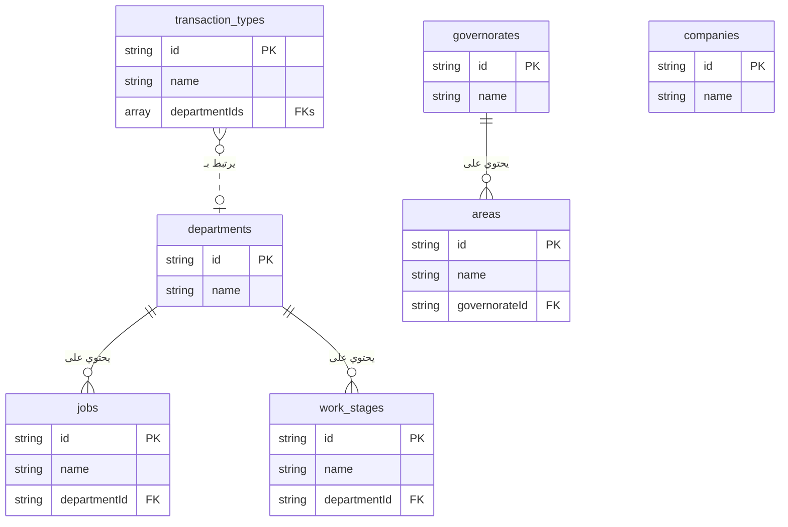

# Project Code Dump

This file contains the complete code for all files in the project, generated upon user request. This is a comprehensive snapshot of the application's source code, intended for easy review and copying.

---
## File: `.env`
```

```

---
## File: `README.md`
```md
# Firebase Studio
whoami
This is a NextJS starter in Firebase Studio.

To get started, take a look at src/app/page.tsx.

```

---
## File: `apphosting.yaml`
```yaml
# Settings to manage and configure a Firebase App Hosting backend.
# https://firebase.google.com/docs/app-hosting/configure

runConfig:
  # Increase this value if you'd like to automatically spin up
  # more instances in response to increased traffic.
  maxInstances: 1

```

---
## File: `components.json`
```json
{
  "$schema": "https://ui.shadcn.com/schema.json",
  "style": "default",
  "rsc": true,
  "tsx": true,
  "tailwind": {
    "config": "tailwind.config.ts",
    "css": "src/app/globals.css",
    "baseColor": "neutral",
    "cssVariables": true,
    "prefix": ""
  },
  "aliases": {
    "components": "@/components",
    "utils": "@/lib/utils",
    "ui": "@/components/ui",
    "lib": "@/lib",
    "hooks": "@/hooks"
  },
  "iconLibrary": "lucide"
}

```

---
## File: `docs/accounting-features.md`
```md
# وحدة المحاسبة المتكاملة: شرح شامل

هذا المستند يوضح جميع المميزات والعمليات في قسم المحاسبة.

### 1. شجرة الحسابات (Chart of Accounts)
- **المصدر:** `src/app/dashboard/accounting/chart-of-accounts/page.tsx`
- **الوصف:** هي أساس النظام المحاسبي. يمكنك إضافة، تعديل، وحذف الحسابات. النظام يأتي مع شجرة حسابات أساسية يمكنك تنزيلها كنقطة بداية.

### 2. قيود اليومية (Journal Entries)
- **المصدر:** `src/app/dashboard/accounting/journal-entries/`
- **الوصف:** يمكنك إنشاء قيود يدوية أو الاعتماد على القيود التلقائية التي ينشئها النظام (مثل عند إنشاء عقد). تتبع القيود دورة عمل (مسودة -> مرحّل).
- **المساعد المحاسبي الذكي:**
    - **المصدر:** `src/app/dashboard/accounting/assistant/page.tsx`
    - **الوصف:** مساعد ذكاء اصطناعي يفهم الأوامر المحاسبية باللغة العربية ويحولها إلى قيود يومية جاهزة للحفظ.

### 3. السندات (Vouchers)
- **سندات القبض:**
    - **شرح مفصل:** `docs/cash-receipts-features.md`
    - **المصدر:** `src/app/dashboard/accounting/cash-receipts/`
    - **الوصف:** إنشاء سندات قبض مع ترقيم تلقائي، ربط بالعقود، وتوليد ذكي لوصف الدفعة.
- **سندات الصرف:**
    - **المصدر:** `src/app/dashboard/accounting/payment-vouchers/`
    - **الوصف:** إنشاء سندات صرف لتسجيل المدفوعات للموردين والموظفين.

### 4. عروض الأسعار والعقود (Quotations & Contracts)
- **المصدر:** `src/app/dashboard/accounting/quotations/` و `src/components/clients/contract-clauses-form.tsx`
- **الوصف:** يمكنك إنشاء عروض أسعار للعملاء. عند قبول عرض السعر، يمكنك تحويله مباشرة إلى عقد مفصل داخل معاملة العميل، مما يضمن ربط البيانات المالية بالعمليات.

### 5. القوائم المالية (IFRS Compliant)
- **قائمة الدخل (Income Statement):**
    - **المصدر:** `src/app/dashboard/accounting/income-statement/page.tsx`
    - **الوصف:** تعرض الإيرادات والمصروفات وصافي الربح، مع فصل "تكلفة الإيرادات" لعرض "مجمل الربح" بشكل واضح.
- **قائمة المركز المالي (Balance Sheet):**
    - **المصدر:** `src/app/dashboard/accounting/balance-sheet/page.tsx`
    - **الوصف:** تعرض الأصول والالتزامات وحقوق الملكية، مع تصنيفها إلى "متداولة" و "غير متداولة" وفقًا للمعايير الدولية.
- **قائمة التدفقات النقدية (Cash Flow Statement):**
    - **المصدر:** `src/app/dashboard/accounting/cash-flow/page.tsx`
    - **الوصف:** تُعد بالطريقة غير المباشرة، حيث تبدأ بصافي الربح وتعدله للوصول إلى صافي التدفق النقدي.
- **قائمة التغير في حقوق الملكية (Statement of Changes in Equity):**
    - **المصدر:** `src/app/dashboard/accounting/equity-statement/page.tsx`
    - **الوصف:** توضح كيف تغيرت حقوق الملاك خلال الفترة، بربط رصيد البداية بصافي الربح للوصول إلى رصيد النهاية.
- **الإيضاحات المتممة (Financial Statement Notes):**
    - **المصدر:** `src/app/dashboard/accounting/financial-statement-notes/page.tsx`
    - **الوصف:** صفحة تحتوي على محرر نصوص لحفظ الشروحات والتفاصيل الإضافية المطلوبة للقوائم المالية.

### 6. التنبؤ المالي (Financial Forecast)
- **المصدر:** `src/app/dashboard/accounting/financial-forecast/page.tsx`
- **الوصف:** أداة تعتمد على بيانات العقود والمصاريف الثابتة لتقديم توقعات مستقبلية للإيرادات والمصروفات.
```

---
## File: `docs/appointments-features.md`
```md
# نظام المواعيد الذكي: شرح شامل للمميزات

بناءً على طلبك، إليك شرح مفصل ومبسط لجميع المميزات التي قمنا بتطويرها في نظام إدارة المواعيد، والذي تم تصميمه ليكون دقيقًا، ذكيًا، وسهل الاستخدام.

---

### 1. نظام تقويم مزدوج ومتخصص

تم فصل المواعيد إلى قسمين رئيسيين لتنظيم العمل ومنع التداخل:

*   **جدول القسم المعماري:** مخصص حصريًا لزيارات العملاء مع مهندسي القسم المعماري. يتم عرضه كشبكة زمنية تُظهر حجوزات كل مهندس على حدة.
*   **جدول حجوزات القاعات:** مخصص لحجز قاعات الاجتماعات لمواعيد الأقسام الهندسية الأخرى (كهرباء، إنشائي، إلخ). يتم عرضه كشبكة زمنية تُظهر حجوزات كل قاعة على حدة.

### 2. منطق حجز ذكي لمنع التعارض (Real-time Conflict Detection)

أهم ميزة في النظام هي قدرته على منع الأخطاء البشرية عند حجز المواعيد. قبل حفظ أي موعد جديد أو تعديل، يقوم النظام بالتحقق الفوري من وجود أي تعارض في:

*   **وقت المهندس:** لا يمكن حجز موعدين لنفس المهندس في نفس الفترة الزمنية، حتى لو كان أحدهما في جدول القسم المعماري والآخر في جدول حجوزات القاعات.
*   **وقت العميل:** لا يمكن حجز موعدين لنفس العميل في نفس الفترة.
*   **وقت القاعة:** لا يمكن حجز نفس قاعة الاجتماعات في نفس الوقت.

في حال وجود أي تعارض، يرفض النظام الحفظ ويعرض رسالة تنبيه واضحة.

### 3. نظام تلوين ديناميكي لزيارات القسم المعماري

لتسهيل متابعة حالة العميل بلمحة بصر، تم تصميم نظام ألوان ذكي لمواعيد القسم المعماري:

*   **اللون الأصفر:** يُخصص دائمًا **للموعد الأقدم زمنيًا** للعميل، مما يدل على أنها الزيارة الأولى.
*   **اللون الأخضر:** يُخصص لأي زيارة تالية (الثانية، الثالثة، إلخ) **طالما أن العميل لم يوقع العقد بعد**.
*   **اللون الأزرق:** بمجرد توقيع العقد، تتحول جميع الزيارات التالية للزيارة الأولى إلى اللون الأزرق تلقائيًا.

### 4. عداد الزيارات التلقائي

بجانب اسم العميل في كل موعد معماري، يعرض النظام تلقائيًا رقم الزيارة (مثال: "الزيارة رقم 3"). هذا الرقم ليس ثابتًا، بل هو ديناميكي وذكي.

### 5. نظام تصحيح ذاتي للبيانات

هذه هي الميزة الأكثر قوة. عند **إلغاء أي موعد**، يقوم النظام تلقائيًا بالآتي:

1.  **تغيير الحالة:** يقوم النظام بتغيير حالة الموعد إلى "ملغي" بدلاً من حذفه نهائياً، مما يحافظ على السجل التاريخي.
2.  **إعادة الترقيم:** يعيد ترقيم جميع الزيارات **غير الملغاة** المتبقية للعميل بشكل صحيح. فإذا قمت بإلغاء الزيارة رقم 2، ستصبح الزيارة رقم 3 هي الزيارة رقم 2 الجديدة.
3.  **إعادة التلوين:** بناءً على الترقيم الجديد، يعيد النظام تلوين جميع المواعيد لتعكس الحالة الصحيحة (الموعد الأقدم يصبح أصفر، والبقية أخضر أو أزرق).

هذا يضمن أن البيانات المعروضة دقيقة وموثوقة بنسبة 100% في جميع الأوقات.

### 6. تخصيص كامل لأوقات الدوام

*   **مرونة كاملة:** من صفحة الإعدادات، يمكنك تحديد أوقات الدوام المختلفة لكل من القسم المعماري والقاعات العامة.
*   **إدارة العطلات:** يمكنك تحديد أيام العطلة الأسبوعية، وحتى تحديد يوم نصف دوام مع وقت انصراف مبكر.
*   **فترة راحة:** يمكنك إضافة فترة راحة (Buffer) بالدقائق بين المواعيد لتجنب التداخل وضمان سلاسة العمل.

### 7. تصميم متجاوب لجميع الأجهزة

تم تصميم واجهة المواعيد لتعمل بسلاسة على جميع الأجهزة، بما في ذلك:

*   شاشات الكمبيوتر المكتبية الكبيرة.
*   الأجهزة اللوحية (آيباد، وغيرها).
*   الهواتف الذكية.

تتكيف الجداول والنوافذ تلقائيًا مع حجم الشاشة لضمان تجربة استخدام سهلة ومريحة في أي مكان.

### 8. طباعة الجداول اليومية

يمكنك بسهولة طباعة جدول المواعيد اليومي لأي من القسمين (المعماري أو حجوزات القاعات) بتنسيق PDF واضح ومناسب للمشاركة أو الأرشفة.
```

---
## File: `docs/backend.json`
```json
{
  "entities": {
    "CompanyBranding": {
      "title": "Company Branding",
      "description": "Stores the company's branding information for letterheads and general UI.",
      "type": "object",
      "properties": {
        "company_name": {
          "type": "string",
          "description": "The full name of the company."
        },
        "address": {
          "type": "string",
          "description": "The company's contact address."
        },
        "phone": {
          "type": "string",
          "description": "The company's contact phone number."
        },
        "email": {
          "type": "string",
          "format": "email",
          "description": "The company's contact email address."
        },
        "tax_number": {
            "type": "string",
            "description": "The company's tax identification number."
        },
        "letterhead_text": {
          "type": "string",
          "description": "Additional text to display on the letterhead."
        },
        "logo_url": {
            "type": "string",
            "format": "uri",
            "description": "URL to the company's logo."
        },
        "letterhead_image_url": {
            "type": "string",
            "format": "uri",
            "description": "URL to the company's full letterhead image."
        },
        "system_background_url": {
            "type": "string",
            "format": "uri",
            "description": "URL for the background image of the system pages."
        },
        "financial_statement_notes": {
            "type": "string",
            "description": "The full text content for the notes to the financial statements."
        },
        "work_hours": {
            "type": "object",
            "description": "Defines the company's working hours, holidays, and appointment settings.",
            "properties": {
                "general": {
                    "type": "object",
                    "description": "General working hours for meeting rooms and other departments.",
                    "properties": {
                        "morning_start_time": { "type": "string", "description": "e.g., '08:00'" },
                        "morning_end_time": { "type": "string", "description": "e.g., '12:00'" },
                        "evening_start_time": { "type": "string", "description": "e.g., '13:00'" },
                        "evening_end_time": { "type": "string", "description": "e.g., '17:00'" },
                        "appointment_slot_duration": { "type": "number", "description": "Duration in minutes, e.g., 30" },
                        "appointment_buffer_time": { "type": "number", "description": "Break time in minutes between appointments." }
                    }
                },
                "architectural": {
                    "type": "object",
                    "description": "Specific working hours for the architectural department.",
                    "properties": {
                        "morning_start_time": { "type": "string" },
                        "morning_end_time": { "type": "string" },
                        "evening_start_time": { "type": "string" },
                        "evening_end_time": { "type": "string" },
                        "appointment_slot_duration": { "type": "number" },
                        "appointment_buffer_time": { "type": "number", "description": "Break time in minutes between appointments." }
                    }
                },
                "holidays": {
                    "type": "array",
                    "description": "Weekly holidays.",
                    "items": { "type": "string", "enum": ["Sunday", "Monday", "Tuesday", "Wednesday", "Thursday", "Friday", "Saturday"] }
                },
                "half_day": {
                    "type": "object",
                    "description": "Defines a weekly half-day.",
                    "properties": {
                        "day": { "type": "string", "enum": ["", "Sunday", "Monday", "Tuesday", "Wednesday", "Thursday", "Friday", "Saturday"] },
                        "type": { "type": "string", "enum": ["morning_only", "custom_end_time"] },
                        "end_time": { "type": "string", "description": "e.g., '13:00'" }
                    }
                }
            }
        }
      },
      "required": ["company_name"]
    },
    "UserProfile": {
      "title": "User Profile",
      "description": "Represents a user's login account in the system.",
      "type": "object",
      "properties": {
        "uid": {
          "type": "string",
          "description": "The unique user ID from Firebase Authentication."
        },
        "username": {
          "type": "string",
          "description": "The user's unique username for login."
        },
        "email": {
          "type": "string",
          "format": "email",
          "description": "Auto-generated internal email address (e.g., username@scoop.local)."
        },
        "passwordHash": {
          "type": "string",
          "description": "The securely hashed password for the user. Hashing should be done server-side."
        },
        "employeeId": {
          "type": "string",
          "description": "A reference to the corresponding document ID in the 'employees' collection."
        },
        "role": {
          "type": "string",
          "description": "The user's role in the system.",
          "enum": ["Admin", "Secretary", "Accountant", "Engineer", "HR"]
        },
        "isActive": {
          "type": "boolean",
          "description": "Whether the user's account is active and can log in."
        },
        "createdAt": {
          "type": "string",
          "format": "date-time",
          "description": "The timestamp when the user account was created."
        },
        "activatedAt": {
          "type": "string",
          "format": "date-time",
          "description": "The timestamp when the user account was last activated."
        },
        "createdBy": {
            "type": "string",
            "description": "The user ID of the admin who created this account."
        }
      },
      "required": [
        "username",
        "email",
        "passwordHash",
        "employeeId",
        "role",
        "isActive",
        "createdAt",
        "createdBy"
      ]
    },
    "Client": {
      "title": "Client",
      "description": "Represents a client of the consultancy.",
      "type": "object",
      "properties": {
        "fileId": {
          "type": "string",
          "description": "The client's file ID, in the format 'sequence/year' (e.g., '1/2024')."
        },
        "fileNumber": {
          "type": "number",
          "description": "The sequential part of the client's file ID for a given year."
        },
        "fileYear": {
          "type": "number",
          "description": "The year of the client's file ID."
        },
        "nameAr": {
            "type": "string",
            "description": "The full name of the client in Arabic."
        },
        "nameEn": {
            "type": "string",
            "description": "The full name of the client in English."
        },
        "mobile": {
          "type": "string",
          "description": "The client's mobile phone number."
        },
        "civilId": {
            "type": "string",
            "description": "The client's Civil ID number."
        },
        "plotNumber": {
            "type": "string",
            "description": "The client's plot number for contracts."
        },
        "address": {
            "type": "object",
            "description": "The client's address.",
            "properties": {
                "governorate": { "type": "string" },
                "area": { "type": "string" },
                "block": { "type": "string" },
                "street": { "type": "string" },
                "houseNumber": { "type": "string" }
            }
        },
        "status": {
          "type": "string",
          "description": "The current status of the client's file.",
          "enum": [
            "new",
            "contracted",
            "cancelled",
            "reContracted"
          ]
        },
        "transactionCounter": {
            "type": "number",
            "description": "A counter for the number of transactions created for this client, used to generate sequential transaction numbers."
        },
        "assignedEngineer": {
          "type": "string",
          "description": "The ID of the engineer assigned to this client."
        },
        "createdAt": {
          "type": "string",
          "format": "date-time",
          "description": "The timestamp when the client was created."
        },
        "isActive": {
          "type": "boolean",
          "description": "Whether the client is active."
        }
      },
      "required": [
        "fileId",
        "fileNumber",
        "fileYear",
        "nameAr",
        "mobile",
        "status",
        "createdAt",
        "isActive"
      ]
    },
    "ClientTransaction": {
        "title": "Client Transaction",
        "description": "Represents an internal service or transaction for a client, like a design submission.",
        "type": "object",
        "properties": {
            "transactionNumber": {
              "type": "string",
              "description": "A unique, human-readable, sequential transaction number for the client (e.g., CL123-TX01)."
            },
            "clientId": { "type": "string", "description": "The ID of the client this transaction belongs to." },
            "transactionType": { "type": "string", "description": "The type of transaction, e.g., 'Municipality Design', 'Electricity Design'." },
            "description": { "type": "string", "description": "A brief description of the transaction." },
            "departmentId": { "type": "string", "description": "The ID of the primary department for this transaction." },
            "transactionTypeId": { "type": "string", "description": "The ID of the transaction type." },
            "status": {
                "type": "string",
                "description": "The current status of the transaction.",
                "enum": ["new", "in-progress", "completed", "submitted", "on-hold"]
            },
            "assignedEngineerId": { "type": "string", "description": "The ID of the primary engineer assigned to this transaction." },
            "createdAt": { "type": "string", "format": "date-time" },
            "updatedAt": { "type": "string", "format": "date-time" },
            "stages": {
                "type": "array",
                "description": "The lifecycle stages of the transaction.",
                "items": { "$ref": "#/entities/TransactionStage" }
            },
            "contract": {
                "type": "object",
                "description": "Stores the customized contract clauses and total amount for this specific transaction.",
                "properties": {
                    "clauses": {
                        "type": "array",
                        "items": {
                            "type": "object",
                            "properties": {
                                "id": { "type": "string" },
                                "name": { "type": "string" },
                                "amount": { "type": "number" },
                                "status": { "type": "string", "enum": ["مدفوعة", "مستحقة", "غير مستحقة"] },
                                "percentage": { "type": "number", "description": "The original percentage value if the financial type was 'percentage'."}
                            },
                            "required": ["id", "name", "amount", "status"]
                        }
                    },
                    "termsAndConditions": {
                      "type": "array",
                      "items": {
                        "type": "object",
                        "properties": { "id": { "type": "string" }, "text": { "type": "string" } },
                        "required": ["id", "text"]
                      }
                    },
                    "openClauses": {
                      "type": "array",
                      "items": {
                        "type": "object",
                        "properties": { "id": { "type": "string" }, "text": { "type": "string" } },
                        "required": ["id", "text"]
                      }
                    },
                    "totalAmount": { "type": "number" },
                    "financialsType": { "type": "string", "enum": ["fixed", "percentage"] }
                },
                "required": ["clauses", "totalAmount"]
            }
        },
        "required": ["transactionNumber", "clientId", "transactionType", "status", "createdAt"]
    },
    "TransactionAssignment": {
        "title": "Transaction Assignment",
        "description": "Represents an assignment or forwarding of a transaction to a specific department and engineer.",
        "type": "object",
        "properties": {
            "transactionId": {
                "type": "string",
                "description": "The ID of the parent ClientTransaction."
            },
            "clientId": {
                "type": "string",
                "description": "The ID of the client."
            },
            "departmentId": { "type": "string" },
            "departmentName": { "type": "string" },
            "engineerId": { "type": "string" },
            "notes": { "type": "string" },
            "status": {
                "type": "string",
                "enum": ["pending", "in-progress", "completed"]
            },
            "createdAt": {
                "type": "string",
                "format": "date-time"
            },
            "createdBy": {
                "type": "string",
                "description": "The ID of the user who created the assignment."
            }
        },
        "required": [
            "transactionId",
            "clientId",
            "departmentId",
            "departmentName",
            "status",
            "createdAt",
            "createdBy"
        ]
    },
    "TransactionTimelineEvent": {
      "title": "Transaction Timeline Event",
      "description": "Represents a single event (comment or log) in a transaction's history.",
      "type": "object",
      "properties": {
        "type": {
          "type": "string",
          "enum": [ "comment", "log" ],
          "description": "The type of event."
        },
        "content": {
          "type": "string",
          "description": "The content of the comment or the description of the log."
        },
        "userId": {
          "type": "string",
          "description": "The ID of the user who created the event."
        },
        "userName": {
          "type": "string",
          "description": "The name of the user who created the event."
        },
        "userAvatar": {
          "type": "string",
          "format": "uri",
          "description": "URL to the user's avatar image."
        },
        "createdAt": {
          "type": "string",
          "format": "date-time"
        }
      },
      "required": [ "type", "content", "userId", "userName", "createdAt" ]
    },
    "TransactionStage": {
      "title": "Transaction Stage",
      "description": "Tracks the progress of a single stage within a client transaction's lifecycle. It is linked to a reference WorkStage via stageId.",
      "type": "object",
      "properties": {
        "stageId": { "type": "string", "description": "The ID of the reference WorkStage document from the department's workStages subcollection." },
        "name": { "type": "string", "description": "Name of the stage, stored for convenience. The name in the reference data is the source of truth." },
        "order": { "type": "number", "description": "The display and logical order of the stage, copied from the template." },
        "status": {
          "type": "string",
          "enum": ["pending", "in-progress", "completed", "skipped", "awaiting-review"],
          "description": "The current status of the stage."
        },
        "allowedRoles": {
            "type": "array",
            "description": "The job titles responsible for this stage, copied from the WorkStage template.",
            "items": { "type": "string" }
        },
        "stageType": {
          "type": "string",
          "enum": ["sequential", "parallel"],
          "description": "'sequential' for main workflow steps, 'parallel' for service stages like modifications that can run alongside."
        },
        "nextStageIds": {
            "type": "array",
            "description": "A list of possible next stage IDs to transition to from this stage.",
            "items": { "type": "string" }
        },
        "allowedDuringStages": {
            "type": "array",
            "description": "For parallel stages only. A list of sequential stage IDs during which this parallel stage can be initiated.",
            "items": { "type": "string" }
        },
        "trackingType": {
          "type": "string",
          "enum": ["duration", "occurrence", "none"],
          "description": "The tracking type of the stage, copied from the template."
        },
        "expectedDurationDays": {
            "type": ["number", "null"],
            "description": "The expected duration in days for this stage (if trackingType is 'duration')."
        },
        "maxOccurrences": {
            "type": ["number", "null"],
            "description": "The maximum number of times this stage can occur (if trackingType is 'occurrence')."
        },
        "allowManualCompletion": {
            "type": "boolean",
            "description": "If true, allows manually completing an 'occurrence' stage before reaching its max count."
        },
        "enableModificationTracking": {
            "type": "boolean",
            "description": "If true, allows a modification counter to be incremented for this stage."
        },
        "modificationCount": {
            "type": ["number", "null"],
            "description": "How many times a modification has been recorded for this stage."
        },
        "startDate": { "type": ["string", "null"], "format": "date-time", "description": "When the stage started." },
        "endDate": { "type": ["string", "null"], "format": "date-time", "description": "When the stage was completed." },
        "expectedEndDate": { "type": ["string", "null"], "format": "date-time", "description": "The expected completion date for countdowns." },
        "notes": { "type": ["string", "null"], "description": "Notes specific to this stage." },
        "completedCount": { "type": ["number", "null"], "description": "How many times this stage has been completed (if trackingType is 'occurrence')."}
      },
      "required": ["stageId", "name", "status"]
    },
    "Counter": {
      "title": "Counter",
      "description": "Stores sequential counters for various entities.",
      "type": "object",
      "properties": {
        "counts": {
          "type": "object",
          "description": "A map of keys (e.g., years) to their current count."
        }
      }
    },
    "Employee": {
      "title": "Employee",
      "description": "Represents an employee in the company.",
      "properties": {
        "employeeNumber": { "type": "string", "description": "The unique identifying number for the employee." },
        "fullName": { "type": "string", "description": "Employee's name in Arabic." },
        "nameEn": { "type": "string", "description": "Employee's name in English." },
        "dob": { "type": "string", "format": "date", "description": "Date of birth." },
        "gender": { "type": "string", "enum": ["male", "female"] },
        "civilId": { "type": "string" },
        "nationality": { "type": "string", "description": "The employee's nationality." },
        "residencyExpiry": { "type": "string", "format": "date" },
        "contractExpiry": { "type": "string", "format": "date" },
        "mobile": { "type": "string" },
        "emergencyContact": { "type": "string" },
        "email": { "type": "string", "format": "email" },
        "jobTitle": { "type": "string" },
        "position": { "type": "string", "enum": ["head", "employee", "assistant", "contractor"] },
        "workStartTime": { "type": "string", "description": "The official start time for the employee's shift (e.g., '08:00')." },
        "workEndTime": { "type": "string", "description": "The official end time for the employee's shift (e.g., '17:00')." },
        "salaryPaymentType": { "type": "string", "enum": ["cash", "cheque", "transfer"] },
        "bankName": { "type": "string" },
        "accountNumber": { "type": "string" },
        "iban": { "type": "string" },
        "profilePicture": { "type": "string", "format": "uri" },
        "hireDate": { "type": "string", "format": "date-time" },
        "noticeStartDate": { "type": ["string", "null"], "format": "date-time", "description": "Date when resignation/termination notice was given." },
        "terminationDate": { "type": ["string", "null"], "format": "date-time" },
        "terminationReason": { "type": "string", "enum": ["resignation", "termination", null] },
        "contractType": { "type": "string", "enum": ["permanent", "temporary", "subcontractor", "percentage", "part-time"] },
        "contractPercentage": { "type": "number", "description": "The percentage of contract value for commission-based employees." },
        "department": { "type": "string" },
        "basicSalary": { "type": "number" },
        "housingAllowance": { "type": "number" },
        "transportAllowance": { "type": "number" },
        "status": { "type": "string", "enum": ["active", "on-leave", "terminated"] },
        "lastVacationAccrualDate": { "type": "string", "format": "date-time" },
        "annualLeaveAccrued": { "type": "number" },
        "annualLeaveUsed": { "type": "number" },
        "carriedLeaveDays": { "type": "number" },
        "sickLeaveUsed": { "type": "number" },
        "emergencyLeaveUsed": { "type": "number" },
        "maxEmergencyLeave": { "type": "number" },
        "lastLeaveResetDate": { "type": "string", "format": "date-time" },
        "annualLeaveBalance": { "type": "number", "description": "Calculated current annual leave balance." },
        "createdAt": { "type": "string", "format": "date-time" }
      },
      "required": [
        "employeeNumber",
        "fullName",
        "nameEn",
        "civilId",
        "mobile",
        "department",
        "jobTitle",
        "hireDate",
        "contractType",
        "basicSalary",
        "status"
      ]
    },
    "LeaveRequest": {
        "title": "Leave Request",
        "description": "Represents a leave request submitted by an employee.",
        "type": "object",
        "properties": {
            "employeeId": { "type": "string", "description": "ID of the employee requesting leave." },
            "employeeName": { "type": "string", "description": "Full name of the employee." },
            "leaveType": { "type": "string", "enum": ["Annual", "Sick", "Emergency", "Unpaid"] },
            "startDate": { "type": "string", "format": "date-time" },
            "endDate": { "type": "string", "format": "date-time" },
            "days": { "type": "number", "description": "Total number of leave days." },
            "workingDays": { "type": "number", "description": "Total number of calculated working days." },
            "notes": { "type": "string", "description": "Reason or notes for the leave." },
            "attachmentUrl": { "type": "string", "format": "uri", "description": "URL to a medical report or other document." },
            "status": { "type": "string", "enum": ["pending", "approved", "rejected"], "description": "The current status of the leave request." },
            "createdAt": { "type": "string", "format": "date-time" },
            "approvedBy": { "type": "string", "description": "UID of the user who approved/rejected the request." },
            "approvedAt": { "type": "string", "format": "date-time" },
            "rejectionReason": { "type": "string", "description": "Reason for rejecting the leave request." },
            "isBackFromLeave": { "type": "boolean", "description": "Indicates if the employee has returned from this specific leave." },
            "actualReturnDate": { "type": "string", "format": "date-time", "description": "The actual date the employee returned to work." }
        },
        "required": ["employeeId", "employeeName", "leaveType", "startDate", "endDate", "days", "status", "createdAt"]
    },
    "Holiday": {
        "title": "Holiday",
        "description": "Represents an official public holiday.",
        "type": "object",
        "properties": {
            "name": { "type": "string", "description": "The name of the holiday." },
            "date": { "type": "string", "format": "date", "description": "The date of the holiday." }
        },
        "required": ["name", "date"]
    },
    "AuditLog": {
        "title": "Audit Log",
        "description": "Records changes made to employee data for historical tracking.",
        "type": "object",
        "properties": {
            "changeType": { "type": "string", "enum": ["Creation", "SalaryChange", "JobChange", "DataUpdate", "StatusChange", "ResidencyUpdate"] },
            "field": { "type": "string", "description": "The name of the field that was changed." },
            "oldValue": { "description": "The value of the field before the change." },
            "newValue": { "description": "The value of the field after the change." },
            "effectiveDate": { "type": "string", "format": "date-time", "description": "The date when this change becomes effective." },
            "changedBy": { "type": "string", "description": "The ID of the user who made the change." },
            "notes": { "type": "string", "description": "Additional notes about the change." }
        },
        "required": ["changeType", "field", "newValue", "effectiveDate", "changedBy"]
    },
    "MonthlyAttendance": {
      "title": "Monthly Attendance",
      "description": "An employee's attendance records and summary for a specific month.",
      "type": "object",
      "properties": {
        "employeeId": { "type": "string" },
        "year": { "type": "number" },
        "month": { "type": "number" },
        "records": {
          "type": "array",
          "items": {
            "type": "object",
            "properties": {
              "date": { "type": "string", "format": "date" },
              "checkIn": { "type": "string" },
              "checkOut": { "type": "string" },
              "status": { "type": "string", "enum": ["present", "absent", "late", "leave"] }
            },
            "required": ["date", "status"]
          }
        },
        "summary": {
          "type": "object",
          "properties": {
            "totalDays": { "type": "number" },
            "presentDays": { "type": "number" },
            "absentDays": { "type": "number" },
            "lateDays": { "type": "number" },
            "leaveDays": { "type": "number" }
          },
          "required": ["presentDays", "absentDays", "lateDays", "leaveDays"]
        }
      },
      "required": ["employeeId", "year", "month", "records", "summary"]
    },
    "Payslip": {
      "title": "Payslip",
      "description": "An employee's payslip for a specific month.",
      "type": "object",
      "properties": {
        "employeeId": { "type": "string" },
        "employeeName": { "type": "string" },
        "year": { "type": "number" },
        "month": { "type": "number" },
        "attendanceId": { "type": "string", "description": "Reference to the attendance document ID." },
        "salaryPaymentType": { "type": "string", "enum": ["cash", "cheque", "transfer"] },
        "earnings": {
          "type": "object",
          "properties": {
            "basicSalary": { "type": "number" },
            "housingAllowance": { "type": "number" },
            "transportAllowance": { "type": "number" },
            "commission": { "type": "number", "description": "Commission earned in the period." }
          },
           "required": ["basicSalary"]
        },
        "deductions": {
          "type": "object",
          "properties": {
            "absenceDeduction": { "type": "number" },
            "otherDeductions": { "type": "number" }
          }
        },
        "netSalary": { "type": "number" },
        "status": { "type": "string", "enum": ["draft", "processed", "paid"] },
        "createdAt": { "type": "string", "format": "date-time" }
      },
      "required": ["employeeId", "year", "month", "earnings", "netSalary", "status", "createdAt"]
    },
    "Notification": {
      "title": "Notification",
      "description": "Represents a notification for a user about an event in the system.",
      "type": "object",
      "properties": {
        "userId": { "type": "string", "description": "The ID of the user to whom the notification is sent." },
        "title": { "type": "string", "description": "A short, bolded title for the notification." },
        "body": { "type": "string", "description": "The main content of the notification message." },
        "link": { "type": "string", "description": "The URL the user will be redirected to upon clicking the notification." },
        "isRead": { "type": "boolean", "description": "Whether the user has read the notification." },
        "createdAt": { "type": "string", "format": "date-time" }
      },
      "required": ["userId", "title", "body", "link", "isRead", "createdAt"]
    },
    "Department": {
      "title": "Department",
      "description": "Represents a department in the company.",
      "type": "object",
      "properties": {
        "name": {
          "type": "string",
          "description": "The name of the department."
        },
        "order": {
            "type": "number",
            "description": "The display order."
        }
      },
      "required": ["name"]
    },
    "Job": {
      "title": "Job",
      "description": "Represents a job title within a department.",
      "type": "object",
      "properties": {
        "name": {
          "type": "string",
          "description": "The name of the job."
        },
        "order": {
            "type": "number",
            "description": "The display order."
        }
      },
      "required": ["name"]
    },
    "Governorate": {
      "title": "Governorate",
      "description": "Represents a governorate in the country.",
      "type": "object",
      "properties": {
        "name": {
          "type": "string",
          "description": "The name of the governorate."
        },
        "order": {
            "type": "number",
            "description": "The display order."
        }
      },
      "required": ["name"]
    },
    "Area": {
      "title": "Area",
      "description": "Represents an area within a governorate.",
      "type": "object",
      "properties": {
        "name": {
          "type": "string",
          "description": "The name of the area."
        },
        "order": {
            "type": "number",
            "description": "The display order."
        }
      },
      "required": ["name"]
    },
    "TransactionType": {
      "title": "Transaction Type",
      "description": "Represents a type of internal client transaction and links it to the departments involved.",
      "type": "object",
      "properties": {
        "name": {
          "type": "string",
          "description": "The name of the transaction type (e.g., 'Municipality Design')."
        },
        "departmentIds": {
            "type": "array",
            "description": "A list of department IDs involved in this transaction type.",
            "items": { "type": "string" }
        },
        "order": {
          "type": "number",
          "description": "The display and logical order of the type."
        }
      },
      "required": ["name", "departmentIds"]
    },
    "WorkStage": {
      "title": "Work Stage",
      "description": "Represents a standard work stage that can be associated with a department. Defines a step in a workflow.",
      "type": "object",
      "properties": {
        "name": { "type": "string", "description": "The name of the work stage." },
        "order": { "type": "number", "description": "The display and logical order of the stage." },
        "stageType": {
          "type": "string",
          "enum": ["sequential", "parallel"],
          "description": "'sequential' for main workflow steps, 'parallel' for service stages like modifications that can run alongside."
        },
        "allowedRoles": { "type": "array", "description": "A list of job titles responsible for this stage.", "items": { "type": "string" } },
        "nextStageIds": { "type": "array", "description": "A list of possible next stage IDs to transition to from this stage.", "items": { "type": "string" } },
        "allowedDuringStages": { "type": "array", "description": "For parallel stages only. A list of sequential stage IDs during which this parallel stage can be initiated.", "items": { "type": "string" } },
        "trackingType": { "type": "string", "enum": ["duration", "occurrence", "none"], "description": "How to track progress: by time, occurrences, or as a single event." },
        "enableModificationTracking": { "type": "boolean", "description": "If true, allows a modification counter to be incremented for this stage." },
        "expectedDurationDays": { "type": ["number", "null"], "description": "The expected duration in days for this stage (if trackingType is 'duration')." },
        "maxOccurrences": { "type": ["number", "null"], "description": "The maximum number of times this stage can occur (if trackingType is 'occurrence')." },
        "allowManualCompletion": { "type": "boolean", "description": "If true, allows manually completing an 'occurrence' stage before reaching its max count." }
      },
      "required": ["name", "order", "stageType", "trackingType"]
    },
    "Appointment": {
      "title": "Appointment",
      "description": "Represents a scheduled meeting or visit.",
      "type": "object",
      "properties": {
        "clientId": {
          "type": "string",
          "description": "The ID of the client for this appointment. Can be null for a new prospect."
        },
        "clientName": {
            "type": "string",
            "description": "The name of the client, especially if not yet a registered client."
        },
        "clientMobile": {
            "type": "string",
            "description": "The mobile number of the client, especially if not yet a registered client."
        },
        "engineerId": {
          "type": "string",
          "description": "The ID of the employee attending the appointment."
        },
        "meetingRoom": {
          "type": "string",
          "description": "The name of the meeting room, if applicable (for non-architectural appointments)."
        },
        "department": {
          "type": "string",
          "description": "The department associated with the appointment, used for color-coding.",
          "enum": ["الكهرباء", "الصحي", "الإنشائي", "المعماري", "أخرى"]
        },
        "title": {
          "type": "string",
          "description": "The purpose or title of the appointment."
        },
        "notes": {
          "type": "string",
          "description": "Additional notes about the appointment."
        },
        "type": {
          "type": "string",
          "description": "Distinguishes between architectural appointments and room bookings.",
          "enum": ["architectural", "room"]
        },
        "status": {
            "type": "string",
            "description": "The current status of the appointment, especially for cancellation tracking.",
            "enum": ["scheduled", "cancelled"]
        },
        "appointmentDate": {
          "type": "string",
          "format": "date-time",
          "description": "The start date and time of the appointment."
        },
        "endDate": {
          "type": "string",
          "format": "date-time",
          "description": "The end date and time of the appointment."
        },
        "createdAt": {
          "type": "string",
          "format": "date-time"
        },
        "transactionId": {
          "type": "string",
          "description": "The ID of the client transaction this appointment is related to."
        },
        "workStageUpdated": {
            "type": "boolean",
            "description": "Indicates if the work stage has been updated for this visit."
        },
        "workStageProgressId": {
            "type": "string",
            "description": "Reference to the document in work_stages_progress."
        },
        "visitCount": {
            "type": "number",
            "description": "The sequential visit number for this client's architectural appointments."
        },
        "color": {
            "type": "string",
            "description": "Hex color code for calendar display based on visit status."
        }
      },
      "required": ["engineerId", "title", "appointmentDate", "createdAt", "type"]
    },
    "WorkStageProgress": {
        "title": "Work Stage Progress",
        "description": "Logs the selection of a work stage for a specific architectural visit.",
        "type": "object",
        "properties": {
            "transactionId": { "type": "string", "description": "The ID of the client transaction this visit is related to." },
            "visitId": { "type": "string", "description": "The ID of the architectural visit document." },
            "stageId": { "type": "string", "description": "The ID of the selected work stage." },
            "stageName": { "type": "string", "description": "The name of the selected work stage." },
            "selectedBy": { "type": "string", "description": "The ID of the employee who updated the stage." },
            "selectedAt": { "type": "string", "format": "date-time" }
        },
        "required": ["visitId", "stageId", "stageName", "selectedBy", "selectedAt"]
    },
    "Contract": {
      "title": "Contract",
      "description": "Represents a fully dynamic, user-generated contract.",
      "type": "object",
      "properties": {
        "clientId": { "type": "string" },
        "clientName": { "type": "string" },
        "companySnapshot": { "type": "object", "description": "A snapshot of company data at time of creation." },
        "title": { "type": "string" },
        "contractDate": { "type": "string", "format": "date-time" },
        "scopeOfWork": {
          "type": "array",
          "items": {
            "type": "object",
            "properties": { "id": { "type": "string" }, "title": { "type": "string" }, "description": { "type": "string" } },
            "required": ["id", "title"]
          }
        },
        "termsAndConditions": {
          "type": "array",
          "items": {
            "type": "object",
            "properties": { "id": { "type": "string" }, "text": { "type": "string" } },
            "required": ["id", "text"]
          }
        },
        "financials": {
          "type": "object",
          "properties": {
            "type": { "type": "string", "enum": ["fixed", "percentage"] },
            "totalAmount": { "type": "number" },
            "discount": { "type": "number" },
            "milestones": {
              "type": "array",
              "items": {
                "type": "object",
                "properties": {
                  "id": { "type": "string" },
                  "name": { "type": "string" },
                  "condition": { "type": "string" },
                  "value": { "type": "number" }
                },
                "required": ["id", "name", "value"]
              }
            }
          }
        },
        "openClauses": {
          "type": "array",
          "items": {
            "type": "object",
            "properties": { "id": { "type": "string" }, "text": { "type": "string" } },
            "required": ["id", "text"]
          }
        },
        "createdAt": { "type": "string", "format": "date-time" },
        "createdBy": { "type": "string" }
      },
      "required": ["clientId", "title", "contractDate", "createdAt"]
    },
    "ContractTemplate": {
      "title": "Contract Template",
      "description": "A reusable template for generating contracts.",
      "type": "object",
      "properties": {
        "title": { "type": "string" },
        "description": { "type": "string" },
        "transactionTypes": { "type": "array", "items": { "type": "string" } },
        "scopeOfWork": {
          "type": "array",
          "items": {
            "type": "object",
            "properties": { "id": { "type": "string" }, "title": { "type": "string" }, "description": { "type": "string" } },
            "required": ["id", "title"]
          }
        },
        "termsAndConditions": {
          "type": "array",
          "items": {
            "type": "object",
            "properties": { "id": { "type": "string" }, "text": { "type": "string" } },
            "required": ["id", "text"]
          }
        },
        "financials": {
          "type": "object",
          "properties": {
            "type": { "type": "string", "enum": ["fixed", "percentage"] },
            "totalAmount": { "type": "number" },
            "discount": { "type": "number" },
            "milestones": {
              "type": "array",
              "items": {
                "type": "object",
                "properties": {
                  "id": { "type": "string" },
                  "name": { "type": "string" },
                  "condition": { "type": "string" },
                  "value": { "type": "number" }
                },
                "required": ["id", "name", "value"]
              }
            }
          }
        },
        "openClauses": {
          "type": "array",
          "items": {
            "type": "object",
            "properties": { "id": { "type": "string" }, "text": { "type": "string" } },
            "required": ["id", "text"]
          }
        }
      },
      "required": ["title"]
    },
    "Account": {
        "title": "Account",
        "description": "An account in the Chart of Accounts.",
        "type": "object",
        "properties": {
            "code": { "type": "string" },
            "name": { "type": "string" },
            "type": { "type": "string", "enum": ["asset", "liability", "equity", "income", "expense"] },
            "statement": { "type": "string", "enum": ["Balance Sheet", "Income Statement"] },
            "balanceType": { "type": "string", "enum": ["Debit", "Credit"] },
            "level": { "type": "number", "description": "The hierarchy level of the account." },
            "description": { "type": "string" },
            "isPayable": { "type": "boolean" },
            "parentCode": { "type": ["string", "null"] }
        },
        "required": ["name", "code", "type", "level", "isPayable", "statement", "balanceType"]
    },
    "JournalEntryLine": {
      "title": "Journal Entry Line",
      "description": "A single line in a journal entry, representing a debit or credit to an account.",
      "type": "object",
      "properties": {
        "accountId": {
          "type": "string",
          "description": "The ID of the account from the chart of accounts."
        },
        "accountName": {
          "type": "string",
          "description": "The name of the account."
        },
        "debit": {
          "type": "number",
          "description": "The debit amount."
        },
        "credit": {
          "type": "number",
          "description": "The credit amount."
        },
        "notes": {
          "type": "string",
          "description": "Optional notes for this line."
        },
        "clientId": {
            "type": "string",
            "description": "The ID of the client related to this line."
        },
        "transactionId": {
            "type": "string",
            "description": "The ID of the client transaction related to this line."
        },
        "auto_profit_center": {
          "type": "string",
          "description": "Auto-tagged client/project ID for profit analysis."
        },
        "auto_resource_id": {
            "type": "string",
            "description": "Auto-tagged employee ID for resource analysis."
        },
        "auto_dept_id": {
            "type": "string",
            "description": "Auto-tagged department ID for departmental analysis."
        }
      },
      "required": ["accountId", "accountName", "debit", "credit"]
    },
    "JournalEntry": {
      "title": "Journal Entry",
      "description": "Represents a general journal entry with multiple debit/credit lines.",
      "type": "object",
      "properties": {
        "entryNumber": {
          "type": "string",
          "description": "A sequential number for the journal entry (e.g., JV-2024-0001)."
        },
        "date": {
          "type": "string",
          "format": "date-time",
          "description": "The date of the journal entry."
        },
        "narration": {
          "type": "string",
          "description": "A general description or narration for the entry."
        },
        "reference": {
          "type": "string",
          "description": "An optional external reference number."
        },
        "linkedReceiptId": {
          "type": "string",
          "description": "The ID of the cash receipt that triggered this entry, if any."
        },
        "totalDebit": {
          "type": "number",
          "description": "The total of all debit lines, for validation."
        },
        "totalCredit": {
          "type": "number",
          "description": "The total of all credit lines, for validation."
        },
        "status": {
            "type": "string",
            "enum": ["draft", "posted"],
            "description": "The status of the journal entry."
        },
        "lines": {
          "type": "array",
          "items": {
            "$ref": "#/entities/JournalEntryLine"
          }
        },
        "clientId": {
            "type": "string",
            "description": "The ID of the client related to this entry."
        },
        "transactionId": {
            "type": "string",
            "description": "The ID of the client transaction related to this entry."
        },
        "createdAt": {
          "type": "string",
          "format": "date-time"
        },
        "createdBy": {
          "type": "string",
          "description": "The ID of the user who created the entry."
        }
      },
      "required": ["entryNumber", "date", "narration", "totalDebit", "totalCredit", "status", "lines", "createdAt"]
    },
    "PaymentVoucher": {
      "title": "Payment Voucher",
      "description": "Represents a payment voucher for disbursing funds.",
      "type": "object",
      "properties": {
        "voucherNumber": { "type": "string" },
        "voucherSequence": { "type": "number" },
        "voucherYear": { "type": "number" },
        "payeeName": { "type": "string" },
        "payeeType": { "type": "string", "enum": ["vendor", "employee", "other"] },
        "employeeId": { "type": "string", "description": "Link to employee if payeeType is employee, for residency renewal etc." },
        "renewalExpiryDate": { "type": "string", "format": "date-time", "description": "New expiry date if this is for residency renewal." },
        "amount": { "type": "number" },
        "amountInWords": { "type": "string" },
        "paymentDate": { "type": "string", "format": "date-time" },
        "paymentMethod": { "type": "string", "enum": ["Cash", "Cheque", "Bank Transfer", "EmployeeCustody"] },
        "description": { "type": "string" },
        "reference": { "type": "string", "description": "e.g., Cheque number or transfer reference" },
        "debitAccountId": { "type": "string" },
        "debitAccountName": { "type": "string" },
        "creditAccountId": { "type": "string" },
        "creditAccountName": { "type": "string" },
        "status": { "type": "string", "enum": ["draft", "paid", "cancelled"] },
        "journalEntryId": { "type": "string" },
        "createdAt": { "type": "string", "format": "date-time" },
        "clientId": { "type": "string", "description": "Client ID if this payment is for a project"},
        "transactionId": { "type": "string", "description": "Transaction ID if this payment is for a project"}
      },
      "required": ["voucherNumber", "payeeName", "amount", "paymentDate", "paymentMethod", "debitAccountId", "creditAccountId", "status"]
    },
    "CashReceipt": {
      "title": "Cash Receipt",
      "description": "Represents a cash receipt voucher.",
      "type": "object",
      "properties": {
        "voucherNumber": { "type": "string" },
        "voucherSequence": { "type": "number" },
        "voucherYear": { "type": "number" },
        "clientId": { "type": "string" },
        "clientNameAr": { "type": "string" },
        "clientNameEn": { "type": "string" },
        "projectId": { "type": "string" },
        "projectNameAr": { "type": "string" },
        "amount": { "type": "number" },
        "amountInWords": { "type": "string" },
        "receiptDate": { "type": "string", "format": "date-time" },
        "paymentMethod": { "type": "string", "enum": ["Cash", "Cheque", "Bank Transfer", "K-Net"] },
        "description": { "type": "string" },
        "reference": { "type": "string" },
        "journalEntryId": {
            "type": "string",
            "description": "The ID of the journal entry automatically created for this receipt."
        },
        "createdAt": { "type": "string", "format": "date-time" }
      },
      "required": ["voucherNumber", "clientId", "amount", "receiptDate", "paymentMethod"]
    },
    "Quotation": {
      "title": "Quotation",
      "description": "Represents a price quotation provided to a client.",
      "type": "object",
      "properties": {
        "quotationNumber": { "type": "string" },
        "quotationSequence": { "type": "number" },
        "quotationYear": { "type": "number" },
        "clientId": { "type": "string" },
        "clientName": { "type": "string" },
        "date": { "type": "string", "format": "date-time" },
        "validUntil": { "type": "string", "format": "date-time" },
        "subject": { "type": "string" },
        "departmentId": { "type": "string", "description": "The ID of the department this quotation is for." },
        "transactionTypeId": { "type": "string", "description": "The ID of the transaction type this quotation is for." },
        "items": {
          "type": "array",
          "items": {
            "type": "object",
            "properties": {
              "id": { "type": "string" },
              "description": { "type": "string" },
              "quantity": { "type": "number" },
              "unitPrice": { "type": "number" },
              "total": { "type": "number" },
              "condition": { "type": "string", "description": "The condition for this item to be due, often linked to a work stage."}
            },
            "required": ["description", "quantity", "unitPrice", "total"]
          }
        },
        "totalAmount": { "type": "number" },
        "notes": { "type": "string" },
        "status": { "type": "string", "enum": ["draft", "sent", "accepted", "rejected", "expired"] },
        "createdAt": { "type": "string", "format": "date-time" },
        "createdBy": { "type": "string" },
        "transactionId": { "type": "string", "description": "The ID of the transaction this quotation was converted to."}
      },
      "required": ["quotationNumber", "clientId", "date", "subject", "items", "totalAmount", "status", "createdAt"]
    },
    "Vendor": {
      "title": "Vendor",
      "description": "Represents a supplier or vendor.",
      "type": "object",
      "properties": {
        "name": { "type": "string" },
        "contactPerson": { "type": "string" },
        "phone": { "type": "string" },
        "email": { "type": "string", "format": "email" },
        "address": { "type": "string" }
      },
      "required": ["name"]
    },
    "PurchaseOrder": {
      "title": "Purchase Order",
      "description": "Represents a purchase order for materials or services.",
      "type": "object",
      "properties": {
        "poNumber": { "type": "string", "description": "Sequential PO number." },
        "orderDate": { "type": "string", "format": "date-time" },
        "vendorId": { "type": "string" },
        "vendorName": { "type": "string" },
        "projectId": { "type": "string", "description": "Optional link to a project." },
        "items": {
          "type": "array",
          "items": {
            "type": "object",
            "properties": {
              "description": { "type": "string" },
              "quantity": { "type": "number" },
              "unitPrice": { "type": "number" },
              "total": { "type": "number" }
            },
            "required": ["description", "quantity", "unitPrice", "total"]
          }
        },
        "totalAmount": { "type": "number" },
        "paymentTerms": { "type": "string" },
        "notes": { "type": "string" },
        "status": {
          "type": "string",
          "enum": ["draft", "approved", "partially_received", "received", "cancelled"]
        },
        "createdAt": { "type": "string", "format": "date-time" }
      },
      "required": ["poNumber", "orderDate", "vendorId", "items", "totalAmount", "status"]
    },
    "ResidencyRenewal": {
      "title": "Residency Renewal",
      "description": "Tracks the financial transaction for an employee's residency renewal.",
      "type": "object",
      "properties": {
        "employeeId": { "type": "string" },
        "renewalDate": { "type": "string", "format": "date-time" },
        "newExpiryDate": { "type": "string", "format": "date" },
        "cost": { "type": "number" },
        "paymentVoucherId": { "type": "string" },
        "monthlyAmortizationAmount": { "type": "number" },
        "amortizationStatus": { "type": "string", "enum": ["in-progress", "completed"]},
        "lastAmortizationDate": { "type": "string", "format": "date-time" }
      },
      "required": ["employeeId", "renewalDate", "newExpiryDate", "cost", "paymentVoucherId"]
    }
  },
  "auth": {
    "providers": [
      "anonymous"
    ]
  },
  "firestore": {
    "/company_settings/{settingsId}": {
      "schema": { "$ref": "#/entities/CompanyBranding" },
      "description": "Stores the main company branding and letterhead information. Expects a single document with a known ID like 'main'."
    },
    "/users/{userId}": {
      "schema": {
        "$ref": "#/entities/UserProfile"
      },
      "description": "Stores user login accounts, linked to employees."
    },
    "/clients/{clientId}": {
      "schema": {
        "$ref": "#/entities/Client"
      },
      "description": "Stores information about the company's clients."
    },
    "/clients/{clientId}/transactions/{transactionId}": {
        "schema": {
            "$ref": "#/entities/ClientTransaction"
        },
        "description": "Stores internal transactions/services for a specific client."
    },
    "/transaction_assignments/{assignmentId}": {
        "schema": {
            "$ref": "#/entities/TransactionAssignment"
        },
        "description": "Stores individual assignments of a transaction to different departments."
    },
    "/clients/{clientId}/transactions/{transactionId}/timelineEvents/{eventId}": {
      "schema": {
        "$ref": "#/entities/TransactionTimelineEvent"
      },
      "description": "Stores the chronological history and comments for a specific transaction."
    },
    "/clients/{clientId}/history/{eventId}": {
      "schema": {
        "$ref": "#/entities/TransactionTimelineEvent"
      },
      "description": "Stores the audit history and important events for a client file."
    },
    "/counters/{counterId}": {
      "schema": {
        "$ref": "#/entities/Counter"
      },
      "description": "Stores shared counters. e.g., counterId = 'clientFiles'."
    },
    "/employees/{employeeId}": {
        "schema": { "$ref": "#/entities/Employee" },
        "description": "Stores HR information about company employees."
    },
    "/employees/{employeeId}/auditLogs/{logId}": {
        "schema": { "$ref": "#/entities/AuditLog" },
        "description": "Stores the historical audit trail of changes for a specific employee."
    },
    "/leaveRequests/{leaveRequestId}": {
        "schema": { "$ref": "#/entities/LeaveRequest" },
        "description": "Stores all employee leave requests."
    },
    "/holidays/{holidayId}": {
        "schema": { "$ref": "#/entities/Holiday" },
        "description": "Stores all official public holidays."
    },
    "/attendance/{attendanceId}": {
      "schema": { "$ref": "#/entities/MonthlyAttendance" },
      "description": "Stores monthly attendance sheets for employees. The ID is a composite of year-month-employeeId."
    },
    "/payroll/{payslipId}": {
      "schema": { "$ref": "#/entities/Payslip" },
      "description": "Stores generated monthly payslips for employees. The ID is a composite of year-month-employeeId."
    },
    "/notifications/{notificationId}": {
      "schema": {
        "$ref": "#/entities/Notification"
      },
      "description": "Stores notifications for all users."
    },
    "/departments/{departmentId}": {
      "schema": { "$ref": "#/entities/Department" },
      "description": "Stores company departments."
    },
    "/departments/{departmentId}/jobs/{jobId}": {
        "schema": { "$ref": "#/entities/Job" },
        "description": "Stores job titles for a specific department."
    },
    "/departments/{departmentId}/workStages/{workStageId}": {
        "schema": { "$ref": "#/entities/WorkStage" },
        "description": "Stores standard work stages for a specific department."
    },
    "/governorates/{governorateId}": {
      "schema": { "$ref": "#/entities/Governorate" },
      "description": "Stores country governorates."
    },
    "/governorates/{governorateId}/areas/{areaId}": {
        "schema": { "$ref": "#/entities/Area" },
        "description": "Stores areas for a specific governorate."
    },
    "/transactionTypes/{transactionTypeId}": {
      "schema": { "$ref": "#/entities/TransactionType" },
      "description": "Stores the types of internal client transactions, linking them to one or more departments."
    },
    "/appointments/{appointmentId}": {
      "schema": {
        "$ref": "#/entities/Appointment"
      },
      "description": "Stores all scheduled appointments."
    },
    "/work_stages_progress/{progressId}": {
        "schema": {
            "$ref": "#/entities/WorkStageProgress"
        },
        "description": "Stores logs of work stage updates from architectural visits."
    },
    "/contracts/{contractId}": {
      "schema": {
        "$ref": "#/entities/Contract"
      },
      "description": "Stores dynamically generated contracts."
    },
    "/contractTemplates/{templateId}": {
      "schema": {
        "$ref": "#/entities/ContractTemplate"
      },
      "description": "Stores reusable contract templates for various transaction types."
    },
    "/chartOfAccounts/{accountId}": {
        "schema": {
            "$ref": "#/entities/Account"
        },
        "description": "Stores the company's chart of accounts."
    },
    "/journalEntries/{journalEntryId}": {
      "schema": {
        "$ref": "#/entities/JournalEntry"
      },
      "description": "Stores general journal entries created manually or by other processes."
    },
    "/paymentVouchers/{voucherId}": {
      "schema": { "$ref": "#/entities/PaymentVoucher" },
      "description": "Stores all payment vouchers issued by the company."
    },
    "/cashReceipts/{receiptId}": {
      "schema": { "$ref": "#/entities/CashReceipt" },
      "description": "Stores all cash receipt vouchers received by the company."
    },
    "/quotations/{quotationId}": {
      "schema": {
        "$ref": "#/entities/Quotation"
      },
      "description": "Stores all quotations sent to clients."
    },
    "/vendors/{vendorId}": {
      "schema": {
        "$ref": "#/entities/Vendor"
      },
      "description": "Stores information about suppliers and vendors."
    },
    "/purchaseOrders/{poId}": {
      "schema": {
        "$ref": "#/entities/PurchaseOrder"
      },
      "description": "Stores all purchase orders issued to vendors."
    },
    "/residencyRenewals/{renewalId}": {
        "schema": {
            "$ref": "#/entities/ResidencyRenewal"
        },
        "description": "Stores financial records for employee residency renewals."
    }
  }
}
```

---
## File: `docs/cash-receipts-features.md`
```md
# وحدة سندات القبض: شرح شامل للمميزات

بناءً على طلبك، إليك شرح مفصل ومبسط لجميع المميزات التي قمنا بتطويرها في وحدة "سندات القبض"، والتي تم تصميمها لتكون مرنة، ذكية، ومتكاملة تمامًا مع بقية أقسام النظام.

---

### 1. إنشاء سند قبض ذكي

تم تصميم شاشة "سند قبض جديد" لتكون أكثر من مجرد أداة لإدخال البيانات، بل مساعد ذكي يسرّع عملك ويمنع الأخطاء.

*   **الترقيم التلقائي:** لا داعي للقلق بشأن أرقام السندات. يقوم النظام تلقائيًا بإنشاء رقم سند فريد ومتسلسل لكل سنة (مثال: `CRV-2024-0001`).

*   **الربط المباشر بالعملاء والعقود:**
    *   بمجرد اختيار العميل من القائمة، يقوم النظام فورًا بجلب قائمة "العقود" أو "المشاريع" الخاصة بهذا العميل.
    *   يمكنك اختيار ربط سند القبض بعقد معين.

*   **توليد ذكي لوصف الدفعة (أهم ميزة):**
    *   عندما تختار عقدًا معينًا وتدخل المبلغ المستلم، يقوم النظام **بتحليل بنود الدفعات في العقد تلقائيًا**.
    *   يقوم بإنشاء وصف مفصل يوضح أي الدفعات يتم سدادها بهذا المبلغ (سواء كان سدادًا كاملًا أو جزئيًا).
    *   **مثال:** إذا أدخلت مبلغ 700 دينار، وكان هناك دفعة مستحقة بقيمة 500 وأخرى بقيمة 1000، سيكتب النظام تلقائيًا في الوصف:
        > سداد كامل للدفعة "الأولى" بقيمة 500 د.ك
        > سداد جزئي من الدفعة "الثانية" بقيمة 200 د.ك

*   **تحويل المبلغ إلى نص عربي (تفقيط):** يقوم النظام تلقائيًا بتحويل المبلغ المدخل بالأرقام إلى نص مكتوب باللغة العربية (مثال: "فقط سبعمائة دينار كويتي لا غير").

### 2. تكامل فوري مع إدارة المشاريع

لا يعمل قسم المحاسبة بمعزل عن الأقسام الهندسية. لذلك، تم ربط سندات القبض مباشرة بسير عمل المشاريع.

*   **توثيق فوري في سجل المعاملة:**
    *   عند حفظ سند قبض مرتبط بمشروع معين، يقوم النظام تلقائيًا بإضافة **تعليق** في "التايم لاين" الخاص بهذه المعاملة.
    *   يحتوي التعليق على رقم السند وتفاصيل الدفعة، مما يضمن أن المهندس المسؤول عن المشروع على دراية تامة بالوضع المالي للمشروع لحظة بلحظة.

*   **إشعارات تلقائية للمهندسين:**
    *   في نفس اللحظة، يرسل النظام **إشعارًا (Notification)** للمهندس المسؤول عن المشروع، يخطره بأنه تم تسجيل دفعة مالية جديدة، مع رابط مباشر للمعاملة.

### 3. سهولة العرض والطباعة

*   **تصميم احترافي جاهز للطباعة:** عند عرض أي سند قبض، يتم تقديمه في تصميم أنيق وواضح، يتضمن شعار وبيانات شركتك، ومُعد خصيصًا للطباعة الرسمية.

*   **تصدير PDF:** يمكنك بسهولة طباعة السند أو تصديره كملف PDF لتسليمه للعميل أو لأغراض الأرشفة.

### 4. إدارة شاملة ومرنة

*   **قائمة مركزية:** توفر لك صفحة "سندات القبض" قائمة بجميع السندات التي تم إنشاؤها، مع إمكانية البحث والفلترة السريعة.

*   **تعديل وحذف:** يمكنك بسهولة تعديل بيانات أي سند قبض أو حذفه بالكامل إذا لزم الأمر.
```

---
## File: `docs/multiselect-component-code.md`
```md
# كود مكون الاختيار المتعدد (MultiSelect)

بناءً على طلبك، هذا هو الكود الكامل لمكون الاختيار المتعدد المستخدم في التطبيق.
الملف الأصلي موجود في المسار: `src/components/ui/multi-select.tsx`

```tsx
'use client';

import * as React from 'react';
import Select, { type MultiValue, type StylesConfig } from 'react-select';
import { cn } from '@/lib/utils';

export interface MultiSelectOption {
  value: string;
  label: string;
}

interface MultiSelectProps {
  options: MultiSelectOption[];
  selected: string[];
  onChange: (selected: string[]) => void;
  placeholder?: string;
  className?: string;
  disabled?: boolean;
}

export function MultiSelect({ options, selected, onChange, placeholder = 'اختر...', className, disabled = false }: MultiSelectProps) {
  
  const handleChange = (newSelected: MultiValue<MultiSelectOption>) => {
    const values = newSelected ? newSelected.map(opt => opt.value) : [];
    onChange(values);
  };

  const selectedOptions = options.filter(opt => selected.includes(opt.value));
  
  const customStyles: StylesConfig<MultiSelectOption, true> = {
    control: (base, state) => ({
      ...base,
      backgroundColor: 'hsl(var(--card))',
      borderColor: state.isFocused ? 'hsl(var(--ring))' : 'hsl(var(--border))',
      minHeight: '40px',
      boxShadow: state.isFocused ? '0 0 0 1px hsl(var(--ring))' : 'none',
      '&:hover': {
        borderColor: 'hsl(var(--ring))',
      },
    }),
    placeholder: (base) => ({
        ...base,
        color: 'hsl(var(--muted-foreground))',
    }),
    input: (base) => ({
        ...base,
        color: 'hsl(var(--foreground))',
    }),
    menu: (base) => ({
      ...base,
      backgroundColor: 'hsl(var(--card))',
      zIndex: 20,
    }),
    option: (base, state) => ({
      ...base,
      backgroundColor: state.isSelected ? 'hsl(var(--primary))' : state.isFocused ? 'hsl(var(--accent))' : 'transparent',
      color: state.isSelected ? 'hsl(var(--primary-foreground))' : 'hsl(var(--foreground))',
      '&:active': {
        backgroundColor: 'hsl(var(--primary))',
      },
    }),
    multiValue: (base) => ({
      ...base,
      backgroundColor: 'hsl(var(--secondary))',
      borderRadius: '9999px',
    }),
    multiValueLabel: (base) => ({
      ...base,
      color: 'hsl(var(--secondary-foreground))',
      paddingRight: '6px',
      fontSize: '0.875rem'
    }),
    multiValueRemove: (base, state) => ({
      ...base,
      color: 'hsl(var(--secondary-foreground))',
      '&:hover': {
        backgroundColor: 'hsl(var(--destructive) / 0.8)',
        color: 'hsl(var(--destructive-foreground))',
      },
    }),
    noOptionsMessage: (base) => ({
      ...base,
      color: 'hsl(var(--muted-foreground))',
    }),
  };

  return (
    <Select
      isMulti
      options={options}
      value={selectedOptions}
      onChange={handleChange}
      placeholder={placeholder}
      className={cn("w-full", className)}
      isDisabled={disabled}
      isSearchable={true}
      noOptionsMessage={() => "لا توجد نتائج"}
      styles={customStyles}
      theme={(theme) => ({
        ...theme,
        borderRadius: 6,
        colors: {
            ...theme.colors,
            primary: 'hsl(var(--primary))',
            primary75: 'hsl(var(--primary) / 0.75)',
            primary50: 'hsl(var(--primary) / 0.5)',
            primary25: 'hsl(var(--primary) / 0.25)',
            danger: 'hsl(var(--destructive))',
            dangerLight: 'hsl(var(--destructive) / 0.25)',
            neutral0: 'hsl(var(--card))',
            neutral5: 'hsl(var(--border))',
            neutral10: 'hsl(var(--secondary))',
            neutral20: 'hsl(var(--border))',
            neutral30: 'hsl(var(--border))',
            neutral40: 'hsl(var(--muted-foreground))',
            neutral50: 'hsl(var(--muted-foreground))',
            neutral60: 'hsl(var(--foreground))',
            neutral70: 'hsl(var(--foreground))',
            neutral80: 'hsl(var(--foreground))',
            neutral90: 'hsl(var(--foreground))',
        }
      })}
    />
  );
}
```
```

---
## File: `docs/reference_data_schema.md`
```md
# مخطط علاقات البيانات المرجعية

هذا المستند يوضح الهيكل والعلاقات بين القوائم المرجعية المختلفة في النظام. فهم هذا الهيكل يساعد على معرفة كيفية إدارة البيانات بشكل مركزي ومنظم.

---

## الرسم البياني للعلاقات (ERD)



---

## شرح تفصيلي للعلاقات

ينقسم نظام البيانات المرجعية إلى محاور رئيسية مترابطة، مما يضمن أن تكون البيانات متسقة وسهلة الإدارة.

### 1. محور الأقسام وأنواع المعاملات

تم تعديل الهيكل ليصبح أكثر مرونة. الآن، تعتبر **الأقسام (Departments)** و **أنواع المعاملات (Transaction Types)** كيانات مركزية.

*   **الأقسام (Departments):**
    *   **العلاقة:** علاقة "واحد إلى متعدد" (One-to-Many). كل قسم واحد يحتوي على العديد من الوظائف ومراحل العمل.
    *   **القوائم التابعة:**
        *   **الوظائف (Jobs):** كل وظيفة (مثل "مهندس معماري") تابعة لقسم معين.
        *   **مراحل العمل (Work Stages):** كل مرحلة عمل قياسية (مثل "تسليم المخططات الابتدائية") يتم تعريفها تحت قسم معين.

*   **أنواع المعاملات (Transaction Types):**
    *   **العلاقة:** علاقة "متعدد إلى متعدد" (Many-to-Many) مع الأقسام. كل "نوع معاملة" (مثل "تصميم بلدية") يمكن أن يرتبط بقائمة من الأقسام المشاركة فيه.
    *   **مركزية الإدارة:**
        *   تتم إدارة الأقسام والوظائف ومراحل العمل من شاشة "إدارة الأقسام".
        *   تتم إدارة أنواع المعاملات وربطها بالأقسام من شاشة مستقلة خاصة بها.

### 2. محور المواقع الجغرافية (Locations Hub)

هذا المحور يتبع نفس منطق الأقسام ولكن على المستوى الجغرافي.

*   **العلاقة:** علاقة "واحد إلى متعدد" (One-to-Many).
*   **القائمة الرئيسية:** **المحافظات (Governorates)**.
*   **القائمة التابعة:** **المناطق (Areas)**. كل منطقة يتم تعريفها تحت محافظة معينة. لا يمكن إضافة منطقة بدون ربطها بمحافظة.

### 3. القوائم المستقلة (Standalone Lists)

*   **الشركات (Companies):** هذه القائمة حاليًا مستقلة ولا تتبع أي قائمة أخرى. تُستخدم لإدارة بيانات الشركة أو فروعها التي قد يتم استخدامها لاحقًا في طباعة العقود أو التقارير.
```

---
## File: `docs/system_overview_ar.md`
```md
# نظرة شاملة على النظام: شرح تفصيلي للمميزات والترابط

إليك شرح مفصل لجميع المميزات والعمليات المترابطة التي قمنا ببنائها معًا في هذا النظام المتكامل لإدارة شركتك الهندسية.

---

### 1. إدارة العملاء والعقود: قلب العمليات

هذا هو المحور المركزي الذي تبدأ منه جميع المشاريع والعمليات المالية.

*   **ملفات العملاء:** يمكنك إنشاء ملف فريد لكل عميل، ويقوم النظام تلقائيًا بإنشاء رقم ملف تسلسلي. جميع بيانات العميل، من معلومات الاتصال إلى العنوان وسجل التغييرات، تُدار من مكان واحد.
*   **المعاملات الداخلية:** لكل عميل، يمكنك إنشاء "معاملات داخلية" متعددة. كل معاملة تمثل خدمة معينة (مثل "تصميم بلدية")، وتحتوي على مراحل عملها وعقدها الخاص.
*   **إنشاء العقود الديناميكي:** من أي معاملة، يمكنك إنشاء عقد مفصل. يمكنك استخدام نماذج عقود جاهزة أو تخصيص العقد بالكامل، بما في ذلك نطاق العمل، الشروط، والدفعات المالية.

> 🔗 **للتفاصيل الكاملة عن إدارة عروض الأسعار وتحويلها لعقود، راجع [ملف المحاسبة](accounting-features.md).**

---

### 2. نظام المواعيد الذكي: وداعًا لتعارض الحجوزات

تم تصميم تقويم المواعيد ليكون ذكيًا ويمنع أي أخطاء بشرية في الحجوزات.

*   **تقويم مزدوج متخصص:** فصل تام بين مواعيد القسم المعماري وحجوزات قاعات الاجتماعات للأقسام الأخرى.
*   **منع التعارض الفوري (Real-time):** يتحقق النظام من أي تعارض في وقت المهندس، العميل، أو القاعة قبل حفظ أي موعد.
*   **أوقات دوام مخصصة:** من الإعدادات، يمكنك التحكم الكامل في أوقات العمل الرسمية، العطلات الأسبوعية، أيام نصف الدوام، وفترات الراحة بين المواعيد.
*   **التتبع الذكي لزيارات القسم المعماري:** يقوم النظام تلقائيًا بتلوين وترقيم الزيارات ليعكس حالتها (زيارة أولى، متابعة قبل العقد، متابعة بعد العقد) ويقوم بالتصحيح التلقائي عند إلغاء أي موعد.
*   **إجراءات الزيارة:** مركز تحكم لكل زيارة، يسمح بربطها بمعاملة، تحديث سير العمل، تسجيل التعديلات، وكتابة محاضر الاجتماع.

> 🔗 **للتفاصيل الكاملة عن التقويم، راجع [ملف المواعيد](appointments-features.md).**
> 🔗 **للتفاصيل الكاملة عن الإجراءات داخل الزيارة، راجع [ملف تفاصيل الزيارة](appointment-details-features.md).**

---

### 3. وحدة المحاسبة المتكاملة

هذا القسم هو العمود الفقري المالي للنظام، وهو متصل مباشرة بأنشطة العملاء والعقود.

*   **التكامل التلقائي:** عند إنشاء **أول عقد** لعميل، يقوم النظام تلقائيًا بإنشاء حساب فرعي له في شجرة الحسابات وإنشاء قيد يومية يسجل قيمة العقد كمديونية.
*   **سير عمل محاسبي كامل:** من شجرة الحسابات، وقيود اليومية (مع مساعد ذكاء اصطناعي)، إلى السندات والقوائم المالية المتوافقة مع معايير IFRS.

> 🔗 **للتفاصيل الكاملة عن كل جزء في المحاسبة، راجع [ملف المحاسبة](accounting-features.md).**

---

### 4. إدارة الموارد البشرية (HR)

وحدة شاملة لإدارة فريق عملك، مصممة وفقًا لقانون العمل الكويتي.

*   **ملفات الموظفين:** سجل كامل لكل موظف، مع تتبع التغييرات وإنهاء الخدمة وإعادة التعيين.
*   **إدارة الإجازات والرواتب:** نظام لتقديم طلبات الإجازة مع حساب تلقائي لأيام العمل، بالإضافة إلى نظام لمعالجة سجلات الحضور وإنشاء كشوف الرواتب.
*   **حاسبة نهاية الخدمة:** أداة دقيقة لتقدير مكافأة نهاية الخدمة وبدل الإجازات وفقًا للقانون.

> 🔗 **للتفاصيل الكاملة، راجع [ملف الموارد البشرية](hr-features.md).**

---

### 5. مميزات على مستوى النظام

*   **إدارة المستخدمين والصلاحيات:** من صفحة "الإعدادات"، يمكن لمدير النظام إنشاء حسابات للمستخدمين وربطها بملفات الموظفين وتعيين "دور" يحدد صلاحياتهم.
*   **البيانات المرجعية:** إدارة مركزية للقوائم الأساسية (مثل الأقسام، الوظائف، المناطق) لضمان توحيد البيانات.
*   **الإشعارات التلقائية:** يقوم النظام بإبقاء الجميع على اطلاع بالأحداث الهامة المتعلقة بعملهم.
```

---
## File: `firestore.rules`
```rules
rules_version = '2';

service cloud.firestore {
  match /databases/{database}/documents {
    // WARNING: Rules are completely open for development purposes.
    // Any user can read, write, and delete any data.
    // This should be secured before going to production.
    match /{document=**} {
      allow read, write: if true;
    }

    // TODO: Secure collections based on roles
    // match /users/{userId} {
    //   allow read: if request.auth != null;
    //   allow write: if request.auth.token.role == 'Admin';
    // }
    // match /employees/{employeeId} {
    //   allow read, write: if request.auth.token.role == 'Admin' || request.auth.token.role == 'HR';
    // }
    // match /leaveRequests/{leaveRequestId} {
    //   allow read, write: if request.auth.token.role == 'Admin' || request.auth.token.role == 'HR';
    // }
    // match /attendance/{attendanceId} {
    //   allow read, write: if request.auth.token.role == 'Admin' || request.auth.token.role == 'HR';
    // }
    // match /payroll/{payslipId} {
    //   allow read, write: if request.auth.token.role == 'Admin' || request.auth.token.role == 'Accountant';
    // }
  }
}
```

---
## File: `next.config.js`
```js
/** @type {import('next').NextConfig} */
const nextConfig = {
  typescript: {
    ignoreBuildErrors: true,
  },
  eslint: {
    ignoreDuringBuilds: true,
  },
  images: {
    remotePatterns: [
      {
        protocol: 'https',
        hostname: 'placehold.co',
        port: '',
        pathname: '/**',
      },
      {
        protocol: 'https',
        hostname: 'images.unsplash.com',
        port: '',
        pathname: '/**',
      },
      {
        protocol: 'https',
        hostname: 'picsum.photos',
        port: '',
        pathname: '/**',
      },
      {
        protocol: 'https',
        hostname: 'i.postimg.cc',
        port: '',
        pathname: '/**',
      },
      {
        protocol: 'https',
        hostname: 'firebasestorage.googleapis.com',
        port: '',
        pathname: '/**',
      }
    ],
  },
};

module.exports = nextConfig;
```

---
## File: `package.json`
```json
{
  "name": "nextn",
  "version": "0.1.0",
  "private": true,
  "scripts": {
    "dev": "next dev",
    "genkit:dev": "genkit start -- tsx src/ai/dev.ts",
    "genkit:watch": "genkit start -- tsx --watch src/ai/dev.ts",
    "build": "NODE_ENV=production next build",
    "start": "next start",
    "lint": "next lint",
    "typecheck": "tsc --noEmit",
    "fix-deps": "echo 'triggering dependency reinstall'"
  },
  "dependencies": {
    "@genkit-ai/google-genai": "^1.20.0",
    "@genkit-ai/next": "^1.20.0",
    "@hookform/resolvers": "^3.9.0",
    "@radix-ui/react-accordion": "1.2.0",
    "@radix-ui/react-alert-dialog": "1.1.1",
    "@radix-ui/react-avatar": "1.1.0",
    "@radix-ui/react-checkbox": "1.1.1",
    "@radix-ui/react-collapsible": "1.1.0",
    "@radix-ui/react-dialog": "1.1.1",
    "@radix-ui/react-dropdown-menu": "2.1.1",
    "@radix-ui/react-label": "2.1.0",
    "@radix-ui/react-menubar": "1.1.1",
    "@radix-ui/react-popover": "1.1.1",
    "@radix-ui/react-progress": "1.1.0",
    "@radix-ui/react-radio-group": "1.2.0",
    "@radix-ui/react-scroll-area": "1.1.0",
    "@radix-ui/react-select": "2.1.1",
    "@radix-ui/react-separator": "1.1.0",
    "@radix-ui/react-slider": "1.2.0",
    "@radix-ui/react-slot": "1.1.0",
    "@radix-ui/react-switch": "1.1.0",
    "@radix-ui/react-tabs": "1.1.0",
    "@radix-ui/react-toast": "1.2.1",
    "@radix-ui/react-tooltip": "1.1.2",
    "class-variance-authority": "^0.7.0",
    "clsx": "^2.1.1",
    "cmdk": "^1.0.0",
    "date-fns": "^3.6.0",
    "dotenv": "^16.4.5",
    "embla-carousel-react": "^8.1.5",
    "firebase": "^11.9.1",
    "firebase-admin": "^12.1.0",
    "fuse.js": "^7.0.0",
    "html2pdf.js": "^0.10.1",
    "localforage": "^1.10.0",
    "lucide-react": "^0.407.0",
    "next": "^15.0.0",
    "react": "18.2.0",
    "react-day-picker": "^8.10.1",
    "react-dom": "18.2.0",
    "react-hook-form": "^7.52.1",
    "react-select": "^5.8.0",
    "recharts": "^2.12.7",
    "tailwind-merge": "^2.3.0",
    "tailwindcss-animate": "^1.0.7",
    "xlsx": "^0.18.5",
    "zod": "^3.23.8"
  },
  "devDependencies": {
    "@types/node": "^20",
    "@types/react": "^18",
    "@types/react-dom": "^18",
    "@types/react-select": "^5.0.1",
    "genkit-cli": "^1.20.0",
    "postcss": "^8",
    "tailwindcss": "^3.4.1",
    "typescript": "^5"
  },
  "overrides": {
    "react": "18.2.0"
  }
}
```

---
## File: `src/lib/hooks/use-realtime.ts`
```ts
// This file is deprecated. Please use useSubscription instead.
export function useRealtime() {
    console.error('useRealtime is deprecated. Please use `useSubscription` for real-time collection data.');
    return { data: [], loading: true, error: new Error('useRealtime is deprecated.') };
}
```
