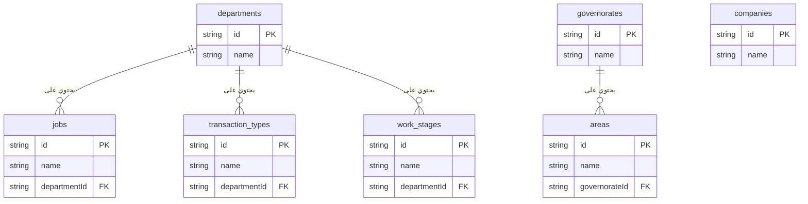

# مخطط علاقات البيانات المرجعية

هذا المستند يوضح الهيكل والعلاقات بين القوائم المرجعية المختلفة في النظام. فهم هذا الهيكل يساعد على معرفة كيفية إدارة البيانات بشكل مركزي ومنظم.

---

## الرسم البياني للعلاقات (ERD)

---

## شرح تفصيلي للعلاقات

ينقسم نظام البيانات المرجعية إلى محاور رئيسية مترابطة، مما يضمن أن تكون البيانات متسقة وسهلة الإدارة.

### 1. محور الأقسام (Departments-centric Hub)

تعتبر قائمة **الأقسام (Departments)** هي القائمة المحورية والأكثر أهمية، حيث تتفرع منها عدة قوائم أخرى.

*   **العلاقة:** علاقة "واحد إلى متعدد" (One-to-Many). كل قسم واحد يمكن أن يحتوي على العديد من الوظائف، وأنواع المعاملات، ومراحل العمل.
*   **القوائم التابعة:**
    *   **الوظائف (Jobs):** كل وظيفة (مثل "مهندس معماري"، "رسام") تكون تابعة لقسم معين (مثل "القسم المعماري"). لا يمكن تعريف وظيفة بدون ربطها بقسم.
    *   **أنواع المعاملات (Transaction Types):** كل نوع معاملة (مثل "تصميم بلدية"، "تصميم ديكور") يتم ربطه بقسم معين. هذا يسمح لاحقًا بتصفية المعاملات حسب القسم المسؤول عنها.
    *   **مراحل العمل (Work Stages):** كل مرحلة عمل قياسية (مثل "تسليم المخططات الابتدائية") يتم تعريفها تحت قسم معين.

*   **مركزية الإدارة (Source of Truth):**
    *   كما طلبت، تم جعل شاشة "إدارة الأقسام والوظائف" هي **المصدر الوحيد** لتعديل أو حذف أو إضافة الأقسام.
    *   في الشاشات الأخرى (مثل إدارة أنواع المعاملات ومراحل العمل)، تظهر قائمة الأقسام **للعرض والاختيار فقط**، ولا يمكن تعديلها من هناك. هذا يضمن عدم حدوث أي تغييرات على الأقسام عن طريق الخطأ ويحافظ على تكامل البيانات.

### 2. محور المواقع الجغرافية (Locations Hub)

هذا المحور يتبع نفس منطق الأقسام ولكن على المستوى الجغرافي.

*   **العلاقة:** علاقة "واحد إلى متعدد" (One-to-Many).
*   **القائمة الرئيسية:** **المحافظات (Governorates)**.
*   **القائمة التابعة:** **المناطق (Areas)**. كل منطقة يتم تعريفها تحت محافظة معينة. لا يمكن إضافة منطقة بدون ربطها بمحافظة.

### 3. القوائم المستقلة (Standalone Lists)

*   **الشركات (Companies):** هذه القائمة حاليًا مستقلة ولا تتبع أي قائمة أخرى. تُستخدم لإدارة بيانات الشركة أو فروعها التي قد يتم استخدامها لاحقًا في طباعة العقود أو التقارير.

### خلاصة أسلوب الربط

يعتمد النظام على **هيكل هرمي بسيط وفعال**:
1.  **قوائم رئيسية (Parent Collections):** مثل `departments` و `governorates`.
2.  **قوائم فرعية (Sub-collections):** مثل `jobs` و `areas` التي "تعيش" داخل مستندات القوائم الرئيسية.

هذا الأسلوب يوفر الفوائد التالية:
*   **التنظيم:** البيانات المرتبطة ببعضها تكون متجاورة في قاعدة البيانات.
*   **سهولة الإدارة:** عند حذف قسم (من المصدر الوحيد المسموح به)، يصبح من السهل معرفة أن جميع وظائفه وأنواعه ومراحله مرتبطة به.
*   **الأداء:** الاستعلام عن البيانات الفرعية (مثل جلب وظائف قسم معين) يكون سريعًا جدًا.
*   **التكامل:** يمنع وجود بيانات "يتيمة" (Orphaned Data) مثل وجود وظيفة بدون قسم.