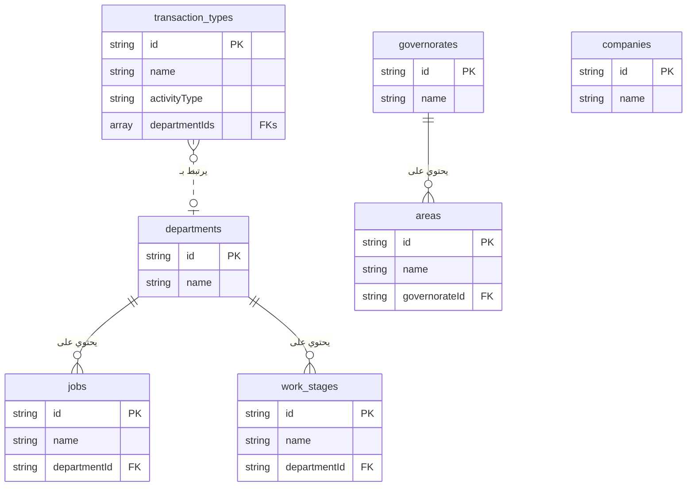

# مخطط علاقات البيانات المرجعية

هذا المستند يوضح الهيكل والعلاقات بين القوائم المرجعية المختلفة في النظام. فهم هذا الهيكل يساعد على معرفة كيفية إدارة البيانات بشكل مركزي ومنظم.

---

## الرسم البياني للعلاقات (ERD)

---

## شرح تفصيلي للعلاقات

ينقسم نظام البيانات المرجعية إلى محاور رئيسية مترابطة، مما يضمن أن تكون البيانات متسقة وسهلة الإدارة.

### 1. محور الأقسام وأنواع المعاملات

تم تعديل الهيكل ليصبح أكثر مرونة. الآن، تعتبر **الأقسام (Departments)** و **أنواع المعاملات (Transaction Types)** كيانات مركزية.

*   **الأقسام (Departments):**
    *   **العلاقة:** علاقة "واحد إلى متعدد" (One-to-Many). كل قسم واحد يحتوي على العديد من الوظائف ومراحل العمل.
    *   **القوائم التابعة:**
        *   **الوظائف (Jobs):** كل وظيفة (مثل "مهندس معماري") تابعة لقسم معين.
        *   **مراحل العمل (Work Stages):** كل مرحلة عمل قياسية (مثل "تسليم المخططات الابتدائية") يتم تعريفها تحت قسم معين.

*   **أنواع المعاملات (Transaction Types):**
    *   **العلاقة:** علاقة "متعدد إلى متعدد" (Many-to-Many) مع الأقسام. كل "نوع معاملة" (مثل "تصميم بلدية") يمكن أن يرتبط بقائمة من الأقسام المشاركة فيه.
    *   **مركزية الإدارة:**
        *   تتم إدارة الأقسام والوظائف ومراحل العمل من شاشة "إدارة الأقسام".
        *   تتم إدارة أنواع المعاملات وربطها بالأقسام من شاشة مستقلة خاصة بها.

### 2. محور المواقع الجغرافية (Locations Hub)

هذا المحور يتبع نفس منطق الأقسام ولكن على المستوى الجغرافي.

*   **العلاقة:** علاقة "واحد إلى متعدد" (One-to-Many).
*   **القائمة الرئيسية:** **المحافظات (Governorates)**.
*   **القائمة التابعة:** **المناطق (Areas)**. كل منطقة يتم تعريفها تحت محافظة معينة. لا يمكن إضافة منطقة بدون ربطها بمحافظة.

### 3. القوائم المستقلة (Standalone Lists)

*   **الشركات (Companies):** هذه القائمة حاليًا مستقلة ولا تتبع أي قائمة أخرى. تُستخدم لإدارة بيانات الشركة أو فروعها التي قد يتم استخدامها لاحقًا في طباعة العقود أو التقارير.
